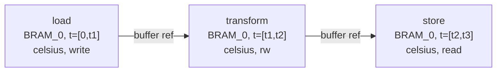
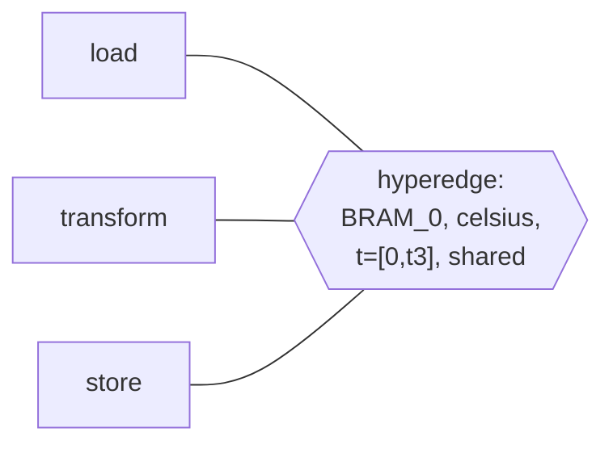

The Bermuda Triangle was the great mystery of the 1970s, the kind of story that sold twenty million copies of Charles Berlitz's paperback and gave Leonard Nimoy a full season of *In Search Of...* episodes to walk through in that baritone voice. Of course *that* phenomenon was a product of marketing and pre-Internet pop-culture amplification. By contrast, while the topic can seem mysterious, the math is firmly grounded in reality and confirms our design. When "the fog clears" and the right organizing principles emerge, we find that adjacent framing had its own way of lining up. We note our findings in order to share how this informs our design in a way that can provide greater capabilities while remaining approachable in a design-time context. 

A note on vocabulary before *the corners*. Few people outside of academic communities converse in this material, and several of the terms are being introduced here for the first time for many readers. The post uses a handful of terms from category theory and order theory: *category*, *functor*, *groupoid*, *poset*, *sheaf*, and others. We try to give them a plain-English framing the first time each term appears below. We realize that *plain English* is doing ***a lot*** of work here. The math is real, but it should be possible to connect it back to our work with a willingness to take the casual definitions at face value.

## Corner One: Dimensional Types

The Fidelity framework's Dimensional Type System is our starting point, and has [coverage](/blog/doubling-down-dmm-dts/) here on this site and [in a whitepaper on arXiv](https://arxiv.org/abs/2603.16437). It assigns to each value in a program an annotation that records its physical or mathematical units. Length, time, mass, temperature, currency, dimensionless count: each base unit is a generator of a free abelian group, and the annotation on a compound value is a vector in \(\mathbb{Z}^n\) where \(n\) is the number of base units in scope. 

Operations propagate annotations: addition requires equal vectors, multiplication adds vectors, division subtracts. Dimensional consistency reduces to a system of linear equations over \(\mathbb{Z}\), decided in polynomial time by Gaussian elimination. The result is either a consistent assignment or a contradiction. The engineer never writes a proof, because the inference is complete and principal. This is the Tier 1 fragment of the framework's verification architecture, and the [post on free proofs from dimensional types](/blog/proofs-from-dimensional-types/) makes the parametricity argument explicit.

The dimensional system has another structure that the parametricity story does not emphasize. The annotations live on every node of the Program Semantic Graph, on every operation in every MLIR dialect the program is lowered through, and on the residual evidence in the binary. The lowering passes are required to preserve them, and our design for a dual-pass architecture can re-discharge this requirement at each pass.

The compilation pipeline has an ordered structure that turns out to carry significant meaning in the mathematical framing introduced in the corners that follow. The stages form a chain: source < PSG < high-level MLIR < mid-level MLIR < low-level MLIR < binary. Each stage carries its \(\mathbb{Z}^n\)-valued annotation bundle, and each lowering pass translates annotations from one stage to the next. The property the dual-pass architecture enforces is referenced as "*compositionality*": two consecutive lowerings produce the same annotations as one direct lowering. 

<p style="text-align: center; margin: 2em 0;">
  
</p>

*The classic category theory diagram: three objects, two morphisms \(f\) and \(g\), and the composite morphism \(g \circ f\) that the category laws require to exist whenever \(f\) and \(g\) are end-to-end. Every object also carries an identity arrow from itself back to itself, often omitted from the diagram for clarity.*

Anyone who has done functional programming already has the intuition for composition: \(g \circ f\) means running \(f\) then \(g\) gives the same result as running the combined operation directly. The pipeline's compositionality condition is the same equation applied to *annotation-preserving transformations* rather than to values, and as we discovered, that condition is the defining equation of a larger mathematical structure that connects the framework's engineering to results we didn't expect when the pipeline was first designed.

## Corner Two: Tarau's Groupoid

This is where the correspondence to our work got really interesting from a theoretical perspective. Paul Tarau's work on bijective combinatorial encodings starts from a question that sounds elementary and turns out to be deep. Can finite mathematical objects of different kinds (natural numbers, finite sets, binary trees, lambda terms, multisets, permutations) be put into computable bijection with one another such that the round trips compose? If you can convert a binary tree to a natural number and back, and a natural number to a finite set and back, can the conversions be made to compose so that going tree → number → set → number → tree returns the original tree?

Tarau's answer is to route every encoding through a common type, called the Root, and to require that each encoder/decoder pair forms an isomorphism between its source type and the Root. With this discipline the round-trip equation falls out by composition. Any conversion between two sources is the composition of one source-to-Root encoding with one Root-to-target decoding, and the round trip is the composition of those compositions, which the isomorphism property guarantees is the identity.

The structure here is what category theorists call a *one-object [groupoid](https://en.wikipedia.org/wiki/Groupoid)*: a single object (the Root) carrying a collection of invertible arrows in and out of it. Each encoded type contributes one such pair of arrows, and the standard [groupoid](https://en.wikipedia.org/wiki/Groupoid) laws are what guarantee the round trips. The natural numbers \(\mathbb{N}\) are the canonical Root choice in much of Tarau's work because their order structure makes the encodings effective.

We read this as a [*functor*](https://en.wikipedia.org/wiki/Functor) from a [poset](https://en.wikipedia.org/wiki/Partially_ordered_set) to a [category](https://en.wikipedia.org/wiki/Category_(mathematics)). The base poset, in Tarau's case, is the simplest one available: a single point with no order relations at all. The target category is the category of types and isomorphisms. The functor sends the single point to the Root. Compositionality is automatic because there are no non-trivial relations in the base for composition to fail on. Tarau's contribution is the discipline (every encoder routes through Root) and the proof that the discipline is enforceable across a wide family of finite mathematical objects.

This showed us that the framework's use of \(\mathbb{Z}^n\) as the canonical representation for dimensional information is a Root in exactly Tarau's sense: every annotation, regardless of which physical or mathematical domain it originates in, translates to a vector in \(\mathbb{Z}^n\), and the round trip is an isomorphism by construction. The compositionality equation Tarau requires (round trips compose) is the same equation the dual-pass architecture enforces across MLIR lowering passes, and the same equation our [Program Hypergraph](/blog/hyping-hypergraphs/) design had been relying on for years under the name "annotation consistency across hyperedges." Tarau gave us the categorical name for a discipline the engineering had already committed to.

## Corner Three: Cellular Sheaves

The third corner introduces the term that does most of the heavy lifting here: the [*sheaf*](https://en.wikipedia.org/wiki/Sheaf_(mathematics)). Sheaves originated in algebraic topology in the 1940s and acquired their modern abstract form in the work of Alexander Grothendieck. The recent paper on cellular sheaves on finite posets ([arXiv:2502.15476](https://arxiv.org/abs/2502.15476)) is an approachable introduction and treats them as a working tool for compositional information flow, with the abstract apparatus stripped down to what an engineer can use directly. Their definition: a cellular sheaf on a finite poset \(P\) attaches a *stalk* (a value, a set, an algebraic structure) to each element of \(P\), together with *structure maps* \(D(s_1 < s_2)\) for each ordered pair, satisfying the compositionality equation

\[D(s_0 < s_1) \,;\, D(s_1 < s_2) \;=\; D(s_0 < s_2).\]

A *global section* of the sheaf is an assignment of one element of each stalk such that the structure maps send the chosen elements correctly. The paper's central computational fact is that to verify a global section it suffices to check the structure-map equations on the edges of the [Hasse diagram](https://en.wikipedia.org/wiki/Hasse_diagram) of the poset. Transitivity propagates through compositionality, so checking the immediate edges checks every longer chain.

The paper treats hypergraphs as a special case via the membership poset. A hypergraph becomes a bipartite poset where vertex \(v\) is below hyperedge \(h\) when \(v \in h\), and a sheaf on this poset is a cellular sheaf in the standard sense. Sheaves carry their own measurement apparatus called [*cohomology*](https://en.wikipedia.org/wiki/Sheaf_cohomology), which turns the failure of local consistency to extend globally into a measurable algebraic invariant. Some sheaf cohomology groups vanish on graphs (one-dimensional cell complexes) but become non-trivial on cell complexes of higher dimension, and those non-vanishing groups are exactly the obstructions that prevent extending the data attached at individual items to a globally consistent assignment across the whole poset.

Read this as a functor. The base poset is whatever poset the application requires (a hypergraph's membership relation, a process calculus's reachability relation, a compilation pipeline). The target category is whatever category of values the application carries (abelian groups, distributions, capability lattices). The functor sends each poset element to its stalk and each ordered pair to its structure map, subject to the compositionality equation. The paper's contribution is the algorithmic infrastructure for computing global sections and cohomology on arbitrary finite posets, including the hypergraph case.

As with the other two corners, the engineering was already in place before the sheaf vocabulary arrived. Our work on the [Program Hypergraph](/blog/hyping-hypergraphs/) had been carrying joint constraints across three or more operations, and the [Clifford algebra grade system](/blog/categorical-deep-learning/) had been using Cayley table elimination to verify that geometric products preserve their structural zeros through the computation graph. Both of these are sheaf conditions in retrospect: the PHG's "annotation consistency across hyperedges" is a global section condition on the hypergraph membership poset, and the Cayley table's grade preservation through training is a global section condition on the differentiation sheaf. The cellular sheaf paper gave us the formal infrastructure to see them as instances of the same equation, and to use the cohomological machinery to diagnose the cases where local consistency fails to extend globally.

The hyperedge structure that sheaf theory justifies is also what makes the framework a general systems platform rather than a single-target compiler. Joint constraints across three or more operations are the norm in [AI and machine learning workloads](/blog/categorical-deep-learning/), in [spatial dataflow on FPGAs and NPUs](/docs/design/categorical-foundations/target-architectures-compilation-strategy/), and in the [quantum substrate](/blog/quantum-optionality/) where gate fidelity, qubit connectivity, and error correction all impose irreducibly multi-way constraints on the circuit graph. The PHG is the structure that holds all of those domains in the same compilation framework, and the sheaf theory is what confirms that no simpler structure could do the same job.

## The Triangle

The three corners are three instances of the same categorical construction:

|  | Base poset | Target category | Compositionality |
|---|---|---|---|
| **DTS** | Compilation pipeline | \(\mathbb{Z}^n\)-annotation bundles | Enforced by dual-pass |
| **Tarau** | One point | Types and isomorphisms (Root-mediated) | Automatic; base is trivial |
| **Cellular sheaves** | Arbitrary finite poset (hypergraph membership) | Application-determined stalks | Theorem: check edges of Hasse diagram |

In each case the object of interest is a functor from a finite poset to a target category. In each case the compositionality equation is what distinguishes a usable structure from a collection of disconnected encodings. In each case the value of the discipline is that it lets information flow from one part of the structure to another *without the annotations degrading through composition*.

The Dimensional Type System is the case where the base is a finite linear order (the compilation pipeline) and the target category has enough structure (abelian groups and homomorphisms) for compositionality to be checked algorithmically. Gaussian elimination decides the structure-map equations at each stage, and the dual-pass architecture is the witnessing mechanism for the global section.

Tarau's groupoid is the degenerate case in which the base is a single point. The discipline reduces to "every encoder passes through Root." Compositionality is automatic because there is nothing to compose against, and the entire content of the discipline is at the level of the target category.

The cellular sheaf framework is the general case in which the base may be any finite poset and the target category may be any category in which composition is meaningful. The hypergraph case unlocks higher cohomology, which is the categorical reason joint constraints in kernel fusion or spatial tile placement cannot be reduced to binary edges. The obstruction classes that joint constraints generate live in cohomology groups that do not exist on a one-dimensional cell complex.

This is why the Program Hypergraph is necessary. The PSG carries every constraint that can be represented as a relationship between two operations and discharges them through the dual-pass architecture cleanly, but the joint constraints that arise once three or more operations need to agree on a shared resource live in cohomology groups a one-dimensional semantic graph structure cannot reach. It would be a mistake to flatten those joint constraints into pairwise edges. The structure would then lose the agreement that has to hold across all participants at once. The PHG's hyperedges are the structure that holds the more complex agreements together.

## The Engineering Flywheel

Recognizing the three corners as instances of one categorical construction means that infrastructure built for any one of them transfers, in principle, to the other two.

From the Dimensional Type System, the engineering payoff is the *dual-pass witnessing strategy*: enforce the compositionality equation locally at each edge of the Hasse diagram, and let transitivity propagate the global section. The cellular-sheaf paper's central computational fact, that edge-local checks suffice, is exactly the strategy the framework uses operationally. The framework arrived at the strategy from MLIR engineering pressure, and the paper supplies the categorical justification for why the strategy obtains such great leverage.

From Tarau, the engineering payoff is the *Root discipline*: a single canonical type through which all encoders pass, with isomorphisms guaranteeing round-trip consistency. The framework's use of \(\mathbb{Z}^n\) as the canonical representation for dimensional information is a Root in exactly Tarau's sense. Every dimensional annotation, regardless of which physical or mathematical domain it originates in, gets translated to a vector in \(\mathbb{Z}^n\), and the round trip from a domain-specific type to \(\mathbb{Z}^n\) and back is an isomorphism by construction. The Tarau discipline is what makes the compilation poset's structure maps composable in the first place.

From cellular sheaves, the engineering payoff is the *cohomological diagnosis* of two situations the framework already encounters in its design. The first is a conservative range finding from Tier 2 propagation, and the cleanest place to ground it is the constraint-resolution problem at the heart of clinical decision support: given a patient's state (weight, age, organ function, current vitals) and a clinical indication, find a dosing regime that satisfies every safety constraint simultaneously and stays inside the therapeutic window. 

Below is an example that relates to a problem we're solving for a healthcare client - the kind of workload our framework's verification stack is designed to address. This example is for a dosing calculation for a continuous infusion whose plasma concentration the prescriber needs to keep above the minimum effective level and below the toxic threshold across the full duration of the infusion:

```fsharp
open Fidelity.Physics.Clinical

// Therapeutic window for the drug
let min_effective    = 5.0<mg/L>
let max_safe         = 20.0<mg/L>

// Patient state, derived from chart at order time
let patient_weight   = Range(2.5<kg>, 4.0<kg>)        // term neonate
let creat_clearance  = Range(15.0<mL/min>, 40.0<mL/min>)  // immature renal fn

// Drug pharmacokinetics, parameterized by patient state
let volume_dist      = volumeOfDistribution patient_weight
let elim_rate        = eliminationRate creat_clearance     // k = CL / Vd
let infusion_rate    = Range(0.5<mg/kg/hr>, 2.0<mg/kg/hr>)
let infusion_time    = Range(0.5<hr>, 6.0<hr>)

// Concentration at the end of an infusion (one-compartment model)
let c_at_t = fun t ->
    (infusion_rate * patient_weight / (elim_rate * volume_dist))
    * (1.0 - exp(-elim_rate * t))

let peak_concentration = c_at_t infusion_time
```

For the linear and ratio-of-linear parts of this calculation, Tier 1 range propagation produces an exact bound from the input ranges and a proof tool discharges the comparison against `min_effective` and `max_safe` cleanly. At the `exp(-elim_rate * t)` term, the analysis switches modes. The argument `-elim_rate * t` lies in a known interval (negative, with bounds derived from the elimination-rate and infusion-time ranges), and the framework's generic interval rule for `exp` returns the conservative bound \([0, +\infty)\). Propagating that through the rest of the calculation produces a `peak_concentration` bound wide enough to overlap both the sub-therapeutic region below `min_effective` and the toxic region above `max_safe`, and the compiler surfaces the result as a conservative finding rather than a clean verdict. The bound is sound (the true concentration always lies inside it) and it is wider than the therapeutic window needs.

The cohomological reading is that the global-section problem on the range-propagation sheaf has an uncharacterized \(H^1\) obstruction at the `exp` node: the local data on the upstream side (the interval for the exponent) and the local data on the downstream side (the interval the result needs to fall into) cannot be glued into a globally consistent assignment without additional structure. The engineering reading, which is what the prescriber actually needs, is that the compiler is telling the framework precisely which Tier 3 lemma is missing from `Fidelity.Lemmas.Mathematics` for this calculation. Specifically: a parameterized lemma of the shape

\[\forall a, b \in \mathbb{R} \text{ with } a \le b : \exp([a, b]) = [\exp a, \exp b]\]

proved once from the monotonicity of \(\exp\) in an external proof assistant, instantiated by the compiler against the concrete interval the PSG carries at the `exp` node, and consulted to tighten the downstream bound. Every additional clinical model the library covers improves the set of patient-and-drug combinations the framework can give a safety verdict on. The cohomological framing is what makes "we need a lemma about \(\exp\) on a negative interval" a categorical specification the lemma library can be planned against rather than a vague blind spot in requirements. Each new lemma shrinks the space of unaddressed cases, and an engineering team can track exactly which models remain uncovered and prioritize accordingly. It's a mathematical latent space made tractable with garden-variety software engineering practice.

The second situation is kernel fusion under joint resource constraints, the original motivation for the Program Hypergraph in [Hyping Hypergraphs](/blog/hyping-hypergraphs/). Suppose the compiler wants to fuse three operations that share an on-chip buffer on an FPGA tile: a load that reads sensor input into the buffer, a transform that updates the buffer in place, and a store that hands the buffer's contents to a downstream consumer. The fusion is sound only if all three operations agree *simultaneously* on the buffer's allocation region (BRAM block at a specific address), its lifetime (the duration of the fused kernel), its dimensional annotation (`Span<float<celsius>>`), and its access pattern (read, then read-modify-write, then read). A graph-based representation can record these properties pairwise:



The pairwise edges admit annotation assignments the actual hardware cannot honor. Nothing in the graph rules out a Tier 1 lowering pass that, locally consistent on each edge, decides to allocate `BRAM_0` for the load-transform pair but `BRAM_1` for the transform-store pair, because the joint three-way constraint "all three operations share the same physical buffer" is not expressible as a property of any single edge. The hyperedge that the PHG provides is the structure that *can* express it:



The cohomological reading is that the obstructions to a globally consistent annotation assignment live in cohomology groups that exist only on cell complexes of dimension greater than one, and a graph is a one-dimensional cell complex. The engineering reading is sharper: if you try to express kernel fusion with binary edges, the representation will admit annotation assignments that the actual hardware cannot honor, because the binary edges do not have the structural capacity to rule them out. Hyperedges are the minimum structure that does. This is a categorical impossibility result on what graphs can carry, and the PHG is the minimal cell complex on which the obstruction classes for joint constraints can even be stated, much less resolved.

The reason any of this matters in practice is that in most cases none of it surfaces at the engineer's desk. The math is what justifies the tooling, and the tooling in Composer and Clef is what makes the math invisible to the engineer who only wanted to write a clinical dosing calculation or a fused kernel. A sofware engineer writes a one-compartment infusion model in plain Clef with `Fidelity.Physics.Clinical` measure types and gets either a clean `peak_concentration` bound that fits the therapeutic window or a conservative finding that names the lemma the framework's library still needs. A spatial-compute engineer writes a kernel fusion that shares an on-chip buffer across three operations and gets either a fused schedule that respects every joint constraint or a diagnostic that points at the specific constraint the schedule cannot honor. In both cases the engineer reasons in the vocabulary of their domain, and the categorical machinery underneath earns its place precisely by staying out of view. The cohomological diagnosis is the framework's way of explaining *to itself*, in terms its own verification stack can act on, what to do at the moments the engineer's tools need help. The engineer's experience is that the tools work, the diagnostics are specific, and the cases where they need to consult the lemma library directly are rare and well-isolated.

## Leading Indications

A triangle as metaphor is rarely the end of a story. In our view, it likely signals a fourth corner waiting to be identified: some other concept/object that ties the three together from above, or some application that requires all three at once.

The fourth corner this triangle suggests to us is a verification framework that uses *multiple sheaves over the same base poset simultaneously*. The four-tier Hoare correspondence is one sheaf over the compilation poset (the functional-correctness sheaf, with stalks ranging from \(\mathbb{Z}^n\) at Tier 1 to relational pRHL judgments at Tier 4). Access Hoare logic [(Beckmann & Setzer, arXiv:2511.01754)](https://arxiv.org/abs/2511.01754) is a second sheaf over the same poset, with capability-lattice stalks. Symmetry Hoare logic [(Mehta & Hsu, OOPSLA '25, arXiv:2509.00587)](https://arxiv.org/abs/2509.00587) is a third sheaf, with group-action stalks. Each sheaf has its own global-section problem, its own dual-pass discharge, and its own cohomological obstructions. They share the compilation poset and the Tarau-style Root discipline, and they can be checked simultaneously without interfering with one another.

The framework already has the operational infrastructure for this. The PSG carries the annotations for any number of sheaves simultaneously, the MLIR pipeline preserves them as opaque attributes, and the dual-pass architecture re-discharges them at each lowering. The triangle adds the categorical justification: the same base poset supports any number of compatible sheaves, and the global sections of distinct sheaves do not interfere because they are checked against distinct stalk categories. The same map applies to access control, symmetry verification, and probabilistic relational reasoning, which is why the map is worth drawing. It is both confirming of our work and indicating clear, principled paths forward.

An engineer working in Clef will write a clinical dosing calculation, a signal processing pipeline, or a fused FPGA kernel, and the framework will return either a report that the calculation is sound across the declared input ranges or a specific diagnostic naming what would need to change to make it sound. Memory safety, dimensional consistency, range bounds, and physical symmetries are all checked at compile time. Cryptographic verification is available for the modules that need it. All of it runs on the dual-pass certificate machinery the categorical content confirms for us here.

An FPGA example is already realized in a direct, approachable form in [HelloArty](https://github.com/FidelityFramework/HelloArty), where Clef source compiles through Composer to a working Artix-7 bitstream with the dimensional and coeffect guarantees intact across the boundary into hardware. The [example artifacts directory](https://github.com/FidelityFramework/HelloArty/tree/main/docs/example_artifacts) shows what the diagnostics look like in practice. That diagnostic is the categorical content outlined here, surfaced in the terminal in a form the engineer can act on directly. Working in Clef will provide more than reliable memory safety and expressive ergonomics in a concurrency-based functional model. Our goal is to make it a development environment that rewards a variety of software engineering tasks with quiet, efficient builds and the ability to maintain depth in high-leverage design spaces when the domain calls for it. 

*The fog* around this triangle cleared in the way **actual** fog *usually* does: first gradually, then all at once. [Paul Snively](https://www.youtube.com/watch?v=Cq_IstGhUv4) mentioned Tarau to Houston, and the link to the sheaf paper shortly followed. The constellation of sources that shed light on our engineering track countinues to expand, and what has emerged is more guidance to build on. It's gratifying to find so much in mathematics that confirm our direction, and it does significant work in showing the path forward. We will continue de-mystifying this domain for ourselves and for others, both in theory and in practice, as the work continues. 
