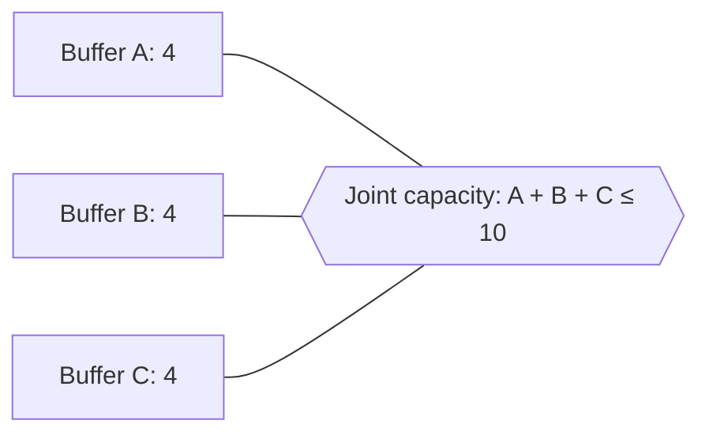
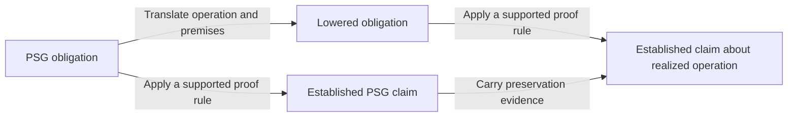

The Bermuda Triangle was a familiar mystery of the 1970s, with Charles Berlitz's paperback and Leonard Nimoy's baritone on *In Search Of...* helping it along. That mix of curiosity and forbidding subject matter seems a fitting introduction to the triangle we've encountered in our work on Clef. The connections took a while to come into focus, and we've found the view much more useful as the fog clears. Our search began with compiler engineering: how do we keep a useful fact about a program intact while changing the way that program is represented?

Our answer connects an innovation we call ***dimensional* types**, reversible encodings, along with local-to-global consistency. We encountered the categorical accounts described here *after* making many of the engineering decisions. They give us ways to state the relationships we had been relying on, and to identify what a compiler must check when those relationships meet. The vocabulary can be demanding, and we're aware of the narrow passage that might exist to frame it in plain English. We realize that *plain English* is doing a lot of work here, so the working examples will stay close to quantities, buffers, and the diagnostics an engineer would actually use, and hope that the picture emerges for the reader in due course.

## Corner One: Dimensional Types

Our Fidelity framework's [Dimensional Type System](/blog/doubling-down-dmm-dts/) retains the meaning of a quantity while the compiler resolves its implementation. A velocity has dimensions of length divided by time whether it will be stored on a CPU or transferred to an accelerator. That identity belongs in the type.

Divide a distance by an elapsed time and the velocity follows from the expression. We want the developer to be able to use that relationship in ordinary code, with the compiler doing the dimensional bookkeeping. A reusable function can carry the relationship into another calculation without asking its author to supply a separate proof each time.

For declared base measures, we can write compound dimensions as integer exponent vectors. Multiplication adds the vectors, division subtracts them, and addition requires matching dimensions. A dimensionless value has the zero vector. Kennedy's work supplies the principal inference result for this algebra: the compiler can preserve the most general dimensional relationship permitted by the program. A function that works uniformly over an unspecified dimension can keep that choice open. The [units-of-measure specification](/spec/draft/units-of-measure/) gives the language rules.

Integer exponents require integer-preserving solving. For example, an equation asking for twice an integer exponent to equal one has no solution in that domain. The checker must report that conflict rather than round an exponent or silently drop the measure. A value's range and storage lifetime have additional rules, and they participate in the same semantic graph.

In our Program Semantic Graph, or PSG, `float<m/s>` retains its dimension while the numeric representation remains open. Values, guards, and domain laws can establish a range. The selected platform declares which representations cover it. A covering representation then contributes its width and layout to memory decisions. If every offered representation excludes part of a known required range, compilation needs a located error at that commitment point.

We also need the evidence behind those decisions to survive lowering. Suppose BAREWire's layout contract establishes an offset and extent for a measured field. The PSG-level proof and the lower-level memory operation must refer to the same contract and the same field. A valid formula about a different offset would leave the intended access unverified.

  

*The familiar composition diagram. For compilation, we must establish what each arrow preserves and how its result corresponds to the next stage.*

Anyone who has composed two functions already has a useful intuition for this diagram. \(g\circ f\) means apply \(f\), then apply \(g\). Think of one arrow as taking a PSG operation into an MLIR dialect and the next as lowering it further. We need the meaning of the operation, along with the premises used to justify it, to remain connected across that sequence. Writing the arrows down makes the preservation requirement visible.

Our staged verification checks that correspondence at the relevant boundaries. A certified transformation can carry its preservation argument forward. Otherwise the compiler must establish the corresponding obligation against the lowered operation. Once a dimension has served its structural purpose, the compiler can release its representation while retaining the evidence required downstream. The precise boundary depends on the target and the operation, as described in [Information Is Not Discarded](/docs/design/structure-and-performance/information-is-not-discarded/).

## Corner Two: Tarau's Groupoid

Paul Tarau's [work on bijective data encodings](https://arxiv.org/abs/0808.2953) starts with a question that's easy to picture. Suppose we can encode a tree in a common format and recover it, and do the same for a finite set. Can we go from tree to common format to set, then take the return journey and recover the original tree? We'd like that round trip to follow from the conversions we've already checked.

Tarau offers a practical way to organize those conversions. Give each supported type an encoder and decoder through a common representation, called the Root, and establish their round-trip laws. Conversions between those types can then be assembled from the checked pairs.

The construction forms a [groupoid](https://en.wikipedia.org/wiki/Groupoid), a category in which every arrow has an inverse. Tarau's long paper chooses finite lists of natural numbers as its Root. Its usefulness comes from the family of explicit encodings and their composition. A tree can be converted to the Root and then into another supported representation, with a return path that reconstructs the original tree.

For our dimensional types, normalization provides a common representation of equivalent measure expressions. Source spellings such as `m/s` and `m*s^-1` can describe the same dimension. Recovering their shared dimensional meaning is sufficient for type equality. Preserving the original spelling for an editor is a separate source-information task.

A memory lifetime, a set of possible geometric components, and a probability distribution each require a suitable representation of their own. We can retain all three in the PSG and give each conversion a stated contract. If a transformation also carries an algebraic operation across the boundary, its contract must establish that operation's meaning there. Reconstructing a value and preserving an operation are related obligations with different tests.

We read Tarau's Root discipline as guidance for those interfaces. It gives us an economical way to organize checked conversions, with the actual round-trip law written down for each one. This was a satisfying connection to find after we had already committed to retaining dimensional meaning across representations. It gave us a developed account of how to build a family of conversions from smaller, established pieces.

## Corner Three: Cellular Sheaves

The next question comes up whenever several parts of a compiler describe the same program. The source has a measured field, the PSG has a layout fact about that field, and a lower-level operation has an address calculation. Each description may look reasonable on its own. We need to know that they agree about the field being accessed, under the translations between them. That's a useful engineering question to keep in mind as we introduce the word *sheaf*.

A [cellular sheaf](https://arxiv.org/html/2502.15476#S2.SS3) assigns a space of possible facts to each position in an ordered diagram, with maps relating those spaces. A compatible choice of facts across the diagram is a *global section*. For our compiler, the positions could be compilation stages and the facts could concern corresponding program operations.

The useful local-check result has a concrete condition. Once the translation maps obey the composition laws, one candidate assignment can be checked on the immediate edges of the order's [Hasse diagram](https://en.wikipedia.org/wiki/Hasse_diagram). Compatibility then follows along longer paths. The compiler must still justify the maps and perform the checks. Their cost depends on the obligations involved.

For someone building a pipeline out of small passes, there's a practical appeal here. We can concentrate on the boundary each pass introduces, establish how it treats the relevant facts, and use that result when composing it with the next pass. The local work contributes to an account of the whole pipeline. This is the connection we recognized from our staged verification design.

This gives us a way to distinguish two questions we encounter during implementation. Do the facts recorded at adjacent stages agree under the declared translation? Does that translation correctly describe the operations being compiled? Agreement among annotations addresses the first. A preservation proof or validation of the realized operation addresses the second.

Our proof-carrying PSG is intended to keep both accounts together. While building out the final mechanism, we retain an external verification ledger as a scaffold for comparing the graph's obligations with those generated after lowering. That comparison helps expose a missing premise or an incorrect mapping before we rely entirely on the canonical graph mechanism. But once established, the external scaffold will be taken away and the graph's own proof structure will carry the verification evidence.

[Cohomology](https://en.wikipedia.org/wiki/Sheaf_cohomology) provides further tools for suitable algebraic sheaves. Applying it to a compiler diagnostic requires a specified mathematical model of that diagnostic. The cited paper's [vertex-hyperedge membership construction](https://arxiv.org/html/2502.15476#A4.SS5), for example, has cochain spaces only in degrees zero and one. Adding participants to a hyperedge changes its arity, while this construction remains one-dimensional. We use the joint relation itself to explain why the compiler needs all of those participants *together*.

## The Triangle

We see a common engineering discipline in these three corners: retain the facts that matter, describe how they change representation, and check that the descriptions compose. Each mathematical construction contributes a different part of that discipline.

| Connection | What we retain | What we must establish |
|---|---|---|
| Dimensional types | A quantity's dimensional identity and its relationships to other quantities | The measure equations and the conditions of later representation decisions |
| Tarau's encodings | A value across a chosen change of representation | The relevant round-trip and operation-preservation laws |
| Cellular sheaves | A compatible assignment across a diagram | Composition of the maps and agreement of the assigned facts |

For our Fidelity framework, we want one proof-carrying architecture in which these relationships remain explicit. A BAREWire transfer, for example, involves the source quantity, its chosen storage format, and a communication contract. Dimensional equality checks one part of that transfer. Layout and numeric fidelity checks establish other parts. The joint constraint must retain their dependencies so that a later compiler stage can use the established result.

The [Program Hypergraph](/docs/internals/pipeline/hyping-hypergraphs/) is our way of representing such obligations with their participants intact. We can draw a hyperedge directly or implement its incidence through an auxiliary graph node. In either form, the compiler must retain the full relation, the identities of its participants, and the premises used to establish it.

## The Engineering Flywheel

The investment we'd like to compound is the work of making a useful fact available wherever a program needs it. A checked conversion can serve another boundary with the same contract. A theorem about a mathematical operation can support many calculations once each supplies its premises. The common graph gives us a place to retain those applications and track what they depend on. That's where these mathematical connections start to affect the day-to-day experience of using the language.

The most useful result for a developer would be a specific answer at the point where a program needs more evidence. Our intended language services should be able to identify an applicable library law, show the premises it needs, and carry the resulting fact into the rest of the calculation. That would make additions to a lemma library useful across many programs.

### A Range Finding

One example comes from our work toward clinical decision support. An engineer is working with a concentration model and needs to establish whether a proposed infusion meets a declared therapeutic requirement over a stated interval. The inputs may be ranges, reflecting what the application knows about the patient's state and the model parameters. The useful answer would identify which combinations satisfy the requirement, or where more information is needed.

A one-compartment model for an initially zero concentration during a constant infusion has the form

\[
C(t)=\frac{R}{kV}\left(1-e^{-kt}\right),
\]

where \(R\ge0\) is the administered amount per unit time, \(V>0\) is the distribution volume, \(k>0\) is an elimination-rate constant, and \(t\ge0\) is elapsed time. These are model inputs with declared units and bounds. The application's domain contract must state the interval of time and the concentration requirement being checked.

Our dimensional checker can establish that \(kt\) is dimensionless and that \(C\) has units of amount per volume. A range analysis can then enclose the result using the supplied bounds. Repeated use of a parameter may require retaining relationships between its occurrences to obtain a useful enclosure. Division also requires the relevant denominator to stay away from zero.

Consider the exponential term on its own. If its argument lies in \([a,b]\), a library rule can use monotonicity to establish

\[
\exp([a,b])=[\exp(a),\exp(b)].
\]

An interval implementation with this rule can already use it. If an analyzer has only a coarse enclosure available, the same theorem is a candidate for refining that step. For a machine computation, the endpoint evaluation and the actual exponential implementation need suitable error bounds as well.

The compiler can instantiate the theorem using the bounds in the PSG, check its premises, and propagate the refined result. This is a deterministic mathematical fact. A probability model becomes relevant when the application asks a probabilistic question, such as a bound on the chance of leaving a stated range under a declared input distribution.

The engineer is still working on a concentration calculation. A useful finding would identify the bound the analysis could not establish and the particular relationship that could improve it. If the missing step is a known property of the exponential, the tooling can offer that property at the expression where it applies. This gives the developer a manageable next decision while keeping the mathematical justification available for inspection.

In the editor, we would like the analyzer to mark the affected region and suggest an applicable lemma. Accepting it would apply the lemma and dispatch the premises. Proof annotations could be expanded or hidden by preference, with a marker retaining the region's proof status. Changing a parameter or assumption would invalidate the affected evidence in either view.

A tighter enclosure may prove the requested bound, expose a contradiction, or leave a further obligation. Even with an exact model calculation, the applicability of that model to the patient remains part of the domain justification. The tooling should make the property and its premises inspectable at the source.

### A Shared Memory Budget

For a spatial-compute example such as FPGA, suppose a target declares ten units of available local storage, and a proposed fused operation requires three distinct buffers of four units each to be live at the same time. Each buffer fits. Every pair fits. The three together require *twelve* units.

```mermaid
graph LR
    A["Buffer A: 4"] --- H{{"Joint capacity: A + B + C ≤ 10"}}
    B["Buffer B: 4"] --- H
    C["Buffer C: 4"] --- H
```

Our PHG would retain that aggregate requirement together with the liveness and placement facts that justify counting all three buffers. A different schedule might permit reuse of storage. That would require proving the new lifetime relationship, then checking the resulting layout against the same target declaration.

A shared-identity requirement is simpler. If the load and transform use the same buffer, and the transform and store use that same buffer, equality already connects all three. The capacity example needs an additional aggregate predicate. Keeping both kinds of fact explicit lets the compiler use the appropriate procedure for each, while keeping the tooling and analysis in a "pit of success" supportive role.

BAREWire's memory, IPC, and network contracts give this account a practical scope. A buffer's local layout can differ from its transmitted form. A serialization boundary therefore needs the applicable encoding relation alongside the dimensions and bounds, and those obligations belong in the PSG before the lower-level memory operations are generated. These are all considerations we anticipate bringing along with the tooling that supports the developer's workflow.

In either example, we want the finding to use the vocabulary of the engineer's work. One developer needs to see why a concentration bound remains open. Another needs to see which simultaneously live buffers exceed the available storage, and whether a change in schedule would permit reuse. The categorical account helps us organize the machinery that produces those answers. The ordinary source view can stay focused on the calculation or the kernel.

## Leading Indications

We also want to connect the compilation stages to the different forms of symbolic reasoning available at each stage. Lowering can change the representation of a computation. A proof-mode transition changes the rules used to establish a claim about it. The same operation can participate in both.

```mermaid
graph LR
    A["PSG obligation"] -->|"Translate operation and premises"| B["Lowered obligation"]
    A -->|"Apply a supported proof rule"| C["Established PSG claim"]
    B -->|"Apply a supported proof rule"| D["Established claim about realized operation"]
    C -->|"Carry preservation evidence"| D
```

When both routes are available, we need evidence that their conclusions concern the corresponding property of the realized operation. One route may use a library theorem while another may intrinsically validate the generated arithmetic. The proofs can differ in form. Their interpretation and assumptions must agree at the boundary where the result is used.

That is the direction in which we use the [two-axis and fibered account](/docs/internals/verification/mode-shifts/). A fiber would describe the proof contexts over a chosen position in the indexing structure. Transitions would transport judgments between positions under declared laws. Specifying those positions and transport laws is part of our construction. The sheaf account then concerns compatibility across the resulting diagrams.

[Categorical Deep Learning](/docs/design/categorical-foundations/categorical-deep-learning-adjoint-correspondence/) gives us a related way to study parameterized computations and comparisons between them. Hăvărneanu's *Classical Adjoint Logic* provides a proof-theoretic account of shifts between modes, including explicit conditions for composing proofs. We intend to apply these ideas to one compiler architecture, with the interpretation of each connection stated at its interface. Reusable lemmas can then support an application across proof strata without making the developer repeat the underlying derivation.

Ohori's [*A Proof Theory for Machine Code*](https://doi.org/10.1145/1286821.1286827) made the compilation direction especially satisfying to recognize. He derives compilation through transformations between proof systems, then proposes treating each intermediate language as a proof system and each compiler step as a proof transformation. For us, that gives the small-pass architecture a precise job: each pass must establish how its output preserves the claims and assumptions that matter at its boundary. We saw this as confirmation of our dual stage proof dispatch in the Semantic Graph (design time) and the middle end (build time) as embodying Ohori's insight, but we also see that work going deeper than those highest stages of compilation.

There is an algorithmic-information connection here too. Given a shared library of laws and proofs, an application can describe a justification by its theorem reference, parameters, and evidence for the premises. [Conditional Kolmogorov complexity](https://homepages.cwi.nl/~paulv/papers/info.pdf) is a way to discuss description length relative to that supplied context. We can measure a concrete encoding without claiming that the compiler finds a globally shortest description. The library's size and the cost of checking its applications remain part of the engineering account.

Those were confirming signals for our design, in which we saw the structure as an engineering necessity. The compiler can preserve a justification through changes in representation, and each application can reuse the established structure while supplying the evidence particular to its case.

This also gives us a way to approach access permissions, geometric symmetries, and probabilistic properties within the same architecture. Our [compilation-sheaf account](/docs/design/categorical-foundations/the-compilation-sheaf/#three-sheaves-three-hoare-logics) develops that broader reach. Each analysis contributes its own rules, and the graph records where their premises meet. A change in representation might affect both a layout proof and permission to perform an access. Retaining that dependency lets us identify which evidence needs to be reconsidered.

For the developer, the intended benefit is ordinary source code with enough retained structure for the compiler to explain a dimensional relationship, a placement decision, or an applicable proof without additional hand annotation. The [HelloArty example](https://github.com/FidelityFramework/HelloArty) and its [recorded build artifacts](https://github.com/FidelityFramework/HelloArty/tree/main/docs/example_artifacts) provide a concrete FPGA path to inspect, including the distinction between an early timing estimate and vendor timing signoff. That kind of artifact-specific evidence gives confidence that our approach holds and can be applied to a variety of processor targets.

[Paul Snively](https://www.youtube.com/watch?v=Cq_IstGhUv4) was kind enough to introduce Tarau's work (along with other formalism pointers) to Houston, and the sheaf paper followed. We are still using concepts developed from those conversations to sharpen the interfaces between the pieces.

*The fog* around this triangle cleared in the way **actual** fog *usually* does: first gradually, then all at once. The constellation of sources that shed light on our engineering track continues to expand, and what has emerged is more guidance to build on. It's gratifying to find so much in mathematics that confirms our direction, and it does significant work in showing the path forward. We will continue de-mystifying this domain for ourselves and for others, in theory and in practice as the work continues.
