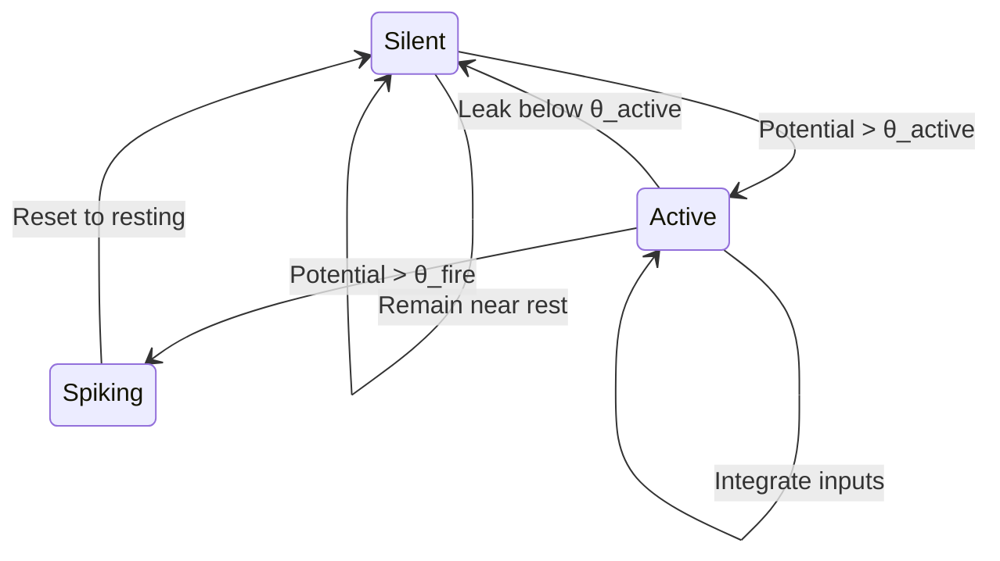

Transformers have delivered broad capabilities, and their energy consumption scales with that reach. The human brain operates on roughly 20 watts, processing large volumes of information through sparse, event-driven spikes, at least as we currently understand it. Current AI systems consume thousands of watts to support narrow inference capabilities, forcing dense matrix operations through every computation. That gap is the starting point for this design.

Spiking Neural Networks (SNNs) take a different path, one that neuromorphic processors have begun to realize in silicon. Despite decades of research and steady hardware progress, SNNs remain difficult to train and deploy. As with many algorithmic methods, efficient and accurate gradient calculation has been the constant challenge. For those who have worked in the field for years, the core question is how to compute gradients through discrete, non-differentiable spike events.

This post works through a convergence of three ideas: ternary number systems, forward-mode gradient computation, and spiking neural processing. Coupled with our Fidelity framework design, they bring heterogeneous architectures into a single coherent compilation target. We theorize that this combination lets the multi-state hardware already in silicon do work the current binary algorithms leave on the table.

## Ternary Representation: Beyond Binary States

Modern spiking neural network algorithms, as described in the Multi-Plasticity Synergy Learning (MPSL) framework[^2], operate on a binary principle despite running on far more capable hardware. The Leaky Integrate-and-Fire equation from the paper defines spike generation as:

\[
S^{t,l} = \Theta(U^{t,l} - V_{th}) = \begin{cases}
1, & U^{t,l} \geq V_{th} \\
0, & U^{t,l} < V_{th}
\end{cases}
\]

This binary representation, spike (1) or silent (0), has been the algorithmic convention in neuromorphic computing, not because of hardware limitations, but due to historical precedent and the mathematical challenges of training. Some neuromorphic processors like Intel's Loihi 2 support graded spikes with up to 32-bit payloads, programmable neuron models, and thousands of states per neuron. The hardware already runs ahead of the theoretical conventions. Even the MPSL framework, which combines multiple learning mechanisms (Spatio-Temporal Backpropagation or STBP for gradient-based learning, Hebbian plasticity for correlation-based local learning, and Self-Backpropagation or SBP for local feedback without explicit gradients), constrains itself to binary representations despite the hardware's richer capabilities.

### Lessons from Biology

Biological neurons exhibit richer dynamics, and that detail contributes to the model. Between rest and firing, neurons spend time in distinct computational regimes, processing information without generating spikes. A binary SNN cannot represent that intermediate processing at all.

Consider what happens in the binary model. A neuron accumulating toward threshold carries temporal information about recent inputs, and that information vanishes the moment we sample its state. If the membrane potential is at 0.9 × threshold, the binary representation sees only "0", identical to a neuron at rest. This discretization discards the temporal information that drives spike-timing computation.

### The Computational Regime Model

Our encoding separates the continuous membrane potential dynamics from the discrete computational regimes that neurons occupy. Biological neurons carry a continuous voltage, and they also occupy distinct operational modes based on that voltage:

- **Silent/Resting**: Near the resting potential (typically -70mV), the neuron is minimally responsive, with leak currents dominating
- **Active/Integrating**: Depolarized but below firing threshold (between -55mV and -40mV), actively accumulating and processing inputs
- **Spiking/Firing**: Above threshold, generating output spikes

This biological reality maps naturally to a ternary encoding that captures computational regime, not just voltage:

\[
\text{TernaryState} = \begin{cases}
0 & \text{Silent (near resting potential)} \\
-1 & \text{Active (integrating, between thresholds)} \\
+1 & \text{Spiking (above firing threshold)}
\end{cases}
\]

The continuous membrane potential \(U\) maps to discrete states via two thresholds:
- \(\theta_{active}\): Transition from silent to active integration
- \(\theta_{fire}\): Spike generation threshold

This preserves critical information about neurons actively integrating inputs (\(U \in [\theta_{active}, \theta_{fire})\)) that binary representations discard.

### Leveraging New Hardware

This observation leads to our core design choice: expand the algorithmic state space to match what the hardware already supports. The MPSL paper advances the field through multiple learning mechanisms, and it follows the convention of binary spike representation, which leaves multi-level hardware states unused. Our ternary encoding targets the multi-level states these processors already provide.

This requires no hardware modification. It uses the hardware as designed. Intel's Loihi 2 can represent 4096 states per neuron, and SambaNova's RDU can reconfigure for arbitrary word-level operations. The active state (-1) captures neurons that are integrating inputs but have not yet reached firing threshold, preserving the temporal context that binary algorithms discard.

```fsharp
type TernarySpikingNeuron = {
    Potential: Posit<16, 1>      // continuous membrane potential
    RestingPotential: float32    // baseline (-70mV)
    ActiveThreshold: float32     // activation begins (-55mV)
    FiringThreshold: float32     // spike generation (-40mV)
    State: TernaryState          // discrete computational regime
}

let computeState (potential: Posit<16,1>) (neuron: TernarySpikingNeuron) =
    match Posit.toFloat32 potential with
    | p when p >= neuron.FiringThreshold -> Spiking   // +1
    | p when p >= neuron.ActiveThreshold -> Active    // -1
    | _ -> Silent                                      // 0

let updateNeuron (neuron: TernarySpikingNeuron) (input: float32) =
    // Leaky Integrate-and-Fire, continuous domain
    let leak = (neuron.Potential - neuron.RestingPotential) * leakRate
    let newPotential = neuron.Potential - leak + Posit.fromFloat32 input

    let newState = computeState newPotential neuron

    // reset only after spike
    match newState with
    | Spiking ->
        { neuron with
            State = Spiking
            Potential = Posit.fromFloat32 neuron.RestingPotential }
    | otherState ->
        { neuron with
            State = otherState
            Potential = newPotential }
```



## Breaking the Backpropagation Dependency

#### The Surrogate Gradient Problem

The MPSL paper, like virtually all modern SNN training approaches, relies on surrogate gradients to handle the non-differentiable spike function. As the paper states in Equation 6:

\[
\frac{\partial S^{t,l}}{\partial U^{t,l}} \approx u'(U^{t,l}, V_{th})
\]

This approximation replaces the undefined gradient with a smooth surrogate function. The substitution introduces instability and limits learning efficiency, because the spike function it stands in for is not smooth. Every major SNN training method depends on this workaround, including STBP, BPTT, and the MPSL approach.

#### The Forward Gradient Approach

Work by Baydin, Pearlmutter, Siskind and Syme[^1] gives an alternative that removes the surrogate entirely. The forward gradient method computes unbiased gradient estimates using only forward-mode automatic differentiation:

\[
g(\theta) = (\nabla f(\theta) \cdot v) v
\]

Where \(v\) is a random perturbation vector. This formula has direct consequences for SNNs:

1. **No surrogate needed**: The directional derivative \(\nabla f(\theta) \cdot v\) can be computed exactly even for discrete spike functions
2. **Single forward pass**: Removes the entire backward propagation phase
3. **Unbiased estimator**: Its expectation equals the true gradient, so it converges in expectation rather than on any single pass
4. **2x speedup**: The paper demonstrates training neural networks up to twice as fast as backpropagation

### What Forward Gradients Resolve for SNNs

The forward gradient approach addresses the problem at the center of SNN training. Where the MPSL framework resorts to rectangular surrogate functions (Equation 7 in their paper), forward gradients handle discrete transitions directly:

```fsharp
let computeStateGradient (potential: Posit<16,1>) (thresholds: Thresholds) =
    // directional derivative exists at transition boundaries
    let perturbation = samplePerturbation()
    let perturbedPotential = potential + perturbation

    let originalState = computeState potential thresholds
    let perturbedState = computeState perturbedPotential thresholds

    if originalState <> perturbedState then
        perturbation  // sensitivity at boundary
    else
        Posit.zero   // no transition

let trainTernarySNN (network: SpikingNetwork) =
    let v = samplePerturbation<Posit<16,1>>()

    // single forward pass over a discrete spike function
    let output, directional =
        Furnace.ForwardMode.evaluateWithDerivative network v

    let forwardGradient = directional * v  // unbiased estimate
    updateSynapticWeights forwardGradient
```

Discreteness does not break the directional derivative. When a perturbation causes a state transition (Silent → Active, Active → Spiking), the derivative captures that sensitivity exactly. When it does not, the derivative is zero. The expectation over random perturbations recovers the full gradient with no surrogate term.

## Biological Plausibility Through Global Signals

The forward gradient paper notes that this approach can be interpreted as "feedback of a single global scalar quantity that is identical for all computation nodes"[^1]. That maps onto biological neuromodulatory systems:

- Dopamine for reward signaling
- Serotonin for mood regulation
- Acetylcholine for attention modulation

Combined with the MPSL framework's multiple plasticity mechanisms[^2], this gives a learning system whose global scalar feedback has a biological analog, where the weight-transport that backpropagation requires has none.

### Hebbian Plasticity Through State Transitions

The forward gradient approach combines with local Hebbian rules keyed to our ternary state transitions:

\[
\Delta w_{ij} = \eta \cdot (\nabla f \cdot v) \cdot P(\text{State}_j | \text{State}_i)
\]

Where weight updates depend on state transition probabilities:
- **Silent → Active**: Potentiation (strengthen connection)
- **Active → Spiking**: Hebbian reinforcement
- **Spiking → Silent**: Refractory adjustment

This extends the MPSL framework's multi-plasticity approach, which already combines STBP, Hebbian, and SBP mechanisms. Our ternary states give these learning rules more transition information to work with:

```fsharp
let updateSynapticWeights (network: SpikingNetwork) (weight: Posit<16,1>) =
    let v = sampleGaussian<Posit<16,1>>()

    // directional derivative, no surrogate term
    let directional = computeDirectionalDerivative network v

    let gradient = directional * v  // unbiased estimate

    // weight by state-transition probability
    match (preState, postState) with
    | (Silent, Active) ->
        weight + learningRate * gradient * potentiationFactor
    | (Active, Spiking) ->
        weight + learningRate * gradient * hebbianFactor
    | (Spiking, Silent) ->
        weight - learningRate * gradient * depressionFactor
    | _ -> weight
```

## Posits: The Natural Language of Membrane Dynamics

The Leaky Integrate-and-Fire equation from the MPSL paper shows why posit arithmetic suits SNNs:

\[
U^{t,l} = \rho_m(U^{t-1,l} - S^{t-1,l}V_{th}) + I^{t,l}
\]

This equation involves:
- Exponential decay (\(\rho_m\))
- Threshold comparisons
- Accumulation of many small inputs

Posit arithmetic's variable precision naturally matches these requirements:
- **High precision near threshold**: Where spike/no-spike decisions are critical
- **Lower precision for strongly polarized states**: Where exact values matter less
- **Exponential representation**: Natural for the \(\rho_m\) decay factor
- **Exact accumulation via quire**: No rounding errors during integration

```fsharp
let computeMembranePotential (current: Posit<32,2>) (input: Posit<32,2>) =
    use quire = Quire<32, 512>.Zero  // exact accumulation

    quire.AddProduct(current, decayRate)  // decay current potential

    // weighted inputs accumulate without intermediate rounding
    for synapse in activeSynapses do
        quire.AddProduct(synapse.Weight, synapse.Input)

    quire.ToPosit()  // single rounding at the end
```

## Integration with Furnace Auto-Differentiation

[The Furnace library](https://github.com/fsprojects/Furnace), originally developed as 'DiffSharp' by the same team behind the forward gradient work (Syme, Baydin, Pearlmutter and Siskind), gives us the forward-mode AD foundation for SNNs:

```fsharp
module Furnace.Neuromorphic =
    let trainSpikingNetwork (network: TernarySpikingNetwork) (data: SensorData) =
        let forwardGradient = furnace {
            let! v = sampleStandardNormal network.ParameterShape

            // single forward pass yields output and directional derivative
            let! output, directional =
                ForwardMode.evaluateWithDirectional network data v

            return directional * v  // E[g] = ∇f
        }

        network.UpdateWeights forwardGradient
```

This reuses what the forward gradient paper demonstrated: training neural networks "without backpropagation" while remaining "computationally competitive"[^1], with up to 2x speedup over backpropagation.

## Hardware Capabilities Already in Silicon

Modern neuromorphic processors and Coarse-Grained Reconfigurable Architectures (CGRAs) already carry the capabilities our approach depends on. What they lack is software that targets them.

Intel's Loihi 2 is not limited to binary spikes. It supports:
- **Graded spikes** with up to 32-bit integer payloads
- **Programmable neuron models** via microcode that can implement arbitrary dynamics
- **Up to 4096 states per neuron**, not just spike/no-spike
- **Ternary weight matrices** already demonstrated in recent implementations

IBM's TrueNorth, BrainChip's Akida, and other neuromorphic processors similarly offer programmable models and multi-bit communications. The limit has been the algorithms, not the silicon.

#### CGRAs for Adaptive Topologies

Coarse-Grained Reconfigurable Architectures from companies like NextSilicon and SambaNova offer further flexibility:

| Platform | Architecture | Key Advantage for SNNs |
|----------|-------------|------------------------|
| NextSilicon Maverick | Runtime reconfigurable dataflow | Automatically tunes to code patterns, no manual optimization needed |
| SambaNova RDU | Reconfigurable at each clock cycle | Can morph between neural and conventional processing dynamically |
| General CGRAs | Word-level reconfigurable arrays | Natural fit for ternary representations and posit arithmetic |

As SambaNova describes it, their RDU is "an array of compute and memory on chip" that can be reconfigured to match the computational pattern needed. This suits CGRAs to:
- **Ternary state machines** that map to word-level operations
- **Posit arithmetic** implementations on the reconfigurable compute units
- **Dynamic network topologies** that adapt during runtime
- **Mixed conventional/neuromorphic** workloads in the same chip

### Hardware Capability Summary

| Feature | Neuromorphic (Loihi 2) | CGRAs (SambaNova/NextSilicon) | Fidelity Framework |
|---------|------------------------|-------------------------------|-------------------|
| State representation | Up to 4096 states/neuron | Arbitrary via reconfiguration | Ternary mapping |
| Arithmetic precision | 8-32 bit configurable | Word-level operations | Posit arithmetic |
| Learning capability | Programmable plasticity | Runtime adaptable | Forward gradients |
| Computation model | Event-driven spikes | Dataflow reconfigurable | Both paradigms |
| Programming model | Microcode/assembly | High-level dataflow | Clef unified abstraction |

### The Reality of Hybrid Compute

In practice, CGRA and neuromorphic processors rarely operate as the sole component to a solution. They're deployed in heterogeneous systems as accelerators:
- **On-die integration**: Accelerators alongside conventional CPU/GPU cores
- **CXL coherent memory**: Shared memory spaces between neuromorphic and traditional processors
- **PCIe accelerators**: Accelerator cards working within host systems
- **Edge hybrids**: Low-power neuromorphic/CGRA units paired with DSPs or microcontrollers

Our Fidelity framework design, and the Composer Hypergraph in particular, treats this as a "control flow to data flow" transformation, which is what these heterogeneous deployments need:

```fsharp
[<CompileToNeuromorphic>]
let neuromorphicCore (neurons: TernarySpikingNeuron array) =
    neuromorphic {
        let! target = detectNeuromorphicPlatform()

        match target with
        | Intel_Loihi2 config ->
            configureLoihi config
        | IBM_TrueNorth config ->
            configureTrueNorth config
        | BrainChip_Akida config ->
            configureAkida config
        | Infineon_Neuromorphic config ->
            configureInfineon config
        | FPGA_Emulation config ->
            configureFPGAEmulation config
        | CPU_Simulation fallback ->
            // Graceful degradation to CPU simulation
            configureCPUSimulation fallback

        // Common neuromorphic operations
        return! compileToDataFlow neurons
    }
```

### Platform-Specific Implementation Strategies

As we currently conceive it, our approach maps this design across several hardware architectures:

**On Neuromorphic Processors (Loihi 2)**:
```fsharp
[<CompileToLoihi>]
let ternaryNeuronLoihi (state: int32) (input: int32) =
    // Loihi 2 carries up to 4096 states; we use 3, as microcode
    match state with
    | -1 -> processActive input         // state 0-1365
    | 0  -> processSilent input         // state 1366-2730
    | 1  -> processSpike input          // state 2731-4095
```

**On CGRAs (SambaNova RDU, NextSilicon Maverick)**:
```fsharp
[<CompileToCGRA>]
let ternaryNeuronCGRA (neurons: TernaryNeuron array) =
    cgra {
        let! pe_array = allocatePEs (neurons.Length)

        for pe in pe_array do
            pe.ConfigureForTernary()     // word-level ternary ops
            pe.SetPositPrecision(16, 1)  // native posit support

        // dataflow scheduled by the platform
        return dataflowProcess neurons
    }
```

CGRAs fit here because they can:
- Reconfigure arithmetic units for posit operations at runtime
- Adapt dataflow patterns based on spike density
- Move between neural and conventional processing on the same fabric
- Run the forward gradient computation in parallel across PEs

Each learning mechanism operates on appropriate hardware:
- **STBP (Spatio-Temporal Backpropagation)**: Gradient-based learning that propagates errors through both space (layers) and time (timesteps)
- **Hebbian Plasticity**: Local learning based on the principle "neurons that fire together, wire together"
- **SBP (Self-Backpropagation)**: Local feedback mechanism that approximates gradients without explicit error propagation

The ternary states provide richer information than binary for all three mechanisms. The MPSL paper's choice to use binary states was algorithmic convention, not hardware necessity.

Each learning mechanism operates independently on parallel cores, then combines via learnable coefficients as described in the MPSL paper:

\[
W^l = \sum_{i=1}^{3} \lambda_i W_i^l
\]

Where \(\lambda_i\) are adaptively learned mixing coefficients, optimized through local feedback using forward gradients, not global backpropagation.

## Performance Projections

We project the following efficiency gains from combining ternary representations, forward gradient training, and acceleration hardware, measured against both conventional approaches and existing binary SNNs:

| Metric | GPU (A100) | Binary SNN (Multi-Plasticity)[^2] | Ternary + Forward Gradient | Improvement vs GPU |
|--------|------------|-----------------------------------|---------------------------|-------------------|
| Power (Inference) | 400W | 50W | 1-5W | **80-400x** |
| Power (Training) | 400W | 100W | 2-10W | **40-200x** |
| Latency (per spike) | 10μs | 1μs | 10-100ns | **100-10000x** |
| Training passes | 2 (fwd+bwd) | 2 (fwd+bwd) | 1 (fwd only) | **2x** |
| Gradient accuracy | N/A | Surrogate | Exact | **No surrogate term** |
| Information preserved | N/A | Binary states | Ternary states | **50% more** |
| Biological correspondence | None | Medium | High | **Higher** |

*Note: Performance varies by neuromorphic processor and deployment configuration.*

The forward gradient approach demonstrated 2x speedup over backpropagation in conventional networks[^1]. For SNNs, the advantage is even greater since we eliminate the surrogate gradient approximation entirely.

## Roadmap

### Phase 1: Foundation
- Implement ternary SNN models in our Fidelity framework
- Integrate forward gradient training via Furnace
- Develop a neuromorphic backend for our Composer compiler
- Demonstrate MNIST/CIFAR-10 benchmarks

### Phase 2: Hardware Integration
- Intel Loihi 2 support with ternary neuron models
- BAREWire integration for event streaming
- Posit arithmetic emulation on fixed-point units
- Heterogeneous CPU-neuromorphic demonstrations

### Phase 3: Platform Expansion
- Support for IBM TrueNorth, BrainChip Akida
- FPGA-based neuromorphic emulation
- Cloud deployment with neuromorphic simulation
- Edge deployment on heterogeneous SoCs

### Phase 4: Applications
- Real-time sensor fusion for robotics
- Ultra-low-power edge AI
- High-throughput inference systems
- Continuous learning systems

## Where Our Framework Fits

The hardware is already here, and current software addresses only part of it. Current neuromorphic software treats these processors as binary spike generators, using a fraction of their states. CGRAs from NextSilicon and SambaNova are often programmed with conventional approaches that do not use their reconfigurable structure. Our framework targets this gap by:

1. **Using existing hardware features**: Ternary states map to the multi-bit spikes and programmable neurons already in silicon
2. **Removing the surrogate approximation**: Forward gradients replace the surrogate gradient that has limited SNN training
3. **Providing one compilation target**: [Clef](https://clef-lang.com) code that compiles to both neuromorphic and CGRA backends

### Platform-Specific Advantages

**For Neuromorphic Processors (Intel, IBM, BrainChip)**:
- Use the full state space (4096 states, not just 2)
- Encode richer information through graded spikes
- Run online learning without backpropagation

**For CGRAs (NextSilicon, SambaNova)**:
- Word-level operations for ternary representations
- Runtime reconfiguration for adaptive neural topologies
- Neural and conventional processing on the same fabric

**For Heterogeneous Systems**:
- Neuromorphic cores for spiking dynamics
- CGRA/GPU for dense operations when needed
- CPU for orchestration and control flow
- All unified through BAREWire's zero-copy communication

### Why These Pieces Line Up Now

Three classes of platform now carry the capabilities advanced SNNs need: neuromorphic processors, CGRAs, and heterogeneous systems that combine them. The remaining gap is the software layer, one that can:
- Train these networks without the surrogate gradient approximation
- Deploy across diverse hardware without a rewrite per target
- Address the full state space and precision of modern silicon

Our Fidelity framework, with forward gradient training, is the design we are building to fill that gap.

## Today's and Tomorrow's Silicon

The gating constraint is software, not new silicon. Neuromorphic chips carry multiple states per neuron, and the field's algorithms have used two. CGRAs can reconfigure every clock cycle, and conventional programming treats them as fixed architectures. The hardware is in place, and the algorithms have room to catch up.

We theorize that combining ternary spiking neural networks with forward gradient training, on the classical hardware that already ships, addresses the surrogate gradient problem that has held SNN training back. We have found no other representative implementation of this combination in the standing literature we have reviewed. Matching the encoding to the multi-state hardware is what recovers the efficiency that neuromorphic computing has projected for years.

The pieces this rests on:
- **Ternary modeling** targets the multi-state capabilities already in neuromorphic processors and CGRAs, capturing distinct computational regimes of biological neurons
- **Forward gradients** train without the surrogate approximations that have constrained the field
- **Posit arithmetic** maps to the word-level operations of CGRAs and the programmable precision of neuromorphic chips
- **Existing hardware** from Intel, IBM, BrainChip, NextSilicon, and SambaNova is available today

Our control-flow to data-flow compilation, forward gradient training through Furnace, and platform-agnostic backend are the layer that connects this hardware capability to a working SNN. That is where our current interest lies, and we will keep building the design toward the heterogeneous targets the rest of this post names as the work continues.

---

[^1]: Baydin, A. G., Pearlmutter, B. A., Syme, D., Wood, F., & Torr, P. (2022). Gradients without Backpropagation. arXiv preprint arXiv:2202.08587.

[^2]: Liu, Y., Deng, X., & Yu, Q. (2024). Multi-Plasticity Synergy with Adaptive Mechanism Assignment for Training Spiking Neural Networks. arXiv preprint arXiv:2508.13673v1
