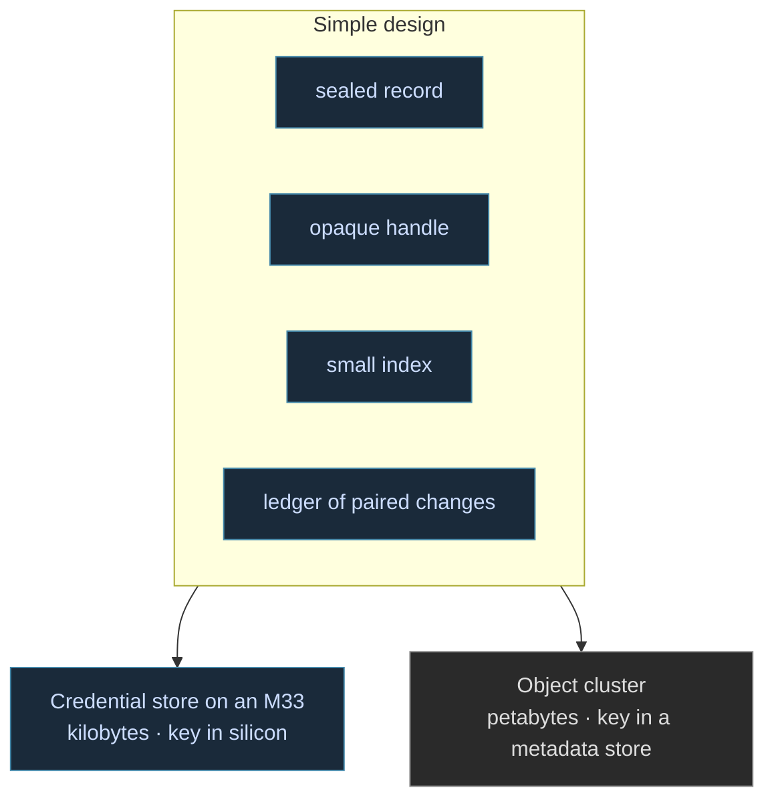
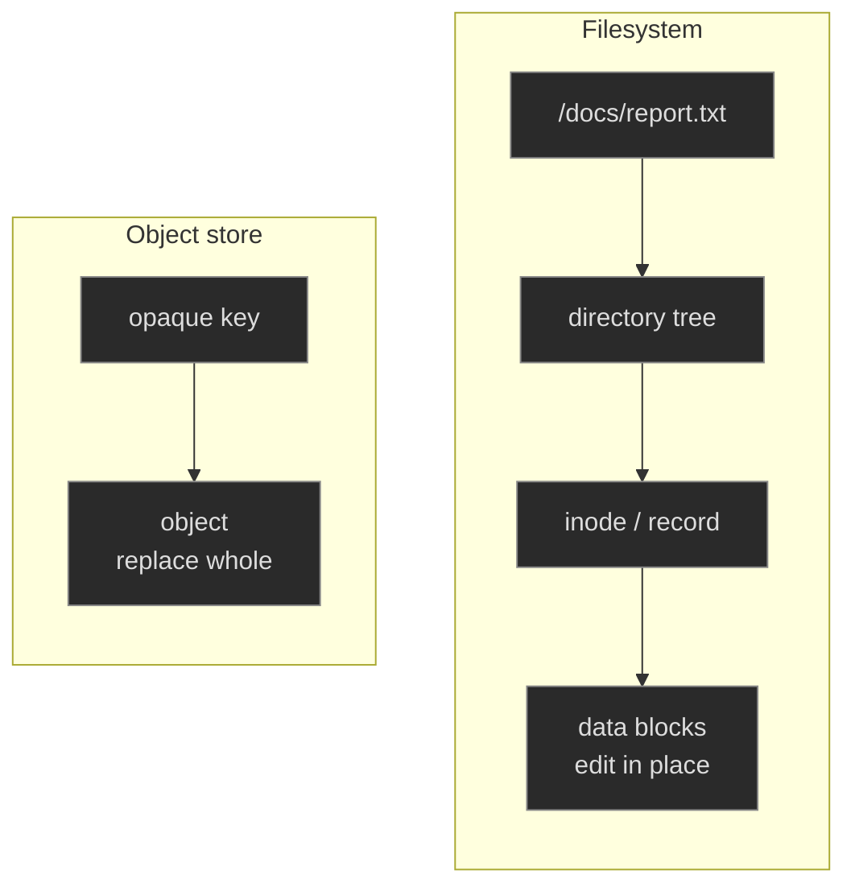
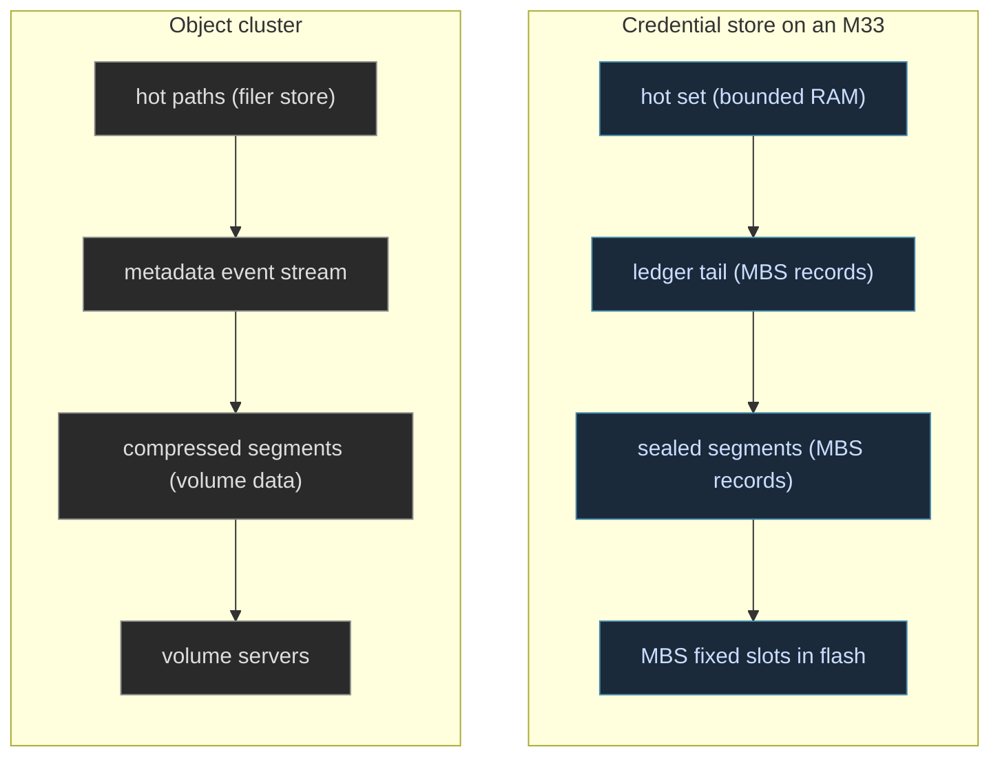

## A Study in Contrasts

This entry surfaced as a result of happenstance, but we take this opportunities as they arrive. We originally authored our [Modular Blob Storage](/spec/draft/modular-blob-storage/) entry toward a credential store on a Cortex-M33, with no heap and no *filesystem* per se. Recently, when reading [SeaweedFS](https://github.com/seaweedfs/seaweedfs)'s metadata design, it came acorss as a harmonious structure at a larger scale. And so, we took the inspiration to carry our own planned design further.



## Metadata from MCUs to Billions of Files

Most developers who work in cloud technologies have used the S3 model for years: a bucket, a key, and an object read and written whole. A regular filesystem works differently. Windows, macOS, and Linux store files in a tree of directories. Each file has a path, an inode or record behind it, and a program can open it to change a few bytes in the middle. An object store has none of that at the bottom layer. The key is opaque, there is no directory tree as scaffold, and an object is replaced completely ***or*** not at all. Most engineers use object storage every day without looking at how it works underneath. Underneath, it matches a storage design we had already written for microcontrollers.



[SeaweedFS](https://github.com/seaweedfs/seaweedfs) is one open implementation of that model, and it comes from [Haystack](https://www.usenix.org/legacy/event/osdi10/tech/full_papers/Beaver.pdf), the design Facebook published for storing photos. Like Haystack, it keeps almost no metadata. A single master server does one job: it decides which storage server holds which chunk of disk. Each of those servers keeps just a 16-byte record per object, enough to find any one of billions of objects in a single disk read. The storage servers hold objects by id, with no names and no folders. The names are handled one level up, by an optional component called the filer, which maps a normal directory tree onto those ids. The filer records every change to an append-only log as a before-and-after pair, and other servers can replay that log from any point. This is event sourcing: the log is the record, and every directory listing is rebuilt from the log.


Two of their later decisions match ours. When a directory goes cold, its entries are compressed and written back to the volume servers as ordinary blobs. So the object store holds its own cold metadata, and the live store keeps only what is hot. Each chunk is also encrypted at rest with AES256-GCM, with the keys kept in the metadata store, so a volume server never sees plaintext and can run anywhere. We do both of these, starting from the microcontroller instead of the cluster.

## Familiar Decisions at a Smaller Scale

We wrote MBS for a target where the store is a fixed set of flash slots. Its requirements look like a smaller version of Haystack's, and we wrote them before we had read Haystack. Records are addressed by opaque, store-issued handles, and the spec forbids a path namespace at this layer outright. A record is written and read whole, which yields crash consistency without a journal. The index is small, fixed, and secret-free. And every record is sealed at rest under a device-held key, so, in its words, the medium need not be access-controlled: a sealed blob is inert without its key, and the key never leaves the device's sequester.

```fsharp
// Modular Blob Storage: opaque, store-issued handles, no path namespace
type Handle<'Record>                        // issued by put, consumed by get

Mbs.put   : MBS<'R> -> 'R -> Handle<'R>      // seal, write whole, return the handle
Mbs.get   : MBS<'R> -> Handle<'R> -> 'R      // read whole, unseal into a secure region
Mbs.evict : MBS<'R> -> Handle<'R> -> unit    // remove the blob and its index entry
Mbs.find  : MBS<'R> -> (IndexEntry -> bool) -> Handle<'R> array   // scan the small index
 
```

Put the two custody rules side by side. SeaweedFS stores ciphertext on volume servers that can run anywhere, because the keys are held in the filer store. MBS stores ciphertext in ordinary bulk flash, because the key is held in the hardware sequester. It is the same design three orders of magnitude apart in scale, and the only real difference is where the key is held.

## A Namespace from a Ledger

We read the SeaweedFS material while drafting the layer above MBS, and the answer we found there settled a design question we had not resolved: what the mutable metadata tree of a filesystem should be on a target that cannot afford one. The draft [Namespace Storage](/spec/draft/namespace-storage/) answers with a ledger. Namespace state is the fold of an append-only, hash-linked log of old-entry/new-entry changes. Checkpoints of that fold are serialized, compressed, sealed, and written back as ordinary MBS records, with a small secret-free index each. A single root record binds the current segment set to its checkpoint position, and advancing it is one whole-record atomic write.

```fsharp
// the namespace layer, our answer to the filer
type ChangeEntry = { Prev : Digest; Old : NameBinding option; New : NameBinding option }
type NameBinding = { Name : Name; Target : Handle<Blob> }

Nss.resolve    : Nss -> Path -> NameBinding option    // fold the ledger: hot set, segments, tail
Nss.checkpoint : Nss -> SubtreeId -> Handle<Segment>  // seal a folded subtree as an MBS record
 
```

The full type surface, with the fields left out here, is specified in the [Namespace Storage](/spec/draft/namespace-storage/) spec entry.

> The filesystem's cold metadata is stored by the object store it manages.

The properties a constrained target needs are consequences of the shape. Appending is the only write pattern, and appending is the pattern that wears flash least. Crash consistency is inherited from the substrate's whole-record atomicity, at the entry and at the root swap. Recovery to a checkpoint is a shorter replay, and tamper evidence comes from the hash chain itself. The RAM footprint is a provisioned hot set, with resolution bounded by the hot set, one segment read, and a compaction-bounded tail.



The single-core sensor node came first for us, and it is one point along a wider range. Nothing in the ledger, the segments, or the root record is bound to a particular scale. At cluster size the ledger reads as the event stream peers subscribe to, the segments read as compressed metadata chunks in bulk storage, and the custody anchor is a keyring in the metadata store in place of a hardware sequester, which is precisely the SeaweedFS arrangement.

## Bringing Types Into Play

There is a typed reason the log sits at the bottom of this design. Our [pre-print on negative and fractional types](https://arxiv.org/abs/2606.04352) distinguishes reversibility that can be *computed*, where the compiler carries a pairing certifying that a step's inverse is structurally complete, from reversibility that must be *recorded*. The boundary between the two is decidable from the types: an effect whose inverse depends on state outside the program is log work. A write to persistent media is the canonical effect of that kind. The storage layer keeps a ledger because, under that discipline, a durable write's reversal is log work, and the minimal record the discipline requires is a pair of old and new entries, chained and sealed. We imagine the fractional side eventually supplying the sharing account as well, with read-shares over sealed segments and compaction demanding the unified whole, and that stays on the research side of the line.

```fsharp
// computed reverse: the compiler carries the adjoint
let rename (before : Namespace) (op : Rename) : Namespace * Neg<Namespace> =
    (applyRename before op, negate before)

// recorded reverse: a durable write's inverse leaves the program
type LedgerEntry = { Before : Entry; After : Entry; Prev : Hash }

// fractional read-share: compaction waits for the shares
let openRead (seg : Segment) : Segment * Recip<Segment> = eta_times ()
let compact (seg : Segment) (held : Recip<Segment>) : Segment =
    epsilon_times (seg, held)
    rewrite seg
 
```

The mechanism is a familiar one. It is the append-only log and replay most engineers already build by hand, the same event sourcing the filer does above. The one addition is that the compiler can always tell which kind of reversal an operation needs, the same way it catches a type error before you run. The bookkeeping usually left to convention (and potential algorithmic errors) becomes a property checkable alongside the rest of the types, settled at design time. A standard N-tier event store database logs every change and replays the entire log to reach a past state. Here only the effects the compiler cannot invert have to persist, and recovering a prior state is a traversal of the compute graph, not a replay of the entire log from a store potentially multiple steps away in the solution stack. It's a clear trade of pattern that has its advantages and costs like any other. But in this case, both in constrained and large-scale deployments we see many cases where this is clearly the more efficient and more sound choice.

## The Server Bookend

There's a reach that we've been considering as a project that this development has placed front and center. We have designs to provide a high-speed S3-compatible object service with resolution, sharding, and sealing behind one API surface. That standalone service is a strong candidate for the first full Fidelity unikernel in [the sense our unikernels entry develops](): the application is the operating system. The workload suits a sealed image unusually well. Storage services hold no interactive userland worth shipping, and their hot paths are tight loops over append-only media. Our arena-and-actor memory model is designed for exactly the deterministic lifetimes a request/response storage loop requires. BAREWire would carry the layout authority twice over, as the wire schema for the S3 surface and as the declared format of segments and ledger entries at rest. The hosted-ELF freestanding tier, direct syscalls with no libc, is the tier we would build it on first, with the microVM tier following as the network stack work matures. We find that trajectory genuinely motivating: the same design that seals a credential into an M33's flash would describe the store a cluster can trust will return data with speed and security as part of the bargain.

## Continuity of Custody

What the study left us with is a single discipline where we had expected to find two. Four structures serve a credential store measured in kilobytes: a sealed record, an opaque handle, a small honest index, and a ledger of paired changes. The same four serve an object cluster measured in petabytes, with custody anchored in silicon at one end and in the metadata store at the other. SeaweedFS shows the large end running in production, and it documents enough of its design to study. The specifications cover our end, written for the smallest machines.

## Related Entries

- [Getting to the Heart of Unikernels](): the sealed-artifact class this storage service would inhabit, from reset vector to container
- [Modular Blob Storage](/spec/draft/modular-blob-storage/): the fixed-slot, sealed persistence floor, specified
- [Namespace Storage](/spec/draft/namespace-storage/): the ledger, the segments, and the root record, specified in draft
- [Fidelity on MCU](/docs/internals/hardware/fidelity-on-mcu/): the M33 bring-up work where the storage floor gets its first target
- [Clef on Metal Extended](/docs/internals/hardware/on-metal-extended/): the substrate spectrum the two ends of this post sit on
