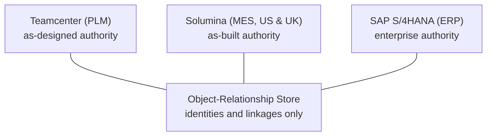

To our surprise, it is now ***two*** engineers named "Moog" that inform this framework's narrative in some way or other. Robert Moog built the synthesizers that brought the family name into the music industry lexicon. Houston Haynes, designer of this framework, its language, and its type system, began his career as Bob's student and later helped him restart the company that once again made "Moog Music" as an international brand. And now, it also gains some perspective from William Moog, Bob's cousin, who founded the motion-control company in East Aurora, New York in 1951. His electrohydraulic servo valve and by extension that company became a fixture of precision control in avionics and aerospace. The two sides of that family story connected just recently. Houston encountered the company's published engineering in the course of separate research after this framework's design had taken shape. And so from a zoomed-out perspective this entry is about control systems and precision: one lesson taught in a classroom, and a later recognition found in print.

Houston's time in Bob's shop covered a wide variety of hardware and software engineering, including high-frequency analog circuit work and, later, wired cascading interrupt structures across Zilog processors along with flipping hex codes in EEPROMs to change an instrument's behavior. But before that Houston was one of Bob's students at the University of North Carolina at Asheville. One seminal lesson that started in those classes, with Bob in the role of research professor, stands out above others. It points to how engineering answers can be found in sound mathematics.

## The Ring Modulator Lesson

A ring modulator's signal path runs through transformers, filters, and lines whose behavior over time is governed by the Telegrapher's equations. For a voltage \(v(x,t)\):

$$\frac{\partial ^{2}v}{\partial x^{2}}=LC\frac{\partial ^{2}v}{\partial t^{2}}+(RC+GL)\frac{\partial v}{\partial t}+GRv$$

The equation is precise and, at a workbench, ***unusable***: in the time domain there is no practical route from that PDE to the capacitor rating the circuit needs.

Euler's formula changes the domain rather than the physics. In the case of a ring modulator, the opening assumption is that carrier and modulator signals are sinusoidal, so substitute \(e^{j\omega t} = \cos(\omega t) + j\sin(\omega t)\). The derivative of \(e^{j\omega t}\) is \(j\omega \, e^{j\omega t}\), so differentiation becomes multiplication by \(j\omega\), the calculus collapses into algebra, and the capacitor's full behavior reduces to a complex impedance:

$$Z_{C}=\frac{1}{j\omega C}$$

In this domain the component values "fall out" of the equations. The series capacitor that blocks DC at the input follows from \(f_c = \frac{1}{2\pi R C}\): with a \(100\text{ k}\Omega\) input impedance and a \(15\text{ Hz}\) cutoff,

$$C=\frac{1}{2\pi \times 100{,}000\times 15}\approx 106\text{ nF}$$

and a workbench with a decent array of components would provide a standard \(100\text{ nF}\) film part. The parallel capacitor that shorts a \(25\text{ kHz}\) carrier leak to ground follows from the same relation with a cutoff near \(15\text{ kHz}\), which puts the part between \(1\) and \(4.7\text{ nF}\) ceramic. What started as an exercise in esoteric mathematics yields a garden-variety component search.

| Role | Placement | Governing algebra | Selected part |
| --- | --- | --- | --- |
| DC blocking | Series with input | \(f_c = 1/(2\pi R C)\), \(R = 100\text{ k}\Omega\), \(f_c = 15\text{ Hz}\) | \(100\text{ nF}\) film |
| Carrier-leak damping | Parallel to ground | Same relation, \(f_c \approx 15\text{ kHz}\) against a \(25\text{ kHz}\) carrier | \(1\) to \(4.7\text{ nF}\) ceramic |

The principle has much greater range asn on object lesson than the blackboard session, and is the reason Houston retells the story. The PDE and the algebra describe the same circuit. In one representation the answer is unreachable at any reasonable cost. In the other it **falls out** figuratively speaking, carrying a derivation any engineer can use for part selection.

## The Other Moog

In a generationally parallel history, William Moog's servo valve turned milliamps of electrical signal into precisely metered hydraulic force, with feedback closing the loop inside the device itself, and that component made high-authority flight control practical. The company grew into a fixture of precision motion control across aerospace: aircraft flight surfaces, launch vehicle steering, and spacecraft actuation. What Houston found, decades after the bench years in Bob's shop, spans two generations of the company's published engineering: the servo-valve transfer-function bulletins, and the digital-thread program it documents today.

The first generation is the servo-valve literature, and its centerpiece is [Transfer Functions for Moog Servovalves](http://www.mylesgroupcompanies.com/moog_pdfs/Moog%20-%20Servovalve%20Transfer%20Functions.pdf), Technical Bulletin 103, written by W. J. Thayer in 1958 and revised in 1965. The bulletin taught control engineers to *work with the valve **as a frequency-domain transfer function***, and for most system design a first-order approximation served:

$$\frac{Q(s)}{I(s)} \approx \frac{K_v}{1+\tau s}$$

Flow \(Q\) per unit of drive current \(I\), a flow gain \(K_v\), and a single time constant \(\tau\): enough algebra to size a control loop in a way similar to how the ring modulator algebra sized a capacitor. Where a design pressed closer to the valve's dynamics, the bulletins supplied the second-order form, with damping ratio and natural frequency stated per valve family:

$$\frac{Q(s)}{I(s)} \approx \frac{K_v\,\omega_{n}^{2}}{s^{2}+2\zeta \omega_{n}\, s+\omega_{n}^{2}}$$

Substitute \(s = j\omega\) and this is the bench lesson again: differential equations exchanged for algebra, with each approximation's range of validity stated so a customer's engineer could check every derivation before an aircraft depended on the part. We take the deeper precedent from the practice itself: a component vendor publishing checkable mathematical models of its own products. 

> The model becomes part of the product, and verification is the customer's **right** rather than the vendor's option.

The lesson here runs deep. Moog (the Aircraft Group) is storied enough to have run every generation of manufacturing software: paper travelers, then MRP in the 1970s and 80s, then ERP through the 1990s and 2000s, then product-lifecycle management, then digitized shop-floor execution. Each system holds authority over something real: PLM is the design, MES is the build record, ERP is the digital ledger. Run separately, the three systems assign the same physical part three different numbers. The divergence stays invisible until a mismatch puts the wrong part in an assembly. This is the object lesson that we found sympathetic to the Fidelity Framework's posture.

Moog's aerospace business publicly documents [how it threaded them](https://www.1eq.com/moog-plm-integration). Teamcenter, the as-designed authority, synchronizes to Solumina execution systems in the US and UK and to SAP S/4HANA on the ERP side. What crosses between systems is identity and linkage: parts and EBOM references, change orders, quality clauses, document links, and trade-compliance attribution. The ***identities*** are held in an Object-Relationship Store, the bulk data never moves, and each system remains authoritative for *its own* records. The integration [deployed in months](https://www.casestudies.com/company/eq-technologic/case-study/moogs-golden-triangle-of-plm-mes-erp-integration-powered-by-eqube-daas-platform) with no components installed into the endpoint systems, and because the identifiers survive, the thread is rebuildable. Over such a spine, configuration states can line up as effectivity-dated baselines: as-designed, as-planned, as-built, as-maintained, and most importantly as-flown.

The director of product-lifecycle management for Moog Aircraft Group presented its framing, end-to-end traceability as an element of company transformation, at [CIMdata's PLM Road Map in May 2023](https://beyondplm.com/2023/05/07/cimdata-plm-roadmap-2023-notes-from-customer-presentations/), and a Moog PLM architect presents the Aerospace & Defense PLM Action Group's digital-twin and digital-thread benchmark on the group's behalf, whose [catalog of eighty use cases](https://www.cimdata.com/en/news/item/29714-aerospace-defense-plm-action-group-announces-80-use-cases-for-digital-twin-digital-thread-investment) published in 2026 with twenty-eight demonstrated against commercially available software. 

> The curious reader may note what engages the thread alongside the part numbers: trade-compliance attribution, the export-control dimension carried as first-class identity.

From valve dynamics in \(j\omega\) to configuration identity spanning as-designed to as-flown, the discipline is continuous across seventy years: choose the representation in which the answer can be verified objectively, keep one authoritative identity for every fact, and publish enough of the model that an independent engineer can check it. From the workbench, Houston found Bob's high regard for his cousin easy to understand. It is the same standard, held at two scales.

## The Tractable Domain

One of these lessons shows up in our Fidelity Framework at its foundation. Clef's dimensional types descend from Andrew Kennedy's units of measure, and [our published type system work](https://arxiv.org/abs/2603.16437) keeps that algebra in fragments with the phasor domain's character: dimensional consistency is exact integer arithmetic over an abelian group, value ranges propagate as interval algebra through the compiler's program graph, and the [verification tiers](/docs/internals/verification/decidability-sweet-spot/) are drawn so a solver decides the everyday obligations quickly and unattended. 

> That is the Euler substitution made permanent.

The mathematics was placed, deliberately, where answers fall out, and the tooling is being built so they arrive at design time, supportive of the developer's goals. Our commitments were set before Houston ever read Moog's digital-thread documentation: [BAREWire]() holds both sides of every boundary to one checked contract, and the [certificate design](/docs/internals/verification/proofs-to-silicon/) attaches a labeled derivation to every discharged obligation, so what the compiler asserts stays checkable by engineers, by toolchains, and in time by auditors.

The aim behind those commitments is the same territory *the other Moog* company serves. Our Fidelity Framework is built for the hardware-software boundary: Clef compiles through Composer to processors, [FPGAs](), and NPUs, the substrate of complex control systems where software meters physical force. Systems in that territory are governed by DO-178C in avionics and by its siblings across regulated industries, and adherence is part of the framework's original design goals. Certification practice accepts two kinds of evidence, qualified-tool verdicts and machine-checked proofs. Our "tiered proof" certificate establishes which trusted base stands behind each claim. A compliance package assembled from an ordinary build in the Fidelity Framework would have the option to speak to either or *both* representations as needed.

Finding the same commitments, independently, in the published practice of "the other Moog's" company is the kind of confirmation an engineer trusts precisely because it emerges from sympathetic principle. We are gratified that our own path found the adjacency, and the companion entry on our Braidpoint site, [The French Connection](https://braidpoint.tech/blog/the-french-connection/), follows the surrounding evidence tradition through the certification tooling regulators have trusted for decades.

Houston took the standard from one Moog in person and, decades later, found it again in the other's company in print. We are building this framework to hold that standard: models in tractable domains, answers that carry integrity, and identity kept precise enough that the next engineer, or the next system, can verify and trust the work.
