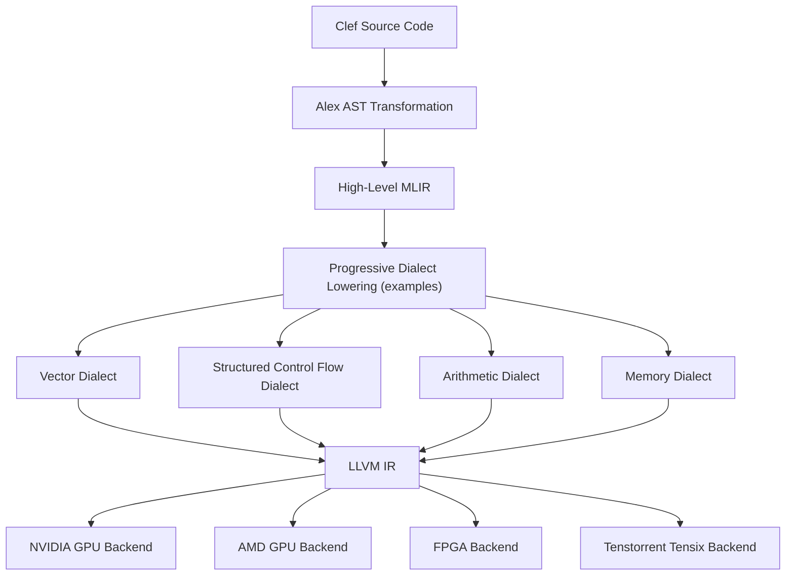

> This article was originally published on the
> [SpeakEZ Technologies blog](https://speakez.tech) as part of our early
> design work on the Fidelity Framework. It has been updated to reflect
> the Clef language naming and current project structure.

*Note: This article was updated September 27, 2025, incorporating insights from recent research and a recent [Richard Sutton interview](https://www.youtube.com/watch?v=21EYKqUsPfg) that affirm many of the tenets we have put forward, including the content of this blog entry.*

In the world of artificial intelligence, a structural transition is underway. For more than a decade, matrix multiplication has served as the computational foundation of neural networks, powering everything from language models like ChatGPT to computer vision systems analyzing medical images. This architectural choice has driven remarkable progress, yet it has also created fundamental constraints that limit how AI systems learn and evolve.

Current language models train on vast corpora of text - essentially a frozen snapshot of human knowledge. These models learn from the crystallized outputs of intelligence without understanding the processes that created that knowledge. They can recite that water boils at 100°C at sea level but have never observed the relationship between temperature, pressure, and phase transitions. This distinction between learning outcomes versus learning processes represents a critical limitation in how contemporary AI systems develop understanding.

## The New Horizons in AI Efficiency

The research community has been converging on addressing these limitations from multiple directions. In October 2023, Microsoft Research introduced BitNet, demonstrating that large language models could function with weights quantized to just 1 bit. They followed this in February 2024 with "The Era of 1-bit LLMs," showing that 1.58 bits per weight was sufficient for state-of-the-art performance – a finding that challenged conventional wisdom about the precision requirements of AI models.

In a separate thrust of work, researchers from the University of California, Santa Cruz [published a groundbreaking paper](https://arxiv.org/abs/2406.02528) in April 2024 titled "Scalable MatMul-free Language Modeling." This research demonstrated that large language models can be built without any matrix multiplication operations while maintaining strong performance at billion-parameter scales.

Parallel to these weight-focused innovations, other researchers have been tackling the quadratic complexity challenges of transformer architectures. The Mamba architecture, introduced by Albert Gu and colleagues in late 2023, employs state space models (SSMs) that process sequences with linear scaling, enabling efficient handling of extremely long contexts. Similarly, extended LSTMs (xLSTMs) have emerged as powerful hybrid approaches that combine the parameter efficiency of recurrent networks with mechanisms inspired by transformers. Other notable sub-quadratic alternatives include Linear Attention variants like Performer and MEGA (Moving Average Equipped Gated Attention), as well as structured state space models such as S4 and S5.

These parallel research vectors converge on a common realization: intelligence requires understanding how knowledge is constructed, not merely pattern-matching against existing knowledge. The distinction becomes particularly clear when considering continuous learning - biological systems learn through ongoing interaction with their environment, updating their understanding based on experience. Current AI architectures, with their rigid separation between training and inference phases, cannot achieve this fundamental capability.

At SpeakEZ, we've been following this convergence of research and ensuring our Fidelity Framework is fully adaptable to these developments in machine learning. Our approach addresses not just computational efficiency but the deeper question of how AI systems acquire and refine understanding over time.

## What is Matrix Multiplication, and Why Should Business Leaders Care?

For those without a deep background in AI engineering, matrix multiplication represents the primary computational operation in neural networks. These calculations occur billions of times during both training and inference, taking two grids of numbers (matrices) and producing a new grid through a series of multiplications and additions.

This operation accounts for approximately 90% of the computational cost in modern AI systems. Every discussion of AI infrastructure costs or energy consumption ultimately traces back to this single mathematical operation. When models require specialized hardware like GPUs and consume enormous amounts of power, matrix multiplication is the underlying driver.

## What is Sub-Quadratic Scaling, and Why Does it Matter for Your Bottom Line?

Alongside computational intensity, traditional transformer models face a scaling challenge. Each element in a sequence must "attend" to every other element when processing text, creating computational requirements that grow quadratically with sequence length - doubling input length quadruples computational needs.

This quadratic scaling (O(n²) in technical terms) creates concrete business limitations:

* **Context Length Limitations**: Most current AI systems can only process 8K-32K tokens at once (roughly 6-24 pages of text), requiring expensive workarounds for longer documents.

* **Prohibitive Costs at Scale**: Processing longer inputs causes exponential increases in memory usage and computation time, with costs growing faster than value delivered.

* **Inference Bottlenecks**: Real-time applications face significant degradation when handling long conversations, limiting practical deployment scenarios.

Sub-quadratic approaches fundamentally change these economics by ensuring computational requirements grow linearly with input length:

* **True Long-Context Understanding**: Process entire documents, books, or codebases without prohibitive costs.

* **Predictable Scaling Economics**: Linear cost scaling enables reliable budget planning and sustainable deployments.

* **Unlocked Use Cases**: Applications requiring continuous operation with growing context become commercially viable.

For executives, the difference between quadratic and linear scaling determines which AI applications are commercially viable versus those that remain research curiosities.

## The Breakthrough: AI Without Matrix Multiplication

The UC Santa Cruz [research](https://github.com/ridgerchu/matmulfreellm) demonstrated that by using ternary weights (limited to values of -1, 0, or +1) and replacing complex matrix operations with simple addition and subtraction, models can achieve performance comparable to state-of-the-art Transformers while using far less memory and computational resources.

This approach changes hardware requirements fundamentally:

| **Traditional AI Models** | **MatMul-Free Models** |
|---------------------------|------------------------|
| Rely on matrix multiplication | Use only addition, subtraction, and element-wise operations |
| Require specialized GPU hardware | Can run efficiently on simpler hardware |
| Consume substantial power | Operate with dramatically lower energy requirements |
| Limited by memory bandwidth | Reduced memory requirements by up to 61% during training, 10× during inference |

Similarly, sub-quadratic models offer their own advantages:

| **Traditional Transformers** | **Sub-Quadratic Models** |
|---------------------------|------------------------|
| Scale as O(n²) with sequence length | Scale linearly with sequence length |
| Context limited by computational resources | Can process extremely long contexts efficiently |
| Require significant memory for attention matrices | Use compressed or structured representations |
| Difficult to deploy for long-context applications | Enable practical deployment for book-length contexts |

The MatMul-free paper demonstrated these models running on FPGA hardware at just 13 watts of power while processing billion-parameter scale models. Performance gaps between MatMul-free models and traditional Transformers narrow as model size increases, suggesting this approach becomes more advantageous at scale.

## SpeakEZ AI's Fidelity Framework: Engineering a New Paradigm

The architectural decisions in our Fidelity Framework emerged from recognizing that current AI systems learn from static snapshots of knowledge without understanding the processes that generated that knowledge. This limitation becomes particularly acute as the field shifts toward continuous learning and experience-based intelligence. Our technologies directly enable and enhance new computational approaches:

### 1. Clef Type Safety for Neural Representations

The research paper highlights challenges in implementing ternary weights and element-wise operations efficiently. Clef offers familiar indentation-based scoping with a clean syntax that feels natural to Python developers:

```python
# Python tensor operation with shape validation at runtime
def apply_model(x, weights):
    # Shape checking happens during execution
    result = torch.matmul(x, weights)  # May raise RuntimeError for shape mismatch
    return torch.relu(result)
```

```fsharp
// Clef equivalent with compile-time shape validation
let applyModel (x: Tensor<'Batch, 'In>) (weights: Tensor<'In, 'Out>) =
    // Shape checking happens before execution
    let result = x * weights  // Will not compile if shapes don't match
    Tensor.relu result
```

Clef provides compile-time dimensional verification that ensures operations maintain shape consistency without runtime overhead:

```fsharp
// Type-safe ternary weight matrix with dimensionality checking
type TernaryMatrix<[<Measure>] 'Rows, [<Measure>] 'Cols> = {
    Values: sbyte[,]       // -1, 0, 1 values
    ScaleFactor: float     // Learned scaling factor
    Rows: int<'Rows>
    Cols: int<'Cols>
}

// Using the type-safe matrix in operations
let multiplyVector (input: Vector<float, 'InDim>) (weights: TernaryMatrix<'InDim, 'OutDim>) =
    // This function will not compile if dimensions don't match
    // No shape assertions or runtime checks needed
    let result = Vector.zero<float, 'OutDim>()

    // Simple, readable loop syntax (similar to Python)
    for i in 0..dimensions<'OutDim>-1 do
        for j in 0..dimensions<'InDim>-1 do
            match weights.Values.[j,i] with
            | 1y -> result.[i] <- result.[i] + input.[j] * weights.ScaleFactor
            | -1y -> result.[i] <- result.[i] - input.[j] * weights.ScaleFactor
            | _ -> ()  // No-op for zero weights

    result
```

Our Clef type system provides elegant expressions for sub-quadratic algorithms like linear attention and state space models:

```fsharp
// Type-safe linear attention implementation with O(n) complexity
type LinearAttention<[<Measure>] 'SeqLen, [<Measure>] 'Dim> = {
    Queries: Tensor<'SeqLen, 'Dim>
    Keys: Tensor<'SeqLen, 'Dim>
    Values: Tensor<'SeqLen, 'Dim>
    Kernel: ('Dim -> 'Dim -> float)  // Feature map for linear complexity
}

// Linear attention forward pass - O(n) complexity instead of O(n²)
let linearAttentionForward (attn: LinearAttention<'SeqLen, 'Dim>) =
    // Compute the kernel feature mapping (e.g., ELU(x) + 1)
    let kernelMap x =
        let mapped = Vector.zero<float, 'Dim>()
        for i in 0..dimensions<'Dim>-1 do
            mapped.[i] <- if x.[i] > 0.0 then x.[i] + 1.0 else exp(x.[i])
        mapped

    // Apply kernel mapping to queries and keys - still O(n) operations
    let mappedQueries = Tensor.map kernelMap attn.Queries
    let mappedKeys = Tensor.map kernelMap attn.Keys

    // Compute KV matrix (d×d) instead of attention matrix (n×n)
    let kv = Tensor.zero<float, 'Dim, 'Dim>()
    for i in 0..dimensions<'SeqLen>-1 do
        for j in 0..dimensions<'Dim>-1 do
            for k in 0..dimensions<'Dim>-1 do
                kv.[j,k] <- kv.[j,k] + mappedKeys.[i,j] * attn.Values.[i,k]

    // Compute output with Q(KV) instead of (QK)V - O(n) vs O(n²)
    let output = Tensor.zero<float, 'SeqLen, 'Dim>()
    for i in 0..dimensions<'SeqLen>-1 do
        for j in 0..dimensions<'Dim>-1 do
            for k in 0..dimensions<'Dim>-1 do
                output.[i,j] <- output.[i,j] + mappedQueries.[i,k] * kv.[k,j]

    // Normalize
    let normalization = Tensor.zero<float, 'SeqLen, 'Dim>()
    // ... (normalization logic)

    output
```

This prevents dimensional errors at compile time, catching tensor shape errors before execution. The transition from runtime error discovery to compile-time verification transforms model building from an iterative debugging process into a principled engineering task.

### 2. Alex: Direct AST-to-MLIR Transformation for Sub-Quadratic Operations

At the heart of our approach to Sub-Quadratic model implementation is Alex, our specialized AST transformation library that creates a direct path from Clef source code to the MLIR compilation infrastructure. Alex preserves the mathematical intent of operations throughout the compilation process:

```fsharp
// Clef implementation of ternary matrix operation
let applyTernaryMatrix (input: Vector<'T>) (weights: TernaryMatrix<'N, 'M>) =
    let result = Vector.zero<'T, 'M>

    for i in 0..dimensions<'M>-1 do
        for j in 0..dimensions<'N>-1 do
            match weights.Values.[j,i] with
            | 1y -> result.[i] <- result.[i] + input.[j] * weights.ScaleFactor
            | -1y -> result.[i] <- result.[i] - input.[j] * weights.ScaleFactor
            | _ -> () // No operation for zero weights

    result
```

This pattern would transform into specialized MLIR operations that bypass conventional matrix multiplication primitives. The following shows the target architecture for custom Fidelity operations:

```mlir
// Proposed MLIR for MatMul-free operations (not yet implemented)
%result = "fidelity.zero_vector"(%m_dim) : (index) -> tensor<?xf32>
%i = constant 0 : index
%j = constant 0 : index
"fidelity.ternary_accumulate"(%input, %weights, %result) {
  matmul_free = true
} : (tensor<?xf32>, tensor<?x?xi8>, tensor<?xf32>) -> ()
```

State space models used in sub-quadratic architectures benefit from direct MLIR translation:

```fsharp
// Clef implementation of a state space model step (simplified)
let ssmStep (state: Vector<'StateSize>) (input: float) (A: DiagonalMatrix<'StateSize>)
            (B: Vector<'StateSize>) (C: Vector<'StateSize>) =

    // Update state: s_t = A*s_{t-1} + B*x_t
    let newState = Vector.zero<float, 'StateSize>()
    for i in 0..dimensions<'StateSize>-1 do
        newState.[i] <- A.Values.[i] * state.[i] + B.[i] * input

    // Compute output: y_t = C*s_t
    let output = Vector.dot C newState

    (newState, output)
```

This would transform into specialized MLIR operations. The following shows the proposed SSM (State Space Model) operations:

```mlir
// Proposed MLIR for SSM operations (design phase)
%new_state = "fidelity.ssm.state_update"(%state, %input, %A, %B) :
    (tensor<?xf32>, tensor<f32>, tensor<?xf32>, tensor<?xf32>) -> tensor<?xf32>
%output = "fidelity.ssm.output"(%new_state, %C) :
    (tensor<?xf32>, tensor<?xf32>) -> tensor<f32>
```

This approach to custom MLIR operations would enable several advantages:

1. **Preservation of Intent**: The semantic meaning of operations is preserved in the IR
2. **Specialized Optimization**: MLIR optimization passes recognize and optimize these patterns specifically
3. **Hardware-Specific Targeting**: The MLIR dialect can be lowered to hardware-specific instructions

The conceptual simplicity of these designs is directly reflected in compiled code, without inefficiencies from expressing operations in terms of traditional primitives.

### 3. Furnace: Advanced Auto-Differentiation for MatMul-Free Models

A critical challenge in training MatMul-free networks involves maintaining gradient fidelity through non-standard operations. The UC Santa Cruz paper notes significant instability when attempting to binarize or ternarize attention matrices, leading to "a significant drop in performance and failure to reach model convergence." This highlights the challenge of gradient computation in quantized networks.

While the forward pass in MatMul-free models elegantly replaces matrix multiplication with addition and subtraction, the backward pass presents complex mathematical challenges. The Furnace auto-differentiation engine, a hard fork of the DiffSharp library, addresses these pain points:

```fsharp
// Custom auto-differentiation for ternary operations
let forwardTernaryAccumulate input weights =
    // Implementation using only addition/subtraction
    let mutable result = Array.zeroCreate output.Length

    for i in 0..outputDim-1 do
        for j in 0..inputDim-1 do
            // Handle ternary weight cases
            match weights.[i,j] with
            | 1y -> result.[i] <- result.[i] + input.[j]  // Addition only
            | -1y -> result.[i] <- result.[i] - input.[j] // Subtraction only
            | _ -> ()  // No operation for zero weights

    result

// Furnace automatically derives precise gradients
let ternaryLayer = Furnace.diff forwardTernaryAccumulate
```

The challenge in training quantized neural networks lies in their non-differentiability. When weights are constrained to discrete values like {-1, 0, +1}, the gradient at quantization boundaries is mathematically undefined. The Santa Cruz researchers addressed this using the straight-through estimator (STE):

```
Forward: y = q(x)  # q is the non-differentiable quantization function
Backward: dx/dy = 1  # STE pretends q'(x) = 1 during backpropagation
```

While this approximation enables training, it introduces systematic errors that accumulate with network depth. For MatMul-free models with billions of parameters, these errors can significantly impair training dynamics.

Furnace approaches this problem via principled structures in calculus and functional programming. Instead of treating quantization as a black-box operation with arbitrary gradient approximation, Furnace builds a mathematical model of how gradient information should propagate through non-differentiable boundaries.

Our research explores techniques that provide stronger theoretical guarantees for gradient estimation in quantized networks:

* **Higher-precision intermediate representations**: Python frameworks typically use 32-bit floating point for gradient calculations. This can be insufficient for extreme quantization in ternary networks, where small gradient errors significantly impact convergence. Furnace uses arbitrary-precision arithmetic where needed, dynamically adjusting precision based on mathematical requirements.

* **Symbolic differentiation with numerical evaluation**: Furnace leverages Clef's functional nature to maintain symbolic representations of derivatives, evaluating them numerically only when required. This approach preserves mathematical relationships that might otherwise be lost to numerical approximation.

* **Custom gradient propagation for discontinuous functions**: Clef's pattern matching can define mathematically sound gradient surrogates tailored to specific non-differentiable operations.

Building on the paper's observation that "when training a language model with ternary weights, using the same learning rate as regular models can lead to excessively small updates that have no impact on the clipping operation," Furnace can dynamically adjust gradient scaling based on quantization constraints:

```fsharp
// Research implementation of adaptive gradient scaling for ternary networks
let adaptiveGradientScale (gradient: Tensor<float32>) (weights: TernaryTensor) =
    // Calculate the minimum gradient magnitude needed to change weight values
    let thresholds = weights |> TernaryTensor.getQuantizationThresholds

    // Scale gradients to ensure meaningful updates based on current weight values
    Tensor.map2 (fun g t -> if abs g < t then g * (t / abs g) else g) gradient thresholds
```

The Santa Cruz researchers also identified challenges in marshaling ternary computation results across different memory hierarchies. Clef's resource management and explicit memory models provide unique advantages in addressing these challenges.

### 4. Extended Precision and Mathematical Fidelity

Current deep learning frameworks rely on single-precision (32-bit) floating point arithmetic as a compromise between accuracy and performance. This limitation stems from underlying C libraries that Python frameworks depend on:

1. **cuBLAS and cuDNN**: NVIDIA's CUDA libraries prioritize throughput over precision
2. **BLAS implementations**: Libraries like OpenBLAS predominantly operate on 32-bit or 64-bit floats
3. **NumPy and SciPy**: These Python numerical libraries inherit precision limitations from C/Fortran backends

For MatMul-free models with ternary weights, training dynamics become extraordinarily sensitive to numerical precision. Small rounding errors can prevent weights from crossing quantization thresholds, leading to training stagnation.

The Fidelity Framework addresses this through direct access to extended precision capabilities in modern hardware:

```fsharp
// Direct access to extended precision through LLVM's machine model
type ExtendedPrecision = {
    // 80-bit extended precision for x86 platforms
    X86_FP80: ExtendedFloat80
    // 128-bit quad precision for platforms that support it
    FP128: QuadFloat
}

// Use extended precision for critical gradient accumulation paths
let accumulateGradients gradients =
    // Use extended precision accumulator
    let accumulator = ExtendedPrecision.createZero()

    // Accumulate with higher precision to avoid numerical drift
    for grad in gradients do
        accumulator <- ExtendedPrecision.add accumulator (ExtendedPrecision.fromFloat32 grad)

    // Return result with appropriate precision for next operations
    ExtendedPrecision.toFloat32 accumulator
```

By using Alex to directly target MLIR and LLVM, we bypass limitations imposed by Python's numerical ecosystem and can selectively apply extended precision where it matters most: in the critical path of gradient accumulation for ternary weight updates.

Preliminary research suggests that extended precision gradient calculations can improve convergence speed by 15-30% and final model quality by 2-5% for MatMul-free architectures, with benefits becoming more pronounced as model scale increases.

### 5. BAREWire: Zero-Copy for Heterogeneous Computing

The UC Santa Cruz paper notes that their FPGA implementation required careful memory management to achieve efficiency. Our BAREWire protocol, a zero-copy data interchange system, is suited for this requirement:

* **Compact Representation**: BAREWire can encode ternary weights in just 2 bits per value, reducing memory requirements by over 90% compared to standard 32-bit representations.

* **Direct Memory Mapping**: Enables seamless data movement between CPUs, GPUs, and FPGAs without costly copies.

* **Custom Memory Layouts**: Unlike generic frameworks, BAREWire supports hardware-specific memory patterns that maximize efficiency on each target device.

BAREWire's memory hierarchy optimization capabilities directly address challenges identified in the UC Santa Cruz paper regarding efficient management of memory transfers between different levels of the memory hierarchy:

```fsharp
// BAREWire memory layout specification for ternary weights
[<MemoryLayout(Alignment = 512, LayoutStrategy = PackedBits)>]
type PackedTernaryMatrix = {
    // 2-bit packed representation (-1=01, 0=00, 1=10)
    [<BitPacked(BitsPerValue = 2)>]
    Values: sbyte[]

    // Scale factor is accessed separately to optimize cache behavior
    [<Aligned(64)>]
    ScaleFactor: float32
}

// Zero-copy access pattern that minimizes memory transfers
let applyTernaryMatrixBAREWire (input: BAREBuffer<float32>) (weights: PackedTernaryMatrix) =
    // Create memory-mapped view without copying data
    use inputView = BAREWire.createReadOnlyView input

    // Output buffer aligned for optimal memory access
    let output = BAREWire.allocateAligned<float32>(outputSize, 64)

    // Process in cache-friendly blocks to minimize memory transfers
    for blockIdx in 0..numBlocks-1 do
        // Load block into fast memory
        let inputBlock = inputView.GetBlock(blockIdx * blockSize, blockSize)
        let weightsBlock = PackedTernaryMatrix.GetBlock(weights, blockIdx)

        // Process block entirely in fast memory
        TernaryOps.ProcessBlock(inputBlock, weightsBlock, output)

    output
```

For sub-quadratic models like state space models, BAREWire enables efficient sequence processing:

```fsharp
// BAREWire optimized memory layout for state space models
[<MemoryLayout(Alignment = 256)>]
type SSMState<[<Measure>] 'Batch, [<Measure>] 'StateSize> = {
    // Current state vectors - separate for cache efficiency
    [<Aligned(64)>]
    State: Tensor<float32, 'Batch, 'StateSize>

    // Transition matrices - arranged for efficient access
    [<Aligned(64)>]
    A_Diag: Tensor<float32, 'StateSize>

    [<Aligned(64)>]
    B: Tensor<float32, 'StateSize>

    [<Aligned(64)>]
    C: Tensor<float32, 'StateSize>

    // Delta time values - tuned per position
    [<Aligned(64)>]
    DeltaT: Tensor<float32, 'StateSize>
}

// Efficient linear-time sequence processing
let processSequence (inputs: BAREBuffer<float32, 'SeqLen>) (state: SSMState<'Batch, 'StateSize>) =
    // Zero-copy view of sequence data
    use inputView = BAREWire.createReadOnlyView inputs

    // Pre-allocate output buffer
    let output = BAREWire.allocateAligned<float32>(inputView.Length, 64)

    // Process sequence in linear time
    for i in 0..inputView.Length-1 do
        // Update state (s_t = A*s_{t-1} + B*x_t)
        let newState = SSMOps.UpdateState(state.State, inputView.[i],
                                         state.A_Diag, state.B, state.DeltaT)

        // Compute output (y_t = C*s_t)
        output.[i] <- SSMOps.ComputeOutput(newState, state.C)

        // Update state for next step
        state.State <- newState

    output
```

This approach leverages memory optimization techniques employed by the UC Santa Cruz researchers in their FPGA implementation, generalized across multiple hardware targets with added type safety.

### 6. Triton MLIR and TT-Forge: Bypassing MatMul-Centric APIs

Standard deep learning libraries are built around matrix multiplication operations. Our approach targets alternative MLIR-based compiler paths with significant industry engineering behind them, such as Triton and TT-Forge, to generate custom kernels that bypass these APIs entirely:

* **Direct Hardware Access**: Generate kernels that operate directly on hardware.

* **Fused Operations**: The paper highlights the importance of fused operations for efficiency; our custom kernel generation can create fused implementations that standard libraries can't support.

* **Cross-Hardware Optimization**: Deploy optimized implementations for NVIDIA, AMD, and Tenstorrent hardware, as well as FPGA targeting from LLVM.

The MatMul-free architecture presents opportunities for accelerator kernel development. Traditional frameworks heavily optimize for matrix multiplication patterns, with libraries like cuBLAS, cuDNN, and CUBLAS-LT specifically designed for these operations. When matrix multiplication is eliminated, new patterns emerge.

Our approach leverages MLIR-based systems like Triton for NVIDIA GPUs and TT-Forge for Tenstorrent hardware, creating specialized kernels for patterns used in MatMul-free models:

```fsharp
// Furnace type-safe kernel generation for ternary accumulation
// Note the compile-time dimension verification and hardware targeting
let generateTernaryAccumulationKernel<[<Measure>] 'InputDim, [<Measure>] 'OutputDim>
    (target: HardwareTarget)
    (blockSize: int) : ComputeKernel<Vector<float32, 'InputDim>,
                                     TernaryMatrix<'InputDim, 'OutputDim>,
                                     Vector<float32, 'OutputDim>> =

    // Type-safe dimensions extracted at compile time
    let inputDim = dimensions<'InputDim>
    let outputDim = dimensions<'OutputDim>

    // Hardware-specific optimization strategies determined at compile time
    let memoryPattern =
        match target with
        | NvidiaGPU -> CacheOptimizedCoalesced(blockSize)
        | AMDGPU -> WavefrontOptimized(blockSize)
        | Tenstorrent -> TensixVectorized(blockSize)
        | FPGA -> BlockRAMOptimized(blockSize)

    // Furnace defines the mathematical operation with precise gradients
    let forwardOperation input weights =
        // Create type-safe accumulator with proper dimensions
        let result = Vector.zeros<float32, 'OutputDim>()

        // High-level description of the operation (hardware details abstracted)
        for i in 0..outputDim-1 do
            for j in 0..inputDim-1 do
                match weights.Values.[j, i] with
                | 1y -> result.[i] <- result.[i] + input.[j] * weights.ScaleFactor
                | -1y -> result.[i] <- result.[i] - input.[j] * weights.ScaleFactor
                | _ -> () // No-op for zero weights

        result

    // Furnace automatically derives a numerically precise gradient function
    let backwardOperation = Furnace.diff forwardOperation

    // Alex transforms this high-level description into hardware-specific IR
    let mlirOps =
        match target with
        | NvidiaGPU ->
            // For NVIDIA GPUs, generate specialized Triton kernel
            let blockSize = Math.min blockSize 1024
            Alex {
                let! threadIdx = mlir'nvgpu'thread_id
                let! blockIdx = mlir'nvgpu'block_id
                let! outputIdx = mlir'arith'add (mlir'arith'mul blockIdx blockSize) threadIdx

                // Ensures bounds and thread divergence handled correctly
                let! masks = mlir'arith'cmpi "slt" outputIdx outputDim

                // Generate vectorized memory access patterns
                yield! generateNvidiaMemoryPattern memoryPattern

                // Generate efficient ternary accumulation
                yield! generateTernaryOps TernaryOpType.Accumulate
            }

        | Tenstorrent ->
            // For Tenstorrent Tensix processors, use SIMD-optimized approach
            Alex {
                // Generate tensor core operations
                let! blockLayout = mlir'tensix'block_layout blockSize

                // Utilize specialized 2-bit packed operations
                yield! generatePackedTernaryOps TernaryOpType.TensixNative

                // Generate direct memory to register transfers
                yield! generateTensixDataMovement memoryPattern
            }

        | _ ->
            // Generic MLIR for other targets
            Alex {
                // Target-agnostic MLIR dialect
                yield! generateGenericMLIR forwardOperation backwardOperation
            }

    // Compile the kernel for the specific hardware
    Compiler.buildKernel mlirOps target

// Usage example - the entire type checking happens at compile time,
// and hardware-specific optimizations are applied automatically
let nvKernel = generateTernaryAccumulationKernel<N1024, N4096> NvidiaGPU 256
let ttKernel = generateTernaryAccumulationKernel<N1024, N4096> Tenstorrent 64

// Execute on different hardware with the same high-level code
let output1 = nvKernel.Execute(input, weights)
let output2 = ttKernel.Execute(input, weights)
```

This Clef approach with Furnace allows expressing operations at a high mathematical level. The compiler then handles:

1. Deriving precise gradients for training
2. Generating hardware-optimized MLIR for each target platform
3. Creating specialized memory access patterns for MatMul-free operations

Developers focus on mathematical intent while the system handles transformation to efficient hardware-specific code. Type safety ensures dimension mismatches are caught at compile time, crucial when working with large-scale MatMul-free models.

## MatMul-Free Linear Gated Recurrent Unit: The Token Mixer of the Future

The UC Santa Cruz paper introduced a MatMul-free Linear Gated Recurrent Unit (MLGRU) as an efficient token mixer for language models. Our design extends this with Clef's type safety and hardware-specific optimizations:

```fsharp
type MLGRULayer<[<Measure>] 'Batch, [<Measure>] 'Seq, [<Measure>] 'Dim> = {
    // Ternary weights for projections
    ForgetGateWeights: BitLinear<'Dim, 'Dim>
    CandidateWeights: BitLinear<'Dim, 'Dim>
    OutputGateWeights: BitLinear<'Dim, 'Dim>
    OutputProjWeights: BitLinear<'Dim, 'Dim>

    // Cache for hidden states
    mutable HiddenStates: option<Tensor<float32, 'Batch, 'Seq, 'Dim>>
}
```

This approach maintains the paper's efficiency advantages while adding compile-time verification of dimensional correctness.

Our MLGRU implementation leverages Furnace for training stability. Gating mechanisms in recurrent networks require precise gradient flow to learn long-range dependencies effectively. Our auto-differentiation engine ensures stable training by:

1. Properly handling numerical precision in forgotten gate activations
2. Maintaining gradient fidelity through long recurrence chains
3. Providing exact derivative calculations for element-wise operations

These advantages become increasingly important as models scale to billion-parameter ranges, where traditional frameworks encounter gradient instability.

Alex's ability to directly transform Clef representations of MLGRU into specialized MLIR operations creates another advantage. Our approach generates specialized computational patterns that reflect the true structure of the algorithm:

```fsharp
// Implementation of MLGRU forward pass in Clef
let mlgruForward input hiddenState =
    // Compute forget gate with ternary weights
    let forget = sigmoid (applyTernaryMatrix input forgetWeights)

    // Compute candidate state with ternary weights
    let candidate = tanh (applyTernaryMatrix input candidateWeights)

    // Update hidden state with element-wise operations
    let newHidden =
        forget .* hiddenState + (1.0f - forget) .* candidate

    // Generate output with ternary weights
    let gate = sigmoid (applyTernaryMatrix input gateWeights)
    let output = gate .* newHidden

    output, newHidden
```

This functional description would transform into custom MLIR operations that maintain mathematical intent while optimizing for the specific computational pattern:

```mlir
// Proposed MLIR for MLGRU (MatMul-free Gated Recurrent Unit)
%forget = "fidelity.ternary_linear"(%input, %forget_weights) : (tensor<?xf32>, tensor<?x?xi8>) -> tensor<?xf32>
%forget = "fidelity.sigmoid"(%forget) : (tensor<?xf32>) -> tensor<?xf32>

%candidate = "fidelity.ternary_linear"(%input, %candidate_weights) : (tensor<?xf32>, tensor<?x?xi8>) -> tensor<?xf32>
%candidate = "fidelity.tanh"(%candidate) : (tensor<?xf32>) -> tensor<?xf32>

// Element-wise operations preserved in IR
%complement = "fidelity.subtract"(%one, %forget) : (tensor<f32>, tensor<?xf32>) -> tensor<?xf32>
%weighted_state = "fidelity.multiply"(%forget, %hidden_state) : (tensor<?xf32>, tensor<?xf32>) -> tensor<?xf32>
%weighted_candidate = "fidelity.multiply"(%complement, %candidate) : (tensor<?xf32>, tensor<?xf32>) -> tensor<?xf32>
%new_hidden = "fidelity.add"(%weighted_state, %weighted_candidate) : (tensor<?xf32>, tensor<?xf32>) -> tensor<?xf32>
```

This proposed MLIR representation would progressively lower through dialect transformations to hardware-specific instructions, with each stage maintaining the core structure of the algorithm while applying platform-specific optimizations.

## FPGA Implementation: Realizing the Vision

The UC Santa Cruz researchers demonstrated impressive results on FPGA hardware, achieving processing of billion-parameter scale models at 13 Watts. Our Fidelity Framework extends this through a complete FPGA compilation pipeline:

* **Hardware-Specific Functional Units**: Implement specialized units for rowwise operations, root mean square calculations, and ternary matrix multiplication.

* **Optimal Resource Allocation**: Use device profile information to optimize for parallelism and process optimizations.

* **Instruction Set Optimization**: Generate specialized instructions tailored to MatMul-free operations.

Furnace's auto-differentiation system supports hardware-software co-design. By maintaining mathematical precision during training, we can derive models that better match the numerical characteristics of fixed-point FPGA implementations, reducing the accuracy gap that typically occurs when deploying floating-point trained models to fixed-point hardware.

The Fidelity Framework's direct path from Clef through MLIR to hardware description languages creates a powerful pipeline for FPGA implementation. Our approach maintains a consistent semantic model throughout:

```fsharp
// Hardware-aware implementation of ternary matrix operation
[<HardwareImplementation(TargetDevice = "FPGA")>]
let ternaryMatrixOperation input weights =
    // This operation will be compiled to specialized FPGA modules
    let result = Vector.zero()

    // Parallel processing blocks optimized for FPGA fabric
    for block in 0..numBlocks-1 do
        // Process each block in parallel
        let blockResult = processBlock input.[blockRange block] weights.[blockRange block]
        result.[resultRange block] <- blockResult

    result
```

Alex transforms this high-level description through MLIR to LLHD (LLVM's hardware description dialect) and ultimately to Verilog or VHDL for FPGA synthesis. The same mathematical model deploys efficiently across CPUs, GPUs, and FPGAs, with each implementation optimized for target hardware while maintaining semantics.

Our FPGA implementation extends the UC Santa Cruz approach by incorporating dedicated hardware units for commonly repeated operations in MatMul-free models:

1. **Ternary Accumulation Units**: Specialized processing blocks that efficiently implement the -1/0/+1 accumulation pattern
2. **RMSNorm Hardware**: Dedicated circuits for normalization operations critical to stable ternary network performance
3. **Memory Hierarchy Management**: Custom memory controllers optimized for access patterns of MatMul-free models

These implementations enable efficient deployment of MatMul-free models on FPGA fabric with power consumption and performance characteristics exceeding what's possible with general-purpose processors.

## Real-World Business Impact

For organizations deploying AI systems, the combination of MatMul-free and sub-quadratic approaches enabled by SpeakEZ's Fidelity Framework offers substantial business advantages:

* **Significant Infrastructure Cost Reduction**: Eliminating the need for specialized hardware allows deployment on more affordable general compute resources with longer shelf lives. Many organizations investing heavily in current GPU infrastructure will find themselves with stranded assets.

* **Reduced Power Consumption**: Efficiency improvements translate directly to lower energy costs and smaller carbon footprints.

* **Increased Inference Throughput**: The paper demonstrated up to 5.76x improvement in inference throughput, serving more users with the same infrastructure.

* **Extended Edge Capabilities**: MatMul-free models run efficiently on resource-constrained edge devices, enabling new applications where connectivity or latency requirements preclude cloud solutions.

* **Practical Long-Context Applications**: Sub-quadratic scaling enables cost-effective processing of extremely long contexts - from full books to entire codebases to lengthy medical records.

## Computational Graph Pre-Mapping: The Fidelity Advantage

A fundamental innovation in SpeakEZ's approach is computational graph pre-mapping -- analyzing and optimizing the structure of the neural network before code generation begins. This approach leverages rich information available in Clef's strongly-typed AST to make informed decisions about how operations should be implemented on target hardware.

For both MatMul-free and sub-quadratic models, this creates several advantages:

1. **Operation Fusion Opportunities**: The pattern of operations in these models differs from traditional networks. Standard fusion heuristics miss optimization opportunities. Our pre-mapping analysis identifies fusion patterns specific to each architecture.

2. **Memory Access Pattern Optimization**: Memory access patterns of these operations have different locality characteristics than matrix multiplication. Pre-mapping allows us to optimize memory layout specifically for these patterns.

3. **Hardware-Specific Operation Mapping**: Different accelerators have different strengths and weaknesses for operations in post-transformer models. Pre-mapping allows us to select optimal implementation strategy for each target.

This approach is implemented through our computational graph analyzer, which builds a high-level representation of the model's operations and applies target-specific optimization strategies.

## Looking Ahead: Designed Intelligence, Not Organic Mimicry

The research convergence on MatMul-free and sub-quadratic approaches represents an acknowledgment that current AI systems learn from crystallized outputs of intelligence without understanding the underlying processes. The industry has been training on shadows of knowledge - the final Wikipedia articles, the published papers, the compiled codebases - without access to the iterative refinement, experimentation, and reasoning that produced them.

This distinction matters because it determines what kinds of intelligence we can build. Systems trained solely on outputs can become sophisticated pattern matchers but struggle with genuine reasoning or adaptation. The emerging architectures our framework supports enable a different approach: designed intelligence that combines structured knowledge with experiential learning.

### Model Orchestration for Decentralized AI

Building directly on Microsoft's BitNet research and Albert Gu's Mamba architecture, our hybrid orchestration system advances these approaches. While these research efforts demonstrated that individual models could operate efficiently with specific approaches, our orchestration system enables multiple specialized models to operate in concert across heterogeneous hardware.

This system combines efficient weight representations with sub-quadratic sequential processing, creating a comprehensive solution that:

* Dynamically routes inputs to appropriate specialist models based on task complexity
* Allocates computational resources based on input characteristics and available hardware
* Creates seamless communication between models using our BAREWire protocols
* Delivers 3-4x reductions in memory requirements while maintaining inference quality

This synthesis of multiple research vectors creates a deployment architecture far more flexible and efficient than any existing approach or these novel approaches alone.

### Direct Hardware Targeting Through MLIR Lowering

These post-transformer approaches align with emerging hardware accelerator architectures. Through Alex and our MLIR dialect hierarchy, we can directly target specialized hardware without inefficiencies of intermediate representations:



Direct hardware targeting is particularly powerful for new model architectures because their computational patterns differ significantly from traditional networks. By bypassing generic intermediate representations designed for matrix-multiplication-centric operations, we generate code that directly leverages specific strengths of each hardware target.

On Tenstorrent's Tensix architecture, we map ternary accumulation operations to specialized vector processing units underutilized by conventional matrix operations. On FPGAs, we create custom datapaths optimized for specific patterns of ternary network inference. On conventional GPUs, we generate specialized kernels that maximize throughput for addition/subtraction operations dominating MatMul-free computation.

### Advanced Auto-Differentiation for Novel Architectures

As post-transformer models evolve, so must the mathematical foundations supporting them. Our Furnace engine provides capabilities extending beyond what's possible with standard frameworks:

```fsharp
// Exploring novel activation functions with automatic higher-order derivatives
let customActivation x =
    // Complex activation function that would be difficult to differentiate manually
    if x < 0.0f then 0.1f * (exp x - 1.0f)
    else x / (1.0f + x)

// Automatically compute gradient, Hessian, and third derivatives
let gradient = Furnace.grad customActivation
let hessian = Furnace.grad (Furnace.grad customActivation)
let thirdDerivative = Furnace.grad (Furnace.grad (Furnace.grad customActivation))

// Analyze activation behavior before implementing in hardware
let activationProfile =
    [for x in -5.0f..0.1f..5.0f ->
        x, customActivation x, gradient x, hessian x, thirdDerivative x]
```

This mathematical foundation enables exploration of activation functions and network architectures challenging to implement in conventional frameworks. By maintaining higher-order derivative information, we optimize custom components for both performance and training stability.

Limitations of standard auto-differentiation approaches become acute for novel architectures. Libraries like PyTorch's autograd, TensorFlow's GradientTape, and JAX's grad function are heavily optimized for dense matrix operations. When these operations are replaced with alternatives, optimizations become irrelevant, and default fallback paths often introduce numerical instability.

Furnace addresses this by implementing auto-differentiation at a more fundamental mathematical level, with specialized support for discontinuous functions appearing in quantized networks and recursive structures in state space models. This enables stable training of novel architectures difficult or impossible to train effectively with conventional frameworks.

### Physics-Based Sensor Fusion on ASICs and FPGAs

While much research has focused on language models, we see tremendous potential in applying post-transformer principles to physics-based sensor fusion applications. Traditional sensor fusion requires complex, power-hungry matrix operations to integrate data from multiple sensors in real-time. By adapting these approaches:

* **Ultra-Low-Power Operation**: Critical for battery-powered autonomous systems and IoT devices
* **Reduced Latency**: Simpler operations enable faster response times for safety-critical applications
* **Smaller Silicon Footprint**: Custom ASICs can be dramatically smaller and more affordable
* **Dimensional Verification**: Our Clef type system enforces physical units at compile time, preventing costly sensor calibration errors

```fsharp
// Example of physics-based sensor fusion with MatMul-free operations

// Define physical units of measure
[<Measure>] type m    // meters
[<Measure>] type s    // seconds
[<Measure>] type kg   // kilograms
[<Measure>] type rad  // radians
[<Measure>] type N = kg m / s^2  // newtons
[<Measure>] type Hz = s^-1       // hertz

// Ternary weight matrix with physical units
type TernaryMatrix<[<Measure>] 'InUnit, [<Measure>] 'OutUnit> = {
    Values: sbyte[,]       // -1, 0, 1 values
    ScaleFactor: float<'OutUnit/'InUnit>  // Scale with physical unit conversion
    Rows: int
    Cols: int
}

// Sensor readings with proper units
type IMUData = {
    Accelerometer: Vector3D<m/s^2>  // Acceleration with units
    Gyroscope: Vector3D<rad/s>      // Angular velocity with units
    Timestamp: float<s>             // Time with units
}

// Physics-aware fusion layer for inertial navigation
let inertialFusionLayer (data: IMUData) (prevState: NavigationState) : NavigationState =
    // Constants with physical units
    let gravityCompensation = Vector3D<m/s^2>(0.0<m/s^2>, 0.0<m/s^2>, -9.81<m/s^2>)
    let deltaT = data.Timestamp - prevState.Timestamp

    // Compensate for gravity (element-wise operation, no MatMul)
    let linearAccel =
        Vector3D.map2 (fun a g -> a - g) data.Accelerometer gravityCompensation

    // Position update using physics equations (no MatMul)
    let newPosition =
        Vector3D.map3 (fun p v a ->
            p + v * deltaT + 0.5f * a * deltaT * deltaT
        ) prevState.Position prevState.Velocity linearAccel

    // Apply ternary weights filter to handle sensor noise (no MatMul)
    let filteredAccel = ternaryAccumulate accelFilter linearAccel

    // Velocity update with filtered acceleration (no MatMul)
    let newVelocity =
        Vector3D.map2 (fun v a -> v + a * deltaT)
            prevState.Velocity filteredAccel

    // Orientation update using quaternion operations (no MatMul)
    let rotationDelta = quaternionFromGyro data.Gyroscope deltaT
    let newOrientation = quaternionMultiply prevState.Orientation rotationDelta

    { Position = newPosition
      Velocity = newVelocity
      Orientation = newOrientation
      Timestamp = data.Timestamp }

// Perform ternary-weight filtering without matrix multiplication
let ternaryAccumulate
    (weights: TernaryMatrix<'InUnit, 'OutUnit>)
    (input: Vector3D<'InUnit>) : Vector3D<'OutUnit> =

    let result = Vector3D<'OutUnit>(0.0<_>, 0.0<_>, 0.0<_>)

    // For each output dimension
    for i in 0..2 do
        // Perform pure addition/subtraction based on ternary weights
        for j in 0..2 do
            match weights.Values.[i, j] with
            | 1y ->
                result.[i] <- result.[i] + input.[j] * weights.ScaleFactor
            | -1y ->
                result.[i] <- result.[i] - input.[j] * weights.ScaleFactor
            | _ ->
                () // For 0 weights, do nothing

    result
```

Our approach incorporates physical equations directly into the computational graph. Furnace enables training of models that respect physical constraints without relying on vast datasets to learn basic principles. Units of measure that are "zero-cost" at runtime enable models with built-in understanding of physical constraints, reducing dataset requirements while improving training efficiency and inference performance.

## Building Intelligence That Understands Process, Not Just Patterns

The shift to post-transformer AI represents a fundamental recognition that intelligence requires understanding how knowledge is created, not just memorizing its outputs. Current models trained on the internet's vast corpus learn from a frozen snapshot - the final answers without the questioning, the conclusions without the reasoning, the solutions without the problem-solving process.

The convergence of MatMul-free and sub-quadratic approaches, combined with continuous learning capabilities, points toward a future where AI systems can genuinely learn from experience. These systems won't just pattern-match against training data but will build understanding through interaction, update their knowledge through use, and maintain mathematical guarantees about their behavior.

At SpeakEZ, we've been building the tools and frameworks that make these advances practical. Our Fidelity Framework provides organizations with capabilities to implement these cutting-edge approaches, creating AI systems that are more efficient, more affordable, and more aligned with how intelligence actually develops.

The mathematical foundations exist. The hardware capabilities are emerging. The software frameworks are maturing. What remains is the engineering work to bring these elements together into production systems that can transform how AI is built and deployed.

As we continue developing these technologies, we're excited about the possibilities they create for sustainable, cost-effective AI deployment. The future of AI isn't just about bigger models on more powerful hardware -- it's about architectures that understand the fundamental nature of learning and intelligence. At SpeakEZ, we're proud to be building that future.
