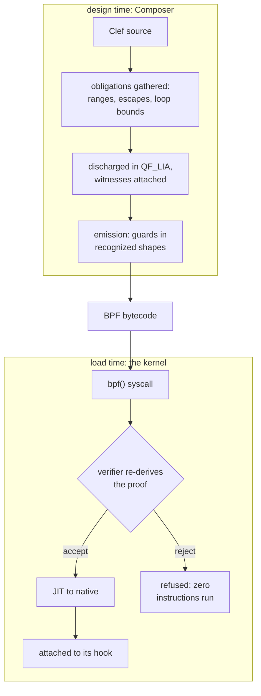
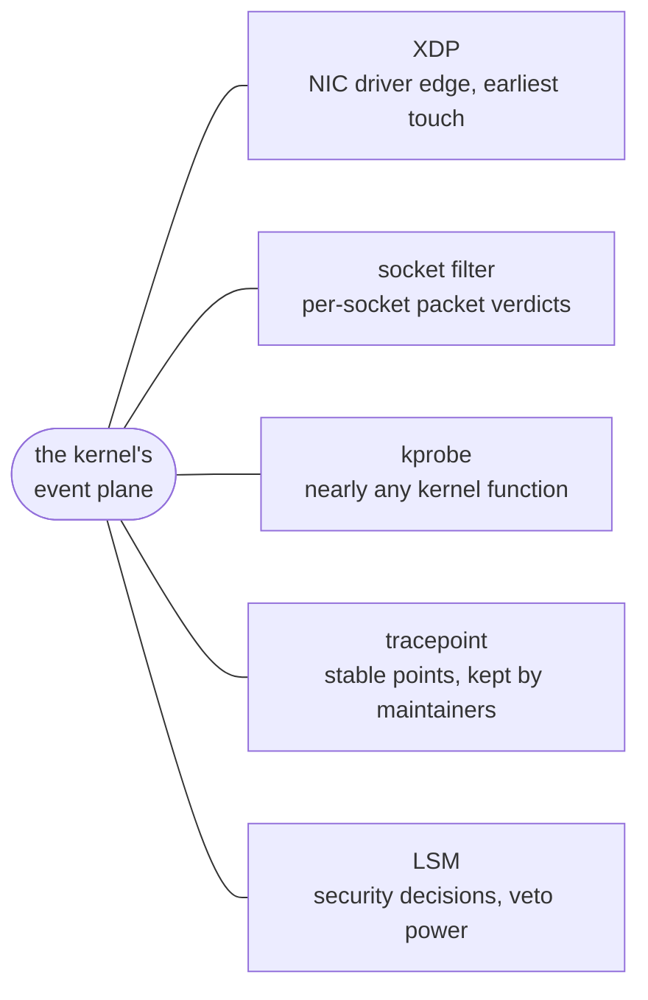
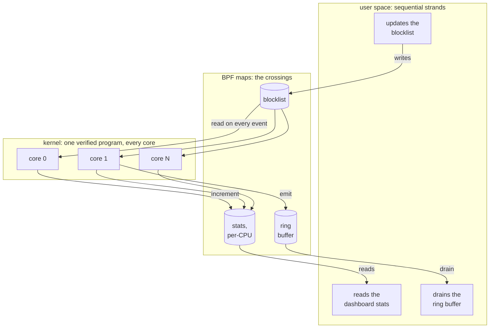

Here is a claim that should sound reckless. A program written by an application developer can be loaded into the running Linux kernel, on a production server, under live traffic, and the kernel will guarantee it cannot crash the machine. Not that it probably will not crash. That it ***cannot***. Netflix uses code like this to watch every disk request on live boxes. Cloudflare uses it to drop attack floods before the kernel allocates memory for a single junk packet. Google routes traffic between containers with it.

It sounds that way because everything the kernel is says it should be impossible. Ordinary programs run in user space, inside a quarantine the hardware enforces: when one crashes, the operating system shrugs and reaps it. The kernel has no such net. It runs with total privilege over the hardware, and a single bad pointer there does not kill a process, it can take down the whole machine. That depth is also exactly where a firewall, a profiler, or a packet filter wants to live, close to every event with nothing in the way. The problem is how to hand the kernel a program it has never seen and let it run there without betting the server on that program being correct.

The answer that grew up to solve this is [eBPF](https://ebpf.io), and its move is to stop trusting the code and start proving it. A program is submitted as bytecode, and before a single instruction runs, a static analyzer inside the kernel, the verifier, walks every path the program can take and refuses to load anything it cannot show is safe. The sandbox is a proof rather than a wall. Over the last decade that one idea turned the kernel from something to work around into something to deploy to.

Anyone who ships these programs knows the tax that follows. The verifier rejects what it cannot prove, and what it can prove depends on the exact shape of the bytecode in front of it. A bounds check that is airtight in C source can reach the verifier restructured by the optimizer into a form its range tracker no longer follows, and the load fails on a correct program. Teams pin compiler versions, scatter volatile qualifiers, and hand-place barriers to keep the optimizer from disturbing shapes the verifier needs to see. The verifier protects the kernel from your program. We are designing the complementary protection: a compiler that keeps your program from ever being rejected.

That is the position behind the eBPF target we have been sketching for our Composer compiler. The work is exploratory. None of it ships today, and the conditional voice below marks the parts that are design rather than demonstration. The claim under test is short: the verifier's demands are obligations a compiler can discharge at design time, and a program that compiles should be a program that loads.

## The Verifier Is a Type Checker

Strip away the mystique and the verifier is doing something familiar. It tracks a range for every register at every instruction and demands a bound for every loop. Stack bytes are accounted across calls. A pointer dereference that no comparison dominates is refused. In the compiler literature this is abstract interpretation, and it is the same family of analysis our compiler already runs at design time. Our width inference converges integer ranges to choose hardware bit widths, and it has carried those results through synthesis and place-and-route on a real FPGA design. Our escape classification decides where every value may live. The verifier asks the same kinds of questions about the same kinds of facts. It just asks them at the worst possible moment: after the program is built, at load, on the machine.

Laid end to end, the pipeline holds one program and two gates:



The first gate belongs to the compiler, where a failure is a source span and the fix is an edit. The second belongs to the kernel, where a failure is a production incident. Everything below is aimed at making the second gate a formality by the time bytecode reaches it.

| What the verifier demands | What our pipeline computes at design time |
|---|---|
| a provable bound on every loop | iteration ranges from the same interval convergence that drives width inference |
| per-register value ranges | interval analysis carried on the program semantic graph as coeffects |
| stack usage within 512 bytes | escape classification plus a linear byte-sum obligation |
| a guard dominating every pointer access | offset ranges, emitted as comparisons the range tracker follows |
| only helpers valid for the program type and kernel | a capability gate over the platform descriptor |

These obligations land in comfortable territory. The classifications come out of elaboration on their own, and the arithmetic obligations (loop bounds, offset ranges, stack sums) are linear integer problems. They are expressible in plain SMT-LIB2 and they sit in QF_LIA, a fragment where a solver's answers are sound and complete. Z3 is our first reach for discharging them, though the fragment is narrow enough that leaner decision procedures can serve the hot paths. Our [four-tier verification design]() was drawn for exactly this split: what elaboration gives for free stays free, and what needs a solver stays in fragments where the answers are exact.

The obligations are small enough to read whole. A stack ceiling for a probe with two frames, in the form a solver receives it:

```lisp
; stack obligation: frames on the probe's call chain sum within 512 bytes
(set-logic QF_LIA)
(declare-const frame_entry Int)   ; bytes, fixed by escape classification
(declare-const frame_parse Int)   ; bounded by a copy loop's iteration range
(assert (= frame_entry 96))
(assert (and (<= 0 frame_parse) (<= frame_parse 208)))
; assert the negation of the claim; unsat means no execution breaches it
(assert (not (<= (+ frame_entry frame_parse) 512)))
(check-sat)
```

The solver answers `unsat`: no admissible frame assignment breaches the ceiling, and the obligation is discharged with a witness that travels the middle end alongside the code it certifies. At load the kernel re-derives the same fact from the bytecode's stack accesses, which is the agreement the design banks on.

Termination deserves its own beat, because in general no static analysis settles it. The verifier does not try. It demands a bound, and so do we. In our design a loop bound must be established by an authority: inferred from dataflow where the ranges close, supplied by a library law, or sealed by the developer. A loop that no authority can bound is a design-time failure with a source span, in the same loud voice our numeric selection uses when no representation covers a value's range. The undecidable question never has to be asked, because the admissible subset is drawn so that unbounded loops sit outside it.

Proving the program safe is half the job. The other half is delivering bytecode in shapes the verifier's tracker recognizes, because the verifier accepts what it can reconstruct, and shape is part of the contract. Owning the emission path pays here. In our design the witnesses emit guards from a curated vocabulary of recognized idioms, and the local, decidable facts travel through Composer's middle end in MLIR's SMT dialect, re-checked at every lowering pass. A transformation that would deform a certified guard fails [that re-check]() inside the pipeline instead of surfacing as a kernel log on a production host. The optimizer that C developers fight is, in our design, contractually bound to preserve what was proven.

eBPF then supplies something no other target hands us: the artifact is re-judged at the door, every time, by machinery we do not control. At load the kernel re-derives admissibility from the delivered bytecode itself. For most targets that kind of final-artifact scrutiny would be a separate engineering program. Here it is built into the platform, and it turns continuous integration into a referee. The CI for this target would load every compiled object against a matrix of pinned kernels, where agreement is the expected case and any rejection is a reproducible bug against either the proof layer or the emission vocabulary. The kernel grades the compiler. That is a discipline we would pay for if it were for sale, and this target provides it for free.

## Hooks Are Pins

Every target our compiler serves is described by a platform descriptor. For the Arty A7 board the descriptor enumerates pins, clocks, and reset behavior as typed records, and our FPGA flow consumes those records to bind logical ports to physical pins all the way into the synthesis constraints. The kernel's programmable surface can be enumerated in the same voice. An attach point is a pin: it has a name, a context type it hands your program, and a return convention it expects back. A helper call is a peripheral: it has a signature, an availability window, and in some cases a licensing condition. Map kinds, stack ceilings, and instruction budgets fill out the record. The descriptor machinery our FPGA targets use carries this without extension. The addition is a set of new record types in the same contracts.

The pin board itself fits in one sketch. One event plane, and named places where a verified program can be pinned to it:



A pinned program is never invoked by the application that loaded it. An event fires, and the kernel runs the program right there, with the event's data in hand.

The kernel descriptor inverts a CPU habit. For a CPU target the instruction set is the variable that matters and the operating system sits in the background. eBPF flips that. The bytecode is fixed and portable, and the kernel's JIT settles the processor question at load. What varies is the host: which hooks exist, which helpers answer, what the verifier will accept. Each of those is a function of kernel version. For this target the operating system is the device.

The descriptor earns its keep on the version axis. A helper that arrived in kernel 5.17 is a capability with a floor. A map kind that arrived in 5.8 is another. Our project files would pin a minimum host version, and the capability gate filters every candidate against that pin. A use below the floor is a witnessed failure naming the version that would satisfy it. Our numeric selection already speaks this way when a target lacks a numeric representation, and the kernel surface slots into the same discipline without a new rule.

In the record vocabulary the FPGA targets already use, the sketch is direct:

```fsharp
// Sketch only. Names are illustrative; the working form lives
// in the Composer design series.
let linuxKernel : PlatformDescriptor = {
    Id          = "os-linux-ebpf"
    DisplayName = "Linux kernel, eBPF surface"
    Substrate   = SubstrateKind.Kernel
    HostFloor   = KernelVersion (5, 17)   // pinned by the project file
    Hooks = [
        { Name = "xdp";        Ctx = XdpMd;         Returns = XdpAction }
        { Name = "tracepoint"; Ctx = TracepointCtx; Returns = Ignored }
        { Name = "lsm";        Ctx = LsmCtx;        Returns = Errno }
    ]
    Helpers = [
        { Name = "bpf_map_lookup_elem"; Since = KernelVersion (3, 19) }
        { Name = "bpf_ringbuf_output";  Since = KernelVersion (5, 8) }
        { Name = "bpf_loop";            Since = KernelVersion (5, 17) }
    ]
    // map value layouts are checked against the running kernel's
    // BTF type information at load
    Budgets = { StackBytes = 512; VerifiedInstructions = 1_000_000 }
}
```

The Windows side keeps the design honest. Microsoft's [ebpf-for-windows](https://github.com/microsoft/ebpf-for-windows) runs the same bytecode behind a different gate, a verifier built on abstract interpretation and described in the published literature. Day to day we develop against a Linux kernel, and it would be easy to let Linux folklore harden into architecture. Holding the second gate in view prevents that. Admissibility is an operating-system concern, and the descriptors carry an OS axis for exactly that reason. A portable program targets the intersection of what both gates admit. WebAssembly sits one shelf over in the same class, a hosted instruction set behind a validator, and the descriptor constructs sketched here are drawn so a WASM target can pick them up unchanged.

## The Braid Reaches the Kernel

Our first sketch of this target pictured spawning one eBPF program per core, the way a thread pool scales. The real model is better. An eBPF program is loaded once, by one thread, and attached once to a kernel event. From that moment it is live across the system. The kernel executes it wherever the event fires, on whichever core, concurrently, and per-CPU map variants keep those executions free of lock contention. Kernel-side parallelism arrives without a single spawn.

The user-space side is free to fan out. A multi-threaded application drains the ring buffer with as many consumer threads as the event volume demands. Other threads steer the kernel program while it runs: one worker updates a blocklist map, another reads a statistics map for a live dashboard, and the program in the kernel consults the first and feeds the second on every event. Maps are the meeting point. Every strand of the application crosses the kernel's event plane through them.

Those maps are shared memory with a fixed layout, and fixed-layout shared memory is BAREWire's home ground. Our BAREWire contract has one governing property: both sides of a boundary interpret the same bytes by construction, with the schema settled at design time rather than negotiated at runtime. Nothing in that property is specific to user space. Map values in this design are pointer-free records, so the same schema that governs our IPC and our device links would govern what the kernel program writes and what the worker threads read. BAREWire's reach would extend past the syscall boundary. The contract gains a kernel leg.

We wrote about [the braid]() as sequential control interleaved with parallel width, carried with its crossings intact. This is that picture reaching into the operating system. The sequential strands are your application's threads. The parallel width is the kernel executing one verified program across every core where events land. The crossings are map operations, and the design-time work above (an admissible program, schema-shared layouts, capability-gated map kinds) makes those crossings safe to carry at full speed.

One frame of that weave, with maps at every crossing:



## The Kernel Joins the Weave

Our heterogeneous compute demo gives that picture a first workload. The demo routes a gravitational simulation across four processors, and its timestep-critical traffic reaches an FPGA over a raw Ethernet link. The kernel is the natural place to steer those frames past the network stack, and a steering program our own compiler can prove admissible gives the fast path the same design-time evidence as everything above it. The kernel takes a seat in the same weave as the FPGA, the GPU, and the NPU.

The design series for this target lives in our Composer repository and will grow in the open. The proof layer it leans on is coming up now, and we expect the kernel to be the first referee that layer faces, on every load, with no appeals. We find that prospect clarifying. The work continues, and we will keep writing as it takes shape.
