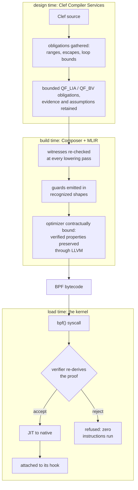
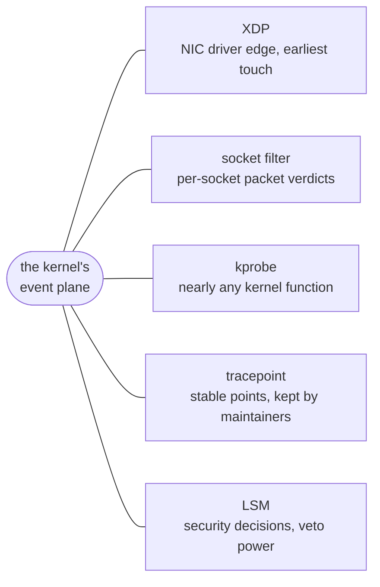
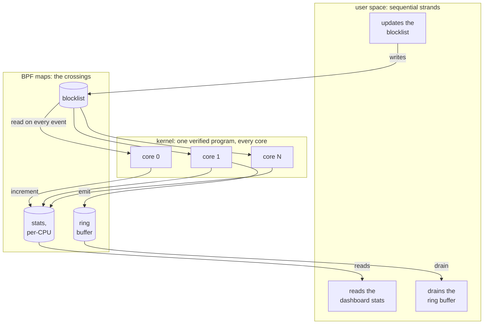

Here is a useful bit of audacity: you can give a running operating system a small program to execute inside its kernel, right where packets arrive and system events happen. Before admitting it, the kernel checks the program's operations and memory accesses.

> The kernel asks for evidence before it lets the program run.

Netflix uses code like this to watch every disk request on live systems. Cloudflare uses it to drop attack floods before the kernel allocates memory for a single junk packet. Google routes traffic between containers with it.

We want to bring that conversation into the editor. Show the missing bound next to the loop. Name the helper the target kernel does not provide. Keep the evidence alongside the program through compilation, then check the artifact against the host it will actually run on. That makes the obligations useful while the developer can still act on them.

It sounds bizarre at first because everything *the kernel **is*** says it should be impossible. Ordinary programs run in user space, inside a quarantine the OS enforces: when one crashes, the operating system shrugs and reaps it. The **OS kernel** has no such net. It runs with total privilege over the hardware, and a single bad pointer at that tier does not *just* kill a process, it can take down the *entire* machine. That depth is also exactly where a firewall, a profiler, or a packet filter operates, close to every low level event. The challenge has always been how to hand the kernel a program it has never seen and let it run resident without betting the entire server on that single program being correct.

The answer that grew up to solve this is [eBPF](https://ebpf.io). Before an attached program runs, the kernel's [verifier](https://docs.kernel.org/bpf/verifier.html) checks its bytecode against rules for permitted operations, memory access and control flow. It refuses programs whose safety it cannot establish. That is a powerful change in the deployment model. The guarantee assumes the verifier, JIT, helpers and host implement their declared contracts; that trusted boundary stays explicit in the evidence.

Now we are working on a design-time experience that we hope to make the formalism approachable. Our goal is to enable any developer to deliver a reliable eBPF program that can be confidently deployed.

Anyone who ships these programs knows the tax that usually comes with that lofty low-level goal. The verifier rejects what it cannot prove, and what it can prove depends on the exact shape of the bytecode in front of it. 

> Chasing byte-code errors is not for the feint of heart.

A bounds check that is airtight in C source can reach the verifier restructured by the optimizer into a form its range tracker no longer follows, and the load fails on an otherwise 'correct' looking source description. The compensation mechanisms are varying and numerous. Teams pin compiler versions, scatter volatile qualifiers, and hand-place barriers to curated optimization that they hope lowers to byte code correctly. It's a cruel exchange. We want the compiler to catch that disagreement before deployment, with a diagnostic that points back to the source and the target contract.

That is the position behind the eBPF target we have been designing for our Composer compiler. Within a bounded target subset and a pinned host profile, successful compilation should agree with verifier admission. An unexpected rejection is a reproducible compiler or contract bug, not a reason to bypass the kernel's gate. The complete eBPF path and its proof-preserving lowering remain implementation work; the diagrams below describe that design.

## The Verifier Is a Type Checker

Strip away the mystique and that verifier is doing something those of us in the ML-family language tradition consider table stakes. It tracks a range for every register at every instruction and demands a bound for every loop. Stack bytes are accounted across calls. A pointer dereference that no comparison dominates is *refused*. In the compiler literature this is abstract interpretation, and it is the same family of analysis our compiler already runs at design time. Our width inference converges integer ranges to choose hardware bit widths, and we've shown our pipeline carries those results through synthesis and place-and-route on a real FPGA design. Our [escape classification]() decides where every value may live. So that verifier asks the same kinds of questions about the same kinds of facts. It just asks them at the worst possible moment: after the program is built, near load time, at the most expensive possible place to recover information.

Our pipeline is designed around two proof dispatches over one obligation graph, followed by the kernel's independent admission gate:



The first dispatch belongs to Clef Compiler Services (CCS), where a failure can name a source span and the declaration it contradicts. At build time, the design calls for Composer to revalidate the relevant obligations through lowering. Both dispatches must refer to the same facts, including explicit external assumptions. The kernel then judges the delivered bytecode independently; its gate remains authoritative.

| What the verifier demands | What CCS handles at design time |
|---|---|
| a provable bound on every loop | iteration ranges from the same interval convergence that drives width inference |
| per-register value ranges | interval analysis carried on the program semantic graph as coeffects |
| stack usage within 512 bytes | escape classification plus a linear byte-sum obligation |
| a guard dominating every pointer access | offset ranges, emitted as comparisons the range tracker follows |
| only helpers valid for the program type and kernel | a capability gate over the platform descriptor |

Many of these obligations land in comfortable territory. Once their premises are established, offset bounds and stack sums are linear integer problems expressible in SMT-LIB2's QF_LIA; fixed bit-layout questions can use QF_BV. Those fragments are decidable. That does not make every query cheap, nor turn arbitrary loop analysis or nonlinear arithmetic into a linear problem. Our first reach is cvc5, with bounded queries and explicit solver budgets. A timeout or unknown result leaves an obligation unresolved. The [four-tier verification design]() needs that distinction, and a stable diagnostic identifying the missing premise, as much as it needs successful proofs.

The obligations are small enough to read whole. A stack ceiling for a probe with two frames, in the form a solver receives it:

```lisp
; stack obligation: frames on the probe's call chain sum within 512 bytes
(set-logic QF_LIA)
(declare-const frame_entry Int)   ; bytes, fixed by escape classification
(declare-const frame_parse Int)   ; bounded by a copy loop's iteration range
(assert (= frame_entry 96))
(assert (and (<= 0 frame_parse) (<= frame_parse 208)))
; assert the negation of the claim; unsat means no execution breaches it
(assert (not (<= (+ frame_entry frame_parse) 512)))
(check-sat)
```

The solver answers `unsat`: no assignment satisfying those premises breaches the ceiling. The proposed preservation chain must also establish that the emitted frames obey those premises. At load, the kernel checks the bytecode's actual stack accesses. The arithmetic proof and the artifact check complement each other; the first does not substitute for the second.

'Termination' deserves its own zoom-in moment, because no analysis settles it for arbitrary programs. Our proposed subset requires a bound justified by dataflow or a declared contract with its premises recorded. A missing bound may remain pending during elaboration; it becomes a located diagnostic when admission depends on it. Current [numeric selection](/spec/draft/numeric-selection/) follows the same discipline at representation commitment: no source seal or width-named numeric type supplies an escape hatch. The platform or boundary declares a representation, and the compiler must establish coverage. Restricting the accepted subset makes the question manageable; it does not solve arbitrary termination.

Proving the program safe is ***half* the job**. The other half is delivering bytecode in shapes the verifier's tracker recognizes, because the verifier accepts what it can reconstruct, and shape is part of the contract. Providing a purpose-built lowering path is value here. In our design the semantic graph is witnessed into formalized guards from a curated vocabulary of recognized idioms, and the local, decidable facts travel through Composer's middle end in MLIR's SMT dialect. The intended [re-check]() rejects a transformation when it cannot establish preservation. That design still needs artifact-level agreement tests against the pinned verifier; a promise about the optimizer alone is not evidence.

eBPF supplies something no other target has shown: the artifact is ***re*-judged** at the processor, every time. At load the kernel re-derives admissibility from the delivered bytecode itself. For most targets that kind of final-artifact scrutiny would be a separate engineering program. Here it is built into the OS kernel itself. The CI for this target would load every compiled object against a matrix of pinned kernels, where agreement is the expected case and any rejection is a reproducible bug against either the proof layer or the emission vocabulary.

## Hooks Are Pins

Every target our compiler aims to serve is described by a ['platform' descriptor](/spec/draft/platform-bindings/) (Fidelity.Platform). For the Arty A7 FPGA board the descriptor enumerates pins, clocks, and reset behavior as typed records, and our FPGA flow consumes those records to bind logical ports to physical pins all the way into the synthesis constraints. 

We see the eBPF program's programmable surface as enumerated in the same procedure. An attach point is a pin: it has a name, a context type it hands your program, and a return convention it expects back. A helper call is a peripheral: it has a signature, an availability window, and in some cases a licensing condition. Map kinds, stack ceilings, and instruction budgets fill out the description. BAREWire now has the shared vocabulary for these declarations: endpoints on boundary surfaces, memory spaces, buffers and limits. Fidelity.Platform supplies the target-specific facts.

An attached program runs when its hook's event fires, with the context the kernel supplies.



The kernel descriptor inverts the CPU frame. When considering a standard user space application, the view from "top down" is that the operating system sits at a layer of remove. eBPF flips that. The bytecode is fixed and portable, and the kernel's JIT settles the processor question at load, with a well-formed interface to derive and collect data at kernel speed. What varies is the host: which hooks exist, which helpers answer, what the verifier will accept. Each of those is a function of a given kernel version. For this target the operating system **is** *the device* so to speak.

The descriptor earns its keep on the version axis. BAREWire endpoints carry availability windows, and its tests distinguish `bpf_loop`'s 5.17 floor from a 5.4 host. Connecting those declarations to every compiler use and to a pinned deployment profile is the next obligation. The [capability gate](/spec/draft/platform-predicates/) should then report a stable diagnostic naming the use, the host and the missing capability. A version number alone does not establish that a particular host configuration permits the operation.

The current declaration vocabulary makes the kernel-facing portion concrete:

```fsharp
open BAREWire.Platform

let hooks =
    BoundarySurface.create "hooks" SurfaceKind.HostApi [|
        Endpoint.hook "xdp" "xdp_md -> xdp_action" ""
        Endpoint.hook "lsm" "lsm_ctx -> errno" "5.7"
    |]

let helpers =
    BoundarySurface.create "helpers" SurfaceKind.HostApi [|
        Endpoint.helper "bpf_map_lookup_elem" 1 "3.19" [||]
        Endpoint.helper "bpf_ringbuf_output" 130 "5.8" [||]
        Endpoint.helper "bpf_loop" 181 "5.17" [||]
    |]

// These declarations join spaces, buffers and limits in PlatformDescription.
// Helper contracts are empty here; this example supplies no proof about them.
```

BTF can serialize the declared struct layouts for kernel tooling. Agreement between producer and consumer layouts still needs checking; attaching type metadata is not itself a proof that a program preserves the values it carries.

The Windows branch of this domain keeps the design honest. Microsoft's [ebpf-for-windows](https://github.com/microsoft/ebpf-for-windows) runs the same bytecode behind a different gate, a verifier built on abstract interpretation and described in the published literature. Day to day we develop against a Linux kernel, and it would be easy to let Linux folklore harden into architecture. Holding the second target in view prevents that. Admissibility is an operating-system concern, and the descriptors carry an OS axis for exactly that reason. 

## How Our Braid Reaches the Kernel

Our first sketch of this target pictured spawning one eBPF program per core, the way a thread pool scales. The real model is more compelling. A program can be loaded and attached once, then execute concurrently on the cores where its hook's events occur. Per-CPU maps can avoid a shared counter on that path; aggregate reads and other shared state still have their own concurrency rules.

> Kernel-side parallelism, without a single spawn.

The user-space side can fan out over threads and processes, while respecting each shared structure's concurrency contract. A BPF ring buffer has a consumer position; draining it and dispatching work to multiple workers is different from giving each worker an independent consumer cursor. Other threads can steer the kernel program: one updates a blocklist map, another reads a statistics map for a dashboard. Maps are the meeting point, with synchronization and lifetime obligations attached to those crossings. The [kernel's ring-buffer documentation](https://docs.kernel.org/bpf/ringbuf.html) makes that ownership model concrete.

Those maps are shared memory with a fixed layout, and fixed-layout shared memory is [our BAREWire component's home turf](). Our BAREWire contract has a primary governing property: both sides of a boundary interpret the same bytes by construction, with the schema settled at design time. Nothing in that property is specific to user space. Map values in this design are pointer-free records, so the same schema that governs our IPC and our device links would govern what the kernel program writes and what the worker threads read. BAREWire's reach would extend past the syscall boundary. The contract gains a kernel 'leg'. While BAREWire was originally contemplated for communication across processor types, the eBPF application is a key extension that we see enabling the use of CPUs as a new class of *accelerator* for certain types of novel applications.

We wrote about [the braid]() as sequential control interleaved with parallel width, carried with its crossings intact. This is that picture reaching into the operating system. The sequential strands are your application's threads. The parallel width is the kernel executing one verified program across every core where events land. The crossings are map operations, and the design-time work above (an admissible program, schema-shared layouts, capability-gated map kinds) would ostensibly make those crossings safe to carry at full speed.

One frame of that weave, with maps at every crossing:



## The Kernel Joins the Weave

ThreeBody aims to demonstrate how posit/quire precision can extend useful prediction and tape-free numerical reversal in a chaotic gravitational simulation. We negate momenta and recompute the return trajectory, then measure the residual against an independent high-precision reference, with FP64 and compensated-summation controls. Those curves will establish the useful Lyapunov horizon achieved by each representation; a number format does not change the physical system's Lyapunov exponent.

The proposed placement spans CPU, GPU, NPU and an FPGA sidecar on raw Ethernet. Outgoing work uses AF_XDP TX; incoming replies reach XDP and an AF_XDP RX ring. Zero-copy is conditional on the driver and bind mode, not a consequence of calling the path AF_XDP. Those distinctions are documented in the [kernel's AF_XDP guide](https://docs.kernel.org/networking/af_xdp.html).

BAREWire is the glue for the shared representation and layout. The endpoints agree on dimensions, format, limb order and bounds before types are erased; the bytes themselves carry no numerical proof. Kernel admission establishes a different fact: that the routing program obeys the verifier's safety rules. A legal routing program can still change or drop a payload. Preserving its contents, matching replies to the right timestep, respecting buffer ownership and detecting stale sessions each needs its own obligation or explicit assumption. Together those contracts support the experiment. The same glue also serves Conclave, a platform for intelligent distributed systems on Cloudflare.

Nor does a quire make the whole simulation exact. Its capacity is finite: the represented products and every partial sum must fit. It avoids intermediate accumulation rounding under those conditions, but it cannot undo prior input error, final rounding or chaotic amplification. Tape-free numerical reversal and its residual are the demonstration; compiler and kernel proofs help us trust how the experiment was carried out. ThreeBody remains a design awaiting that composed runtime evidence.

The design series lives in our Composer repository. Standalone packet-counter, guarded-filter, telemetry and AF_XDP examples come before the ThreeBody synthesis, each checked by compiling, loading and running on a pinned host. That gives the compiler work an independent test while the numerical experiment develops. The work continues, and we will keep writing as the evidence takes shape.
