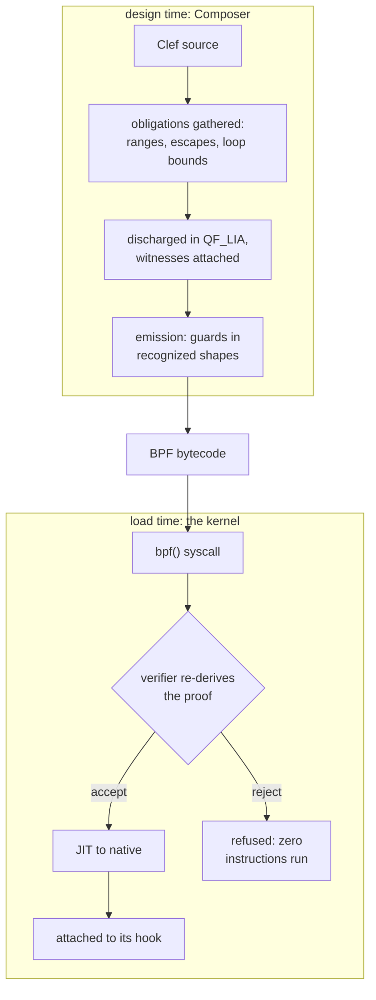
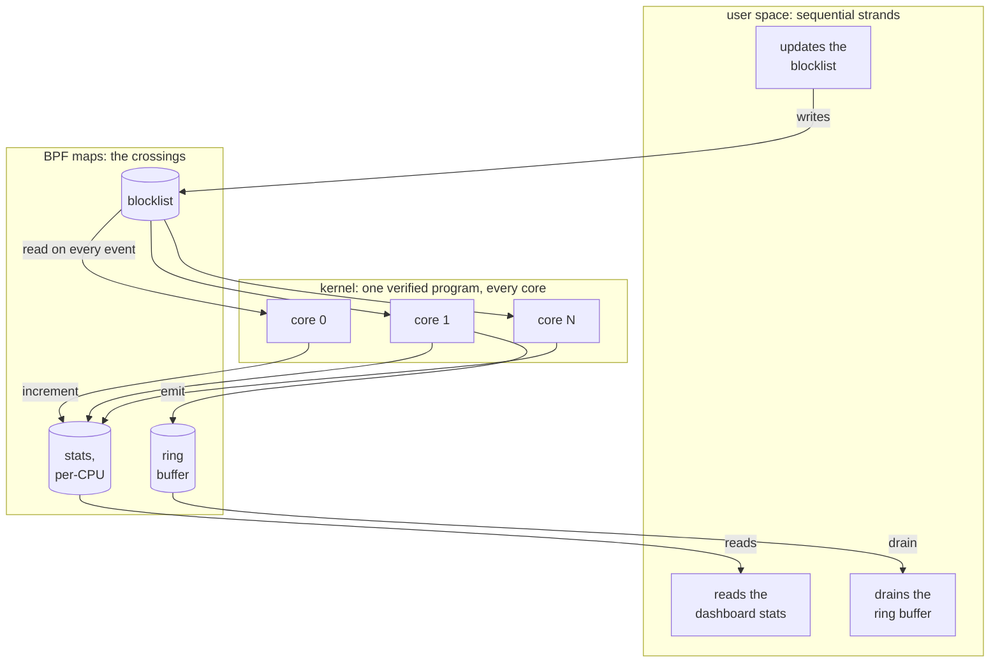

Here is a claim that might sound a bit reckless on the surface: an kernel-level program written by an application developer can be loaded into the running OS kernel, on a production server, under live traffic, and the kernel carries a guarantee that program cannot crash the machine. 

> Not that it probably will not crash. That it **cannot**. 

Netflix uses code like this to watch every disk request on live systems. Cloudflare uses it to drop attack floods before the kernel allocates memory for a single junk packet. Google routes traffic between containers with it.

And now for the first time we're putting a design-time safety net in a programming workflow that guarantees *if the compiler allows it, the eBPF program will not crash the OS kernel.* That's a bold claim, but one that we feel that we are uniquely qualified to deliver.

It sounds bizarre at first because everything *the kernel **is*** says it should be impossible. Ordinary programs run in user space, inside a quarantine the OS enforces: when one crashes, the operating system shrugs and reaps it. The **OS kernel** has no such net. It runs with total privilege over the hardware, and a single bad pointer at that tier does not *just* kill a process, it can take down the *entire* machine. That depth is also exactly where a firewall, a profiler, or a packet filter operates, close to every low level event. The challenge has always been how to hand the kernel a program it has never seen and let it run resident without betting the entire server on that single program being correct.

The answer that grew up to solve this is [eBPF](https://ebpf.io), and its move is to stop 'trusting' code and **prove its validity** instead. A program is submitted as bytecode, and before a single instruction runs, a static analyzer inside the kernel, the verifier, walks every path the program can take and refuses to load anything it cannot show is safe. The sandbox is a proof rather than a wall. Over the last decade that one idea turned the kernel from something to work around into something to deploy to.

Now we are working on a design-time experience that we hope to make the formalism approachable. Our goal is to enable any developer to deliver a reliable eBPF program that can be confidently deployed.

Anyone who ships these programs knows the tax that usually comes with that lofty low-level goal. The verifier rejects what it cannot prove, and what it can prove depends on the exact shape of the bytecode in front of it. 

> Chasing byte-code errors is not for the feint of heart.

A bounds check that is airtight in C source can reach the verifier restructured by the optimizer into a form its range tracker no longer follows, and the load fails on an otherwise 'correct' looking source description. The compensation mechanisms are varying and numerous. Teams pin compiler versions, scatter volatile qualifiers, and hand-place barriers to curated optimization that they hope lowers to byte code correctly. It's a cruel exchange. The verifier 'protects' the kernel from your program. We are designing a solution that inverts that premise: to provide a compiler that keeps your program *from ever being rejected*.

That is the position behind the eBPF target we have been designing for our Composer compiler. Our claims under this evaluation are short: the verifier's demands are obligations our compiler can discharge at design time, and a program that compiles in that frame should be a program that verifies and loads without issue.

## The Verifier Is a Type Checker

Strip away the mystique and that verifier is doing something those of us in the ML-family language tradition consider table stakes. It tracks a range for every register at every instruction and demands a bound for every loop. Stack bytes are accounted across calls. A pointer dereference that no comparison dominates is *refused*. In the compiler literature this is abstract interpretation, and it is the same family of analysis our compiler already runs at design time. Our width inference converges integer ranges to choose hardware bit widths, and we've shown our pipeline carries those results through synthesis and place-and-route on a real FPGA design. Our [escape classification]() decides where every value may live. So that verifier asks the same kinds of questions about the same kinds of facts. It just asks them at the worst possible moment: after the program is built, near load time, at the most expensive possible place to recover information.

Laid end to end, our pipeline holds one program and two gates:



The first gate belongs to the Clef Compiler Service (CCS), where a failure is a design-time source span in the editor and the fix is immediate. Everything below is aimed at making the second gate a formality by the time bytecode reaches it.

| What the verifier demands | What CCS handles at design time |
|---|---|
| a provable bound on every loop | iteration ranges from the same interval convergence that drives width inference |
| per-register value ranges | interval analysis carried on the program semantic graph as coeffects |
| stack usage within 512 bytes | escape classification plus a linear byte-sum obligation |
| a guard dominating every pointer access | offset ranges, emitted as comparisons the range tracker follows |
| only helpers valid for the program type and kernel | a capability gate over the platform descriptor |

These obligations land in comfortable territory. The classifications come out of elaboration on their own, and the arithmetic obligations (loop bounds, offset ranges, stack sums) are linear integer problems. They are expressible in plain SMT-LIB2 and they sit in QF_LIA, a fragment where a design-time solver's answers are sound and complete. Z3 is our first reach for discharging them, though the fragment is narrow enough that leaner decision procedures can serve the hot paths. Our [four-tier verification design]() was drawn for exactly this split: what elaboration gives for free stays free, and what needs a solver stays in fragments where the obligations are exact and discharge is fast.

The obligations are small enough to read whole. A stack ceiling for a probe with two frames, in the form a solver receives it:

```lisp
; stack obligation: frames on the probe's call chain sum within 512 bytes
(set-logic QF_LIA)
(declare-const frame_entry Int)   ; bytes, fixed by escape classification
(declare-const frame_parse Int)   ; bounded by a copy loop's iteration range
(assert (= frame_entry 96))
(assert (and (<= 0 frame_parse) (<= frame_parse 208)))
; assert the negation of the claim; unsat means no execution breaches it
(assert (not (<= (+ frame_entry frame_parse) 512)))
(check-sat)
```

The solver answers `unsat`: no admissible frame assignment breaches the ceiling, and the obligation is discharged with a witness that travels the middle end alongside the code it certifies. At load the kernel re-derives the same fact from the bytecode's stack accesses, which is the design "shifted left" to resolve before the verifier performs its checks.

'Termination' deserves its own zoom-in moment, because in general *no* static analysis settles it. The verifier does not try. It demands a bound, and so do we. In our design a loop bound must be established by an authority: inferred from dataflow where the ranges close, supplied by a pre-built 'lemma library', or sealed by the developer at design time. A loop that no authority can bound is a design-time failure with a source span, in the same area of concern our [numeric selection](/spec/draft/numeric-selection/) uses when no representation covers a value's range. The undecidable question never surfaces, because the admissible subset is drawn so that unbounded loops can't exist.

Proving the program safe is ***half* the job**. The other half is delivering bytecode in shapes the verifier's tracker recognizes, because the verifier accepts what it can reconstruct, and shape is part of the contract. Providing a purpose-built lowering path is value here. In our design the semantic graph is witnessed into formalized guards from a curated vocabulary of recognized idioms, and the local, decidable facts travel through Composer's middle end in MLIR's SMT dialect, re-checked at every lowering pass. A transformation that would deform a certified guard fails [that re-check]() inside the pipeline instead of surfacing as a kernel log on a production host. The optimizer that C developers ***fight*** is, in our design, contractually bound to preserve what was proven and so never raise an issue in the byte code verification pass.

eBPF supplies something no other target has shown: the artifact is ***re*-judged** at the processor, every time. At load the kernel re-derives admissibility from the delivered bytecode itself. For most targets that kind of final-artifact scrutiny would be a separate engineering program. Here it is built into the OS kernel itself. The CI for this target would load every compiled object against a matrix of pinned kernels, where agreement is the expected case and any rejection is a reproducible bug against either the proof layer or the emission vocabulary.

## Hooks Are Pins

Every target our compiler aims to serve is described by a ['platform' descriptor](/spec/draft/platform-bindings/) (Fidelity.Platform). For the Arty A7 FPGA board the descriptor enumerates pins, clocks, and reset behavior as typed records, and our FPGA flow consumes those records to bind logical ports to physical pins all the way into the synthesis constraints. 

We see the eBPF program's programmable surface as enumerated in the same procedure. An attach point is a pin: it has a name, a context type it hands your program, and a return convention it expects back. A helper call is a peripheral: it has a signature, an availability window, and in some cases a licensing condition. Map kinds, stack ceilings, and instruction budgets fill out the record. The descriptor machinery our FPGA targets use carries this without extension. The addition is a set of new record types in the same contracts for eBPF scenarios.

A pinned program is never invoked by the application that loaded it. An event fires, and the kernel runs the program right there, with the event's data.


The kernel descriptor inverts the CPU frame. When considering a standard user space application, the view from "top down" is that the operating system sits at a layer of remove. eBPF flips that. The bytecode is fixed and portable, and the kernel's JIT settles the processor question at load, with a well-formed interface to derive and collect data at kernel speed. What varies is the host: which hooks exist, which helpers answer, what the verifier will accept. Each of those is a function of a given kernel version. For this target the operating system **is** *the device* so to speak.

The descriptor earns its keep on the version axis. A helper that arrived in kernel 5.17 is a capability with a floor. A map kind that arrived in 5.8 is another. Settling this as a structured capability map is the subject of some design consideration. We imagine that project files would pin a minimum host version, and the [capability gate](/spec/draft/platform-predicates/) might filter every candidate against that pin. A use below the floor is a witnessed failure naming the version that would satisfy it. This too would be a design-time diagnostic that would provide a "pit of success" framing that can be corrected when the cost of re-directing the course of the program is 'cheap'. Our numeric selection already surfaces information this way when a target lacks a numeric representation, and we expect that the eBPF program surface will slot into the same discipline without significant additional work.

In the record vocabulary the FPGA targets already use, the sketch is direct:

```fsharp
let linuxKernel : PlatformDescriptor = {
    Id          = "os-linux-ebpf"
    DisplayName = "Linux kernel, eBPF surface"
    Substrate   = SubstrateKind.Kernel
    HostFloor   = KernelVersion (5, 17)   // pinned by the project file
    Hooks = [
        { Name = "xdp";        Ctx = XdpMd;         Returns = XdpAction }
        { Name = "tracepoint"; Ctx = TracepointCtx; Returns = Ignored }
        { Name = "lsm";        Ctx = LsmCtx;        Returns = Errno }
    ]
    Helpers = [
        { Name = "bpf_map_lookup_elem"; Since = KernelVersion (3, 19) }
        { Name = "bpf_ringbuf_output";  Since = KernelVersion (5, 8) }
        { Name = "bpf_loop";            Since = KernelVersion (5, 17) }
    ]
    // map value layouts are checked against the running kernel's
    // BTF type information at load
    Budgets = { StackBytes = 512; VerifiedInstructions = 1_000_000 }
}
```

The Windows branch of this domain keeps the design honest. Microsoft's [ebpf-for-windows](https://github.com/microsoft/ebpf-for-windows) runs the same bytecode behind a different gate, a verifier built on abstract interpretation and described in the published literature. Day to day we develop against a Linux kernel, and it would be easy to let Linux folklore harden into architecture. Holding the second target in view prevents that. Admissibility is an operating-system concern, and the descriptors carry an OS axis for exactly that reason. 

## How Our Braid Reaches the Kernel

Our first sketch of this target pictured spawning one eBPF program per core, the way a thread pool scales. The real model is more compelling. An eBPF program is loaded once, by one thread, and attached once to a kernel event. From that moment it is live across the system. The kernel executes it wherever the event fires, on whichever core, concurrently, and per-CPU map variants keep those executions free of lock contention. 

> Kernel-side parallelism, without a single spawn.

The user-space side is in-essence free to 'fan out' over threads and processes. A multi-threaded application drains the ring buffer with as many consumer threads as the event volume demands. Other threads steer the kernel program while it runs: one worker updates a blocklist map, another reads a statistics map for a live dashboard, and the program in the kernel consults the first and feeds the second on every event. Maps are the meeting point. Every strand of the application crosses the kernel's event plane through them. We have built the Fidelity Framework to take advantage of this across processor types, and here it is available between the OS kernel and user space.

Those maps are shared memory with a fixed layout, and fixed-layout shared memory is [our BAREWire component's home turf](). Our BAREWire contract has a primary governing property: both sides of a boundary interpret the same bytes by construction, with the schema settled at design time. Nothing in that property is specific to user space. Map values in this design are pointer-free records, so the same schema that governs our IPC and our device links would govern what the kernel program writes and what the worker threads read. BAREWire's reach would extend past the syscall boundary. The contract gains a kernel 'leg'. While BAREWire was originally contemplated for communication across processor types, the eBPF application is a key extension that we see enabling the use of CPUs as a new class of *accelerator* for certain types of novel applications.

We wrote about [the braid]() as sequential control interleaved with parallel width, carried with its crossings intact. This is that picture reaching into the operating system. The sequential strands are your application's threads. The parallel width is the kernel executing one verified program across every core where events land. The crossings are map operations, and the design-time work above (an admissible program, schema-shared layouts, capability-gated map kinds) would ostensibly make those crossings safe to carry at full speed.

One frame of that weave, with maps at every crossing:



## The Kernel Joins the Weave

Our heterogeneous compute demo gives that picture a first workload. We currently have a "Three Body" demo on the board to demonstrate CPU and FPGA, communicating over a Layer 2 network connection, routing key elements of a gravitational simulation across four processors. Its timestep-critical traffic reaches an FPGA over a raw Ethernet link. The kernel is the natural place to steer those frames past the network stack, and a steering program our own compiler can prove admissible gives the fast path the same design-time evidence as everything above it. The kernel takes a seat in the same weave as the FPGA, the GPU, and the NPU. This is among the reasons why the Three Body demo is important - to show the Fidelity Framework as uniquely qualified for producing provably correct systems applications. eBPF targeting is a critical juncture to show that this framework can get performance out of extant hardware in a way that is uniquely valuable.

The design series for this target currently resides in our Composer repository and will grow as we develop the implementation in the open. The proof layer it leans on is coming 'on bench' now, and we expect the kernel to be the first genuine 'test' that layer will encounter. We find that prospect clarifying, and genuinely exciting. The work continues, and we will keep writing as the narrative and the work product takes shape.
