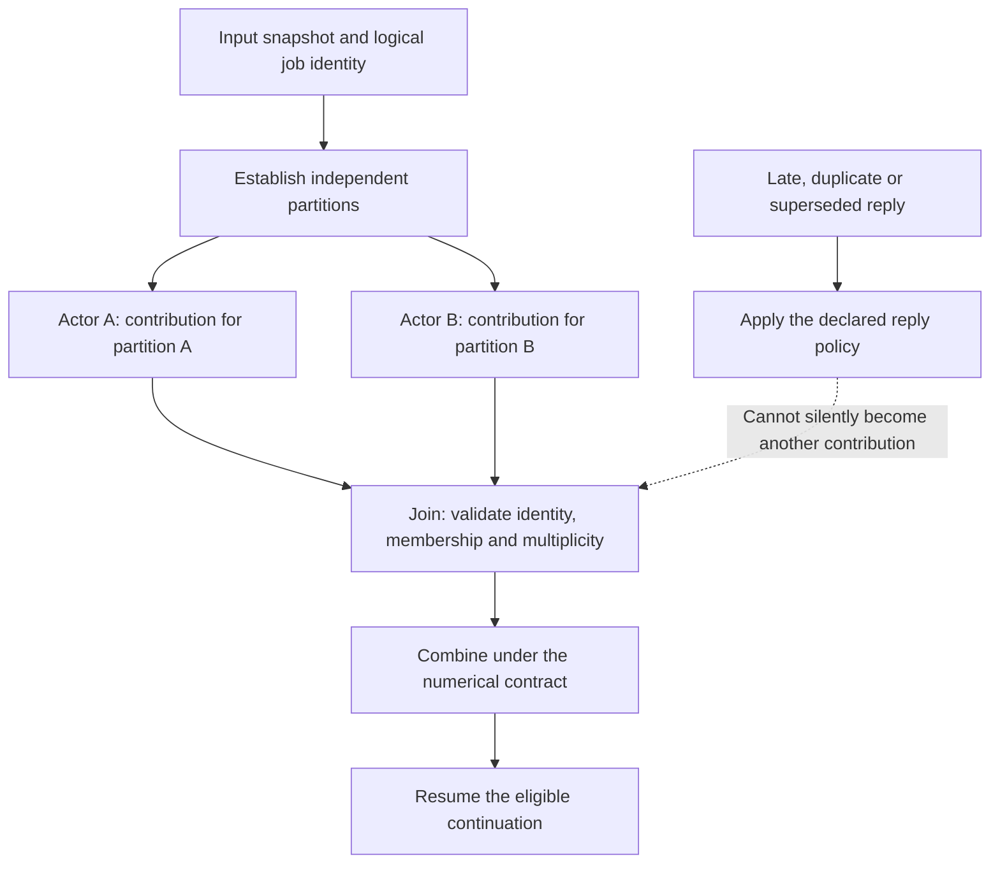
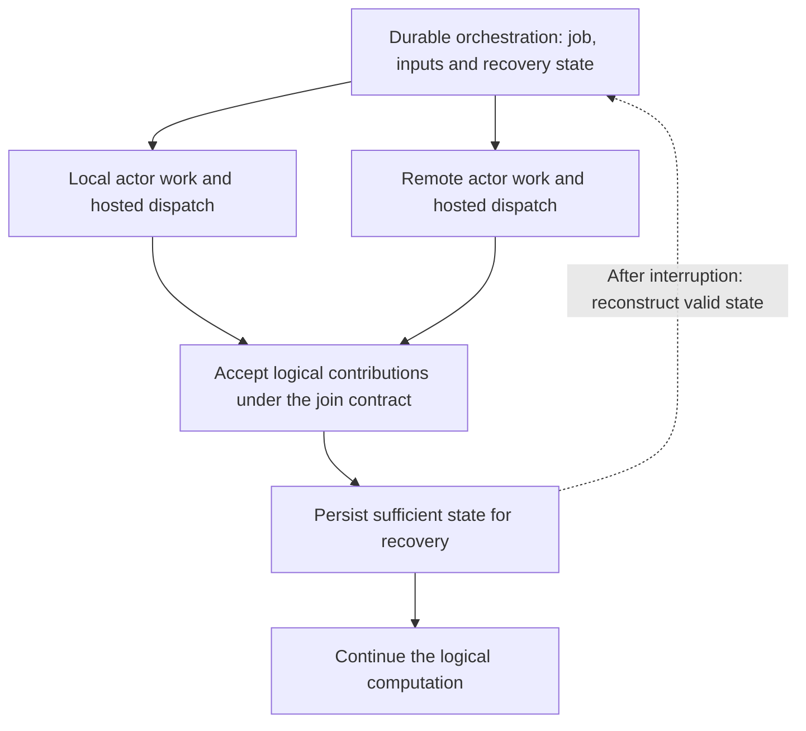

“JavaScript is single-threaded” is a reassuring sentence. It explains why two ordinary callbacks do not simultaneously change an object inside one event loop. It can also persuade us to stop thinking about concurrency just before the interesting part begins.

Most of our considerations around JavaScript targeting center on Cloudflare as a 'backplane' provider. A durable workflow can resume after the isolate that began its execution has been discarded. The arithmetic is still arithmetic, the replies still belong to particular questions, and the application still owes its user a coherent result.

In [Pondering Fearless Parallelism](/blog/pondering-fearless-parallelism/), we explored how a compiler might establish which ways of dividing numerical work preserve its answer. That discussion reaches naturally into JavaScript. A single isolate simplifies one part of execution; a useful application can involve many isolates, many suspended operations, and several generations of a calculation in flight.

The central opportunity is numerical: which exactness, error, and reproducibility guarantees can a compiler establish using the arithmetic JavaScript actually provides? Cloudflare supplies execution and coordination facilities. Our contribution is to establish the numerical contract of the work they carry, and preserve it across those boundaries.

This is a design companion to an earlier, more general treatment. Our [JavaScript targeting work](/docs/design/javascript-targeting/) distinguishes the working F#/Fable path from Composer's proposed JSIR backend. The actor, workflow, and proof-preserving lowering described here are the implementation direction. The [technical companion](/docs/design/javascript-targeting/proof-preservation-across-actors-and-workflows/) records the obligations and acceptance cases.

## About JavaScript Arithmetic

JavaScript's constrained numerical environment gives us a concrete basis for reasoning. For the ordinary `Number` operations considered here, the target is binary64 arithmetic. The compiler can work from those specified operations and select a construction whose premises it can establish. In the proposed design, recognizing a supported computation generates its numerical proof obligations automatically as part of ordinary compilation. The developer expresses the calculation and its engineering requirements; the compiler derives the arithmetic conditions needed to satisfy them. The guarantees are mathematical properties of that construction:

- **Exact integer computation within a proved range.** If admitted integer inputs and every exact intermediate remain within binary64's consecutive-integer range, addition, subtraction, and multiplication preserve their mathematical integer results. A small final answer alone is insufficient.
- **Exact fixed-point operations, or a stated quantization bound.** Scale alignment and carrier capacity can establish exactness. When rescaling discards information, its rounding rule determines a local error bound that the analysis must propagate through subsequent operations.
- **Recovery of a floating-point rounding residual.** A construction such as TwoSum can represent the exact sum of two finite inputs as two `Number` components under its established conditions. Ordinary JavaScript arithmetic can carry more information than one rounded scalar.
- **An error bound for a specified reduction.** The operation graph, rounding model, and admitted inputs can establish a bound on accumulation error. This is separate from merely knowing that the result is finite or repeatable.
- **A result independent of permitted worker partitions and merge order.** An exact accumulator with exact merges and deterministic final rounding can establish this stronger property. Keeping a rounded tree fixed gives a narrower reproducibility guarantee; compensation alone does not establish arbitrary merge freedom.
- **Preserved numerical meaning across a message or checkpoint.** Encoding and decoding must preserve the represented contribution or accumulator state, or meet an explicitly permitted error bound. Correct transport cannot recover information discarded before serialization.

Here is a short exactness argument using only ordinary JavaScript numbers. If integer terms have magnitude at most \(B\), there are at most \(N\) of them, and

\[
\sum_i |x_i|\le NB\le 2^{53},
\]

every subtotal formed from a subset of those terms is an exactly representable integer. Each addition therefore returns the exact subtotal. Induction through any tree of disjoint partial sums gives the same exact total. This is a proof of order-independent integer reduction within a stated domain, despite the carrier being a float. It excludes accidental integer coercions and specifies zero handling where signed zero is observable. [ECMAScript's Number semantics](https://tc39.es/ecma262/multipage/ecmascript-data-types-and-values.html#sec-ecmascript-language-types-number-type).

General fractional inputs need a different construction. The TwoSum result from [Pondering](/blog/pondering-fearless-parallelism/#a-float-can-be-part-of-a-larger-number) satisfies

\[
\operatorname{value}(h)+\operatorname{value}(\ell)
=\operatorname{value}(a)+\operatorname{value}(b).
\]

The equality describes the real value of the pair, not a rounded JavaScript addition of its components. Finite inputs, round-to-nearest/ties-to-even, gradual underflow, and no intermediate overflow are premises. A complete exact reduction needs additional accumulator and merge laws; two components do not hold an unlimited exact sum.

The [numerical proof sketches in the companion](/docs/design/javascript-targeting/proof-preservation-across-actors-and-workflows/#numerical-guarantees-within-javascript) make the next steps explicit: fixed-point divisibility and error, a rounding-error bound for a tree, and an exact integer-backed construction for sums of represented binary64 inputs. These are established mathematical arguments and construction requirements. Their automatic instantiation and preservation through Composer's proposed JSIR path remain implementation work; we are not claiming completed artifact-bound proofs for that path.

**This is the proposed mechanism for verified numerical capability delivery:** automatically generate the arithmetic obligations from the computation, instantiate established construction theorems, discharge their premises against the available program facts and JavaScript's supported operations, and carry the resulting evidence through lowering. In the integer example above, analysis supplies the term-count and magnitude bounds and generates the capacity obligation that permits exact merging. The developer need not discover that proof or carry a handwritten compensation recipe at every reduction. Application-specific tolerances and facts unavailable from the program still need a contract. The compiler must account for the construction's cost and explain when the requested guarantee cannot be established.

The actor and workflow discussion that follows serves this numerical argument. It explains how the right terms reach the calculation, how they avoid being counted twice, and how recovery preserves their meaning. Cloudflare supplies the host facilities; the arithmetic theorem concerns the work we execute through them.

## Carrying Unfinished Stories

Consider a dashboard gathering measurements from several remote devices. A user selects a time range, the application requests the relevant records, and workers calculate summaries. While those requests are outstanding, the user changes the selection.

Every response can contain valid numbers. Every response can satisfy its declared record shape. Yet a late answer from the first selection can overwrite a newer display if the application mistakes “a result has arrived” for “the result I am currently waiting for has arrived.”

No two JavaScript instructions have to execute simultaneously for that failure. The problem is the relationship between events.

Cloudflare documents that one Worker instance can handle concurrent requests through its single-threaded event loop, with other requests executing while an asynchronous operation is awaited. It also cautions against relying on requests reaching a particular instance. The execution boundary is narrower than an entire async request handler. [How Workers works](https://developers.cloudflare.com/workers/reference/how-workers-works/).

This is why a fact established before suspension deserves attention when execution resumes. An immutable captured number retains its value. An immutable binding to a mutable object does not freeze that object's contents. If the proof depended on the selected range, a buffer's state, or a version stored elsewhere, the continuation needs either the original immutable observation or evidence that the relevant state has not changed.

That is already a compiler-shaped question. Which values were captured? Which properties depended on mutable storage? Which operations can change it? Where does the result become eligible to resume this particular computation?

> The developer should not have to remember a different collection of defensive conventions for every `await`.

## The Cloudflare Contract

Before going deeper, we should distinguish the general JavaScript proof opportunity from the particular Cloudflare realization. JavaScript can express many execution and communication arrangements. Our Cloudflare target uses a constrained set of platform facilities and generated patterns, with declared boundaries for foreign behavior. That narrower scope gives the compiler specific invariants to establish.

Cloudflare supplies isolate boundaries, Durable Object identity and addressing, and documented concurrency and storage mechanisms. Those facilities belong to the **trusted computing base (TCB)**: our argument depends on their contracts holding. Proving that generated application code uses them correctly does not prove their implementation. [Durable Object model](https://developers.cloudflare.com/durable-objects/concepts/what-are-durable-objects/), [concurrency rules](https://developers.cloudflare.com/durable-objects/best-practices/rules-of-durable-objects/).

Those premises help preserve the domain of the numerical proof: contributions come from the admitted input snapshot, are accepted with the required multiplicity, and retain their representation through storage and delivery. Existing host guarantees should supply their part directly. The remaining application obligations concern correct use of those facilities and any conditions they do not establish, such as whether a returned value belongs to the current dashboard selection.

The evidence distinguishes a proved numerical property, a generated boundary check, and an assumed host guarantee. This target uses Cloudflare's existing execution facilities; it does not introduce a scheduler or claim to verify platform internals. A result can be proved invariant under admitted execution choices while successful completion still depends on delivery and host progress.

These are the design's proof obligations, where some elements are already in place and other components are slated for future implementation work. The [current evidence inventory](/docs/design/javascript-targeting/design-time-spec-runtime-reliability/) records component checks and declaration-level proof queries; the [acceptance path](/docs/design/javascript-targeting/jsir-javascript-as-mlir-backend/#from-contract-to-emitted-artifact) identifies the remaining connection to emitted artifacts. The distinction lets us describe precisely what a completed implementation must deliver.

Our [Erlang exploration](/blog/ode-to-erlang/) already introduces McErlang, their proof framework for distributed systems guarantees (and their limits). In the Fidelity Framework we have a further reach available to us. Our [three-layer actor contract](/docs/design/concurrency/the-three-layer-actor-contract/#fit-with-the-existing-architecture) examines our unique scope more closely: model checking automation establishes specified properties over the explored execution model, with state-space cost and semantic granularity limiting coverage. That does not automatically establish numerical exactness or independence from reduction order. Those require their own arithmetic arguments.

[Dafny](https://dafny.org/latest/DafnyRef/DafnyRef) remains another relevant precedent for program verification and JavaScript output. It already generates verification conditions and automates much of their discharge, including some inference; developers supply specifications and, where needed, invariants or supporting lemmas. Its [tutorial](https://github.com/dafny-lang/dafny/blob/master/docs/OnlineTutorial/guide.md) makes that division of responsibility concrete. Fidelity's intended shift is to derive the supported numerical obligations and their construction-specific proof structure from the compilation graph and numeric contract, making this part of ordinary compilation. That automation integrates numerical construction and its proofs with the actor, boundary, recovery, and platform contracts that preserve their premises through delivery.

## The Braid's Return Address

[Weaving the Braid](/blog/weaving-the-braid/) describes parallel work returning through sequential decisions. It is a useful way to look at the dashboard case above. Several calculations can proceed independently, but the display update belongs to a particular continuation of a particular request.

The return point has two questions to answer: whether the required work has completed, and whether the available results satisfy the calculation's contract. Those questions meet in the graph, but they are not interchangeable.

In Fidelity's conceptual organization around the actor model, Olivier actors perform the work. Prospero describes their orchestration and lifecycle responsibilities, including the ownership arrangements that let work move safely. Ariel names the dispatch contract across our targets. On Cloudflare, execution and dispatch come from the platform's existing facilities; we are not building a new scheduler there. Arithmetic eligibility and the meaning of a join remain compiler and operation-contract concerns.

The [scheduler contract](/spec/draft/scheduler-contract/) defines a turn from one resumption to suspension, completion, or fault. For a JavaScript target, we use that contract to identify the properties supplied by host callbacks and the actor-state discipline the generated application must preserve. A promise completing must still reach the appropriate continuation through the platform's execution mechanisms.

Object identity and computation identity need separate treatment. Reaching the intended Durable Object does not establish that a reply belongs to the user's current dashboard selection. Conversely, host reactivation does not by itself mean that the application has started a new logical job or actor incarnation. The mapping must preserve the lifecycle policy the application actually declares. The source expression can remain compact while generated control flow maintains those distinctions, using host guarantees wherever they suffice.

## Serializing the Wrong Answer

Suppose our worker actors each return a contribution to a numerical total. The collector receives one message at a time and updates its accumulator. There is no shared-memory data race. Each update is locally well behaved.

If it adds floating-point contributions in arrival order, network timing has nevertheless selected the reduction order. The cancellation example in [Pondering](/blog/pondering-fearless-parallelism/#changing-without-racing) still applies. A perfectly serialized mailbox can produce different answers on different runs.

One legitimate approach is to collect contributions by their logical input positions and then evaluate a fixed arithmetic tree. Another is to use a construction whose merge laws permit the available regroupings. An application can also intentionally observe arrival order, as a first-response service might. The compiler needs to preserve the choice the application actually made.

JavaScript already illustrates the difference between completion order and result order. `Promise.all` places fulfilled results at their input positions, independently of which promise finishes first. That behavior comes from its indexed result collection. It does not make the work deterministic, create CPU parallelism by itself, or establish the arithmetic used afterward. [ECMAScript's Promise.all algorithm](https://tc39.es/ecma262/multipage/control-abstraction-objects.html#sec-performpromiseall).

Changing partition sizes introduces another question. A worker that rounds a subtotal before sending it may discard information the collector needs. Keeping the collector's order fixed cannot recover any discarded bits. The proof has to cover the construction on both sides of the message, including what the message represents.

> Integer capacity, fixed-point rescaling, floating-point error, and exact-accumulator merging do not cease to matter because the collector happens to run in V8.

## Super-Process Without Sharing

Now extend the dashboard into an analysis service. A job fans out over remote partitions, waits for their results, writes a report, and notifies its requester. The work may outlive any one request or isolate.

Calling this a *super-process* captures something useful: it is one logical computation from the application's point of view. Its identity, progress, and outcome can remain coherent while its physical execution moves among independently managed instances.

Cloudflare Workflows provides durable orchestration through steps and retained results. Its rules describe rebuilding state across engine lifetimes from step returns and using deterministic step names. Concurrent step arrangements are supported; they are not a promise that each branch occupies a separate isolate or dedicated core. [Rules of Workflows](https://developers.cloudflare.com/workflows/build/rules-of-workflows/).

That gives our design existing tools for a possible target realization. Cloudflare continues to control execution and dispatch. Where its facilities support the application policy, we can use them to express our own orchestration: which operations to request, which results to await, and how to handle failure. [Surfacing the Scheduler](/blog/surfacing-the-scheduler/#dispatch-stays-home) supplies the architectural distinction between dispatch and orchestration.

For this realization, the applicable Prospero orchestration and lifecycle policies would map to the host's workflow and actor facilities. Some policies can be expressed through those facilities; others may be unsupported. The mapping would name what is retained, what can be repeated, and what is assumed about storage and delivery.

The distinction is productive. A source continuation can have a durable state-machine realization if the compiler establishes the correspondence. The user still writes a calculation with parallel branches and a return point. The target changes how that return point survives.

For the dashboard developer, the intended benefit is practical: useful work can continue without tying the interface to one long-lived request, while a returned result still belongs to the selection that requested it.

> Responsiveness and correctness are parts of the same application experience.

## Reordering Without Repeating

Durable execution introduces a condition that pure numerical discussions can overlook: the same work may be attempted again. Workflow steps have retry policies and can eventually fail when those policies are exhausted. [Cloudflare retry behavior](https://developers.cloudflare.com/workflows/build/sleeping-and-retrying/).

An exact accumulator does not protect a sum from a contribution inserted twice. Associativity permits regrouping. Commutativity permits reordering. Neither says that adding a value again leaves the answer unchanged.

For our analysis job, a useful contract assigns a stable identity to each logical partition. An execution attempt is an attempt to produce that partition's contribution, not a new partition. The collector accepts the logical contribution once. If a second result with the same identity disagrees with the accepted result, the contract must say how that conflict is handled. Quietly choosing the first would make a claimed deterministic calculation depend on timing again.

There is a small invariant behind this seemingly administrative work: the accumulator represents exactly the accepted contributions, and the accepted identities belong to the expected partition set. Completion means that the required set has been accepted. The [technical companion](/docs/design/javascript-targeting/proof-preservation-across-actors-and-workflows/#partition-and-join-contract) expresses that invariant and its recovery conditions.

Making acceptance durable is consequential. If a restart preserves the updated total but loses the fact that a partition was accepted, a retry can count it again. If it preserves the acceptance record but loses the contribution, recovery can omit it. A supported atomic update or a justified reconstruction protocol has to keep those observations consistent.

The same idea reaches beyond numbers. Duplicate analysis results, repeated inventory operations, and repeated notifications have different effect contracts. A collector that ignores duplicate replies has not prevented a remote service from performing an action twice. That needs a protocol at the effect boundary, such as a destination that honors an idempotency key. A preliminary “has this happened?” query followed by a separate write does not, on its own, make the pair atomic.

These are familiar distributed-systems concerns. The opportunity for Clef is to make the obligations visible to the compiler and bind generated mechanisms to the protocols that satisfy them.

## When Execution Fails

The [ledger-lowering proposal](/docs/design/javascript-targeting/the-ledger-lowering/) asks what must be retained and what can be reconstructed. This article adds a numerical and actor-specific reason to ask it carefully.

A deterministic calculation over saved inputs can often be recomputed. A response from an external service, a model inference, or a reading of changing data may need to be retained as an observation. Calling the same endpoint again does not establish that it returns the same value.

Even a numerical reconstruction needs its arithmetic contract. A different reduction tree or newly rounded subtotal can change the recovered value. Saving the original inputs is sufficient only when the reconstruction is known to preserve the required result under its actual realization.

The durable state therefore concerns more than a bag of serializable fields. It includes enough control and identity information to answer: which job is this, which input version was admitted, which contributions were accepted, and which continuation may proceed? It also needs a compatible program version and a policy for local resources that cannot survive an isolate's disappearance.

BAREWire can supply agreed layouts for those records and for messages crossing between native and JavaScript endpoints. Job and partition identifiers are ordinary application data where the protocol requires them. They do not turn every payload into a self-describing proof package. Schema agreement and representation fidelity still need to be established at the endpoints.

Nor does a well-formed reply prove that a remote computation is correct. The receiving side needs an admitted implementation contract, an appropriate result check, or computation evidence for that claim.

> Structure, provenance, and correctness answer different questions.

## A Reach Beyond A Type

The title can sound paradoxical if we think of a proof as something stored inside a type annotation. JavaScript output may carry none of the source's dimensional or refinement vocabulary. What, then, has been preserved?

A proof can establish a property of the generated computation. Every logical input contributes once. A continuation consumes only a matching result. A permitted merge preserves the numerical contract. A particular access occurs only after its boundary preconditions have been established.

Those statements concern behavior. Types can express some of their premises, but graph relationships, effects, value identities, arithmetic laws, and protocol state supply others.

> Removing a compile-time annotation does not require removing the behavior it justified.

The compiler's responsibility is to connect the argument to the emitted operations. If lowering changes a relevant representation, ordering, or boundary, it must preserve or re-establish the property. The [JSIR acceptance sequence](/docs/design/javascript-targeting/jsir-javascript-as-mlir-backend/#from-contract-to-emitted-artifact) already distinguishes the source contract, graph obligations, emitted artifact, and runtime premises.

At an open boundary, static reasoning can establish that the generated checker admits only values satisfying its predicate. The actual arriving value still has to pass that checker. The [foreign-boundary design](/spec/draft/javascript-boundary/) makes those generated checks part of the language contract. Merely declaring a foreign result to have a type cannot establish what an external service will send.

This also avoids a different confusion: generating a solver query about a model of an operation is not proof that arbitrary JavaScript or a remote service implements that model. The preservation relationship is part of the engineering work, not a detail hidden by the word “verified.”

## Participating in the Argument

The JavaScript engine and host services still execute the emitted artifact. Unless separately verified, their relevant semantics are assumptions of the result. Naming those assumptions makes the claim assessable: which arithmetic is required, which storage update is atomic, which callback discipline applies, and which external operations may fail?

A single-threaded event loop does not establish fairness against a callback that never yields. Nor does it guarantee that a network reply arrives. An acyclic wait-for graph rules out a particular form of deadlock; successful completion additionally depends on local progress, delivery, and the outcomes of required external work.

That distinction should appear in the toolchain's explanation. “If this operation succeeds, its result is independent of the admitted arrival orders” is different from “this operation is guaranteed to succeed.” Timeouts and cancellation can provide defined outcomes without manufacturing the unavailable result.

Cloudflare's Durable Objects illustrate why host facilities need specific descriptions. They provide concurrency controls through input and output gates, but asynchronous requests can still interleave under the documented rules. An actor realization must use the relevant mechanisms and preserve its own invariants across remote awaits. [Rules of Durable Objects](https://developers.cloudflare.com/durable-objects/best-practices/rules-of-durable-objects/).

There is an efficiency question here as well. Finer partitions expose more independent work but create more messages, durable records, and joins. An exact partial accumulator can be larger than a rounded scalar. Reconstructing state saves storage while spending computation. The [cost-of-coordination analysis](/blog/counting-the-cost-of-coordination/) belongs beside these choices, applied only after their semantic eligibility is established.

## The Promise at the Return Point

The application author wants to divide useful work, keep an interface responsive, recover from interruption, and make use of available resources. The person using that application wants the right measurements on the screen, a report they can trust, and an operation that survives a disrupted connection without counting the same result twice. The compiler's obligations matter because those ordinary expectations matter.

Fidelity Framework approaches software across a variety of substrates: MCU firmware, native desktop and server applications, accelerator and FPGA workloads, and JavaScript running in browsers or at the cloud edge. Each offers different resources and different authority over execution. On a microcontroller, bring-up and dispatch may belong to the firmware. On Cloudflare, execution belongs to the platform, and we use its facilities to express the orchestration they support. A useful cross-substrate framework makes those differences understandable and carries the appropriate contract into each realization.

That contract should be honest enough to distinguish an established guarantee from an assumption or an unresolved requirement, and approachable enough to help a developer act on the distinction. It should explain which work can proceed independently, which results can safely combine, what must survive interruption, and what the chosen implementation costs. As support grows, proofs, emitted-code evidence, and focused experiments must substantiate those answers. The [technical companion](/docs/design/javascript-targeting/proof-preservation-across-actors-and-workflows/#bounded-acceptance-sequence) sets out that progression for this JavaScript design.

[Pondering Fearless Parallelism](/blog/pondering-fearless-parallelism/) asks which arithmetic lets independent work meet without changing its meaning. Here, identity, suspension, and recovery join that argument. Automatically generating and discharging the supported proof obligations is what makes that mathematical machinery accessible to the application author. Together they point toward a developer experience in which a compact expression of work retains its intent across very different execution environments, with the opportunities and limits visible along the way.

The purpose is to help developers deliver valuable software with confidence: a responsive device, a dependable service, a useful result delivered from a server that's close to the person waiting for it. That kind of seamless capability experience for the end user is what we want Fidelity Framework's contracts to make easier, wherever the work runs.
