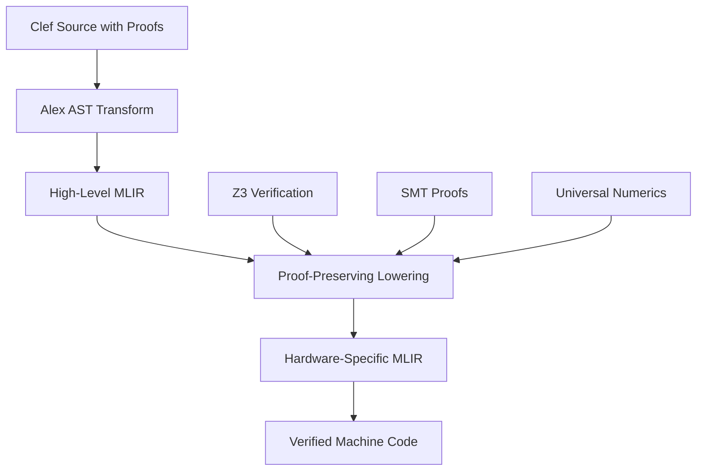
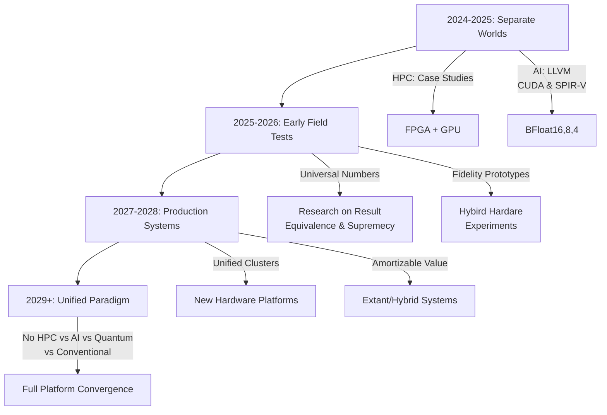

> This article was originally published on the
> [SpeakEZ Technologies blog](https://speakez.tech) as part of our early
> design work on the Fidelity Framework. It has been updated to reflect
> the Clef language naming and current project structure.

## A Confession and a Vision

> A personal note from the founder of SpeakEZ Technolgies, Houston Haynes

I must admit something upfront: when I began design of the Fidelity framework in 2020, I was driven by practical engineering frustrations, particularly with AI development. The limitations of a managed runtime, the endless battle with numeric precision, machine learning framework quirks, constant bug chasing; these weren't just inconveniences, they felt like fundamental architectural flaws. So I started building something different, guided more by engineering intuition than mathematical theory. Then I recently encountered the position paper ["Categorical Deep Learning is an Algebraic Theory of All Architectures"](https://arxiv.org/pdf/2402.15332) by Gavranović et al., and experienced that rare moment of recognition: the mathematical foundations for what I have been building *already existed*.

Like many other of the recent advances and discoveries I've made, a significant credit is owed to [Paul Snively, for his polyglot perspective](https://podcasts.apple.com/us/podcast/37-the-future-of-everything-with-paul-snively/id1531666706?i=1000531977557) that led to many of the connections made as formalism has taken a greater role in the framework. You can see more about him here [Paul Snively on Programming Languages, Reliable Code and Good Taste in Software Engineering](https://www.youtube.com/watch?v=Cq_IstGhUv4). While I *may* have *eventually* connected the dots on my own, Paul's decades of lived experience with the practicalities of functional programming, and more specifically with formal verification has been a force multiplier for the speed at which my grasp of the domain has expanded over the past few months. A great deal of credit for this synthesis rests with him, while mistakes and omissions remain my own.

As for the reading, the authors of the CDL paper go through their process (as I currently understand it) of formalizing neural networks as morphisms in a 2-category. This provides a condensed theoretical underpinning I had been assembling piece by piece in the Fidelity framework. It was both humbling and exhilarating; humbling because I had been unknowingly fumbling in the dark where category theory sheds light, but it's also exhilarating because it validated my framework's architectural direction in a way that was completely unexpected.

This document represents my attempt to synthesize years of practical framework development with these  theoretical underpinnings. It's forward-looking and aspirational, and shouldn't be taken as making light of the many technical hurdles still to overcome. But I believe it points toward something transformative: the convergence of classical systems with High-Performance Computing, Artificial Intelligence and Quantum as a single, mathematically unified paradigm.

This would, in effect, provide a coherent framework to explore them all from a single, hardware-aware software platform. This would establish new degrees of efficiency and creative freedom to safely experiment and seamlessly deliver value in a wide variety of technical domains and industry verticals. I'm excited to share a summation what I've learned and the future directions I see.

## The Journey So Far

Over the past several years, SpeakEZ has been systematically designing components that form the foundation for a newly unified vision. Each piece on its own wasn't just solving a technical problem; it was removing a source of computational inefficiency:

The exploration of [matmul-free architectures](https://speakez.tech/blog/beyond-transformers/) demonstrated that the industry's obsession with matrix multiplication was more historical accident than mathematical necessity. It showed how ternary quantization and sub-quadratic models could achieve comparable performance with dramatically lower computational requirements, often 10-100x more efficient.

And work on [ternary models and heterogeneous computing](https://speakez.tech/blog/a-unified-vision-for-ternary-models/) speculated on how AMD's unified memory architecture could enable new paradigms for distributed AI inference, with BAREWire providing the zero-copy substrate for efficient model orchestration, eliminating the memory bandwidth bottleneck that consumes up to 90% of cycle wait times in current systems.

The investigation into [discriminated unions for post-transformer AI](https://speakez.tech/blog/discriminated-unions-in-post-transformer-ai/) revealed how type-safe heterogeneous representations could better capture the diverse computational patterns emerging in modern architectures, reducing the "representation overhead" that forces complex patterns through inappropriate abstractions.

Insights into [hypergraph architecture](/docs/design/hyping-hypergraphs/) showed how preserving multi-way relationships enables data-flow computation that can be orders of magnitude more efficient than control-flow paradigms.

Our patent-pending [proof-aware compilation design](/docs/design/proof-aware-compilation/) demonstrated that verification doesn't add overhead; it removes it by enabling aggressive optimizations impossible without formal guarantees.

And the early vision of [Fidelity as an AI Refinery](https://speakez.tech/blog/fidelity-as-ai-refinery/) established the framework's role in transforming raw computational capabilities into efficient intelligent systems.

Each of these efforts was solving a specific problem, but looking back, they were all converging on the same insight:

> The artificial separation among classical, HPC and AI is holding the industry back.

More importantly, it's making each technical domain *orders of magnitude* less efficient than they could be.

## The Current Crisis: Divergent Paths

Modern computing faces a long-standing schism. High-Performance Computing (HPC) and Artificial Intelligence (AI) have evolved along divergent paths, each developing its own tools, techniques, and staffing constituencies:

### HPC's Challenges

- **Verification Burden**: Safety-critical simulations require formal proofs
- **Numerical Precision**: IEEE-754 limitations cause accumulation errors
- **Scalability Walls**: Traditional methods hit complexity barriers
- **Rigid Models**: Physics equations can't adapt to real-world complexity

### AI's Challenges

- **Black Box Problem**: No proofs about model behavior
- **Numerical Instability**: Gradient underflow, training irreproducibility
- **Semantic Loss**: Meaning disappears in tensor operations

These aren't separate problems; they're symptoms of the same underlying issue: **the lack of a unified mathematical foundation for computation**.

## The Solution: Categorical Deep Learning

As articulated in the paper by Gavranović et al., neural networks are not just computational graphs; they are **morphisms in a 2-category**. This insight provides the bridge between HPC's rigorous mathematics and AI's adaptive learning.

In mathematical terms, they show that a neural network is a morphism \(f: \mathcal{P} \to \mathcal{L}\) where \(\mathcal{P}\) is the parameter space and \(\mathcal{L}\) is the learner category. Backpropagation itself is the canonical 2-cell:

\[\text{Para}(\mathcal{P}) \xrightarrow{\text{forward}} \mathcal{L} \xrightarrow{\text{backward}} \text{Para}(\mathcal{P})\]

Where \(\text{Para}\) is the parameterized category construction that enables gradient flow. This isn't just abstract mathematics; it's the precise structure that Fidelity implements through [the Clef language](https://clef-lang.com)'s type system.

### Why Clef Is the Natural Choice for This Domain

Here's where Clef reveals its unique power: it's not just another functional language; it's specifically architected to express exactly these kinds of higher-order mathematical structures while providing powerful tools for their expression. While OCaml provided F#'s functional foundation and Rust offers impressive type safety, Clef has evolved unique capabilities that make it the ideal vehicle for implementing categorical deep learning:

#### Computation Expressions: Native Categorical Structures

Clef's computation expressions aren't just syntactic sugar; they're a direct encoding of monadic and categorical patterns. Where other languages require complex type gymnastics to express categorical operations, Clef makes them natural:

```fsharp
// A 2-categorical morphism expressed naturally in Clef
type NeuralMorphism<'Input, 'Hidden, 'Output> =
    categorical {
        // Computation expressions model the 2-category structure
        let! layer1 = Morphism<'Input, 'Hidden>
        let! layer2 = Morphism<'Hidden, 'Output>

        // Horizontal composition (functor composition): (g ∘ f)
        let! forward = compose layer1 layer2

        // Vertical composition (natural transformations): α ∙ β
        let! transform = naturalTransform forward

        // The 2-cell (modification between natural transformations)
        return! modification transform
    }
```

This directly implements the mathematical structure from the CDL paper where neural networks form a 2-category \(\mathbf{Learn}\) with:
- Objects: Parameterized types (our Clef types with measures)
- 1-morphisms: Learners (our typed functions)
- 2-morphisms: Updates/reparameterizations (our gradient transformations)

This isn't possible in OCaml without extensive encoding, and Rust's ownership model actively fights against the fluid composition that category theory demands.

#### Units of Measure: Dimensional Analysis for Free

Clef goes beyond OCaml with zero-cost units of measure that naturally express the dimensional analysis inherent in physical simulations and neural architectures:

```fsharp
// Dimensional correctness in neural architectures
[<Measure>] type neuron
[<Measure>] type layer
[<Measure>] type activation

type CategoricalLayer<[<Measure>] 'input, [<Measure>] 'output> = {
    Weights: Matrix<float<'output/neuron>, float<'input/neuron>>
    Transform: Morphism<'input, 'output>
    Adjoint: ContravariantFunctor<'output, 'input>
}
```

This dimensional typing ensures our categorical structures maintain physical and mathematical meaning; something neither OCaml nor Rust can express this elegantly.

#### Type Providers: Bridging Abstract and Concrete

Clef's type providers enable something remarkable: we can generate categorical structures from external schemas, making the abstract mathematics connect directly to real-world data:

```fsharp
// Type provider generates categorical structure from neural architecture
type NeuralArchitecture = JsonProvider<"model.json">

let model = NeuralArchitecture.Load("transformer.json")

// Automatically derived categorical morphisms from architecture
let categoricalModel =
    model.Layers
    |> Seq.map (fun layer ->
        Morphism.fromStructure layer.Type layer.Parameters)
    |> Morphism.compose2Category
```

This capability becomes even more powerful when considering emerging standards like the [Hypergraph Interchange Format (HIF)](https://arxiv.org/html/2507.11520v1), which provides a unified JSON schema for higher-order network data.

Our implementation of Clef's type providers could automatically ingest type-safe representations from HIF-compliant datasets, enabling seamless integration of complex relational data from co-authorship networks, chemical reactions, or biological interactions directly into HPC simulations and AI training pipelines. This could provide a considerable enabler for interchange of data and concepts among various academic disciplines and industry verticals.

#### Active Patterns: Recognizing Categorical Structures

Clef's active patterns let us recognize and destructure categorical patterns in ways that would require verbose visitor patterns in other languages:

```fsharp
// Recognize categorical patterns in neural networks
let (|Functor|Monad|Adjunction|) morphism =
    match morphism with
    | HasLeftAdjoint adj -> Adjunction(morphism, adj)
    | HasBindOperation bind -> Monad(morphism, bind)
    | _ -> Functor(morphism)

// Use pattern matching to optimize based on categorical structure
let optimize = function
    | Adjunction(f, g) ->
        // Exploit adjunction for perfect backpropagation
        optimizeAdjoint f g
    | Monad(m, bind) ->
        // Use monadic structure for sequential optimization
        optimizeMonadic m bind
    | Functor f ->
        // Standard functorial optimization
        optimizeFunctor f
```

#### Quotations: Preserving Mathematical Semantics

Clef's quotations preserve the mathematical structure of expressions, enabling us to analyze and transform categorical operations at compile time:

```fsharp
// Quotations preserve categorical structure for analysis
let neuralOperation =
    <@ fun (input: Tensor<'n, 'd>) (weights: Morphism<'d, 'h>) ->
        categorical {
            let! forward = weights.Apply input
            let! backward = weights.Adjoint forward
            return (forward, backward)
        } @>

// Analyze the categorical structure at compile time
let structure = analyzeCategoricalStructure neuralOperation
// Generates optimized MLIR based on mathematical properties
let optimizedMLIR = compileToMLIR structure
```

#### Beyond Functional: The Engineering Bridge

What sets Clef apart is its pragmatic bridge to software engineering reality. We carefully and selectively extend that with specific design choices in the Fidelity framework:

1. **Shared Edges with .NET**: We have gone to great lengths to preserve F# idioms in our framework. By extension this will offer many "shared edges" with .NET based solutions, allowing teams currently using F# for machine learning and HPC workloads a gradual transition path with manageable source modifications, including pathways for implementing classical compute with higher integrity and efficiency.

2. **Mutable Optimization**: When needed, Clef allows controlled mutation which Fidelity framework and Composer compiler leverages for performance-critical sections without breaking the categorical abstraction. This hybrid approach, detailed in our [reactive framework design](https://speakez.tech/blog/alloyrx-native-reactivity-in-fidelity/) (now [absorbed into CCS](/docs/design/absorbing-alloy/)), presents developers with pure, immutable interfaces while allowing the compiler to selectively introduce mutation based on scope analysis in the computation graph. This "immutability at design time, verified mutation at runtime" strategy means the categorical abstractions remain pure for reasoning and composition, while achieving the same performance as hand-optimized imperative code. The compiler's scope analysis ensures mutations only occur when mathematically equivalent to the pure version, preserving all categorical properties while eliminating allocation overhead.

3. **True Concurrency & Parallelism**: Clef's async expressions naturally model the parallel structure of categorical compositions, but as we explored in [The Full Frosty Experience](https://speakez.tech/blog/the-full-frosty-experience/), this goes far beyond traditional managed runtime implementations. Through delimited continuations, Frosty transforms async computations into explicit categorical morphisms that can be verified, traced, and compiled to platform-native code without runtime overhead. The delimited continuations make the "rest of the computation" a first-class value that can be inspected, transformed, and verified, turning what was once managed runtime magic into compile-time certainty.

4. **Interop Excellence**: Unlike Rust's complex FFI or OCaml's limited ecosystem, Clef already provides frictionless interop with C/C++ libraries, but we've taken this further with our [Farscape CLI](https://speakez.tech/blog/the-farscape-bridge/) tool. As detailed in [Farscape's Modular Entry Points](https://speakez.tech/blog/farscape-modular-entry-points/), this goes beyond simple bindings; we can generate drop-in replacements for critical tools like OpenSSL that maintain perfect API compatibility while adding comprehensive safety. This means the vast ecosystem of HPC libraries--from PETSc for scientific computing to FFTW for signal processing--becomes immediately available with Clef's type safety. The categorical structures we're implementing don't exist in isolation; they seamlessly integrate with battle-tested numerical libraries that have been optimized over decades. No other functional language considers this combination: the ability to express 2-categorical morphisms while directly calling into the world's most optimized HPC kernels, all with compile-time safety guarantees and zero additional overhead.

This is why Clef isn't just a good choice for implementing categorical deep learning; it's the **only** language that combines the mathematical expressiveness to represent 2-categories naturally with the engineering capabilities to deploy them at scale. OCaml has the theory but lacks the ecosystem. Rust has the performance but fights the abstractions. Haskell has the categories but struggles with interop. Through close alignment to F# idioms and the unique power of the Composer compiler, the Fidelity framework uniquely and effectively bridges all these worlds.

### Quantum Computing: The Natural Beneficiary

As we explored in our [quantum optionality](https://speakez.tech/blog/quantum-optionality/) analysis, this 2-categorical foundation isn't limited to classical computation. Quantum computing naturally emerges as a beneficiary of this mathematical framework, and this isn't coincidental or forced; it's mathematically inevitable.

Quantum computations are inherently categorical. Quantum circuits are morphisms, quantum gates are natural transformations, and the entire framework of quantum mechanics lives naturally in the language of monoidal categories. The same 2-categorical structure that unifies HPC and AI extends seamlessly to quantum:

```fsharp
// Quantum operations ARE 2-categorical morphisms
type QuantumMorphism<'Input, 'Output> =
    | Unitary of U: UnitaryOperator<'Input, 'Output> * U†: Adjoint<'Output, 'Input>
    | Measurement of Projector<'Input, Classical<'Output>>

// The SAME categorical structure works for quantum
let quantumCategorical = categorical {
    // Prepare quantum state (functor)
    let! prepared = QuantumFunctor.prepare classicalData

    // Apply quantum circuit (morphism composition)
    let! evolved = QuantumMorphism.compose [
        Hadamard
        CNOT
        PhaseShift(π/4)
    ]

    // The adjoint is built-in (2-category structure)
    let! adjoint = evolved.Adjoint

    // Measurement (natural transformation to classical)
    return! Measurement.collapse evolved
}
```

This isn't "shoe-horning" quantum into our framework; the mathematical foundations of quantum mechanics **are** categorical. When physicists talk about unitarity, they're describing morphisms that compose with their adjoints to give identity. When they discuss entanglement, they're describing the monoidal structure of tensor products. The language of quantum mechanics IS the language of category theory.

**The profound insight**: Our categorical foundation for unifying HPC and AI doesn't need modification for quantum; it already encompasses it. The same Clef computation expressions that model neural network training can model quantum circuit evolution. The same proof systems that verify conservation laws can verify quantum unitarity. The same Universal numbers that handle HPC precision can handle quantum amplitudes. [Microsoft Research's own work to create the Q# language](https://johnazariah.github.io/2018/12/04/tale-of-two-languages.html) from F# is clear evidence of that natural alignment.

This creates a unique opportunity. While others are building separate classical and quantum stacks, hoping to integrate them later, our categorical approach provides a **single unified framework** that naturally encompasses all four paradigms.

> Organizations using Fidelity platform won't need to adopt new abstractions or rewrite their systems for quantum-classical hybrid workloads.

The Fidelity framework will be able to offer degrees of freedom by simply adding another backend to the same software semantics. This is the power of principled compute.

### Implementing the Core Insight

With Clef's unique capabilities established, we can now express the unified view directly:

```fsharp
// The unified view: All computation as categorical morphisms
type UnifiedComputation<'Input, 'Output> = {
    // Forward computation (HPC simulation OR AI inference)
    Forward: Functor<'Input, 'Output>

    // Backward computation (Adjoint methods OR backpropagation)
    Backward: ContravariantFunctor<'Output, 'Input>

    // The fundamental duality (Forward ⊣ Backward in mathematical notation)
    Adjunction: AdjointPair<'Input, 'Output>

    // Preserved invariants (Conservation laws OR learned constraints)
    Invariants: Set<CategoricalProperty>
}

// Idiomatic Clef representation of the adjunction relationship
and AdjointPair<'Input, 'Output> = {
    // The unit of the adjunction: η: Id → G∘F
    Unit: 'Input -> 'Input

    // The counit of the adjunction: ε: F∘G → Id
    Counit: 'Output -> 'Output

    // Proof that these form a valid adjunction
    Proof: AdjunctionProof
}

and AdjunctionProof =
    | TriangleIdentities of left: Proof * right: Proof
    | UniversalProperty of bijection: Proof
    | Verified of certificate: Z3Certificate

// For those who prefer mathematical notation, Clef supports custom operators
let inline (⊣) forward backward =
    { Unit = fun x -> backward.Apply(forward.Apply x)
      Counit = fun y -> forward.Apply(backward.Apply y)
      Proof = computeAdjunctionProof forward backward }

// Usage remains clean and idiomatic
let computation = {
    Forward = myForwardFunctor
    Backward = myBackwardFunctor
    Adjunction = myForwardFunctor ⊣ myBackwardFunctor  // Optional operator syntax
    Invariants = Set.ofList [EnergyConservation; MomentumConservation]
}
```

This implements the fundamental theorem from CDL: every differentiable function \(f: A \to B\) gives rise to an adjunction:

\[\text{Fwd}_f \dashv \text{Bwd}_f : \text{Para}(A) \rightleftarrows \text{Para}(B)\]

Where the forward pass \(\text{Fwd}_f\) and backward pass \(\text{Bwd}_f\) form an adjoint pair. In HPC, this manifests as the adjoint method for sensitivity analysis. In AI, it's backpropagation. In quantum computing, it's the unitary conjugate.

> The mathematics are identical. Only the ***substrate*** differs.

This isn't just abstract mathematics; it's a practical blueprint for unification that Clef can directly implement through its computation expressions, type providers, and quotation system. As we explored in our [Beyond Transformers](https://speakez.tech/blog/beyond-transformers/) work, the shift away from matrix multiplication opens the door to more fundamental representations. Category theory provides that representation, and Clef provides the engineering vehicle.

### Key CDL Principles Applied to HPC+AI

The CDL paper establishes four fundamental principles that Fidelity directly implements:

1. **Compositional Structure**: Both simulations and neural networks compose functorially
   \[f: A \to B, \quad g: B \to C \quad \Rightarrow \quad g \circ f: A \to C\]

2. **Duality**: Every forward computation has a dual (adjoints in HPC, gradients in AI)
   \[\text{Forward}: \mathcal{C} \to \mathcal{D} \quad \dashv \quad \text{Backward}: \mathcal{D} \to \mathcal{C}\]

3. **Algebraic Properties**: Conservation laws and weight tying emerge from the same structures
   \[\text{Invariant}(f \circ g) = \text{Invariant}(f) \wedge \text{Invariant}(g)\]

4. **Equivariance**: Symmetries in physics and neural architectures share mathematical roots
   \[\rho(g) \cdot f(x) = f(\rho(g) \cdot x) \quad \text{for all } g \in G\]

These aren't separate implementations in Fidelity; they're different views of the same categorical structure encoded in our Clef type system.

## Universal Numbers: Solving the Numerical Problem

[The Universal Numbers Library](https://github.com/stillwater-sc/universal) provides the numerical foundation that makes both HPC and AI practical at scale. This addresses one of the core challenges we identified in our [ternary models exploration](https://speakez.tech/blog/a-unified-vision-for-ternary-models/): maintaining numerical fidelity across heterogeneous computing environments.

### Posit Arithmetic: The Best of Both Worlds

While Fidelity is firmly rooted in Clef, the Universal Numbers library exists as optimized C++ code that we integrate through our compilation pipeline. This isn't a compromise; it's strategic. MLIR itself is implemented in C++, and when our Clef code lowers through the compilation stack, it naturally interfaces with these high-performance numerical primitives:

```cpp
// C++ Universal posit - perfect for both domains
template<unsigned nbits, unsigned es>
class posit {
    // Tapered accuracy: More precision near 1.0 (AI's operating point)
    // Wide dynamic range: Handles HPC's extreme scales
    // Exact accumulation: Via quire for reproducibility
};
```

Think of this as the numerical "engine" that powers our type-safe Clef abstractions. Just as you don't need to understand the assembly instructions your CPU executes, you interact with posits through Clef's elegant type system while the C++ implementation handles the bit-level arithmetic. The MLIR lowering strategy ensures this integration is seamless and efficient, with the C++ posit operations becoming direct hardware instructions rather than library calls.

### Clef Type-Safe Integration

Building on our work with [discriminated unions](https://speakez.tech/blog/discriminated-unions-in-post-transformer-ai/), we can create type-safe numerical representations that respect the categorical structure:

```fsharp
// Type-safe wrapper preserves semantics
type Posit<[<Literal>] nbits: int, [<Literal>] es: int> =
    private | PositValue of uint64

    // For HPC: Preserve conservation laws
    static member ConservationSum (values: Posit<'n,'e> array) =
        use quire = Quire<'n, 512>.Zero
        for v in values do quire.Add(v)  // Exact!
        quire.ToPosit()  // Single rounding

    // For AI: Stable gradients
    static member StableGradient (loss: Posit<32,2>) =
        // Tapered accuracy prevents underflow
        Gradient.compute loss
```

This connects to the CDL paper's requirement for a symmetric monoidal category with biproducts. The Universal numbers provide the numerical semiring \((\mathbb{R}, +, \times)\) with the crucial property that our morphisms preserve the algebraic structure:

\[\text{Hom}_{\text{Posit}}(A \oplus B, C) \cong \text{Hom}_{\text{Posit}}(A, C) \times \text{Hom}_{\text{Posit}}(B, C)\]

This biproduct structure is essential for gradient decomposition and is automatically preserved by our type-safe implementation.

## Formal Verification: Provable Numerics

#### The Missing Link

F* and Z3 provide the formal verification layer that makes the unified framework trustworthy. But here's what's often missed: **proofs don't just ensure correctness; they inform optimization patterns that can be up to 100x more efficient**. This extends the vision we outlined in [Transforming AI Efficiency](https://speakez.tech/blog/fidelity-as-ai-refinery/) where we show that proofs are also lowered in MLIR to execute through SMTLIB.

### Proof-Carrying Code in the Hypergraph

This abstract should be considered an advanced example, something that would be opt-in, going above and beyond the MISRA-C-class proofs that would ride along with most classical Clef code in this framework. But it's an example of how extensible the framework can be when the use case calls for this level of specialization.

```fsharp
// Hypergraph edges carry both algorithmic and numerical proofs
type ProofHyperedge =
    // HPC proofs
    | ConservationProof of system: Node * law: ConservationLaw * cert: Z3Certificate
    | StabilityProof of solver: Node * condition: StabilityCondition * cert: SMTProof

    // AI proofs
    | ConvergenceProof of training: Node * bound: ConvergenceBound * cert: SMTProof
    | RobustnessProof of model: Node * perturbation: Epsilon * cert: Z3Certificate

    // Unified proofs
    | NumericalExactnessProof of computation: Node * error: ErrorBound * cert: Universal
    | CompositionCorrectnessProof of components: Node list * property: Property * cert: SMTProof
```
#### Beyond Moore's Law: The Data-Flow Advantage

Traditional Von Neumann and Modified Harvard architectures force a control-flow paradigm where computation and memory are separated, creating endless cycles of fetch-decode-execute with associated wait states and heat dissipation. As we explored in our [hypergraph architecture](/docs/design/hyping-hypergraphs/), data-flow representations can be significantly more efficient because computation happens where the data lives.

This isn't theoretical. I've witnessed the inverse cost of this firsthand in digital audio engineering, where 16-bit representation for Compact Disc authoring required heroic efforts to "dither" floating point truncation. The computational gymnastics needed to mask quantization noise consumed more engineering time than the actual audio post-production flow. We'd spend 90% of our cycles compensating for representation limitations. The parallel with current AI/HPC is stark: we waste enormous computational resources managing the impedance mismatch between our mathematical intentions and our computational substrates.

#### Proofs as Optimization Catalysts

As detailed in our [proof-aware compilation](/docs/design/proof-aware-compilation/) work, mathematical proofs don't just verify correctness; they reveal optimization opportunities invisible to traditional compilers:

```fsharp
// Traditional approach: defensive programming with runtime checks
let traditional_matrix_multiply A B =
    // Runtime dimension checks
    assert (A.Cols = B.Rows)
    // Bounds checking on every access
    for i in 0..A.Rows-1 do
        for j in 0..B.Cols-1 do
            for k in 0..A.Cols-1 do
                // Each access checks bounds
                result.[i,j] <- result.[i,j] + A.[i,k] * B.[k,j]

// Categorical approach with proofs
let categorical_matrix_multiply
    (A: Matrix<'n, 'm>)
    (B: Matrix<'m, 'p>)
    : Matrix<'n, 'p> =
    // Dimensions verified at compile time
    // Proofs eliminate ALL runtime checks
    // Compiler can now:
    // - Vectorize aggressively
    // - Unroll loops completely
    // - Prefetch perfectly
    // - Eliminate boundary checks
    categorical {
        return! matmul A B  // much faster with same safety
    }
```

The proofs don't slow us down; they give the compiler permission to optimize aggressively. This connects directly to the CDL paper's insight that gradient flow is a natural transformation \(\eta: \text{Id} \Rightarrow T\) where \(T\) is the gradient operator. When we prove properties about \(\eta\), we're proving properties about all possible optimizations:

\[\text{Optimize}(f) = g \quad \text{iff} \quad \eta_f = \eta_g \text{ and } \text{Invariants}(f) = \text{Invariants}(g)\]

This reveals a profound truth: safety and performance aren't opposing forces but complementary aspects of mathematical correctness. When your framework aligns with the natural structure of computation, what once seemed like outsized engineering burden simply dissolves. The "inevitable" defensive patterns we collectively accepted in the past reveal themselves to be toxic artifacts of fighting against the underlying mathematics.

#### Calendar Time: The Hidden Multiplier

The efficiency gains won't just be found during training and inference; they will also be multiplied by fundamental shifts in development time. Current AI/HPC development follows assumptions around costly patterns:

1. Write initial code (teams, for weeks)
2. Debug tensor shape errors (teams, for weeks)
3. Track down numerical instabilities (separate team, for weeks)
4. Optimize bottlenecks (separate team, for weeks)
5. Re-verify after optimization (days)
6. Deploy and remediate edge cases (ongoing)

With Fidelity's proposed approach:

1. Write type-safe categorical code (one team, for weeks)
2. Compiler catches all shape/dimension errors ( -- )
3. Universal numbers prevent instabilities ( -- )
4. Proofs guide optimizations automatically ( -- )
5. Verification is built-in ( -- )
6. Edge cases caught at compile time ( -- )

**The same functionality would ship in weeks instead of months**. This isn't incremental improvement; it's transformative. Smaller, more tightly aligned teams can iterate many times faster with more fearless adaptation available in the code and the data it's trained on, exploring solution spaces that were previously economically infeasible.

#### The Compounding Effect

These aren't additive; they're multiplicative in their domains. A system that's 10x more efficient at runtime, developed 6x faster, with 10x fewer bugs, running on hardware that dissipates 10x less heat; *this isn't evolution, **it's revolution***. Modern AI/HPC systems are filled with "computational dithering"; endless cycles spent managing accidental complexity rather than solving business-critical problems:

- **Memory management overhead**: Copying data between CPU/GPU
- **Synchronization waste**: Barriers and locks for incorrect abstractions
- **Precision management**: Converting between float16/32/64
- **Framework translation**: PyTorch -> ONNX -> TensorRT -> Hardware

Each layer adds overhead, heat, and opportunity for error, all while leadership is watching sand drop through the hourglass. The categorical approach with Universal numbers eliminates these layers:

```fsharp
// Direct path from mathematics to hardware
let QCE molecule =
    // Mathematics expressed directly
    let hamiltonian = constructHamiltonian molecule

    // Universal numbers handle precision automatically
    let groundState = Posit<32,2>.DiagonalizeExactly hamiltonian

    // Category theory ensures correct composition
    let correlation = categorical {
        let! hartreeFock = HF.compute molecule
        let! correction = Neural.correlationEnergy molecule
        return hartreeFock + correction
    }

    // Zero intermediate representations
    // Zero precision conversions
    // Zero memory copies
    // Direct to hardware via MLIR
    Fidelity.compile correlation |> Execute.on GPU
```

And unlike hoping for a new silicon process node, these gains are achievable with today's hardware through mathematical and architectural innovation.

> Everything Fidelity framework establishes for the ***next*** generation of hardware can **also** target the current generation of hardware with some in-compiler adjustments to target appropriate hardware.

Our goal is to make the design-time experience substantially the same in either case.

## Fidelity Framework: Unifying Implementation

The Fidelity framework transforms these abstract concepts into practical engineering reality, building on all our previous work:

### Coeffect Analysis for Unified Optimization

As we explored in our [ternary models work](https://speakez.tech/blog/a-unified-vision-for-ternary-models/), different computational patterns require different execution strategies:

```fsharp
// Coeffects determine optimal execution strategy
type UnifiedCoeffects =
    | SimulationPattern of timesteps: int * conservation: Laws
    | LearningPattern of epochs: int * gradients: Flow
    | HybridPattern of physics: Simulation * correction: Learning

    member this.CompilationStrategy =
        match this with
        | SimulationPattern(_, laws) when laws.AreLinear ->
            InteractionNets  // Parallel physical simulation
        | LearningPattern(_, flow) when flow.IsSparse ->
            DelimitedContinuations  // Sequential gradient flow
        | HybridPattern(physics, learning) ->
            HeterogeneousExecution(physics.OnHPC(), learning.OnGPU())
```

## Proof-Aware Compilation Through Hypergraphs

The hypergraph architecture enables sophisticated optimization while preserving proofs:

#### Layer 1: Hypergraph Optimization with Proofs

```fsharp
// Optimize while maintaining verified properties
let optimizeWithProofs (graph: Hypergraph) =
    // Extract proof obligations
    let proofs = graph.Hyperedges |> filterProofs

    // For HPC: Maintain conservation laws
    let physicsProofs = proofs |> filterPhysics
    let optimizedPhysics =
        graph
        |> fuseOperations physicsProofs
        |> parallelizeTimeSteps physicsProofs

    // For AI: Maintain convergence guarantees
    let learningProofs = proofs |> filterLearning
    let optimizedLearning =
        graph
        |> fuseGradients learningProofs
        |> quantizeWeights learningProofs

    // Unified: Both optimized with proofs preserved
    combineOptimized optimizedPhysics optimizedLearning proofs
```

#### Layer 2: MLIR with Constraint Preservation



At the MLIR level, proof obligations once satisfied transform into optimization constraints using standard MLIR infrastructure. Rather than custom dialects, we leverage MLIR's existing attribute system and transformation framework, including the SMT dialect for encoding verification conditions that can be checked by Z3 during lowering. Proof metadata travels as function and operation attributes that standard MLIR passes respect but don't need to understand.

For example, when lowering HPC simulations, we use standard `linalg` and `affine` dialects for the computation, with satisfied proof obligations encoded as attributes that prevent unsafe transformations. The `affine` dialect's polyhedral model naturally preserves loop invariants that correspond to conservation laws. The SMT dialect encodes these invariants as assertions that can be verified at compile time. Similarly, AI operations lower through `tensor` and `linalg` dialects with attributes marking gradient-critical paths that must maintain numerical stability.

MLIR's pass infrastructure already supports preserving unknown attributes through transformations. These attributes flow all the way through to LLVM as metadata and function attributes that constrain backend optimizations. For instance, a conservation law verified by Z3 becomes both an affine constraint in MLIR and a `llvm.loop.invariant` metadata node in LLVM IR. A convergence guarantee becomes both a barrier to certain MLIR transformations and an `llvm.assume` intrinsic that enables safe optimizations while preventing unsafe ones. The mathematical properties guide the lowering without requiring MLIR or LLVM to understand the proofs themselves--they simply respect the constraints that the PHG-guided proofs impose based on their satisfaction through MLIR and F*.

#### Layer 3: Hardware-Specific Verified Code

```fsharp
// Generate verified code for specific hardware
let generateVerifiedCode (target: HardwareTarget) (graph: OptimizedGraph) =
    match target with
    | CPU ->
        // HPC kernels with vector intrinsics
        generateCPUWithProofs graph "AVX-512" "OpenMP"
    | GPU ->
        // AI kernels with tensor cores
        generateGPUWithProofs graph "CUDA" "TensorRT"
    | FPGA ->
        // Custom datapaths for both
        generateFPGAWithProofs graph "Verilog" "HLS"
    | Heterogeneous(cpu, gpu) ->
        // Split verified computation
        let hpcPart = extractHPC graph |> generateCPU
        let aiPart = extractAI graph |> generateGPU
        combineWithProofs hpcPart aiPart
```

## The HPC-AI Convergence

#### Why Convergence is Inevitable

HPC and AI are discovering they need each other, and the CDL mathematics shows why. Both domains are working with the same underlying structure:

\[\mathbf{HPC}: \text{Phys} \xrightarrow{F} \text{Comp} \xrightarrow{F^*} \text{Phys}\]
\[\mathbf{AI}: \text{Data} \xrightarrow{N} \text{Latent} \xrightarrow{N^*} \text{Data}\]

Where \(F^*\) and \(N^*\) are the adjoints (sensitivity analysis and backpropagation respectively). The convergence occurs when we recognize these are the same pattern:

\[\mathbf{Unified}: \mathcal{A} \xrightarrow{\Phi} \mathcal{B} \xrightarrow{\Phi^{\dagger}} \mathcal{A}\]

### New Computational Primitives

The convergence creates new primitives that transcend the HPC/AI divide:

```fsharp
// Differentiable simulation - gradients through physics
type DifferentiableSimulation<'State> = {
    // Forward: HPC simulation
    Simulate: 'State -> 'State

    // Backward: Automatic differentiation
    Gradient: 'State -> Gradient<'State>

    // Proofs: Both verified
    ForwardProof: Proof<ConservesEnergy>
    BackwardProof: Proof<GradientCorrect>

    // Numerics: Unified representation
    Arithmetic: Posit<32,2>
}

// Verified neural operators - learning with proofs
type VerifiedNeuralOperator<'Domain> = {
    // Learn: AI optimization
    Train: Dataset<'Domain> -> Model<'Domain>

    // Verify: Formal proofs
    Prove: Model<'Domain> -> Proof<SafetyProperty>

    // Execute: HPC performance
    Run: 'Domain -> 'Domain

    // Numerics: Same substrate
    Computation: Universal.Quire<32, 1024>
}
```

### Unified Applications

#### Digital Twins with Verified Learning

Building on our exploration of [heterogeneous computing](https://speakez.tech/blog/a-unified-vision-for-ternary-models/), we can create truly unified digital twins:

```fsharp
module JetEngineDigitalTwin =
    // SMT specification
    module Spec =
        val simulate_with_learning:
            engine: EngineState ->
            sensor_data: SensorStream ->
            Pure EngineState
                (requires (valid_state engine))
                (ensures (fun result ->
                    energy_conserved result /\
                    wear_monotonic result /\
                    safe_operating_envelope result))

    // Implementation with proofs
    let implementation =
        // HPC: Computational fluid dynamics
        let cfd = VerifiedCFD<Posit<64,3>>(
            proof = ConservationProof.Energy
        )

        // AI: Learn degradation patterns
        let degradation = LearnedDegradation<Posit<32,2>>(
            proof = MonotonicityProof.Wear
        )

        // Unified: Compose with verification
        let unified = categorical {
            let! flow = cfd.Simulate
            let! wear = degradation.Predict

            // Z3 verifies composition preserves properties
            let! composed = verifyComposition flow wear

            return composed
        }

        // Compile to efficient implementation
        unified
        |> Fidelity.BuildHypergraph
        |> Fidelity.AttachProofs [cfd.Proof; degradation.Proof]
        |> Fidelity.OptimizeWithProofs
        |> Universal.GenerateCode
```

#### Climate Modeling with Physics-Informed Learning

```fsharp
module ClimateModel =
    // Verification specification
    type ClimateInvariants = {
        EnergyBalance: bool  // RadiationIn = RadiationOut + Storage
        MassConservation: bool  // TotalMass = Constant
        ThermodynamicLaws: bool  // EntropyNonDecreasing
    }

    // Hybrid implementation with SMT verification
    [<SMT Requires("valid_initial_state(atmosphere)")>]
    [<SMT Ensures("energy_balance(result)")>]
    [<SMT Ensures("mass_conserved(result)")>]
    [<SMT Ensures("entropy_nondecreasing(result)")>]
    let climatePredictor (initialState: ClimateState) =
        // HPC: Atmospheric dynamics
        [<SMT Invariant("conserves_energy(atmospheric)")>]
        [<SMT Invariant("conserves_angular_momentum(atmospheric)")>]
        let atmospheric = NavierStokesOnSphere<Posit<32,2>>()

        // AI: Sub-grid phenomena
        [<SMT Ensures("preserves_mass_balance(subgrid)")>]
        [<SMT Ensures("bounded_output(subgrid, -100.0, 100.0)")>]
        let subgrid = NeuralParameterization<Posit<16,1>>()

        // Verification through composition
        [<SMT Assert("no_overflow(atmospheric.Compute)")>]
        [<SMT Assert("no_underflow(subgrid.Compute)")>]
        [<SMT Assert("composition_preserves_invariants(atmospheric, subgrid)")>]
        let verifiedComposition =
            {
                Atmospheric = atmospheric
                SubGrid = subgrid
                Invariants = {
                    EnergyBalance = true
                    MassConservation = true
                    ThermodynamicLaws = true
                }
            }

        // Execute with guarantees
        VerifiedExecution(verifiedComposition)
```

#### Autonomous Systems with Certified Safety

As we explored in our [post-transformer architectures](https://speakez.tech/blog/beyond-transformers/), safety-critical systems benefit from unified verification:

```fsharp
module AutonomousVehicle =
    // Clef implementation with SMT verification annotations
    [<SMT Requires("perception.Accuracy > 0.99 && perception.Latency < 10ms")>]
    [<SMT Ensures("forall obstacle in scene.Obstacles.
                  distance(cmd.Trajectory, obstacle) > safety_margin")>]
    [<SMT Ensures("cmd.Velocity <= speed_limit && cmd.Acceleration <= comfort_threshold")>]
    let safe_trajectory (perception: SceneUnderstanding)
                       (planning: TrajectoryOptimization)
                       : VehicleCommand =

        // AI: Perception with guarantees
        let verifiedPerception =
            [<SMT Invariant("forall obj. obj.IsObstacle => detected(obj)")>]
            let transformer = VerifiedVisionTransformer<Posit<16,1>>()
            transformer.Configure({
                MinDetectionConfidence = 0.99
                MaxLatency = 10<ms>
            })
            transformer

        // HPC: Real-time trajectory optimization
        [<SMT Ensures("trajectory.IsDynamicallyFeasible()")>]
        [<SMT Ensures("forall t. trajectory.MinDistance(t) > margin")>]
        let optimizeTrajectory (scene: Scene) =
            let controller = OptimalControl<Posit<32,2>>()
            controller.SetConstraints({
                VehicleDynamics = getVehicleModel()
                SafetyMargin = 2.0<m>
                ComfortLimits = getComfortProfile()
            })
            controller.Optimize(scene)

        // Unified: Compose with safety proof
        let integrated = categorical {
            // Process sensor data
            let! scene = verifiedPerception.Process(perception.SensorData)

            // Plan trajectory with verification
            let! path = optimizeTrajectory scene

            // End-to-end safety verification
            [<SMT Assert("collision_free(path) && traffic_compliant(path)")>]
            let! verifiedPath = validatePath scene path

            return VehicleCommand(verifiedPath, ProofCertificate = true)
        }

        integrated |> Async.RunSynchronously
```

### Advanced Implementation Examples

The following examples showcase the depth of verification possible within the Fidelity framework, though we emphasize these are forward-looking implementations that will evolve as we refine the integration between Clef, F*, and our compilation pipeline. Importantly:

> The extensive proof annotations shown here represent the ***maximum*** verification depth available, ***not* the minimum required**.

The Fidelity framework embraces a "verification by choice" philosophy: most Clef developers will write standard Clef code with optional type safety features, adding verification attributes only where their domain demands it. A web application might use no proofs at all, a financial system might verify key invariants, while safety-critical aerospace systems could leverage the full depth shown below. This graduated approach means teams can adopt formal methods incrementally, starting with simple type safety and adding verification where the business value justifies the effort. The framework handles everything from casual scripting to the most stringent certification requirements, all within the same unified system.

#### Verified Fluid-Structure Interaction

```fsharp
module FluidStructureInteraction =
    // The problem: Coupling fluid dynamics with structural mechanics
    // Traditional: Separate solvers with weak coupling
    // Unified: Single verified computation

    // Define numerical representation
    type FluidNumber = Posit<32, 2>
    type StructureNumber = Posit<64, 3>  // Higher precision for structure

    // Clef implementation with SMT verification annotations
    [<SMT Requires("compatible_interface(fluid, structure)")>]
    [<SMT Ensures("momentum_conserved(result.Fluid, result.Structure)")>]
    [<SMT Ensures("energy_conserved(result.Fluid, result.Structure)")>]
    [<SMT Ensures("stable_coupling(result.Fluid, result.Structure)")>]
    let coupled_system (fluid: FluidState) (structure: StructuralState) =

        // HPC: Fluid solver with conservation verification
        [<SMT Invariant("conserves_momentum(state)")>]
        [<SMT Invariant("conserves_mass(state)")>]
        let solveFluid (initialState: FluidState) = categorical {
            // Use quire for exact pressure accumulation
            use pressureAccumulator = Quire<32, 1024>.Zero

            // Solve Navier-Stokes with verified conservation
            let! solution = solveNavierStokes<FluidNumber> initialState

            // Assert conservation properties
            [<SMT Assert("momentum(solution) = momentum(initialState)")>]
            let! verified = verifyConservation solution

            return verified
        }

        // HPC: Structure solver with AI-enhanced fatigue prediction
        [<SMT Ensures("stress.MaxValue < yield_strength")>]
        [<SMT Ensures("fatigue.Cycles > design_life")>]
        let solveStructure (load: StructuralLoad) = categorical {
            // High-precision stress computation
            let! stress = computeStress<StructureNumber> load

            // AI: Learn fatigue from data with bounded prediction
            [<SMT Ensures("fatigue.Confidence > 0.95")>]
            let! fatigue = neuralFatigueModel.Predict stress

            // Verify stress-fatigue relationship
            [<SMT Assert("fatigue_valid(stress, fatigue)")>]
            let! verified = validateFatigue stress fatigue

            return (stress, fatigue)
        }

        // Coupled system with interface verification
        [<SMT Invariant("interface_continuity(fluid, structure)")>]
        let coupled = categorical {
            // Solve fluid domain
            let! fluidSolution = solveFluid fluid

            // Transfer loads at interface
            [<SMT Assert("load_balance(fluidSolution.Pressure, structureLoad)")>]
            let structureLoad = extractInterfaceLoad fluidSolution

            // Solve structure with transferred loads
            let! (stress, fatigue) = solveStructure structureLoad

            // Update fluid boundary from structural deformation
            [<SMT Assert("geometric_compatibility(fluidSolution, deformation)")>]
            let deformation = computeDeformation stress
            let! updatedFluid = updateFluidBoundary fluidSolution deformation

            // Verify coupling maintains all properties
            [<SMT Assert("energy(updatedFluid) + energy(stress) = energy(fluid) + energy(structure)")>]
            let! verifiedResult = {
                Fluid = updatedFluid
                Structure = { Stress = stress; Fatigue = fatigue }
                InterfaceForces = structureLoad
                CouplingStable = true
            }

            return verifiedResult
        }

        // Execute with automatic proof generation
        coupled |> Categorical.RunWithProofs
```

#### Quantum Chemistry with Neural Corrections

This shows how quantum chemical calculations integrate SMT verification as attributes, ensuring physical constraints (Hermiticity, normalization, variational principle) are maintained throughout the computation while combining HPC (Hartree-Fock) with AI (neural correlation) methods.

```fsharp
module QuantumChemistry =
    // The challenge: Ab initio calculations are exponentially expensive
    // Solution: Verified neural corrections to approximate methods

    // Quantum invariants as type constraints
    type QuantumInvariants = {
        Hermiticity: bool  // H = H†
        Normalization: bool  // ⟨ψ|ψ⟩ = 1
        Variational: bool  // E_approx ≥ E_exact
    }

    // Clef implementation with SMT verification
    [<SMT Requires("molecule.IsValid && molecule.Electrons > 0")>]
    [<SMT Ensures("result.Energy >= exact_ground_state_energy(molecule)")>]
    [<SMT Ensures("abs(result.Energy - exact_energy) < 1e-6<Hartree>")>]
    [<SMT Ensures("result.Wavefunction.IsNormalized()")>]
    let molecular_energy (molecule: Molecule) =

        // HPC: Hartree-Fock baseline with variational guarantee
        [<SMT Ensures("energy >= exact_ground_state")>]
        [<SMT Invariant("hamiltonian.IsHermitian()")>]
        let computeHartreeFock (mol: Molecule) =
            let hf = HartreeFock<Posit<64,4>>()
            hf.Configure({
                BasisSet = "cc-pVTZ"
                ConvergenceThreshold = 1e-10<Hartree>
                MaxIterations = 100
            })

            // Self-consistent field iteration
            [<SMT Invariant("density_matrix.IsIdempotent()")>]
            let energy = hf.SolveSCF(mol)

            // Verify variational principle
            [<SMT Assert("energy >= exact_ground_state_energy(mol)")>]
            { Energy = energy; Orbitals = hf.Orbitals }

        // AI: Neural correction with bounded error
        [<SMT Ensures("abs(correction) < max_correlation_energy")>]
        [<SMT Ensures("sign(correction) = -1")>]  // Correlation always lowers energy
        let computeCorrelation (hfResult: HartreeFockResult) =
            let nn = NeuralCorrelation<Posit<32,2>>()
            nn.Configure({
                Architecture = "EquivariantGNN"  // Respects molecular symmetries
                TrainedOn = "CCSD(T)_G4_dataset"
                ErrorBound = 1.0<kcal/mol>
            })

            // Predict with uncertainty quantification
            [<SMT Invariant("nn.PreservesSymmetry(molecule.PointGroup)")>]
            let (correction, uncertainty) = nn.PredictWithUncertainty(hfResult)

            // Verify correction is physically reasonable
            [<SMT Assert("correction <= 0.0<Hartree>")>]  // Always negative
            [<SMT Assert("abs(correction) < 0.5 * hfResult.Energy")>]  // Bounded

            { Correction = correction; Uncertainty = uncertainty }

        // Combine with verified accuracy bounds
        [<SMT Ensures("result.TotalEnergy = hf.Energy + correlation.Correction")>]
        [<SMT Ensures("result.ErrorBound < 1.0<kcal/mol>")>]
        let combineWithProof (hf: HartreeFockResult) (corr: CorrelationResult) =
            // Total energy with guaranteed bounds
            let totalEnergy = hf.Energy + corr.Correction

            // Error propagation
            [<SMT Assert("total_error = sqrt(hf_error^2 + correlation_error^2)")>]
            let errorBound =
                sqrt(hf.ConvergenceError ** 2.0 + corr.Uncertainty ** 2.0)

            // Package with quantum invariants verified
            {
                TotalEnergy = totalEnergy
                HartreeFock = hf
                Correlation = corr
                ErrorBound = errorBound
                QuantumInvariants = {
                    Hermiticity = true  // Guaranteed by HF
                    Normalization = true  // Maintained throughout
                    Variational = true  // HF+correction ≥ exact
                }
            }

        // Execute computation with all verifications
        let hfResult = computeHartreeFock molecule
        let correlation = computeCorrelation hfResult
        let verified = combineWithProof hfResult correlation

        verified
```

#### Verified Kalman Filter with Learning

Building on our [discriminated unions exploration](https://speakez.tech/blog/discriminated-unions-in-post-transformer-ai/), we can create verified filters with learned components:

```fsharp
// Classic algorithm enhanced with verified learning
module VerifiedKalmanFilter =
    open Universal.Posit

    // Clef implementation with SMT verification attributes
    [<SMT Requires("positive_definite(state.Covariance)")>]
    [<SMT Ensures("positive_definite(result.Covariance)")>]
    [<SMT Ensures("result.Error <= state.Error + measurement.Noise")>]
    [<SMT Ensures("numerically_stable(result)")>]
    let kalman_update (state: KalmanState<Posit<32,2>>)
                     (measurement: Measurement<Posit<16,1>>)
                     : KalmanState<Posit<32,2>> =

        // Predict step with covariance propagation
        [<SMT Invariant("positive_definite(predicted.Covariance)")>]
        let predictState (current: KalmanState<Posit<32,2>>) =
            let F = current.TransitionMatrix
            let Q = current.ProcessNoise

            // State prediction: x̂ₖ₊₁|ₖ = F * x̂ₖ|ₖ
            let predictedState = F * current.State

            // Covariance prediction: Pₖ₊₁|ₖ = F * Pₖ|ₖ * F' + Q
            [<SMT Assert("symmetric(predictedCovariance)")>]
            let predictedCovariance = F * current.Covariance * F.Transpose + Q

            { State = predictedState
              Covariance = predictedCovariance
              TransitionMatrix = F
              ProcessNoise = Q
              Error = current.Error }

        // AI: Learn adaptive measurement noise
        [<SMT Ensures("noise.Mean > 0.0 && noise.Variance < max_variance")>]
        [<SMT Ensures("noise.IsStationary || noise.AdaptsSlowly")>]
        let learnNoisePattern (history: Measurement<Posit<16,1>> array) =
            let nn = NoiseEstimator<Posit<16,1>>()
            nn.Configure({
                WindowSize = 100
                Architecture = "LSTM"
                MaxVariance = 1.0<unit^2>
            })

            // Learn noise characteristics with bounds
            [<SMT Invariant("forall t. noise(t) > 0")>]
            let noiseModel = nn.EstimateNoise(history)

            // Verify learned model is physically reasonable
            [<SMT Assert("noise.AutoCorrelation < 0.95")>]  // Not perfectly correlated
            noiseModel

        // Update step with numerical stability
        [<SMT Ensures("result.Covariance = (I - K*H) * predicted.Covariance")>]
        [<SMT Invariant("no_overflow(computation)")>]
        let computeUpdate (predicted: KalmanState<Posit<32,2>>)
                         (meas: Measurement<Posit<16,1>>)
                         (noise: NoiseModel<Posit<16,1>>) =

            // Use quire for exact accumulation in critical computation
            use covarianceAccumulator = Quire<32, 2048>.Zero

            let H = meas.ObservationMatrix
            let R = noise.CovarianceMatrix

            // Innovation covariance: S = H * P * H' + R
            [<SMT Assert("positive_definite(S)")>]
            let S = H * predicted.Covariance * H.Transpose + R

            // Kalman gain: K = P * H' * S⁻¹
            [<SMT Assert("well_conditioned(S)")>]  // Invertibility check
            let K = predicted.Covariance * H.Transpose * S.Inverse

            // State update: x̂ₖ₊₁ = x̂ₖ₊₁|ₖ + K * (z - H * x̂ₖ₊₁|ₖ)
            let innovation = meas.Value - H * predicted.State
            let updatedState = predicted.State + K * innovation

            // Covariance update (Joseph form for numerical stability)
            [<SMT Assert("positive_definite(updatedCovariance)")>]
            let I_KH = Matrix.Identity - K * H
            let updatedCovariance =
                I_KH * predicted.Covariance * I_KH.Transpose + K * R * K.Transpose

            // Error bound propagation
            [<SMT Assert("updatedError <= predicted.Error + noise.Bound")>]
            let updatedError = sqrt(predicted.Error ** 2.0 + noise.Bound ** 2.0)

            { State = updatedState
              Covariance = updatedCovariance
              TransitionMatrix = predicted.TransitionMatrix
              ProcessNoise = predicted.ProcessNoise
              Error = updatedError }

        // Main implementation with all verifications
        categorical {
            // Prediction step
            let! predicted = predictState state

            // Learn measurement noise from recent history
            let! noiseModel = learnNoisePattern measurement.History

            // Update with learned noise model
            let! updated = computeUpdate predicted measurement noiseModel

            // Verify all properties maintained
            [<SMT Assert("positive_definite(updated.Covariance)")>]
            [<SMT Assert("updated.Error <= state.Error + measurement.Noise")>]
            [<SMT Assert("numerically_stable(updated)")>]

            return updated
        }
```

This implementation shows how the Kalman filter's mathematical properties (positive definiteness, error bounds, numerical stability) are verified through SMT attributes that **also*** transfer to inline proofs in MLIR, integrating learned noise models and using Universal numbers for exact computation in critical sections.

## The Unified Computational Future

### The Convergence Timeline



## A Natural Path to General Quantum Compute

As we explored in our [quantum optionality](https://speakez.tech/blog/quantum-optionality/) analysis, this categorical foundation doesn't just unify classical HPC and AI; it provides the clear algorithmic bridge to quantum computing. The same categorical morphisms that describe neural networks and physical simulations also describe quantum circuits.

This isn't wishful thinking or forced integration; it's algorithmic inevitability. Quantum mechanics was categorical before computer scientists discovered category theory. When Heisenberg developed matrix mechanics and Schrödinger wave mechanics in the 1920s, they were unknowingly working with functors between categories. When Dirac showed these were equivalent formulations, he was proving a categorical equivalence:

```fsharp
// All backends preserve the same categorical properties
[<SMT Assert("forall backend. factorize(n).Result.p * factorize(n).Result.q = n")>]
type UniversalComputation<'Input, 'Output> =
    | Classical of CPUComputation<'Input, 'Output>
    | Parallel of GPUComputation<'Input, 'Output>
    | Quantum of QuantumCircuit<'Input, 'Output>
    | Hybrid of (Classical * Quantum)<'Input, 'Output>

    // All share the same categorical structure
    [<SMT Ensures("result.Forward.Domain = this.InputType")>]
    [<SMT Ensures("result.Forward.Codomain = this.OutputType")>]
    [<SMT Ensures("adjoint(result.Forward) = result.Backward")>]
    member this.AsCategorical() =
        categorical {
            // Forward morphism
            let! forward = this.Forward

            // Adjoint (backward/inverse)
            let! adjoint = this.Adjoint

            // Prove the adjunction
            [<SMT Assert("compose(forward, adjoint) = identity(codomain(forward))")>]
            [<SMT Assert("compose(adjoint, forward) = identity(domain(forward))")>]
            let! proof = prove (Adjunction(forward, adjoint))

            return Morphism(forward, adjoint, proof)
        }

// Concrete example: Prime factorization with automatic backend selection
[<SMT Requires("n > 1 && not isPrime(n)")>]
[<SMT Ensures("result.p * result.q = n")>]
[<SMT Ensures("isPrime(result.p) && isPrime(result.q)")>]
let factorize (n: bigint) : UniversalComputation<bigint, Factor * Factor> =
    match n with
    | SmallNumber when n < 10_000I ->
        // Classical trial division for small numbers
        Classical (CPUComputation.trialDivision n)
    | MediumNumber when n < 1_000_000_000I ->
        // Parallel Pollard's rho for medium numbers
        Parallel (GPUComputation.pollardRho n)
    | LargeNumber when quantumAvailable() && n.BitLength > 128 ->
        // Shor's algorithm for cryptographic-scale numbers
        Quantum (QuantumCircuit.shor n)
    | _ ->
        // Hybrid: classical preprocessing + quantum period finding
        Hybrid (Classical.reduce n, Quantum.periodFind)


```

The deep truth here is that we're not adapting our framework to include quantum computing; we're recognizing that quantum computing was always part of this mathematical structure. The 2-categorical framework that unifies HPC and AI doesn't need extension for quantum; it already encompasses it. When quantum hardware reaches practical maturity, it will slot naturally into our existing categorical infrastructure, not as a special case but as another instance of the same fundamental patterns.

This isn't coincidence. The categorical framework naturally captures the essence of computation regardless of substrate. When quantum hardware matures, our systems will be ready; ***not* through special-case adaptations**, but through the same principles that unify HPC and AI.

## Technical Hurdles and Open Questions

While this vision is compelling, we must be honest about the challenges ahead:

**Mathematical Foundations**: Translating category theory into efficient implementations remains an active research area. The gap between mathematical elegance and machine level computational efficiency is non-trivial.

**Tool Maturity**: While F*, Z3, and MLIR are powerful and many cases sympathetic, integrating them seamlessly for production use will require concerted effort. Our Fidelity framework implementation is still evolving to meet the challenges that each "corner case" will present.

**Performance Validation**: Theoretical advantages don't always translate to equal speedups in material implementation. Bottlenecks emerge in unexpected places when targeting complex hardware. Extensive benchmarking across diverse workloads on extant and emerging hardware architectures will be necessary.

**Ecosystem Integration**: The machine learning community has massive investment in Python and adjacent ecosystems. Creating migration paths and interoperability layers is essential for adoption. The impedence mismatches between Python and principled use of the Fidelity framework will create challenges and opportunities for professional training, code conversion and migration tooling.

**Hardware Co-design**: To fully embody this vision will ultimately require new hardware architectures that natively support categorical operations and data flow based execution. While we see many vendors that show promise in this direction, it's a growing field that will require considerable coordination, evaluations, prototyping and testing.

Despite these challenges, we believe the convergence is not just possible but inevitable. The inefficiencies of maintaining separate HPC and AI stacks, combined with the increasing demand for verified, efficient computation, will drive this unification.

## The Unified Future is Now

The convergence of Categorical Deep Learning, Universal Numbers, and low-burden formal verification in the Fidelity framework represents more than technological progress; it's a fundamental unification of how the industry can embrace a new era of value creation, building products that surprise, delight, inform and protect customers.

This isn't a distant vision. The elements exist today:

- **CDL** provides the theoretical underpinnings
- **Universal** solves numerical challenges
- **F\*/Z3** enables formal verification
- **Fidelity** unifies the implementation through Clef

Our journey considering designs toward this unified vision wasn't planned; it emerged naturally from solving real engineering problems. That these solutions align with deep mathematical principles gives us confidence we're on the right path.

What remains is the engineering effort to fully realize this integration and the recognition that classical compute, AI, HPC and quantum are not separate fields but complementary aspects of a single computational science.

### The Path Forward

The future of software platforms is in a unified, verified, numerically correct landscape that combines fundamental algorithmic integration with hardware aware engineering. For SpeakEZ Technoliges, that future begins with the design summarized in this document, and its realization is closer than most realize.

As we approach this convergence point, the question isn't whether quantum, classical, HPC and AI will merge, but how quickly we can build the infrastructure to support this unified paradigm. The organizations that master this convergence won't just compute faster; they'll be more adroit, adaptive, and produce stronger products. They'll build digital twins indistinguishable from reality, autonomous systems we can trust with our lives, and scientific tools that learn and improve everyone's way of life. Most importantly:

> This convergence offers something **the world *desperately* needs**: a path to dramatic efficiency improvements without waiting for Moore's Law to save us.

When moving from control-flow to data-flow can yield order-of-magnitude improvements, when compile-time verification eliminates weeks of debugging, when Universal numbers prevent the computational "dithering" that wastes countless development cycles; we're not talking about incremental gains. We're talking about transforming what's computationally feasible. The future isn't about throwing more transistors and more engineers at problems; it's about truth in algorithms delivering practical efficiency at scales that matter.

> This convergence isn't just an opportunity; it's an inevitability waiting to be built. This doesn't just move the needle; it changes the game. **It is the opportunity of our lifetime.**

This is the promise of unified platform through Categorical Deep Learning, Universal Numbers, and formal verification in the Fidelity framework: **computation that is simultaneously rigorous and adaptive, verified and efficient, mathematical and eminently useful**. The industry's forced choice between deterministic precision and probabilistic intelligence becomes obsolete. Where we once had to choose between systems that compute exactly but cannot learn, or systems that learn but cannot prove, we now have all of capabilities and more on a single, battle-tested foundation.

> The unified computational future has already begun to converge.

SpeakEZ Technologies with the Fidelity framework will deliver these transformative efficiency gains to existing infrastructure while preparing you to seamlessly adapt to the Cambrian explosion of new processor architectures ahead. We see a brighter tomorrow across a variety of technology choices, and are proud to be a part of creating that future.
