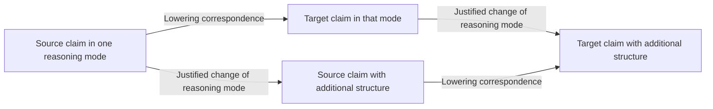

<a id="a-confession-and-a-vision"></a>

## Engineering Goals and Mathematical Foundations

Design of the Fidelity framework began in 2020 with practical engineering problems, particularly in AI development. A managed runtime made some memory decisions difficult to control. Numerical errors accumulated across operations that looked harmless in isolation. Machine learning framework conventions could obscure the physical meaning of the data. Those problems shaped the initial design, guided more by engineering requirements than mathematical theory.

Gavranović et al.'s [*Categorical Deep Learning is an Algebraic Theory of All Architectures*](https://arxiv.org/abs/2402.15332) provided a mathematical account of a related design problem. The authors connect constraints on a model with the operations used to implement it. Our compiler work had approached that relationship by trying to keep the meaning of a computation available while changing how it runs.

A significant credit belongs to [Paul Snively and his polyglot perspective](https://podcasts.apple.com/us/podcast/37-the-future-of-everything-with-paul-snively/id1531666706?i=1000531977557). His experience with functional programming and formal verification helped connect practical design decisions with established results. [Paul's conversation on programming languages, reliable code, and good taste](https://www.youtube.com/watch?v=Cq_IstGhUv4) gives a sense of that perspective. Conversations between Paul and Fidelity founder Houston Haynes contributed substantially to this synthesis and its grounding in the practical history of these ideas. Responsibility for mistakes and omissions remains with the project.

This body of work helps explain how solutions to practical compiler problems fit together. Exploring those connections gives us a basis for refining the design and explaining its foundations.

The categorical vocabulary can take some getting used to. Ordinary questions about functions and data offer a useful starting point: which values are shared, what can change, and what must remain true after a transformation? Those questions give the notation something familiar to describe.

The goal is for a developer to combine a physical simulation with a learned component without having to reconstruct the model's meaning at every library or hardware boundary. The same platform should leave room for quantum and other specialized targets as their implementations become useful. That ambition has driven our choices in Clef, its compiler, and the Fidelity framework.

## The Journey So Far

Our early explorations of [alternatives to transformer architectures](/blog/beyond-transformers/) encouraged us to treat tensor operations as implementation choices. A recurrent update, a sparse geometric product, and a dense matrix multiplication have different structure. The compiler needs enough information to distinguish them before selecting an implementation.

The explorations of [ternary models and heterogeneous computing](https://speakez.tech/blog/a-unified-vision-for-ternary-models/) and [discriminated unions for post-transformer AI](https://speakez.tech/blog/discriminated-unions-in-post-transformer-ai/) were part of that process. The aim was to give different kinds of computation a suitable representation and then explore how they could work together. That was also the ambition behind [Fidelity as an AI Refinery](/blog/fidelity-as-ai-refinery/): a platform on which the shape of the problem could guide the use of the hardware.

Work on the [Program Hypergraph](/docs/internals/pipeline/hyping-hypergraphs/) addressed relationships involving several operations at once. A buffer shared by a producer and multiple consumers has a joint lifetime and access contract. A conservation law may constrain the input, output, and internal state of a physical process. Keeping only isolated operation annotations makes those relationships difficult to check.

BAREWire brought the same concern to memory layout, interprocess communication, and network contracts. A quantity's representation affects the bytes in memory and the agreement between systems exchanging those bytes. Our [proof-aware compilation design](/docs/internals/pipeline/proof-aware-compilation/) extends that agreement through the transformations that produce executable code.

These engineering problems motivate a closer study of the categorical account: which relationships can be established once and safely reused as the program changes form?

<a id="the-current-crisis-divergent-paths"></a>
<a id="hpcs-challenges"></a>
<a id="ais-challenges"></a>

## Physical Models and Learned Components

A simulation engineer may know that an update must conserve a quantity or respect a symmetry. A learning engineer may have a procedure that fits observations well. Combining their work requires an interface that states both the physical commitments and the freedoms left to the learned component.

Consider a learned force correction in a mechanical simulation. Its output must have units of force. Its dependence on orientation may need to respect a rotation law. Its magnitude may be bounded by the operating envelope of an actuator. Training data can guide the correction within those conditions. Good average prediction error alone establishes none of those three properties.

For our framework, this suggests a practical division of work. Keep the admissible structure explicit, check the conditions needed by the implementation, and let learning select among the remaining possibilities. We are developing this direction in our work on [Adaptive Domain Models](https://arxiv.org/abs/2603.18104), where a model has a stated structure and deployment envelope.

<a id="the-solution-categorical-deep-learning"></a>

## Parameterized Composition

Suppose two layers of a model are meant to use the same learned weight. Keeping that sharing intact is a familiar programming concern, and it gives us a small example of what the categorical description records.

Let one layer multiply its input by a learned scalar:

\[
f(p,x)=px.
\]

Two independently parameterized layers give \(g((p,q),x)=qpx\). Sharing their parameter gives \(h(p,x)=g((p,p),x)=p^2x\). The map \(p\mapsto(p,p)\) expresses the sharing. An implementation must preserve that relationship when it lays out parameters or generates updates. Allocating two independently updated weights would change the model.

The CDL paper's [Para construction](https://arxiv.org/html/2402.15332#S3.SS1) uses the base category's objects as data spaces. A 1-cell from \(A\) to \(B\) contains a parameter space \(P\) and a map \(f:P\times A\to B\). Its 2-cells describe reparameterizations. Parameters belong to the map, rather than replacing its input and output spaces.

The compiler can distinguish a shared parameter from two parameters that happen to have equal initial values. A model author can require a symmetry or recurrence law while leaving the particular parameter values open to training.

<a id="implementing-the-core-insight"></a>
<a id="key-cdl-principles-applied-to-hpcai"></a>

### Differentiation and Feedback

Training also needs to account for every place a shared weight was used. If changing one value affects two layers, both contributions belong in its derivative.

Reverse differentiation has a related categorical account through [lenses and reverse differential structure](https://arxiv.org/html/2103.01931#S2.Thmtheorem7). A forward map is paired with a reverse derivative, and lens composition expresses the reverse chain rule. Applying the parameterized construction also accounts for sensitivity to learned parameters.

For the shared layer above, differentiation must include both uses of \(p\):

\[
\frac{\partial h}{\partial p}=2px,
\qquad
\frac{\partial h}{\partial x}=p^2.
\]

The reverse calculation needs information from the forward calculation. Even the simpler function \(x\mapsto x^2\) demonstrates why. Given a sensitivity \(\bar y\), its reverse derivative returns \(2x\bar y\). The primal value \(x\) participates in that calculation. Trying to recover \(x\) from \(x^2\) would be a different problem, with two possible signs for a positive result.

Differentiation needs rules for primal values and sensitivities. Memory analysis needs rules for retaining, recomputing, or releasing those values. Both analyses concern the same program, with different facts and different composition laws.

<a id="quantum-computing-the-natural-beneficiary"></a>

### Adjoint Structure

The word *adjoint* appears in several relevant settings. In numerical sensitivity analysis, an adjoint calculation propagates information through the transpose of a derivative, with the appropriate pairing between spaces. For a complex linear operator, the dagger is its conjugate transpose. A unitary operator has the additional property that its dagger is its inverse.

A [categorical adjunction](/docs/design/categorical-foundations/categorical-deep-learning-adjoint-correspondence/#the-adjoint-correspondence) has functors, a unit, and a counit satisfying triangle identities. Those laws describe a correspondence between constructions. They do not make every backward computation an inverse.

Giving these structures a common place in the framework is useful when the laws specific to each remain explicit. A compiler should preserve a valid reverse derivative through a transformation. A quantum lowering should preserve the stated circuit semantics. Sharing a graph infrastructure can support both jobs, provided each transformation carries the appropriate justification.

<a id="why-clef-is-a-natural-choice-for-this-domain"></a>
<a id="beyond-functional-the-engineering-bridge"></a>

## Clef's Source-Level Commitments

Our language design draws from several lines of work. Kennedy's dimensional inference provides the measure algebra. OCaml and F# contribute practical ML experience, including the quotation facilities that influenced Clef's design. Scheme's nanopass tradition informs small compiler transformations. MLKit supplies experience with region inference, while the verification work in F* and Dafny informs how proofs can participate in ordinary programming.

The goal is for those influences to reduce the number of decisions a developer must repeat. The source should express the mathematical operation and the conditions under which it is meaningful. The compiler can then use platform information to determine storage and execution details.

<a id="units-of-measure-dimensional-analysis-for-free"></a>

### Dimensions and Numeric Kinds

A work calculation can state its physical inputs directly:

```fsharp
[<Measure>] type kg
[<Measure>] type m
[<Measure>] type s
[<Measure>] type N = kg * m / s^2

let work (force: float<N>) (distance: float<m>) =
    force * distance
```

The product has dimension \(\mathrm{kg}\,\mathrm{m}^2/\mathrm{s}^2\). Measure equality follows the Abelian-group laws, so equivalent products and quotients identify the same dimension. A width choice such as 32 or 64 bits belongs to later representation selection. Here `float` identifies the source numeric kind.

The units establish compatibility. Values, guards, and justified domain laws establish numerical bounds. A force measured in newtons could have a small operating range or an astronomical one. Our [units-of-measure specification](/spec/draft/units-of-measure/) and [width-inference specification](/spec/draft/width-inference/) keep those responsibilities explicit.

For a learned layer \(y=Wx+b\), the same reasoning determines the units of \(W\) and \(b\) from the input and output quantities. A gradient has the units of the loss divided by the units of the differentiated parameter. An update rule must supply the remaining factors needed to produce a value with the parameter's units. A learning rate is only dimensionless when that particular update permits it.

<a id="computation-expressions-native-categorical-structures"></a>
<a id="active-patterns-recognizing-categorical-structures"></a>
<a id="type-providers-bridging-abstract-and-concrete"></a>
<a id="quotations-preserving-mathematical-semantics"></a>

### Quoted Structure and Library Laws

Clef's quotation-based design gives libraries a way to present operations and their requirements for analysis. A builder can make a domain's syntax convenient. Pattern recognition can identify a known operation. The associated laws still need a checked definition or a proved library result. Recognizing a method named `Bind`, for example, establishes a syntactic shape, while associativity is a property of its behavior.

For a matrix product, a library contract could state compatible shapes, element dimensions, and the relationship between the result and its inputs. Platform quotations would supply available arithmetic and layout facts. Keeping those sources of information distinct lets the compiler report a missing shape premise at the source operation, or an unsupported representation at the target boundary.

A domain library can establish a lemma once and expose its parameters and premises for automatic application. The intended editor experience is ordinary programming with that library: the analyzer proposes a relevant lemma for a region, the developer accepts its application, and the compiler checks the instantiated premises. An annotation may be folded away while a marker retains the obligation's scope and current or stale status.

This is the intended role of proofs in the developer experience. A developer using a conservation-preserving update should benefit from the library's established result each time it applies. Explicit proof development extends the library when a new operation requires new justification.

<a id="universal-numbers-solving-the-numerical-problem"></a>
<a id="posit-arithmetic-the-best-of-both-worlds"></a>
<a id="clef-type-safe-integration"></a>

## Numerical Representation and Accumulation

This returns to one of the engineering problems that started the project: a calculation can be correctly assembled and still lose useful information through repeated rounding. The goal is to make numerical representation something we can reason about alongside the calculation, with the hardware choices available for inspection.

The [Universal Numbers library](https://github.com/stillwater-sc/universal) provides arithmetic implementations for exploring a variety of number systems and mixed-precision algorithms. It supports exploration of representation as a deliberate target decision. IEEE formats, posits, integers, and other representations have different properties that a platform can declare.

Posits offer tapered precision. A quire can accumulate products of represented operands exactly within its finite capacity and round when converting the result. The [2022 Posit Standard](https://posithub.org/docs/posit_standard-2.pdf) specifies a 512-bit quire for posit32, giving 64 bytes of accumulator storage before any enclosing layout requirements.

For a dot product,

\[
s=\sum_{i=1}^{n} a_i b_i,
\]

exact accumulation requires the operand formats, product range, and accumulation length to fit the chosen quire. Every partial sum needs coverage. A sequence \(A,A,-A,-A\) has final sum zero but reaches \(2A\) along the way. A proof about the final range alone would miss that requirement.

Finite capacity therefore belongs in the operation's contract. If the target's available accumulator cannot cover the justified range, the compiler needs a different valid implementation or a diagnostic. Our [numeric-selection rules](/spec/draft/numeric-selection/) require a hard error when a committed representation leaves the known range uncovered.

A quire's exact accumulation concerns products and sums of the represented inputs. Input conversion, a nonlinear activation, a matrix solve, and final rounding can each introduce error. A numerical error budget should account for those operations individually. The full computation inherits only the guarantees that compose across them.

### Training Cost

A quire changes accumulation behavior and storage requirements. Its execution cost depends on the target's arithmetic support and the shape of the workload. Software emulation, a CPU instruction, and a synthesized arithmetic unit can have quite different costs for the same mathematical operation.

Forward-mode differentiation offers another choice. It can avoid the activation tape associated with a reverse pass, while still requiring primal state, tangent state, parameters, and optimizer storage. Several tangent directions increase both memory and arithmetic work. A projection built from \(k\) explicit tangents in \(n\) dimensions also requires a Gram matrix. Forming it directly takes \(O(nk^2)\) arithmetic, and a dense solve adds \(O(k^3)\) work.

A useful comparison should measure peak live storage, arithmetic work, and training quality on the same task. It should also report numerical error under the selected formats. Those measurements can guide target selection and future library implementations.

<a id="formal-verification-provable-numerics"></a>
<a id="the-missing-link"></a>
<a id="proof-carrying-code-in-the-hypergraph"></a>

## Proofs in the Program Graph

From the developer's side, a proof should often feel like using a well-chosen library operation. The library author has established a result, and our program supplies the inputs and conditions under which it applies. A *lemma* is one of those reusable proved results. The compiler should handle the repeated application work so the engineer can concentrate on the model.

Our Program Semantic Graph is intended to carry the joint constraints of the computation, including the relationships that justify an operation. The Program Hypergraph makes relationships involving several nodes explicit. A matrix product, for example, connects two input shapes with an output shape, an element operation, and the storage on which its implementation depends.

That graph should carry a proof obligation's premises, scope, and discharge status. An external verification ledger currently provides comparison scaffolding while we establish the integrity of this mechanism. Recording that a proof was requested is distinct from recording a checked result. The canonical mechanism belongs with the graph's joint constraints.

Our [proof-mode design](/docs/internals/verification/mode-shifts/) connects library results with the obligations their applications generate. Reusing a lemma reduces repeated proof construction for the developer. The compiler still checks that the application refers to the right operation and that its premises hold in the current program.

<a id="proofs-as-optimization-catalysts"></a>
<a id="calendar-time-the-hidden-multiplier"></a>
<a id="the-compounding-effect"></a>

### Reusable Justification

Consider a matrix kernel whose inner loop indexes \(A_{ik}\) and \(B_{kj}\). Compatible dimensions alone leave several implementation facts to establish: the loop bounds, the layout's address calculation, and the lifetime of each allocation. Once those premises are checked, the kernel can use a bounds-check elimination justified by that particular loop and layout.

The developer should be able to inspect one applied library result instead of rebuilding the indexing argument at every call. In the editor, changing a shape or a layout invalidates the affected application and triggers the relevant checks again. An unchanged proof identity is insufficient if its premises have changed.

A lemma application can identify an existing result and supply its arguments instead of repeating a long derivation. A [conditional information-theoretic account](https://homepages.cwi.nl/~paulv/papers/info.pdf) makes the role of shared context explicit. Fix a library and a computable decoding convention. A self-delimiting application description that reconstructs a derivation supplies a description-length upper bound, with a fixed additional cost for the decoder. Library construction and checking still have their own costs.

<a id="fidelity-framework-unifying-implementation"></a>
<a id="coeffect-analysis-for-unified-optimization"></a>
<a id="beyond-moores-law-the-data-flow-advantage"></a>

### Layout and Transfer

Our coeffect analysis connects required facts about values with decisions about their realization. Range affects numeric representation. Lifetime affects placement. Access requirements affect whether a value may be shared or transferred. These decisions interact, so the compiler must reconcile them before committing to a target layout.

A flat closure environment has a finite set of capture fields. Immutable values can be captured by value, while a shared mutable binding requires storage whose lifetime covers its uses. Concrete field sizes and alignment also need instantiated types and target facts. Capturing a reference adds requirements about its referent. Copying the reference's bits to another device or process does not establish valid access there.

BAREWire's three roles belong in this analysis: memory layout within a process, IPC contracts between processes, and network contracts across machines. Compatible layouts and access rights may permit a shared-memory path. Different address spaces or representations may require translation or copying. Those boundary operations should retain the same dimensional and protocol commitments as the source computation.

<a id="proof-aware-compilation-through-hypergraphs"></a>
<a id="layer-1-hypergraph-optimization-with-proofs"></a>
<a id="layer-2-mlir-with-constraint-preservation"></a>
<a id="layer-3-hardware-specific-verified-code"></a>

## Lowering and Reasoning Modes

A checked source operation still needs a correct target realization. Lowering a mathematical integer operation to a bounded machine operation introduces a representability condition. Moving a buffer between memories introduces layout and access conditions. Each transformation needs evidence connecting the source claim to the property checked at the next stage.

We also change reasoning modes. Measure equality uses algebraic normalization. A bounded index calculation can use arithmetic constraints. A domain result may supply a proved lemma, and a relational argument may compare two executions. Our intended categorical account includes both directions:


```mermaid
flowchart LR
    A[Source claim in one reasoning mode] -->|Lowering correspondence| B[Target claim in that mode]
    A -->|Justified change of reasoning mode| C[Source claim with additional structure]
    B -->|Justified change of reasoning mode| D[Target claim with additional structure]
    C -->|Lowering correspondence| D
```

When both routes apply, the evidence should relate the property established before lowering to the translated property established afterward. A two-categorical or fibered description would organize these correspondences and their compatibility. The [adjoint correspondence entry](/docs/design/categorical-foundations/categorical-deep-learning-adjoint-correspondence/) and [compilation sheaf design](/docs/design/categorical-foundations/the-compilation-sheaf/) develop that direction.

Some type metadata has served its purpose by the time native instructions are produced. The compiler can release it at a justified boundary while retaining the correspondence needed to validate the lowering. The target need not carry dimensional runtime tags to preserve the source program's dimensional contract.

MLIR gives us infrastructure for representing and transforming operations. Preservation depends on the particular operation definitions, conversion rules, and checks. An annotation attached to an operation needs a defined treatment when that operation is replaced. Our validation work must demonstrate that treatment across the actual pipeline.

<a id="the-hpc-ai-convergence"></a>
<a id="why-convergence-follows"></a>
<a id="new-computational-primitives"></a>
<a id="unified-applications"></a>
<a id="digital-twins-with-verified-learning"></a>
<a id="climate-modeling-with-physics-informed-learning"></a>
<a id="autonomous-systems-with-certified-safety"></a>
<a id="advanced-implementation-examples"></a>

## Physical Learning Contracts

The design is easier to assess through applications where the learned component has a specific job. A digital twin may estimate an uncertain material parameter. A climate model may use a learned subgrid correction. An autonomous system may estimate observation noise. Each can expose an operating envelope and the physical conditions that the learned output must respect.

| Application | Fixed commitment | Learned quantity | Additional evidence |
|---|---|---|---|
| Digital twin | Consistent geometry, units, and interface balance | Material or response parameters | Admissible parameter range and model discrepancy |
| Climate model | Stated discrete balance law and boundary conditions | Unresolved-scale contribution | Compatibility with that balance and numerical error budget |
| State estimation | Valid covariance construction and update | Noise model or correction | Statistical calibration under the operating conditions |

The learned range can remain broad during exploration. Observations and checked premises can narrow it later. A probability model can rank admissible choices, with its prior and likelihood made explicit. A hard physical constraint remains binding throughout that process. The [deferred-inference design](/blog/deferred-inference/) preserves room for later evidence before a particular execution requires a committed fact.

<a id="verified-fluid-structure-interaction"></a>

### Fluid-Structure Coupling

Think of airflow bending a wing. One solver describes the fluid, another describes the structure, and their agreement at the surface determines whether the coupled calculation makes physical sense.

Suppose a fluid solver and a structural solver exchange forces and velocities at an interface. Their meshes may differ. Let a transfer matrix \(T\) map structural interface velocities to fluid interface velocities:

\[
v_f=T v_s.
\]

Using compatible coordinates and a work pairing, transfer the corresponding fluid force back as \(f_s=T^\top f_f\). Then

\[
f_s^\top v_s=f_f^\top T v_s=f_f^\top v_f.
\]

This gives an interface power identity. Opposite action and reaction signs must be included according to which subsystem's balance is being written. With weighted discrete inner products, the transfer uses the corresponding weighted adjoint.

A library can establish this identity for the chosen transfer construction. The caller supplies compatible spaces and the required pairing. A learned interface model must produce forces or parameters that fit that construction. It can then benefit from the existing result without changing the transfer law.

Conservation for a full time step also depends on the integration scheme, boundary work, and the remaining operations. Finite-precision realization adds its numerical conditions. The interface identity is a useful reusable result with a clearly defined scope.

<a id="verified-kalman-filter-with-learning"></a>

### Learned Noise in a Kalman Filter

Imagine a sensor becoming noisier as a machine heats up. A learned model could help an estimator adjust how much confidence it places in the next reading. The covariance matrix records those uncertainties and their relationships, so keeping it mathematically valid is part of making that adaptation useful.

Suppose the model and gain are selected from information available before the observation, and observation noise is uncorrelated with predicted-state error under that conditioning. For predicted covariance \(P^-\), observation matrix \(H\), and observation-noise covariance \(R\), the innovation covariance is

\[
S=HP^-H^\top+R.
\]

If \(P^-\) is positive semidefinite and \(R\) is positive definite, then \(S\) is positive definite. The gain calculation can use that property when choosing a solve. For observations expressed in a common unit, a learned model could produce a factor \(C\) and a strictly positive \(\epsilon\), with \(R=CC^\top+\epsilon I\). The factor has the observation units and \(\epsilon\) has their square, giving the required covariance units.

Under those assumptions, the Joseph form of the covariance update is

\[
P^+=(I-KH)P^-(I-KH)^\top+KRK^\top.
\]

For positive semidefinite \(P^-\) and \(R\), this expression is positive semidefinite for any gain \(K\) in exact arithmetic. The factorization and update identities make useful library lemmas. A target implementation must also establish an adequate numerical realization, including the solve's conditioning and the effect of rounding.

That algebraic contract supports a valid covariance update. Whether the learned noise model accurately describes the sensor is a further statistical question. The estimator should retain the model's evidence and operating assumptions so that changing conditions can trigger reconsideration.

<a id="quantum-chemistry-with-neural-corrections"></a>

### Variational Chemistry

In a chemistry calculation, we might ask a learned model to propose a better description of a molecule's state. A lower trial energy can guide that search, provided the way we calculate it retains the variational bound.

A quantum chemistry model gives another concrete reason to constrain the learned component's interface. For a Hermitian Hamiltonian \(H\) with ground energy \(E_0\), a normalized trial state \(\psi\) satisfies

\[
\langle\psi,H\psi\rangle\ge E_0.
\]

A learned model can propose parameters for the trial state. A state construction that preserves normalization keeps the variational premise available as those parameters change. An arbitrary learned scalar correction to the energy needs its own justification before inheriting the upper-bound claim.

Evaluation adds error from any approximation of the Hamiltonian and from numerical calculation of the expectation. A certified enclosure of the exact trial-state expectation retains an upper bound through its upper endpoint. Quantum measurements instead require a stated statistical confidence argument. Deterministic error bounds add according to their propagation rules, while statistical uncertainties require their dependence assumptions.

This example gives classical simulation and quantum execution a shared source-level question: which state, operator, and error conditions justify the reported energy? Their implementations can differ while exposing evidence for that same question.

<a id="a-natural-path-to-general-quantum-compute"></a>

## Heterogeneous Targets

Our target architecture is intended to accommodate conventional processors alongside GPU, FPGA, NPU, and more specialized execution. A device implementation would declare its arithmetic, memory, and operation capabilities. Target selection can then check whether those capabilities realize the required computation within its numerical and resource constraints.

Quantum execution also needs a contract for the interaction with its classical host. State preparation, circuit transformation, measurement, and feedback have distinct semantics. A unitary subcircuit can support reasoning about an inverse. Measurement requires a probabilistic account and a classical result boundary. The [quantum substrate design](/docs/design/categorical-foundations/quantum-substrate-categorical-structure/) develops those target-specific requirements.

A JavaScript lowering path presents different realization choices again. Runtime objects and memory management can discharge some responsibilities that native lowering must decide explicitly. The same source commitment should remain traceable through either path, even where the relevant type structure is released at different stages.

<a id="the-unified-computational-future"></a>
<a id="the-convergence-timeline"></a>
<a id="technical-hurdles-and-open-questions"></a>
<a id="the-unified-future-is-now"></a>
<a id="the-path-forward"></a>

## Practical Milestones

Progress on this work should be visible in small, complete examples. A measured primitive should retain its type identity through elaboration, select a covering representation, and produce a validated native result. A layout-dependent operation should carry the BAREWire premises used to justify its addresses. A proof should remain associated with the corresponding operation through lowering and be reconsidered when a relevant premise changes.

The next application-level examples should combine those mechanisms. An estimator with a checked covariance construction would exercise learning, algebra, and numerical selection. A coupled simulation would exercise a spanning interface law and transfer contracts. Running those examples on another target would test whether the preserved evidence actually supports heterogeneous compilation.

An engineer opening one of those programs should see the physical operation first, then be able to inspect the dimensions, ranges, and applied proofs when needed. Changing a sensor model or trying a different target should feel like continuing work on the same problem, with the compiler explaining the new decisions that arise. That engineering experience has been a goal of the project from the outset, and the mathematical connections provide a stronger foundation for pursuing it.
