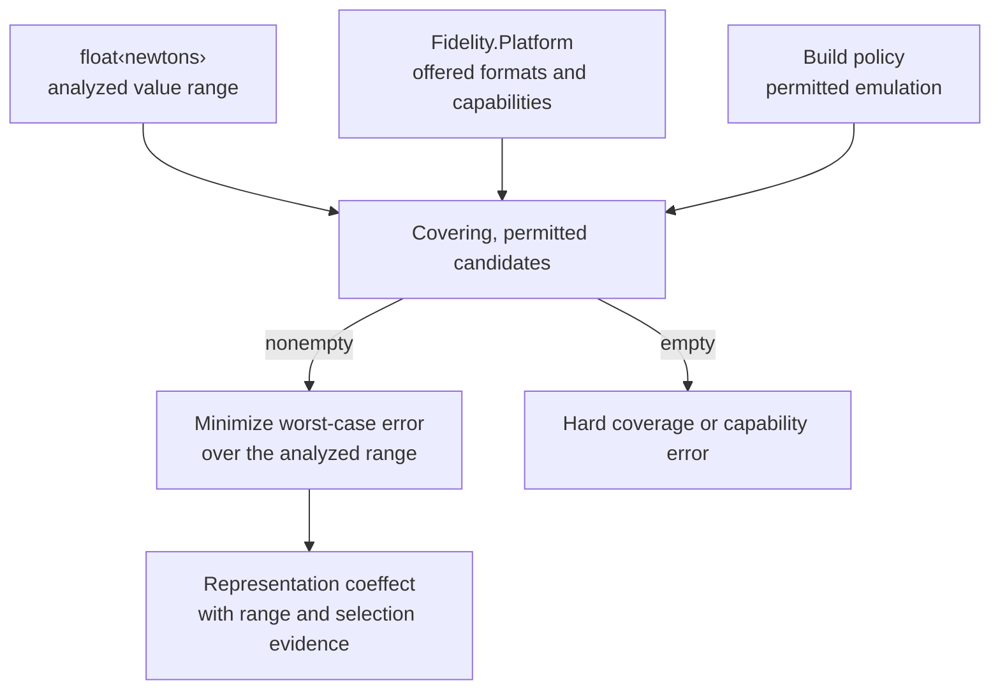
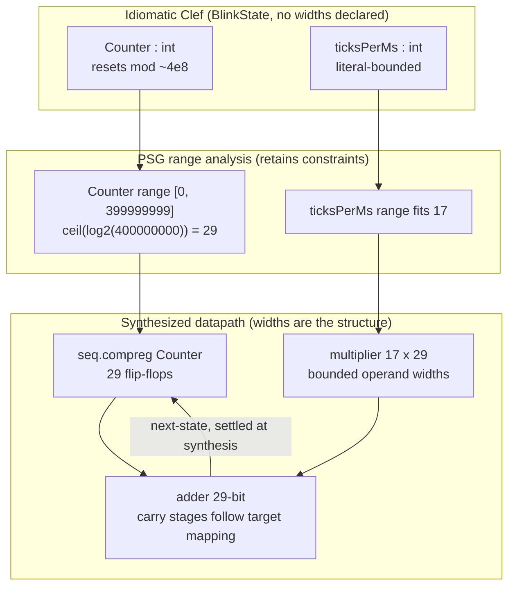
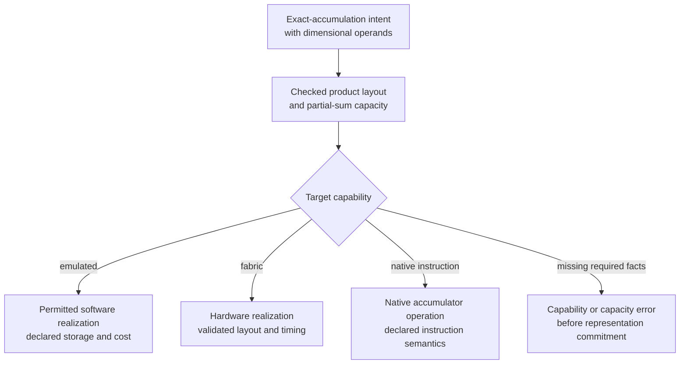
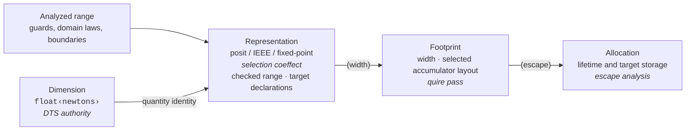

Every developer, whether by accident of history or through a specific educational arc, lands somewhere on the spectrum between concrete and abstract code conventions. The concrete end commits early and commits by hand: name the type, fix the width, pin the layout, and carry those decisions forward as the program grows. The abstract end leaves what it is *made of* to be settled later, by inference, by a compiler pass, by anything other than a decision made at the keyboard before the shape of the work is known. Anyone who has read [APL](https://en.wikipedia.org/wiki/APL_(programming_language)) or one of its descendants has seen the far pole of that end. An operation is written across a whole array as a single verb. The shape and the element layout are the runtime's business and never the programmer's. The notation describes the transformation and says nothing about the storage. Most working code lives nowhere near that extreme. It nudges toward the concrete end, less a theoretic conviction than merely when the language *asks*. A statically typed language is usually the one that asks earliest and most insistently, and that is where static typing earned its reputation for burden: it is read as the bargain where safety is paid for in decisions made up front, before there is enough information to make them well. The up-front decision and the static guarantee are not actually the same thing, though, and a type system can keep the second while giving back the first.

Nowhere is the concrete end of that spectrum more exposed than in the choice of a numeric format. The first quantities of a computation go down before the computation has a shape, a force, a velocity, a voltage off a sensor, and already the language wants a concrete answer: store this as what, a `float`, a `double`? The answer is not available, because the range these values will take is a property of the computation that is not finished being built. So the developer does what everyone does, reaches for `double` because it is wide and forgiving, and keeps going, because the work was to get the computation right and not to stop at the door and adjudicate a number format before the second line is written. The cost of that reflex shows up years later, if ever, when a `float` would have held the precision that mattered, or when a long run drifts because the format spent its bits in the wrong place.

The reflex can do worse than drift. Here is a running accumulation, the kind at the heart of any integrator or sensor total, written in C the way it gets written, with `float` chosen because the inputs were sensor readings and `float` is what the sensor library returned:

```c
// running total of a long stream of small increments
float total = 0.0f;
for (long i = 0; i < n; i++) {
    total += sample[i];   // each sample is small; total grows without bound
}
```

A `float` carries about seven significant decimal digits. Once `total` is large enough, adding a small `sample[i]` can round back to `total`. The sum then stops advancing while the loop keeps running. A wider format postpones that point, and an accumulation method that preserves the small contributions can address it directly. Either choice requires information about the values and the calculation. Naming a format before that information exists leaves the developer carrying the numerical obligation by hand.

The other extreme exacts the same tax in a different currency. Take a numerical staple, the variance of a sample, written in APL close to its mathematical definition and a pleasure to read:

```apl
var ← {(+/(⍵-(+/⍵)÷≢⍵)*2)÷≢⍵}   ⍝ mean of squared deviations
```

That one line is the entire computation: subtract the mean from each element, square, sum, divide by the count, with `≢` the tally and `+/` the sum across the array. Nothing on the page names a width, a shape, a length, or a format, and that economy is what draws people to it. But none of it is gone. The rank of the argument, whether `⍵` is a vector or a matrix, which axis a reduction folds along, whether the result is a scalar or an array the next stage can consume, all of it has to be true for the line to mean what the author intended, and none of it is stated where the language could hold the author to it. The discipline did not disappear. It moved into the developer's head, and it stays there, carried from the keyboard through every later call. C makes the developer commit the format too early. APL lets the developer commit almost nothing and carry the rest by hand instead. The expressive distance between the two poles is enormous, and the tax at both ends is the same: whatever the language leaves unstated, the human holds in their head.

Clef splits the static guarantee from the up-front decision, so the developer can keep the choice open until there is enough information to settle it. Write a force in newtons, a velocity in meters per second, or a voltage from a sensor. `float<newtons>` carries a checked dimensional type while the rest of the calculation supplies the context for its representation. We want the editor to show that decision as it develops: the pending range obligation, then the selected representation and the evidence behind it. The developer can keep working on the model while those facts become available.

The destination makes that freedom particularly useful. A CPU offers a menu of arithmetic formats and register widths. On an FPGA, a width can determine the circuit itself, down to the number of flip-flops and carry stages. Our integer width-inference path already gives us a working example of that second case. The real-valued selector would extend the same discipline to choosing an arithmetic format: gather the range and target facts, then make the decision where it can be checked.

## Deliberate Optionality

The intuition most people carry is that being more specific means supplying more information, so an early, concrete commitment looks like the informed move. But writing down a format does not tell us more about the values it will need to hold. Pinning a representation before the range is known discards alternatives that the range, once known, would have helped us choose among. Holding the choice open preserves that space until there is something to narrow it on. Software has a familiar name for the discipline. Mary and Tom Poppendieck's "decide as late as possible," from *Lean Software Development*, is the same instinct a working engineer comes to trust through experience. It makes a comfortable doorway into what follows, though the mechanism here is in our compiler service rather than in a team's process.

Poppendieck's advice concerns when to decide. Liskov's substitution principle gives us a related obligation: a replacement must preserve the properties its clients rely on.[^liskov] If the compiler chooses a different representation for a force calculation on another target, the result must still be a force, with the numerical guarantees the calculation requires. Coverage establishes that the interval is within the format's envelope. The error model describes the rounding that remains. Together with the retained dimension, those checks make the later choice accountable to the original program.

For decades the range of options was short enough that the format choice barely *was* one. A real number was an IEEE `float` or an IEEE `double`, and which one a value got was decided less by the value than by what the target register held. 

> A scarce option set was not simply about limited choices. It placed the burden of understanding hardware squarely on the designer. 

The C programmer choosing between `float`, `double`, and `long double` was choosing register widths. To choose well they had to know the target. Was this platform's `long double` eighty bits or sixty-four? Which width landed in a register, and which spilled? What was the precision once the hardware had its say? The knowledge that should have decided the format lived in the engineer, not in the toolchain, and the engineer carried it by being hardware-cognizant on every line.

That scarcity is gone, and the knowledge no longer has to be a standing engineering burden. [Posit](/docs/design/types/posit-arithmetic/), IEEE, and fixed-point each answer to range in a different way. The choice between them is now real, and our spec distinguishes their precision profiles:

> **IEEE-754** has approximately uniform relative precision across its normal range. **Posits** taper, with the greatest precision near magnitude `1.0`. **Fixed-point** fixes a scale and therefore an absolute spacing.

The range and the offered formats determine which representation is selected. Posit precision is concentrated near magnitude one, while IEEE relative precision is approximately uniform over its normal range. Neither observation establishes a winner without comparing the candidates over the actual interval. For a bare `float` whose range remains unknown, [Numeric Selection §6](/spec/draft/numeric-selection/#6-the-default-and-unobservable-case) explicitly permits the IEEE `f64` default when the target offers it and the capability policy allows it. That language rule does not establish a bound or override a known coverage error.

A developer staring at `float<newtons>` cannot see which of these applies. The dimension *newtons* does not tell them the range. The same dimension covers the gravitational tug between two grains of dust and the force binding a star to its galaxy. Knowing the kind is not knowing the range, and the target declarations must be known before selection. That relationship between a quantity's dimension and the representation its range selects is the subject of the [DTS/DMM paper](https://arxiv.org/abs/2603.16437), worked through for the framework in [posit arithmetic and dimensional type systems](/docs/design/categorical-foundations/posit-arithmetic-dimensional-type-systems/).

Our design obtains ranges from three sources: from the dataflow when the arithmetic itself bounds the values, from a domain library that states the physics, or from an annotation the developer writes to pin it explicitly. Once it has the range, the choice is not a judgment call. It is a deterministic function: pick the representation that minimizes worst-case relative error across the interval.

For a real value with range \([a, b]\) on a target \(T\) with permitted representation set \(R(T)\), the selected representation is

$$
r^{*} \;=\; \operatorname*{arg\,min}_{\,r \,\in\, R_{\mathrm{cov}}(T,\,[a,b])}\;\;\max_{\,x \,\in\, [a,b]}\;\; \mathrm{err}_{r}(x)
$$

Pick the representation, among those whose dynamic range covers the interval, whose worst case over the interval is least. The score is accuracy alone: no cost, latency, or area term enters it.

Here `R(T)` includes only offered formats permitted by the build's emulation policy. Coverage further filters the candidates before selection:

$$
R_{\mathrm{cov}}(T,\,[a,b]) \;=\; \bigl\{\, r \in R(T) \;:\; \mathrm{dynrange}(r) \supseteq [a, b] \,\bigr\}
$$

Keep only the representations whose dynamic range contains the interval. An empty \(R_{\mathrm{cov}}\) requires a reported error.

The error term is a mixed absolute and relative form with an ULP floor, so a range that straddles zero does not send the worst case to infinity:

$$
\mathrm{err}_{r}(x) \;=\; \frac{\lvert\, x - \mathrm{round}_{r}(x) \,\rvert}{\max\bigl(\lvert x \rvert,\; \mathrm{ulp_{min}}(r)\bigr)}
$$

The floor keeps the denominator positive at zero, where a purely relative-error formula is undefined. Zero itself can be represented exactly. Near-zero absolute spacing and relative precision are different properties, so the selector evaluates the stated metric over the interval rather than treating a cluster near zero as a posit advantage.

The developer writes the [units](/docs/design/types/dimensional-type-safety/) the problem requires and supplies the context needed to establish ranges. The range and the representation it selects ride the program graph as [coeffects](/docs/internals/concepts/coeffects-and-codata/), read by later passes rather than recomputed. This is the same bargain [fearless concurrency](/blog/fearless-concurrency-gets-real/) strikes for memory placement, where `let mutable x = 0` is ordinary syntax and the compiler classifies the escape and places the value, and the same one the [proof companion piece](/blog/between-a-rocq-and-a-hard-case/) strikes for proof, where the developer writes the routine and the compiler assembles the terms. The burden moves off the person and into the analysis. The developer writes intent. The compiler carries the consequence.

## Immutable Evidence

A useful deferred decision depends on keeping what we already know. If the developer has established a relationship between two values, the compiler should retain it as the program grows. A dimension, a guarded range, and a selected representation each contribute something different. We can know that a value is a force before we know its range, and know its range before the target has been chosen. [Width Inference §6](/spec/draft/width-inference/#6-unobservable-ranges) and [Conformance §5](/spec/draft/conformance/#5-the-diagnostic-obligation) specify where those pending decisions must be settled.

Immutability makes many of those facts reusable. Suppose a buffer routine checks `count <= length - offset` before accessing a slice. For the same unchanged integer values, that guard also establishes `offset + count <= length`. Keeping only separate intervals for `offset` and `count` can forget what the guard proved, leaving the developer to explain the same relationship again. Clef's [relational range rule](/spec/draft/width-inference/#21-relational-guards-and-immutable-values) keeps the relationship, its guard, and its dependencies with the program graph. That is the kind of ordinary, local reasoning we want the compiler to preserve on the developer's behalf.

The same reasoning should remain useful when the work is delayed. A [flat closure](/spec/draft/closure-representation/#22-capture-semantics) copies an immutable captured value and shares a mutable captured storage cell. A [lazy value](/spec/draft/lazy-representation/) memoizes the result when demanded. A fact about an immutable scalar can survive that delay. A fact about mutable contents must still hold when those contents are read. An immutable binding to a mutable array does not freeze the array. Tracking sharing, effects, and demand lets us keep valid facts without mistaking an earlier snapshot for the current contents.

Our proof-carrying PSG is designed to keep those constraints together with their evidence. We currently cross-check that mechanism with a separate proof ledger, a temporary scaffold for verifying the graph's own preservation work. As a checked buffer slice becomes a physical memory access, lowering must preserve its established property or re-check it at the affected edge, as [Conformance §6](/spec/draft/conformance/#6-the-preservation-obligation-through-lowering) requires. The developer's guard should still justify the access after the compiler has finished translating it.

## A Force in Context

Take the simplest thing a developer can write here and follow it from source to silicon. A program needs the gravitational pull between two masses, so the developer writes it in the units the problem is stated in:

```fsharp
open Fidelity.Physics.OrbitalMechanics

let gravForce (m1: float<kg>) (m2: float<kg>) (r: float<m>) : float<N> =
    GravConst * m1 * m2 / (r * r)
```

Kennedy-style unit-of-measure inference checks the result as a force: the gravitational constant supplies `m³/(kg·s²)`, and the expression produces `kg·m/s²`, or newtons. The same result dimension can be inferred if its annotation is omitted. The force law alone supplies no finite range, however. Its inputs still need bounds, including a positive lower bound on separation.

A domain library would supply the applicable law together with its preconditions. For example, bounded masses and a separation bounded away from zero permit a finite force interval. Opening a physics module cannot establish those preconditions for arbitrary inputs. The compiler must check them where the law is applied.

Suppose a particular model establishes `[1e-11, 1e30]` newtons. A proposed editor readout could show:

```
gravForce result : float<newtons>
  value range       [1e-11, 1e30]
  provenance        checked bounds on masses and positive separation
  representation    selected from this target's covering, permitted formats
  accuracy          worst-case error over that same interval
```

The editor would let us follow that same interval through the decision. If we normalize the model into natural units, the source calculation establishes a transformed range that can be inspected in turn. If most observations cluster near one, the extremes still participate in the worst-case comparison. Native posit hardware may make a format available, but the selector still compares its accuracy against the other permitted formats, including a wider IEEE format where one is offered.

What the developer contributes is still familiar: the masses and separation in the problem's units, the model's valid input domain, and the intended target. We want the editor to make the resulting numerical choice reviewable without asking the developer to guess it before that context exists.

## Target Knowledge

Naming a target supplies facts the source quantity does not carry. Our `Fidelity.Platform` description declares the formats that target offers and classifies each as native, emulated, or unavailable. The build's capability policy determines whether emulated candidates participate. The selector then compares accuracy across the permitted candidates that cover the range.

A target declaration might look like this:

```toml
[compilation]
target = "riscv64-posit"   # Illustrative platform binding
```

Hardware support alone does not determine the winner. If an emulated format is permitted and scores best, the specified accuracy objective selects it. The tooling can report its cost separately. If no permitted candidate covers the range, compilation reports the missing coverage.



A concrete destination narrows the choice without putting hardware type names into the source. `float<newtons>` retains its dimensional identity while the selected representation becomes a fact for later lowering.

## Pending Obligations

A developer should be able to write a consistent partial program before every representation question has an answer. Consider a bare value flowing into a dimensioned expression:

```fsharp
let x : float = bareInput
let y : float<newtons> = x * oneNewton
```

The bare `x` has the specified IEEE default available under the target conditions described above. The dimensioned `y` introduces a range obligation whose provenance leads back to `x`. Its dimension tells us the kind of quantity. Bounds must come from further context, a checked domain law, or an applicable boundary declaration. During editing, that obligation may remain pending. If it is still unresolved when a concrete representation must be committed, the compiler must report it at its origin.

The designed readout would make the distinction visible:

```
y : float<newtons>
  pending range obligation
  derives from x (bare float), whose input range is unresolved
  needed before representation commitment

  possible sources of evidence:
    - a bound on bareInput, established at its source or by a guard
    - a domain law whose preconditions hold for this input
    - an applicable platform or interface boundary declaration
```

A boundary declaration must still cover the established range. Clef has no source-level representation seal. The source continues to describe arithmetic and dimensions, while the platform or interface states its representation requirements.

A known range with no covering candidate is a different condition. Its diagnostic is a hard error:

```
E_COVERAGE  no permitted representation covers the established range
  value             astronomicalDistance : float<meters>
  range             [1e-11, 1e72]
  target candidates each fail the coverage check

  establish a smaller valid domain or change the platform/interface declaration
```

Rescaling is useful only when the transformed range is established and checked again. Expressing that example in astronomical units would leave the upper magnitude around `1e61`, so it would not fit a format whose upper magnitude is around `1e36`. The editor should offer remedies supported by the same analysis that found the problem.

## Inferred Fabric

On an FPGA, inferred width becomes circuit structure. [FPGA and hardware inference](/blog/fpga-and-hardware-inference/) follows the integer case in HelloArty: a counter bounded by `[0, 399999999]` needs 29 bits. A target with fixed instruction widths may realize it in a wider register. A synthesized datapath can instead use the required number of flip-flops and carry stages. Real-valued representation selection would extend that discipline to the arithmetic format, subject to an available hardware realization.

Hardened arithmetic blocks add a separate mapping constraint. A multiplier with 17-bit and 29-bit inputs does not fit directly into an 18-by-27-bit block. The synthesis tool may decompose it or use additional fabric, depending on the device. A narrower inferred range can reduce the work, but neither a dimensional annotation nor a width calculation establishes the final DSP count or timing.



Our hardware path represents this computation as a state transition, `State × Inputs → State × Outputs`. The counter's inferred 29-bit width is settled before synthesis, independently of its current value at a clock tick. The lowering checks described in [From Proofs to Silicon](/docs/internals/verification/proofs-to-silicon/) are intended to preserve the relevant bounds through the hardware pathway.

[Each state field gets the width its range requires](/spec/draft/width-inference/#3-width-derivation-integers), read off the PSG rather than taken from a host register. The integer width inference behind this ships today in HelloArty:

| State field | Inferred range | Width | Example 64-bit host realization |
|---|---|---|---|
| `Counter` | `[0, 399999999]` | `i29` | `i64` |
| `ticksPerMs` | literal-bounded | `i17` | `i64` |
| `PeriodMs` | `[100, 2000]` | `i11` | `i64` |

Those widths land directly in the synthesized register declarations. The width is fixed at synthesis and the register does not renegotiate it at clock-tick time:

```mlir
%counter_reg = seq.compreg %counter_next, %clk : i29
%period_reg  = seq.compreg %period_next,  %clk : i11

hw.output %report : !hw.struct<counter: i29, periodMs: i11>   // Moore: state-only, registered
```

The distinction from runtime representation change is concrete on fabric. This datapath's widths are settled before synthesis. Hardware can implement dynamic precision when a design explicitly provides the necessary storage and control logic, but that is a different mechanism with its own cost and contract. Deferred inference asks the compiler to decide later in compilation, after gathering more evidence. It does not ask the circuit to choose its own representation at each clock tick.

## Exact Accumulation

Sometimes the developer needs to state a numerical intent: this sum must accumulate without intermediate rounding. A dot product or force sum can lose small contributions when each addition rounds separately. A quire holds exact products in a wide fixed accumulator and rounds when the result is converted to the selected real representation.

That is a useful guarantee, with a capacity obligation. A finite accumulator can overflow if enough same-sign products are added. Showing that each product fits does not show that their accumulated sum fits, and cancellation at the end does not bound every earlier partial sum. The compiler needs evidence for the partial sums as well as the product layout.

For products \(a_i b_i\), let the exact running sum be

$$
S_j = \sum_{i=1}^{j} a_i b_i.
$$

Exact accumulation in a fixed quire requires every reached \(S_j\) to remain within its representable envelope. A bound on the number and magnitude of terms can establish that fact. A stronger invariant may establish it even when the number of iterations is open, for example when the partial sums themselves remain bounded. The requirement is capacity, rather than an arbitrary source-level length cap.

Our [numeric-selection design](/spec/draft/numeric-selection/#1021-the-quire-adequacy-invariant) keeps quire sizing with the selected format. A 512-bit accumulator occupies 64 bytes, but its placement and the machine's cache-line size are separate target facts. Selecting that storage does not make its capacity infinite.

The dimensional result remains available throughout. Products of `newtons × meters` accumulate as `joules`, and the final rounding preserves that result dimension. The source describes the quantities and the exact-accumulation intent. The platform declaration and selected format determine the concrete quire configuration.

| Source intent or established fact | Compiler obligation or consequence |
|---|---|
| Exact accumulation requested | Require an offered native or emulated exact accumulator |
| Products of `float<newtons>` and `float<meters>` | Accumulate a quantity with dimension `joules` |
| Bounds or an invariant over partial sums | Check capacity throughout the accumulation |
| Selected numeric representation | Determine the format's quire layout and final rounding |
| Captured values and lifetime | Place storage under the platform's lifetime contract |

We want to request that guarantee in terms of the calculation: accumulate these products exactly, then round the result. The selected platform representation supplies the concrete format and storage, including names such as `Posit32`. Exactness begins at the operations carried out in the accumulator. If an operand has already been rounded, the accumulator preserves that represented value faithfully, with the earlier error still part of the calculation's numerical contract.



We want the editor to show the resource commitment alongside the guarantee. That lets a developer request exact accumulation without inventing a storage layout, while keeping the compiler accountable for the capacity and capability evidence.

## Implementation Horizon

HelloArty's 29-bit counter gives us a concrete starting point: source-level arithmetic, an inferred range, and a width realized in hardware. Extending that experience to real-valued selection means keeping the source dimension and the evidence for its range available through compilation. The selector and editor readouts above describe the experience we are building toward, with domain libraries supplying checked laws that ordinary application code can use. The source remains about quantities and calculations, while the platform supplies its representation choices.



Our PSG carries the source dimension and the constraints used to establish a range. Target declarations constrain selection, and the selected representation determines the footprint. Lifetime analysis determines placement. These are related decisions with distinct evidence. Their representations may be released at different lowering boundaries once the properties needed below that boundary have been preserved or re-checked.

We want the developer to retain room to work: write the quantity, establish the model, and inspect the consequences as the context develops. A pending range should remain visible while that work is consistent. A contradiction or an uncovered representation should have a precise location and a traceable reason before compilation commits it.

The same preserved information can support [safety proofs](/blog/proofs-from-dimensional-types/) and the editor observations explored in [Opining Upon Reflection](/blog/opining-upon-reflection/). That is the gift we want deferred inference to offer: enough room to discover the computation, with increasingly useful guidance as the compiler learns what the developer already knows.

[^liskov]: Liskov, Barbara, and Jeannette Wing. ["A Behavioral Notion of Subtyping."](https://doi.org/10.1145/197320.197383) ACM Transactions on Programming Languages and Systems 16.6 (1994): 1811-1841. The subtyping requirement traces to Liskov's 1987 OOPSLA keynote, recounted in her 2009 Turing Award lecture ["The Power of Abstraction,"](https://www.youtube.com/watch?v=GDVAHA0oyJU) where she separates implementation inheritance, which breaks encapsulation, from the substitution relation a type hierarchy actually requires.
