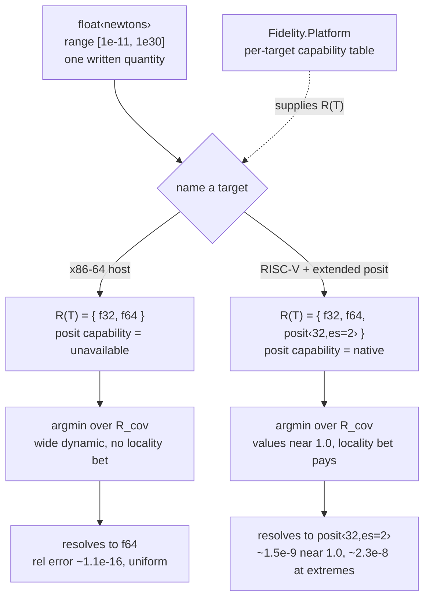
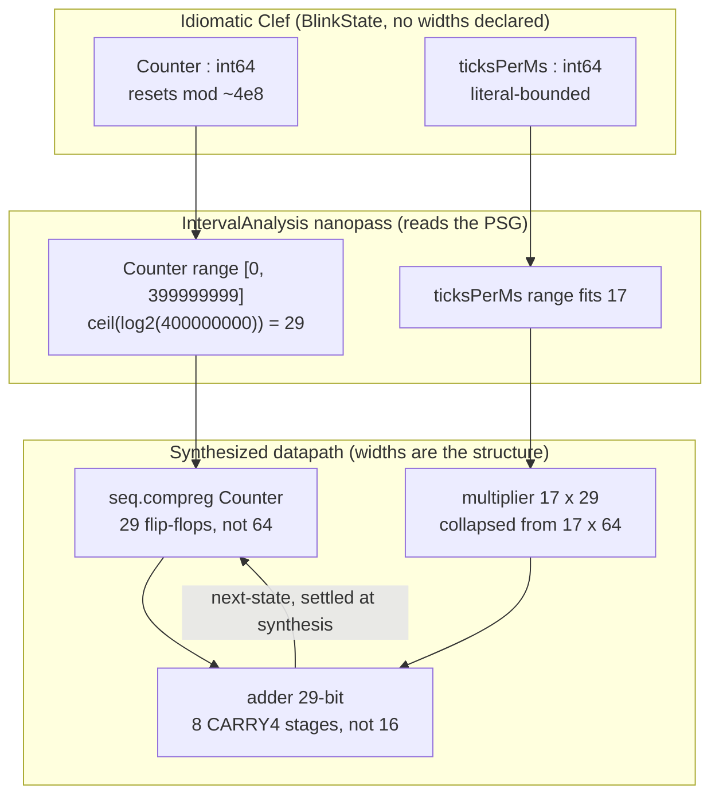
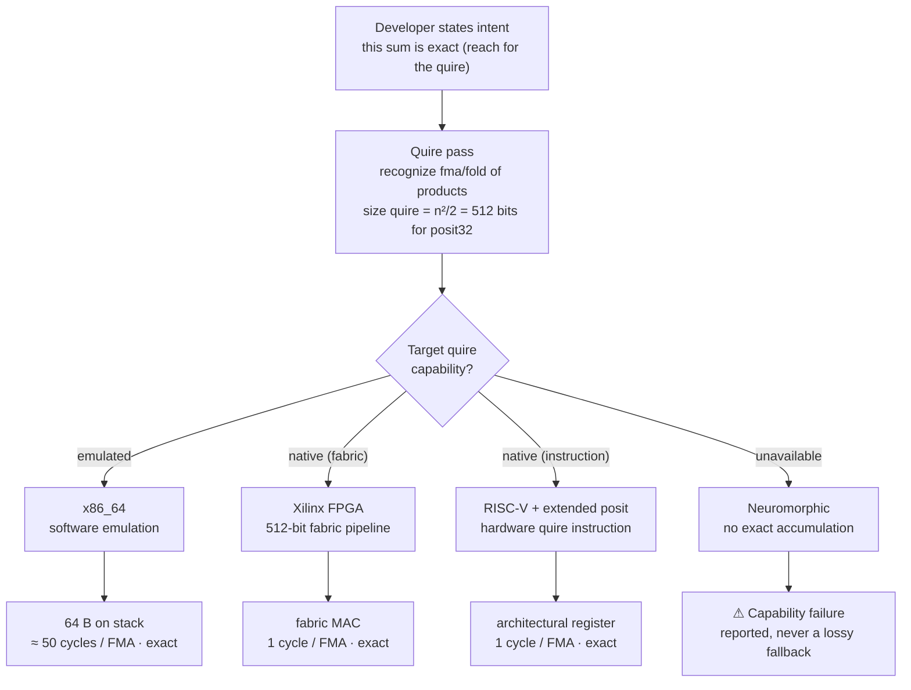
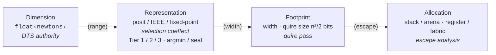

Every developer, whether by accident of history or through a specific educational arc, lands somewhere on the spectrum between concrete and abstract code conventions. The concrete end commits early and commits by hand: name the type, fix the width, pin the layout, and carry those decisions forward as the program grows. The abstract end leaves what it is *made of* to be settled later, by inference, by a compiler pass, by anything other than a decision made at the keyboard before the shape of the work is known. Anyone who has read [APL](https://en.wikipedia.org/wiki/APL_(programming_language)) or one of its descendants has seen the far pole of that end. An operation is written across a whole array as a single verb. The shape and the element layout are the runtime's business and never the programmer's. The notation describes the transformation and says nothing about the storage. Most working code lives nowhere near that extreme. It nudges toward the concrete end, less a theoretic conviction than merely when the language *asks*. A statically typed language is usually the one that asks earliest and most insistently, and that is where static typing earned its reputation for burden: it is read as the bargain where safety is paid for in decisions made up front, before there is enough information to make them well. The up-front decision and the static guarantee are not actually the same thing, though, and a type system can keep the second while giving back the first.

Nowhere is the concrete end of that spectrum more exposed than in the choice of a numeric format. The first quantities of a computation go down before the computation has a shape, a force, a velocity, a voltage off a sensor, and already the language wants a concrete answer: store this as what, a `float`, a `double`? The answer is not available, because the range these values will take is a property of the computation that is not finished being built. So the developer does what everyone does, reaches for `double` because it is wide and forgiving, and keeps going, because the work was to get the computation right and not to stop at the door and adjudicate a number format before the second line is written. The cost of that reflex shows up years later, if ever, when a `float` would have held the precision that mattered, or when a long run drifts because the format spent its bits in the wrong place.

The reflex can do worse than drift. Here is a running accumulation, the kind at the heart of any integrator or sensor total, written in C the way it gets written, with `float` chosen because the inputs were sensor readings and `float` is what the sensor library returned:

```c
// running total of a long stream of small increments
float total = 0.0f;
for (long i = 0; i < n; i++) {
    total += sample[i];   // each sample is small; total grows without bound
}
```

The algorithm is correct. The format is not. A `float` carries about seven significant digits. Once `total` has grown to a few million while each `sample[i]` is still around one, the value `total + sample[i]` rounds back to `total`. The increment is smaller than the gap between two representable floats at that magnitude, so it is swallowed whole. The sum stops advancing while the loop keeps running, and a reading that should have climbed sits frozen, off by an amount that grows with every step. Nothing in the language objected. This is not unstable math that a better algorithm would rescue; the same loop in `double` runs for far longer before it stalls, and a format matched to the real magnitude of `total` does not stall at all. The format was named at the keyboard, before anyone knew how large the total would grow, and the format was the bug.

The other extreme exacts the same tax in a different currency. Take a numerical staple, the variance of a sample, written in APL close to its mathematical definition and a pleasure to read:

```apl
var ← {(+/(⍵-(+/⍵)÷≢⍵)*2)÷≢⍵}   ⍝ mean of squared deviations
```

That one line is the entire computation: subtract the mean from each element, square, sum, divide by the count, with `≢` the tally and `+/` the sum across the array. Nothing on the page names a width, a shape, a length, or a format, and that economy is what draws people to it. But none of it is gone. The rank of the argument, whether `⍵` is a vector or a matrix, which axis a reduction folds along, whether the result is a scalar or an array the next stage can consume, all of it has to be true for the line to mean what the author intended, and none of it is stated where the language could hold the author to it. The discipline did not disappear. It moved into the developer's head, and it stays there, carried from the keyboard through every later call. C makes the developer commit the format too early. APL lets the developer commit almost nothing and carry the rest by hand instead. The expressive distance between the two poles is enormous, and the tax at both ends is the same: whatever the language leaves unstated, the human holds in their head.

Clef splits the static guarantee from the up-front decision, so the developer keeps the choice open until the latest, best-informed moment. The type stays fully present and fully checked, `float<newtons>` is as statically typed as anything in the program. What it does not carry is a representation the developer had to commit to before the range was known. The goal is to write in the units the problem is stated in, `float<newtons>`, `float<volt>`, a velocity in meters per second, and the compiler decides the representation from the range those units carry, per target, and shows its work in the editor while the code is being written. The decision is still made, statically, before anything runs. It is simply not made by the developer at design time. While the range is still open the editor says as much. Once it resolves, the editor shows the selected representation and the range that drove it, with the accuracy each target keeps alongside. Two kinds of target pull the experience to its sharpest, at opposite ends. On a fixed-instruction part, a CPU or a RISC-V board, naming the destination collapses a finite, stated menu of formats and most of the choice is made the moment the developer decides on the target processor. On an FPGA there is no "subset" to collapse. The representation is laid down as the circuit itself, and the discipline that keeps the choice out of runtime is what makes the design synthesizable at all.

## Delayed Specification Preserves Information

The intuition most people carry is that being more specific means supplying more information, so an early, concrete commitment looks like the informed move. In the information-theoretic sense it is the opposite. A commitment removes options, and the option space is the information. Pinning a representation before the range is known does not add knowledge, it discards the alternatives that the range, once known, would have chosen among. Holding the choice open preserves that space until there is something to narrow it on. Software has a familiar name for the discipline, if not for the information-theoretic reading of it. Mary and Tom Poppendieck's "decide as late as possible," from *Lean Software Development*, is the same instinct a working engineer comes to trust through experience. It makes a comfortable doorway into what follows, though the mechanism here is in our compiler service rather than in a team's process.

For decades the range of options was short enough that the format choice barely *was* one. A real number was an IEEE `float` or an IEEE `double`, and which one a value got was decided less by the value than by what the target register held. 

> A scarce option set was not simply about limited choices. It placed the burden of understanding hardware squarely on the designer. 

The C programmer choosing between `float`, `double`, and `long double` was choosing register widths. To choose well they had to know the target. Was this platform's `long double` eighty bits or sixty-four? Which width landed in a register, and which spilled? What was the precision once the hardware had its say? The knowledge that should have decided the format lived in the engineer, not in the toolchain, and the engineer carried it by being hardware-cognizant on every line.

That scarcity is gone, and the knowledge no longer has to be a standing engineering burden. [Posit](/docs/design/types/posit-arithmetic/), IEEE, and fixed-point each answer to range in a different way. The choice between them is now real, and our spec states the contest in three lines:

> **IEEE-754** distributes relative error approximately uniformly (≈ `2⁻ᵖ`) across its normal range — a representation that makes *no bet* on where values cluster. **Posits** taper: precision is maximal near magnitude `1.0` and degrades toward the regime extremes — a *bet on locality*. **Fixed-point** fixes a scale, trading dynamic range for uniform absolute spacing.

That is the concept in total, and the chosen option is decided entirely by *where the range sits*. IEEE-754 makes no bet. It is the right answer when nothing is known about where the values cluster, which is why a bare `float` of unknown range lowers to a double and stays there. A posit makes a bet on locality. It wins, sometimes by a wide margin, when a domain's values live near magnitude one. After natural-unit normalization, that holds for most physics and for normalized machine-learning activations.

A developer staring at `float<newtons>` cannot see which of these applies. The dimension *newtons* does not tell them the range. The same dimension covers the gravitational tug between two grains of dust and the force binding a star to its galaxy. Knowing the kind is not knowing the range, and only the range decides the representation. That relationship between a quantity's dimension and the representation its range selects is the subject of the [DTS/DMM paper](https://arxiv.org/abs/2603.16437), worked through for the framework in [posit arithmetic and dimensional type systems](/docs/design/categorical-foundations/posit-arithmetic-dimensional-type-systems/).

The compiler can know the range. It reads the range off the structure three ways: from the dataflow when the arithmetic itself bounds the values, from a domain library that states the physics, or from an annotation the developer writes to pin it explicitly. Once it has the range, the choice is not a judgment call. It is a deterministic function: pick the representation that minimizes worst-case relative error across the interval.

For a real value with range \([a, b]\) on a target \(T\) offering the representation set \(R(T)\), the selected representation is

$$
r^{*} \;=\; \operatorname*{arg\,min}_{\,r \,\in\, R_{\mathrm{cov}}(T,\,[a,b])}\;\;\max_{\,x \,\in\, [a,b]}\;\; \mathrm{err}_{r}(x)
$$

Pick the representation, among those whose dynamic range covers the interval, whose worst case over the interval is least. The score is accuracy alone: no cost, latency, or area term enters it.

The candidate set is feasibility-filtered before the argmin, so a format that cannot cover the range can never win it:

$$
R_{\mathrm{cov}}(T,\,[a,b]) \;=\; \bigl\{\, r \in R(T) \;:\; \mathrm{dynrange}(r) \supseteq [a, b] \,\bigr\}
$$

Keep only the representations whose dynamic range contains the entire interval. An empty \(R_{\mathrm{cov}}\) is a reported error, not a silent fallback.

The error term is a mixed absolute and relative form with an ULP floor, so a range that straddles zero does not send the worst case to infinity:

$$
\mathrm{err}_{r}(x) \;=\; \frac{\lvert\, x - \mathrm{round}_{r}(x) \,\rvert}{\max\bigl(\lvert x \rvert,\; \mathrm{ulp_{min}}(r)\bigr)}
$$

Below a representation's smallest representable magnitude the metric becomes effectively absolute, which is the correct near-zero semantics. The contest there is whose smallest magnitude best resolves the cluster near zero, not which format is precise near zero, since posits taper toward magnitude \(1.0\) and lose precision at zero like every other representation.

The developer's contribution stays with the code that had to be written anyway, the [units](/docs/design/types/dimensional-type-safety/) the problem already demanded, and the representation falls out of it. The range and the representation it selects ride the program graph as [coeffects](/docs/internals/concepts/coeffects-and-codata/), read by later passes rather than recomputed. This is the same bargain [fearless concurrency](/blog/fearless-concurrency-gets-real/) strikes for memory placement, where `let mutable x = 0` is ordinary syntax and the compiler classifies the escape and places the value, and the same one the [Rocq companion piece](/blog/between-a-rocq-and-a-hard-case/) strikes for proof, where the developer writes the routine and the compiler assembles the terms. The burden moves off the person and into the analysis. The developer writes intent; the compiler carries the consequence.

## A force, end to end

Take the simplest thing a developer can write here and follow it from source to silicon. A program needs the gravitational pull between two masses, so the developer writes it in the units the problem is stated in:

```fsharp
open Fidelity.Physics.OrbitalMechanics

let gravForce (m1: float<kg>) (m2: float<kg>) (r: float<m>) : float<N> =
    GravConst * m1 * m2 / (r * r)
```

The dimension is settled the moment that line is written. Kennedy unit-of-measure inference reads `kg × kg / m²` against the gravitational constant and infers `newtons` for the result, with no annotation and no proof to write. What the dimension does not settle is the range. The word *newtons* covers the tug between two grains of dust and the force binding a star to its galaxy, and the same word covers everything between. Knowing the quantity is a force says nothing about whether its values are tiny, enormous, or spread across both.

The range is exactly what decides the representation, and on this expression the compiler cannot read it from the code alone. The denominator is `r * r`, and nothing in the dataflow puts a floor under `r`, so the interval analysis cannot bound `1 / r²` from the structure. This is where the domain library is meant to step in. `Fidelity.Physics` states the physics the developer would otherwise have to tabulate themselves, and from the gravitation law it supplies the range `[1e-11, 1e30]`, from the gravitational constant at the small end through stellar masses at the large.

With a range in hand the choice stops being a judgment call and becomes the argmin: across the representations the named target offers, pick the one whose worst-case relative error over `[1e-11, 1e30]` is smallest. Run it per target and the same `float<N>` lands two different ways:

```
gravForce result : float<newtons>
  dimensional range  [1e-11, 1e30]   (gravitational constant through stellar masses; Tier 2)
  ├─ x86_64   float64          worst-case rel error 1.1e-16, uniform      [wide dynamic → IEEE]
  ├─ xilinx   posit<32,es=2>   ~2.3e-8 at the extremes, ~1.5e-9 near 1.0   [near-unity taper]
  └─ note     posit holds ~10x more precision in [0.01, 100], where most forces actually fall
```

On the wide-dynamic host the range is spread too far for any one bet to pay, so IEEE `float64`, which spends its precision uniformly and bets on nothing, is what the argmin returns. On the Xilinx part, once the forces are carried in natural units and cluster near magnitude `1.0`, the posit's taper concentrates its precision exactly where the values sit, and in the band `[0.01, 100]` where most of the forces actually fall it holds roughly ten times the precision of an equal-width float. Same source line, same dimension, two representations, each correct for where its values live.

What the developer did is the sum of their contribution. They wrote the masses and the radius in kilograms and meters, named the part the code was going to, and opened the orbital-mechanics module so the range had a source. What they got back, per target, read in the editor while typing, is the representation, the range that drove it, and how much accuracy each target preserves. The most consequential numerical decision in the program was latent in the code all along, and it arrives as something to read rather than something to guess.

## Naming the target does most of the work

One line pays off more than any other the developer writes here. They name the part they are building for. A RISC-V core with the extended posit instructions, an x86-64 host without them, an ARM64 board. From that line on, the editor stops floating options the machine was never going to honor. The readout that listed every representation in the abstract narrows to the ones this part actually runs, and the rest fall away without ever becoming the developer's problem.

What does the narrowing is the part of the toolchain that already knows the machine. `Fidelity.Platform` carries a description of each target, what its registers are, which numeric formats it runs in hardware, which it would have to emulate, whether it has a quire instruction or none. The developer does not write that description or consult it. They name a target and inherit it. Selection then runs against what the part offers rather than against the entire catalogue, so on a host with no posit hardware the editor quietly stops proposing posits, and on a RISC-V part that has the instruction it proposes them first. The same `float<newtons>` resolves differently on the two boards, and the developer reads which without having memorized either datasheet.

Naming the part is one line in the project file:

```toml
[compilation]
target = "riscv64-posit"   # RISC-V core with the extended posit instructions
```

Naming `riscv64-posit` is the entire act. `Fidelity.Platform` reads the entry, hands the selector the offered set `R(T) = { r : capability(T, r) ≠ unavailable }`, and the editor stops floating the formats this part cannot run at all. Swap the line for `target = "x86_64"` and the same `float<newtons>` resolves to `f64` instead, because that host's table reports no posit hardware.



The more concretely the work is pinned to a destination, the more the choice closes on its own. An abstract program keeps every representation live; a program aimed at a known part keeps only the ones that part can keep, and the range then decides among those. Most of a representation decision, on most targets, is made the instant the developer says where the code is going. The fixed-instruction parts are where this lands cleanly, because their menu is finite and stated, and naming the part is enough to collapse it.

## What the editor shows while the range is still open

When the representation cannot resolve yet, a lesser design quietly guesses and this one speaks up instead. Consider the seam the spec singles out, where a bare value with no established range flows into a dimensioned one:

```fsharp
let x : float = bareInput in
let y : float<newtons> = x * oneNewton
```

Here `x` is a bare `float`. Bare floats are allowed to have unknown ranges and lower to a double without complaint, because IEEE making no bet is the correct answer for an unknown range. But `y` is dimensioned, and a dimension, in this framework, is a *promise that a domain range exists*. The moment the unbounded `x` is asked to become a `newtons`, that promise comes due, and `y`'s range cannot be established because it derives from an `x` that was never bounded. Under a weaker design `y` would silently fall back to a double and the build would move on. Ours stops, at the dimensioning boundary, and the developer sees it in the editor while typing, the same place a type error shows up, not at the end of a batch compile:

```
E_RANGE_UNBOUNDED  y : float<newtons> requires a bounded range to select a representation.
  y's range derives from x (bare float), which is unbounded at line 1.
  The dimension <newtons> promises a domain range; none is in scope to fulfill it.

  to resolve, choose one:
    - bound x at its source            (annotate or constrain bareInput)
    - import a domain library          (open Fidelity.Physics.<X> to supply the range)
    - seal y's representation by hand   (state the format and accept its envelope)
```

That diagnostic is the experience. It is not an error about a missing type; the type is fine. It is an error about a missing *range*, traced across the dimensioning boundary back to the bare source that never had one, with the three honest ways out named in place. The developer is never told "I picked a double for you." They are told "I cannot choose yet, and here is exactly why, and here is what would let me." The unknown does not get papered over and it does not get deferred to runtime. It surfaces, located, at the moment of authorship.

When the range *is* available, the editor stops asking and starts showing. The same surfacing pass that flags the gap renders, on a resolved quantity, the comparison the developer would otherwise have to work out and almost never does:

```
force : float<newtons>
  dimensional range  [1e-11, 1e30]   (gravitational constant through stellar masses)
  ├─ x86_64   float64          worst-case rel error 1.1e-16, uniform     [wide dynamic → IEEE]
  ├─ xilinx   posit<32,es=2>   ~2.3e-8 at the extremes, ~1.5e-9 near 1.0  [near-unity taper]
  └─ note     posit holds ~10x more precision in [0.01, 100], where most forces actually fall
```

The two error columns differ because the formats spend their bits on different bets. IEEE-754 holds relative error near \(2^{-p}\) uniformly across its normal range, so it never concentrates precision anywhere. A posit concentrates precision near magnitude \(1.0\) and lets it taper toward its regime extremes: for `posit<32,es=2>` the relative error is about \(2^{-27}\) near unity and degrades toward about \(2^{-8}\) at the far edges of its full dynamic range near \(10^{\pm 36}\). The readout's figures are the worst case over the narrower dimensional range \([1\mathrm{e}{-}11, 1\mathrm{e}30]\), which does not reach those regime edges. The selection pass scores each format by its worst case over the actual range, \(\max_{x \in [a,b]} \mathrm{err}_r(x)\), so the winner is decided by where \([a, b]\) sits on that taper rather than by either endpoint alone.

A developer reads that without opening a numerical-analysis textbook. The taper-versus-uniform tradeoff, the thing that usually gets discovered empirically after a long run drifts, is made quantitative at authoring time, per target, against the actual range. And when the chosen format cannot cover the range, the editor says so plainly and suggests the dimensional move that would fix it:

```
W_COVERAGE  posit<32,es=2> dynamic range [1e-36, 1e36] does not cover the full
  dimensional range [1e-11, 1e72] of astronomicalDistance<meters>.
  consider: float64 (covers the range), or rescale to AU (1 AU ≈ 1.5e11 m) to fit posit range.
```

The "rescale to AU" suggestion is itself a dimensional operation, and the compiler can offer it only because it reasons about the quantity in the terms the developer wrote it in, so the remedy it proposes is one a domain expert would recognize. None of this requires the developer to know what a regime bit is. It requires them to have written the units, which they were going to write anyway.

## On the FPGA, the choice becomes the circuit

This is where the experience stops being a convenience and becomes the only way the thing can work at all. [FPGA and hardware inference](/blog/fpga-and-hardware-inference/) makes the foundational observation for integers, and it transfers wholesale to reals: on a CPU, a numeric type means "whatever the machine register holds," and the width is a platform property fixed before the program runs. On an FPGA there are no machine registers. Every wire and every flip-flop is exactly as wide as the design requires, so width, and now representation, is a design property, read from the structure. The counter in HelloArty that resets against a roughly four-hundred-million modulus has range `[0, 399,999,999]`, and the compiler reads it off the structure as 29 bits, not the 64 a CPU would have spent. Every narrower width is fewer flip-flops, shorter carry chains, and less LUT-based logic; the post walks a 17-by-64 multiply collapsing to 17-by-29 and the carry-chain depth halving. The representation choice is not bookkeeping there. It is the gate count.

One honest qualification belongs here, because a hardware engineer will reach for it. Width inference does not shrink everything in equal measure. Flip-flops, routing, carry chains, and LUT-based arithmetic scale with the inferred width directly, and that is most of a design. A multiply is the exception when it lands in a hardened DSP slice, a Xilinx `DSP48` natively spanning roughly eighteen by twenty-seven bits: a 17-by-29 multiply maps into one such slice and spends the same silicon a wider multiply would, because the slice is a fixed block. The inference still pays there, just in a different coin. It frees fabric the synthesizer would otherwise burn building a multiplier out of LUTs, and it packs more of the design's arithmetic into the slices a part actually has. Width is the gate count everywhere the logic is built from gates, and a negotiation with the hard blocks everywhere it is not.



The framework reads that hardware as a Mealy machine, `State × Inputs → State × Outputs`, off idiomatic functional Clef, and the inferred widths become the widths of the synthesized datapath. The shape of that machine is what makes the non-gradual discipline concrete instead of philosophical. A Mealy machine's *output* depends on state and current input, which is what lets it answer within a clock cycle. Its *representation*, the width and format of each state field, does not. The 29-bit counter does not renegotiate its width at clock-tick time depending on the value it is holding. The width is settled at synthesis and baked into the fabric, and a datapath whose representation could change while the circuit runs is not a datapath at all. It cannot be laid down in silicon. That the inferred facts survive every lowering step down to the gate is the same property the framework leans on to carry verification [from proofs to silicon](/docs/internals/verification/proofs-to-silicon/).

Each state field gets the width its range requires, read off the PSG rather than taken from a host register. The integer width inference behind this ships today in HelloArty:

| State field | Inferred range | Width | A host would spend |
|---|---|---|---|
| `Counter` | `[0, 399999999]` | `i29` | `i64` |
| `ticksPerMs` | literal-bounded | `i17` | `i64` |
| `PeriodMs` | `[100, 2000]` | `i11` | `i64` |

Those widths land directly in the synthesized register declarations. The width is fixed at synthesis and the register does not renegotiate it at clock-tick time:

```mlir
%counter_reg = seq.compreg %counter_next, %clk : i29
%period_reg  = seq.compreg %period_next,  %clk : i11

hw.output %report : !hw.struct<counter: i29, periodMs: i11>   // Moore: state-only, registered
```

So the FPGA is the place to take the gradual-typing worry seriously and watch it dissolve. A careful designer is right to be wary that a representation "decided after the graph is analyzed" is really a representation decided at runtime in disguise. On fabric, the proof that it is not is physical. Picture the gradual version: a circuit that checks every tick whether a value has outgrown its inferred format and, on overflow, coerces itself into a wider one with a blame signal routed back to the source. No one builds that, because on fabric the cost of a runtime representation cast is not hidden behind a cache and a branch predictor. It is visible, physical, and absurd. A CPU hides that cost well enough that gradual typing is a tenable idea there. An FPGA does not hide it at all. The representation is inferred late, after the graph is known, and fixed hard, before the circuit runs, and the second of those is not a stylistic choice. It is what synthesis requires. The discipline that keeps the framework out of gradual typing is the same discipline that lets the design become a circuit, and the developer experiences it not as a restriction but as the reason their `float<volt>` array turned into a pipeline whose widths they never had to count.

## The quire is where stating intent closes the rest

There is a point in numerical code where the developer wants to say something that is a choice rather than a fact, and it is not a representation. It is an *intent*: that an accumulation must be exact. A dot product, a force sum over an *n*-body step, a fold of products that in ordinary floating point bleeds precision, whether through small terms swallowed by a large running sum or through the cancellation of nearly-equal quantities. The posit standard answers this with a quire, a wide fixed accumulator that holds the sum without rounding until a single conversion at the end.

The compiler can recognize the shape that would use one. A fold or reduce of products over a posit is a pattern the pass already matches. What it cannot read off the structure is whether exactness is wanted here, and that is the part that has to be said. The quire is not a saving the analysis would find on its own; it is a deliberate spend, a fixed wide accumulator allocated unconditionally so the accumulation length never bounds the result. The range analysis tracks worst-case bounds, and worst-case bounds cannot tell a subtraction that will cancel from two intervals that merely overlap, so inferring exactness from intervals alone would either promote every fold of products to a wide accumulator or miss the ones that matter. Exactness is therefore a declaration, not a forecast. The developer is not predicting a failure mode the graph will hit; they are opting into a guarantee and the resource it costs. In Clef the developer reaches for the quire to declare the one thing that is genuinely theirs to declare: *this sum is exact*.

Once they have, almost nothing is left to decide. Stating exactness is stating the intent, and the structure falls out of it almost completely. The quire pairs with a posit, so the representation is implied. The posit width fixes the accumulator: the quire is `n²/2` bits, 512 of them for a 32-bit posit, which is exactly one cache line, and the pass verifies that each per-product intermediate fits that field independent of how long the accumulation runs.

$$
\text{quire}(n) \;=\; \frac{n^2}{2} \text{ bits}, \qquad
\text{quire}(32) \;=\; \frac{32^2}{2} \;=\; 512 \text{ bits} \;=\; \text{one cache line.}
$$

The invariant the sizing pass discharges is *adequacy*, not a length cap. For a sum of \(k\) products \(\sum_{i=1}^{k} a_i b_i\) over the selected posit width \(n\), the obligation verifies that a single per-product intermediate (the full-width product with its carry and guard bits) fits the quire field, and that bound does not mention \(k\):

$$
\mathrm{bits}\big(a_i b_i\big) \;+\; \mathrm{guard} \;\le\; \frac{n^2}{2}
\qquad\text{for every } i, \;\text{ independent of } k.
$$

A bound of the form \(k \cdot \mathrm{bits}(a_i b_i) \le n^2/2\) is rejected: it would re-impose on \(k\) exactly the limit the \(n^2/2\) field was sized to remove. Accumulation length is bounded by nothing in the accumulator.

The dimensions carry through the accumulation, so a sum of `newtons × meters` accumulates as `joules` and the single rounding lands at the conversion out, with the dimension checked at the boundary. The [escape class](/docs/design/memory/inferring-memory-lifetimes/) decides where the accumulator lives, stack or arena. One declaration of intent, exactness, and the representation, the accumulator size, the cache-line footprint, the result's dimension, and the rounding point are all consequences. The developer wrote what they meant. The compiler wrote everything that followed from it.

An *n*-body step makes the cascade concrete. The developer states one thing the compiler cannot infer, that this sum is exact, by accumulating into a quire instead of a running posit. Everything else is a consequence of that single choice:

| Declaration | What falls out |
|---|---|
| accumulate into `Quire32` | representation is `Posit32`; `Quire32.fma` takes `Posit32` operands by construction |
| `Quire32<newtons>` | products of `Posit32<newtons>` accumulate with no per-step rounding |
| `Quire.toPosit` at the end | the single rounding for the entire sum lands here, dimension checked: `newtons` in, `newtons` out |
| products of `newtons × meters` | accumulate as `Quire32<joules>`, the dimension carried through to a `Posit32<joules>` result |

```fsharp
let netForce (i: Body) (others: Body[]) : float<newtons> =
    let q =
        others
        |> Array.fold
            (fun (acc: Quire32<newtons>) (j: Body) ->
                let f = pairwiseForce i j        // Posit32<newtons>, range-matched
                Quire32.fma acc f oneP)          // exact MAC, no rounding here
            Quire32.zero
    Quire.toPosit q                              // single rounding, newtons -> Posit32<newtons>

let workAlong (forces: Posit32<newtons>[]) (steps: Posit32<meters>[]) : float<joules> =
    Array.zip forces steps
    |> Array.fold
        (fun (acc: Quire32<joules>) (f, ds) ->
            Quire32.fma acc f ds)                // newtons * meters -> joules, exact
        Quire32.zero
    |> Quire.toPosit                             // single rounding -> Posit32<joules>
     
```

On the targets this matters most for, that cascade is the design. On an FPGA the quire is a 512-bit fabric pipeline running a multiply-accumulate every cycle; the declaration of exactness *is* the datapath, and there is nothing left to lower but the wires. On a RISC-V part with the extended posit instructions it is an architectural register and a single hardware operation. On an x86 host without quire hardware it is emulated on the stack, slower but exact, and if a target offers no exact accumulation at all the compiler says so rather than silently falling back to a lossy sum. The same one word means a circuit, an instruction, or an emulation depending on where it lands, and the developer reads which one in the editor before choosing a target, the way they read everything else.



The quire buys exactness of accumulation, and the temptation to claim more than that is worth resisting, because the spec resists it too. Deferring all rounding to one final step keeps the structural zeros of a geometric-algebra computation structurally zero through training, and defeats the cancellation in a close gravitational encounter. It buys no magical precision near zero, which posits do not have; zero is a regime extreme where a posit, like every representation, loses precision. The accuracy a quire delivers comes from exact accumulation and from a representation that was range-matched at design time, and from nothing else. The benefit is real and large at exactly that size, and the framework states it at that size and no larger.

## What is built, and what is reached toward

The honest accounting, in the spirit the [flow loss](/blog/going-deep-with-flow-loss-analysis/) and [Rocq](/blog/between-a-rocq-and-a-hard-case/) pieces hold to, is that the integer half of this discipline runs today and the real-valued half is largely ahead of it. Width inference ships: it lowers to fabric in HelloArty, down to the 29-bit counter and the post-route timing, and the coeffect carriage it rides, the graph traversal that reads ranges and the escape analysis that places values, is operational. The real-valued sibling, the interval domain over reals and the selection pass that consumes it, is a new abstract interpreter of materially heavier weight than the integer one it sits beside, and it is design-stage work, not yet a shipping pass. The editor readouts above are the designed experience, drawn to the shape the existing width-inference and FPGA diagnostics already take, not screenshots from a build that exists today. The domain library that would derive a force interval from a gravitation law, sparing the developer the tabulation, is planned and not built, and the surface form for sealing a representation explicitly is still being settled. Naming those gaps keeps the design honest, and it sharpens rather than blunts the claim, because what the design fixes ahead of the pass that implements it is not a feature list. It is the shape of one chain, run end to end.



Each arrow is a coeffect on the Program Semantic Graph, deferred to target-binding because each later stage has strictly more information. The dimension establishes the kind under DTS authority; the analyzed range selects the representation; the selected width fixes the footprint, including a quire of `n²/2` bits, 512 for a 32-bit posit; the escape class decides where the value lives. The integer reading of this chain runs on fabric today; the real-valued reading is design-stage. Either way the developer wrote only the first box, the dimension, and the rest of the chain is the compiler's to carry.

That chain is the shape of the developer's day, and it answers the reputation static typing carries. They write the units the problem is stated in. They name the part the code is going to. They reach for a quire when a sum has to be exact, and in doing so decide almost everything downstream without deciding any of it by hand. The editor shows them, while they type, which representation resolves for each target and how much accuracy it preserves, and where a range is still unbounded it tells them so and traces it to the source rather than guessing. Every one of those decisions is made statically, before anything runs, with the full guarantee a type system is supposed to give. None of them is the up-front commitment static typing is assumed to demand in exchange. The developer wrote the dimension and the intent; the representation, the footprint, and the allocation were structural facts about the code from the start.

That is the gift in deferring inference. Holding the representation open is not a loss of rigor, it is what keeps the information the choice needs alive long enough to use it, and a target named late carries more of that information than any early reflexive decision. The same range that selects a representation also [generates safety proofs](/blog/proofs-from-dimensional-types/) from the computation graph, and the analysis stays [decidable by construction](/docs/internals/verification/decidability-sweet-spot/). We will keep building toward the day the real-valued pass stands beside the integer and provides the same responsive design ergonomics and build-time integrity.
