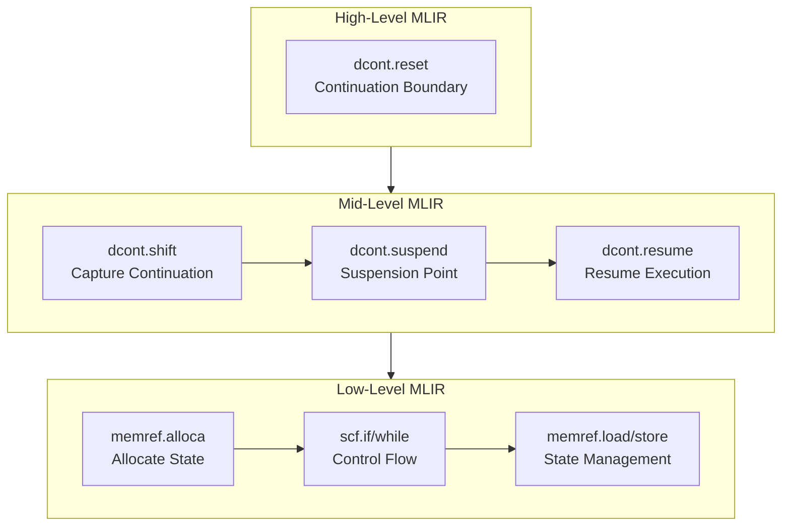

Clef's concurrency reads like the async, task, and actor models a .NET developer already knows, and compiles to something quite different underneath. The surface conventions carry over; what happens beneath them does not.

## The Iceberg Model: Familiar on the Surface, Different Underneath

Think of our Fidelity concurrency model as an iceberg. Above the waterline, it looks similar to what you already know:

```fsharp
// familiar to anyone coming from F#, the lineage Clef descends from
let processData = async {
    let! data = fetchDataAsync()
    let transformed = transform data
    do! saveResultAsync transformed
    return transformed
}
```

Beneath the surface, the design takes a different course. Instead of relying on the CLR's thread pool and garbage collector, our Fidelity framework is designed to compile async code directly to native machine code through the MLIR progressive lowering pipeline, preserving semantic structure at each transformation pass until it reaches LLVM and the target hardware.

This compilation approach shares philosophical ground with Rust's zero-cost async, which also compiles to state machines without runtime overhead. Both Rust and Fidelity reject the managed runtime model in favor of compile-time transformation. However, the two approaches start from different foundations and consequently solve different problems well. Rust's async builds on its ownership model, providing memory safety but requiring careful attention to lifetimes across await points. Fidelity's async builds on delimited continuations, making control flow structure explicit in the semantic graph. Neither approach is universally superior; they represent different design tradeoffs that continue to evolve as both ecosystems mature.

## Core Libraries in the Fidelity Framework

Our Fidelity framework includes several key libraries for concurrency, which we'll explore in a logical order:

1. **CCS Intrinsics**: Automatic static resolution of functions and types
2. **BAREWire**: Zero-copy memory protocol for efficient data handling
3. **Frosty**: Async library that replaces .NET's Task
4. **Olivier**: Actor model implementation with Erlang-inspired semantics
   - **Prospero**: Scheduling, orchestration and heap management via RAII
5. **Alex**: Transformation of Clef code to MLIR operations


## CCS Intrinsics: Automatic Static Resolution

Our CCS draws on principles from the fsil library for automatic inlining of select functions within .NET, and is designed to provide native static resolution of functions and types as compiler intrinsics:

```fsharp
// Regular Clef function that CCS automatically optimizes
let processData (items: 'T[]) =
    items |> Array.map transformItem |> Array.sum
// No explicit inline keyword needed

// Yet this compiles to the same efficient code as if you had written:
let inline processData (items: 'T[]) = ...
```

CCS is designed to analyze code during compilation and apply static resolution automatically. This gives you the performance benefits of manually inlined code without littering your codebase with `inline` keywords. As a building block for our Fidelity framework, its static resolution is meant to support efficient compilation across the other libraries.

## BAREWire: Efficient Memory Protocol

Our BAREWire is a high-performance protocol for memory management and cross-process communication:

```fsharp
// Define a BAREWire message schema
let messageSchema =
    BAREWire.schema {
        field "id" BAREWireType.Int64
        field "payload" BAREWireType.String
        field "timestamp" BAREWireType.Double
    }

// Send message across process boundaries
let sendMessage (target: ProcessId) (message: Message) =
    // Zero copy where possible
    BAREWire.sendMessage target messageSchema message
```

BAREWire is designed to use zero-copy operations when possible and efficient serialization when necessary, across process boundaries. This library forms the foundation for memory handling throughout our Fidelity framework.

### Solving the byref Problem

One pernicious issue in .NET's memory model is "the byref problem". In the CLR, byref pointers cannot escape the stack frame where they're created, and you can't store them in heap-allocated objects. This creates a significant limitation when working with performance-critical code that needs direct memory access.

BAREWire solves this with its type-safe memory model:

```fsharp
// Create a memory-mapped buffer with static lifetime
let buffer = BAREWire.createBuffer<float> 1024

// Get direct access to the buffer with type safety
let span = buffer.AsSpan()

// Work with the span directly without copying
for i = 0 to span.Length - 1 do
    span[i] <- float i * 2.0

// Share the buffer with another process
let sharedBuffer = buffer.Share(targetProcess)

// no copy; targetProcess gets direct access
BAREWire.sendBuffer targetProcess sharedBuffer
```

The design separates buffer lifetime from access permissions. Unlike the CLR where lifetime and access are tightly coupled through the garbage collector, BAREWire uses a capability-based model:

1. **Buffer Ownership**: Explicit lifetime management without GC intervention
2. **Buffer Capabilities**: Type-safe permissions that can be passed between components
3. **Memory Protection**: Hardware-enforced boundaries that prevent invalid access

This means multiple components are meant to access the same memory without copying, while the type-safe and hardware-enforced boundaries above keep memory access safe by construction. For .NET developers accustomed to constant serialization and defensive copying, the design targets a significant performance improvement.

Rust achieves similar zero-copy goals through its ownership model, and the comparison is instructive. Rust's approach verifies at compile time that references do not outlive their referents and that mutable access is exclusive. This works well within a single address space but requires careful design when crossing process boundaries; Rust IPC libraries typically serialize data or use unsafe blocks for shared memory. BAREWire's capability model takes a different approach: rather than tracking reference lifetimes, we track access permissions that can be explicitly transferred. Both approaches provide memory safety without garbage collection; they differ in what the type system tracks and how cross-boundary sharing is expressed.

## Frosty Async

Building on CCS intrinsics and BAREWire, our Frosty async library draws on lessons from [IcedTasks](https://github.com/TheAngryByrd/IcedTasks), an F# library created by Jimmy Byrd, reimplemented here without .NET Task dependencies for native compilation:

```fsharp
// Creating a cold task (doesn't start until someone subscribes)
let coldAsync = Frosty.startCold (fun () ->
    calculateSomething()
)

// Creating a hot task (starts immediately)
let hotAsync = Frosty.startHot (fun () ->
    calculateSomething()
)

// Composing tasks with a computation expression (looks like async!)
let combinedAsync = frosty {
    let! result1 = firstAsync
    let! result2 = secondAsync
    return result1 + result2
}
```

Through the CCS intrinsics described above, these computation expressions are designed to transform at compile time into continuation-passing style, then lower progressively to machine code for the target platform. The design carries no thread pool and no runtime overhead, leaving direct control flow that the hardware understands.

## Platform Configuration: Just Below the Waterline

For .NET developers accustomed to letting the runtime handle everything, our Fidelity framework offers a compromise. You dip your toes below the waterline with minimal configuration:

```fsharp
let platformConfig =
    PlatformConfig.Default
    |> PlatformConfig.withExecutionModel ExecutionModel.WorkStealing
    |> PlatformConfig.withMemoryStrategy MemoryStrategy.RegionBased

// Apply the configuration
Fidelity.configurePlatform platformConfig
```

This small step "into the waters beneath the semantic surface" gives you control over aspects of the computation graph that are normally hidden deep in the CLR's implementation. Want cooperative multitasking for embedded systems with limited resources? Or work-stealing schedulers for server applications that need to maximize throughput? Perhaps you need deterministic memory management for real-time systems? All of these become configurable options rather than fixed runtime behaviors.

This minimal configuration is the only visible difference from standard Clef development. By making a few explicit choices about execution and memory models, you reach capabilities that a traditional runtime environment does not expose, while keeping your application lightweight and the code close to an idiomatic experience.

Your core application logic stays unchanged regardless of the target platform. The same business logic is meant to run on an embedded device or a high-performance server, with only the platform configuration changing to match the environment's capabilities and constraints.

## Olivier: Actor System

Our Olivier is the actor model implementation in Fidelity, an Erlang-inspired message-passing concurrency system:

```fsharp
type CounterMessage =
    | Increment
    | Decrement
    | GetCount of AsyncReplyChannel<int>

module StandardActor =
    let createCounter() =
        MailboxProcessor.Start(fun inbox ->
            let rec loop count = async {
                let! msg = inbox.Receive()
                match msg with
                | Increment ->
                    return! loop (count + 1)
                | Decrement ->
                    return! loop (count - 1)
                | GetCount replyChannel ->
                    replyChannel.Reply count
                    return! loop count
            }
            loop 0
        )

    let counter = createCounter()
    counter.Post(Increment)
    let result = counter.PostAndReply(GetCount)

type CounterActorMessage =
    | Increment
    | Decrement
    | GetCount of IActorRef

type CountResponse = CountValue of int

module Fidelity =
    let createCounterBehavior() = actor {
        let mutable count = 0

        let rec loop() = async {
            let! msg = Actor.receive()

            match msg with
            | Increment ->
                count <- count + 1
                return! loop()

            | Decrement ->
                count <- count - 1
                return! loop()

            | GetCount replyTo ->
                replyTo <! CountValue count
                return! loop()
        }

        loop()
    }


    let system = Olivier.createSystem "counter-system"
    let counterActor = Olivier.spawn system "counter" createCounterBehavior

    counterActor <! Increment

    let requester = Olivier.spawn system "requester" (fun () -> actor {
        let replyPromise = Promise<int>()

        counterActor <! GetCount(Actor.self())

        let! CountValue value = Actor.receive()
        replyPromise.Complete(value)

        return replyPromise.Value
    })
```

Olivier draws its primary inspiration from the Erlang OTP framework for message-passing semantics and fault tolerance principles. The library covers actor-based concurrency, including our Prospero scheduler described next.

## Prospero: Scheduling Within Olivier

Our Prospero is the scheduling and orchestration library contained within Olivier, handling the actor lifecycle and distribution:

```fsharp
let system = Olivier.createSystem "my-system"

let schedulerConfig =
    SchedulerConfig.create()
    |> SchedulerConfig.withWorkerCount 4
    |> SchedulerConfig.withPriorities ["critical"; "normal"; "background"]

let configuredSystem = system |> Olivier.configureScheduler schedulerConfig

let clusterConfig =
    ClusterConfig.create()
    |> ClusterConfig.withSeedNodes ["akka.tcp://system@node1:2552"]
    |> ClusterConfig.withRoles ["worker"]

let distributedSystem = configuredSystem |> Olivier.withClustering clusterConfig

let userRegion =
    Olivier.Sharding.start distributedSystem "user"
        (fun id -> userActorFactory id)
        (fun msg -> extractEntityId msg)
        (fun id -> extractShardId id)
```

Prospero's primary role is scheduling and orchestration within the Olivier actor model. It manages message delivery, supervision hierarchies, and actor lifecycle events within the system, with cross-node transport carried over BAREWire. By extension of its role as actor supervisor, it also marshals the heap allocations for those actors through actor-scoped arenas, the discipline we develop in [RAII in Olivier and Prospero](/docs/design/memory/raii-in-olivier-and-prospero/). The Akka.NET-shaped clustering configuration above is a migration affordance for teams arriving from that ecosystem, not the native transport.

Here's a simplified example of how an async function might look in MLIR:



Each level gets closer to the metal, with more explicit control over memory and execution. This follows the nanopass philosophy of small, composable transformations that preserve semantic information while lowering abstraction step by step. At the lowest level, the design reaches a representation that maps directly to native code for the target platform, with the original program structure still intact for optimization.

## Alex: Where Clef Meets MLIR

Our Alex handles the transformation of Clef code into MLIR operations within the compilation pipeline.

```fsharp
// You never need to interact with this directly
// It's part of the compilation pipeline
let mlirTransform = mlir {
    // Clef async/task code gets transformed to MLIR operations
    // These are then lowered through MLIR dialects and ultimately to machine code
    yield MLIRPrimitives.dcont_reset
    yield MLIRPrimitives.dcont_shift
    yield MLIRPrimitives.control_flow
}
```

Consider how Clef represents function composition, pattern matching, and higher-order functions. These structures map naturally to MLIR's region-based operations and SSA (Static Single Assignment) form. For example, a Clef pattern match translates cleanly to MLIR's scf.if and scf.match operations, preserving both the logical structure and optimization opportunities.

Clef's computation expressions, the foundation of async workflows, correspond directly to MLIR's structured control flow. Computation expressions are *continuations in disguise*. When you write `let! x = expr in body`, the compiler transforms it into a `Bind` operation that threads the continuation through the computation. Alex is designed to build on this with **delimited continuations** via `shift` and `reset` operators, which create explicit continuation boundaries that correspond to SSA's basic block boundaries. The alignment is the same mathematical structure expressed directly at the semantic level.

Where the .NET compiler stops at creating state machines that still require runtime support, Alex is designed to use these delimited continuations to capture "the rest of the computation" at specific points, so that operations can suspend and resume without allocating Tasks or using thread pools. Each `shift` captures the continuation and each `reset` delimits its scope, and these map directly to MLIR's DCont dialect operations, preserving the control flow structure through to hardware-optimized instructions.

Rust's async transformation also produces state machines, and C++20 coroutines follow a similar pattern. The key difference lies in when control flow structure becomes explicit. In Rust and C++, async transformation occurs after type checking; the compiler must reconstruct control flow from imperative code. In Fidelity, delimited continuations make control flow explicit in the source semantics, which the compiler preserves through MLIR lowering. This is not a criticism of the Rust or C++ approaches, which work well within their design constraints. Rather, it illustrates how different starting points lead to different compilation strategies, with Fidelity's concurrent foundation enabling analysis that imperative foundations make more difficult.

This alignment between Clef and MLIR comes from independent work in programming language design that converged on the same principles. Developed separately, both rest on composition, immutability, and explicit data flow, the principles that lead to more optimizable code. When you write Clef code, you write in the same structure that optimizing compilers target. Alex is designed to connect the two, so that Clef code can bypass the runtime and lower directly toward the hardware.

## Clef Without the Runtime

Our Fidelity framework is designed to free Clef from the constraints of a managed runtime environment. The aim is to keep the expressive syntax Clef carries while changing what happens beneath the surface.

Under this design, Clef code is no longer bound by garbage collection pauses, thread pool configurations, or runtime overhead. Instead, the code flows through a progressive lowering pipeline, from computation expressions to continuations, through CCS intrinsics, BAREWire, Frosty, Olivier, and finally Alex, emerging as machine code tailored to the target hardware with semantic intent preserved at every step.

The intent is more than a performance change. The same Clef code meant to power server applications is designed to run directly on embedded devices. The actor model concepts you apply in distributed systems are meant to scale down to real-time applications. The memory safety the design depends on is structural, enforced without the overhead of a runtime or a monolithic garbage collector.

We are building our Fidelity framework because we want Clef to run across these environments without a heavy runtime in the way. That is the direction we will keep building toward as the rest of the framework comes into place, and as we continue the work on the design.
