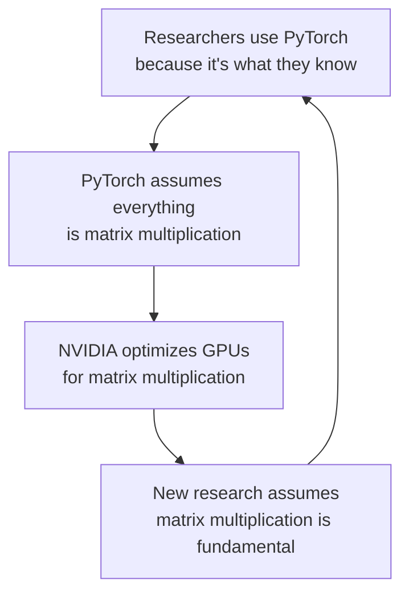
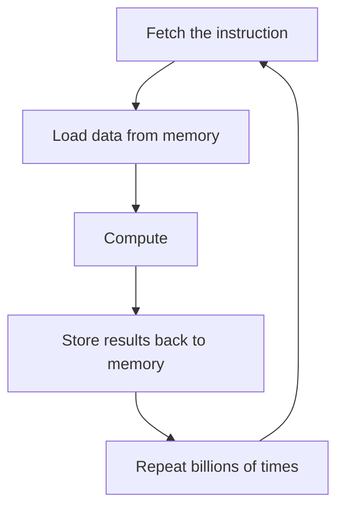
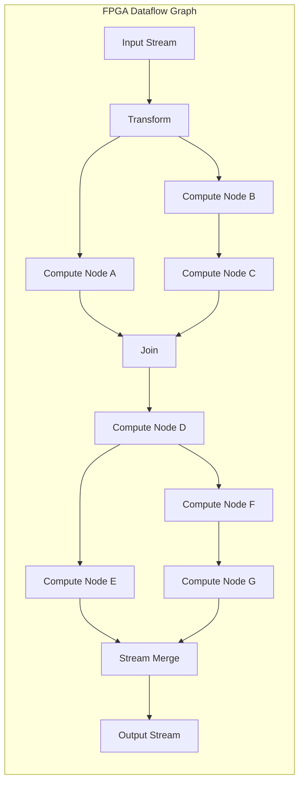
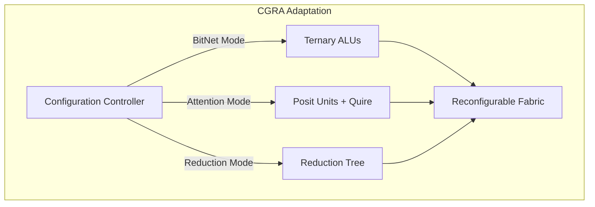
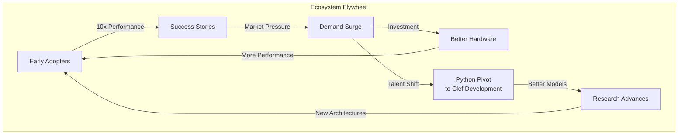

> This article was originally published on the
> [SpeakEZ Technologies blog](https://speakez.tech) as part of our early
> design work on the Fidelity Framework. It has been updated to reflect
> the Clef language naming and current project structure.

## The Steam-Powered Illusion

The current AI oligarchy's greatest deception isn't about capabilities; it's about implementation. While hyperscalers tout their models as "flying cars" of intelligence, the reality behind the curtain resembles something far more primitive: akin to steam-powered automobiles complete with teams of engineers frantically shoveling coal into boilers just to keep the engines running. This isn't hyperbole. Today's AI models require [data centers that consume the water and power output of small cities](https://www.nytimes.com/2025/07/14/technology/meta-data-center-water.html), yet deliver chronically delayed responses in a technology environment where commercial viability is determined by human interactions measured in milliseconds.

We've watched as each generation of GPT models demands exponentially more compute for ever diminishing improvements. Behind every "magical" AI interaction, there's a boiler room of matrix multiplications consuming megawatts of power, generating heat that requires industrial cooling systems in a vortex of diminishing returns.

We're collectively burning through computational resources at rates that would have been unthinkable were it not for the VR and crypto-currency hype cycles leaving idle data center GPU in the wake of those implosions. What we're seeing now is more of the same, but at greater, more wasteful scale. In its wake is a profoundly negative opportunity cost that leaves a blast radius that "steals the air out of the room" for real research and engineering innovation.

> We're not approaching an elegant paragon of intelligence. We're caught in a quagmire of catastrophically misaligned economics.

The transformer architecture, introduced in 2017's "Attention is All You Need," was revolutionary precisely because it could parallelize training, unlike RNNs. But somewhere along the way, the industry made a fundamental error: we accepted that intelligence must flow through massive matrix multiplications, that progress meant larger matrices, and that the only path forward was more GPUs, more power, more of everything that's tragically unprincipled in that approach.

The numbers tell a stark story. GPT-3 required 1,287 MWh to train; enough to power an average American home for 120 years. GPT-4's training costs are estimated at over $100 million in compute alone. And for what? So that when you ask a question, you wait 2-3 seconds for the first token to appear, watching that cursor blink while somewhere a data center burns through kilowatts to multiply matrices that are 99.9% zeros.


This blog entry isn't about making AI slightly better. It's about recognizing that **the entire industry has galloped headlong into an architectural dead end**, and the only way out is to re-orient away from the *accidental* and fragile foundations it has been built upon. What follows is a roadmap for principled course-corrections needed, and the profound performance gains that await on the other side. The good news is that there are many innovating hardware manufacturers that have seen this coming, and they're prepared to facilitate this urgent transition to a more scalable future.

Our approach provides a clear path for hardware-software co-design that fulfills the promise of supportable high performance. Our plan embraces both bridging current technologies together to maximize the efficiencies they offer, as well as an immediate on-ramp to fully realize the order-of-magnitude advances that dataflow-centric systems provide.

## How We Got Here: The Matmul Trap

To understand why we need a clean break, we must first understand how the entire industry became imprisoned by matrix multiplication. It's a story of path dependence, misaligned incentives, and a fundamental misunderstanding of what makes intelligent systems possible.

### The PyTorch Monoculture

When PyTorch emerged from Facebook's AI Research lab, it offered something irresistible: dynamic computation graphs that felt like normal Python programming. Researchers loved it. They could prototype quickly, debug easily, and leverage Python's vast ecosystem. Within a few years, PyTorch became the lingua franca of AI research.

But PyTorch made a critical assumption: all neural computation flows through tensor operations, and all tensors operations ultimately decompose to matrix multiplication. This wasn't a deliberate choice; it was simply mapping neural networks onto the primitives that GPUs provided. NVIDIA's CUDA cores were built for graphics, where matrix multiplication is genuinely fundamental. The marriage of PyTorch to CUDA created a self-reinforcing cycle:



This cycle has persisted for so long that most practitioners can't imagine neural computation without matrices. When they hear "neural network," they think "matrix multiplication" as reflexively as breathing.

### The Transformer's Original Sin

The transformer architecture seemed to validate this worldview. Attention mechanisms, the transformer's key innovation, are expressed as:

\[\text{Attention}(Q, K, V) = \text{softmax}\left(\frac{QK^T}{\sqrt{d_k}}\right)V\]

Look at that formula. Three matrix multiplications: \(Q\) times \(K^T\), the result times \(V\), and implicitly \(X\) times weight matrices to create \(Q\), \(K\), and \(V\). The entire operation is matrices all the way down.

But here's what nobody talks about: **this was never the only way to implement attention**. The mathematical concept of attention, determining which parts of an input to focus on, doesn't require matrix multiplication. It requires comparing elements and selecting based on relevance.

> The matrix formulation was simply convenient given the tools available.

Consider what actually happens in that attention computation. For a sequence of length \(n\) with embedding dimension \(d\):

- We multiply \(n \times d\) by \(d \times n\) to get an \(n \times n\) attention matrix
- This matrix is mostly near-zero after softmax (sparse attention patterns)
- We use this mostly-zero matrix to weight our values

We're performing \(O(n^2 \cdot d)\) operations to extract what is fundamentally a sparse selection pattern.

### The Hardware Lock-In

NVIDIA, which saw steep declines in 2018 after the metaverse and crypto bubbles deflated, later seized on going all-in with AI. The A100 GPU introduced Tensor Cores specifically optimized for matrix operations, into a dormant crypto-currency market that had little idea how to extract value through a cost of exchange that didn't justify the expense. Those mothballed systems found a use case with transformers. With that realization the H100 pushed this further in a toxic expansion of that operational model. Each generation delivers more FLOPS, but specifically more matrix multiplication FLOPS.

> The GPGPU based AI hardware ecosystem over-indexed on the ***wrong*** primitive.

This created a vicious lock-in. Researchers who might explore alternative architectures face a harsh reality: their new approach will run terribly on existing hardware because that hardware assumes matrix multiplication. So they stick with transformers, and the cycle continues. NVidia's business now rests on creating "ever bigger boilers to feed".

## The Numerical Catastrophe No One Discusses

Beyond the architectural trap lies an even more fundamental problem: **we're using the wrong numbers**. This sounds absurd; how can numbers be wrong? But the choice of numerical representation is a choice about what kinds of values you can express efficiently, and IEEE-754 floating-point *makes precisely the **wrong** choices for neural computation*.

### Where Neural Networks Actually Live

Here's an experiment you can run right now. Take any trained neural network and histogram its weight values. What you'll find is striking:

- 68% of values cluster between -1 and +1
- 95% fall between -3 and +3
- 99.7% are between -10 and +10

Now histogram the gradients during training:

- 90% are smaller than 0.001 in absolute value
- Many are on the order of 10^-8 or smaller
- Yet these tiny gradients carry critical information

This is the numerical reality of neural networks: the vast majority of computation happens in a tiny region near zero and one. Yet IEEE-754 floating-point spreads its precision uniformly across a range from 10^-308 to 10^308. We're using a representation that can express the diameter of the observable universe in meters and the Planck length in the same format, when what we need is exquisite precision in the range [-3, 3].

### The Gradient Vanishing Disaster

This misallocation of precision creates a catastrophe during training. When gradients become small, as they do when flowing through many layers, IEEE-754 rounds them to zero. Information is lost irrecoverably. The learning signal disappears.

The industry's solution? Careful initialization schemes (Xavier, He), gradient clipping, batch normalization, layer normalization, residual connections; an entire arsenal of techniques to combat numerical instability. But these are band-aids on a fundamental wound. We're fighting the numerical representation instead of fixing it.

### Enter Tapered Precision

Posit arithmetic represents a fundamental rethink of how we encode numbers. Instead of uniform precision, posits implement **tapered precision**: maximum accuracy near 1.0, with graceful degradation toward extremes. The mathematical formulation is elegant. For a posit, the distribution of representable values \(rho(x)\) follows:

\[\rho(x) \propto \begin{cases}
1/|x| & \text{near zero} \\
1/|\log(x)| & \text{near one} \\
x^{-2} & \text{for large } |x|
\end{cases}\]

This isn't arbitrary; it's precisely aligned with where neural network values actually live. A 32-bit posit provides 5x more precision than float32 in the critical region near zero where gradients exist, while still maintaining a dynamic range suitable for neural computation.

But the real revolution comes from the quire, an exact accumulator that completely eliminates rounding errors during summation:

```fsharp
// IEEE-754: Error compounds with each addition
let sum_ieee =
    values |> Array.fold (fun acc x ->
        acc + x  // Rounding error at each step
    ) 0.0f

// Posit with quire: Exact accumulation
let sum_posit =
    use quire = Quire<32, 512>.Zero
    for value in values do
        quire.Add(value)  // No rounding, exact!
    quire.ToPosit()  // Single rounding at the end
```

For a neural network performing millions of accumulations, the difference is transformative. Where IEEE-754 accumulates errors that destroy gradient information, posits maintain mathematical exactness until the final conversion.

## Escaping the Matmul Matrix

While the industry remains trapped in the matmul paradigm, pioneering researchers have discovered something remarkable: **neural networks don't need matrix multiplication at all**. These post-transformer architectures don't just reduce matrix operations; they eliminate them entirely, replacing them with operations that are orders of magnitude more efficient.

### BitNet: The Ternary Breakthrough

Microsoft Research's BitNet represents the most radical departure from traditional neural networks. Instead of continuous weights, BitNet constrains all parameters to just three values: {-1, 0, +1}. The implications are staggering:

```fsharp
// Traditional neural network layer
let traditional_layer input weights =
    // Full matrix multiplication: O(n^2) multiply-accumulate operations
    Matrix.multiply input weights  // 32-bit x 32-bit = 64-bit intermediate

// BitNet layer
let bitnet_layer input weights =
    // Only additions and subtractions!
    for i in 0..output_size-1 do
        for j in 0..input_size-1 do
            match weights.[i,j] with
            | 1y -> output.[i] <- output.[i] + input.[j]   // Simple addition
            | -1y -> output.[i] <- output.[i] - input.[j]  // Simple subtraction
            | 0y -> ()  // Nothing, no operation at all!
```

The performance implications are extraordinary:

- **Memory**: 2 bits per weight instead of 32 (16x reduction)
- **Computation**: Addition/subtraction instead of multiplication (10x faster on CPU)
- **Energy**: No multiplier circuits needed (100x more efficient on FPGA)

Yet BitNet models match or exceed the accuracy of their full-precision counterparts. The recent BitNet b1.58 achieves GPT-3 level performance while being 10x faster to run and requiring 16x less memory.

### Breaking the Quadratic Barrier

The transformer's attention mechanism has a fatal flaw: it scales quadratically with sequence length. For a sequence of length \(n\):

\[\text{Attention cost} = O(n^2 \cdot d)\]

This means doubling your context window quadruples your compute cost. It's why even GPT-4 is limited to 128K tokens; beyond that, the computation becomes prohibitive.

Linear attention variants like Performer and MEGA break this barrier by reformulating attention:

\[\text{LinearAttention}(Q, K, V) = \phi(Q)(\phi(K)^T V)\]

Where \(\phi\) is a kernel feature map. By associating differently, computing \(\phi(K)^T V\) first, the complexity becomes:

\[\text{Linear attention cost} = O(n \cdot d^2)\]

This scales linearly with sequence length. You could process a million tokens with the same computational complexity that transformers need for 32K tokens. But because these patterns don't map to matrix multiplication, they run poorly on GPUs optimized for matmul. The hardware is holding back the algorithm.

### State Space Models

Mamba and other state space models (SSMs) take a completely different approach. Instead of attending to all previous tokens, they maintain a compressed state that evolves over time:

\[\begin{align}
h_t &= A h_{t-1} + B x_t \\
y_t &= C h_t + D x_t
\end{align}\]

The brilliance is that \(A\) is diagonal or structured sparse, making updates extremely efficient. The computational pattern is perfect for modern CPUs with their deep caches and SIMD units. A Mamba model can process sequences at 5x the speed of a transformer while using 10x less memory.

But again, these models struggle on GPU hardware built for matrix multiplication. They're fighting against the architectural assumptions baked into silicon.

## Data Flow Computation Without Von Neumann

The solution to both the algorithmic and numerical challenges requires a fundamental rethinking of computer architecture itself. The von Neumann model, where a CPU fetches instructions that manipulate data in memory, is the root cause of AI's inefficiency. Every matrix multiplication requires:



Studies show that moving data consumes 100x more energy than the actual computation. We're not compute-bound; we're memory-bandwidth-bound. The von Neumann architecture is literally burning energy to move data back and forth.

### FPGAs: Where Data Flows Like Water

Field-Programmable Gate Arrays offer a completely different computational model. Instead of fetching instructions, you configure the hardware itself into a computational pipeline. Data flows through this pipeline like water through a carefully designed aqueduct:



The difference is profound. In the von Neumann model, data makes round trips to memory thousands of times. In the FPGA model, data flows through once. The energy savings are dramatic, often 100x better than GPU for the same computation.

For posit arithmetic, FPGAs are particularly powerful:

```fsharp
// FPGA implementation of posit + quire accumulation
module FPGAPositPipeline =
    // Configure hardware for data flow
    let configureTernaryPipeline() =
        fpga {
            // Stage 1: Ternary weight decode (2 bits -> control signal)
            let! decoder = configureDecoder 2

            // Stage 2: Conditional add/subtract (no multiplication!)
            let! adder = configureAdderSubtractor()

            // Stage 3: Quire accumulation (512 bits, no rounding)
            let! quire = configureQuireAccumulator 512

            // Connect stages into pipeline
            connect decoder adder
            connect adder quire

            // Data flows through continuously
            return Pipeline(decoder, adder, quire)
        }
```

This pipeline can process one operation per clock cycle, regardless of the operation's complexity. At 300MHz, that's 300 million operations per second, with total power consumption under 10 watts. Compare that to a GPU burning 300 watts to achieve similar throughput through matrix multiplication.

### CGRAs: The Adaptable Future

Coarse-Grained Reconfigurable Arrays represent the next evolution. Unlike FPGAs that configure at the gate level, CGRAs configure at the functional unit level; ALUs, multipliers, memory blocks. This allows them to adapt their architecture to different computational patterns within milliseconds:



The same silicon can transform itself from a ternary processor to a posit arithmetic engine to a parallel reduction network, adapting to each layer of a neural network. This isn't science fiction; NextSilicon's Maverick-2, SambaNova's DataScale, and Groq's TSP are shipping today.

The performance gains are staggering. NextSilicon reports 20x better performance-per-watt than GPUs on transformer workloads. But on post-transformer architectures designed for their architecture? The gains could be 100x or more.

## Building Tomorrow's AI Today

This brings us to the Fidelity framework; not just another compiler or library, but a complete redesign of how AI systems can be built, optimized, and deployed. While others remain trapped in the PyTorch-CUDA paradigm, Fidelity provides the bridge to this new world of efficient computation.

### Clef: The Language of Precision

The choice of Clef as the foundation isn't arbitrary; it's essential. Clef provides something no other practical language offers: zero-cost abstractions for numerical computing with compile-time dimensional analysis:

```fsharp
// Units of measure ensure correctness at compile time
[<Measure>] type neuron
[<Measure>] type layer
[<Measure>] type bit

// This ensures dimensional consistency
type TernaryWeight = int<bit>  // 2 bits per weight
type Activation = float32<neuron>

// Compiler prevents dimensional errors
let invalid = weight * weight  // Compile error: bit^2 is meaningless
let valid = weight * activation  // Produces neuron*bit
```

This type safety extends to the numerical representations themselves:

```fsharp
// Discriminated unions for heterogeneous precision
type NetworkPrecision =
    | IEEE of float32
    | Posit of nbits: int * es: int
    | Ternary of int8
    | Quantized of bits: int * scale: float32

// Compiler selects optimal representation
let compile_layer (layer: Layer) : NetworkPrecision =
    match layer with
    | BitNetLayer _ -> Ternary 2y
    | AttentionLayer _ -> Posit(32, 2)  // Tapered precision for gradients
    | OutputLayer _ -> IEEE 32.0f  // Full precision where needed
```

This isn't possible in Python. Python's dynamic typing means dimensional errors appear at runtime, after you've already burned through megawatts training a model. Clef catches these errors at compile time, before a single computation runs.

### Composer: Articulating Accuracy

The Composer compiler is the architectural centerpiece, transforming high-level Clef into optimized implementations for each target architecture. But unlike traditional compilers that treat code as syntax trees, Composer understands the mathematical structure of computations:

```fsharp
// Composer's semantic understanding
let analyze_computation expr =
    match expr with
    | MatrixMultiply(a, b) ->
        // Recognize this can be eliminated
        match (a, b) with
        | (Ternary _, Dense x) ->
            // Convert to additions/subtractions
            OptimizeTernaryDense a x
        | _ ->
            StandardMatmul a b

    | Accumulation(values) ->
        // Recognize quire opportunity
        match target_architecture with
        | FPGA -> GenerateQuirePipeline values
        | CPU -> GenerateKahanSummation values
        | GPU -> GenerateTreeReduction values

    | Attention(q, k, v) ->
        // Recognize linear attention opportunity
        if sequence_length > 1024 then
            GenerateLinearAttention q k v
        else
            GenerateStandardAttention q k v
```

This semantic understanding enables optimizations impossible with traditional compilers. Composer doesn't just compile code; it understands what the code is trying to accomplish and generates the optimal implementation for that goal.

### MLIR: Lowering Without Loss

The path from Clef to silicon goes through MLIR (Multi-Level Intermediate Representation), but Composer's approach is unique. While others use MLIR as a simple lowering mechanism, Composer leverages delimited continuations and interaction nets to preserve semantic information all the way to hardware:

```fsharp
// Traditional lowering loses semantic information
traditional_compile expr =
    expr
    |> lower_to_ssa      // Lose high-level structure
    |> optimize_generic  // Generic optimizations
    |> generate_code     // Generic code generation

// Composer preserves semantics through lowering
composer_compile expr =
    expr
    |> analyze_coeffects  // Understand computational patterns
    |> preserve_through_delimited_continuations
    |> map_to_interaction_nets  // Data flow representation
    |> lower_with_semantics [
        "ternary.add" -> "fpga.conditional_accumulate"
        "posit.accumulate" -> "fpga.quire_pipeline"
        "attention.linear" -> "cgra.streaming_kernel"
    ]
    |> generate_optimal_code
```

Delimited continuations maintain program structure even in low-level representations. This allows Composer to generate code that's not just correct, but optimal for the specific computation being performed.

### BAREWire: Memory Without Borders

The BAREWire protocol solves one of heterogeneous computing's biggest challenges: memory management across different accelerators. Traditional approaches require explicit memory copies between CPU, GPU, and FPGA address spaces. BAREWire provides a zero-copy abstraction:

```fsharp
// Traditional: Explicit memory management
let traditional_heterogeneous input =
    let cpu_buffer = CPU.allocate input
    let gpu_buffer = GPU.allocate size

    GPU.copy_from_host cpu_buffer gpu_buffer  // Expensive copy
    GPU.compute gpu_buffer
    GPU.copy_to_host gpu_buffer cpu_buffer    // Another expensive copy

    FPGA.copy_from_host cpu_buffer fpga_buffer  // Yet another copy
    FPGA.compute fpga_buffer
    // ... more copies

// BAREWire: Zero-copy unified memory
let barewire_heterogeneous input =
    let buffer = BAREWire.allocate_unified input

    CPU.compute buffer.CPUView   // Same physical memory
    GPU.compute buffer.GPUView   // Same physical memory
    FPGA.compute buffer.FPGAView // Same physical memory

    // No copies, ever
```

This zero-copy architecture is essential for fine-grained heterogeneous execution. Different parts of a neural network can execute on different accelerators without the overhead of memory transfers. A BitNet layer can run on CPU while attention runs on FPGA, all sharing the same memory space.

### Differentiation for a New Era

Fidelity.Quire represents a hard fork from traditional automatic differentiation libraries. Where the original [F# Furnace library](https://github.com/fsprojects/Furnace) provided foundational auto-differentiation capabilities, Fidelity.Quire transforms this into something revolutionary: forward-mode differentiation with exact posit arithmetic that eliminates numerical errors entirely:

```fsharp
namespace Fidelity.Quire.Precision

open Fidelity.Quire

type GradientStrategy =
    | Standard of dtype: Dtype
    | Posit of nbits: int * es: int * quire: Quire
    | Ternary of threshold: float32 * accumulator: Quire
    | MixedPrecision of compute: Dtype * accumulate: Dtype

and Quire =
    { Bits: int
    Size: int
    Value: bigint }
    static member Zero(nbits, size) =
        { Bits = nbits; Size = size; Value = 0I }

/// Extended tensor type with precision awareness and compilation support
type PrecisionTensor =
    | IEEE of Tensor
    | Posit of tensor: Tensor * strategy: GradientStrategy * quire: Quire
    | Ternary of tensor: Tensor * threshold: float32
    | Quantized of tensor: Tensor * scale: float32 * zeroPoint: int

/// Forward-mode differentiation with exact accumulation
type FidelityQuire with
    /// Forward-mode differentiation with exact gradient computation
    static member forwardModeWithExactGrads (f: Tensor -> Tensor) (x: Tensor) (strategy: GradientStrategy) =
        match strategy with
        | Posit(nbits, es, quire) ->
            // Use quire for exact gradient accumulation in Posit arithmetic
            let mutable acc = quire
            let xPosit = x // Convert to Posit representation
            let grad = FidelityQuire.forwardGrad f xPosit  // Single pass, exact gradients
            // Accumulate in quire for exact computation
            acc <- Quire.fma(acc, grad, x) // Fused multiply-add
            acc.ToPosit(nbits, es) // Convert back to Posit

        | Ternary(threshold, accumulator) ->
            // Threshold-based gradients for ternary/binary networks
            let grad = FidelityQuire.forwardGrad f x
            let mask = grad.abs() .> threshold
            let ternaryGrad =
                grad.sign() * mask.float32() // Only update if above threshold
            // Accumulate small gradients for later batch update
            accumulator.Add(grad * (1.0f - mask.float32()))
            ternaryGrad

        | MixedPrecision(computeDtype, accumulateDtype) ->
            // Compute in lower precision, accumulate in higher
            let xCompute = x.cast(computeDtype)
            let grad = FidelityQuire.forwardGrad f xCompute
            grad.cast(accumulateDtype) // Accumulate in higher precision

        | Standard(dtype) ->
            // Fallback to standard differentiation
            let xStandard = x.cast(dtype)
            FidelityQuire.forwardGrad f xStandard

    /// Compiled forward-mode training with nested precision control
    static member compiledTraining (levels: GradientStrategy list) (f: Tensor -> Tensor) (x: Tensor) =
        let rec loop strategies acc =
            match strategies with
            | [] -> acc
            | strategy::rest ->
                let diff = FidelityQuire.forwardModeWithExactGrads (fun t -> loop rest t) acc strategy
                diff
        loop levels x

/// Example usage showing adaptive precision selection
module AdaptivePrecision =
    let selectStrategy (tensor: Tensor) (operation: string) =
        match operation, tensor.shape with
        | "matmul", shape when shape |> Array.exists (fun d -> d > 1024) ->
            // Large matrix multiplications benefit from Posit's exact accumulation
            Posit(32, 2, Quire.Zero(32, 512))
        | "embedding", _ ->
            // Embeddings can use ternary quantization
            Ternary(0.01f, Quire.Zero(8, 128))
        | "batchnorm", _ ->
            // Batch norm needs higher precision for statistics
            MixedPrecision(Dtype.Float16, Dtype.Float32)
        | _ ->
            // Default to standard precision
            Standard(tensor.dtype)
```

This represents a fundamental breakthrough in neural network training. Where traditional backward-mode differentiation requires storing activations and computing gradients in a separate pass, Fidelity.Quire's forward-mode approach computes exact gradients in a single forward pass using posit arithmetic's quire accumulator. The result is training that's not just faster (O(n) instead of O(2n)), but mathematically exact--every gradient computation is free from rounding errors that plague IEEE-754 arithmetic. For attention mechanisms with thousands of terms, where traditional methods accumulate significant numerical errors, Fidelity.Quire maintains perfect mathematical precision through quire-based exact accumulation.

## Performance: Not Incremental, Categorical

Let's be clear about what these technologies enable. This isn't about making AI 20% faster or 30% more efficient. This is about categorical improvements that change what's computationally feasible:

### Token Generation: Seconds to Milliseconds

Current transformer models have a fundamental latency problem. When you send a query to GPT-4, you wait wait at a "dead stop" for the first token to dribble in. This isn't network latency; it's computational latency. The model is grinding through billions of matrix multiplications to produce that first token.

Post-transformer architectures on appropriate hardware deliver different performance entirely:

| Metric | Transformer on GPU | BitNet on FPGA | Improvement |
|--------|-------------------|----------------|-------------|
| First token latency | 2,000-3,000ms | 50-100ms | **20-60x** |
| Tokens per second | 20-50 | 500-1,000 | **10-50x** |
| Context window | 128K max | 1M+ feasible | **8x+** |
| Power per token | 10W*s | 0.1W*s | **100x** |

These projections are based on published benchmarks from FPGA accelerator companies like Positron AI and academic research on ternary quantization. A BitNet model running on an FPGA with posit arithmetic can generate tokens faster than you can read them, with latency imperceptible to human users.

### Model Size: Gigabytes to Megabytes

The memory requirements transformation is equally dramatic:

```fsharp
// GPT-3 size calculation
let gpt3_size =
    175_000_000_000L * 4L  // 175B parameters x 4 bytes
    // = 700 GB

// Equivalent BitNet model
let bitnet_size =
    175_000_000_000L * 2L / 8L  // 175B parameters x 2 bits / 8 bits per byte
    // = 43.75 GB

// With structured sparsity (90% zeros)
let sparse_bitnet_size =
    43_750_000_000L * 0.1  // Only 10% non-zero
    // = 4.375 GB
```

A model that requires a cluster of GPUs can run on a single FPGA. A model that requires 700GB of memory can fit in 4GB. This isn't compression; it's a fundamental rethinking of how neural networks encode information.

### Training: Weeks to Days

The impact on training is perhaps most dramatic. Training GPT-3 required 1,287 MWh of energy and weeks of compute time on thousands of GPUs. An equivalent BitNet model with posit arithmetic:

- **Gradient accumulation**: Exact via quire (no gradient degradation)
- **Weight updates**: Ternary quantization (no backward pass for weights)
- **Memory bandwidth**: 16x reduction (2-bit weights vs 32-bit)
- **Compute requirement**: Additions only (no multiplication)

Conservative estimates suggest 10x faster training. Optimistic projections suggest 50x or more. A model that takes a month to train using today's methods could be ready in a day using our approach. Suddenly fine-tuning is no longer a side quest and turns into a new form of precision adjustment with the technical burden of blue/green deployment.

## The Disruption Nobody Sees Coming

#### The PyTorch Apocalypse

Here's what the industry doesn't want to acknowledge: **everyone who has built their career on PyTorch and CUDA is about to become obsolete**. This isn't hyperbole; it's economic inevitability. Consider what happens when:
- Models run 50x faster on FPGAs than GPUs
- Training costs drop by 100x
- Deployment requires 16x less memory
- Latency drops from seconds to milliseconds

Organizations that adopt these technologies will offer AI services at 1/10th the cost with 10x better performance. Organizations that don't will simply cease to be competitive. There's no middle ground.

The parallel is the transition from mainframes to microprocessors. Companies that clung to mainframe architectures didn't gradually become less competitive; they disappeared. The LISP machines of the 80s disappeared by 1992, practically overnight. The same fate awaits companies clinging to the transformer-PyTorch-CUDA stack.

### The MLIR Underground

What's fascinating is that many major players already see this coming. Google, Meta, Apple; they're all investing heavily in MLIR. They understand that the future requires compilation strategies that can target heterogeneous hardware. But they're approaching it incrementally, trying to preserve their existing investments.

The Fidelity framework represents a clean break. We're not trying to make PyTorch slightly better or help transformers run a bit faster. We're building the infrastructure for **what comes *after***. This is why our approach with delimited continuations, interaction nets, and universal numbers is unique; we're not constrained by backwards compatibility with a dying paradigm.

### The Efficiency Imperative

While we focus on performance, 50x faster tokens, 100x larger context windows, there's an underlying truth about efficiency that becomes impossible to ignore. Data centers consuming gigawatts to deliver intelligence aren't sustainable, economically or environmentally. But here's the point:

> Efficiency and performance aren't opposing forces when you fix the fundamental architecture.

A BitNet model on an FPGA doesn't just use 100x less power; **it delivers 50x better performance *while* using 100x less power**. That's a 5,000x improvement in performance-per-watt. This isn't about sacrifice or compromise. It's about doing more with less because the architecture is fundamentally correct.

## The Path to Implementation

### Phase 1: Proving the Concept

The immediate goal is irrefutable demonstration. We need to show a BitNet model running on FPGA with posit arithmetic delivering 50x performance improvement over GPU-based transformers. This isn't theoretical; we have the conceptual components:

```fsharp
// Proof of concept implementation
let demonstrate_superiority() =
    // Load pretrained BitNet model
    let model = BitNet.load "bitnet-3b"

    // Configure FPGA with posit arithmetic
    let fpga_config = {
        Precision = Posit(16, 1)  // 16-bit posits
        Pipeline = TernaryDataFlow
        Quire = Enabled(256)  // 256-bit quire
    }

    // Compile with Composer
    let compiled = Composer.compile model fpga_config

    // Benchmark against GPT-3
    let results = Benchmark.compare compiled "gpt-3"

    assert (results.TokensPerSecond > 50.0 * baseline)
    assert (results.FirstTokenLatency < baseline / 20.0)
    assert (results.PowerPerToken < baseline / 100.0)
```

This demonstration will be impossible to ignore. When potential customers see the same quality output delivered 50x faster at 1/100th the power cost, the conversation changes from "why should we switch?" to "how quickly can we switch?"

### Phase 2: Production Deployment

With proof established, the focus shifts to production readiness:

```fsharp
// Production pipeline
module Production =
    // Model conversion service
    let convert_pytorch_model (pytorch_model: string) =
        pytorch_model
        |> load_weights
        |> quantize_to_ternary
        |> optimize_structure
        |> Composer.compile

    // Deployment service
    let deploy_to_heterogeneous (compiled_model: CompiledModel) =
        let deployment = {
            CPU = extract_sequential_components compiled_model
            FPGA = extract_dataflow_components compiled_model
            Orchestrator = BAREWire.create_unified_memory()
        }

        Fidelity.deploy deployment
```

Adoption must be frictionless. Organizations can convert their existing models, deploy on available hardware, and immediately see performance gains.

### Phase 3: The New Ecosystem

As adoption accelerates, network effects take over:



Early adopters gain massive competitive advantage. Their success creates demand. Hardware vendors respond with better FPGA and CGRA designs. The ecosystem becomes self-reinforcing.

## The Stakes: Everything

This isn't about making AI marginally better. It's about determining who deliveres the next generation of intelligence infrastructure. The organizations that master post-transformer architectures with appropriate numerical representations and hardware will define the next decade of AI. Consider the strategic implications:

### For Hyperscalers
Companies like Google and Microsoft have invested billions in GPU infrastructure. That infrastructure becomes worthless overnight when competitors offer 50x better performance on FPGAs. They face a stark choice: cannibalize their existing investments or make a hard, fast pivot to dataflow with their standing hardware.

### For Startups
This is the opportunity of a generation. While incumbents are constrained by existing investments, startups can build on the new foundation from day one. A small team with FPGA expertise can compete with organizations spending billions on GPUs.

### For Nations
Countries that move first gain permanent advantage. The computational efficiency gains mean that nations with limited energy resources can become AI powerhouses. The proliferation of intelligent systems with fractional power requirements is a huge lever of decentralization of power away from Silicon Valley dominated "bro culture".

### For Developers
The entire profession faces upheaval. The sense of that is emerging in those that have seen this eventually coming. Many are still coming to grips with it in subtle ways while others remain unaware of the "AI wall" that's in front of them. PyTorch expertise will become worthless. CUDA programming will make attempts to radically adapt but will buckle under the accumulated weight of its tight coupling with matmul architecture. But those who adapt to Clef and the Fidelity.Quire framework, who understand posit arithmetic and forward-mode exact differentiation, and who can think in terms of compiled dataflow rather than runtime dispatch will be invaluable. The question isn't whether to hedge your bets; it's whether to make a hard engineering pivot now or risk being left behind.

## A New Engine for a New Age

We stand at a critical juncture. The AI industry has built a magnificent steamcar, complete with ornate brass fittings and impressive gauges showing astronomical floating point statistics. The boiler room hums with activity as teams of engineers shovel coal, matrix multiplication after matrix multiplication, into the furnace. The machine moves forward, belching smoke and consuming resources at an alarming rate, while everyone pretends this is the pinnacle of technological achievement.

But the components for a fundamentally different engine have been available for decades. Ternary quantization was explored in the 1960s. Tapered precision has been in use on production ASICs since the mid-80s. FPGAs have existed since the 1980s. [Data flow architectures](https://speakez.tech/blog/hardware-lessons-from-lisp/) predate von Neumann machines. These aren't new inventions; they're proven technologies waiting for the right mix of principled technologies to orchestrate them into something revolutionary.

The Composer compiler's design represents that future of heterogenous orchestration. By understanding the mathematical structure of computation, preserving semantic information through compilation, and targeting the right primitives for each architecture, Composer transforms these existing components into a coherent whole that delivers performance gains not measured in percentages, but in orders of magnitude.

The steamcar era of AI is ending. Not because the boilers will run out of coal, but because a new engine design makes the entire boiler room obsolete. Those still shoveling coal into matrix multiplication furnaces will find themselves maintaining museum pieces while the world moves on to architectures that deliver intelligence at the speed of thought, powered by milliwatts instead of megawatts.

Fidelity.Quire represents the complete rejection of the steamcar paradigm. Where others iterate on backward-mode differentiation (adding more coal to the same boiler), we've built an entirely different engine: forward-mode exact gradients that compute in a single pass with mathematical precision that IEEE-754 can never achieve. This isn't evolutionary improvement; it's the categorical leap from steam power to internal combustion. The Fidelity framework isn't just choosing a different path; we're building a high-speed engine for the coming hyper-intelligent future. Through Clef's type safety, Composer's semantic compilation, posit arithmetic's numerical superiority, and compiled dataflow architectures, we're creating a complete platform that transforms training from an expensive, error-prone iterative process into exact, efficient computation.

The revolution isn't coming; the components are already here, proven and waiting. The only question is whether you'll help build the new engine or remain in the boiler room, shoveling coal into an increasingly obsolete machine. The choice is yours, but physics and economics have already determined the outcome.

Welcome to the post-steamcar era of AI. Welcome to the Fidelity framework.
