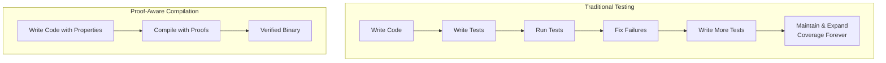
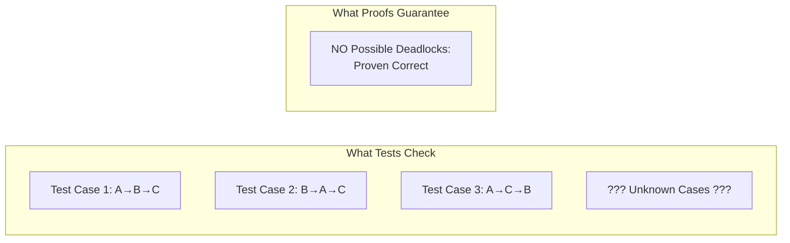

> This article was originally published on the
> [SpeakEZ Technologies blog](https://speakez.tech) as part of our early
> design work on the Fidelity Framework. It has been updated to reflect
> the Clef language naming and current project structure.

Every software engineering team knows the testing treadmill. Write code, write tests, run tests, fix failures, write more tests to catch what you missed, maintain those tests forever. We've accepted this as the calendar and staffing cost multiplication demanded by standard approaches to quality software. But what if this entire cycle represents a fundamental inefficiency; a workaround in the absence of something better? The Fidelity framework's [proof-aware compilation](/docs/design/proof-aware-compilation/) offers a well established garden path: mathematical certainty at compile time, eliminating entire categories of tests while actually ***increasing* safety**.

## The Testing Paradox

It's an uncomfortable truth woven into the fabric of the industry: despite writing more test code than ever, we're not achieving better software quality. Modern projects often can have multiple lines of test code for every line of application code. CI/CD pipelines run thousands of tests on every commit. Yet catastrophic production failures persist, security breaches continue, and that nervous feeling before major deployments never quite goes away.

The problem isn't that we're bad at testing. The problem is that testing has inherent limitations. As Dijkstra famously observed, tests can show the presence of bugs but never their absence. You can test a dozen inputs and the thirteenth might still fail. This isn't pessimism; it's mathematics.

Consider bounds checking on array access. How many test cases would you need to prove an index is always valid? You'd need to test every possible execution path, with every possible input, in every possible state. That's not just impractical; it's impossible. So we write a handful of test cases, hope we've covered the important scenarios, and ship code with our fingers crossed.



## Targeted Proofs Change Everything

Proof-aware compilation flips the entire model. Instead of checking whether code behaves correctly for specific inputs, we prove it behaves correctly for ALL inputs. This isn't a marginal improvement; it's a phase change in how we ensure software quality.

When you annotate a function with a proof obligation in Fidelity, you're not writing another test. You're establishing a mathematical property that the compiler will verify. If compilation succeeds, that property holds for every possible execution, not just the cases you remembered to test.

Take that array bounds example again. With proof annotations:

```fsharp
[<Requires("index >= 0 && index < array.Length")>]
[<Ensures("result = array.[index]")>]
let getElement array index = array.[index]
```

The compiler doesn't just check this; it PROVES it. Every call site must satisfy the precondition, either through explicit checks or through its own proofs. The result? Zero bounds-check exceptions in production, guaranteed. Not "we haven't seen any," but showing the work and bringing receipts.

## The Time and Money Equation

Let's talk about what this means for real development teams. Teams can spend 35-65% of their time on testing and troubleshooting. This includes writing and maintaining tests, debugging failures, and updating all of those artifacts when requirements change. That's essentially half your engineering payroll.

With proof-aware compilation, many of these tests (and the costs and headaches that come with them) simply disappear. Not because of being reckless, but because they're redundant. When the compiler proves memory safety, you don't need memory leak tests. When it proves bounds safety, you don't need bounds checking tests. When it proves state machine correctness, you don't need state transition tests.

But here's the real kicker: proofs don't rot. Tests require constant maintenance as code evolves. Change a function signature, update twenty tests. Refactor a module, fix fifty test dependencies. Proofs, on the other hand, compose and adapt. Change that function signature and the compiler automatically reverifies all dependent proofs. The safety net repairs itself.

## Actor Systems: Where Proofs Really Shine

The benefits multiply in concurrent systems like our Olivier actor framework. Testing concurrent behavior is notoriously difficult. Race conditions hide during testing and emerge in production. Message ordering issues appear only under specific timing conditions. Deadlocks lurk in state spaces too large to explore exhaustively.

Proofs handle concurrency naturally. When you prove absence of deadlock, you're not hoping your tests stressed the system enough; you're mathematically guaranteeing it can't happen.



## Heat Shielding for Production

Think of proofs as heat shielding for your production environment. Just as spacecraft heat shields protect against the extreme conditions of reentry, compile-time proofs protect against the extreme conditions of production: unexpected inputs, resource exhaustion and concurrency storms.

Traditional testing is like checking heat shield integrity by running blowtorches over sample tiles. You gain confidence, but you're only testing what you thought to test. Proof-aware compilation is like having the mathematical equations that guarantee the heat shield will perform correctly across all possible reentry scenarios.

The Fidelity framework's design plans to make this heat shielding practical and accessible. You won't need a PhD in formal methods. You won't need to write proofs in specialized languages. You annotate your Clef code with properties you care about, and the compiler does the heavy lifting. The proofs execute first in F* through a code-generation framework and then it travels through the compilation pipeline as hyperedges, guiding optimization while guaranteeing safety. It's a type of double-entry accounting for verifying the application you're building.

## The Optimization Bonus

Here's something remarkable: the same proofs that eliminate tests also enable better optimization. When the compiler knows certain properties hold, it can optimize aggressively within those boundaries. Bounds checks proven unnecessary? Eliminated. Error paths proven unreachable? Removed. Independence proven between operations? Parallelized automatically.

This creates a virtuous cycle. Stronger proofs enable better optimization, which produces faster code, which runs more efficiently in production. You're not trading safety for speed or speed for safety; you're getting both through mathematical certainty.

## Easing Into Proof-Aware Development

The transition from test-heavy to proof-aware development shouldn't require a big-bang rewrite. Start with critical paths; those functions where bugs would hurt most. Add proof annotations that capture essential properties. Let the compiler verify them. Watch as entire categories of tests become unnecessary.

In the future as your team gains confidence, expand proof coverage. The Fidelity framework's progressive approach will mean you will have options to mix mix modes between traditional tests and formal proofs, gradually shifting the balance as you see the benefits.

Most importantly, remember that proofs aren't just stronger than tests; they're often simpler. A one-line proof annotation can replace dozens of test cases. Mathematical certainty replaces lingering doubt.

## The Future is Solvable

We're entering an era where software complexity exceeds our collective ability to test comprehensively. AI systems, distributed architectures, heterogeneous hardware; these create state spaces beyond traditional testing's reach. The choice isn't between testing more or testing less; it's between continuing on the testing treadmill or stepping off into a world of mathematical certainty.

The Fidelity framework makes this transition practical. By embedding proofs in the compilation pipeline, by making them first-class citizens that guide optimization, by providing "free" verification through compile-time analysis, we're not just reducing test burden. We're fundamentally changing how we build reliable software.

Fewer tests doesn't mean less safety; it means greater safety through stronger guarantees. The heat shielding of narrowly scoped formal methods isn't just protection against failure; it's liberation from the endless cycle of treadmill testing. When your compiler becomes your theorem prover, every successful build is a mathematical proof of correctness. That's not just better than testing; it's better than we ever imagined testing ***could*** be.
