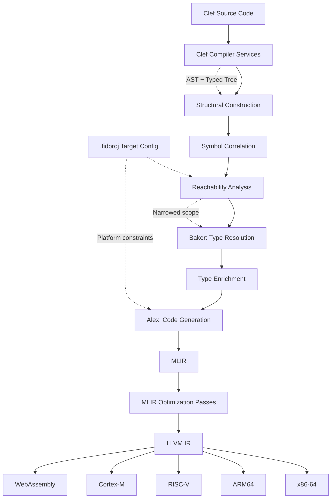

> This article was originally published on the
> [SpeakEZ Technologies blog](https://speakez.tech) as part of our early
> design work on the Fidelity Framework. It has been updated to reflect
> the Clef language naming and current project structure.

---

The computing world has fragmented into specialized ecosystems - embedded systems demand byte-level control, mobile platforms enforce strict resource constraints, while server applications require elasticity and parallelism. Traditionally, these environments have forced developers to choose between conflicting approaches: use a high-level language with garbage collection and accept the performance overhead, or drop down to systems programming with manual memory management and lose expressiveness. And of course the targets themselves have grown more sophisticated. Mobile devices now have sophisticated multi-processor architectures with multi-threading the norm. The future (or at least the *near* future) is in being able to directly address heterogenous architectures for a given device or solution.

## Beyond Runtime Boundaries

The Fidelity Framework represents a fundamental rethinking of this dichotomy. Built around the functional-first language Clef, it aims to create a compilation pipeline that generates truly native code across the entire computing spectrum while maintaining strong correctness guarantees. By leveraging a direct path from Clef Compiler Services (CCS) to MLIR, Fidelity adapts its implementation strategy to each target platform while preserving Clef's elegant programming model and the rich type information that makes Clef so powerful.

## Compilation Without Compromise

At its heart, Fidelity consists of a direct compilation pathway from Clef source code to native executables through the MLIR (Multi-Level Intermediate Representation) and, at least in early iterations, to the LLVM back end. Where Rust compiles directly to LLVM IR, Fidelity routes through MLIR to eventually access a broader range of targets: GPUs and AI accelerators, microcontrollers, FPGAs, CGRAs, and traditional CPUs. This approach shares philosophical similarities with Rust's compilation model, but with a focus on functional programming paradigms, stronger type-based guarantees, and hardware diversity, all while preserving F#'s coherent design-time ergonomics of "Python in a three piece suit".



### CCS Integration: Two Trees, One Truth

Clef Compiler Services produces two distinct representations: the *AST* (syntax tree capturing structural relationships) and the *typed tree* (FSharpExpr with fully resolved types). The Baker component correlates these representations into a unified Program Semantic Graph (PSG), preserving both structural and type information throughout compilation. This is an area that is undergoing some refinement, so we expect this architecture to develop as the nanopass infrastructure develops.

1. **Type-Preserving Pipeline**: The compilation process maintains complete native type information from source through to MLIR generation, enabling precise memory layout calculations and type-directed optimizations. This is the most significant departure from the *original* FCS, which produced .NET base class library (BCL) types. The PSG captures not just what code exists, but how types flow through the program.

2. **Deterministic Memory Transformation**: Analysis of PSG expressions enables Fidelity to control memory allocation strategies at compile time, from stack allocation to arena-based allocation to actor-scoped memory, converting closures to explicit parameters and mapping higher-order functions to efficient function pointers.

3. **Intelligent Dialect Selection**: Type information drives the selection of appropriate MLIR dialects - numeric operations map to the `arith` dialect, memory operations to `memref`, and control flow to either `scf` or `cf` based on structure. This is where XParsec in the "Alex" component of the Composer compiler plays a pivotal rols in transforming the pruned grap into lowered representations.

From the perspective of someone familiar with Rust conventions, this provides the control of manual memory management with the expressiveness of functional programming. For Python developers, imagine if your code could be transformed to run with deterministic memory management while maintaining Python's clarity.

## Correctness by Construction

The type system is where Fidelity aims to distinguish itself. By preserving the semantic nature of Clef's rich type information as native types throughout compilation, Fidelity extends the language's capabilities with:

### Static Dimensions via Type-Level Programming

Similar to how Rust encodes constraints in its type system, Fidelity uses F#'s unit of measure system to encode dimensions and constraints at the type level, with these constraints preserved through to native code:

```fsharp
// A vector with statically known dimension
type Vector<'T, [<Measure>] 'Dim>

// Matrix with statically known dimensions
type Matrix<'T, [<Measure>] 'Rows, [<Measure>] 'Cols>

// Range-constrained integer
type RangeInt<[<Measure>] 'Min, [<Measure>] 'Max>
```

Our design for a memory layout analyzer calculates precise layouts for these types, ensuring efficient memory access patterns in the generated code. For Python developers coming from NumPy, this means shape errors are caught at compile-time with zero runtime overhead.

### Advanced Memory Layout Analysis

The Composer compiler is designed to provide unprecedented control over memory layout through PSG analysis:

```fsharp
// Discriminated unions get optimal tagged layouts
type Shape =
    | Circle of radius: float
    | Rectangle of width: float * height: float
    | Triangle of base': float * height: float

// Compiler determines: 24-byte layout with 8-byte tag
// All variants share the same memory footprint
```

The Alex code generation component will work directly with enriched PSG types to calculate alignment requirements, padding, and optimal memory structures for all user-defined types.

## Memory Management: Static Analysis for Dynamic Adaptation

The nanopass architecture is designed to enable sophisticated memory management through compile-time analysis:

### Reachability Analysis

Operating on the Program Semantic Graph, Composer performs precise reachability analysis:

1. **Type-Aware Dead Code Elimination**: Eliminates unused type definitions, specializations, and unreachable pattern match cases
2. **Cross-Module Optimization**: Tracks dependencies across module boundaries for whole-program optimization
3. **Diagnostic Generation**: Produces detailed reports about eliminated code and optimization decisions

### Stack Frame Analysis

Our plans for Composer's static analyzer will calculate memory usage, enabling:
- Compile-time verification of stack bounds for embedded targets
- Automatic transformation to stack or arena allocations
- Stack usage visualization for debugging and optimizationallocations

For developers, this means smaller binaries with only the code actually needed, determined through precise compute graph analysis. Our zipper traversal with XParsec means accruate flattening of the compute graph into a focused layout with none of the extra baggage of assemblies.

## Familiar APIs, Native Performance

Central to the Fidelity developer experience is Alloy, a standard library designed to provide BCL-sympathetic APIs that compile to native code with deterministic memory management. Where .NET's Base Class Library relies on garbage collection and heap allocation, Alloy uses, among other things, *fat pointers*—structures that combine a raw pointer with length metadata—eliminating object headers and runtime overhead entirely.

```fsharp
open Alloy

let hello() =
    Console.Write "Enter your name: "
    let name = Console.ReadLine()
    Console.WriteLine $"Hello, {name}!"
```

This code looks identical to standard .NET F#, but compiles to direct system calls with stack-based string handling. The `Console.ReadLine()` returns a `NativeStr` (a 16-byte fat pointer), and the interpolated string formats into a stack buffer, with no garbage collector involvement, no heap allocations.

For .NET developers, this preserves the familiar mental model while enabling native compilation. For systems programmers, it provides high-level APIs without sacrificing control over memory layout and allocation strategy.

## From Source to Silicon

The Composer compiler implements a nanopass architecture: a series of small, focused transformation phases, each with explicit preconditions and postconditions. This structure enables rigorous reasoning about correctness at each stage.

### Structural Construction and Type Correlation
CCS like its predecessor provides both the syntax tree (AST) and typed tree. Baker correlates these into the Program Semantic Graph (PSG), where every node carries both structural context and resolved type information. This is the "compiler front end" that will see continuous refinement as the native architecture progresses.

### Reachability and Enrichment
Before expensive type operations, the compiler performs reachability analysis to narrow scope. For now, the "soft-delete" approach allows greater troubleshooting, marking unreachable nodes rather than removing them, preserving structural integrity for easier graph traveresal. Type enrichment phases then resolve statically resolved type parameters (SRTPs) and compute memory layouts. These operations would be prohibitively expensive on the full library graph. We may eventually take the more direct path of full pruning of unused portions of the graph, as again this is a subject for some research in future iterations as we grow more confident of the "zipper" traversal and full capture of the application and its dependencies.

### Code Generation
Alex (the "Library of Alexandria" code generation component) transforms the enriched PSG into MLIR, selecting appropriate dialects based on operation types:
- Numeric operations map to the `arith` dialect
- Memory operations to `memref`
- Control flow to `scf` or `cf` based on structure

### Native Output
MLIR optimization passes leverage preserved type information before lowering to backend targets. LLVM serves as the first and most diverse backend; its broad architecture support provides early validation of the upstream compiler mechanics while targeting everything from servers to microcontrollers. Other backends are on the roadmap, but LLVM offers immediate access to x86-64, ARM, RISC-V, and WebAssembly. By this point in the pipeline, discriminated unions have become tagged structs, pattern matches are branch tables, and fat pointers are simple `{ptr, i64}` pairs. The type information that guided every transformation has done its job and compiled away to nothing.

## Developer Experience: Understanding Your Code

The nanopass architecture provides visibility into the compilation process at every stage:

### Diagnostic Formats

Composer generates intermediate formats for debugging and analysis:

1. **Reachability reports**: Which symbols are included, which are eliminated, and why
2. **PSG visualizations**: The semantic graph structure before and after enrichment
3. **MLIR output**: Type-annotated MLIR with source mappings
4. **Memory layout reports**: Exact memory structure for types, including padding and alignment

### IDE Integration

The architecture enables rich IDE support:
- Hover information showing memory layouts
- Compile-time stack usage warnings
- Type-directed code completion
- Navigation through compilation stages

## Platform Configuration Through Type-Directed Compilation

The type-preserving pipeline is designed to enable sophisticated platform adaptation:

```fsharp
// Platform configuration drives compilation strategy
let embeddedConfig =
    PlatformConfig.compose
        [withPlatform PlatformType.Embedded;
         withMemoryModel MemoryModelType.Constrained;
         withStackLimit (Some 8192);  // 8KB stack limit
         withOptimizationGoal OptimizationGoalType.MinimizeSize]
        PlatformConfig.base'

// Compiler uses configuration to:
// - Verify all functions fit within stack limit
// - Select appropriate MLIR lowering strategies
// - Generate size-optimized code
```

## The Olivier Actor Model: Type and Memory-Safe Concurrency

With the enhanced type system, Olivier aims to provide stronger guarantees:

- Process isolation verified at compile time
- Message types checked across actor boundaries
- Zero-copy message passing where type analysis permits
- Static verification of supervision hierarchies

Olivier's memory model uses arena allocation with sentinel-based lifetime tracking, providing RAII semantics within actor boundaries. Each actor owns its memory arena, and resource cleanup is deterministic: when an actor terminates, its entire arena is reclaimed. This gives developers advanced memory management without the complexity of a borrow checker.

For developers who appreciate Erlang's reputation for building resilient distributed systems, Olivier brings compile-time verification to the actor model with robust supervision trees. For Rust developers seeking a clean async model and deterministic memory, it delivers on-the-metal resource management without the constant burden of borrow checker semantics.

## BAREWire: Schema-Driven Memory and Communication

Where Alloy provides the standard library and Olivier manages concurrency, BAREWire handles the challenge of data layout and exchange. Built on the BARE (Binary Application Record Encoding) protocol, BAREWire provides schema-driven memory mapping that enables zero-copy operations across process boundaries, network connections, and hardware interfaces.

Clef's type system can describe memory layouts with sufficient precision that serialization becomes a compile-time concern rather than a runtime operation:

```fsharp
open BAREWire

// Define a message schema using Clef types
[<BAREMessage>]
type SensorReading = {
    [<BAREField(0)>] Timestamp: uint64
    [<BAREField(1)>] Value: float32
    [<BAREField(2)>] SensorId: string
}

// The compiler generates exact memory layout
// No runtime reflection, no allocation overhead
let reading = { Timestamp = 1702483200UL; Value = 23.5f; SensorId = "temp-01" }
let buffer = BAREWire.encode reading  // Direct memory write
```

This approach aims to transform how Fidelity applications communicate. Inter-process communication could become zero-copy memory sharing. Network protocols would use the same schema definitions as in-memory structures. Hardware interfaces map directly to Clef types with guaranteed memory alignment.

For actors communicating across process or network boundaries, BAREWire aims to eliminate the serialization tax that typically dominates distributed system performance. A message encoded on one node could be decoded on another with nothing more than pointer arithmetic; the schema guarantees layout compatibility.

## Farscape: Bridging Native Libraries

The computing ecosystem contains decades of battle-tested C and C++ libraries, from cryptographic implementations to AI accelerators to database engines. Rewriting this code would be prohibitively expensive and discard accumulated expertise. Farscape provides a different path: automated generation of type-safe Clef bindings that preserve native performance while wrapping it in Clef's safety guarantees.

```fsharp
// Farscape-generated bindings bring type safety to native APIs
open Farscape.OpenSSL

// Units of measure prevent catastrophic parameter confusion
[<Measure>] type keyBytes
[<Measure>] type ivBytes

let encrypt (key: byte[]<keyBytes>) (iv: byte[]<ivBytes>) (plaintext: byte[]) =
    // Compile-time verification: key and IV sizes cannot be confused
    // The native OpenSSL call happens with full type safety
    AesGcm.encrypt key iv plaintext
```

Farscape leverages F#'s meta-programming capabilities, the same statically resolved type parameters (SRTPs) that power Alloy, to generate bindings that compile away to direct native calls. Units of measure catch parameter confusion at compile time. Memory ownership transfers cleanly between Clef and native code through BAREWire integration.

This opens a path for .NET developers to access the broader native ecosystem without sacrificing safety. AI accelerator SDKs, post-quantum cryptography implementations, high-performance database drivers: all could become accessible through type-safe Clef APIs that perform identically to hand-written C bindings.

## Verification: Types as Proofs

The preserved type information enables deeper F* integration, and this is where we believe the Fidelity Framework will have its most significant long-term impact. We have several patents pending in this area covering the intersection of type-preserving compilation, formal verification, and hardware targeting.

### Incremental Verification
1. Standard Clef code with rich types
2. Gradual addition of refinement types
3. Formal proofs about critical sections
4. Verification preserved through MLIR generation

The type-preserving pipeline is designed to ensure verification guarantees aren't lost during compilation; proofs established at the Clef level carry through to the generated native code.

### High-Performance and Security Applications

This verification capability positions Fidelity for two converging domains: high-performance computing and post-quantum security. For AI and HPC workloads, verified type information enables aggressive optimization while maintaining correctness guarantees across GPU, FPGA, and accelerator targets. For cryptographic applications, the same pipeline supports formal verification of post-quantum implementations, a requirement that will only grow more critical as quantum computing matures and the current "AI hype cycle" gives way to the deeper infrastructure challenges of cryptographic migration.

## A New Era of Native Clef Compilation

The Fidelity Framework represents a fundamental advance in functional language compilation. By preserving Clef's rich type system throughout the compilation pipeline, Composer aims to enable:

- Deterministic memory transformations guided by type analysis
- Precise memory layout calculation from type definitions
- Compile-time verification of resource constraints
- Type-directed optimization strategies

This isn't just about making Clef run natively; it's about demonstrating that functional languages could match and exceed the performance of systems programming languages while maintaining their expressiveness and safety guarantees. The goal is to preserve the accessible development experience that F# has cultivated over the years, while taking advantage of modern compiler optimization technologies to target a wider array of hardware than had previously been practical.

For developers, Fidelity offers a glimpse of what's possible when type information serves not just as a safety mechanism, but as the foundation for building high-performance systems with lower maintenance burden and fearless refactoring.

> The future of systems programming lies ***not*** in choosing between safety and performance, but in using one to achieve the other.

---

## Further Reading

This primer provides an overview of the Fidelity Framework. For detailed treatments of specific topics, see:

- [Baker: A Key Ingredient to Composer](/docs/design/baker-saturation-engine/) — The nanopass architecture, two-tree zipper pattern, and SRTP resolution
- [Building Composer with Alloy](/docs/design/building-compiler-with-alloy/) — The Alloy standard library, native types, fat pointers, and compilation examples from simple to complex
- [Intelligent Tree-Shaking](/docs/design/intelligent-tree-shaking/) — Semantic reachability analysis, soft-delete patterns, and library boundary classification
- [Clef Source-Based Package Management](/docs/design/clefpak-source-based-package-management/) — The `.fidproj` format, `cpk` package manager, and clefpak.dev registry
- [Unified Actor Architecture](https://speakez.tech/blog/unified-actor-architecture/) — Type-safe concurrency primitives and actor supervision hierarchies
- [RAII in Olivier and Prospero](https://speakez.tech/blog/raii-in-olivier-and-prospero/) — Actor-aware memory management through deterministic lifetimes and arena allocation
- [Getting the Signal with BAREWire](https://speakez.tech/blog/getting-the-signal-with-barewire/) — Zero-copy serialization, reactive signals, and cross-platform data exchange
- [The Farscape Bridge](https://speakez.tech/blog/the-farscape-bridge/) — Type-safe bindings for C/C++ libraries, AI accelerators, and post-quantum cryptography
