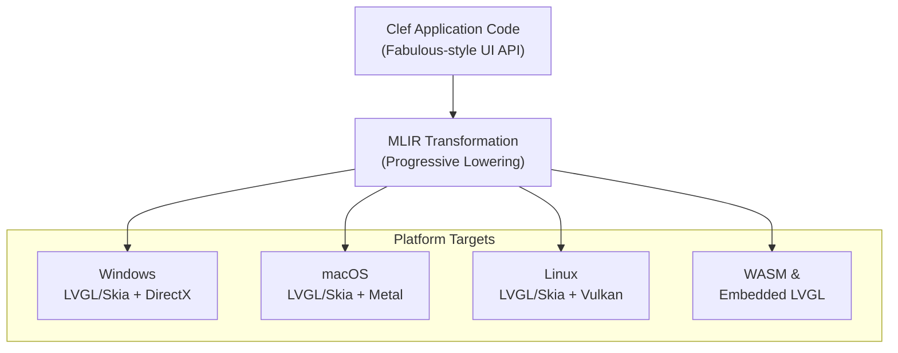

> This article was originally published on the
> [SpeakEZ Technologies blog](https://speakez.tech) as part of our early
> design work on the Fidelity Framework. It has been updated to reflect
> the Clef language naming and current project structure.

The Fidelity framework introduces an approach to building desktop applications with [the Clef language](https://clef-lang.com) that aims to enable developers to create native user interfaces across multiple platforms while preserving the elegance that makes Clef special. Drawing inspiration from the successful patterns established by Elmish and the MVU pattern--particularly within Avalonia--we take many lessons from [Fabulous](https://github.com/fabulous-dev/Fabulous). FidelityUI adapts these proven approaches for native compilation, with the goal of creating a framework that feels familiar to Clef developers while delivering strong performance through direct hardware access.

This document explores how the Fidelity framework approaches rich UI experiences by building upon the foundation laid by Fabulous, adapting its elegant patterns for deterministic memory management in a natively compiled world.

## Learning from Fabulous: A Functional Foundation

Before diving into FidelityUI's implementation, it's worth acknowledging the profound influence of the Windows Presentation Foudation and Avalonia on our design. Our long experience with WPF goes back to the advent of Silverlight, which had many implementation compromises but held some real promise in stuctured UI design that persist in many forms to this day. Fabulous, a functional extension of WPF, demonstrated that complex and capable user interface design doesn't require compromising on elegance or developer experience. Its widget-based architecture, sophisticated attribute system, and seamless MVU integration showed us a very clear path forward.

Where Fabulous operates within the managed .NET environment, FidelityUI aims to take these same patterns and compile them to native code with, in many cases, zero heap allocations. When heap *does* become involved it's within our actor system, referred to as Olivier and Prospero. But that extension is covered in another blog entry. This introduction isn't about how we extended Fabulous' ideas to new domains where managed runtimes aren't viable, from embedded applications to multi-node distributed systems.

## Platform Abstraction Architecture

Like Fabulous, FidelityUI employs a layered architecture designed to provide a unified programming interface. However, instead of targeting .NET UI frameworks, it would compile directly to native platform APIs through MLIR and LLVM:



Widget descriptions would exist only at compile time. The Composer compiler is designed to transform these descriptions into efficient native code, eliminating the runtime overhead while preserving the elegant programming model.

## The Widget Model: Fabulous Patterns, Native Performance

FidelityUI adopts Fabulous's widget model wholesale, recognizing it as the ideal abstraction for UI programming. However, our widgets would compile away entirely, leaving only efficient native code:

```fsharp
namespace FidelityUI

open Fabulous

module Widgets =
    /// Define a button widget using Fabulous-style attributes
    let Button =
        WidgetDefinitionStore.register "Button" (fun () ->
            // This compiles to direct LVGL calls
            { Name = "Button"
              CreateView = fun widget ->
                  let btn = LVGL.btn_create(parent)
                  // Attribute application happens at compile time
                  applyAttributes btn widget.Attributes
                  btn })

    /// Define a label widget
    let Label =
        WidgetDefinitionStore.register "Label" (fun () ->
            { Name = "Label"
              CreateView = fun widget ->
                  let label = LVGL.label_create(parent)
                  applyAttributes label widget.Attributes
                  label })
```

The beauty of this approach is that developers write the same declarative code they're familiar with from Fabulous, but it would compile to native code with deterministic memory management. There's no runtime widget tree--just direct calls to LVGL and platform APIs.

## Building UIs: Native MVU

Creating user interfaces in FidelityUI follows the Elmish pattern, making the transition seamless for Clef developers:

```fsharp
open FidelityUI

// Define the application model (Elmish style)
type Model =
    { Count: int
      Text: string
      Items: string list }

type Msg =
    | Increment
    | Decrement
    | TextChanged of string
    | AddItem
    | RemoveItem of int

// Create UI using Fabulous-style syntax
let view (model: Model) =
    Application(
        Window(
            "FidelityUI Demo",
            VStack(spacing = 16.) {
                // Simple label
                Label($"Count: {model.Count}")
                    .fontSize(24.)
                    .textColor(Color.Blue)

                // Button row
                HStack(spacing = 8.) {
                    Button("Increment", Increment)
                        .buttonStyle(ButtonStyle.Primary)

                    Button("Decrement", Decrement)
                        .buttonStyle(ButtonStyle.Secondary)
                }

                // Text input with two-way binding
                TextBox(model.Text, TextChanged)
                    .placeholder("Enter text here...")
                    .margin(Thickness(0., 16., 0., 0.))

                // List of items
                VStack() {
                    Label("Items:")
                        .fontWeight(FontWeight.Bold)

                    for i, item in List.indexed model.Items do
                        HStack() {
                            Label(item)
                                .horizontalOptions(LayoutOptions.FillAndExpand)

                            Button("Remove", RemoveItem i)
                                .buttonStyle(ButtonStyle.Destructive)
                        }
                }

                // Add item section
                if model.Text.Length > 0 then
                    Button("Add Item", AddItem)
                        .isEnabled(model.Text.Trim().Length > 0)
            }
        )
    )

// Update function (standard MVU/Elmish pattern)
let update msg model =
    match msg with
    | Increment ->
        { model with Count = model.Count + 1 }

    | Decrement ->
        { model with Count = model.Count - 1 }

    | TextChanged text ->
        { model with Text = text }

    | AddItem when model.Text.Trim().Length > 0 ->
        { model with
            Items = model.Items @ [model.Text]
            Text = "" }

    | RemoveItem index ->
        { model with
            Items = model.Items |> List.removeAt index }

    | _ -> model

// Initialize the application
let init () =
    { Count = 0
      Text = ""
      Items = ["First item"; "Second item"] }

// Run the application (Fabulous-style)
[<EntryPoint>]
let main args =
    Program.stateful init update view
    |> Program.run
```

This code looks identical to Fabulous because it is--at the API level. The magic happens during compilation, where Composer would transform these descriptions into efficient native code with deterministic memory management.

## Compile-Time Attribute System

FidelityUI adopts Fabulous's sophisticated attribute system, but with a crucial difference: attributes would be resolved entirely at compile time:

```fsharp

module Attributes =
    // Simple scalar attribute (fits in 64 bits)
    let fontSize =
        Attributes.defineFloat "fontSize" (fun size node ->
            // This becomes a direct LVGL call at compile time
            LVGL.obj_set_style_text_font_size node size 0)

    // Color attribute with proper encoding
    let textColor =
        Attributes.defineSimpleScalar<Color> "textColor"
            ScalarAttributeComparers.equalityCompare
            (fun color node ->
                let lvglColor = toLvglColor color
                LVGL.obj_set_style_text_color node lvglColor 0)

    // Event attribute (no allocation needed)
    let onClick =
        Attributes.defineEvent "onClick" (fun node ->
            // Composer transforms this to static function pointer
            LVGL.obj_add_event_cb node staticHandler LV_EVENT_CLICKED null)

// Extension methods for fluent API (compile away completely)
type Extensions =
    [<Extension>]
    static member inline fontSize(this: WidgetBuilder<'msg, #IText>, size) =
        this.AddScalar(Attributes.fontSize.WithValue(size))

    [<Extension>]
    static member inline textColor(this: WidgetBuilder<'msg, #IText>, color) =
        this.AddScalar(Attributes.textColor.WithValue(color))

    [<Extension>]
    static member inline onClick(this: WidgetBuilder<'msg, #IButton>, msg) =
        this.AddScalar(Attributes.onClick.WithValue(msg))
```

The attribute system provides the same type safety and composability as Fabulous, but Composer's compiler would transform these into direct native calls. There's no runtime attribute storage or reflection--just efficient, direct manipulation of native UI objects.

## Declarative and Efficient Layout

FidelityUI's layout system follows Fabulous's declarative approach while compiling to LVGL's efficient layout engine:

```fsharp
// Layout follows Fabulous patterns exactly
let view model =
    Grid(coldefs = [Star; Pixel 200.; Star], rowdefs = [Auto; Star; Pixel 50.]) {
        // Header spans all columns
        Label("My Application")
            .gridColumn(0)
            .gridColumnSpan(3)
            .fontSize(32.)
            .horizontalTextAlignment(TextAlignment.Center)

        // Navigation panel
        VStack() {
            Button("Home", NavigateTo Home)
            Button("Settings", NavigateTo Settings)
            Button("About", NavigateTo About)
        }
        .gridRow(1)
        .gridColumn(0)
        .padding(Thickness(8.))
        .backgroundColor(Color.LightGray)

        // Main content area
        ScrollView(
            VStack(spacing = 16.) {
                for item in model.Items do
                    Card(
                        HStack() {
                            Image(item.Thumbnail)
                                .width(64.)
                                .height(64.)

                            VStack(spacing = 4.) {
                                Label(item.Title)
                                    .fontSize(18.)
                                    .fontAttributes(FontAttributes.Bold)

                                Label(item.Description)
                                    .fontSize(14.)
                                    .textColor(Color.Gray)
                            }
                            .horizontalOptions(LayoutOptions.FillAndExpand)

                            Button("View", ViewItem item.Id)
                        }
                        .padding(Thickness(12.))
                    )
            }
        )
        .gridRow(1)
        .gridColumn(1)
        .gridColumnSpan(2)

        // Status bar
        Label($"Total items: {model.Items.Length}")
            .gridRow(2)
            .gridColumnSpan(3)
            .padding(Thickness(8., 4.))
            .backgroundColor(Color.DarkGray)
            .textColor(Color.White)
    }
```

This declarative layout would compile to efficient LVGL layout calls. The grid measurements, flexbox calculations, and constraint solving all happen through LVGL's native layout engine, but the developer experience remains purely declarative.

## LVGL: Native Widgets, Functional API

Where Fabulous wraps platform-specific controls, FidelityUI wraps LVGL widgets, providing access to a rich set of UI components through a functional API:

```fsharp
// LVGL-specific widgets with Fabulous-style API
module LvglWidgets =
    /// Chart widget for data visualization
    let Chart() =
        WidgetBuilder<'msg, IChart>(
            LvglChart.WidgetKey,
            LvglChart.Series.WithValue([])
        )

    /// Gauge widget for metrics
    let Gauge(value: float, min: float, max: float) =
        WidgetBuilder<'msg, IGauge>(
            LvglGauge.WidgetKey,
            LvglGauge.Value.WithValue(value),
            LvglGauge.Range.WithValue(min, max)
        )

    /// Calendar widget
    let Calendar(selectedDate: DateTime option) =
        let builder = WidgetBuilder<'msg, ICalendar>(LvglCalendar.WidgetKey)
        match selectedDate with
        | Some date -> builder.AddScalar(LvglCalendar.SelectedDate.WithValue(date))
        | None -> builder

// Using LVGL widgets in your UI
let view model =
    VStack(spacing = 16.) {
        Label("Dashboard")
            .fontSize(24.)

        // Data visualization with LVGL chart
        Chart()
            .series([
                { Name = "Temperature"; Data = model.TempData; Color = Color.Red }
                { Name = "Humidity"; Data = model.HumidityData; Color = Color.Blue }
            ])
            .height(200.)

        // Metrics display
        HStack(spacing = 16.) {
            Gauge(model.CpuUsage, 0., 100.)
                .title("CPU")
                .size(100., 100.)

            Gauge(model.MemoryUsage, 0., 100.)
                .title("Memory")
                .size(100., 100.)
        }

        // Date selection
        Calendar(Some model.SelectedDate)
            .onDateSelected(DateSelected)
    }
```

These LVGL widgets provide rich functionality while maintaining the same programming model. In our current UI model the Composer compiler is designed to ensure that all widget creation and configuration compiles to direct LVGL calls without runtime overhead. But when it comes time to build custom graphics, Skia is Fidelity framework's first port of call.

## Skia: Custom Rendering, Functional Style

For custom graphics, FidelityUI integrates Skia through a functional API that follows Fabulous patterns:

```fsharp
// Define a custom Skia canvas widget
let SkiaCanvas (draw: SkiaCanvas -> unit) =
    WidgetBuilder<'msg, ISkiaCanvas>(
        SkiaCanvas.WidgetKey,
        SkiaCanvas.DrawFunction.WithValue(draw)
    )

// Use Skia for custom visualization
let view model =
    VStack() {
        Label("Custom Graphics Demo")

        // Skia canvas with functional drawing
        SkiaCanvas(fun canvas ->
            // Clear background
            canvas.Clear(Color.White)

            // Create paint (stack allocated in compiled code)
            use paint = SkiaPaint()
            paint.Color <- Color.Blue
            paint.IsAntialias <- true
            paint.StrokeWidth <- 3.

            // Draw based on model data
            let centerX = canvas.Width / 2.
            let centerY = canvas.Height / 2.

            // Draw pie chart from model data
            let mutable startAngle = 0.
            for segment in model.ChartData do
                paint.Color <- segment.Color

                let sweepAngle = 360. * segment.Value / model.Total
                canvas.DrawArc(
                    RectF(centerX - 100., centerY - 100., 200., 200.),
                    startAngle,
                    sweepAngle,
                    true,
                    paint
                )

                startAngle <- startAngle + sweepAngle
        )
        .height(300.)
        .margin(Thickness(16.))
    }
```

The Skia integration maintains Fabulous's approach while providing direct access to Skia's powerful rendering capabilities. The draw function is called when needed, and all graphics operations would compile to direct Skia calls.

## Advanced Patterns: ViewRef and Memoization

FidelityUI supports advanced Fabulous patterns like ViewRef and memoization, adapted for native compilation:

```fsharp
// ViewRef for accessing native LVGL objects when needed
let view model =
    let chartRef = ViewRef<LvglChart>()

    VStack() {
        Chart()
            .reference(chartRef)
            .series(model.InitialData)

        Button("Update Chart", fun () ->
            // Direct access to LVGL object when needed
            match chartRef.TryValue with
            | Some chart ->
                // Direct LVGL manipulation for performance
                LVGL.chart_set_next_value(chart.Handle, 0, model.NewValue)
            | None -> ()
        )
    }

// Memoization for expensive view subtrees
let expensiveSubView =
    dependsOn model.ComplexData (fun model data ->
        VStack() {
            Label($"Processing {data.Items.Length} items...")

            // Expensive computation happens only when data changes
            let processed = processComplexData data

            for item in processed do
                ItemView(item)
        }
    )

let view model =
    VStack() {
        Label("Dashboard")

        // This only re-renders when ComplexData changes
        expensiveSubView

        // This updates independently
        Label($"Last update: {model.Timestamp}")
    }
```

These patterns provide the same benefits as in Fabulous--avoiding unnecessary recomputation and providing escape hatches for performance-critical scenarios--while compiling to efficient native code.

## MVU Integration: Pure and Predictable

The Model-View-Update pattern in FidelityUI follows Fabulous, providing the same predictable state management:

```fsharp

type Model =
    { Tasks: Task list
      Filter: TaskFilter
      SearchText: string }

type Msg =
    | AddTask of string
    | ToggleTask of Guid
    | DeleteTask of Guid
    | SetFilter of TaskFilter
    | Search of string

let init () =
    { Tasks = []
      Filter = All
      SearchText = "" }

let update msg model =
    match msg with
    | AddTask text when not (String.IsNullOrWhiteSpace text) ->
        let task = { Id = Guid.NewGuid(); Text = text; Completed = false }
        { model with Tasks = task :: model.Tasks }

    | ToggleTask id ->
        let tasks =
            model.Tasks
            |> List.map (fun t ->
                if t.Id = id then { t with Completed = not t.Completed } else t)
        { model with Tasks = tasks }

    | DeleteTask id ->
        { model with Tasks = model.Tasks |> List.filter (fun t -> t.Id <> id) }

    | SetFilter filter ->
        { model with Filter = filter }

    | Search text ->
        { model with SearchText = text }

    | _ -> model

let view model =
    let filteredTasks =
        model.Tasks
        |> List.filter (fun task ->
            match model.Filter with
            | All -> true
            | Active -> not task.Completed
            | Completed -> task.Completed)
        |> List.filter (fun task ->
            if String.IsNullOrWhiteSpace model.SearchText then true
            else task.Text.Contains(model.SearchText, StringComparison.OrdinalIgnoreCase))

    Application(
        Window(
            "Task Manager",
            VStack(spacing = 16.) {
                // Header
                Label("Tasks")
                    .fontSize(32.)
                    .horizontalOptions(LayoutOptions.Center)

                // Add task
                HStack(spacing = 8.) {
                    let textInput = ViewRef<TextBox>()

                    TextBox("", fun text -> ())
                        .reference(textInput)
                        .placeholder("Add a new task...")
                        .horizontalOptions(LayoutOptions.FillAndExpand)
                        .onCompleted(fun () ->
                            match textInput.TryValue with
                            | Some input ->
                                dispatch (AddTask input.Text)
                                input.Text <- ""
                            | None -> ())

                    Button("Add", fun () ->
                        match textInput.TryValue with
                        | Some input when input.Text.Length > 0 ->
                            dispatch (AddTask input.Text)
                            input.Text <- ""
                        | _ -> ())
                }

                // Filters
                HStack(spacing = 16.) {
                    RadioButton("All", model.Filter = All, fun () -> SetFilter All)
                    RadioButton("Active", model.Filter = Active, fun () -> SetFilter Active)
                    RadioButton("Completed", model.Filter = Completed, fun () -> SetFilter Completed)
                }

                // Search
                SearchBar(model.SearchText, Search)
                    .placeholder("Search tasks...")

                // Task list
                ScrollView(
                    VStack(spacing = 8.) {
                        if filteredTasks.IsEmpty then
                            Label("No tasks found")
                                .horizontalOptions(LayoutOptions.Center)
                                .textColor(Color.Gray)
                        else
                            for task in filteredTasks do
                                SwipeView(
                                    // Main content
                                    HStack(spacing = 12.) {
                                        CheckBox(task.Completed, fun _ -> ToggleTask task.Id)

                                        Label(task.Text)
                                            .horizontalOptions(LayoutOptions.FillAndExpand)
                                            .textDecorations(
                                                if task.Completed then
                                                    TextDecorations.Strikethrough
                                                else
                                                    TextDecorations.None)
                                            .textColor(
                                                if task.Completed then
                                                    Color.Gray
                                                else
                                                    Color.Default)
                                    }
                                    .padding(Thickness(12., 8.))
                                    .backgroundColor(Color.White)

                                    // Swipe actions
                                    swipeItems = [
                                        SwipeItem(
                                            "Delete",
                                            fun () -> DeleteTask task.Id,
                                            backgroundColor = Color.Red,
                                            foregroundColor = Color.White
                                        )
                                    ]
                                )
                                .shadow(Shadow(Color.Black.WithAlpha(0.1), Offset(0., 2.), 4.))
                    }
                )
                .verticalOptions(LayoutOptions.FillAndExpand)

                // Summary
                Label($"{filteredTasks.Length} tasks shown")
                    .horizontalOptions(LayoutOptions.Center)
                    .fontSize(12.)
                    .textColor(Color.Gray)
            }
            .padding(Thickness(16.))
        )
    )


[<EntryPoint>]
let main args =
    Program.statefulWithCmd init update view
    |> Program.withConsoleTrace
    |> Program.run
```

The MVU pattern provides the same benefits in FidelityUI as in Fabulous: predictable state management, easy testing, and clear separation of concerns. The difference is that it would all compile to native code with deterministic memory management.

## Performance: Deterministic Memory by Design

Unlike Fabulous, which operates within the .NET runtime, FidelityUI is designed to compile to native code with compile-time controlled memory allocation. This would be achieved through several techniques:

```fsharp
// Compile-time widget transformation
let view model =
    VStack() {
        // This widget description exists only at compile time
        Label($"Count: {model.Count}")

        // Event handlers become static function pointers
        Button("Increment", Increment)
    }

// Compiles to something like:
let createView model dispatch =
    let container = LVGL.obj_create(parent)
    LVGL.obj_set_layout(container, LV_LAYOUT_FLEX)

    let label = LVGL.label_create(container)
    LVGL.label_set_text_fmt(label, "Count: %d", model.Count)

    let button = LVGL.btn_create(container)
    let btnLabel = LVGL.label_create(button)
    LVGL.label_set_text(btnLabel, "Increment")

    // Static handler, no closure allocation
    LVGL.obj_add_event_cb(button, incrementHandler, LV_EVENT_CLICKED, dispatch)
```

This transformation would happen entirely at compile time. The declarative code developers write becomes efficient imperative code with deterministic memory management.

## Testing: Functional and Predictable

Because FidelityUI follows Fabulous patterns, testing is straightforward and predictable:

```fsharp
open Expecto
open FidelityUI.TestHelpers

[<Tests>]
let tests =
    testList "Task Manager Tests" [
        test "Adding a task increases the count" {
            let initial = init()
            let updated = update (AddTask "New task") initial

            Expect.equal updated.Tasks.Length 1 "Should have one task"
            Expect.equal updated.Tasks.Head.Text "New task" "Task text should match"
        }

        test "Toggle task changes completed state" {
            let model = { init() with Tasks = [testTask] }
            let updated = update (ToggleTask testTask.Id) model

            let task = updated.Tasks.Head
            Expect.equal task.Completed true "Task should be completed"
        }

        testProperty "Filter shows correct tasks" <| fun (tasks: Task list) (filter: TaskFilter) ->
            let model = { init() with Tasks = tasks; Filter = filter }
            let view = view model

            // Extract visible tasks from view
            let visibleTasks = extractVisibleTasks view

            // Verify filter logic
            match filter with
            | All ->
                Expect.equal visibleTasks.Length tasks.Length "All tasks should be visible"
            | Active ->
                let activeTasks = tasks |> List.filter (not << _.Completed)
                Expect.equal visibleTasks.Length activeTasks.Length "Only active tasks visible"
            | Completed ->
                let completedTasks = tasks |> List.filter _.Completed
                Expect.equal visibleTasks.Length completedTasks.Length "Only completed tasks visible"
    ]
```

The nature of the UI description makes it easy to test both the business logic and the UI structure without needing to run the actual application. This is one of the keys to robust application development that is available to programming languages with strong type systems. Even though Fidelity framework aims to be "close to the metal" it seeks to retain all of the benefits of a high-level language for type safety and deterministic execution that yields highly reliable applications.

## Migration Path from Fabulous

For teams already using Fabulous, migrating to FidelityUI should be straightforward because the APIs are intentionally similar:

```fsharp
// Fabulous code
let view model dispatch =
    View.ContentPage(
        title = "My App",
        content = View.StackLayout(
            children = [
                View.Label(text = $"Count: {model.Count}")
                View.Button(
                    text = "Increment",
                    command = fun () -> dispatch Increment)
            ]
        )
    )

// FidelityUI code - almost identical
let view model =
    ContentPage(
        "My App",
        VStack() {
            Label($"Count: {model.Count}")
            Button("Increment", Increment)
        }
    )
```

The main differences are:
1. More concise syntax thanks to Clef's evolution
2. No dispatch parameter (handled by Program.run)
3. Computation expressions for collections

The core concepts, patterns, and mental model remain the same, making migration a matter of syntax translation rather than architectural changes.

## Conclusion

FidelityUI demonstrates that the elegant patterns established by Fabulous could extend beyond managed runtimes to native compilation. By maintaining API compatibility while transforming to native code with deterministic memory management, it aims to provide a path for Clef UI development that spans from embedded devices to high-performance desktop applications.

The framework stands on the shoulders of giants, taking the proven patterns from Fabulous and adapting them for a new compilation model. Developers write the same declarative code they love, while the Composer compiler is designed to ensure it runs with native performance.

Whether building simple utilities or complex productivity tools, FidelityUI aims to provide the same elegant development experience as Fabulous, with the added benefits of native compilation, deterministic memory management, and direct hardware access. It's not about replacing Fabulous--it's about extending the reach of Clef UI programming to domains where managed runtimes aren't viable.

By combining Fabulous's proven patterns with Fidelity's native compilation, we're working toward a future where Clef developers could target any platform with the same elegant code--from tiny embedded devices to powerful workstations--without compromising on either developer experience or runtime performance.
