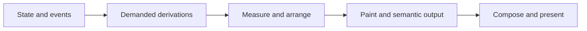

Imagine building an instrument panel with a live chart and an editable alarm threshold. The chart changes constantly, while the threshold field needs to preserve what the operator is typing. We want to author those components in the same functional style for a native display and a browser. Each target would realize the interface through its own layout and rendering machinery.

That is the direction of our Fidelity.UI design. Clef's intrinsic incremental computation provides the reactive foundation. We are developing a native reactive-area engine, with WREN as the browser/WebView counterpart. HelloWayland and WrenHello give us experimental hosts in which to test the [shared UI semantics]().

## Functional Components

Ordinary functions and lists are the preferred authoring surface. Typed properties and modifiers let us compose controls without surrounding a small view with much machinery. In proposed design notation, a counter would look like this:

```fsharp
let counter =
    Ui.component (fun () ->
        let count = Signal.create 0

        Ui.column [
            Ui.button [
                on.activate (fun _ ->
                    Signal.update count (fun n -> n + 1))
                Ui.text "Count"
            ]
            Ui.output count
        ])
```

The component factory would defer setup until activation, giving the local state an owned identity. `Ui.output` receives the reactive source. Formatting an eagerly read integer into a plain string would produce a snapshot instead. The button expresses an action that its target can expose through keyboard or pointer input, including touch.

Fabulous informs our typed functional composition. LVGL offers a useful vocabulary of widgets with parts and states, together with styles and events. From Solid we can study reusable function components and selective bindings. We want those lessons in an authoring model with Fidelity's own activation and ownership rules.

Computation expressions could offer another notation, especially where scoped resources or dependent computations become easier to read. Both forms would preserve the same identity and lifetime semantics. Execution placement is a separate choice, so concurrent sections should remain expressible through either surface.

## Owned Demand

A view description is cold. We defer live controls and subscriptions until an owner admits them. That owner might be a visible view, a background observer or a scoped prewarming operation.

For our instrument panel, a service could keep consuming samples while the chart is closed. Reopening would attach the chart to current data. Retaining only a cache would save storage contents without keeping them current. These policies trade first-use latency against ongoing work and memory, as described in our [native reactivity model]().

`Effect.create` activates an effect, so a cold component delays that call until admission. Setup occurs once per activated identity. Subsequent redraws preserve that state, and attaching a presentation to an already active component reuses its existing owner.

## Native Reactive Areas

A native reactive area would retain visual identity and interaction state in an owned scope. Changes invalidate the stages that depend on them:


```mermaid
flowchart LR
    Input[State and events] --> Derived[Demanded derivations]
    Derived --> Layout[Measure and arrange]
    Layout --> Paint[Paint and semantic output]
    Paint --> Present[Compose and present]
```

Changing the alarm label could alter its measured width and parent layout. Changing its color may only require painting. Moving or removing the label also damages its previous bounds, with overlap and clipping affecting the repair. Partial redraw therefore needs spatial reasoning alongside dependency tracking.

Our baseline is one owner-local graph driving several areas, with shared rendering resources where appropriate. Pure preparation could move to workers. Before publication, a result must match the current owner generation and relevant input revisions. Buffer reuse waits for outstanding workers and display consumers to release it.

Signals expose current values, while messages carry occurrences. Coherent local stabilization requires dependency ordering. Across larger execution domains, we need explicit delivery and publication rules, developed further in [application scaling]().

## Control Behavior

The alarm threshold field needs to preserve raw text while the operator edits it. Parsing can temporarily fail without overwriting the last accepted domain value. Validation and commit behavior belong to the field controller, whose identity should survive a change in presentation.

Ripple.Form offers useful research into reusable behavior and replaceable markup. Its rendering contract includes DOM types. For Fidelity, we need a boundary that both native and browser presentations can implement, including focus and accessible naming. Error exposure and read-only behavior also need equivalent meaning on both targets.

Lists add an identity problem. Reordering rows should preserve each editor, while replacing a record under the same key should update its payload. Removal retires the row's scope. A delayed validation result must be checked against that retired identity before publication, and repeated edits must reclaim obsolete metadata as well as subscriptions.

## Target Profiles

Shared control semantics leave room for target capabilities. The browser owns DOM layout and painting. Native areas manage a retained rendering pipeline. Applications can request HTML/CSS features or device integrations explicitly, without treating native damage rectangles as browser repaint guarantees.

Motion belongs in the component vocabulary too. Fades and easing introduce clock demand, with rules for retargeting and cancellation. Our intended STM32H7 instrument profile omits decorative motion. Larger panel and desktop profiles could admit selected transitions after measurement. Either way, the operator still receives the final state and essential feedback.

Custom native drawing also makes us responsible for editing and input behavior, including IME and focus. Accessibility needs a semantic representation alongside the pixels. Embedded profiles require bounded retained state and work queues, with display buffers sized for the device. JavaScript uses host-managed storage while preserving explicit logical cleanup.

The threshold editor and chart make a useful first joint experiment. We can type an incomplete number while live samples resize overlapping content, then compare partial redraw with a full redraw reference. Running the same authored components in the browser would let us check that editing and lifetime behavior agree even though the two targets paint through different systems.
