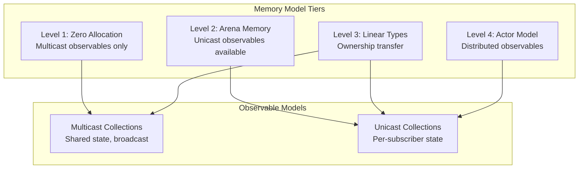

> This article was originally published on the
> [SpeakEZ Technologies blog](https://speakez.tech) as part of our early
> design work on the Fidelity Framework. It has been updated to reflect
> the Clef language naming and current project structure.

The integration of reactive programming into the Fidelity framework presents a fascinating challenge at the intersection of practical engineering and algorithmic integrity. While exploring various reactive models, we discovered valuable insights from [Ken Okabe's Timeline library](https://github.com/ken-okabe/timeline) - a minimalist F# implementation that demonstrated how powerful reactive systems could be built with remarkably little code. This simplicity was a key inspiration for Fidelity.Rx, though we've evolved the concepts to align with Fidelity's unique architectural requirements.

The driver for Fidelity.Rx is that reactive programming patterns represent a distinct form of codata, one where the observation method involves registration of callbacks rather than explicit pulling. This mathematical foundation would enable the Composer compiler to apply [the same sophisticated analysis techniques](/blog/coeffects-and-codata-in-firefly/) to reactive code that it uses for async operations, while maintaining the transparency and efficiency that define the Fidelity framework.

### Architectural Update: The Signal-Actor Isomorphism

Since this entry was originally published, work on [Fidelity.UI](/blog/fidelity-ui/) revealed a deeper structural truth: **signals and actors are the same abstraction**. A signal that notifies its subscribers when it changes is an actor that sends messages to its dependents. The dependency graph is the message routing topology. Batching is mailbox coalescing.

This isomorphism resolved the question of whether Fidelity.Rx should exist as a separate library. The answer, informed by the [Alloy precedent](/blog/alloy-absorbed/), is that the concepts described here are real and valuable, but they decompose naturally into layers that already exist:

| Fidelity.Rx Concept | Architectural Home |
|---------------------|-------------------|
| Multicast observables | **Fidelity.UI** signal primitives (`createSignal` - actor with subscriber set, broadcast to all) |
| Unicast observables | **Fidelity.UI** resource primitives (`createResource` - per-subscriber isolated state, arena-backed) |
| Coeffect composition | **Composer** compiler passes (codata analysis applied to reactive code) |
| Memory model gradient | **Fidelity.Platform** arena management (zero-alloc through actor-based) |
| Push-based codata model | **Prospero/Olivier** actor substrate (actors are inherently push-based) |

The design thinking in this entry remains sound - particularly the push/pull duality, the multicast/unicast distinction, and the transparency principles. What changed is the realization that these don't require a dedicated reactive library. The actor model *is* the reactive model. Fidelity.UI's signal primitives provide the developer-facing API, Prospero/Olivier provides the runtime substrate, and Composer provides the compiler optimizations. The concepts land in their natural homes rather than being collected into an intermediate abstraction.

What follows is the original design exploration, preserved because the analysis of push-based codata and the multicast/unicast distinction directly informed the signal-actor architecture that emerged.

## Implementation Choices: The Multicast/Unicast Distinction

Within the push-based model, a secondary but important distinction emerges: how do we handle multiple subscribers? This isn't about push vs pull - both multicast and unicast are push-based. It's about whether subscribers share execution or get isolated processing.

### Multicast Observables: Shared Push

Multicast observables implement push-based codata with shared state among all subscribers:

```fsharp
// Multicast: One execution, many observers
type MulticastObservable<'T> = {
    mutable Last: 'T
    mutable Observers: array<'T -> unit>  
    mutable Count: int
}

let temperatureSensor = Multicast.create 25.0
temperatureSensor |> Multicast.subscribe updateDisplay      
temperatureSensor |> Multicast.subscribe checkThreshold     
temperatureSensor |> Multicast.subscribe logToFlash        

// Single push, broadcast to all
temperatureSensor |> Multicast.next 26.5  // All three observers notified
```

This model perfectly aligns with zero-allocation requirements. The constraint becomes a feature: multicast observables are ideal for sensor data, UI events, and system notifications where broadcast semantics are natural.

### Unicast Observables: Isolated Push  

Unicast observables implement push-based codata with per-subscriber isolation:

```fsharp
// Unicast: Independent execution per observer
type UnicastObservable<'T> = {
    Factory: Arena -> ObserverChain<'T>
    RequiredArenaSize: int64
}

// Each subscriber gets independent execution
let dataQuery = Unicast.create queryFactory

dataQuery |> Unicast.subscribe processUser1   // Independent chain
dataQuery |> Unicast.subscribe processUser2   // Separate chain
```

The critical insight: **unicast observables require memory allocation** for per-subscriber state. In Fidelity, this means they only become available when using Prospero's arena-based memory management.

### Why This Distinction Matters

The multicast/unicast choice is orthogonal to push/pull:

- **Push vs Pull**: Who controls timing? (Producer vs Consumer)
- **Multicast vs Unicast**: How is execution shared? (Broadcast vs Isolated)

Both dimensions matter, but push vs pull is the fundamental distinction that makes reactive programming necessary. The multicast/unicast choice is an implementation detail - important for performance and semantics, but secondary to the core insight that some phenomena are inherently push-based.

## Push vs Pull Codata

To understand why Fidelity.Rx is essential to the Fidelity ecosystem, we must first examine the mathematical distinction between pull-based and push-based codata structures. This is the fundamental duality that makes reactive programming necessary - async/await gives us pull-based codata, but many real-world scenarios require push-based codata.

### Pull-Based Codata (Async/Await)

In category theory, pull-based codata is defined by its elimination rule - how we observe or consume it:

\[\text{Stream}\langle A \rangle = \nu X. 1 + A \times X\]
\[\text{observe} : \text{Stream}\langle A \rangle \to 1 + A \times \text{Stream}\langle A \rangle\]

This translates to [Clef](https://clef-lang.com) async patterns where the consumer explicitly requests each value:

```fsharp
let processData() = async {
    let! sensor = readSensor()        // Pull: "I need sensor data now"
    let! processed = transform sensor  // Pull: "I need transformation now"
    return processed
}
```

The consumer controls the timing. They decide when to request the next value. This is perfect for scenarios where you want to control pacing, like reading from a file or making API calls.

### Push-Based Codata

Push-based codata inverts the control flow. Instead of consumers pulling values, producers push updates to registered observers:

\[\text{Observable}\langle A \rangle = \nu X. (A \to \text{Unit}) \to X\]
\[\text{register} : (A \to \text{Unit}) \to \text{Observable}\langle A \rangle \to \text{Unit}\]

This manifests in reactive programming:

```fsharp
let temperatureSensor = Multicast.create 0.0

// Register observer (push-based)
temperatureSensor |> Multicast.subscribe (fun temp -> 
    printfn "Temperature changed to: %f" temp
)

// Producer pushes updates when ready
temperatureSensor |> Multicast.next 25.5  // All observers notified
```

The producer controls the timing. Values arrive when they're available, not when requested. This is essential for modeling events, sensor data, user input, and other inherently push-based phenomena.

### The Fundamental Duality

The mathematical elegance lies in recognizing both patterns as codata with dual observation strategies:

- **Pull (Async)**: Consumer requests → Producer responds
- **Push (Observable)**: Producer notifies → Consumer reacts

Both are equally valid and necessary. You can't efficiently model mouse movements with pull-based async (constant polling wastes resources). You can't efficiently model file reading with push-based observables (overwhelming the consumer with data). The duality is fundamental.

### The Elegance of Simplicity

What makes push-based observables in Fidelity.Rx remarkable is how little code is required to implement them. The entire core can be expressed in remarkably few lines:

```fsharp
// Push-based observable - the essential abstraction
type Observable<'a> = {
    mutable Observers: ('a -> unit) list
}

let create() = { Observers = [] }

let subscribe f obs =
    obs.Observers <- f :: obs.Observers

let next value obs =
    for observer in obs.Observers do
        observer value

// That's it - push-based reactivity in ~10 lines
```

For production use, we refine this into multicast (zero-allocation with arrays) and unicast (arena-based with isolation), but the core insight remains: push-based codata is fundamentally simple. No hidden state machines, no runtime services, no complex subscription management. Just functions being called when events occur.

### Coeffect Composition in Reactive Operations

Just as with async operations, reactive operations in Fidelity.Rx form a coeffect algebra that enables compositional analysis. When we compose reactive operations, their coeffects combine according to precise mathematical rules:

\[\frac{\text{source} @ R_1 \vdash \text{Observable}\langle A \rangle \quad f @ R_2 \vdash A \to B}{\text{source.map}(f) @ R_1 \sqcup R_2 \vdash \text{Observable}\langle B \rangle}\]

This rule states that mapping a function over an observable combines the coeffects of both the source observable and the mapping function. The \(\sqcup\) operator represents the least upper bound in the coeffect semilattice.

For reactive operations, the coeffect composition follows these patterns:

\[\begin{align}
\text{Pure} \sqcup \text{Pure} &= \text{Pure} \\
\text{Pure} \sqcup \text{UIThread} &= \text{UIThread} \\
\text{UIThread} \sqcup \text{BackgroundThread} &= \text{CrossThread} \\
\text{ResourceAccess}(S_1) \sqcup \text{ResourceAccess}(S_2) &= \text{ResourceAccess}(S_1 \cup S_2)
\end{align}\]

This structure would enable the Composer compiler to make optimal decisions about where and how to execute reactive pipelines, whether they're multicast or unicast.

## Transparency vs Runtime Opacity

One of the most striking differences between Fidelity.Rx and traditional .NET reactive implementations lies in observability. To understand this contrast, we need to examine what happens under the hood in each approach.

### The Rx.NET Black Box

In traditional .NET reactive programming, even simple operations involve multiple layers of abstraction:

```csharp
// What looks simple in C#...
observable
    .Where(x => x > 0)
    .Select(x => x * 2)
    .Subscribe(Console.WriteLine);

// ...actually creates:
// - Multiple heap-allocated operator objects
// - Hidden subscription chains
// - Internal schedulers with thread pools
// - Disposable wrappers for cleanup
// - Concurrent collections for thread safety
```

When debugging, you encounter:

- Stack traces filled with internal framework methods
- Heap dumps showing mysterious `AnonymousObserver<T>` instances
- Performance profiles dominated by allocation and GC overhead
- Race conditions hidden in the depths of scheduler implementations

The runtime machinery becomes a black box that obscures the actual data flow. When a value doesn't appear where expected, you're left wondering: Is it stuck in a scheduler queue? Lost in a concurrent collection? Blocked by a synchronization primitive?

### Fidelity.Rx Transparency

Fidelity.Rx takes a radically different approach. There is no hidden runtime machinery, but that doesn't mean there's no coordination - instead, synchronization is explicit and observable:

```fsharp
// Multicast observable - what you see is what you get
let observable = { Current = 0; Previous = 0; Observers = [||]; Count = 0 }

// Direct observation
observable.Observers.[observable.Count] <- (fun (old, new) -> printfn "%d -> %d" old new)
observable.Count <- observable.Count + 1
observable.Previous <- observable.Current
observable.Current <- 42
for i in 0 .. observable.Count - 1 do
    observable.Observers.[i] (observable.Previous, observable.Current)

// Unicast observable - explicit arena usage
let unicast = Unicast.create 0
// Arena allocation is visible and debuggable
```

Every aspect is visible and debuggable:

- **Direct observation**: Set a breakpoint and see exactly which observers are registered
- **Explicit updates**: Watch values propagate through the system in real-time
- **Stack-allocated operations**: No hidden heap allocations or GC pressure (for multicast)
- **Arena-based allocation**: Explicit and visible when used (for unicast)

This transparency extends to production diagnostics. When an issue arises, you can:

- Inspect the exact observer list at any moment
- Trace value propagation with simple logging
- Profile without wading through framework overhead
- Reason about concurrency because it's explicit through actor boundaries or arena scopes

### Zero-Allocation Reactive Patterns

The simplicity of multicast observables in Fidelity.Rx enables truly zero-allocation reactive programming:

```fsharp
// This reactive pipeline...
source 
|> Multicast.map (fun x -> x * 2)
|> Multicast.filter (fun x -> x > threshold)
|> Multicast.subscribe handler

// ...compiles to something like:
source.Observers.[source.Count] <- (fun x ->
    let doubled = x * 2
    if doubled > threshold then
        handler doubled
)
source.Count <- source.Count + 1
```

No intermediate observables. No allocation per event. Just direct function calls.

## What Fidelity Provides "For Free"

The Composer compiler's coeffect and codata analysis already provides substantial infrastructure that Fidelity.Rx can leverage:

### 1. Efficient Suspension and Resumption

When async operations compose with reactive operations, the compiler recognizes the suspension points:

```fsharp
// Developer explicitly chooses multicast for broadcast semantics
let broadcastResults = 
    sourceObservable |> Multicast.bind(fun value -> async {
        let! data = fetchFromServer value  // Coeffect: AsyncBoundary @ Network
        return Multicast.create data       // Explicit multicast choice
    })

// Or explicitly chooses unicast for isolation
let isolatedResults = 
    sourceObservable |> Unicast.bind(fun value -> async {
        let! data = fetchFromServer value  // Coeffect: AsyncBoundary @ Network
        return Unicast.create data          // Explicit unicast choice
    })
```

The compiler optimizes these patterns by:

- Recognizing the async boundary within the reactive bind
- Preserving delimited continuations for the async portion
- Enforcing allocation requirements based on the explicit model choice

### 2. Automatic Resource Management

RAII principles extend naturally to observable subscriptions:

```fsharp
// Multicast observable - lightweight subscription
use subscription = 
    sensorObservable 
    |> Multicast.map processSensorData
    |> Multicast.subscribe

// Unicast observable - arena-scoped subscription
use subscription = 
    queryObservable
    |> Unicast.scan accumulate initial
    |> Unicast.subscribe

// Subscription automatically cleaned up at scope exit
```

The compiler would track subscription lifetimes as resources, ensuring deterministic cleanup without garbage collection.

### 3. Zero-Allocation Streaming

When multicast observable operations form pipelines, the compiler could eliminate intermediate allocations:

```fsharp
// Developer writes:
dataStream
|> Multicast.map transform1
|> Multicast.map transform2  
|> Multicast.map transform3

// Compiler recognizes codata pattern and fuses:
dataStream
|> Multicast.map (transform1 >> transform2 >> transform3)
```

This optimization emerges from recognizing that observable transformations form a category where composition is associative.

## The Push-Based Reactivity Gap

Despite the power of async/await, pull-based patterns cannot naturally express certain reactive scenarios. This isn't about multicast vs unicast - it's about phenomena that are inherently push-based:

### Events Are Push-Based

User input, sensor readings, network packets - these don't wait for you to pull them:

```fsharp
// Inefficient: Polling with pull-based async
let pollMouse() = async {
    while true do
        let! position = getMouse()  // Constantly pulling
        if position <> lastPosition then
            updateUI position
        do! Async.Sleep 10  // Wasted cycles
}

// Natural: Push-based observable
let mouseEvents = Multicast.create MousePosition.origin
mouseEvents |> Multicast.subscribe (fun (oldPos, newPos) -> 
    updateUI newPos)  // Updates pushed when available
```

### Multiple Concurrent Observers

When multiple components need the same data stream, pull-based patterns become awkward:

```fsharp
// Awkward with async: Each consumer pulls separately
let consumer1() = async { let! data = getData() in process1 data }
let consumer2() = async { let! data = getData() in process2 data }
let consumer3() = async { let! data = getData() in process3 data }
// Three separate pulls, possibly inconsistent data

// Natural with observables: Single source, multiple observers
let dataStream = Multicast.create NoValue
dataStream |> Multicast.map process1 |> Multicast.subscribe handler1
dataStream |> Multicast.map process2 |> Multicast.subscribe handler2
dataStream |> Multicast.map process3 |> Multicast.subscribe handler3
// Single push, consistent data to all
```

### Decoupled Producer-Consumer Communication

Push-based patterns naturally decouple producers from consumers:

```fsharp
// Producer doesn't know or care about consumers
let sensorProducer = async {
    while true do
        let! reading = readSensor()
        sensorObservable |> Multicast.next reading
        do! Async.Sleep 1000
}

// Consumers register independently
sensorObservable1 |> Multicast.map (fun (_, curr) -> processReading curr) 
                 |> Multicast.subscribe (fun (_, result) -> updateDisplay result)
sensorObservable2 |> Multicast.filter (fun (_, curr) -> isCritical curr) 
                 |> Multicast.subscribe (fun (_, reading) -> sendAlert reading)
// Producer remains unchanged as consumers come and go
```

## Fidelity.Rx Design Principles and API

The design of Fidelity.Rx embodies a hybrid approach that explicitly separates multicast and unicast observables based on their allocation requirements:

### Core Type Design: Model-Aware Types

```fsharp
module Fidelity.Rx

// Subscription model distinction at the type level
type SubscriptionModel = Multicast | Unicast

type Observable<'a, 'Model> =
    | Multicast of MulticastObservable<'a>
    | Unicast of UnicastObservable<'a>

// Multicast observable - zero allocation
and MulticastObservable<'a> = 
    { mutable Current: 'a
      mutable Previous: 'a
      mutable Observers: (('a * 'a) -> unit)[]
      mutable Count: int }

// Unicast observable - requires arena for per-subscriber isolation
and UnicastObservable<'a> = 
    { mutable Current: 'a
      mutable Previous: 'a
      CreateSubscription: Arena -> ('a * 'a -> unit) -> IDisposable }

// Principled handling of reactive values
type ReactiveValue<'a> =
    | HasValue of 'a
    | NoValue
    | Error of exn
```

### Core API Design Concept

```fsharp
module Multicast =
    // Zero-allocation operations
    let create (initial: 'a) : Observable<'a, Multicast> = 
        Multicast { Current = initial
                    Previous = initial
                    Observers = Array.zeroCreate 16
                    Count = 0 }
    
    let next (value: 'a) (Multicast obs) =
        obs.Previous <- obs.Current
        obs.Current <- value
        for i in 0 .. obs.Count - 1 do
            obs.Observers.[i] (obs.Previous, obs.Current)
    
    let subscribe (handler: 'a * 'a -> unit) (Multicast obs) =
        if obs.Count < obs.Observers.Length then
            obs.Observers.[obs.Count] <- handler
            obs.Count <- obs.Count + 1
        else
            failwith "Observer limit reached"
    
    let map (f: 'a -> 'b) (source: Observable<'a, Multicast>) : Observable<'b, Multicast> =
        match source with
        | Multicast src ->
            let target = create (f src.Current)
            subscribe (fun (oldVal, newVal) -> 
                next (f newVal) (Multicast target)) (Multicast src)
            Multicast target

module Unicast =
    // Arena-based operations for per-subscriber isolation
    let create (initial: 'a) : Observable<'a, Unicast> =
        Unicast { Current = initial
                  Previous = initial
                  CreateSubscription = fun arena handler ->
                      // Each subscriber gets isolated state in arena
                      let state = arena.Allocate<'a * 'a>((initial, initial))
                      { new IDisposable with
                          member _.Dispose() = () } }
    
    let subscribe (handler: 'a * 'a -> unit) (Unicast obs) =
        let arena = Arena.current()
        obs.CreateSubscription arena handler
    
    let map (f: 'a -> 'b) (source: Observable<'a, Unicast>) : Observable<'b, Unicast> =
        match source with
        | Unicast src ->
            Unicast { Current = f src.Current
                      Previous = f src.Previous
                      CreateSubscription = fun arena handler ->
                          src.CreateSubscription arena (fun (old, curr) ->
                              handler (f old, f curr)) }
```

### Compiler Transformation Strategy

The Composer compiler is designed to respect the developer's explicit choice of subscription model and optimize accordingly:

```fsharp
// Developer explicitly chooses multicast for shared state
let sharedCounter =
    Multicast.create 0
    |> Multicast.map (fun x -> x * 2)

// Developer explicitly chooses unicast for isolation

let isolatedCounter =
    Unicast.create (fun arena -> 0)
    |> Unicast.map (fun x -> x * 2)

// Compiler enforces constraints:
// - Multicast works everywhere (zero allocation)
// - Unicast requires arena context
```

```mlir
// Multicast observable in MLIR - developer's explicit choice
func @counter_multicast() -> !rx.observable<i32, multicast> {
  %0 = rx.create_multicast %c0 : i32
  %1 = rx.map_multicast %0, @multiply_by_2 : (!rx.observable<i32, multicast>, (i32) -> i32) -> !rx.observable<i32, multicast>
  return %1 : !rx.observable<i32, multicast>
}

// Unicast observable in MLIR - developer's explicit choice
func @counter_unicast() -> !rx.observable<i32, unicast> {
  %arena = arena.current : !arena.ref
  %0 = rx.create_unicast %arena, @factory : (!arena.ref) -> !rx.observable<i32, unicast>
  %1 = rx.map_unicast %0, @multiply_by_2 : (!rx.observable<i32, unicast>, (i32) -> i32) -> !rx.observable<i32, unicast>
  return %1 : !rx.observable<i32, unicast>
}
```

## Observable Collections

Beyond single-value observables, Fidelity.Rx provides reactive collections that adapt to multicast/unicast semantics and maintain alignment with Fidelity's memory model tiers.

### The Memory Model Gradient

Reactive collections in Fidelity.Rx follow the same progression as Fidelity's overall memory architecture, with multicast/unicast distinctions at each level:



### Level 1: Zero Allocation - Multicast Only

At the simplest level, when coeffect analysis determines single-threaded usage with no concurrent access:

```fsharp
// Single-threaded scenario - multicast observables only
let processLocalData (data: float[]) =
    // Compiler detects: Pure + SingleThreaded coeffects
    let results = MulticastObservableList.create()
    
    // All operations happen on the stack
    for value in data do
        if value > threshold then
            results |> MulticastObservableList.add (transform value)
    
    // Broadcast to all observers
    results |> MulticastObservableList.toArray
```

### Level 2: Arena-Scoped Unicast Observables

When collections need per-subscriber state:

```fsharp
type DataProcessor() =
    // Arena provides lifetime management
    let arena = Arena.create { Size = 10<MB>; Strategy = Sequential }
    
    // Multicast collections for shared state
    let sharedCache = MulticastObservableMap.create()
    
    // Unicast collections for per-subscriber processing
    
    let processingPipeline = 
        UnicastObservableList.create()
        |> Unicast.scan accumulateResults Results.empty
    
    member this.Process(input: DataBatch) =
        // Multicast observable for broadcast
        sharedCache |> MulticastObservableMap.set input.Key input
        
        // Unicast observable for isolated processing
        processingPipeline |> Unicast.next input
```

### Level 3: Linear Types for Ownership Transfer

For scenarios requiring explicit ownership transfer:

```fsharp
// Linear types enable safe mutation with ownership tracking
module LinearCollections =
    type LinearList<'a, 'Temp> = 
        private | Linear of Observable<list<'a>, 'Temp> * LinearToken
    
    // Operations consume and return ownership
    let add (item: 'a) (Linear(obs, token)) =
        match obs with
        | Hot hot -> 
            // In-place update for hot
            hot.Last <- item :: hot.Last
            Linear(Hot hot, token)
        | Cold cold ->
            // Arena-based for cold
            failwith "Use Cold.add for cold observables"
```

### Level 4: Actor-Based Coordination

For truly distributed scenarios:

```fsharp
// Actor-based collections with temperature awareness
type DistributedCache() =
    inherit Actor<CacheMessage>()
    
    // Hot observable for system-wide events
    let cacheEvents = Hot.create CacheEvent.Empty
    
    // Cold observable for per-client queries
    let clientQueries = Cold.create (fun arena -> 
        arena.Allocate<QueryProcessor>())
    
    override this.Receive message =
        match message with
        | SystemEvent event ->
            // Multicast to all via hot observable
            cacheEvents |> Hot.next event
            
        | ClientQuery(query, replyTo) ->
            // Per-client processing via cold observable
            clientQueries 
            |> Cold.map (fun processor -> processor.Execute(query))
            |> Cold.subscribe (fun result -> replyTo <! result)
```

## Memory Management for Reactive Systems

RAII integration scales differently for multicast and unicast observables:

### Multicast: Stack-Based RAII

```fsharp
// Simple subscription with stack-based cleanup
let processEvents (source: Observable<Event, Multicast>) =
    use subscription = source |> Multicast.subscribe handleEvent
    
    // Process until condition met
    while continueProcessing() do
        doWork()
    
    // Subscription automatically disposed at scope exit
    // No heap allocation, no GC pressure
```

### Unicast: Arena-Based RAII

```fsharp
type DataPipeline() =
    // Arena owns unicast observable resources
    let arena = Arena.create { 
        Size = 50<MB>
        Strategy = GrowthOptimized 
    }
    
    // Unicast observables allocated within arena
    let processed = UnicastObservableList.create()
    
    member this.ConnectSensor(sensor: Sensor) =
        arena.transaction (fun () ->
            // Unicast subscription within arena
            let sub = sensor.DataStream 
                     |> Unicast.subscribe (fun (old, curr) ->
                         match processReading curr with
                         | Ok result -> processed.Add(result)
                         | Error e -> logError e)
            
            subscriptions.Add(sub)
        )
```

### Cross-Model References

When multicast and unicast observables interact:

```fsharp
module ModelBridge =
    // Convert multicast to unicast (uses arena for isolation)
    let toUnicast (multi: Observable<'T, Multicast>) : Observable<'T, Unicast> =
        let arena = Arena.current()
        Unicast.create (match multi with
                       | Multicast m -> m.Current
                       | _ -> failwith "Type error")
    
    // Convert unicast to multicast (loses isolation)
    let toMulticast (uni: Observable<'T, Unicast>) : Observable<'T, Multicast> =
        let shared = Multicast.create (match uni with
                                       | Unicast u -> u.Current
                                       | _ -> failwith "Type error")
        // Set up forwarding from unicast to multicast
        uni |> Unicast.subscribe (fun (_, curr) -> 
            shared |> Multicast.next curr) |> ignore
        shared
```

## Spec Example: Sensor Network

Let's ruminate on how multicast and unicast observables might work together:

```fsharp
module SensorNetwork =
    
    // Embedded sensor nodes - multicast only
    module SensorNode =
        let temperature = Multicast.createBounded<float, 8> 0.0
        let pressure = Multicast.createBounded<float, 8> 0.0
        
        // Broadcast to all subsystems
        temperature |> Multicast.subscribe transmitReading
        temperature |> Multicast.subscribe updateLocalDisplay
        
        // Timer interrupt updates all
        let TIMER_ISR() =
            temperature |> Multicast.next (ADC.read TEMP_CH)
            pressure |> Multicast.next (ADC.read PRESS_CH)
    
    // Edge gateway with Prospero
    module EdgeGateway =
        type TelemetryActor() =
            inherit Actor<TelemetryMessage>()
            
            // Arena enables unicast observables
            let arena = Arena.forCurrentActor()
            
            // Multicast for real-time broadcast
            let realtimeData = Multicast.create TelemetryData.empty
            
            // Unicast for per-client analysis
            let analysisPipeline = 
                Unicast.create TelemetryData.empty
            
            override this.Receive message =
                match message with
                | SensorData data ->
                    // Update multicast (broadcast)
                    realtimeData |> Multicast.next data
                    
                    // Trigger unicast (per-subscriber)
                    analysisPipeline |> Unicast.next data
    
    // Cloud aggregation - unicast observables with BAREWire
    module CloudAggregator =
        let createAggregationPipeline (source: DataSource) =
            source.GetStream()
            |> Unicast.window (TimeSpan.FromMinutes 5.0)
            |> Unicast.scan aggregateWindow WindowStats.empty
            |> Unicast.map detectAnomalies
            |> Unicast.subscribe alertOperations
```

## Integration with UI: From Fabulous to Fidelity.UI

The original design explored adapting Fabulous to the Fidelity framework. Subsequent work revealed that the signal-actor isomorphism offers a more direct path: rather than bridging reactive observables into an MVU/virtual-DOM framework, the reactive primitives *become* the UI primitives directly.

In [Fidelity.UI](/blog/fidelity-ui/), the multicast/unicast distinction maps to signal primitives that developers already understand from SolidJS and Partas.Solid:

```fsharp
// What Fidelity.Rx described as Observable<'T, Multicast>
// becomes createSignal - broadcast to all subscribers
let searchText, setSearchText = createSignal ""
let isLoading, setIsLoading = createSignal false

// What Fidelity.Rx described as Observable<'T, Unicast>
// becomes createResource - per-subscriber isolated state with arena backing
let results = createResource
    (fun () -> searchText() |> Some)
    (fun query _ -> searchApi query)

// Fidelity.UI component - signals drive rendering directly
[<Component>]
let SearchView () =
    Stack() {
        TextInput(value = searchText(), onInput = fun e -> setSearchText e.Value)

        Show(when' = isLoading()) { Spinner() }
            |> withFallback (
                For(results.current, key = fun r -> r.Id) (fun result _ ->
                    ResultCard(result)
                )
            )
    }
```

The multicast/unicast distinction is still present, but expressed through familiar signal vocabulary rather than explicit observable types. `createSignal` is multicast - a value broadcast to all subscribers with zero-allocation semantics. `createResource` is unicast - per-subscriber isolated state backed by Prospero's arena management. The coeffect analysis described earlier applies identically; the Composer compiler recognizes these as codata patterns and optimizes accordingly.

This resolution echoes the [Alloy absorption](/blog/alloy-absorbed/): the abstraction was real, but its natural expression was through existing architectural layers rather than a standalone library.

## The Architectural Synthesis

### Mathematical Rigor

- Multicast observables form a comonad with shared state
- Unicast observables form a monad with isolated state
- Coeffect tracking ensures context-aware compilation
- Subscription model inference guides optimization

### Performance Excellence

- Multicast observables: True zero-allocation for embedded systems
- Unicast observables: Arena-based for predictable cleanup
- Compiler fusion based on subscription model analysis
- No hidden allocations or runtime surprises

### Developer Ergonomics

- Explicit models make performance predictable
- Progressive disclosure: start multicast, add unicast when needed
- Familiar FRP patterns with clear allocation boundaries
- Seamless integration with Prospero and BAREWire when available

## Future Directions

With the signal-actor isomorphism as the foundation, the reactive concepts described here continue to evolve through their architectural homes:

### Compile-Time Signal Analysis (Composer)

Composer's coeffect passes can analyze reactive graphs at compile time, applying the same subscription-model awareness described in this entry:

```fsharp
// Composer detects: signal with scan pattern shares state across all subscribers
let count, setCount = createSignal 0
let accumulated = createMemo (fun () -> count() + previousTotal)
// Compiler recognizes: memo is a multicast derived computation (zero allocation)

// Composer detects: resource with single subscriber
let data = createResource source fetcher
// Compiler can optimize: unicast semantics, arena-scoped, no broadcast overhead
```

The compiler provides warnings and optimization based on usage patterns, but the choice of primitive remains with the developer.

### Hardware-Accelerated Signal Actors (Embedded)

For embedded targets, signal actors compile to interrupt-driven patterns with zero overhead:

```fsharp
let temperature, setTemperature = createSignal 0
let filtered = createMemo (fun () ->
    let t = temperature()
    if t > minValid && t < maxValid then t else temperature.Previous)

createEffect (fun () -> updateControl (filtered()))
// Compiles to zero-overhead interrupt service routine
// The signal-actor graph becomes direct function calls
```

### Distributed Signal Actors (Prospero)

With the [unified actor architecture](/blog/unified-actor-architecture/), signal actors naturally distribute across process and machine boundaries via BAREWire. A signal change on one node can notify subscribers on another, with the protocol/transport separation ensuring the reactive semantics are preserved regardless of whether messages travel through IPC, WebSocket, or MoQ channels.

## From Fidelity.Rx to Signal-Actor Isomorphism

The design exploration in this entry recognized two orthogonal distinctions in reactive systems:

1. **Push vs Pull**: The fundamental duality of codata - who controls timing?
2. **Multicast vs Unicast**: An implementation choice - how is execution shared?

Both distinctions remain valid and important. What evolved was the realization that these don't require a dedicated reactive library to express. The signal-actor isomorphism reveals that **the actor model already embodies push-based reactivity**. An actor with a subscriber set *is* a multicast observable. An actor that spawns per-subscriber state in an arena *is* a unicast observable. Mailbox coalescing *is* batching. The dependency graph *is* the message routing topology.

The concepts land in their natural architectural homes:

- **Embedded developers** use `createSignal` - which compiles to zero-allocation multicast actors, with the same confidence described here about no hidden allocations
- **Application developers** use `createResource` and `createStore` - which compile to arena-backed unicast actors, providing isolation without garbage collection
- **System architects** choose between signal primitives (Fidelity.UI) and actor primitives (Prospero/Olivier) based on whether they're building UI or infrastructure
- **The compiler** applies coeffect analysis to all of these uniformly, because they're all codata patterns over the same actor substrate

The Alloy precedent proved instructive. Just as Alloy's concepts were real but decomposed into Fidelity.Platform + CCS, Fidelity.Rx's concepts are real but decompose into Fidelity.UI + Prospero/Olivier + Composer. The intermediate abstraction served its purpose as a thinking tool, then yielded to the layers that were always there.

The future of reactive programming in the Fidelity ecosystem isn't a separate reactive library. It's the recognition that reactivity is intrinsic to the actor model, that signals are the developer-facing vocabulary for that reactivity, and that the compiler can optimize both because they share the same mathematical foundation: push-based codata with explicit subscription semantics.

We're not hiding these realities. We're expressing them through the abstractions that naturally contain them. The result scales from tiny microcontrollers (zero-allocation signal actors) to distributed cloud systems (BAREWire-connected actor networks), all while maintaining predictable performance and transparent operation - exactly as originally envisioned.
