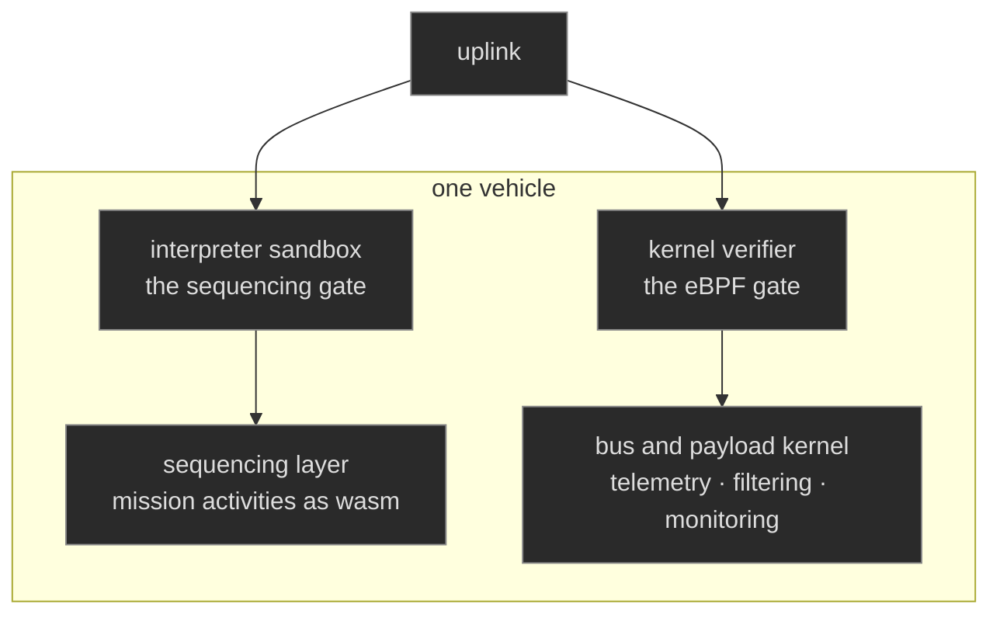
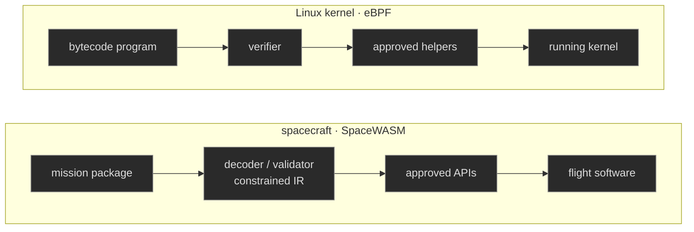
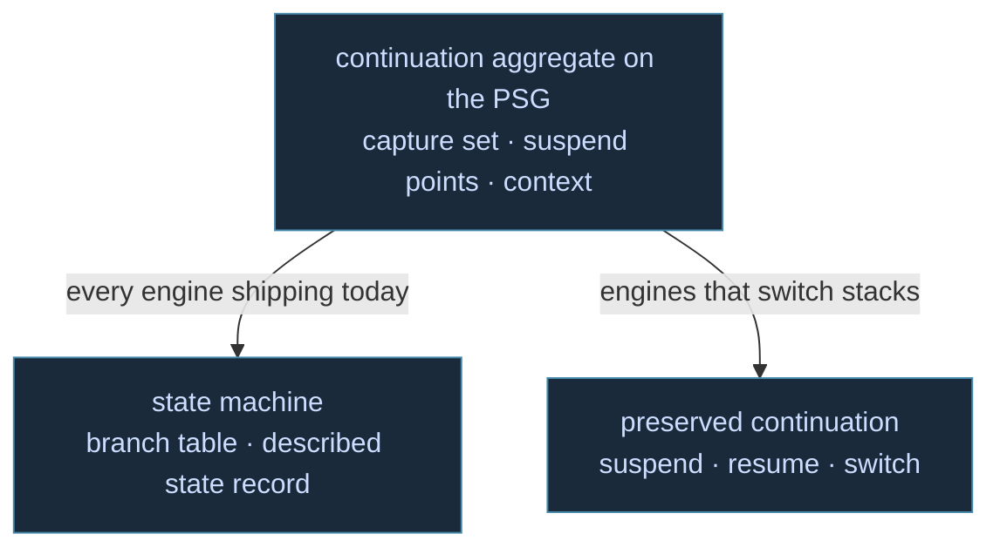
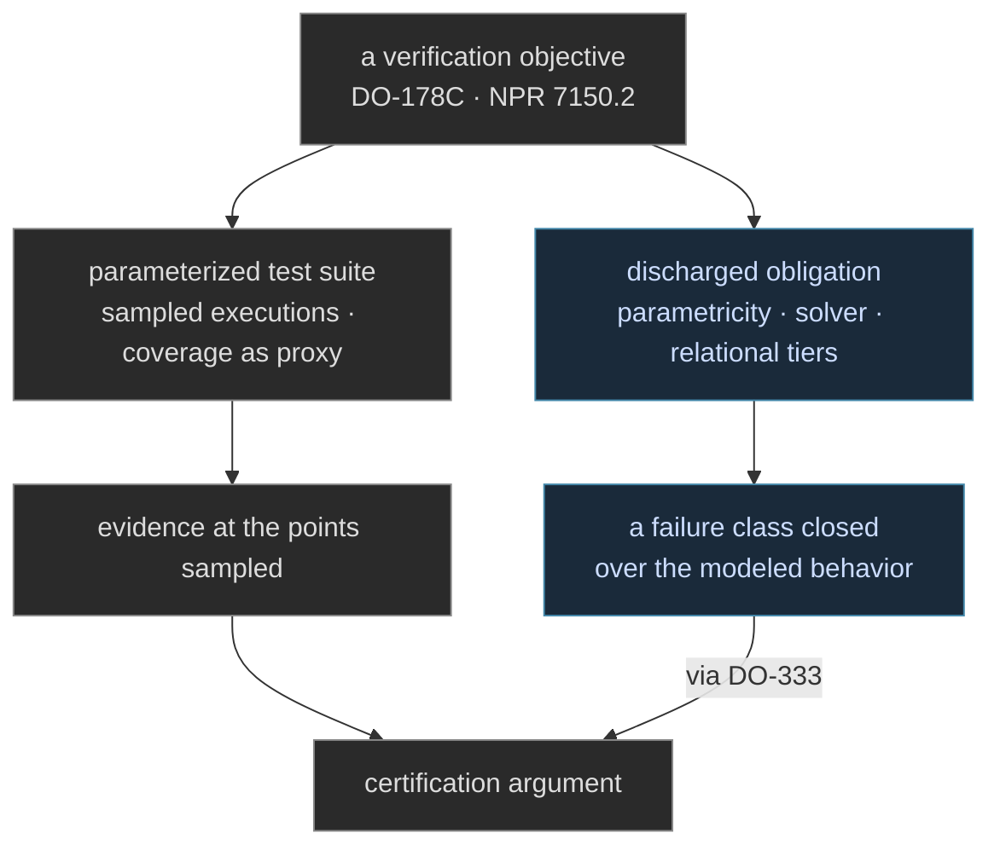

WebAssembly began as a browser technology, a way to run compiled code beside JavaScript at near-native speed. What it actually standardized is more general: a compact bytecode with the sandbox defined into its semantics, a memory that cannot reach outside itself, and a boundary where every capability the code holds is granted explicitly by its host. Those properties have carried the format far past the browser, into servers, edge platforms, plugin systems, and embedded devices, because they answer a question every serious host asks: how do you run code you did not fully vet on a machine you cannot afford to lose?


Spacecraft software is the most frozen software there is. Every line is reviewed against the possibility that it corrupts the flight computer, every change re-opens verification and validation against the full system, and the safest plan has always been to launch with the software you qualified and touch it as little as possible afterward. Updating code on a vehicle you can never walk up to is the scariest change in the profession.

This is why [SpaceWASM](https://github.com/nasa/spacewasm) is worth reading closely. NASA JPL has built, and open-sourced, a flight-compliant WebAssembly interpreter: Rust, WebAssembly 1.0, with the bytecode decoded and validated into a constrained intermediate form tuned for deterministic memory use on resource-limited flight hardware. The stated application is command sequencing, the high-level activity layer of a mission, anything from driving a Mars rover and operating its arm to checking that temperatures hold in nominal ranges. And [the project's own README](https://github.com/nasa/spacewasm/blob/main/README.md) states the economics: validating a new flight-software capability means validating its interactions with the entire system, which stretches the V&V timeline and crowds the testbeds, and sandboxed WebAssembly gives untrusted or low-trust executables a way on board where flight software can restrict both their access and their compute time. [LaurieWired's read of the project](https://x.com/lauriewired/status/2094554011404001370) sharpens the two consequences we find most interesting: mission packages written to one bytecode run on whatever the flight computer is, ARM, rad-hard PowerPC, or RISC-V, and running inside the sandbox automatically satisfies a meaningful subset of qualification's line items before a review board reads a line.

## The Kernel Taught Us This Shape

We recognize this pattern because we have written about its sibling. An eBPF program is untrusted bytecode admitted into the most critical host a machine has, its kernel, on the condition that a gate examines it before it loads and that it speaks only through approved interfaces. We built our eBPF story on exactly that gate, and on discharging its requirements at design time so the gate would have nothing left to refuse at load time. A flight computer accepting an uplinked module against approved APIs is the same admission contract with a harsher blast radius, and the parallel is ours to draw, aside from NASA's language. What the literature does assert is the sibling relationship itself: [comparative security work on eBPF and WebAssembly](https://www.researchgate.net/publication/373819966_Comparing_Security_in_eBPF_and_WebAssembly) reads them as the two production sandboxing disciplines, and notes that eBPF grew performance-first with security layered on, while WebAssembly defined its isolation property first and then chased the overhead down. For a flight computer, that ordering is the argument: you admit the technology that was a sandbox before it was fast.

The kernel half of the parallel is already concrete on orbit. A modern satellite bus or payload computer very often runs Linux, and every argument in [our eBPF entry]() applies literally there: telemetry, filtering, and monitoring programs admitted into the running kernel through the verifier's gate, speaking only approved helpers, with no re-qualification of the image beneath them. On a vehicle where replacing the image re-opens qualification, the verifier's gate is the sane path for new capability to reach a kernel already in flight. SpaceWASM aims WebAssembly at the sequencing layer of a spacecraft, and eBPF belongs one layer down, in the bus's kernel. A vehicle has room for both admission contracts, and the same discipline serves both: discharge the obligations before the gate ever sees the program.



SpaceWASM's admission path is the eBPF loader's path with the kernel swapped for a vehicle:



The interpreter choice is itself a lesson. JPL did not reach for a JIT. The flight profile buys determinism with interpretation, constrains WebAssembly 1.0 further rather than chasing the newest extensions, and takes predictable memory over peak speed. A profile is allowed to read the standard downward, and the most guarded hosts do.

## Our Line Through DCont and WAMI

Our own assessment of WebAssembly ran through quieter territory, and it was careful for the same reasons a review board is. [The Continuation Preservation Paradox](/docs/design/concurrency/the-continuation-preservation-paradox/) asked in 2025 how far delimited continuations, the form all of our concurrency saturates to, could survive lowering, and WebAssembly was the target that posed the question most sharply. The WAMI dialect work out of CMU modeled the target at the MLIR level, explored a dedicated delimited-continuation dialect, and later centered on a coroutine dialect, and we take real lessons from both stages of that arc. The settled form of our thinking now lives in [Coroutines Versus Stack Switching](/docs/design/wasm-targeting/coroutine-versus-stack-switching/): compile the continuation into a state machine that runs on every engine shipping today, preserve it for engines that can switch stacks, and make that choice per call site with the full aggregate in view.



SpaceWASM slots into that assessment as [the strictest row of the census](/docs/design/wasm-targeting/one-module-many-hosts/) we recently mapped: one module format, embedded from browsers to edge isolates to plugin hosts, now reaching a vehicle that must not crash. The flight case also validates the census's core reading. A host is a platform declaration, a statement of what the image assumes and which doors exist, and JPL's interpreter is that declaration written by people who qualify software for launch windows.

## Both Sides of the Door

An approved API is an interface contract, and flight practice has a name for where such contracts live: the ICD. It also has a name for where their failures surface, which is integration testing, because the document and the two implementations reading it are three artifacts that can drift apart. Every boundary on a vehicle raises the question that matters most: how do we know the communication is coherent across it? Our answer is that we do not have to wonder, because we write the interface for both sides.

In our design the contract is a type. The module's imports and the host's implementation of those doors compile from one declaration, so a mismatch is a build failure on the ground, never an anomaly in flight. A sequencing door would read as ordinary Clef:

```fsharp
[<Measure>] type mrad   // milliradian
[<Measure>] type s      // second

// the door, declared once, compiled into both sides of the boundary
type Door =
    | AdjustAttitude of float<mrad> * float<s>   // slew this far, over this window
    | HaltSequence   of SequenceId

type Disposition =
    | Accepted of float<mrad/s>                  // the commanded rate, dimensionally derived
    | Refused  of FaultCode

// the module's side of the door: the algebra is checked before anything is emitted
let dispose door =
    match door with
    | AdjustAttitude (delta, window) ->
        let rate = delta / window                // float<mrad/s>, inferred, never annotated
        // let bad = delta + window              // refused at compile time: mrad + s has no meaning
        if rate <= maxSlew then Accepted rate else Refused SlewLimit
    | HaltSequence sid -> halt sid
 
```

The flight software implements `Door` and answers with `Disposition`. The module can only speak `Door` and can only hear `Disposition`. Neither side holds a copy of the contract, both hold the contract, and BAREWire fixes its layout so the bytes at the boundary match the types above them. Where the host is JavaScript rather than flight software, the same declaration emits that side too:

```js
// generated from Disposition; the unit rides the name, the offset rides the build
export const disposition = (mem, base) => ({
  get accepted()     { return mem.getUint32(base + 0, true) === 0; },  // case index: a compile-time constant
  get rateMradPerS() { return mem.getFloat64(base + 8, true); },
});
 
```

The bracketed measures are the dimensional half of the contract, and they are the part this audience has scar tissue for: a vehicle was once lost to a pound-force seconds and newton seconds disagreement at a boundary just like this one. In Clef the mismatch refuses to compile. An attitude adjustment declared in milliradians cannot receive degrees, cannot be added to a duration, and needs nothing at runtime to stay honest, because the check is discharged in the type system before emission and the unit erases to a bare `f64` at its described offset. That erasure is what lets the discipline cross both boundaries at zero cost. The native side compiled against `float<mrad>` and `float<s>`, and the division that produced the rate carried the units with it: `mrad/s` was computed by the type system, not written by a person. The generated JavaScript getter exists only because the declaration produced that derived unit, and it carries it in its name, so the one place a host touches the value reads as `rateMradPerS` rather than a naked number. JavaScript cannot check the unit, and it does not need to: no hand-written reader exists to get it wrong.

Nor is this a design on paper. Our WREN stack already runs the pattern at a different seam: one protocol module compiled twice, by two compilers, into the two halves of a desktop application, the WebView UI on one side and the native host on the other, [the same discipline our UI work describes](). The wasm boundary is that seam with a harder host, and the discipline transfers intact.

## What a Review Board Accepts

Flight qualification has a definite shape. In the airborne world it is DO-178C, with design assurance levels graded by hazard and, at Level A, structural coverage down to MC/DC over requirements-traced tests. NASA's regime runs through NPR 7150.2 and its software classes. The common spine is that the evidence is mostly testing-shaped: requirements traced to tests, structure covered by tests, confidence assembled from sampled executions. The limit of that shape is acknowledged inside the standards themselves, because DO-333, the formal-methods supplement to DO-178C, exists to admit analysis in place of sampling wherever a toolchain can actually produce it.

Most C++ flight frameworks meet those objectives with parameterized test suites, and a passing suite is real evidence at the points it sampled. A discharged obligation is a different class of evidence. Our verification regime is designed to produce that class as a byproduct of compilation: dimensional and unit content discharged by parametricity with nothing to run, declared pre- and postconditions discharged by a solver at design time, probabilistic and relational properties carried at the tiers above. Where a test demonstrates behavior at samples, a discharged obligation closes a failure class over the modeled behavior, which is the difference the formal-methods supplement was written to let a certification argument use.



True, full concurrency guarantees is where the contrast sharpens. We believe it is important to delineates what we uniquely offer because Rust has earned its standing, without earning the full value that their promise of "fearless concurrency" makes. Ownership genuinely ends data races, and it is no accident SpaceWASM itself is written in Rust. But the guarantee stops at races. A deadlocked Rust program is safe Rust, liveness never enters the type system, and the teams that fly it cover those properties the way every disciplined team does: marshaled boundaries, test suites, and defensive coding held in place by convention. [We designed Clef's concurrency integrity as obligations instead](): wait-for edges live in the program graph, freedom from cycles is discharged by the solver, and liveness obligations ride the tier above, all before a module is handed to a runtime. A Clef module would arrive at a WASM host with its concurrency story already checked. A Rust module arrives with that story resting on the discipline of the team that shipped it.

What stays with us is the direction of the development. Qualification discharged by construction, a substrate answering "can this corrupt the host" categorically so that review can spend itself on the mission logic, is the same bet our framework makes one layer down, at design time, in the compiler. We find it genuinely encouraging to watch the most conservative software culture on or off the planet arrive at the admission contract we have been building toward. The strictest reader has picked up the same contract, and we intend to keep writing for that reader.
