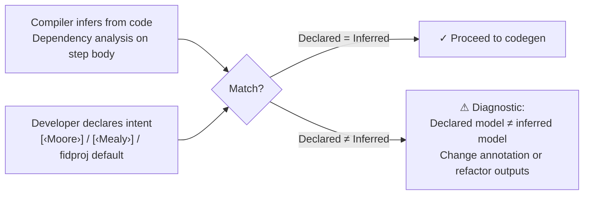

There's a question that comes up early in any FPGA design course: is this a Moore machine or a Mealy machine? Students learn the distinction, draw the state diagrams, and internalize the rule. Moore machines have outputs that depend only on state. Mealy machines have outputs that depend on both state and inputs. It's clean, it's testable, and it's one of those classifications that feels settled.

What doesn't get enough attention is that this classification is not really a design choice. It's a property of your circuit design. If your outputs reference inputs, you wrote a Mealy machine. If they don't, you wrote a Moore machine. The distinction is already in the dependency graph before you ever annotate anything.

That observation is the starting point for what we're building into the Clef language and Fidelity Framework.



## The Three Ms

In FPGA design, sequential circuits fall into three broad categories.

**Moore machines** produce outputs that depend solely on the current state. Because the output logic has no combinational path from the inputs, Moore outputs can be registered directly off the state flip-flops. This makes timing closure straightforward and eliminates glitching on outputs. The trade-off is latency: a Moore machine's outputs reflect the state *after* the clock edge, so input changes don't appear in the output until the next cycle.

**Mealy machines** produce outputs that depend on both state and inputs. The combinational path from inputs to outputs means the circuit can respond within the same clock cycle. This is faster by one cycle compared to Moore, but the combinational output path can create timing hazards, especially in high-speed designs where the critical path through input-to-output logic becomes the bottleneck.

**Mixed machines** are what most real designs actually are. Some outputs depend on inputs (Mealy paths), others depend only on state (Moore paths). A counter display that also has an input-responsive status LED is a mixed machine. Treating the entire design as one or the other means either over-registering outputs that need to be fast, or leaving timing-sensitive outputs exposed to glitches.

The conventional approach in Verilog, VHDL, and even higher-level tools like Chisel or Clash is to leave this classification to the engineer. You decide what your machine is, you code accordingly, and if you get it wrong, timing analysis tells you after synthesis. There's no structural validation at the language level.

## Why This Matters for Clef

The Fidelity Framework is built on the principle that types carry truth through the compilation pipeline. Dimensional types flow unchanged from application code through to hardware synthesis. Lifetime inference provides memory safety without annotation burden. In each case, the compiler observes a property of the code and carries it forward rather than asking the developer to declare it separately.

Machine classification in FPGA circuit design fits this pattern exactly.

> The step function's dependency graph already contains the answer. The compiler just needs to read it.

We have an early HelloArty design, a blinky LED project for the Digilent Arty A7-100T board that we've been compiling through the Clef toolchain:

```fsharp
[<HardwareModule>]
let helloArtyTop = {
    InitialState = { Counter = 0L; PeriodMs = 500L }
    Step = Behavior.step
    Clock = Endpoints.clock
}
```

The `step` function takes the current `BlinkState` and `Inputs<ArtyInputs>` (switch positions, button states) and returns a tuple of next state and `Outputs<ArtyReport>` (LED values, UART report). Some of those outputs, the LED colors, depend on which switches are active. That's a Mealy path. The UART report depends only on state. That's a Moore path.

HelloArty is a mixed machine. Not because someone declared it that way, but because that's what the code says.

## Declared or Inferred, with Validation

This follows the same pattern we established with DTS (Dimensional Type Safety) and DMM (Deterministic Memory Management). The developer *can* declare their intent:

```fsharp
[<HardwareModule>]
[<MachineModel(Moore)>]
let myDesign = { ... }
```

Or they can leave it undecorated and let the compiler infer the classification from the step function's dependency structure. Either way, the compiler performs the analysis. When a declaration is present, the analysis validates it. When there's no declaration, the analysis drives code generation directly.

The interesting case is when declaration and analysis disagree. If you annotate a design as Moore but your step function's outputs depend on inputs, the compiler produces a diagnostic: your declared intent doesn't match your code. Either refactor the outputs to depend only on state, or change the annotation. The mismatch becomes a compile-time failure, not a post-synthesis discovery.

The `fidproj` can also set a project-wide default:

```toml
[compilation]
target = "fpga"
machine_model = "inferred"
```

Setting `machine_model = "moore"` as a project default means every `[<HardwareModule>]` in the project is validated against Moore constraints unless individually overridden. 

> For safety-critical designs where registered outputs are a requirement, this provides a project-level guarantee.

## What the Compiler Sees

The analysis itself is a natural fit for our nanopass architecture. A `MachineDependencyAnalysis` pass walks the step function body in the PSG (Program Semantic Graph) and traces, for each output field, whether any path in the dependency graph reaches an input parameter.

The mechanics:

1. Identify the output fields from the step function's return type
2. For each output field, walk backwards through the PSG
3. If any transitive dependency reaches an input parameter: Mealy
4. If all dependencies resolve to state or constants: Moore
5. Attach the per-output classification as a coeffect on the Design node

This runs as a Phase 5+ nanopass, after Baker's type resolution but before Alex's MLIR generation. By the time the witness walks the Design node, the classification is pre-computed and available as a coeffect. The witness observes it. It does not compute it. This is the codata principle at work: the analysis is mise-en-place, prepared before the walk begins.

## What Changes in the Generated Hardware

The classification drives concrete differences in the generated CIRCT output.

For a **Moore output**, the top-level module registers the output through `seq.compreg`:

```mlir
// Moore: output registered for timing safety
%output_reg = seq.compreg %computed_output, %clk : !hw.struct<...>
hw.output %output_reg : !hw.struct<...>
```

For a **Mealy output**, the combinational result wires directly to the output port:

```mlir
// Mealy: combinational output for same-cycle response
hw.output %computed_output : !hw.struct<...>
```

For a **Mixed design**, each output gets the treatment its dependency structure calls for. In HelloArty, the LED outputs (which depend on switch inputs) would remain combinational for same-cycle response to switch changes, while the UART report (which depends only on state) gets registered automatically for clean timing.

This is where inference provides a real advantage over manual classification. A human engineer looking at a complex step function might not immediately see which outputs have Mealy paths and which don't. The compiler traces every dependency and makes the per-output decision systematically.

## The Design-Time Experience

ClefAutoComplete participates in this analysis. When editing a `[<HardwareModule>]` design, the editor can surface the inferred classification:

```
ℹ Design 'helloArtyTop': Inferred Mixed
  Mealy paths:
    Outputs.Leds depends on Inputs.Sw0..Sw3 (color selection)
    Outputs.Leds depends on Inputs.Btn0..Btn3 (cadence control)
  Moore paths:
    Outputs.UartReport depends on state only
  Suggestion: Consider [<MachineModel(Mixed)>] to document intent
```

This feedback loop is where Clef's approach diverges most from traditional FPGA workflows. You don't wait for synthesis to discover timing issues. You don't manually audit your step function for input-to-output paths. The analysis runs continuously in the editor and tells you what you built.

## Width Inference and Timing Budget

Machine classification answers one question about your design: what kind of state machine did you build? There's a second question that matters just as much for FPGA: how wide does each wire need to be?

On a CPU, this question has a trivial answer. `int` means "whatever the machine register holds," typically 64 bits on modern architectures. The width is a platform property, fixed before your program runs. On FPGA, there are no machine registers. Every wire, every flip-flop, every arithmetic unit is exactly as wide as the design requires. Width is a design property, not a platform property.

### Width as a Property of Code

Consider the `Counter` field in HelloArty's `BlinkState`. It counts clock ticks and resets via modulus against `maxCounterTicks`, which equals `maxPeriodMs * ticksPerMs * 2`, approximately 400 million. The counter never exceeds that value. Its range is [0, 399,999,999], which fits in 29 bits.

The `PeriodMs` field is clamped between 100 and 2000 by the `clampPeriod` function. Its range is [100, 2000], which fits in 11 bits.

The `Color` discriminated union has 8 cases. Its tag value ranges from 0 to 7: 3 bits. `Mode` has 2 cases: 1 bit.

None of these widths are declared anywhere. They are consequences of the program's structure: the constants, the modulus operations, the clamp bounds, the number of DU cases. The information is already in the code.

### Interval Analysis

The same PSG (Program Semantic Graph) that carries dependency information for machine classification also carries the constants and operations that bound value ranges. An `IntervalAnalysis` nanopass walks the enriched PSG after type resolution and propagates intervals through the graph:

- **Constants** have exact intervals: `100_000` is [100000, 100000]
- **Modulus** `x % K` bounds the result to [0, K-1]
- **Clamp** via `min(x, upper)` or `max(x, lower)` tightens the interval from one side
- **Addition** and **subtraction** propagate through operand intervals
- **Multiplication** takes the product of operand ranges
- **DU tags** have [0, numCases - 1]
- **Boolean values** are [0, 1]: 1 bit

The minimum bit width falls out directly: for an unsigned value with maximum M, you need `ceil(log2(M + 1))` bits. For signed values, one additional bit for the sign.

Applied to HelloArty:

| Value | CPU width | Inferred width | Reduction |
|-------|-----------|---------------|-----------|
| Counter | 64 bits | 29 bits | 55% |
| PeriodMs | 64 bits | 11 bits | 83% |
| ticksPerMs | 64 bits | 17 bits | 73% |
| Color tag | 8 bits | 3 bits | 63% |
| Mode tag | 8 bits | 1 bit | 88% |

Every one of those narrower widths means fewer flip-flops, fewer LUT stages, shorter carry chains, and smaller multipliers. The 17-by-64-bit multiplier that dominated the critical path becomes 17-by-29. The seven 64-bit adders become 29-bit adders. The CARRY4 count drops proportionally.

### Timing Budget

The width reduction isn't just about area. It directly affects whether the design meets timing.

Carry chain depth on Xilinx 7-series is roughly proportional to bit width; each CARRY4 primitive handles 4 bits. A 64-bit adder needs 16 CARRY4 stages. A 29-bit adder needs 8. The combinational delay drops by half.

Traditionally, you discover this after synthesis. The STA (Static Timing Analysis) output from Vivado, generated after place-and-route, tells you whether your design met its clock constraint. If you have negative slack, you go back to your HDL, restructure your logic, re-synthesize, and check again. The feedback is accurate but late. A full synthesis-and-route cycle on even a modest design can take minutes; on a larger one, hours. The edit-compile-check loop for timing is one of the slowest feedback cycles in hardware development.

The platform binding already carries the clock frequency. HelloArty's `ClockEndpoint` specifies 100 MHz, which gives a 10-nanosecond timing budget. Because the Clef Compiler Service has both the inferred widths and the clock constraint, it can estimate whether the design fits *before synthesis runs*. Vivado remains the backend: it produces the bitstream and the authoritative timing report. But the Clef frontend pre-calculates the figures that predict whether that backend pass will succeed.

```
  Estimated timing for 'step':
    Critical path: 29-bit multiply (ticksPerMs * periodMs) → 29-bit add
    Estimated delay: ~8.2 ns
    Clock period: 10.0 ns (100 MHz)
    Slack: +1.8 ns
```

Compare that to the 64-bit version that violated timing by 10.5 nanoseconds. The difference isn't a clever optimization. It's the compiler using widths that match the design instead of widths borrowed from a CPU architecture.

> This is hardware autocomplete. The compiler understands the physical implications of your design and reports them as diagnostics, the same way it reports type errors.

### The DTS Connection

This is the FPGA realization of the Dimensional Type System's promise. Source code expresses intent: a counter, a period, a color. Operations express bounds: modulus, clamp, DU case count. The compiler derives precision from the intersection of intent and bounds. The platform binding provides physical constraints: clock frequency, device characteristics. The intersection of precision and constraints determines feasibility, checked at design time.

On CPU, DTS carries units of measure and dimensional correctness through arithmetic. On FPGA, it carries bit widths and timing feasibility through synthesis. Write your counter, write your modulus bound, and the compiler gives you 29 bits automatically. You don't count bits. You don't guess. You don't find out after synthesis that your timing budget was blown by widths you never chose.

## The Constructive Constraint

There's a pattern in language design sometimes called the "pit of success." The idea is that the easiest path through the language should lead to correct results, and deviation from correctness should require deliberate effort. Machine model inference creates exactly this kind of constructive constraint for FPGA design.

Consider a project with `machine_model = "moore"` set in the `fidproj`. If a developer writes a step function where an output depends on an input, the diagnostic appears immediately in the editor, before anything is compiled to hardware.

The constraint is constructive because it doesn't prevent you from building what you need. If a particular module genuinely requires same-cycle input-to-output response, you annotate it `[<MachineModel(Mealy)>]` and the project default steps aside for that module. The override is explicit and local. Every other module in the project still gets the Moore guarantee.

Moore classification is not just a timing property; it is a physical property of the generated circuit. A Moore output has no combinational path from any input, which means it changes only on clock edges, without data-dependent timing variation. In cryptographic hardware, that variation is exactly what leaks key material through power analysis or timing side channels. The standard mitigation is manually ensuring constant-time execution paths, which is error-prone and difficult to verify. A compiler-enforced Moore constraint eliminates the category entirely: no combinational path, no data-dependent timing to exploit.

> `machine_model = "moore"` is not just a design preference. It's a security property expressed as a project configuration.

That proof compiles into physical hardware where the property holds by construction, not by convention. You don't audit the netlist for timing leaks. You don't add pipeline stages to break combinational paths. The language made the secure path the easy path, and deviation requires explicit annotation that documents where and why the constraint was relaxed.

## Where This Sits in the Broader Picture

For FPGA targets, this principle plays out across the full pipeline:

- **Platform resolution** determines the target board and its physical capabilities and constraints
- **Type mapping** resolves Clef types to CIRCT `hw.struct` types with correct bit widths
- **Width inference** determines minimum bit widths from value range analysis
- **Timing estimation** validates that inferred widths meet the clock period budget
- **Machine classification** determines which outputs need registration
- **The state machine builder** generates the top-level `hw.module` with the correct output strategy
- **Pin assignment** maps logical ports to physical package pins via XDC constraints
- **Synthesis** takes the generated SystemVerilog through to a bitstream

Machine classification and width inference are two instances of the same principle: the compiler reads your code, derives a physical property from its structure, and acts on it before you reach the synthesis tool. One reads dependency graphs. The other reads value ranges. Both produce coeffects that downstream passes observe without re-deriving.

The FPGA is not just a standalone target. In the Fidelity model, it's one processor in a heterogeneous system where Clef source compiles to native binaries on CPU and `hw.module` definitions on FPGA. The same type system that carries dimensional units through CPU arithmetic carries bit widths through hardware synthesis. The same dependency analysis that classifies Moore and Mealy outputs could classify which parts of a computation benefit from spatial execution versus temporal execution on a conventional processor.

We've written previously about posit arithmetic and the case for bringing Gustafson's tapered-precision number system into the Fidelity toolchain. Posit's strength is exactly the kind of sustained-accuracy computation where IEEE 754's uniform precision wastes bits at extreme ranges. The quire accumulator, which provides exact dot products regardless of intermediate magnitudes, is a natural fit for FPGA implementation where the wide accumulator can be mapped directly to fabric without the overhead of a general-purpose ALU. Width inference is directly relevant here: the quire's accumulator width is determined by the posit format parameters, and the compiler should derive it from the type, not from a hardcoded constant.

The planned demonstration for this is a numerical simulation where accuracy-dependent calculations are compiled to FPGA and connected to a CPU host over UART. The CPU orchestrates. The FPGA computes. Machine classification determines which parts of the FPGA design need registered outputs for clean data transfer and which can respond combinationally to streaming input. Width inference ensures every arithmetic unit uses exactly the precision the computation requires.

This is where the "same compiler, multiple targets" principle becomes concrete. Not as an aspiration, but as a pipeline property. The compiler reads what you wrote, classifies what you built, infers how wide your values need to be, checks whether your design fits in the timing budget, and targets the hardware that fits. 

These are the first clear advantages of the Dimensional Type System. 

They won't be the last.