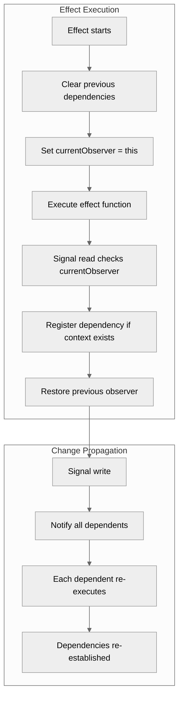
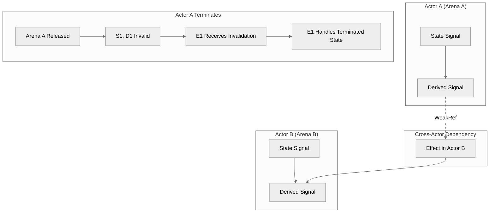
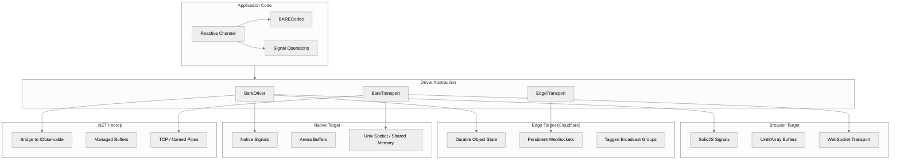
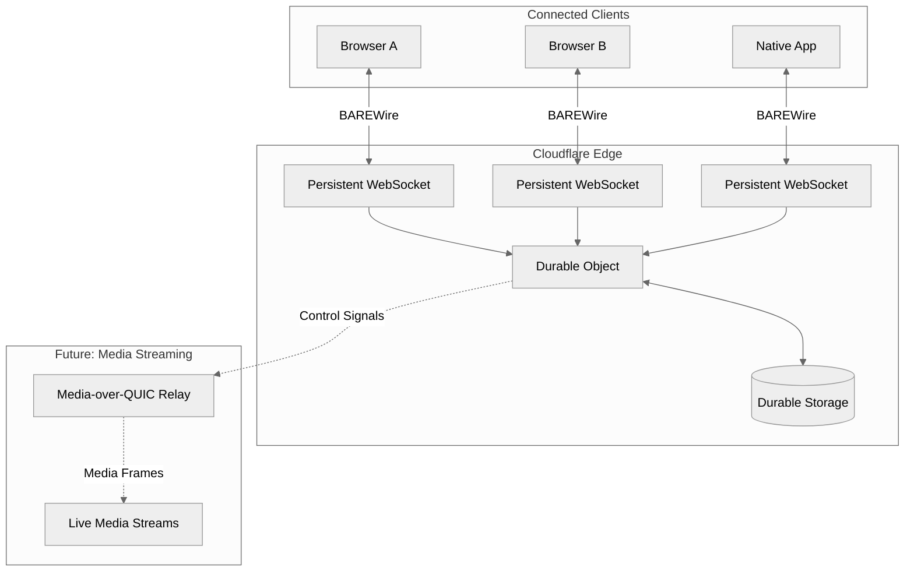

> This article was originally published on the
> [SpeakEZ Technologies blog](https://speakez.tech) as part of our early
> design work on the Fidelity Framework. It has been updated to reflect
> the Clef language naming and current project structure.

Reactive programming has become essential infrastructure for modern applications. From browser interfaces responding to user input to distributed systems coordinating state across nodes, the ability to propagate changes through a dependency graph underpins countless software architectures. Yet the dominant patterns for implementing reactivity carry significant cognitive and runtime overhead. The subscription model that pervades .NET, RxJS, and similar frameworks demands explicit lifecycle management that clutters application code and creates entire categories of resource leaks.

SpeakEZ's Fidelity Framework takes a different approach. By combining BAREWire's zero-copy memory architecture with a signal-based reactive model, we achieve reactive semantics without the subscription ceremony. This isn't merely a stylistic preference; it's an architectural decision that aligns with our [actor-oriented design philosophy](/blog/the-case-for-actor-oriented-architecture/) and enables consistent reactive patterns across native compilation, browser deployment, and managed runtime targets.

## The Subscription Problem

Consider a typical reactive scenario in .NET using the `IObservable<T>` pattern:

```fsharp
type SensorMonitor() =
    let temperatureSubject = new BehaviorSubject<float>(20.0)
    let pressureSubject = new BehaviorSubject<float>(1013.25)
    let subscriptions = new CompositeDisposable()
    
    let derivedAlert = 
        temperatureSubject
            .CombineLatest(pressureSubject, fun temp pressure ->
                temp > 100.0 && pressure > 1050.0)
            .DistinctUntilChanged()
    
    member this.OnTemperatureReading(value: float) =
        temperatureSubject.OnNext(value)
    
    member this.OnPressureReading(value: float) =
        pressureSubject.OnNext(value)
    
    member this.SubscribeToAlerts(handler: bool -> unit) =
        let subscription = derivedAlert.Subscribe(handler)
        subscriptions.Add(subscription)
        subscription
    
    interface IDisposable with
        member this.Dispose() =
            subscriptions.Dispose()
            temperatureSubject.Dispose()
            pressureSubject.Dispose()
```

This code exhibits several characteristics that compound into significant maintenance burden:

**Explicit subscription handles**: Every `Subscribe` call returns an `IDisposable` that the caller must retain and eventually dispose. Forgetting to dispose leaks resources. Disposing twice throws exceptions. The subscription handle becomes a first-class concern that pollutes API boundaries.

**Composite disposal management**: Tracking multiple subscriptions requires container types like `CompositeDisposable`. These containers themselves require lifecycle management, creating nested disposal hierarchies.

**Subject ownership ambiguity**: Who owns the `BehaviorSubject` instances? When should they complete? The disposal pattern forces explicit answers to questions that often have no clean solution.

**Cold versus hot confusion**: Does subscribing to `derivedAlert` trigger computation, or is it already running? The answer depends on implementation details hidden behind the `IObservable` interface.

These aren't incidental complexities; they're intrinsic to the subscription model. The pattern treats reactive relationships as runtime entities that must be explicitly created and destroyed, imposing a resource management discipline on what should be declarative data flow.

## What "Subscription-Free" Actually Means

SolidJS popularized the term "subscription-free" reactivity, but the phrase requires careful interpretation. SolidJS absolutely maintains dependency relationships internally. Signals know their dependents; computations know their sources. The graph exists.

What SolidJS eliminates is the *explicit subscription API*. You simply read a signal's value. The act of reading, when performed within a reactive context, establishes the dependency. When the signal changes, the computation re-executes. No subscription handle. No disposal requirement. No ceremony.

The mechanism relies on tracking context. When a reactive computation begins executing, the runtime establishes a context that records signal reads. Each signal checks for this context when accessed. If present, the signal registers the current computation as a dependent. When the computation completes, the context captures the full dependency set.

```javascript
// SolidJS pseudocode illustrating the mechanism
let currentObserver = null;

function createSignal(initialValue) {
    let value = initialValue;
    const dependents = new Set();
    
    const read = () => {
        if (currentObserver) {
            dependents.add(currentObserver);
            currentObserver.sources.add({ signal: read, dependents });
        }
        return value;
    };
    
    const write = (newValue) => {
        value = newValue;
        for (const dep of dependents) {
            dep.execute();
        }
    };
    
    return [read, write];
}

function createEffect(fn) {
    const effect = {
        sources: new Set(),
        execute() {
            // Clear previous dependencies
            for (const source of this.sources) {
                source.dependents.delete(this);
            }
            this.sources.clear();
            
            // Execute with tracking
            const prevObserver = currentObserver;
            currentObserver = this;
            try {
                fn();
            } finally {
                currentObserver = prevObserver;
            }
        }
    };
    
    effect.execute();
    return effect;
}
```

The `currentObserver` global variable serves as the tracking context. Signal reads check it; effect execution sets it. This works because JavaScript is single-threaded. The pattern cannot race.

Cleanup happens automatically through re-execution. When an effect runs again, it first clears its previous dependencies, then re-establishes them based on which signals it actually reads during the new execution. If a conditional branch changes which signals matter, the dependency graph updates accordingly. No explicit unsubscription required.



## Departing from .NET Conventions

A fundamental tension emerges when bringing signal-based reactivity to [the Clef language](https://clef-lang.com): the language's heritage carries .NET conventions that assume explicit resource management. The `IDisposable` pattern, `use` bindings, and finalizer semantics pervade idiomatic .NET F# code. These patterns exist because the CLR's garbage collector cannot guarantee deterministic cleanup; developers must explicitly mark resource boundaries.

Fidelity takes deliberate leave from these conventions. As explored in our discussion of [RAII in Olivier and Prospero](/blog/raii-in-olivier-and-prospero/), the Composer compiler performs scope analysis during IR lowering to insert cleanup code automatically. Developers write clean signal operations; the compiler determines where cleanup belongs based on actor lifecycle boundaries and continuation points.

This represents more than syntactic convenience. It reflects a philosophical position: resource management is a compiler concern, not a developer burden. The same [coeffect analysis](/blog/coeffects-and-codata-in-firefly/) that tracks async boundaries and memory access patterns also tracks resource lifetimes. When the compiler knows that a signal exists within an actor's arena, it knows exactly when that arena will be released. No `Dispose` call needed; no `IDisposable` interface required.

```fsharp
// .NET convention: explicit disposal
type SensorProcessor() =
    let subscription = sensor.Subscribe(handler)
    
    interface IDisposable with
        member this.Dispose() = subscription.Dispose()

// Fidelity approach: compiler-managed cleanup
let processSensor (sensor: Signal<SensorReading>) =
    let derived = memo (fun () ->
        let reading = Signal.get sensor
        transformReading reading)
    
    effect (fun () ->
        let value = Signal.get derived
        updateDisplay value)
    // No cleanup code; Composer inserts it during IR lowering
    // based on the enclosing actor's lifecycle
```

The Fable target for Fidelity.CloudEdge follows a similar philosophy, delegating to SolidJS's internal cleanup mechanisms. The .NET interop layer necessarily bridges back to `IDisposable` conventions when interfacing with existing .NET code, but pure Fidelity code intends to remain free of explicit disposal ceremony.

This departure may initially feel unfamiliar to developers accustomed to .NET patterns. The `use` binding becomes less prevalent. The `IDisposable` interface appears only at system boundaries. Resource cleanup becomes invisible, handled by the same compilation infrastructure that manages [arena allocation and actor termination](/blog/raii-in-olivier-and-prospero/). The code that developers write focuses entirely on the reactive logic; the compiler handles the rest.

## Designing Signals for Clef

Bringing signal-based reactivity to Clef requires addressing the multi-threaded reality of native execution. The global `currentObserver` pattern assumes single-threaded semantics that JavaScript provides but native code does not. Three architectural approaches present themselves.

### Thread-Local Tracking Context

The most direct translation uses thread-local storage to maintain per-thread tracking contexts:

```fsharp
module Fidelity.Reactive

[<ThreadStatic>]
let mutable private currentScope: ReactiveScope voption = ValueNone

type ReactiveScope = {
    mutable Dependencies: ResizeArray<ISignalBase>
    Computation: IComputation
}

and ISignalBase =
    abstract AddDependent: IComputation -> unit
    abstract RemoveDependent: IComputation -> unit

and IComputation =
    abstract Invalidate: unit -> unit
    abstract Execute: unit -> unit
```

Signal reads check the thread-local context:

```fsharp
type Signal<'T> = {
    mutable Value: 'T
    Dependents: ResizeArray<WeakReference<IComputation>>
    Lock: SpinLock
}

module Signal =
    let inline get (signal: Signal<'T>) : 'T =
        match currentScope with
        | ValueSome scope ->
            scope.Dependencies.Add(signal)
            let lockTaken = ref false
            signal.Lock.Enter(lockTaken)
            try
                signal.Dependents.Add(WeakReference(scope.Computation))
            finally
                if lockTaken.Value then signal.Lock.Exit()
        | ValueNone -> ()
        signal.Value
    
    let inline set (signal: Signal<'T>) (value: 'T) : unit =
        signal.Value <- value
        let lockTaken = ref false
        signal.Lock.Enter(lockTaken)
        let deps = 
            try
                signal.Dependents |> Seq.choose (fun wr ->
                    match wr.TryGetTarget() with
                    | true, comp -> Some comp
                    | false, _ -> None)
                |> Seq.toArray
            finally
                if lockTaken.Value then signal.Lock.Exit()
        for dep in deps do
            dep.Invalidate()
```

This approach mirrors SolidJS closely while handling multi-threaded access. The `WeakReference` wrapper prevents memory leaks when computations are abandoned; dead references are cleaned up lazily during iteration.

### Explicit Context via Computation Expressions

An alternative approach makes the tracking context explicit through Clef's computation expression syntax:

```fsharp
type Reactive<'T> = ReactiveScope -> 'T

type ReactiveBuilder() =
    member _.Bind(signal: Signal<'T>, f: 'T -> Reactive<'U>) : Reactive<'U> =
        fun scope ->
            scope.Dependencies.Add(signal)
            signal.Dependents.Add(WeakReference(scope.Computation))
            let value = signal.Value
            f value scope
    
    member _.Return(x: 'T) : Reactive<'T> =
        fun _ -> x
    
    member _.ReturnFrom(r: Reactive<'T>) : Reactive<'T> = r
    
    member _.Zero() : Reactive<unit> =
        fun _ -> ()

let reactive = ReactiveBuilder()
```

Usage requires `let!` bindings for tracked reads:

```fsharp
let temperature = Signal.create 20.0
let pressure = Signal.create 1013.25

let alertCondition = reactive {
    let! temp = temperature
    let! press = pressure
    return temp > 100.0 && press > 1050.0
}
```

This approach is more explicit than thread-local tracking. Dependencies are visible in the code structure. However, it requires restructuring existing code to use the computation expression syntax, which may feel heavy for simple reactive bindings.

### Hybrid Scope Markers

Our current approach leans toward thread-local context with explicit scope boundaries:

```fsharp
module Fidelity.Reactive

[<ThreadStatic>]
let mutable private currentScope: ReactiveScope voption = ValueNone

/// Enter a reactive scope where signal reads are tracked
let track (f: unit -> 'T) : TrackedResult<'T> =
    let scope = {
        Dependencies = ResizeArray()
        Computation = Unchecked.defaultof<_>
    }
    let prevScope = currentScope
    currentScope <- ValueSome scope
    try
        let result = f()
        { Result = result; Dependencies = scope.Dependencies |> Seq.toList }
    finally
        currentScope <- prevScope

/// Create a memoized computation that re-executes when dependencies change
let memo (f: unit -> 'T) : Signal<'T> =
    let mutable cached = Unchecked.defaultof<'T>
    let mutable valid = false
    let resultSignal = Signal.create cached
    
    let computation = {
        new IComputation with
            member _.Invalidate() =
                valid <- false
                computation.Execute()
            
            member this.Execute() =
                let tracked = track f
                cached <- tracked.Result
                valid <- true
                Signal.set resultSignal cached
    }
    
    computation.Execute()
    resultSignal

/// Create an effect that runs when dependencies change
let effect (f: unit -> unit) : unit =
    let mutable currentDeps: ISignalBase list = []
    
    let computation = {
        new IComputation with
            member _.Invalidate() =
                computation.Execute()
            
            member this.Execute() =
                for dep in currentDeps do
                    dep.RemoveDependent(this)
                
                let tracked = track f
                currentDeps <- tracked.Dependencies |> List.map (fun s -> s :> ISignalBase)
                
                for dep in currentDeps do
                    dep.AddDependent(this)
    }
    
    computation.Execute()
    // Cleanup handled by Composer's scope analysis during IR lowering
```

This hybrid provides the ergonomics of implicit tracking (signal reads within a tracked scope are automatically captured) while making scope boundaries explicit. On a semantic level, the `effect` function in Fidelity returns `unit`, not `IDisposable`. The Composer compiler's scope analysis identifies where cleanup should occur and inserts it during IR lowering, eliminating the developer's burden of managing subscription lifecycles.

## Integration with BAREWire: Solving the Byref Problem

The signal model gains substantial power when integrated with BAREWire's zero-copy memory architecture. Traditional reactive systems copy values through the dependency graph. Each signal holds its own copy of the data; each propagation involves allocation and copying. For small values this overhead is negligible. For large buffers, frequently updated data streams, or resource-constrained environments, the overhead dominates.

Our unique design for BAREWire enables a different, patent-pending approach: signals that reference data in shared buffers without copying. This capability rests on BAREWire's solution to the [byref problem](/blog/byref-resolved/) that has constrained .NET developers for decades. Where .NET's byref restrictions force defensive copying because references cannot outlive their stack frame, BAREWire separates buffer lifetime from access permissions through capability-based memory management. 

> This is where zero-copy yields zero overhead.

### Capability-Based Memory Access

The core insight from our [byref resolution work](/blog/byref-resolved/) applies directly to reactive signals. Traditional .NET code faces a fundamental constraint:

```fsharp
// .NET limitation: byrefs cannot escape their stack frame
let getBiggestElementRef (arr: int[]) =
    let mutable maxIndex = 0
    for i = 1 to arr.Length - 1 do
        if arr.[i] > arr.[maxIndex] then
            maxIndex <- i
    &arr.[maxIndex]  // ERROR: Cannot return a byref from this function
```

BAREWire solves this by creating capabilities that can be passed around safely while the underlying buffer lifetime is managed separately:

```fsharp
// BAREWire approach: capabilities separate lifetime from access
let processLargeData() = 
    let buffer = BAREWire.createBuffer<LargeStruct> 1
    let writeCapability = buffer.GetWriteAccess()
    
    // This capability can be passed to async functions and reactive computations
    let processAsync (capability: WriteCapability<LargeStruct>) = async {
        do! Async.Sleep(100)  // State machine on heap is fine
        let struct = capability.GetDirectAccess()
        struct.UpdateInPlace(newValue)  // Zero-copy modification
        return capability
    }
```

This same capability pattern enables reactive signals that hold references into shared memory without the copying that would otherwise be required.

### Buffer Signals with Zero-Copy Semantics

Building on BAREWire's capability system, we define signals whose values live in shared buffers:

```fsharp
module BAREWire.Reactive

/// A signal whose value lives in a BAREWire buffer
[<Struct>]
type BufferSignal<'T> = {
    Buffer: BAREBuffer
    Offset: int
    Layout: BARELayout<'T>
    mutable Version: int64
    Dependents: ResizeArray<WeakReference<IComputation>>
}

/// Reference into a BAREWire buffer (zero-copy read)
[<Struct>]
type BARERef<'T> = {
    Buffer: BAREBuffer
    Offset: int
    Layout: BARELayout<'T>
}

module BufferSignal =
    /// Read the current value (returns a reference, not a copy)
    let inline get (signal: BufferSignal<'T>) : BARERef<'T> =
        match currentScope with
        | ValueSome scope ->
            scope.Dependencies.Add(signal :> obj)
            signal.Dependents.Add(WeakReference(scope.Computation))
        | ValueNone -> ()
        { Buffer = signal.Buffer; Offset = signal.Offset; Layout = signal.Layout }
    
    /// Update the buffer reference (typically called when new data arrives)
    let inline updateBuffer (signal: BufferSignal<'T>) (newBuffer: BAREBuffer) : unit =
        let oldBuffer = signal.Buffer
        signal.Buffer <- newBuffer
        Interlocked.Increment(&signal.Version) |> ignore
        
        for depRef in signal.Dependents do
            match depRef.TryGetTarget() with
            | true, comp -> comp.Invalidate()
            | false, _ -> ()
        
        BufferPool.release oldBuffer
```

The `BARERef<'T>` type doesn't contain the value; it contains coordinates for locating the value within a buffer. Accessing the actual data requires dereferencing through the layout:

```fsharp
module BARERef =
    /// Dereference to get the actual value (performs the read)
    let inline deref (ref: BARERef<'T>) : 'T =
        BARELayout.read ref.Layout ref.Buffer ref.Offset
    
    /// Get a span view of the underlying memory (for large values)
    let inline asSpan (ref: BARERef<'T>) : ReadOnlySpan<byte> =
        let size = BARELayout.size ref.Layout
        BAREBuffer.slice ref.Buffer ref.Offset size
```

This design intends to separate the reactive relationship (tracking, dependency propagation) from the actual data access. The signal machinery operates on lightweight reference types. The heavy data stays in BAREWire buffers, accessed only when needed. As discussed in [Cache-Conscious Memory Management](/blog/cache-aware-compilation-cpu/), BAREWire's deterministic layouts make this integration possible by ensuring that memory positions are statically known and guaranteed.

### Hardware-Enforced Safety

Unlike .NET's runtime-based memory safety, BAREWire maintains safety through hardware memory protection:

```fsharp
// Buffer ownership is explicit and transferable
let buffer = BAREWire.createBuffer<float> 1024

// Create multiple access capabilities with different permissions
let readOnlyAccess = buffer.GetReadAccess()
let writeAccess = buffer.GetWriteAccess()

// Share with another process via memory mapping
let sharedAccess = buffer.ShareWithProcess(targetProcessId)

// The compiler automatically handles cleanup at scope boundaries
// through delimited continuations - no manual disposal needed
```

This approach provides the memory safety developers depend on, but through hardware enforcement and compile-time analysis as opposed to design-time burdens and runtime restrictions. The signal model inherits these guarantees: reactive computations can safely hold references into shared memory because the capability system ensures those references remain valid for the duration of the computation.

### Buffer Lifecycle and Actor Boundaries

BAREWire buffer design has an explicit lifetime tied to arena allocation. In the Fidelity Framework, arenas are associated with actors. This creates a natural integration point: buffer signals live within actor arenas, and buffer lifecycle follows actor lifecycle. As explained in [RAII in Olivier and Prospero](/blog/raii-in-olivier-and-prospero/), when an actor terminates, its entire memory arena is immediately reclaimed without any scanning or collection pauses.

```fsharp
module Olivier.Reactive

/// Actor-scoped reactive state
type ReactiveActor<'State, 'Message>(initialState: 'State) =
    let arena = Arena.current()
    let stateBuffer = arena.Allocate<'State>(BARELayout.of'<'State>())
    let stateSignal = BufferSignal.create stateBuffer
    
    /// Read current state (zero-copy reference)
    member _.State : BARERef<'State> =
        BufferSignal.get stateSignal
    
    /// Update state (triggers dependents)
    member _.UpdateState(f: 'State -> 'State) =
        let current = BufferSignal.get stateSignal |> BARERef.deref
        let newValue = f current
        BARELayout.write stateSignal.Layout stateSignal.Buffer stateSignal.Offset newValue
        Interlocked.Increment(&stateSignal.Version) |> ignore
    
    /// Create a derived computation scoped to this actor
    member this.Derived<'T>(f: unit -> 'T) : Signal<'T> =
        let derivedBuffer = arena.Allocate<'T>(BARELayout.of'<'T>())
        let derived = BufferSignal.create derivedBuffer
        
        let _ = memo (fun () ->
            let result = f()
            BARELayout.write derived.Layout derived.Buffer derived.Offset result
            result)
        
        // No explicit cleanup registration; actor termination handles it
        derived
```

Dependent computations in other actors receive invalidation notifications and must handle the terminated state appropriately. From a design perspective, this would seem to align with Erlang's "let it crash" philosophy: explicit lifecycle boundaries as opposed to complex distributed garbage collection for cross-actor references. But there will be considerable attention given to this area once the work gets down to brass tacks of implementation.



## The Cross-Target Challenge

The Fidelity Framework targets three distinct compilation paths: native execution via MLIR (and many cases LLVM by extension), browser deployment via Fable to JavaScript, and .NET managed runtime interop. It's important to note that each target has different characteristics that affect reactive implementation.

### Native Target (Fidelity/MLIR)

The native target has full control over memory layout and threading. Buffer signals can use raw pointers into arena-allocated memory. Thread-local storage provides tracking context. RAII semantics ensure cleanup when scopes exit, with the Composer compiler inserting cleanup code during IR lowering based on [coeffect analysis](/blog/coeffects-and-codata-in-firefly/).

```fsharp
// Native implementation sketch
module Fidelity.Reactive.Native

[<Struct>]
type NativeSignal<'T> = {
    Ptr: nativeptr<'T>
    mutable Version: int64
    Dependents: nativeptr<DependentList>
}

module NativeSignal =
    let inline get (signal: NativeSignal<'T>) : 'T =
        match NativeReactive.currentScope() with
        | ValueSome scope -> 
            NativeReactive.trackDependency scope signal.Ptr
        | ValueNone -> ()
        NativePtr.read signal.Ptr
    
    let inline set (signal: NativeSignal<'T>) (value: 'T) : unit =
        NativePtr.write signal.Ptr value
        Interlocked.Increment(&signal.Version) |> ignore
        NativeDependents.notifyAll signal.Dependents
```

The native implementation can leverage MLIR's optimization passes. Simple signal reads may inline completely, leaving only the memory access. The tracking check can use branch prediction hints since the common case (reading outside a tracked scope) is predictable.

### Browser Target (Fable/Fidelity.CloudEdge)

The browser target trades the native target's memory control for JavaScript's runtime semantics. F# compiles through Fable to JavaScript, where we leverage the [SPEC stack](/blog/spec-stack/)[^1]—SolidJS, Partas.Solid, Elmish, and Fidelity.CloudEdge—for deployment. SolidJS provides the reactive runtime, and its subscription-free signal model directly inspired Fidelity's approach. Rather than reimplementing signal mechanics, we delegate to SolidJS's battle-tested primitives through Partas.Solid's F# bindings:

```fsharp
// Fable implementation using SolidJS
module Fidelity.Reactive.Fable

open Fable.Core
open Fable.Core.JsInterop

[<Import("createSignal", "solid-js")>]
let private createSolidSignal<'T> (initial: 'T) : (unit -> 'T) * ('T -> unit) = jsNative

[<Import("createMemo", "solid-js")>]
let private createSolidMemo<'T> (fn: unit -> 'T) : (unit -> 'T) = jsNative

[<Import("createEffect", "solid-js")>]
let private createSolidEffect (fn: unit -> unit) : unit = jsNative

type Signal<'T> = {
    Get: unit -> 'T
    Set: 'T -> unit
}

module Signal =
    let create (initial: 'T) : Signal<'T> =
        let get, set = createSolidSignal initial
        { Get = get; Set = set }
    
    let inline get (signal: Signal<'T>) : 'T = signal.Get()
    let inline set (signal: Signal<'T>) (value: 'T) : unit = signal.Set(value)

let memo (f: unit -> 'T) : unit -> 'T =
    createSolidMemo f

let effect (f: unit -> unit) : unit =
    createSolidEffect f
```

This approach leverages SolidJS's battle-tested reactive implementation while presenting an F#-idiomatic API. The Fable compiler erases the F# types to direct SolidJS calls, incurring no additional overhead at runtime. SolidJS handles its own cleanup internally; no `IDisposable` bridge required.

For BAREWire integration in the browser, buffers become `Uint8Array` instances:

```fsharp
module BAREWire.Fable

type BAREBuffer = Uint8Array

type BufferSignal<'T> = {
    Buffer: Signal<BAREBuffer>
    Layout: BARELayout<'T>
}

module BufferSignal =
    let get (signal: BufferSignal<'T>) : BARERef<'T> =
        let currentBuffer = Signal.get signal.Buffer
        { Buffer = currentBuffer; Offset = 0; Layout = signal.Layout }
    
    let updateBuffer (signal: BufferSignal<'T>) (newBuffer: BAREBuffer) : unit =
        Signal.set signal.Buffer newBuffer
```

The SolidJS signal wraps the buffer reference. When a new buffer arrives (via WebSocket, for example), setting the signal triggers SolidJS's reactive propagation. Dependent computations re-execute, reading from the new buffer. The old buffer becomes eligible for garbage collection.

### Edge Target (Fidelity.CloudEdge)

The same Fable compilation pipeline that targets browsers also deploys to Cloudflare Workers—this is the "C" in the SPEC stack. Fidelity.CloudEdge[^2] provides type-safe F# bindings to Cloudflare's edge infrastructure, including Durable Objects for persistent state and coordinated WebSocket connections. Where SolidJS manages reactive state within a browser tab, Durable Objects extend this coordination across distributed clients through what we term the "cloud edge backplane."

Fidelity.CloudEdge exposes this infrastructure through idiomatic F# types:

```fsharp
// Fidelity.CloudEdge Durable Object state management
type DurableObjectState<'Props> =
    abstract member acceptWebSocket: ws: WebSocket * ?tags: ResizeArray<string> -> unit
    abstract member getWebSockets: ?tag: string -> ResizeArray<WebSocket>
    abstract member storage: DurableObjectStorage

type DurableObjectStorage =
    abstract member get<'T> : key: string -> JS.Promise<'T option>
    abstract member put<'T> : key: string * value: 'T -> JS.Promise<unit>
    abstract member transaction<'T> : closure -> JS.Promise<'T>
```

The persistent WebSocket capability is particularly significant. Unlike traditional WebSocket servers that lose connection state on restart, Durable Objects maintain WebSocket connections across the Cloudflare network with automatic failover. This persistence aligns with BAREWire's zero-copy philosophy: binary messages flow directly from edge to client without intermediate serialization layers.

```fsharp
// Signal bridge between Durable Object and connected clients
module EdgeSignal =
    let broadcast (state: DurableObjectState<obj>) (signal: BufferSignal<'T>) =
        effect (fun () ->
            let ref = BufferSignal.get signal
            let buffer = BARERef.asArrayBuffer ref
            let sockets = state.getWebSockets()
            for socket in sockets do
                socket.send(buffer))

    let fromWebSocket (state: DurableObjectState<obj>) (layout: BARELayout<'T>) =
        let signal = Signal.create Unchecked.defaultof<'T>
        // WebSocket message handler updates signal
        // Connected clients receive updates via reactive propagation
        signal
```

We see the architecture enabling scenarios where a signal update on one client propagates through the edge backplane to all connected clients, with BAREWire ensuring the binary payload traverses the network without transformation. The Durable Object becomes a coordination point in the reactive graph, extending signal semantics beyond a single runtime.

This is a feature area that is still under development at Cloudflare, and SpeakEZ Technologies will follow their updates closely.

### .NET Interop Target

For scenarios requiring .NET interop, the signal model can bridge to `IObservable<T>`. This bridge exists at system boundaries where Fidelity code must interface with existing .NET libraries:

```fsharp
module Fidelity.Reactive.DotNet

open System
open System.Reactive.Subjects

/// Wrap a Fidelity signal as an IObservable (for .NET interop)
let toObservable (signal: Signal<'T>) : IObservable<'T> =
    let subject = new BehaviorSubject<'T>(Signal.get signal)
    
    effect (fun () ->
        let value = Signal.get signal
        subject.OnNext(value))
    
    subject :> IObservable<'T>

/// Create a Fidelity signal from an IObservable (for .NET interop)
let fromObservable (observable: IObservable<'T>) (initial: 'T) : Signal<'T> =
    let signal = Signal.create initial
    // This subscription handle is managed at the interop boundary
    let _ = observable.Subscribe(fun value -> Signal.set signal value)
    signal
```

This bridge necessarily reintroduces subscription handles at the boundary between Fidelity and .NET code. This complexity appears only at system edges. Again, the details of this still have to be sorted out, but our sense is that this is a manageable complexity that can achieve some consistency across the various platforms.

## The BAREWire Driver Architecture

To support all three targets from a unified codebase, we introduce an abstraction layer that captures essential operations while allowing target-specific implementations:

```fsharp
// In BAREWire.Core (target-agnostic)
[<AbstractClass>]
type BareDriver<'TBuffer>() =
    /// Allocate a buffer of the specified size
    abstract Allocate: size:int -> 'TBuffer
    
    /// Release a buffer back to the pool
    abstract Release: buffer:'TBuffer -> unit
    
    /// Get a span view of buffer contents
    abstract GetSpan: buffer:'TBuffer -> BARESpan
    
    /// Create a signal holding a buffer reference
    abstract CreateBufferSignal<'T> : layout:BARELayout<'T> -> initial:'TBuffer -> BufferSignal<'T>
    
    /// Create a standard value signal
    abstract CreateSignal<'T> : initial:'T -> Signal<'T>
    
    /// Create a memoized computation
    abstract CreateMemo<'T> : compute:(unit -> 'T) -> Signal<'T>
    
    /// Create an effect (cleanup handled by driver)
    abstract CreateEffect: action:(unit -> unit) -> unit

/// Transport abstraction for message delivery
[<AbstractClass>]
type BareTransport<'TBuffer>() =
    /// Send a buffer
    abstract Send: buffer:'TBuffer -> Async<unit>

    /// Receive the next buffer
    abstract Receive: unit -> Async<'TBuffer>

    /// Connection state as a signal
    abstract State: Signal<ConnectionState>

    /// Register message handler (cleanup handled by transport)
    abstract OnMessage: ('TBuffer -> unit) -> unit

and ConnectionState =
    | Connecting
    | Connected
    | Disconnected of reason:string
    | Reconnecting of attempt:int

/// Edge transport leveraging Cloudflare's persistent WebSockets
[<AbstractClass>]
type EdgeTransport<'TBuffer>() =
    inherit BareTransport<'TBuffer>()

    /// Durable Object coordination for multi-client scenarios
    abstract DurableObjectId: string option

    /// Subscribe to tagged broadcast groups
    abstract JoinGroup: tag:string -> Async<unit>

    /// Leave a broadcast group
    abstract LeaveGroup: tag:string -> Async<unit>

    /// Broadcast to all clients in a group
    abstract Broadcast: tag:string -> buffer:'TBuffer -> Async<unit>
```

Note that `CreateEffect` and `OnMessage` return `unit`, not `IDisposable`. The driver implementation manages cleanup internally, aligned with Fidelity's philosophy that resource management is infrastructure, not application code.

Application code programs against these abstractions:

```fsharp
module Application

let createReactiveChannel<'TOut, 'TIn>
    (driver: BareDriver<'TBuffer>)
    (transport: BareTransport<'TBuffer>)
    (outCodec: BARECodec<'TOut>)
    (inCodec: BARECodec<'TIn>) =
    
    let lastMessage = driver.CreateSignal<'TIn option>(None)
    
    transport.OnMessage(fun buffer ->
        let decoded = inCodec.Decode(driver.GetSpan(buffer))
        Signal.set lastMessage (Some decoded)
        driver.Release(buffer))
    
    let send (message: 'TOut) =
        async {
            let size = outCodec.EncodedSize(message)
            let buffer = driver.Allocate(size)
            outCodec.Encode(message, driver.GetSpan(buffer))
            do! transport.Send(buffer)
        }
    
    {| Send = send
       Messages = lastMessage
       State = transport.State |}
```

The `driver` and `transport` are injected, allowing the same application code to run against different targets. For Fidelity.CloudEdge browser deployment, the driver wraps SolidJS signals and `Uint8Array` buffers; the transport wraps WebSocket. For Fidelity.CloudEdge edge deployment, the transport extends to leverage Durable Objects for persistent connections and coordinated state. For Fidelity native, the driver uses native signals and arena-allocated buffers; the transport might use Unix sockets or shared memory.



## Actor Integration: Signals and Message Boundaries

The Olivier actor model provides natural boundaries for reactive scope. An actor processes messages sequentially; between messages, no actor code is executing. This creates clean points for reactive operations:

**Message arrival**: When a message arrives, it may carry data that should update signals. The actor's receive function reads from the message buffer and updates local state signals.

**Message processing**: During processing, the actor may read signals (triggering dependency tracking if within a reactive scope) and compute derived values.

**Message completion**: When processing completes, any pending reactive effects execute. The actor is then ready for the next message.

```fsharp
module Olivier.ReactiveActor

type ReactiveMailbox<'State, 'Msg> = {
    State: Signal<'State>
    Derived: (unit -> 'T) -> Signal<'T>
}

let reactiveActor<'State, 'Msg>
    (initialState: 'State)
    (behavior: ReactiveMailbox<'State, 'Msg> -> 'Msg -> 'State) =
    
    let stateSignal = Signal.create initialState
    
    let mailbox = {
        State = stateSignal
        Derived = fun f -> memo f
    }
    
    let processMessage (msg: 'Msg) =
        let newState = behavior mailbox msg
        Signal.set stateSignal newState
        // Effects run here, after state update
    
    { new IActor<'Msg> with
        member _.Tell(msg) = processMessage msg
        member _.State = stateSignal }
```

Reactive propagation happens *within* message processing, not asynchronously. When `Signal.set stateSignal newState` executes, any effects depending on `stateSignal` run immediately, before the message handler returns. This provides deterministic execution order: the actor sees a consistent state throughout message processing.

For effects that should run *after* message processing (such as sending messages to other actors), we introduce a deferred effect queue:

```fsharp
module Olivier.DeferredEffects

let mutable private deferredQueue: (unit -> unit) list = []

let defer (action: unit -> unit) =
    deferredQueue <- action :: deferredQueue

let flushDeferred () =
    let actions = deferredQueue
    deferredQueue <- []
    for action in List.rev actions do
        action()

let processMessage (msg: 'Msg) =
    let newState = behavior mailbox msg
    Signal.set stateSignal newState
    // Immediate effects run during set
    flushDeferred()  // Deferred effects run after
```

This pattern prevents cascading message sends during state updates, which could lead to unbounded recursion or reentrancy issues.

## The Cloud Edge Backplane

Having established how Fidelity's signal model operates within individual runtimes—native via MLIR, browser via the SPEC stack, and .NET interop—we now turn to coordination across distributed clients. This is where Fidelity.CloudEdge and Durable Objects transform the signal model from a single-runtime pattern into a distributed coordination primitive. Cloudflare's platform provides three capabilities that extend reactive semantics across the network.

### Durable Objects as Signal Coordinators

Durable Objects provide single-threaded, strongly consistent execution at the edge. Each Durable Object instance runs in exactly one location globally, processes requests sequentially, and maintains persistent state across invocations. This model maps directly to our actor-based signal architecture:

```fsharp
// Durable Object as a distributed signal coordinator
type SignalCoordinator(state: DurableObjectState<obj>) =
    let storage = state.storage

    member _.fetch(request: Request) = promise {
        match Request.path request with
        | "/ws" ->
            // Upgrade to WebSocket and accept with tagged group
            let pair = WebSocketPair.create()
            state.acceptWebSocket(pair.server, ResizeArray(["signals"]))
            return Response.webSocket(pair.client)

        | "/signal" ->
            // Retrieve current signal value from persistent storage
            let! value = storage.get<SignalState>("current")
            return Response.json(value)

        | _ -> return Response.notFound()
    }

    member _.webSocketMessage(ws: WebSocket, message: string) = promise {
        // Parse incoming signal update
        let update = JSON.parse<SignalUpdate>(message)

        // Persist to Durable Object storage
        do! storage.put("current", update.value)

        // Broadcast to all connected clients
        let sockets = state.getWebSockets("signals")
        for socket in sockets do
            if socket <> ws then socket.send(message)
    }
```

The Durable Object becomes the single source of truth for a signal's value, with connected clients maintaining local reactive mirrors. When any client updates the signal, the change persists in Durable Object storage and propagates to all other clients through the persistent WebSocket connections. The sequential execution guarantee ensures no race conditions, while the tagged broadcast groups enable efficient fan-out without iterating all connections.

### Persistent WebSockets and Connection Resilience

Traditional WebSocket architectures lose connection state when servers restart or connections migrate. Cloudflare's persistent WebSockets, managed through Durable Objects, maintain connection metadata across these events. For the signal model, this means reactive subscriptions survive infrastructure changes:

```fsharp
module EdgeReactive =
    /// Create a signal synchronized across edge and clients
    let distributedSignal<'T>
        (durableObject: DurableObjectStub)
        (initial: 'T)
        (codec: BARECodec<'T>) =

        let localSignal = Signal.create initial
        let ws = WebSocket.connect(durableObject.url + "/ws")

        // Incoming updates from edge coordinator
        ws.onMessage(fun buffer ->
            let value = codec.Decode(buffer)
            Signal.set localSignal value)

        // Outgoing updates to edge coordinator
        let sendToEdge = effect (fun () ->
            let value = Signal.get localSignal
            let buffer = codec.Encode(value)
            ws.send(buffer))

        localSignal
```

The resulting signal behaves identically to a local signal from the application's perspective. Reads and writes use the same API. The edge synchronization is infrastructure, not application code. When the WebSocket reconnects after a network interruption, the Durable Object replays the current state, and the local signal updates accordingly.

### Media-over-QUIC: The Streaming Horizon

Looking ahead, Cloudflare's Media-over-QUIC relay infrastructure opens possibilities for real-time media streaming integrated with the signal model. Where WebSockets excel at reliable, ordered message delivery, QUIC provides the low-latency, loss-tolerant transport that live media requires. The combination enables scenarios where:

- Signal updates coordinate playback state (play, pause, seek position)
- Media frames flow through QUIC streams without head-of-line blocking
- BAREWire encodes both control signals and media metadata in a unified format

While this integration remains forward-looking, the architecture anticipates it. The `BareTransport` abstraction can accommodate QUIC-based implementations alongside WebSocket transports. The signal model's separation of reactive semantics from transport mechanics means applications written today can adopt QUIC transport tomorrow without architectural changes.



This edge backplane transforms the signal model from a single-runtime pattern into a distributed coordination primitive. The same F# code, compiled through Fable to JavaScript, runs in browsers, Cloudflare Workers, and Durable Objects. Signals flow across these boundaries with BAREWire ensuring efficient binary encoding. The platform provides the persistence, fan-out, and resilience; the application code remains focused on reactive logic.

## Connecting to Alloy.Rx

The signal model presented here complements the [Alloy.Rx reactive framework](/blog/alloyrx-native-reactivity-in-fidelity/) by providing a different abstraction for different use cases. Where Alloy.Rx distinguishes between multicast (broadcast) and unicast (isolated) observables based on push semantics, the signal model focuses on pull semantics with automatic dependency tracking.

The distinction matters. Alloy.Rx multicast observables excel at event streams where producers push updates to multiple observers, achieving zero allocation for broadcast scenarios—making them a natural fit for sensor data, UI events, and system notifications. Unicast observables provide per-subscriber isolation with arena-based allocation, which becomes appropriate when each subscriber needs independent processing state.

The signal model takes a different approach: pull-based semantics with implicit dependency tracking. This makes signals a natural fit for derived state, computed properties, and reactive UI bindings where the consumer controls when values are read rather than reacting to pushed updates.

These models can interoperate. A signal can be updated from an Alloy.Rx observable:

```fsharp
let bridgeToSignal (observable: Observable<'T, Multicast>) : Signal<'T> =
    let signal = Signal.create (Multicast.current observable)
    Multicast.subscribe (fun (_, newValue) -> 
        Signal.set signal newValue) observable
    signal
```

And a signal's changes can drive an observable:

```fsharp
let bridgeToObservable (signal: Signal<'T>) : Observable<'T, Multicast> =
    let observable = Multicast.create (Signal.get signal)
    effect (fun () ->
        let value = Signal.get signal
        Multicast.next value observable)
    observable
```

The choice between models depends on the communication pattern. Event streams flow through Alloy.Rx; derived state lives in signals.

## Schema Evolution and Versioning

BAREWire uses position-based encoding, which raises questions about schema evolution. Our approach follows an append-only discipline with explicit versioning:

```fsharp
[<BAREMessage>]
type SensorReading_V1 = {
    [<BAREField(0)>] Timestamp: uint64
    [<BAREField(1)>] Value: float32
}

[<BAREMessage>]
type SensorReading_V2 = {
    [<BAREField(0)>] Timestamp: uint64
    [<BAREField(1)>] Value: float32
    [<BAREField(2)>] SensorId: string
    [<BAREField(3)>] Confidence: float32
}
```

The wire format includes a version byte. Decoders read the version and parse accordingly:

```fsharp
module BAREWire.Versioned

let decode<'T> (layout: VersionedLayout<'T>) (span: BARESpan) : 'T =
    let version = span.[0]
    match Map.tryFind version layout.Versions with
    | Some decoder -> decoder span
    | None -> 
        if version > layout.LatestVersion then
            // Newer version than we know; decode what we can
            layout.Versions.[layout.LatestVersion] span
        else
            failwith $"Unknown schema version: {version}"
```

Older readers encountering newer versions decode the fields they understand and ignore the rest. Newer readers handle older versions by applying default values for missing fields. This approach is simpler than protobuf's sparse field numbering but requires discipline: once a field occupies position N, it remains there permanently.

## Performance Characteristics

The signal model's performance depends heavily on the target environment and usage patterns. Key characteristics:

**Read overhead**: In the common case (reading outside a tracked scope), signal reads add only a branch to check the thread-local context. With branch prediction, this approaches zero overhead. Within tracked scopes, reads additionally register dependencies.

**Write overhead**: Signal writes iterate through dependents and invoke invalidation callbacks. The cost scales with the number of dependents. For signals with many dependents, batching updates can amortize overhead.

**Memory overhead**: Each signal maintains a list of dependents. Using weak references prevents leaks but adds indirection. For native targets, custom allocators can pool dependency records.

**Zero-copy benefit**: For buffer signals, the reactive machinery operates on lightweight references while heavy data remains stationary. This is particularly beneficial for large messages and streaming data. As detailed in our [byref resolution](/blog/byref-resolved/), eliminating the "copy tax" transforms what would be performance bottlenecks into competitive advantages.

| Aspect | Signal Model | Rx/IObservable |
|--------|--------------|----------------|
| Subscription creation | Implicit via read | Explicit Subscribe call |
| Subscription disposal | Compiler-managed | Manual Dispose required |
| Dependency tracking | Runtime during execution | Compile-time via operators |
| Cold/hot distinction | N/A (signals are always hot) | Complex semantics |
| Threading model | Thread-local context | Schedulers and synchronization |
| Memory model | Zero-copy capable | Values copied through pipeline |
| Edge distribution | Native via Durable Objects | Requires custom infrastructure |

## Reactive Architecture Without Ceremony

The signal model outlined here represents a significant departure from subscription-based reactive programming. By making dependency tracking implicit in signal reads, we eliminate an entire category of resource management concerns. By integrating signals with BAREWire's [capability-based memory architecture](/blog/byref-resolved/), we enable reactive systems that handle large data volumes without allocation overhead. By aligning signal lifecycle with actor boundaries through [RAII principles](/blog/raii-in-olivier-and-prospero/), we provide deterministic cleanup without garbage collection.

Perhaps most importantly, by having the Composer compiler manage cleanup through [scope analysis and coeffect tracking](/blog/coeffects-and-codata-in-firefly/), we free developers from the `IDisposable` ceremony that pervades .NET code. This is not merely a convenience; it reflects a core principle of the Fidelity Framework: infrastructure concerns belong in the compiler, not in application code.

This isn't merely a different API for the same underlying model. The architectural implications ripple through application design:

Composition becomes natural because derived signals compose freely without subscription handles to manage. Complex reactive graphs emerge from simple function composition rather than careful orchestration of observable chains.

Testing simplifies as well. Without subscription lifecycle concerns, reactive code tests like pure functions: set inputs, check outputs. There's no need to mock subscription mechanics or carefully time disposal.

The same reactive patterns work consistently across native, browser, edge, and managed targets. Application logic remains unchanged; only the driver implementation varies by platform.

Signals and actors reinforce each other in ways that deepen both patterns. Actor boundaries provide cleanup semantics while signals provide reactive state within actors. Durable Objects extend this to the edge, providing persistent coordination across distributed clients. The combination proves more powerful than any component alone.

The Fidelity Framework's approach to reactivity exemplifies our broader philosophy: provide sophisticated capabilities through simple, composable primitives. Developers shouldn't need to become experts in subscription lifecycle management to build reactive applications. They should be able to read values, derive computations, and trust the system to handle the plumbing.

BAREWire makes this possible by providing the memory substrate where signals and buffers coexist. The BARE protocol's simplicity, a binary encoding that maps directly to memory layout, aligns with our zero-copy goals. The [solution to the byref problem](/blog/byref-resolved/) eliminates the defensive copying that would otherwise negate the benefits of reactive optimization. The [SPEC stack](/blog/spec-stack/) carries these patterns to the browser through SolidJS's proven signal implementation, while Fidelity.CloudEdge extends this reach to the edge, where Durable Objects and persistent WebSockets transform local reactive patterns into distributed coordination primitives. The result is a reactive system where data flows through dependency graphs without copying, where cleanup is deterministic, where signals propagate from native code through edge infrastructure to browser UIs, and where the cognitive load of subscription management simply disappears.

This is what we mean by "getting the signal": receiving the essential benefits of reactive programming while filtering out the noise of incidental complexity. Whether that signal originates in native code, traverses the cloud edge backplane, or updates a browser UI, the model remains consistent. From our perspective, the signal is clear.

---

*This article is part of our ongoing series exploring the Fidelity Framework's designs for systems programming with Clef. Related entries include [Coeffects and Codata in Composer](/blog/coeffects-and-codata-in-firefly/), [RAII in Olivier and Prospero](/blog/raii-in-olivier-and-prospero/), [ByRef Resolved](/blog/byref-resolved/), and [Alloy.Rx: Native Reactivity in Fidelity](/blog/alloyrx-native-reactivity-in-fidelity/).*

[^1]: The SPEC stack—SolidJS, Partas.Solid, Elmish, and Fidelity.CloudEdge—represents our vision for unified web development with F#. See [The SPEC Stack: A Proposal](/blog/spec-stack/) for the full architectural overview.

[^2]: Fidelity.CloudEdge enables F# deployment to Cloudflare's edge network through Fable compilation. For a deeper exploration of this integration, see [Leaner, Smarter AI Cloud Systems](/blog/leaner-smarter-ai-cloud-systems/).