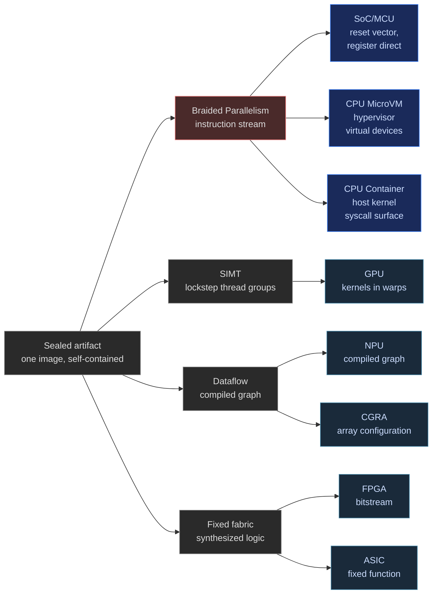
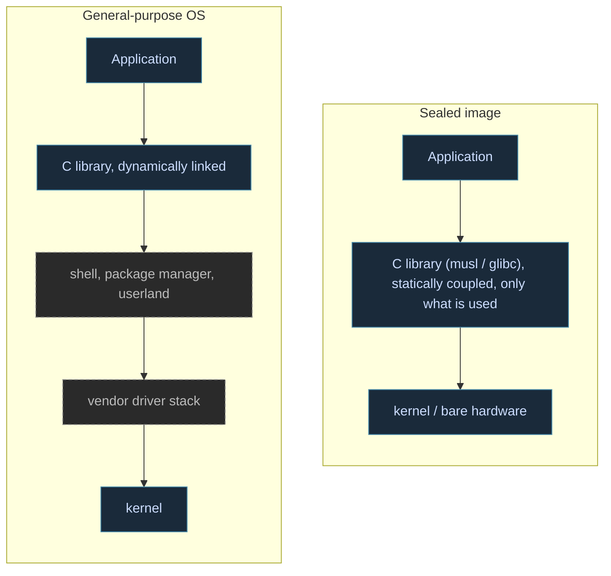
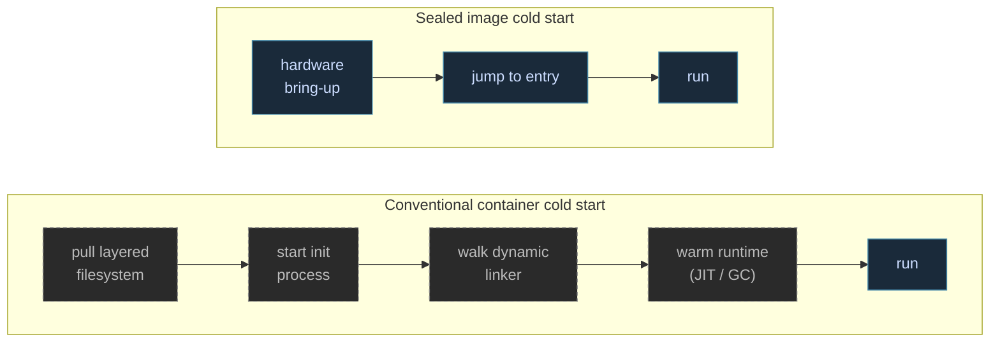

## Hidden Hierarchy in Plain Sight

A standard application sometimes runs on top of [a runtime host](), and always an operating system. The OS has its own layers 'down the stack': a kernel, a variety of drivers, package managers, and support tools and a shell. Most of that stack sits idle for the workload's life on that device. It still ships on the platform, still gets patched on a staggered schedule, and still presents all of the capability and risk that comes with it. That is the ordinary, realistic shape of most software today. It is just what "runs on an operating system" has meant for decades.

By contrast, the unikernel's introduction to computing has been uneven: named in a research lab, praised through a hype cycle that receded, and carried into daily production in pieces most developers don't notice. The idea underneath holds steady. Seal the computation graph down to exactly what a workload needs, statically coupled at build time, with no software host stack resident beneath it, and most of that idle surface simply is not there to patch, exploit, or wait on. The sealed image carries some inherent advantages: it starts faster because it skips the layers that ordinary boot traverses, and it is smaller because nothing unused was ever linked in. That combination, less to attack and less to boot, is why the concept keeps resurfacing across a wide range of deployment shapes, from containers and microVMs down to workloads built for a single piece of hardware. Our framework treats the artifact class as [a category with normative language of its own in the spec](/spec/draft/backend-lowering-architecture/#5-entry-point-example), and we are designing the deployment story to span that same range end to end.

The word itself carries unfair baggage. When unikernels come up in conversation, the mental image tends toward austerity: one core, one thread, no allocator, a workload squeezed onto limited hardware. That impression mistakes the first demonstration hardware for the class. A unikernel is a single, self-contained artifact, sealed at build time, with no software stack residents around its boundary. Core count is a property of the target it lands on. So are thread count, memory strategy, and whether a library is statically linked. 

## One Sealed Image

The "uni" portion of the term points to the shape of the artifact, as opposed to a commentary on its capability. It says nothing about how many cores the artifact may use, how many threads it may run, or what its memory discipline looks like once control arrives; those are properties of the target it lands on, not of the class. [Our spec draws the same line](/spec/draft/backend-lowering-architecture/#5-entry-point-example) between the freestanding compilation a unikernel requires and everything else a specific target may or may not grant.

The "kernel" half has its own history. The word began as the seed inside the husk, the part kept when everything around it is stripped away, and computing has carried it in two directions since. The operating-system kernel grew outward into a resident, general-purpose platform that serves every workload on the machine. The GPU usage stayed near the seed: one computation, dispatched as one of many duplicate units, run to completion. We take the term unikernel back toward its center, the kernel of one application's full compute scope, carrying exactly what that application needs.

*The dashed layers on the left ship, get patched, and hold privilege for the workload's life while sitting idle. The sealed image links only what the application uses, so those layers are not present to patch, exploit, or wait on.*

Most toolchains can already produce a freestanding artifact; that half of the problem was solved a long time ago. What has kept unikernels a specialist's tool is everything past that: hand-written service layers standing in for the OS pieces a workload still needs, one hypervisor's guest format at a time, and an extremely narrow passage to garden-variety developer workflow. Fidelity approaches this from the compiler down rather than the binary up. The same Clef source that targets a hosted Linux process today would target a sealed artifact by changing what the [Platform Descriptor](/spec/draft/platform-bindings/) declares, not by rewriting the program. Static coupling, the discipline that removes dynamic-linking seams, falls out of that same freestanding compilation. And our actor-and-arena memory discipline we are designing for every target, [deterministic lifetimes tied to actor scope]() rather than a garbage collector, is exactly the discipline a sealed build needs to run without a runtime or even an operating system underneath it. 

## Flexing Without 'musl'

The sealed-image diagram above shows a C library statically linked into the image, and musl is the usual choice there: it is small, static-link-friendly, and already the libc behind most scratch-container and unikernel builds. 

Fidelity aims to provide three choices, one for each linkage tier the spec draws. The first is hosted: the C binding path we've written about extensively and built with our Farscape binding application, resolved against the system's shared libraries like any ordinary Linux process. The second is freestanding with a static libc: the same Farscape bindings coupled at build time, musl sealed into the image, the recipe in the diagram above. The third is the tier this entry is about: [a bare target with no C runtime at all](/spec/draft/ffi-boundary/), reached by compiling Clef to native code with no C ABI in the path. On the bare tier no libc is linked, there is no foreign-function boundary, and interior memory follows the compiler's own lifetime lattice rather than `malloc` and `free`. The arena and static-storage discipline aims to be the memory model on that tier; there would be no allocator to call because none would be linked.

## Prior Art

[MirageOS](https://mirage.io) is the most prominent prior-art waypoint. The 2013 paper [*Unikernels: Library Operating Systems for the Cloud*](https://anil.recoil.org/papers/2013-asplos-mirage.pdf) made a compelling argument: specialize the build to the application, link only what the application uses, and boot the result directly as a virtual guest. The part of that project which demonstrably survived into the wild is the networking. Docker Desktop ships [VPNKit](https://github.com/moby/vpnkit), a service assembled from Mirage networking libraries, and it has routed container traffic on developer machines for a decade. The ecosystem that followed broadened the substrate choices: [Unikraft](https://unikraft.org) reports millisecond-scale boots for specialized images, and the [unikernels-as-processes](https://dl.acm.org/doi/10.1145/3267809.3267845) line of research showed the artifact running as an ordinary process behind a narrow syscall filter, no hypervisor required.

It is fair to ask why the 2010s wave receded without taking over the cloud. The objections were practical. Debugging norms assumed a shell in the image; observability assumed an agent; and patching assumed a package manager. Linux userland gravity is real, and a decade ago the operational tooling demanded that teams give up more than the smaller footprint provided in return. We're sensitive to this, and every effort is made with our framework to ensure all 'trades' are in the developer's favor.

Mainstream practice spent ten years moving toward the unikernel's assumptions. Idempotent and immutable infrastructure became the default posture of serious shops, and patch-by-rebuild stopped being an objection once CI pipelines redeployed on every merge as routine. Scratch-based container images holding a single static binary went from curiosity to recognized supply-chain practice. The industry adopted, piece by piece, the operational model unikernels required all at once.

We made some study of MirageOS early in our design work, and we arrived at a different set of commitments. Mirage's "library OS" model binds the sealed image to one language runtime, OCaml, and to hypervisor guests as its deployment shape. Our rollout starts from the compiler instead. The freestanding discipline and the platform declaration will carry the sealed-artifact posture to bare metal in our first prototype, and those same two mechanisms are designed to carry the posture across containers, microVMs, and further down the accelerator landscape in a graded approach that preserves the unique advantages of each platform.

## From Freestanding Builds to Sealed Images

Our compilation story starts from the freestanding discipline and builds toward the sealed image. The spec defines [two freestanding entry modes](/spec/draft/program-structure-and-execution/): a hosted-ELF Linux form that carries no libc and terminates through the exit syscall, and a bare-metal form for Cortex-M33 class parts that enters at the reset vector with no loader and no syscall ABI at all. The [work on STM32-class hardware](/docs/internals/hardware/fidelity-on-stm32/) is where the small end of that story develops, and reactive pipelines for sensor-class deployments are part of [how we think about those targets]().

On the M33, the [Platform Descriptor](/spec/draft/platform-bindings/) declares a 4-byte word with no heap region, entered at the reset vector, and the compiler's contract is to commit to exactly that. Nothing about the mechanism is small-end specific: a container definition that grants eight cores and a gigabyte of memory under a narrow syscall policy is also a platform declaration, so the compiler that will build the M33 prototype would equally produce one that runs [multi-threaded Olivier actors](/docs/design/concurrency/the-three-layer-actor-contract/) with [arena-backed, RAII-disciplined memory](/docs/design/memory/raii-in-olivier-and-prospero/) inside that larger grant. The actor model and its orchestration layer remain design-stage work; the claim we make here is architectural.

Our first concrete unikernel implementation will be the bare-metal M33 build for [our post-quantum credential prototype](https://speakez.tech/portfolio/post-quantum-credential/). In essence, the application *is* the operating system. Control arrives at the reset vector and lands directly in credential logic. [The credential authority chapter](/spec/draft/credential-authority/) specifies the design; the prototype will put the sealed-image properties to work directly on silicon.

## The Cold-Start Collapse

Deployment substrates for a sealed image span three forms today, and the useful comparison is who provides the machine:

| Substrate | Who provides the machine | What the image assumes |
|-----------|--------------------------|------------------------|
| Bare metal | The silicon itself | Nothing; entry at the reset vector |
| MicroVM (Firecracker-class) | A hypervisor's virtual hardware | Virtual devices; the image brings its own service layer |
| Container (LXC-style, scratch image) | The host kernel's syscall interface | Syscalls within the granted policy; empty userland |

Purists sometimes reserve the word for the middle row, where the image brings its own kernel-role code as a guest. We read the class by its properties instead: one sealed artifact with an empty userland and no resident stack inside its boundary. The process form carries those properties intact, which is the argument the unikernels-as-processes research made formally, and it is the form that matters most for where deployment platforms are heading.

Cold start is where the difference is measurable. A conventional container cold start does work a sealed artifact never generates: it pulls layered filesystems, starts an init process, walks the dynamic linker across shared objects, and then warms whatever runtime the application may require. A Clef-compiled unikernel would skip what's not needed. There is always hardware bring-up, but that cost is bounded by what the unikernel actually needs, not the full menu of a general-purpose operating system: one small static binary, nothing in it needing interpretation or JIT warmup, no linker pass at entry, and arena-based memory that skips garbage-collector initialization. Entry is a jump. [AWS built Firecracker](https://firecracker-microvm.github.io/) to boot minimal microVMs in roughly a hundred milliseconds, and it runs underneath Lambda; boots measured in single-digit milliseconds inside that same harness appear throughout the unikernel literature. The floor keeps dropping as the artifact approaches the application and nothing else.

*Each dashed step on the top row is work a sealed image never generates. Bring-up on the bottom row is bounded by what the workload declares it needs, not the full menu of a general-purpose boot.*

That arithmetic drew us to [Cloudflare's Container infrastructure](https://developers.cloudflare.com/containers/) and shaped the hybrid we sketched in [Unexpected Fusion](): CloudEdge actors for coordination, Fidelity-compiled unikernels for compute-dense work. Near-instant cold starts would make scale-to-zero the default posture rather than a compromise, and dense deployment of minimal-overhead images points at a cost model that recasts applications' runtime model. Fan-out across instances would ride on BAREWire-framed messages, [the coordination model our JavaScript-targeting design lays out](/docs/design/javascript-targeting/jsir-javascript-as-mlir-backend/) for compute that outgrows one instance. Firecracker and LXC-style substrates would take the same build with different isolation trade-offs, which is the practical benefit of an artifact class defined by self-containment: the substrate becomes a neutral deployment decision instead of an architectural impediment.

## Leveling the Horizon Line

From our design perspective, there is a question we keep circling: *where does the concept stop?* We theorize in this section, and hold the taxonomy loosely.

FPGA and dedicated-IC practice has always worked the way this entry describes. A bitstream is a sealed artifact that configures the fabric and 'becomes the system'. Nobody asks what operating system the fabric runs, because the question has no referent. [Our hardware-inference work]() sits in that tradition. The dedicated-silicon world never needed the unikernel concept because it never had the operating-system assumption to begin with.

General-purpose accelerators sit closer to that world than their CPU-adjacent position suggests. The unit of work handed to a GPU is already called a kernel, and the scheduling vocabulary around it, warps and command queues and streams, describes hardware-managed dispatch with no OS norms in the near vacinity. [Unified-memory APUs](/docs/internals/hardware/rdna-unified-memory-desktop/) pull those workloads into the CPU's address space without adding an operating system between the workload and the compute units. NPUs accept compiled graphs. CGRAs accept configurations. Each device takes a sealed artifact, ignites it, and lets it own its granted resources to completion.

The wrinkle is the igniter. These workloads depend on a bootstrapping orchestrator, usually a CPU, and that dependence is the obvious objection to counting them in the class. We think the bootloader analogy carries the weight here. An M33 build receives control from a boot ROM that then steps out of the way, and **nobody counts the boot ROM as a host**. The line we find useful is residence rather than ignition: whether a software host stays underneath the workload during execution serving it, or hands over at entry and disappears. A GPU kernel that runs to completion on its compute units sits on the sealed-image side of that line. A workload that round-trips through a driver mid-flight sits on the other. Reasonable people could draw the line elsewhere, and we expect our own position to sharpen as the compilation work reaches more deeply into those targets.

Whether or not the term stretches in that way, the leveling is what we are after. Spatial and dedicated processors never reflected operating-system norms, and the sealed image brings general-purpose deployment into the same frame. One conceptual horizon line runs flat across the landscape, from microcontroller and microVM to container and fabric, and the question at every point on it is the same: what did the platform declare, and what does the artifact assume?

## A New Normal for Dedicated Systems

The practical value is our front-of-mind concern. A sealed artifact deploys into general-purpose environments with near-instant startup and a security posture that closes the dynamic-linking seam and strips out the userland an intruder could exploit. It widens the menu of substrates a workload can run on, because self-containment makes the *acutal physical substrate* a late decision based on a processor's capabilities and the developer's available targets. In our design, range is bounded, among other things, by the platform declaration. So the eight-core container build and the single-core sensor node would be the same style of coding approach at two points on one spectrum.

The framing we want to leave readers with is *the corner*, expanded. Unikernels read as a niche only when the operating system is treated as the natural center of gravity, and dedicated systems programming never granted that premise. FPGA and ASIC work treats the artifact as the system as a matter of course, and compilation for spatial processors is gaining ground in a similar frame. General-purpose CPUs are late arrivals to a posture the rest of the hardware landscape considers ordinary, and the nature of schedulers like Kubernetes make it an attractive option on grounds of efficiency and security posture.

We build freestanding images today, at the small end where the discipline is unavoidable and on hosted Linux where it is an advantaged choice for certain scenarios. The sealed-container story is also a direction our CloudEdge design work envisions. And the horizon leveling question, how far down the accelerator landscape one compilation discipline can reach, a question we expect to keep developing in the open. 

## Related Entries

- [Getting the Signal with BAREWire](): reactive programming in Clef without subscription overhead, one signal model across native, web, and managed targets
- [RAII in Olivier and Prospero](/docs/design/memory/raii-in-olivier-and-prospero/): actor-aware memory management through deterministic lifetimes, with each actor owning an arena that manages its own lifetime without adverse overhead
- [Arena Hoisting](/docs/design/memory/arena-hoisting/): the Lattice analyzer that trades a runtime guard for a compile-time arena placement, keeping the safe default and surfacing the faster choice
- [Unexpected Fusion](): how OCaml and Erlang inspired an agentic systems architecture informs Fidelity's continuation passing core
