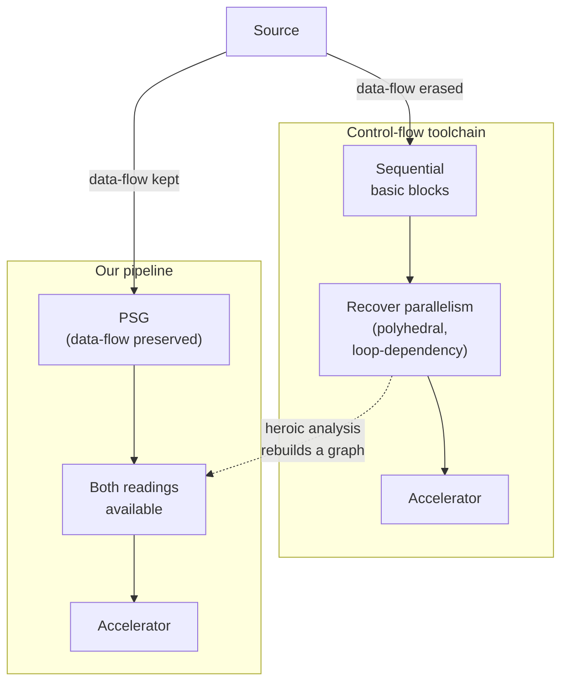
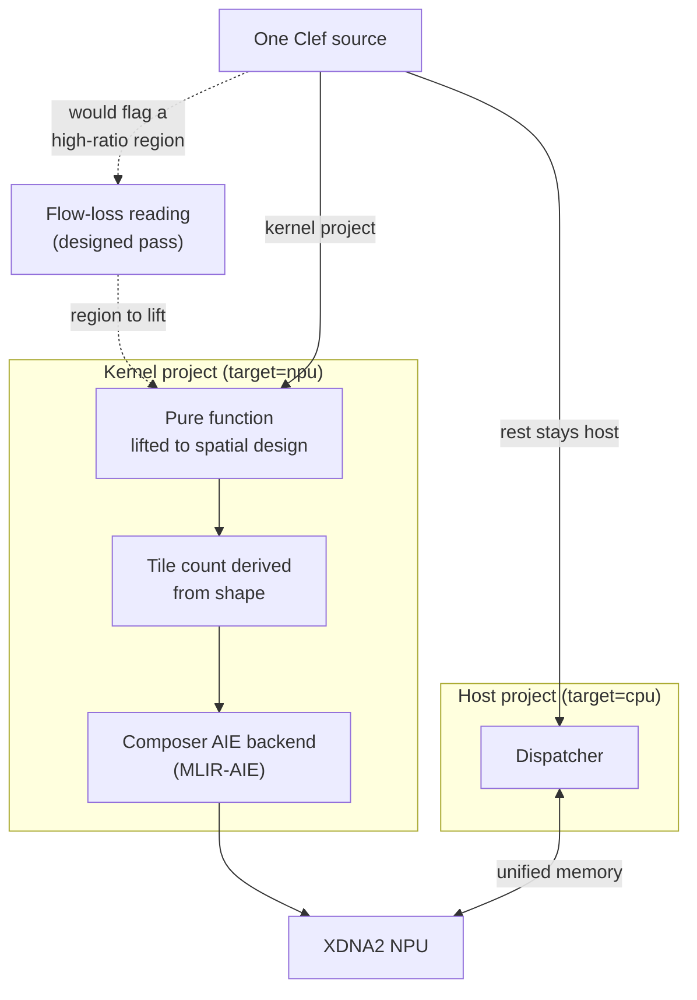

A pipeline of independent transforms over a collection, mapping a calibration across a frame of samples, scoring each one, normalizing the result, is a description of data flow. Nothing in that code says "do these in order." Each element is its own small computation, written as independent because that is how the problem actually looks. The parallelism is there in the source, leaving optimization to distant, opaque machinery that often have baked-in opinions that are generations out of date.

A CPU is not purely serial about this. Its SIMD vector units run one operation across a lane of elements at once, and a GPU's SIMT threads run in lockstep across their lanes, and both have exploited that kind of parallelism for many years. What they take is the regular, rectangular share: a fixed lane width and a uniform operation applied across it. The parallelism a program actually expresses is wider than the rectangle. Irregular reductions, independent work of varying shape, dependency structure that no fixed-width lane was built to hold. A control-flow target takes a further share of that through its cores, out-of-order execution, and a concurrency runtime that spreads independent work across them, but past the lanes and the cores some of the program's parallelism still has nowhere to go and runs in order. Flow loss is the measure of that remainder, the data-flow parallelism a program holds that a control-flow target, having taken everything its mechanisms can, still leaves on the table.

Most developers carry a version of this as a *hunch*. A loop feels like it *should* parallelize, a pipeline feels like it is leaving something on the table, and the feeling never becomes more than a feeling without a profiler and significant head-scratching after the fact. There is a great deal of that latent sense in working code, with no number attached to it. Flow loss analysis is the tool that makes that subjective ***objective***: our compiler has a design goal to embody the parallel structure where a conventional toolchain discards it, so the gap between the source as written and what the CPU does would be a figure read off the graph at design time, before anything runs.

The mechanism, the metrics and where each one comes from, is laid out in the companion [Flow Loss Analysis](/docs/design/compilation/flow-loss-analysis/) design document.

A conventional toolchain erases the program's data-flow structure at the first lowering step and pays to rebuild it later. 



A control-flow toolchain recovers downstream the structure it set aside upstream. Our pipeline carries that structure through, so the comparison others reconstruct is one ours holds from the start. That divergence is why the gap is cheap for us to derive directly and preserve to hardware without the reconstructive effort of standard toolchains.

## The Inversion

For a pure region, one whose [referential transparency](/docs/internals/concepts/seeking-referential-transparency/) means its operations carry no hidden ordering, the PSG exposes an interaction-net reduction potential where independent operations fire at once, and that is the ideal parallel form. The same region, lowered to a CPU by Alex, our Composer middle-end, takes that parallelism as far as the machine allows: the SIMD vector units run what fits a lane, and Clef's concurrency model, delimited continuations threading the dependent work and actors spreading the independent work across cores, takes the rest that the lanes cannot. What is left in order at the end is the span, the dependency chain no scheduling can shorten. Both describe the same computation. Flow loss is the gap, and the [DCont/Inet duality](/docs/design/concurrency/dcont-inet-duality/) is where that gap is meant to first surface as a figure the graph makes available at design time, the same figure a profiler can only reconstruct after a run.

Count every operation a region performs and call that its total work \(W\). Walk the longest chain of operations that depend on one another and call that length the span \(S\), the critical path no amount of parallel hardware can shorten. [Brent's 1974 bound](https://doi.org/10.1145/321812.321815) sets the time to run the region on \(p\) processors:

\[
T_p \le \frac{W}{p} + S
\]

Two ends of that bound matter here. At \(p = 1\) the time is \(T_1 = W\), every operation in sequence, the pure-serial baseline. Add processors and the time falls toward the span \(S\), the floor Brent's bound cannot go below, and the speedup tops out at

\[
\frac{T_1}{T_\infty} = \frac{W}{S}
\]

the available parallelism. Most engineers will recognize this ceiling in Amdahl's Law. Brent's bound has the formalism and the measurability our context needs, so we use it to make a subjective impression structural, read at design time off the dependency span the graph carries where a profiler could only estimate a serial percentage after a run. For the worked pipeline below, \(W = 3072\) and \(S = 3\), so \(W/S = 1024\): the region holds a thousand-fold parallelism. A control-flow target lands somewhere between the two ends. Its lanes and cores and concurrency runtime pull it up from the serial baseline, but the instruction stream it schedules is not the data-flow graph, so it cannot reach \(W/S\). 

> Flow loss is the distance to that ceiling.

It's reported as the ratio \(W/S\) a control-flow target cannot close, or equivalently as the fraction of work \(1 - S/W\) that could run concurrently on hardware shaped to take it. Brent's proof is 'constructive' in the *formal methods* sense: it balances the parse tree into the log-depth form the span measures. That balanced form is the thing a control-flow toolchain has to rebuild before it can read \(W\) and \(S\) at all. What is ours to consider is that the graph we build already holds a form of it, so both numbers fall out of a traversal the pipeline performs anyway. The parallel reading rests on confluence, which our 'tiered' proof scaffold already discharges as a verification obligation. Brent's result and that *confluence* are the ground a fresh formal treatment of flow loss would likely stand on. That treatment would also reach past Brent, whose bound counts compute alone and assumes the cost of moving data away. 

The substrate table below shows why this matters: a discrete GPU and a unified-memory APU hold the same \(W/S\), and split only on what it costs to feed them. Memory movement is a ***second* axis**, orthogonal to the work and span, and our coeffect system reads residency and access off the same graph, so the term is ours to compute alongside the first. Formalizing both is work we expect to emerge in due course as our engineering solutions take shape.

Whether the gap reads as a loss or a speedup follows from which representation the framework treats as primary. A control-flow compiler treats the sequential instruction stream as the ground truth and asks how much faster an accelerator could go. We treat the data-flow structure as the ground truth, already present before any target is chosen, and ask how much of it a control-flow target gives up. The interaction-net representation for the pure lane is real today, and Alex's CPU lowering is the operational native path. The analysis pass that reads both and reports their delta is the part still being built, so the figures it produces are what that pass is designed to surface, not output from a shipping build. The two readings, though, already live inside one pipeline, which is what makes the comparison a natural pipeline operation and not a separate tool that rebuilds a data-flow graph from machine code. That recovery problem is the one a conventional control-flow language cannot avoid.

The clearest version of it is the high-level synthesis category, the mainstream tools that compile sequential C or C++ to hardware. The Vivado and Intel HLS toolchains run exactly the heroic recovery described above: they extract parallelism from serial code through loop-dependency and polyhedral analysis. That recovery is pattern-bound to affine loops and structured access, and the data-flow graph it produces is an analysis-time artifact that guides scheduling and is discarded once register-transfer logic is emitted, not a representation that persists through the pipeline. Because such a tool begins from sequential code and never holds an independent ideal-parallel graph, there is no second reading to measure the serial lowering against, so a flow-loss figure is not something it can produce. We have found no representative implementation of this comparison in the standing literature we have reviewed, and the reason is structural: the comparison is unrecoverable once the structure is set aside at the first lowering.

[HelloArty](https://github.com/FidelityFramework/HelloArty) compiles idiomatic Clef straight through our Composer FPGA pipeline to CIRCT and synthesized hardware, with bit widths and machine classification inferred from the source structure because that structure was never discarded. The same pipeline is walked end to end in [FPGA and hardware inference](/blog/fpga-and-hardware-inference/), down to the bit-width reduction. Where a high-level synthesis tool recovers a data-dependency graph from serial code by polyhedral analysis, our pipeline reads the structure it kept. The depth of that difference shows in what it reads off: the Composer FPGA pipeline infers the finite-state-machine classification, a Mealy machine of the form State x Inputs -> State x Outputs, from idiomatic functional Clef. HelloArty's hardware design is that Mealy machine, its state fields lowering to sequential-logic flip-flops, and the `[<HardwareModule>]` binding is the design itself. Recovering data dependencies, which is what a high-level synthesis tool does from serial code, stops short of that: the sequential-logic shape of the computation is something the pipeline reads off structure it kept, not something it reconstructs.

That structural advantage is not a new claim on this site so much as the consequence of an old one. The hidden functional structure inside imperative code, the [SSA-is-functional-programming lineage](/blog/hidden-dominance-of-functional-programming/) that Appel set out, is exactly what a control-flow compiler discards and then has to find again. Our pipeline never discards it, and the resurgence of spatial hardware that the [hardware lessons from LISP](/blog/hardware-lessons-from-lisp/) trace is what makes reading it worthwhile now. Holding both the control-flow and the data-flow views in one hypergraph, which the [abstract machine model paradox](/blog/abstract-machine-model-paradox/) develops, is what lets the compiler measure the distance between them instead of choosing one and forgetting the other. The figure itself is Brent's decades-old work-depth bound read at design time, and it is available to the framework for the same reason: the graph the bound is defined over was kept rather than discarded. The foundations were principled before any of this was a product, and keeping them is what puts the reading within reach here while it stays out of reach for a toolchain that erases its structure first.

## The Surface Read

The output is meant to be legible to someone who has never opened an NPU microarchitecture manual. Take an ordinary pure pipeline over a frame of samples:

```fsharp
// each sample is calibrated, scored, and normalized independently;
// nothing here reads a neighbor, so every element is its own redex.
let process (frame: float<volt>[]) : float[] =
    frame
    |> Array.map calibrate      // 1024 independent applications
    |> Array.map extractScore   // 1024 independent applications
    |> Array.map normalize      // depends on the score above it, not on siblings
 
```

The interaction-net reading of this region has 1024 independent reduction chains, each three steps deep, so its critical path is three and its total work is 3072. Lowered to a CPU, the same region is a loop that visits all 3072 operations in order. From those two readings, the analysis is designed to surface a plain-text report against the source, not another compiler artifact but a diagnostic a developer reads:

```
process  (frame: float<volt>[1024])
  parallelism ratio   1024x      (3072 ops, critical path 3)
  serialization points
    Array.map calibrate     1023 independent ops sequenced   line 4
    Array.map extractScore  1023 independent ops sequenced   line 5
  memory movement     frame stays resident; no spill on this region
```

A developer reads that without knowing anything about the fabric the parallelism would run on. The ratio says the region is almost entirely parallel work, far more than the vector units alone will take. The two serialization points name exactly where, and the line numbers point at the `Array.map` calls a developer could hand to an FPGA or an NPU. A region whose work was a deep dependency chain would read the opposite way, a ratio near one and nothing flagged, and that reading is as useful for leaving a region on the CPU as the first is for moving it off. None of this requires the electrical-engineering background a vendor's timing report assumes. The intuition comes from the structure of the program the developer already wrote.

Most developers reading this will primarily operate on a CPU, or reach for a GPU when needed, and may never touch an FPGA. The same figure speaks to them too. A parallelism ratio of 1024x on a region a single thread runs in sequence is parallelism a multicore CPU or a GPU's SIMD lanes could already be using, and the serialization points are where a `parallel for` or a kernel launch would pay off, named before any profiler is attached. The figure does not assume an exotic target. It is designed to report how much independent work a region holds, and the first place that question would be answered is on the hardware the developer already has. Spatial fabrics are where the same number reaches furthest, and they are not one thing but a step-grade. An NPU lays the work across a fixed grid of tiles with the dataflow between them set by the architecture. A CGRA reconfigures the routing fabric between coarse processing blocks, so more of the program's shape decides the wiring. An FPGA reconfigures down to the gate, where the computation becomes the circuit. Each step holds more of the data-flow structure than the one before it, and one flow-loss figure is meaningful against every step, because it measures how much structure there is to place before any of them is chosen. A developer who never leaves the CPU still learns where their parallel work is from the structure of their own code.

The figure is one number for the program. What changes down the step-grade is how much of that one number a substrate can physically realize, and what bounds the realization. Our CCS traverses the PSG at the point of writing, where [Baker](/docs/internals/pipeline/baker-saturation-engine/), its saturation engine, settles the graph into the saturated form and reads the structural signals off it. The gradient runs from the substrate that takes the most structure to the one that takes the least.

| Computation Substrate | Data-flow structure it can take | Scope and Bound | What Baker would read at design time |
| --- | --- | --- | --- |
| FPGA (Digilent Arty A7, many others, [HelloArty](https://github.com/FidelityFramework/HelloArty) sample) | the graph topology becomes the routed circuit, the most of any substrate | bit-width packing and clock/route timing | the inferred bit widths and the Mealy classification |
| CGRA (NextSilicon Maverick-2, Efficient Computer E1, SambaNova) | coarse-grained reconfigurable dataflow over processing elements | processing-element allocation and on-chip routing contention | the region's shape, mapped onto the PE array |
| NPU / tile mesh (AMD XDNA2, [HelloNappy](https://github.com/FidelityFramework/HelloNappy) sample; Tenstorrent Wormhole, etc) | tiled dataflow on a fixed grid | how well the graph's shape matches the fixed tile dimensions, plus SRAM FIFO and tile DMA | the element count and grain, deriving the tile count |
| Discrete GPU (SIMT) | wide rectangular data-parallel work| warp divergence on data-dependent branches, plus the transfer cost to device memory, a PCIe copy in most setups today, lower where [CXL and RDMA](/blog/next-generation-memory-coherence/) make that memory coherent | the region's data-parallel shape and its coalescing, plus where the data sits across that interconnect |
| Integrated GPU / APU (SIMT, shared die; e.g. Strix Halo) | the same wide rectangular share as a discrete GPU | warp divergence and structural match, with no bus transfer because host and integrated GPU share unified memory | the same data-parallel shape, and the escape classification recording the data stays resident |
| CPU (multicore with SIMD, under our actor and continuation runtime) | control-flow scheduling of the lanes and cores | the cache hierarchy and the instruction-stream boundary | the same \(W\) and \(S\); the residual is the flow loss |

Across that gradient, which is really distance from von Neumann, the program's \(W\) and \(S\) never change. What moves is the share each substrate can take and the physical limit that caps it, and the rightmost column is the design-time read our CCS would calibrate placement against. Baker's saturation and elaboration run today; the flow-loss pass that computes the delta and the placement calibration are design-stage. Cerebras sits off this table as a wafer-scale design, nearest the fine-grained end the FPGA holds.

The CPU is not the villain in this reading. A region with a parallelism ratio near 1.0 is inherently sequential, and flow loss confirms that the CPU lowering gives up nothing, which is as useful for ruling spatial hardware out of a region as for arguing it in. A control-flow architecture charges a measurable serialization cost to run data-flow work, and that cost is a fact about the work, not a deficiency in the machine.

## Memory Movement

Compute parallelism, span against work, is classical graph theory, and the critical-path walk that computes it rests only on dependency edges the [PSG](/docs/design/compilation/coupling-and-cohesion/) already carries. What actually breaks a real hardware cost model is not arithmetic flow loss but the cost of moving the data around it. A value that would be a zero-cost physical wire or an on-chip channel on a CGRA is an L3-cache round-trip on a CPU, and that round-trip dominates the cost long before the arithmetic does.

This is where the analysis is designed to reach past compute. Because our coeffect system tracks memory space and access pattern, and the [dimensional types](/docs/design/types/dimensional-type-safety/) make those explicit, a streaming access that would stay local to a processing element can be distinguished from a cache-dependent load at the type level. The escape classification this rests on is a working compiler pass, so the memory-movement figure reuses information the pipeline already computes, and its [formalization as coeffect algebra](/docs/internals/verification/memory-coeffect-algebra/) is the account of how. The framing rhymes with a point from [the Rocq companion piece](/blog/between-a-rocq-and-a-hard-case/): the figure that matters is the one for the code that runs on the hardware actually targeted, not the one for an idealized model. A loss measured against an interaction net that ignores where values live would be a tidy number about a machine no one is targeting.

## Caveats and Conundrums

Two qualifications come with the figure, and both are shapes of the problem rather than limits of the method.

The first is range. Interaction nets are confluent for purely structural reduction, so the all-at-once reading is sound for a case like `Array.map` over independent elements. Real pure code in cryptography or physics is not always that clean. It carries heavily biased conditional branching: early rejections, error handling, loop conditions whose iteration count varies with the input. Change the earlier pipeline so each element takes a cheap path or an expensive one depending on its own value:

```fsharp
// the work per element now depends on the element: a sample that clears
// the gate is refined further, one that does not stops early.
let process (frame: float<volt>[]) : float[] =
    frame
    |> Array.map (fun s ->
        let scored = extractScore s
        if scored > gate then refine scored   // deep path:  ~40 ops
        else scored)                          // shallow path: ~2 ops
         
```

Each element is still its own redex, so the elements stay independent, but the depth of each one is now set by the data. The two paths the code marks, the two-operation shallow case and the forty-operation deep one, become the two ends of the critical path: a frame that mostly takes the shallow path resolves in a couple of steps, a frame that mostly refines takes around forty. The report for this region carries that span instead of a single number:

```
process  (frame: float<volt>[1024])
  critical path       2 .. 40        shallow path .. deep path
  parallelism ratio   512x .. 26x    depends on how the frame branches
```

A single figure would hide that the depth depends on the input. This is the same honesty the [Rocq piece](/blog/between-a-rocq-and-a-hard-case/) applies to its rejection-sampling loop, where the branchless structure is what keeps that case tractable.

The second is the cost model. A substrate cycle estimate depends on a vendor cost model, and those are uneven, sometimes proprietary, and sometimes hand-wavy for NPUs and spatial fabrics. So a precise-cycles output is only as good as the architecture file provided. The raw structural metrics, though, critical-path length and serialization count and parallelism ratio, are framework-internal. They stand on their own to validate or rule out a target with or without a vendor model, and the substrate estimate is the optional layer that a published timing model would refine. The [target-architectures compilation strategy](/docs/design/categorical-foundations/target-architectures-compilation-strategy/) sets out how a cost model might emerge in implementation.

## A Future For Dataflow Placement

Right now we're hand-rolling processor placement. Our compiler lowers natively to the FPGA through CIRCT and to the NPU through MLIR-AIE, shown in [HelloArty](https://github.com/FidelityFramework/HelloArty) and [HelloNappy](https://github.com/FidelityFramework/HelloNappy), and the FPGA path is walked end to end in [FPGA and hardware inference](/blog/fpga-and-hardware-inference/), down to bit-width reduction and post-route timing. Other architectures are prospective targets the analysis is designed to inform: a RISC-V mesh such as Tenstorrent's Wormhole, a runtime-reconfigurable dataflow part such as NextSilicon's Maverick-2, and wafer-scale designs such as Cerebras each exploit data-flow parallelism a CPU serializes, and their cost models would slot into the same comparison.

The usual way to reach these targets is to split the team by toolchain. CUDA for the GPU, an HLS flow in C++ for the FPGA, a vendor SDK for the NPU, ordinary C or Rust for the host. Each substrate gets its own language, its own compiler, and its own mental model, and the same algorithm gets written more than once in dialects that do not agree on what the program means. Gaps fall between those implementations, and so do overlaps, and the boundaries between them are where a team spends its rework. That cost is not a one-time tax. It recurs every cycle a region moves from one substrate to another, and over a roadmap it is the kind of friction that quietly sets the pace of what a business can ship. A figure read off one graph, against one source, is the alternative we are working toward: the placement question answered without the program being rewritten to ask it.


HelloNappy runs this path on the AMD XDNA2 NPU. A single Clef source compiles as two projects, a host project targeting the CPU and a kernel project targeting the NPU. The kernel is a pure function: the backend reads its element count and grain, derives the tile count, and synthesizes the per-tile DMA, FIFO routing, and instruction sequencing through the Composer AIE path. Host and kernel share unified memory, so moving a region to the NPU changes its target, not its source. Today that split is the developer's to make by hand: they decide which work becomes a kernel project, and on this NPU they still hand-write the bindings to reach it. The flow-loss reading is meant to inform that decision, to tell the developer which region is worth the move. A further-off direction, and one we are careful not to oversell, is a toolchain that reads the same figure and proposes the placement itself. That is design-stage thinking, not a feature on the near horizon, but it is what makes a figure read off the graph at design time worth having.



Today the reading is sound for the pure interaction-net lane, where the parallel form is already in hand. Extending it across the rest of the lowering paths, so that the figure is available for any region a developer writes and not only the pure ones, is the work we will keep building toward as the rest of Composer comes into place.

We hold this design with some confidence, because the hard part is already done. The data-flow structure is in the graph, the serial lowering is what [Alex](/docs/design/types/il-to-ntu/) emits, and the distance between them is an arithmetic the work-depth model has understood for decades. What remains is engineering, not invention. That matters because the hardware landscape is no longer one machine. A developer now ships to CPUs, GPUs, NPUs, and FPGAs that exploit parallelism in ways no instruction-stream intuition prepares them for, and the usual answer is to learn each substrate or trust a vendor's benchmark. We would rather hand the developer a figure read off their own code, the same number whichever silicon it is headed for. That is the capability we are building toward, and it is one we believe is well within reach.
