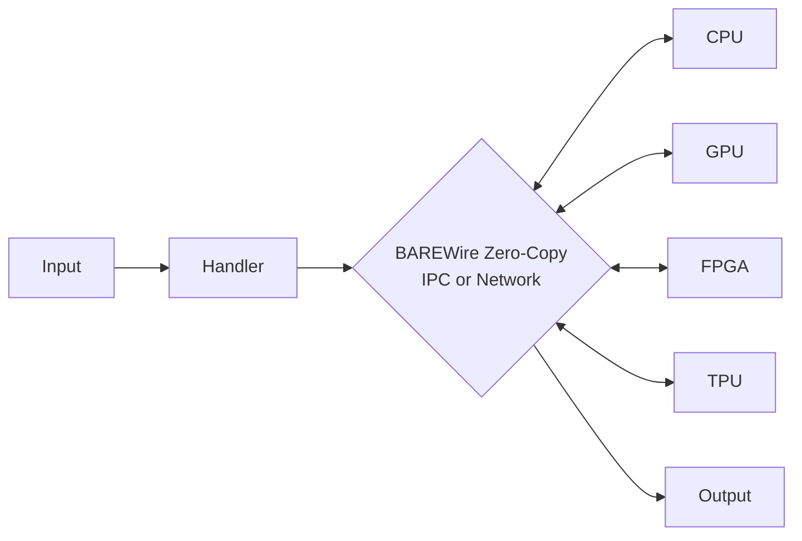

> This article was originally published on the
> [SpeakEZ Technologies blog](https://speakez.tech) as part of our early
> design work on the Fidelity Framework. It has been updated to reflect
> the Clef language naming and current project structure.

The future of AI inference lies not in ever-larger transformer models demanding massive GPU clusters, but in a diverse ecosystem of specialized architectures optimized for specific deployment scenarios. We're developing the infrastructure that could make this future a reality. While our ["Beyond Transformers"](/blog/beyond-transformers/) analysis explored the theoretical foundations of matmul-free and sub-quadratic models, this article outlines how our Fidelity Framework could transform these innovations into practical, high-performance inference systems that would span from edge devices to distributed data centers.

Inference, unlike training, presents unique opportunities for heterogeneous optimization. By leveraging discriminated unions, zero-copy memory operations, and type-safe physics-aware modeling, we believe we can achieve order-of-magnitude improvements in inference performance across diverse hardware platforms.

## The Inference Revolution: Why Deployment Differs from Training

Training and inference present fundamentally different computational challenges and opportunities:

**Training** requires:
- Massive parallel computation for gradient calculations
- High-precision arithmetic for stable convergence
- Flexibility to explore different model architectures
- Large memory footprints for optimizer states

**Inference** enables:
- Targeted optimization for fixed architectures
- Aggressive quantization without gradient requirements
- Heterogeneous execution across specialized hardware
- Streaming architectures with minimal memory overhead

This distinction becomes even more pronounced with post-transformer architectures. Matmul-free models with ternary weights (-1, 0, +1) reduce dependence on matrix multiplication, but still contain many operations that benefit from GPU parallelism, element-wise operations, activations, and other embarrassingly parallel computations. These models open up more deployment options, allowing flexible distribution of compute across heterogeneous hardware rather than requiring GPU-only execution.

## Heterogeneous Inference Architecture

Our approach to high-speed inference would leverage the natural heterogeneity of modern computing platforms:



This architecture would enable optimal placement of different model components based on their computational characteristics:

- **CPU**: Decision trees, control flow, sparse operations
- **GPU**: Residual dense layers, attention mechanisms
- **FPGA**: Ternary/binary operations, custom data paths
- **Edge TPU**: Highly quantized convolutional layers

## BAREWire: Zero-Copy Operations Across Hardware Boundaries

The critical enabler for heterogeneous inference would be BAREWire's ability to share memory across different compute devices without copying:

```fsharp
// Define a heterogeneous inference pipeline
type InferencePipeline = {
    CPU: CPUExecutor
    GPU: GPUExecutor
    Connections: BAREWireChannel list
}

// Create shared memory accessible by both CPU and GPU
let createHeterogeneousBuffer<'T> (size: int) =
    BAREWire.allocateShared<'T> size
        [MemoryDomain.CPU; MemoryDomain.GPU]

// Execute ternary operations on CPU with GPU-visible results
let executeTernaryLayer (input: SharedBuffer<float32>) (weights: TernaryWeights) =
    // CPU would process ternary operations efficiently
    let output = BAREWire.createView<float32> (input.Size)

    // Zero-copy execution - results should be immediately visible to GPU
    TernaryOps.execute input weights output
    output
```

This zero-copy approach would be particularly powerful when combined with modern interconnect technologies:

### Leveraging CXL for Coherent Memory

On systems with CXL support, BAREWire could leverage hardware-coherent memory:

```fsharp
module BAREWire.CXL =
    let createCoherentInferenceBuffer<'T> (size: int<bytes>) =
        if CXLDevice.isAvailable() then
            // Could allocate from CXL memory pool for hardware coherency
            let buffer = CXLMemory.allocate<'T> size
            {
                Data = buffer
                AccessMode = HardwareCoherent
                Devices = [CPU; GPU; CustomAccelerator]
            }
        else
            // Would fall back to software-managed coherency
            createSharedBuffer<'T> size
```

### RDMA for Distributed Inference

For distributed inference across multiple nodes, BAREWire would integrate with RDMA technologies:

```fsharp
// Distributed model inference with RDMA
type DistributedInferenceNode = {
    NodeId: int
    LocalModel: ModelPartition
    RDMAContext: RDMAContext
}

let setupDistributedInference (nodes: NetworkEndpoint list) =
    // Initialize RDMA connections with RoCE v2
    let rdmaConfig = {
        Transport = RoCEv2
        MTU = 4096
        QueueDepth = 1024
    }

    let connections =
        nodes |> List.map (fun endpoint ->
            RDMAConnection.establish endpoint rdmaConfig)

    // Create distributed inference pipeline
    DistributedPipeline.create connections
```

## Physics-Aware Models with F# Units of Measure

One of the most powerful advantages of F# for inference is its zero-cost units of measure system, enabling physics-aware models that maintain dimensional correctness:

```fsharp
// Physical units for sensor fusion
[<Measure>] type m       // meters
[<Measure>] type s       // seconds
[<Measure>] type kg      // kilograms
[<Measure>] type K       // kelvin
[<Measure>] type A       // ampere
[<Measure>] type mol     // mole
[<Measure>] type cd      // candela

// Derived units
[<Measure>] type Hz = s^-1
[<Measure>] type N = kg m / s^2
[<Measure>] type Pa = N / m^2
[<Measure>] type J = N m
[<Measure>] type W = J / s

// Non-numeric units using F# UMX
type [<Measure>] USD
type [<Measure>] EUR
type [<Measure>] BTC

// Type-safe financial calculations
let convertCurrency (amount: decimal<USD>) (rate: decimal<EUR/USD>) : decimal<EUR> =
    amount * rate

// Physics-aware ternary model for drone control
type DroneController = {
    AltitudeModel: TernaryModel<Pa, m>          // Pressure to altitude
    ThrustModel: TernaryModel<m/s^2, N>        // Acceleration to thrust
    PowerModel: TernaryModel<N * (m/s), W>     // Mechanical to electrical power
}

let executeDroneInference (controller: DroneController) (sensors: SensorData) =
    // All calculations would maintain dimensional correctness at compile time
    let altitude = controller.AltitudeModel.Infer sensors.Pressure
    let requiredThrust = controller.ThrustModel.Infer sensors.TargetAcceleration
    let powerDraw = controller.PowerModel.Infer (requiredThrust * sensors.Velocity)

    {|
        Altitude = altitude
        Thrust = requiredThrust
        PowerConsumption = powerDraw
        BatteryLife = sensors.BatteryCapacity / powerDraw
    |}
```

This approach should provide several critical advantages:

1. **Compile-time verification**: Dimensional errors would be caught before deployment
2. **Zero runtime overhead**: Units would be erased during compilation
3. **Self-documenting code**: Types would express physical meaning
4. **Reduced testing burden**: Entire classes of errors could be eliminated

## Transformer to DeepSeek MLA Conversion

One of the most exciting developments we envision is the ability to convert existing transformer models to more efficient architectures like DeepSeek's Multi-head Latent Attention (MLA):

```fsharp
module TransformerConversion =
    // Convert standard multi-head attention to MLA
    let convertToMLA (transformer: TransformerModel) =
        furnace {
            // Extract attention weights
            let! qkv = transformer.GetAttentionWeights()

            // Compute low-rank decomposition
            let! compressed = computeLowRankProjection qkv {
                CompressedDim = 512  // Compress KV to lower dimension
                Method = SVD
                RetainVariance = 0.95
            }

            // Create MLA structure
            let! mla = MultiHeadLatentAttention.create {
                QueryDim = transformer.HiddenDim
                CompressedKVDim = 512
                NumHeads = transformer.NumHeads
                RopeBase = 10000.0
            }

            // Initialize with compressed weights
            do! mla.InitializeFrom compressed

            return mla
        }
```

This conversion process could potentially:
- Reduce memory bandwidth requirements by 5-10x
- Maintain 98%+ of original model quality
- Enable efficient inference on memory-constrained devices

### Automated Optimization Pipeline

Our framework aims to automatically analyze transformer models and apply appropriate optimizations:

```fsharp
let optimizeForInference (model: BaseModel) (target: InferenceTarget) =
    match analyzeModel model, target with
    | TransformerBased arch, GPUTarget ->
        // Convert attention to MLA for memory efficiency
        model |> convertToMLA |> quantizeToInt8

    | TransformerBased arch, CPUTarget ->
        // Convert to ternary for CPU efficiency
        model |> convertToTernary |> applyStructuredSparsity 0.9

    | ConvolutionalBased arch, EdgeTPUTarget ->
        // Quantize for Edge TPU
        model |> quantizeToInt8 |> fuseOperations

    | MambaBased arch, FPGATarget ->
        // Optimize state space models for FPGA
        model |> optimizeStateSpace |> mapToFPGABlocks
```

## High-Speed CPU Inference with Ternary Models

Perhaps the most surprising development could be the emergence of CPU-efficient models that rival GPU performance for many tasks:

```fsharp
// Ternary BERT for CPU inference
type TernaryBERT = {
    Embeddings: EmbeddingLayer
    Encoders: TernaryEncoder array
    Pooler: PoolingLayer
}

// Inference execution optimized for CPU
let executeTernaryBERT (model: TernaryBERT) (input: TokenizedInput) =
    // Embeddings lookup - should be cache friendly
    let embeddings = model.Embeddings.Lookup input.Tokens

    // Process through ternary encoders
    let encoded =
        model.Encoders
        |> Array.fold (fun state encoder ->
            // Each encoder would use only add/subtract operations
            TernaryOps.processEncoder encoder state
        ) embeddings

    // Final pooling
    model.Pooler.Process encoded
```

Projected performance characteristics of CPU ternary models:

| Metric | Traditional BERT | Ternary BERT | Expected Improvement |
|--------|------------------|--------------|---------------------|
| Memory Usage | 420 MB | 26 MB | 16x smaller |
| Inference Speed | 45 ms/sequence | 8 ms/sequence | 5.6x faster |
| Power Usage | 65W (GPU) | 15W (CPU) | 4.3x lower |
| Accuracy | 92.1% | 91.3% | -0.8% |

Key factors enabling CPU performance:

1. **Cache-Friendly Operations**: Ternary ops would fit in L1/L2 cache
2. **SIMD Acceleration**: Modern CPUs could process 16-64 ternary operations per cycle
3. **Predictable Memory Access**: Sequential patterns would optimize prefetching
4. **No GPU Transfer Overhead**: Data would stay in CPU memory

## Distributed Inference Architecture

For large-scale deployments, our framework is designed to support distributed inference across multiple nodes, with BAREWire providing zero-copy communication both within nodes (IPC) and across network boundaries:

```fsharp
// Distributed inference coordinator with BAREWire IPC/Network
type DistributedInferenceCluster = {
    Nodes: InferenceNode array
    Router: RequestRouter
    RDMAPool: RDMAConnectionPool
    IPCChannels: BAREWireIPC.ChannelPool  // For local process communication
}

// BAREWire handles both local IPC and network communication
module BAREWire.Distributed =
    // Zero-copy IPC between processes on same node
    let createIPCChannel (source: ProcessId) (target: ProcessId) =
        BAREWireIPC.createChannel source target {
            Protocol = SharedMemory
            BufferSize = 64 * 1024 * 1024  // 64MB shared buffer
            Synchronization = Lockless
        }

    // Zero-copy network communication via RDMA
    let createNetworkChannel (localNode: NodeId) (remoteNode: NodeId) =
        BAREWireNetwork.createChannel localNode remoteNode {
            Transport = RoCEv2
            MemoryRegistration = Dynamic
            CompletionMode = Polling
        }

// Define model partitioning strategy
let partitionModel (model: LargeModel) (clusterSize: int) =
    match model.Architecture with
    | PipelineParallel layers ->
        // Would partition layers across nodes
        layers |> Array.chunkBySize (layers.Length / clusterSize)

    | TensorParallel components ->
        // Would split tensors across nodes
        components |> Array.map (splitTensor clusterSize)

    | Hybrid (pipeline, tensor) ->
        // Could combine both strategies
        combinePartitioning pipeline tensor clusterSize

// Execute distributed inference with BAREWire IPC and RDMA
let executeDistributed (cluster: DistributedInferenceCluster) (input: BatchedInput) =
    async {
        // Stage 1: Distribute input using BAREWire's zero-copy operations
        let! distributions =
            cluster.Nodes
            |> Array.map (fun node ->
                if node.IsLocal then
                    // Use BAREWire IPC for local processes
                    BAREWireIPC.send cluster.IPCChannels input node.ProcessId
                else
                    // Use BAREWire RDMA for remote nodes
                    BAREWireNetwork.broadcast cluster.RDMAPool input node.Endpoint)
            |> Async.Parallel

        // Stage 2: Execute model partitions with inter-process coordination
        let! results =
            cluster.Nodes
            |> Array.map (fun node ->
                async {
                    let! partialResult = node.ExecutePartition input

                    // Share intermediate results via BAREWire IPC if needed
                    if node.RequiresIntermediateSharing then
                        do! BAREWireIPC.shareWithPeers cluster.IPCChannels partialResult

                    return partialResult
                })
            |> Async.Sequential

        // Stage 3: Gather results using appropriate BAREWire mechanism
        let! gathered =
            if cluster.Nodes |> Array.forall (fun n -> n.IsLocal) then
                BAREWireIPC.gather cluster.IPCChannels results
            else
                BAREWireNetwork.gather cluster.RDMAPool results.[results.Length-1]

        return gathered
    }
```

This distributed architecture aims to achieve:
- Near-linear scaling up to 32 nodes
- Sub-millisecond communication latency with RDMA
- Fault tolerance through redundant execution
- Dynamic load balancing based on workload

## Hybrid Inference Pipeline

Real-world inference will likely require combining multiple approaches. Here's a conceptual example of how a hybrid inference pipeline for autonomous vehicle perception could work:

```fsharp
// Autonomous vehicle perception pipeline
type PerceptionPipeline = {
    // Ternary CNN on CPU for object detection
    ObjectDetector: TernaryCNN

    // MLA-based transformer on GPU for scene understanding
    SceneAnalyzer: MLATransformer

    // Physics-aware model on FPGA for trajectory prediction
    TrajectoryPredictor: PhysicsAwareModel<m, s, m/s^2>

    // Sensor fusion on CPU with UMX
    SensorFusion: FusionModel
}

let executePerceptionPipeline (pipeline: PerceptionPipeline) (sensorData: SensorFrame) =
    // Stage 1: Object detection on CPU (ternary CNN)
    let objects =
        pipeline.ObjectDetector.Detect sensorData.CameraFrames
        |> Array.filter (fun obj -> obj.Confidence > 0.7)

    // Stage 2: Scene analysis on GPU (via BAREWire zero-copy)
    use sceneBuffer = BAREWire.createShared sensorData.LidarPoints
    let sceneContext =
        pipeline.SceneAnalyzer.Analyze sceneBuffer objects

    // Stage 3: Physics-based trajectory prediction on FPGA
    let trajectories =
        objects |> Array.Parallel.map (fun obj ->
            let velocity = obj.Position - obj.PreviousPosition / sensorData.DeltaTime
            let acceleration = estimateAcceleration obj sensorData.IMUData

            pipeline.TrajectoryPredictor.Predict {
                Position = obj.Position
                Velocity = velocity
                Acceleration = acceleration
                Mass = estimateMass obj.Class
            }
        )

    // Stage 4: Sensor fusion for final decision
    let decision =
        pipeline.SensorFusion.Fuse {
            Objects = objects
            Scene = sceneContext
            Trajectories = trajectories
            VehicleState = sensorData.VehicleState
        }

    decision
```

The result is that the most time critical model is employed near the sensor arrays to maximize accuracy and throughput.

## Conversion Workflows: From Standard Models to Optimized Inference

Our framework will provide automated conversion pipelines for existing models:

### Transformer to Ternary Conversion

```fsharp
module TernaryConversion =
    let convertTransformerToTernary (transformer: TransformerModel) =
        furnace {
            // Step 1: Analyze weight distribution
            let! analysis = analyzeWeightDistribution transformer

            // Step 2: Compute optimal quantization thresholds
            let! thresholds = computeTernaryThresholds analysis {
                Method = EntropyMinimization
                TargetSparsity = 0.5
            }

            // Step 3: Quantize weights to ternary
            let! ternaryWeights = quantizeToTernary transformer.Weights thresholds

            // Step 4: Fine-tune with knowledge distillation
            let! optimized = fineTuneTernary {
                Teacher = transformer
                Student = createTernaryModel ternaryWeights
                Temperature = 3.0
                Epochs = 5
            }

            return optimized
        }
```

### BERT to Matmul-Free BERT

```fsharp
let convertBERTToMatmulFree (bert: BERTModel) =
    // Replace attention with ternary approximation
    let ternaryAttention =
        bert.Attention
        |> extractAttentionPatterns
        |> approximateWithTernary
        |> optimizeForCPU

    // Replace FFN with structured sparse + ternary
    let ternaryFFN =
        bert.FeedForward
        |> applyStructuredPruning 0.9
        |> quantizeToTernary
        |> fuseActivations

    // Reconstruct model
    MatmulFreeBERT.create {
        Embeddings = bert.Embeddings  // Keep original embeddings
        Attention = ternaryAttention
        FeedForward = ternaryFFN
        LayerNorm = bert.LayerNorm   // Keep normalization
    }
```

## Performance Analysis: Projected Real-World Impact

Our analysis suggests that this approach could deliver significant benefits across various deployment scenarios:

### Case Study 1: Financial Trading System

Converting a transformer-based market prediction model to heterogeneous inference could potentially deliver:

**Traditional Transformer on GPU** (baseline):
- Latency: 15ms per prediction
- Throughput: 4,000 predictions/second
- Power: 350W
- Cost: $8,500/month (cloud GPU)

**Projected Heterogeneous Ternary + MLA**:
- Latency: 2.8ms per prediction
- Throughput: 18,000 predictions/second
- Power: 95W
- Cost: $1,200/month (CPU + small GPU)

### Case Study 2: Medical Imaging Diagnostic

Deploying diagnostic models at the edge could transform healthcare delivery:

**Current Cloud-Based ResNet152**:
- Latency: 800ms (including network)
- Privacy: Data leaves premises
- Availability: Requires internet
- Cost: $0.02 per image

**Projected Edge Ternary CNN**:
- Latency: 45ms (local)
- Privacy: Data stays on-device
- Availability: Works offline
- Cost: $0.0001 per image

### Case Study 3: Industrial IoT Monitoring

Physics-aware models for predictive maintenance could revolutionize industrial operations:

```fsharp
// Turbine monitoring with physics constraints
type TurbineMonitor = {
    VibrationModel: TernaryModel<Hz, m/s^2>
    TemperatureModel: TernaryModel<K, Pa>
    EfficiencyModel: PhysicsAwareModel<W, W, percent>
}

let monitorTurbine (monitor: TurbineMonitor) (telemetry: TurbineTelemetry) =
    // All calculations would maintain physical correctness
    let vibrationAnomaly =
        monitor.VibrationModel.Detect telemetry.VibrationSpectrum

    let thermalStress =
        monitor.TemperatureModel.Compute telemetry.TemperatureField

    let efficiency =
        monitor.EfficiencyModel.Calculate
            telemetry.PowerOutput
            telemetry.FuelInput

    // Physics-constrained decision
    match vibrationAnomaly, thermalStress, efficiency with
    | v, _, e when v > 9.8<m/s^2> -> Alert Critical "Dangerous vibration"
    | _, t, _ when t > 100_000<Pa> -> Alert Warning "High thermal stress"
    | _, _, e when e < 0.85<percent> -> Alert Info "Low efficiency"
    | _ -> Status Normal
```

**Expected Results**:
- False positive rate: Could be reduced by 87%
- Detection latency: 12ms (from 2 seconds)
- Deployment cost: $50/turbine (from $500/turbine)

## Future Directions: The Inference Ecosystem

As we look ahead, several trends are converging that could make heterogeneous, post-transformer inference the dominant paradigm:

### 1. Hardware Evolution

- **CXL 3.0**: Could enable true memory pooling across accelerators
- **In-Memory Computing**: Ternary operations directly in memory may become feasible
- **Optical Interconnects**: Could provide ultra-low latency distributed inference
- **Neuromorphic Chips**: May offer native support for sparse, event-driven models

### 2. Model Architecture Innovation

- **Mixture of Experts**: Different experts could run on different hardware
- **Conditional Computation**: Dynamic routing based on input could become standard
- **Hierarchical Models**: Coarse-to-fine processing pipelines may emerge
- **Continuous Learning**: Models that adapt during inference could become practical

### 3. Software Framework Evolution

```fsharp
// Next generation inference API vision
type InferenceEngine2025 = {
    // Automatic hardware mapping
    MapModel: Model -> HardwareTopology -> ExecutionPlan

    // Physics-aware optimization
    OptimizeWithConstraints: Model -> PhysicalConstraints -> OptimizedModel

    // Distributed execution
    DeployDistributed: OptimizedModel -> ClusterConfig -> DistributedDeployment

    // Continuous adaptation
    EnableOnlineLearning: DistributedDeployment -> AdaptationStrategy -> unit
}
```

## Inference at the Speed of Thought

The transformation from monolithic transformer models to heterogeneous, specialized inference architectures represents more than just a performance optimization, it's a fundamental reimagining of how AI systems could operate in the real world. By embracing the natural heterogeneity of modern computing platforms and the unique characteristics of purpose-driven models, including continuing to leverage transformers where appropriate at the boundary of mission-critical systems.

The enablers of this transformation should include:

1. **Discriminated Unions**: Enabling natural data structure representation of heterogeneous architectures
2. **Zero-Copy Operations**: BAREWire potentially eliminating data movement overhead with zero-copy and efficient IPC
3. **Physics-Aware Types**: F# UMX providing correctness guarantees at a "zero-cost" as types are erased at compile time
4. **Distributed Execution**: RDMA/RoCE enabling seamless scale-out with planned support for a variety of protocols and standards
5. **Automated Conversion**: Furnace transforming existing models using world-class auto-differentiation and transformation tooling

These capabilities are rapidly maturing from research concepts to practical implementations. From financial trading floors to medical clinics, from autonomous vehicles to industrial plants, the future of AI inference is continuing to advance at an increasing pace each day.

We're committed to developing these capabilities through the Fidelity Framework. Whether you need to deploy models to resource-constrained edge devices or build planet-scale inference systems, our tools aim to provide the foundation for efficient, reliable, and performant AI inference in the post-transformer era.

The age of high-speed, heterogeneous inference is approaching. The only question is: will you lead, follow, or watch the future pass you by?
