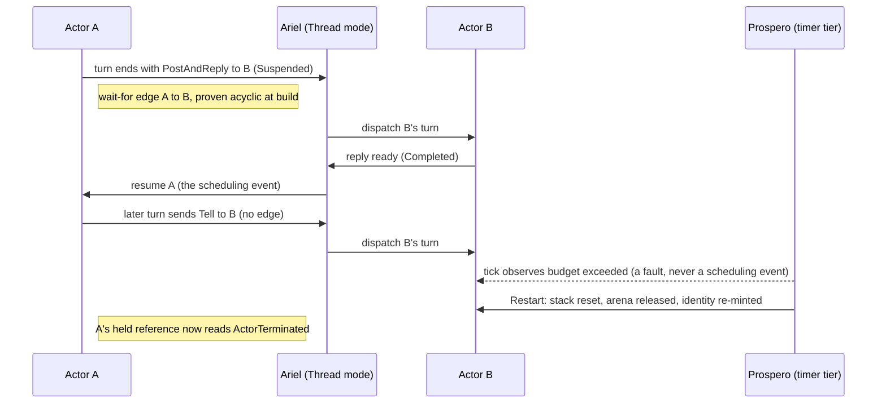
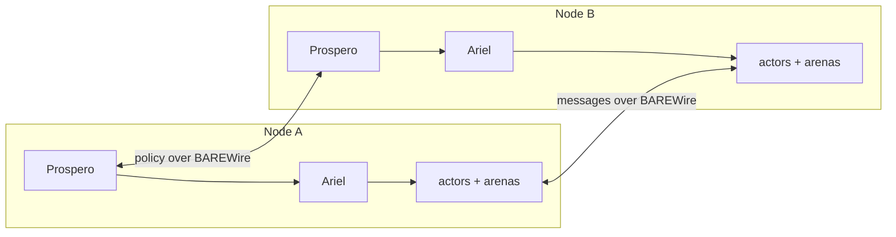

Ask three developers where the scheduler lives in their stack and you'll get three honest answers that barely overlap. The systems programmer wrote it, or at least wired it: an epoll or io_uring loop, a thread-per-core layout, capacities provisioned at boot from numbers somebody chose. The .NET developer building on Akka.NET configured it: dispatcher throughput settings tuned over a runtime thread pool the framework rides rather than owns. The Elixir developer inherited the best one in the business and can tell you exactly how it works: the BEAM's preemptive reduction counting is the part of that platform its community brags about first, and with justification.

Here's the part that might seem too obvious to write down: in all three stacks the scheduler is load-bearing for every liveness property the system has, and in only one of them does it have a name, a boundary, and semantics anyone can cite. That gap is the subject of this post. In our own project, closing it was recognition rather than invention: the component was always there, and it has now taken a formal name in the pantheon.

## The Third Name

Clef's actor system has carried two names through everything we've published: [Olivier](/docs/design/concurrency/the-three-layer-actor-contract/), the actor runtime that defines what an actor is, and [Prospero](/docs/design/memory/raii-in-olivier-and-prospero/), the supervisor that decides what should happen, from restart strategies to arena lifecycles. The component that makes those decisions happen *in time* has been in the architecture all along, billed under Prospero's name. It selects which ready actor runs next and delivers each resume. Formal standing followed from a recognition: scheduling has modes of its own. Olivier's semantics hold unchanged on every target, while dispatch is realized differently on each, cooperative on a single core, federated across a package, borrowed from a host kernel. A concern that varies where the actor model holds still is a concern with its own boundary, so it now carries its own name: Ariel. Olivier defines what an actor is, Prospero decides what should happen, and Ariel makes it happen in time.

The name earns its keep the same way the others did. In the play, Ariel acts only on Prospero's instruction and is visible to no one else on the island, and we've made that architecture rather than allusion: Ariel has no user-facing API. Actors never address the scheduler. Its only clients are Prospero and our Composer compiler, which is a design position with teeth, because in every runtime whose scheduler grew a rich user-facing surface, application code has fused to dispatch mechanics one convenient call at a time.

## Obligations Precede Names

For a long while my working assumption was that a scheduler would simply fall out of principled structure, and the assumption was half right. Structure decides *eligibility*. Our compiler classifies regions off the dependency graph, the escape analysis places values, and the [wait classification](/spec/draft/synchronous-rpc-liveness/) knows at compile time which calls suspend. What structure cannot decide is *order under scarcity*: which ready actor runs next, what happens at saturation, whose delivery is admitted when capacity runs tight. Those depend on runtime facts no compile-time analysis sees.

What forced the naming was watching obligations accumulate against a component that had never been given a boundary of its own. The [deadlock-freedom work](/docs/design/concurrency/deadlock-freedom-as-an-obligation/) discharges acyclicity of the wait-for relation as a solver obligation, and acyclicity rules out the cycle, but turning "no cycle" into "the reply arrives" needs fairness, a premise about dispatch. A proof premise has to cite something with a name. Supervision has to keep working at saturation, or a restart competes with the very traffic jam it exists to clear. Deterministic replay, the discipline that makes an actor system testable seed-for-seed, is a property of whoever interprets suspension and resumption. Three obligations were pointing at an anonymous spot in the architecture. Components in this project take formal standing when they acquire obligations, and that's precisely how Prospero earned its own name.

So Ariel enters the [specification](/spec/draft/scheduler-contract/) as six clauses rather than a mechanism:

| Clause | One line |
|---|---|
| Fairness | every ready actor is dispatched within a finite number of scheduling events |
| Turn discipline | a turn runs to completion under a budget, and exhausting the budget is a fault, never a scheduling event |
| Control-plane immunity | supervision, timers, and reference-state upkeep stay executable when the data plane is saturated |
| Admission | delivery is accepted or visibly refused, and a receiver's backpressure never becomes the sender's memory growth |
| Determinism mode | swap the sources of time and arrival, and identical sources yield identical dispatch |
| Assumption manifest | each implementation publishes what it proves itself and what it borrows from beneath |

## Where the Contract Meets Silicon

The systems reader has already spotted what those clauses cost, because the systems reader has hand-built each one. Here is where our answer diverges from bench-built runtimes: the same contract holds from bare silicon to spanning hosts, and only the assumption set changes.

At the bottom sits the freestanding profile, the [pure-Clef unikernel](/docs/internals/hardware/fidelity-on-mcu/) our [Post-Quantum Credential](/blog/cryptographic-certainty/) work aims straight at the reset vector on a Cortex-M33. Our spec already held, before Ariel had a name, that on a single-core target [the suspend/resume semantics become the cooperative scheduler](/spec/draft/dcont-representation/): resume is the scheduling event, and the interrupt-to-continuation binding is dispatch. Down there the contract names the discipline the reduction preserves rather than adding mechanism, so the smallest Ariel assumes almost nothing beyond a hardware timer and every clause of it sits in the audited source, the same source the verifier sees. For a credential device whose trusted computing base has to be the audited source and nothing under it, a scheduler you can read clause by clause is a security property, and we state it as one in the contract. Even the elevated thread survives the reduction: with one core, Prospero's elevation is the interrupt controller's, supervision running at exception priority above the dispatch loop, armed before the first turn ever runs.

Climbing the stack, the assumption set grows and the manifest records the growth. A microVM Ariel discharges turn discipline and admission itself while assuming vCPU progress against a quota it can *name* from the deployment spec. A container Ariel assumes a budget it can only *observe*, since cgroup throttling arrives as jumps in time. At the hosted tier, fairness is inherited wholesale from the OS or managed runtime, and Ariel supplies ordering and admission above it. The design intent is that our Composer would also emit the companion capacity manifest a freestanding image provisions from, mailbox depths and pool sizes derived from escape classification and arena extents, so nobody has to be the person who guessed 256.

In our current design thinking the assumption manifest is an ordinary Clef value, and the exposure axis reads directly off it. Two instances carry the contrast between the bottom of the stack and the top:

```fsharp
type Discharge =
    | Proven                        // this implementation discharges the clause itself
    | Assumed of substrate: string  // inherited; the manifest names the lender

type AssumptionManifest = {
    Profile:   Profile              // Freestanding | MicroVm | Container | Hosted | Simulated
    Authority: Authority            // Sovereign | Federated | Replicated
    Clauses:   Map<ClauseId, Discharge>
}

let freestanding = {
    Profile   = Freestanding
    Authority = Sovereign
    Clauses   =
        [ Fairness,             Proven      // interrupt binding is dispatch
          TurnDiscipline,       Proven
          ControlPlaneImmunity, Proven
          Admission,            Proven      // capacities from the compiler's manifest
          Determinism,          Proven ]
        |> Map.ofList
}

let hosted = {
    Profile   = Hosted
    Authority = Sovereign
    Clauses   =
        [ Fairness,             Assumed "the OS scheduler"
          TurnDiscipline,       Proven      // atomicity as the program observes it
          ControlPlaneImmunity, Proven
          Admission,            Proven
          Determinism,          Proven ]
        |> Map.ofList
}
```

The hosted value is honest about what it borrows. A dispatcher-tuning guide is what developers write when this record has no artifact of its own.

## The Ask Is the Only Edge

Aaron Stannard spent years teaching .NET developers the ask/tell distinction, that `Tell` is the natural actor primitive and `Ask` is the expensive blocking exception to reach for knowingly. That pedagogy is correct, and in Clef the advice becomes structure: a [`Tell` adds no wait-for edge, and only a synchronous reply-wait, `PostAndReply` in Clef, creates one](/spec/draft/synchronous-rpc-liveness/). The deadlock analysis has a tractable object precisely because the edge set is generated by one construct family our compiler classifies at every call site, and the one statically unresolvable case lowers to a supervised call under an explicit timeout. What a veteran taught as discipline, our compiler now checks as graph structure.

The same reasoning applies to the dispatch layer. Dispatcher tuning in a hosted actor framework is folklore for a structural reason: the scheduler underneath is a tenant of the runtime's thread pool, with no contract from below to tune against. Ariel's manifest is the missing document, the written record of which guarantees the layer beneath actually extends.

## Preemption Belongs Above the Turn

The BEAM preempts by reduction counting, and for its world, dynamically typed code from many teams sharing long-lived nodes, that is the right call, proven across decades of telecom uptime. Ariel makes the opposite choice below and recovers the same protection above. Below the turn, execution is cooperative: a turn runs to completion under its budget, and the single-logical-thread guarantee of an actor rests on that atomicity. Above the turn, Prospero holds every preemptive remedy at lifecycle granularity: retire the actor, release its arena as a unit, restart from known state. Cooperative below the turn, preemptive above it.

The vocabulary we're sketching splits the same way the responsibility does. A turn ends in one of three ways, and only one of them belongs to the scheduler's dispatch loop. The other two are Prospero's to answer:

```fsharp
type TurnOutcome =                 // Ariel's side of the boundary
    | Suspended                    // parked; its resume is the next scheduling event
    | Completed                    // clean exit: actor and arena retire together
    | BudgetExhausted              // a fault, never a scheduling event

type Remedy =                      // Prospero's side of the boundary
    | Retire                       // release the arena as a unit
    | Restart                      // re-mints identity: old references read ActorTerminated
    | Hydrate                      // preserves identity: references stay Valid
 
```

The actor-reference sentinel our memory model already carries makes lifecycle-granularity preemption safe to perform. A reference into a retired actor reads `ActorTerminated` rather than dangling, so every holder observes the death instead of corrupting through it. Erlang taught the field that the corrupted process should crash and restart clean. Our design keeps that lesson and moves the enforcement into structures the compiler places.

A complete workload shows what cooperative turn scheduling costs the developer, so here is an echo handler, one connection per actor, written the way anyone would want to write it:

```fsharp
// a complete echo handler: one connection, one actor
let echo (conn: Connection) = async {
    let mutable live = true
    while live do
        let! bytes = conn.Receive()      // a turn ends here; the arrival resumes it
        if bytes.Length = 0 then
            live <- false                // peer closed
        else
            do! conn.Send bytes          // parks again until the send completes
}
```

There is no scheduling vocabulary in it because there is nothing to call. Each `let!` and `do!` is a suspension point the [computation expression lowers to a continuation](/docs/design/concurrency/delimited-continuations/), so the straight-line loop compiles into the very state machine a systems programmer flattens by hand in a language without the lowering: park on receive, resume on arrival, park on send, resume on completion, and a clean exit that retires actor and arena together. Those discovered turns are exactly what Ariel is being designed to dispatch. The developer wrote a while loop.

Types are the still photograph. A scheduling exchange is the film, and one exchange exercises the division of labor end to end: an ask that parks a caller, a resume that wakes it, and a later turn that exhausts its budget and meets the remedy from above.



The machinery beneath this is honestly imperative, and deliberately so, contained in the runtime's own layer the way the register-poke core of our [XOR case study](/blog/xor-a-post-quantum-case-study/) is contained at the MMIO layer. On the freestanding profile the two tiers read the way they would run:

```fsharp
// Thread mode: the dispatch loop is the entire foreground
let rec run () =
    match nextReady () with
    | Some actor ->
        beginTurn actor                      // budget clock starts here
        match dispatch actor with            // one turn, run to completion
        | Suspended       -> ()              // parked; its resume will re-queue it
        | Completed       -> retire actor    // arena released as a unit
        | BudgetExhausted -> ()              // owned above, never handled here
        run ()
    | None ->
        waitForInterrupt ()                  // idle; a resume arrives by interrupt

// Handler mode, reserved priority: the control plane reads every turn from above
let onTick () =
    expireSupervisedTimeouts ()              // the Unresolved residue meets its deadline
    match overBudget (currentTurn ()) with
    | Some actor -> escalate actor Restart   // stack reset, arena release, fresh identity
    | None       -> ()
```

Everything the dispatch loop touches is mechanism. Everything the tick handler decides is policy. And the systems reader will notice what sits between the two tiers: nothing, because the control plane reads turn state directly rather than queueing messages to itself, which is the immunity clause rendered as the absence of a data structure.

## Dispatch Stays Home

The far reach of a multi-target design is the part I've been circling for weeks, and one rule bounds it: a turn-granularity dispatch decision never crosses a latency domain. Within a domain, federation is real and asymmetric. A host package directing an accelerator fabric, or a performance-core cluster directing an efficiency-core cluster, is a parent Ariel granting a budget and a region while holding the subordinate to the same six clauses it answers to itself. Federation is contract recursion, and the schedulers coordinate over BAREWire with ordinary structured messages on the type-informed fabric, because a privileged side channel between schedulers would breach shared-nothing at the layer that enforces it.

Across a network boundary, Ariel replicates and Prospero spans. Each node runs a sovereign scheduler, and what crosses the wire is policy: supervision, placement, deadlines.



No edge connects the two Ariels. The absence is the rule, drawn on purpose.

## The Platform Engineer Objects

There's a fourth reader who has been waiting to raise a hand: the platform engineer, whose scheduler has had a name for a decade. Kubernetes named its scheduler, published its contract, and grew an extension ecosystem against it, and that history ratifies half of this post's argument on its own, since the named component with a stated contract is the one an ecosystem can safely build against. But look at what kube-scheduler actually decides. It binds a pod to a node, which is placement, and in this post's vocabulary placement is Prospero's concern. The in-time dispatch of a cluster never touches the wire: every node's kernel stays the sovereign scheduler of its own cores, and no cluster-level component hands out a time slice remotely. The industry's largest distributed system already runs under the rule drawn above. Policy crosses the network. Dispatch stays home.

The declared-capacity half of this post is familiar territory there too. Cluster scheduling is bin-packing against `resources.requests` that somebody typed in, and the numbers are guesses often enough that a tool category exists to re-derive them empirically. The capacity manifest our Composer would emit is that declaration with the guessing removed: mailbox depths and pool sizes as analysis outputs.

## A Letter to a Sleeping Actor

For the furthest reach, we imagine a fifth reference state, `Dormant`, alongside the four the sentinel already carries:

```fsharp
type ReferenceState =
    | Valid              // live actor, current identity
    | Dormant            // proposed: identity current, execution at rest
    | ActorTerminated    // a restart re-minted identity; failure is observable here
    | ProcessUnavailable
    | Unknown
```

A dormant actor has current identity and execution state at rest. A message sent to one would be admitted at the actor's own mailbox, because in this design the mailbox precedes the actor, and admission would raise a control-plane doorbell to the resident Prospero on the actor's home node. That Prospero would decide hydration under a budget symmetric with its restart budget and hand the initialization turn to its local Ariel. The sender neither observes nor orchestrates any of this, on the same node or across a wire.

Two boundaries keep the idea from dissolving into an activation framework of the familiar kind. The supervisor holds the doorbell and never the mail: data-plane messages routed through the control plane would quietly convert Prospero into a queueing system, and the immunity clause exists to keep those planes apart. And identity carries the semantics: hydration preserves an actor's identity, so the sleep reads as a scheduling delay, while a crash restart re-mints identity, so failure stays observable to every reference holder. Platforms that blur those two events into one transparent activation gave up the visibility that supervision depends on, and that visibility is the OTP inheritance we are least willing to spend.

The cluster world already runs both sides of this line at pod granularity. Scale-to-zero platforms like Knative hold a doorbell of their own, an activator that admits a request and signals for capacity, though it deliberately buffers the request while the pod arrives, a data-plane load the component must then be scaled to carry. Keeping the message in the actor's own bounded mailbox is our answer to exactly that accumulation. And the split between a Deployment's interchangeable replicas and a StatefulSet's stable identities is the re-minted-versus-preserved line, drawn at coarser grain.

State at rest would be a BAREWire layout that hydration maps back by construction, and on the credential-class profile, hydration could only activate capacity the build already provisioned. All of this is the design conversation as it stands, tied off here so the rest of the post stays on ground we've already staked.

## The Contract Is the Deliverable

I started this exercise assuming the scheduler was the least interesting part of the runtime, a mechanism that principled structure would produce as a byproduct. I now think the opposite, and it took the smallest computer on my bench to teach me: on the M33 there is nothing underneath, and runtime progress rests on the component I couldn't point at. What naming Ariel adds to our Fidelity framework is a citable premise under every liveness claim we make, one contract with an assumption manifest that records, per target, which guarantees are proven and which are borrowed. The spec text is [drafted](/spec/draft/scheduler-contract/), the design exposition sits [alongside Olivier and Prospero](/docs/design/concurrency/ariel-under-prospero/) where it belongs, and we'll keep reporting as we take the clauses to hardware.
