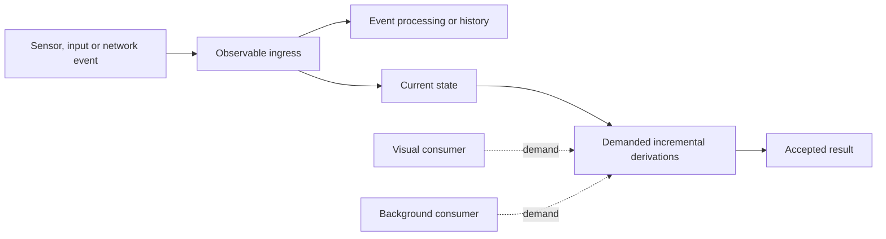

Close the chart on an instrument panel and the recorder should keep collecting samples. Open it again and you want current data without rebuilding the application. That small interaction gets at what we want from reactivity in Fidelity: control over which work stays active, which results stay cached and which resources a view releases when it closes.

Our starting point is `Incremental<'T>`. A derived computation can wait for demand and retain its result. It tracks the inputs it actually reads, so a change can invalidate the affected work. `Observable<'T>` complements that model at the event boundary, where a sensor reports measurements or a user issues commands on their own schedule.

We specify these behaviors as intrinsic parts of Clef in [Incremental Computation](/spec/draft/incremental-computation/), [Observable Computation](/spec/draft/observable-computation/) and [Reactive Signals](/spec/draft/reactive-signals/). Fidelity.UI is designed to use that foundation for control behavior and rendering. The compiler and target implementations will need to establish the corresponding guarantees as they develop.

[Ken Okabe's Timeline library](https://github.com/ken-okabe/timeline) has influenced our preference for concise reactive composition. Jimmy Byrd's [IcedTasks](https://github.com/TheAngryByrd/IcedTasks) provides an influential model of explicitly activated, reusable cold work. In Clef, we combine that activation discipline with incremental evaluation. Reusable cold work postpones execution. Caching a result and invalidating it when dependencies change require additional semantics.

[The Cold Half of Concurrency](/blog/cold-half-of-concurrency/) follows that ML lineage into actor-owned graphs, deferred demand and the cost of keeping a result ready.

## Deferred Computation

A derived value needs evaluation when a consumer requests a result and no current cached result is available. Changing an input can invalidate a cache while leaving evaluation deferred. When demand arrives, stabilization validates the required dependencies and recomputes affected values in dependency order.

After recomputation, a cutoff comparison can establish that the result remains unchanged and stop propagation along that path. Other changed dependencies still count. Suppose our panel combines a rounded temperature with an alarm indicator. Even if rounding leaves the temperature text unchanged, a changed alarm state still requires an update.

| Construct | Deferred work | Retained state |
|---|---|---|
| `Cold<'T>` | Execution until explicit activation | A work description without an implied result cache |
| `Lazy<'T>` | Evaluation until first demand | The computed result |
| `Incremental<'T>` | Evaluation until demand requires a current result | A cached result and its dependency and invalidation state |
| `Cold<Incremental<'T>>` | Construction of the incremental subgraph as well | A graph description until activation |

These choices affect storage as well as execution. Retaining a large result has a cost even while nobody reads it. Our [demand-registration contract](/spec/draft/incremental-computation/#63-demand-registration) specifies when incremental work becomes eligible for evaluation. The language still needs an evaluation rule for each construct. Ordinary expressions do not all become non-strict merely because incremental computation is our default design posture. Our [concurrency lineage]() follows the cold-work influence into the execution model.

## Events and State

Two equal temperature measurements may leave the displayed value unchanged. Two identical button presses may mean two commands. An observable carries occurrences, while a signal exposes current state for a computation to read.



For our instrument, the recorder might require every admitted sample while the chart displays a bounded aggregate. Coalescing chart updates is then a presentation policy. The recorder keeps its own delivery contract, with explicit choices about buffering and backpressure.

Under the [observable emission contract](/spec/draft/observable-computation/#42-emission), observables preserve occurrences unless the application selects an operator or policy that changes delivery. The incremental graph can reuse a result where its dependencies and cutoff justify reuse. Both behaviors are useful in the same application.

Consumers can share a producer or each own an independent execution. We can provision bounded observer storage for either arrangement. The sharing choice affects lifetime and isolation, while allocation and scheduling need their own design. A shared producer still consumes storage, and an independent subscriber need not acquire an actor.

## Reactive Vocabulary

The specified `Signal` / `Memo` / `Effect` surface gives us three familiar roles. A signal holds settable state. A memo exposes an incremental derivation, and an effect establishes an active consumer at an owned boundary.

Using that [specified surface](/spec/draft/reactive-signals/), a temperature projection would look like this:

```fsharp
let createTemperatureProjection () =
    let celsius = Signal.create 20.0
    let fahrenheit =
        Memo.create (fun () -> Signal.get celsius * 9.0 / 5.0 + 32.0)
    celsius, fahrenheit
```

Invoking the function would construct the source and derived node. Demanding the memo would require its current value. An event handler could update `celsius` while unused consumers remain dormant. The read inside the memo establishes its dependency. Capturing a signal handle for a later button handler has a different meaning from reading its value during derivation.

After admitting a display owner, we could attach an observer:

```fsharp
// Called inside the admitted owner's lifetime.
// presentTemperature is the application's output operation.
let observeTemperature fahrenheit presentTemperature =
    Effect.create (fun () ->
        presentTemperature (Memo.get fahrenheit))
```

`Effect.create` is specified to activate a sink. It runs initially and reacts to relevant changes under the stabilization contract. A cold UI description therefore defers the call until owned activation. The resulting effect belongs to that owner, which retires it through `Effect.dispose` and handles any pending work according to its lifetime policy.

We also need precise rules for initial effects and reentrant writes, including what happens on failure. `Batch.run` is a local stabilization boundary. Asynchronous continuations need an explicit return to the owner before publishing their results. Rollback and coordination across machines require separate protocols.

## Background Demand

The recorder gives us a reason to keep work active after the chart closes. Its service owner can continue consuming samples and updating a projection independently of the visual owner. That is an eager policy we can select over the same incremental machinery.

| Policy | Admitted work | State when the view opens |
|---|---|---|
| On demand | Required work when a consumer requests it | First-use preparation may be necessary |
| Retain a cache | Storage without continued evaluation | The result may need validation or recomputation |
| Keep current | Continued observation and selected derived work | Current data, with presentation preparation still possible |
| Prewarm | Scoped preparation before anticipated use | Reusable preparation where inputs and constraints remain valid |

Prewarming needs an owner and a budget. Preparing pure data is a different operation from opening a device or issuing a business command. We admit those effects explicitly. A current data projection also leaves presentation work to consider, such as loading fonts or preparing a display buffer.

Cold execution shifts some cost to first demand. On hardware we control, including a unikernel deployment, we can characterize that cost within a chosen operating envelope. We still have to measure it. For a panel that must switch views promptly, the useful comparison is first-use latency against the retained memory and background CPU cost of keeping selected work ready.

## Execution Ownership

Our baseline places many reactive nodes under one owner for local stabilization. An application can introduce actor boundaries where it needs serialized execution or an independent lifetime. Each boundary adds a communication contract.

That matters when two dependencies change together. Dependency-ordered stabilization can give a local consumer a coherent combination of derived values. Independent mailbox deliveries need additional coordination before the receiving owner publishes a coherent result.

In our [Braid design](), we connect sequential continuation structure with admitted parallel work. Its realizations must preserve the chosen activation and ownership rules, including dependencies and effects. The evaluation policy is an architectural choice. Continuations and interaction nets alone establish neither universal laziness nor the safety of parallel effects.

Closing a view has several consequences with different completion times. Detaching an observer ends its subscription. A generation check rejects a delayed completion meant for the previous view instance. Reusing a display buffer must wait until any worker or display controller holding it has finished, even after the view has closed.

## Compiler Visibility

By making reactive constructs intrinsic, we can retain their meaning in the Program Semantic Graph. Composer is designed to analyze dependencies and effects before selecting a target realization. Where it can prove static structure, it has opportunities for specialization and fusion. A runtime-selected branch still needs active state wherever specialization leaves a choice for execution time.

A closure's captures describe its environment. Its reactive dependencies depend on what it reads. A helper can read another source, and a branch can select a different source on the next evaluation. Our [read and effect analysis](/spec/draft/reactive-signals/#dependency-tracking-by-reads-and-effects) must account for those cases before reusing a cache.

There is runtime storage to budget even with a compile-time plan. Cached values occupy memory, as do active subscriptions and queued work. Large collections may need keyed delta updates to avoid repeatedly scanning unchanged items. Structural equality also takes time.

Native cached values and captured storage must remain valid throughout their admitted region lifetimes. JavaScript uses host-managed storage, with explicit logical retirement for effects and asynchronous work. We keep native pointers and arenas out of the portable JavaScript-facing API, as defined in the [memory-region specification](/spec/draft/memory-regions/#target-reachability). A kiosk that runs for months also needs to reclaim replaced subgraphs during that lifetime. Waiting for the application owner to exit would retain every discarded view.

## Fidelity.UI

Fidelity.UI adds the control and presentation behavior needed to turn these computations into an interface. Our [UI design]() favors quiet functional composition, with optional computation expressions over the same semantics. We are developing a native reactive-area engine alongside the browser/WebView direction in WREN.

A reactive area is designed to retain its identity and interaction state as its demanded outputs change. Updating a color may require painting. Updating text can also change measurement and parent layout. The native renderer has to calculate damaged pixels from geometry and overlap, then observe the display's buffer-completion rules.

Fades and transitions add clock demand with an owned lifetime. A small instrument profile can omit decorative motion while preserving essential state feedback. We can admit selected transitions on a larger display after measuring their cost.

A remote source introduces another boundary. The receiving device maintains a local projection of delivered state, with revision and reconnect rules. Commands may require acknowledgments. BAREWire can encode those messages, while each device retains its own stabilization boundary.

For the instrument panel, the next useful experiment is to close the chart while recording continues, then reopen it against current data. We should see the visual subscriptions retire without interrupting the recorder. Measuring the work on reopening will tell us whether to retain a cache, keep selected derivations active or prewarm the view before the operator switches to it.
