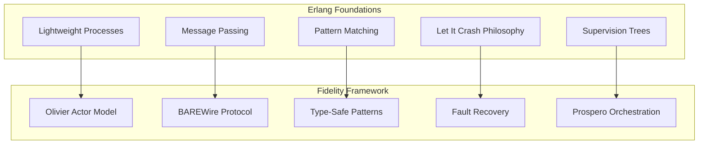
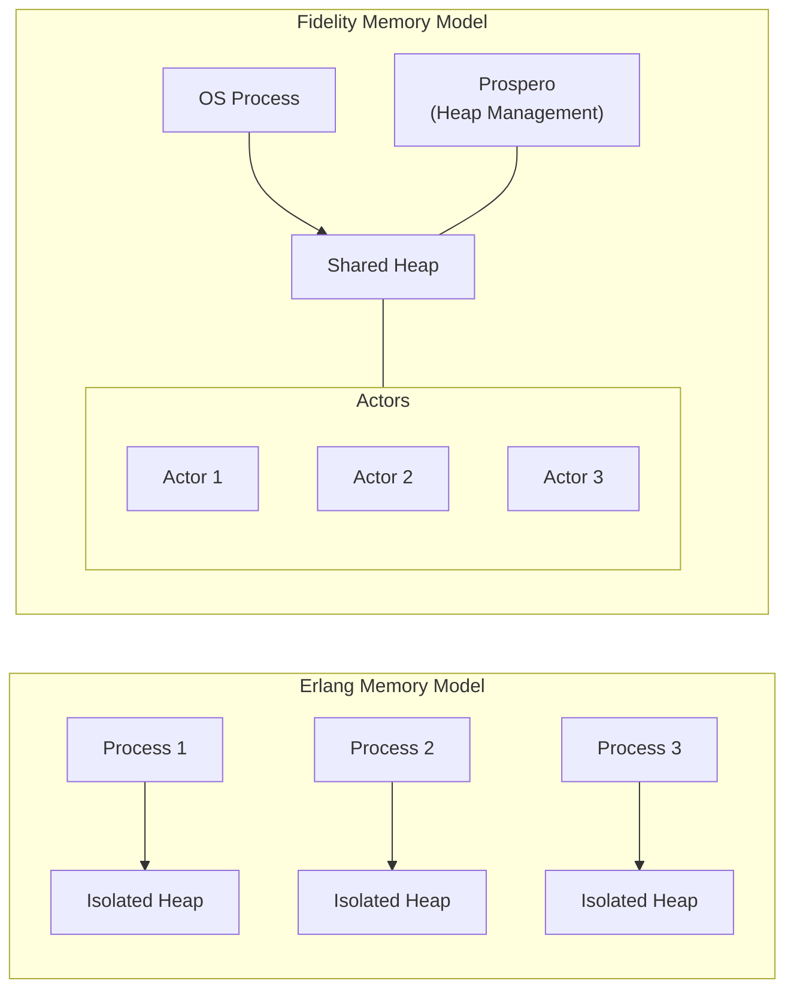

> This article was originally published on the
> [SpeakEZ Technologies blog](https://speakez.tech) as part of our early
> design work on the Fidelity Framework. It has been updated to reflect
> the Clef language naming and current project structure.

---

Erlang emerged in the late 1980s at Ericsson, during an epoch when distributed systems were in their infancy and reliability was becoming a critical concern in telecommunications. Born out of the practical need to build telephone exchanges that could achieve the mythical "nine nines" (99.9999999%) of uptime, Erlang introduced a paradigm shift in how we approach concurrency and fault tolerance.

## A Pioneer in Reliable Distributed Computing

In an era dominated by object-oriented programming and shared-state concurrency, Erlang boldly embraced functional programming with immutable data and the actor model. Its design philosophy, lightweight processes, message passing, and "let it crash" error handling, created a foundation for systems that could not only scale horizontally but also self-heal through sophisticated supervision hierarchies.

Particularly noteworthy is how Erlang's approach has been validated through formal methods. McErlang, a model checker for Erlang, enables formal verification of deterministic behavior in what is otherwise a dynamic environment. This achievement demonstrated that even highly concurrent systems could be reasoned about with mathematical precision, bridging the gap between practical engineering and theoretical computer science.

Erlang's influence extended far beyond its original domain, inspiring a new generation of actor-model implementations. In 2009, Jonas Bonér created Akka for the JVM ecosystem, directly translating Erlang's concurrency principles into a form palatable for enterprise Java environments. Later, Aaron Stannard co-created Akka.NET which brought these same concepts to the .NET world, demonstrating the timelessness of Erlang's core insights and extending them well beyond the original remit. These frameworks served as crucial bridges, carrying Erlang's wisdom into mainstream enterprise computing while adapting its principles to different runtime environments and programming paradigms.

The Fidelity framework shares these foundational goals of reliability, scalability, and formal correctness. By examining Fez, an F#-to-Erlang transpiler, we've confirmed that our innovations align with Erlang's time-tested principles while extending them with modern type systems, memory management techniques, and compilation technology. This retrospective analysis demonstrates how Fidelity draws inspiration from Erlang's pioneering work while addressing the demands of today's computing landscape, with designs to support deep inter-operation with Akka.NET clusters.

## Key Concepts from Erlang via Fez

The Fez transpiler provides a window into how Erlang's concurrency model can be expressed in F#. By examining this relationship, we can identify what Fidelity has adopted from Erlang and where it advances beyond Erlang's capabilities.



## Erlang Patterns Adapted in Fidelity

### 1. Lightweight Concurrency Units

**Erlang Pattern:**
Erlang reimagined concurrency by treating it not as a scarce resource to be carefully managed, but as an abundant one to be freely utilized. Its lightweight "processes" (not OS processes) managed by the BEAM VM embodied this philosophy perfectly. Where traditional threading models might struggle with thousands of concurrent units, Erlang could effortlessly juggle millions. Fez captures this essence with its deceptively simple `Pid` type:

```fsharp
// Fez's minimal Pid representation
type Pid = P
```

This minimalist approach belies the profound shift in thinking: concurrency should be a fundamental building block, not an advanced feature locked behind complex APIs.

**Fidelity Implementation:**
Olivier embraces this paradigm shift while adapting it for modern hardware realities. The philosophy remains, lightweight units of concurrent execution, but the implementation addresses contemporary performance considerations:

```clef
// Conceptual Olivier actor representation
type ActorRef<'Message> = private {
    Id: ActorId
    Path: ActorPath
    // Not isolated heaps, but shared heap with managed references
}
```

Unlike Erlang's process-isolated memory model, Olivier uses a **shared heap per OS process** with actors operating within that space. This approach recognizes that modern hardware has evolved since Erlang's inception, memory is more abundant, cache coherence more sophisticated, and compiler technology more advanced. By maintaining logical separation without physical memory isolation, Olivier preserves the conceptual clarity of Erlang's model while leveraging contemporary architectural advantages.

### 2. Message-Passing Concurrency

**Erlang Pattern:**
"Share nothing, communicate everything" encapsulates Erlang's radical approach to concurrency. In a world where shared memory and locks dominated concurrent programming, Erlang made an uncompromising choice: actors would be truly isolated, communicating only through explicit message passing. This wasn't merely a technical decision but a philosophical stance on how to build reliable systems, one that eliminated entire classes of concurrency bugs by design. Fez distills this profound idea into a beautifully simple interface:

```fsharp
// Fez's basic message passing
let send<'T> (dst: Pid) (msg: 'T) : unit = ()
let (<!) = send
```

The operator `<!` in particular captures the visual metaphor of a message flying from one actor to another, reinforcing the conceptual model at the syntax level.

**Fidelity Implementation:**
BAREWire embraces Erlang's message-passing philosophy while recognizing that not all isolation requires memory boundaries. By distinguishing between logical isolation (the programming model) and physical isolation (the implementation), Fidelity creates a system that maintains Erlang's safety guarantees while optimizing for modern hardware realities:

```clef
// Conceptual BAREWire-enabled messaging
let send<'T> (target: ActorRef<'T>) (message: 'T) : unit =
    // When appropriate, passes by reference within shared heap
    // Uses BAREWire for cross-process serialization when needed
    match getActorLocation target with
    | SameProcess ->
        // Direct reference passing in shared heap
        enqueueMessage target.Mailbox message
    | RemoteProcess ->
        // Zero-copy serialization with BAREWire
        let serialized = BAREWire.serialize message
        transportChannel.Send(target.Path, serialized)
```

This hybrid approach offers the best of both worlds: the conceptual clarity of message-passing with the performance benefits of reference passing when safe to do so. It's an evolution that preserves Erlang's core insight, that isolation creates reliability, while adapting it to modern computing environments where different forms of isolation are available.

### 3. Pattern Matching for Message Handling

**Erlang Pattern:**
Erlang elevated pattern matching from a mere language feature to the central paradigm for handling communication in concurrent systems. This approach transformed message processing from imperative command sequences to declarative pattern recognition, a shift that made complex interactions both more readable and less error-prone.

The beauty of this approach is how naturally it maps the structure of data to the structure of code. When a message arrives, the system doesn't execute procedures; it recognizes patterns and responds accordingly. Fez brilliantly captures this concept by mapping F# discriminated unions to Erlang pattern matching:

```fsharp
// Fez's pattern matching for message reception
let alts =
    t.TypeDefinition.UnionCases
    |> Seq.map (fun c ->
        let pat = mkStructuralUnionCasePat t c |> mkAliasP
        cerl.Constr (cerl.Alt (cerl.Pat pat, cerl.defaultGuard,
                        constr (cerl.Var alias))))
    |> Seq.toList
```

This translation layer reveals the deep harmony between F#'s type system and Erlang's pattern matching, two different expressions of the same fundamental insight about data and behavior.

**Fidelity Implementation:**
Fidelity takes this powerful idea and enhances it with the full force of Clef's type system. Where Erlang's pattern matching was dynamic, Fidelity makes it static, catching potential message handling errors at compile time rather than runtime:

```clef
// Conceptual Olivier message handling
type MyActorMessage =
    | Command1 of payload:int
    | Command2 of name:string * value:float
    | Shutdown

let myActor (mailbox: ActorMailbox<MyActorMessage>) =
    let rec loop() = actor {
        let! message = Actor.receive()

        match message with
        | Command1 payload ->
            // Type-safe pattern matching with compiler verification
            processCommand1 payload
            return! loop()

        | Command2(name, value) ->
            // Deconstructed parameters with zero-copy access
            processCommand2 name value
            return! loop()

        | Shutdown ->
            // Terminate actor
            return ()
    }
    loop()
```

This approach preserves the elegant declarative style that makes Erlang's message handling so powerful while adding compile-time safety. The pattern matching isn't just checking shapes anymore, it's verifying that the entire messaging protocol conforms to a statically verified contract. It's the difference between discovering a message handling bug during testing versus having the compiler prevent such bugs from ever reaching production.

### 4. Supervision Hierarchies

**Erlang Pattern:**
Perhaps Erlang's most revolutionary contribution was its radical rethinking of error handling through the "let it crash" philosophy. Where traditional systems aimed to prevent failures through defensive programming, Erlang embraced failure as inevitable and instead focused on recovery. This wasn't recklessness but pragmatism, in complex distributed systems, trying to anticipate every failure mode is futile; it's more effective to focus on resilient recovery mechanisms.

Supervision trees embodied this insight, creating hierarchical structures where "supervisor" processes monitored "worker" processes and could restart them upon failure. This approach allowed clean separation between business logic and error handling, producing systems that could self-heal without human intervention. Fez provides basic hooks for this powerful concept, allowing F# developers to tap into conceptual levers inspired by Erlang's robust fault tolerance mechanisms.

**Fidelity Implementation:**
Prospero implements supervision with enhanced flexibility and type safety, taking Erlang's profound insight and adapting it for modern typed systems:

```clef
// Conceptual Prospero supervision
let banking = orchestrator {
    // Define supervision hierarchy
    let! accountManager = spawn (Props.create<AccountManager>())

    // Configure supervision strategy
    do! setSupervisor accountManager (
        SupervisorStrategy.OneForOne(
            maxRetries = 10,
            withinTimeSpan = TimeSpan.FromMinutes(1.0),
            decider = function
                | :? AccountException -> Directive.Restart
                | :? SystemException -> Directive.Stop
                | _ -> Directive.Escalate
        )
    )

    // Create supervised children
    let! savings = spawn (Props.create<SavingsAccount>())
                   |> withSupervisor accountManager
    let! checking = spawn (Props.create<CheckingAccount>())
                    |> withSupervisor accountManager
}
```

This approach builds upon Erlang's supervision model in several significant ways. The type system ensures that supervisors and their charges have compatible message types, preventing an entire class of runtime errors. The supervision strategies themselves become statically verified, with the compiler checking that exception handling is exhaustive. Perhaps most importantly, by making the relationship between Akka.NET and Erlang's supervision models explicit, Prospero creates a bridge between these two powerful ecosystems, allowing systems built on Fidelity to interoperate seamlessly with existing Akka.NET deployments.

This evolution preserves the philosophical core of Erlang's approach, that systems should be designed to recover from failure rather than trying to prevent all failures, while enhancing it with static verification and ecosystem compatibility.

## Memory Management: A Different Approach



### Erlang's Approach: Process Isolation

Erlang's memory model reflects its origins in the telecommunications industry of the 1980s, where hardware was limited but reliability was paramount. The BEAM VM uses completely isolated heaps per lightweight process, a radical design choice that prioritizes fault isolation above all else. When one process crashes due to memory corruption, others remain unaffected. When a process sends a message to another, the data is fully copied, ensuring complete isolation.

This approach created extraordinary reliability guarantees. Each process becomes a fortress unto itself, immune to the failures of its neighbors. Garbage collection happens per-process, eliminating system-wide pauses. The cost, additional memory usage and copying overhead, was deemed worthwhile for systems where five minutes of downtime per year was considered unacceptable.

### Fidelity's Approach: Shared Managed Heap

Fidelity takes a different approach that reflects both changes in computing hardware and advances in language implementation techniques. Olivier actors operate within a shared heap per OS process, with Prospero potentially serving as the allocator. This design recognizes that modern systems have abundant memory, sophisticated cache hierarchies, and powerful garbage collection algorithms that can provide safety without isolation.

The shared heap approach offers several advantages:
- Enables zero-copy message passing between actors in the same process
- Eliminates redundant memory allocations
- Leverages decades of advances in garbage collection research
- Takes advantage of modern CPU cache architectures
- Provides a smooth migration path from existing .NET code

Rather than creating isolation through memory boundaries, Fidelity achieves it through type system guarantees and disciplined API design. This reflects a philosophical evolution: from isolation as a runtime property to isolation as a compile-time property.

This approach maintains the actor programming model, with its clear separation of concerns and message-based communication, while embracing modern memory management techniques for performance. It's not a rejection of Erlang's wisdom but an adaptation of it for contemporary computing environments where different trade-offs make sense.

## Where Fidelity Surpasses Erlang

### 1. Memory Efficiency and Control

**Erlang Limitation:**
Erlang's isolated process model brought unprecedented reliability but at a cost. Every message passed between processes must be copied in its entirety, a design decision that prioritizes isolation above all else. While appropriate for telecommunications systems of the 1980s, this approach creates significant overhead for data-intensive applications where message sizes might be measured in megabytes rather than bytes.

Additionally, Erlang provides limited control over memory layout. Developers have no direct way to specify alignment, padding, or memory organization, critical factors for performance-sensitive applications, especially those interacting with hardware or external systems with specific memory expectations.

**Fidelity Advancement:**
BAREWire represents a fundamental rethinking of this trade-off, providing sophisticated memory management that maintains safety while eliminating unnecessary copies:

```clef
// Conceptual BAREWire memory layout control
type SensorReading = {
    Timestamp: int64  // 8 bytes
    Value: float      // 8 bytes
    Flags: uint32     // 4 bytes
    // 4 bytes padding for alignment
}

// Memory-efficient buffer with explicit layout
let sensorBuffer = AlignedBuffer<SensorReading>.Create(
    elementCount = 1000,
    layout = MemoryLayout.withAlignment 8<bytes>
)
```

This advancement goes beyond mere optimization, it opens entirely new application domains where the actor model can excel. Scientific computing, media processing, machine learning, financial modeling, fields traditionally ill-suited to Erlang's approach, become viable targets for actor-based concurrency. BAREWire achieves this by distinguishing between logical isolation (the programming model) and physical isolation (the implementation details), providing the best of both worlds.

Moreover, BAREWire's integration with Clef's units of measure system means that these memory optimizations don't come at the expense of type safety. The system can statically verify that memory layouts conform to expected sizes and alignments, catching potential errors at compile time rather than runtime.

### 2. Type Safety and Verification

**Erlang Limitation:**
Erlang uses dynamic typing with pattern matching but no compile-time guarantees.

**Fidelity Advancement:**
Fidelity leverages Clef's type system with extensions:
- Static dimensional validation
- Memory layout verification
- Units of measure for physical quantities

```clef
// Type-safe message protocol with dimensional units
[<Measure>] type celsius
[<Measure>] type seconds

type TelemetryMessage =
    | TemperatureReading of float<celsius>
    | HeartbeatInterval of float<seconds>
    | SystemShutdown

// Compile-time verification prevents mistakes
let processTemperature (temp: float<celsius>) =
    if temp > 100.0<celsius> then triggerCooling()
```

### 3. Native Performance

**Erlang Limitation:**
The BEAM VM provides good concurrency but adds interpretation overhead.

**Fidelity Advancement:**
Fidelity's compilation pipeline generates native code:
- Direct compilation to MLIR and LLVM
- Platform-specific optimizations
- No runtime VM overhead

```clef
// Configuration adapts to platform capabilities
let embeddedConfig =
    PlatformConfig.compose [
        withPlatform PlatformType.Embedded
        withMemoryModel MemoryModelType.Constrained
        withVectorCapabilities VectorCapabilities.Minimal
        withHeapStrategy HeapStrategyType.Static
    ] PlatformConfig.base'
```

### 4. Concurrency Primitives

**Erlang Limitation:**
Erlang pioneered a concurrency model based on processes and messages, creating a foundation that has stood the test of time. However, its primitives remain relatively basic, spawn a process, send a message, receive a message. While these operations are powerful in combination, they can become unwieldy for complex concurrency patterns. Composition is challenging; patterns like parallel map or concurrent resource management must be rebuilt in each application rather than leveraged from libraries. Error handling across process boundaries requires careful manual coordination.

**Fidelity Advancement:**
Frosty, Fidelity's concurrency library, builds upon Erlang's foundation with compositional primitives that make complex concurrency patterns both easier to express and more reliable to execute:

```clef
// Compositional streams with cancellation
let processData = coldStream {
    // Type-safe data access with BAREWire
    let! buffer = BAREWire.receiveBuffer messagePort
    use view = BAREWire.createTypedView<Vector<float>> buffer

    // Process with cancellation support
    let! result =
        transform view
        |> ColdStream.withTimeout (TimeSpan.FromSeconds 5.0)

    return result
}
```

This example demonstrates several advances. The computation expression syntax (`coldStream { ... }`) creates a declarative way to express asynchronous operations. The `use` keyword ensures that resources are properly disposed even if exceptions occur or the operation is cancelled. The `withTimeout` combinator attaches cancellation behavior without complicating the core logic.

Frosty provides two fundamental stream types, `HotStream<'T>` for operations that begin immediately and `ColdStream<'T>` for operations that start on demand. This distinction enables more precise control over when and how concurrent operations execute. Combined with structured cancellation and resource management, these primitives enable developers to build complex concurrent workflows that remain maintainable and predictable.

Perhaps most importantly, Frosty integrates deeply with the rest of the Fidelity stack. BAREWire provides memory-efficient data structures, XParsec enables zero-copy parsing, and the MLIR/LLVM pipeline optimizes the resulting code for the target platform. This integration creates a concurrency model that's both more expressive than Erlang's and more efficient in execution.

## Lessons from Fez Worth Preserving

Examining Fez, a bridge between F# and Erlang, reveals conceptual patterns that remain valuable regardless of implementation details. These patterns represent the essence of what made Erlang revolutionary and continue to inform Fidelity's design:

### 1. Simple Process Identification

Fez's minimalist `Pid` type encapsulates a profound insight: actor references should be simple, opaque handles that hide implementation details. This approach creates a clean separation between what an actor is and how to communicate with it:

```fsharp
// Fez's minimalist API surface
let spawn (f : unit -> unit) : Pid = P
let send<'T> (dst: Pid) (msg: 'T) : unit = ()
let receive<'Msg> () = Unchecked.defaultof<obj> :?> 'Msg
```

This simplicity isn't just aesthetic, it enables powerful patterns like location transparency (sending messages without knowing where the recipient physically resides) and actor lifecycle management (supervising actors without being tightly coupled to their implementation). By studying Fez's approach, we're reminded that the most powerful abstractions are often the simplest ones.

### 2. Message Pattern Clarity

Discriminated unions provide a perfect type-level representation of message protocols, while pattern matching offers an intuitive way to handle those messages. This natural alignment suggests that the actor model isn't just compatible with functional programming, it's enhanced by it. Fidelity embraces this synergy with strong data guarantees of BAREWire, using discriminated unions as the primary way to define actor message protocols. This approach makes message handling both more readable and more maintainable, as the type system ensures that all message variants are properly handled.

### 3. Minimalist API Surface

Perhaps the most valuable lesson from Fez is the power of a focused, minimal API. With just three core functions, `spawn`, `send`, and `receive`, Fez captures the essence of actor-based programming. This minimalism makes the model accessible to newcomers while providing enough expressivity for complex systems.

Fidelity preserves this minimalist approach in its core actor API, ensuring that the fundamental operations remain simple and consistent. Additional functionality is provided through extension methods and combinators, allowing developers to opt into complexity only when needed.

These lessons from Fez inform Fidelity's design philosophy: maintain conceptual simplicity while enhancing power and safety through modern language features and compilation techniques.

## Beyond Erlang

Fidelity successfully incorporates Erlang's core patterns while advancing beyond its limitations:

- **Shared heap model** prioritizes performance while maintaining actor isolation semantics
- **BAREWire protocol** enables efficient message passing across process boundaries
- **Olivier actor model** provides Erlang-like simplicity with stronger guarantees
- **Prospero orchestration** offers Akka.NET compatibility for broader ecosystem integration

By learning from Erlang through the lens of Fez while pushing beyond its boundaries with modern compilation techniques, Fidelity creates a synthesis that offers both the clarity of the actor model and the performance of native code. The result is not merely an adaptation of Erlang's ideas, but a forward-looking synthesis that represents the future of actor-based concurrent programming.

## A Modern Tradition: Honoring Erlang's Legacy

For over three decades, Erlang has stood as a vanguard in the realm of distributed systems engineering. Its influence extends far beyond its niche, shaping modern platforms like Elixir, informing design patterns in diverse languages, and demonstrating that reliability at scale is an achievable goal. The famous case study of Ericsson's AXD301 switch, containing over a million lines of Erlang code yet achieving carrier-grade reliability, remains a testament to the soundness of its foundational principles.

The Fidelity framework acknowledges this profound legacy. Where Erlang blazed trails through uncharted territory with pragmatic innovation, Fidelity aims to build highways with modern materials and techniques. We recognize that Erlang's concepts weren't merely technical choices but philosophical insights about the nature of distributed computing that have stood the test of time.

As computing continues to evolve, from cloud infrastructure to edge devices, from massive data centers to embedded systems, the need for reliable concurrency only grows more acute. The Fidelity framework seeks to carry forward Erlang's torch into this new era, not by discarding its wisdom but by recasting it in the light of contemporary advances in type theory, memory management, and compilation technology. In doing so, we hope to honor Erlang's pioneering spirit by extending its tradition of pragmatic innovation into the next generation of distributed systems.
