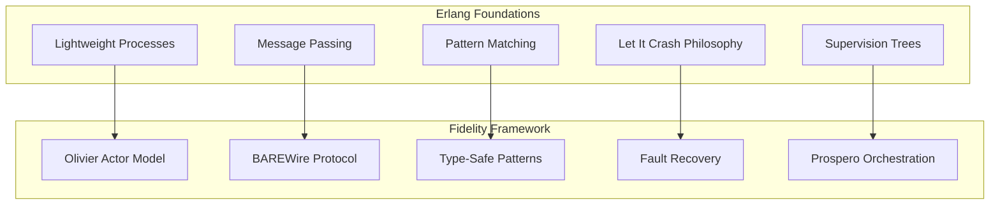
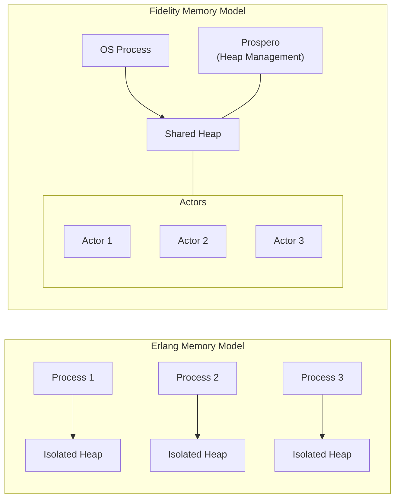

Erlang emerged in the late 1980s at Ericsson, when distributed systems were in their infancy and reliability was becoming a critical concern in telecommunications. It was built to meet a practical need: telephone exchanges that could achieve the "nine nines" (99.9999999%) of uptime. To get there, Erlang took an unusual position on concurrency and fault tolerance.

## A Pioneer in Reliable Distributed Computing

In an era dominated by object-oriented programming and shared-state concurrency, Erlang embraced functional programming with immutable data and the actor model. Its design rested on lightweight processes, message passing, and "let it crash" error handling. That combination produced systems that scaled horizontally and self-healed through supervision hierarchies.

Erlang's approach has also been studied through formal methods. McErlang, a model checker for Erlang, enables formal verification of deterministic behavior in what is otherwise a dynamic environment. The work showed that concurrent systems could be reasoned about with mathematical precision, connecting practical engineering to theoretical computer science.

Erlang's influence extended beyond its original domain into a generation of actor-model implementations. In 2009, Jonas Bonér created Akka for the JVM ecosystem, translating Erlang's concurrency principles into a form suited to enterprise Java environments. Aaron Stannard later co-created Akka.NET, which carried the same concepts to the .NET world and extended them past the original remit. These frameworks carried Erlang's concurrency model into mainstream enterprise computing while adapting it to different runtime environments and programming paradigms.

Our Fidelity framework shares Erlang's goals of reliability, scalability, and formal correctness. By examining Fez, an F#-to-Erlang transpiler, we have checked our design choices against Erlang's principles, and we extend them with modern type systems, memory management techniques, and compilation technology. This analysis traces where Fidelity draws on Erlang's work and where it diverges to meet the demands of today's computing landscape, including a planned path toward inter-operation with Akka.NET clusters.

## Key Concepts from Erlang via Fez

The Fez transpiler shows how Erlang's concurrency model can be expressed in F#. Examining that relationship lets us identify what our Fidelity design adopts from Erlang and where it goes further.


```mermaid
flowchart TB
    subgraph Erlang["Erlang Foundations"]
        E_LightProc["Lightweight Processes"]
        E_MsgPass["Message Passing"]
        E_PatMatch["Pattern Matching"]
        E_LetItCrash["Let It Crash Philosophy"]
        E_SuperTree["Supervision Trees"]
    end

    subgraph Fidelity["Fidelity Framework"]
        F_Actors["Olivier Actor Model"]
        F_BAREWire["BAREWire Protocol"]
        F_Types["Type-Safe Patterns"]
        F_Recovery["Fault Recovery"]
        F_Prospero["Prospero Orchestration"]
    end

    E_LightProc --> F_Actors
    E_MsgPass --> F_BAREWire
    E_PatMatch --> F_Types
    E_LetItCrash --> F_Recovery
    E_SuperTree --> F_Prospero
```

## Erlang Patterns Adapted in Fidelity

### 1. Lightweight Concurrency Units

**Erlang Pattern:**
Erlang treats concurrency as an abundant resource rather than a scarce one. Its lightweight "processes" (not OS processes), managed by the BEAM VM, carry that choice: where traditional threading models strain at thousands of concurrent units, Erlang handles millions. Fez captures the idea with a minimal `Pid` type:

```fsharp
// Fez's minimal Pid representation
type Pid = P
```

The minimal type reflects a position: concurrency is a basic building block, not a feature reached through a heavy API.

**Fidelity Implementation:**
Our Olivier design keeps lightweight units of concurrent execution and adapts the implementation for current hardware:

```clef
// Conceptual Olivier actor representation
type ActorRef<'Message> = private {
    Id: ActorId
    Path: ActorPath
    // shared heap with managed references, not isolated heaps
}
```

Unlike Erlang's process-isolated memory model, Olivier is designed to use a **shared heap per OS process**, with actors operating within that space. The reasoning is that hardware has changed since Erlang's inception: memory is more abundant, cache coherence is better, and compiler technology has advanced. By keeping logical separation without physical memory isolation, Olivier aims to preserve the clarity of Erlang's model while taking advantage of these architectural changes.

### 2. Message-Passing Concurrency

**Erlang Pattern:**
"Share nothing, communicate everything" captures Erlang's approach to concurrency. Where shared memory and locks dominated concurrent programming, Erlang made a different choice: actors are isolated and communicate only through explicit message passing. That choice eliminates several classes of concurrency bugs by construction. Fez expresses it in a small interface:

```fsharp
// Fez's basic message passing
let send<'T> (dst: Pid) (msg: 'T) : unit = ()
let (<!) = send
```

The `<!` operator reads as a message flying from one actor to another, carrying the model into the syntax.

**Fidelity Implementation:**
Our BAREWire design keeps Erlang's message-passing model while treating memory boundaries as one form of isolation among several. By separating logical isolation (the programming model) from physical isolation (the implementation), BAREWire is meant to preserve Erlang's safety properties while taking advantage of modern hardware:

```clef
// Conceptual BAREWire-enabled messaging
let send<'T> (target: ActorRef<'T>) (message: 'T) : unit =
    match getActorLocation target with
    | SameProcess ->
        // direct reference passing in shared heap
        enqueueMessage target.Mailbox message
    | RemoteProcess ->
        // zero-copy serialization with BAREWire
        let serialized = BAREWire.serialize message
        transportChannel.Send(target.Path, serialized)
```

This design keeps the message-passing model while passing by reference when it is safe to do so. It carries forward Erlang's premise that isolation supports reliability, and it widens the set of isolation forms available, since memory boundaries are no longer the only option.

### 3. Pattern Matching for Message Handling

**Erlang Pattern:**
Erlang made pattern matching the central mechanism for handling communication in concurrent systems. Message processing becomes declarative pattern recognition rather than an imperative command sequence, which makes complex interactions more readable and less error-prone.

The approach maps the structure of data onto the structure of code. When a message arrives, the system matches it against patterns and responds to the matching case. Fez captures this by mapping F# discriminated unions to Erlang pattern matching:

```fsharp
// Fez's pattern matching for message reception
let alts =
    t.TypeDefinition.UnionCases
    |> Seq.map (fun c ->
        let pat = mkStructuralUnionCasePat t c |> mkAliasP
        cerl.Constr (cerl.Alt (cerl.Pat pat, cerl.defaultGuard,
                        constr (cerl.Var alias))))
    |> Seq.toList
```

This translation layer shows the alignment between F#'s type system and Erlang's pattern matching, two expressions of the same relationship between data and behavior.

**Fidelity Implementation:**
Our Fidelity design takes the same idea and runs it through Clef's type system. Where Erlang's pattern matching is dynamic, Clef makes it static, so message handling errors surface at compile time rather than runtime:

```clef
// Conceptual Olivier message handling
type MyActorMessage =
    | Command1 of payload:int
    | Command2 of name:string * value:float
    | Shutdown

let myActor (mailbox: ActorMailbox<MyActorMessage>) =
    let rec loop() = actor {
        let! message = Actor.receive()

        match message with
        | Command1 payload ->
            processCommand1 payload
            return! loop()

        | Command2(name, value) ->
            // deconstructed parameters, zero-copy access
            processCommand2 name value
            return! loop()

        | Shutdown ->
            return ()
    }
    loop()
```

This keeps the declarative style of Erlang's message handling and adds compile-time checking. The pattern match does more than check shapes: the type system holds the message protocol to a contract checked at compile time, so a class of message-handling bugs is caught before testing rather than discovered during it.

### 4. Supervision Hierarchies

**Erlang Pattern:**
One of Erlang's distinctive contributions was its approach to error handling through the "let it crash" philosophy. Where traditional systems aim to prevent failures through defensive programming, Erlang treats failure as inevitable and focuses on recovery. The reasoning is pragmatic: in complex distributed systems, anticipating every failure mode is impractical, so the effort goes into resilient recovery instead.

Supervision trees carry this idea. They form hierarchies where "supervisor" processes monitor "worker" processes and restart them on failure, which keeps business logic separate from error handling and lets systems self-heal without human intervention. Fez provides basic hooks for the concept, giving F# developers access to recovery patterns drawn from Erlang's fault-tolerance model.

**Fidelity Implementation:**
Our Prospero design takes Erlang's supervision model into a statically typed setting, with more flexible strategies:

```clef
// Conceptual Prospero supervision
let banking = orchestrator {
    // Define supervision hierarchy
    let! accountManager = spawn (Props.create<AccountManager>())

    // Configure supervision strategy
    do! setSupervisor accountManager (
        SupervisorStrategy.OneForOne(
            maxRetries = 10,
            withinTimeSpan = TimeSpan.FromMinutes(1.0),
            decider = function
                | :? AccountException -> Directive.Restart
                | :? SystemException -> Directive.Stop
                | _ -> Directive.Escalate
        )
    )

    // Create supervised children
    let! savings = spawn (Props.create<SavingsAccount>())
                   |> withSupervisor accountManager
    let! checking = spawn (Props.create<CheckingAccount>())
                    |> withSupervisor accountManager
}
```

This builds on Erlang's supervision model in a few ways. The type system is meant to hold supervisors and their charges to compatible message types, making a class of runtime errors unrepresentable. The design checks supervision strategies at compile time, with exhaustive exception handling enforced by the compiler. By making the relationship between Akka.NET and Erlang's supervision models explicit, Prospero is designed to bridge the two ecosystems, so systems built on Fidelity can interoperate with existing Akka.NET deployments.

This keeps the core of Erlang's approach, that systems should be designed to recover from failure rather than prevent all of it, and adds compile-time checking and ecosystem compatibility.

## Memory Management: A Different Approach


```mermaid
flowchart LR
    subgraph Erlang["Erlang Memory Model"]
        direction TB
        E_Proc1["Process 1"] --> E_Heap1["Isolated Heap"]
        E_Proc2["Process 2"] --> E_Heap2["Isolated Heap"]
        E_Proc3["Process 3"] --> E_Heap3["Isolated Heap"]
    end

    subgraph Fidelity["Fidelity Memory Model"]
        direction TB
        OSProcess["OS Process"]
        SharedHeap["Shared Heap"]
        OSProcess --> SharedHeap

        subgraph Actors
            direction TB
            F_Actor1["Actor 1"]
            F_Actor2["Actor 2"]
            F_Actor3["Actor 3"]
        end

        SharedHeap --- Actors
        Prospero["Prospero\n(Heap Management)"] --- SharedHeap
    end
```

### Erlang's Approach: Process Isolation

Erlang's memory model reflects its origins in the telecommunications industry of the 1980s, where hardware was limited but reliability was paramount. The BEAM VM uses isolated heaps per lightweight process, a design choice that prioritizes fault isolation. When one process crashes due to memory corruption, others are unaffected. When a process sends a message to another, the data is copied in full, which keeps the two processes isolated.

This isolation is what gives Erlang its reliability properties. Each process is self-contained and unaffected by the failures of its neighbors. Garbage collection happens per-process, which avoids system-wide pauses. The cost in extra memory and copying overhead was judged worthwhile for systems where five minutes of downtime per year was unacceptable.

### Fidelity's Approach: Shared Managed Heap

Our Fidelity design takes a different approach, shaped by changes in computing hardware and advances in language implementation. Olivier actors are designed to operate within a shared heap per OS process, with Prospero serving as the allocator. The reasoning is that current systems have abundant memory, deep cache hierarchies, and garbage collection algorithms that can provide safety without per-process isolation.

The shared-heap approach is meant to offer several advantages:
- Enables zero-copy message passing between actors in the same process
- Eliminates redundant memory allocations
- Leverages decades of advances in garbage collection research
- Takes advantage of modern CPU cache architectures
- Provides a smooth migration path from existing .NET code

Rather than creating isolation through memory boundaries, our Fidelity design enforces it through the type system and a disciplined API. The shift is from isolation as a runtime property to isolation as a compile-time property.

This keeps the actor programming model, with its separation of concerns and message-based communication, and pairs it with current memory management techniques for performance. It adapts Erlang's model to a hardware setting where different trade-offs apply.

## Where Fidelity Surpasses Erlang

### 1. Memory Efficiency and Control

**Erlang Limitation:**
Erlang's isolated process model brought high reliability at a cost. Every message passed between processes is copied in full, a decision that puts isolation first. That suited 1980s telecommunications systems, but it adds overhead for data-intensive applications where message sizes are measured in megabytes rather than bytes.

Erlang also gives little control over memory layout. There is no direct way to specify alignment, padding, or organization, which matter for performance-sensitive applications and especially for those interacting with hardware or external systems that expect a particular memory layout.

**Fidelity Advancement:**
Our BAREWire design revisits this trade-off, with memory management that keeps safety while removing copies that are not needed:

```clef
// Conceptual BAREWire memory layout control
type SensorReading = {
    Timestamp: int64  // 8 bytes
    Value: float      // 8 bytes
    Flags: uint32     // 4 bytes
    // 4 bytes padding for alignment
}

// Memory-efficient buffer with explicit layout
let sensorBuffer = AlignedBuffer<SensorReading>.Create(
    elementCount = 1000,
    layout = MemoryLayout.withAlignment 8<bytes>
)
```

This change is not only an optimization; it opens application domains where the actor model has been a poor fit. Scientific computing, media processing, machine learning, and financial modeling all work with large messages, and they become viable targets for actor-based concurrency. BAREWire reaches this by separating logical isolation (the programming model) from physical isolation (the implementation details).

BAREWire's integration with Clef's units-of-measure system means these memory choices do not come at the expense of type safety. The system checks at compile time that memory layouts match expected sizes and alignments, so layout errors surface before runtime.

### 2. Type Safety and Verification

**Erlang Limitation:**
Erlang uses dynamic typing with pattern matching but no compile-time guarantees.

**Fidelity Advancement:**
Our Fidelity design uses Clef's type system with extensions:
- Static dimensional validation
- Memory layout verification
- Units of measure for physical quantities

```clef
// Type-safe message protocol with dimensional units
[<Measure>] type celsius
[<Measure>] type seconds

type TelemetryMessage =
    | TemperatureReading of float<celsius>
    | HeartbeatInterval of float<seconds>
    | SystemShutdown

// celsius required; a bare float or float<seconds> fails to type-check
let processTemperature (temp: float<celsius>) =
    if temp > 100.0<celsius> then triggerCooling()
```

### 3. Native Performance

**Erlang Limitation:**
The BEAM VM provides good concurrency but adds interpretation overhead.

**Fidelity Advancement:**
Our Fidelity compilation pipeline generates native code:
- Direct compilation to MLIR and LLVM
- Platform-specific optimizations
- No runtime VM overhead

```clef
// Configuration adapts to platform capabilities
let embeddedConfig =
    PlatformConfig.compose [
        withPlatform PlatformType.Embedded
        withMemoryModel MemoryModelType.Constrained
        withVectorCapabilities VectorCapabilities.Minimal
        withHeapStrategy HeapStrategyType.Static
    ] PlatformConfig.base'
```

### 4. Concurrency Primitives

**Erlang Limitation:**
Erlang's concurrency model is built on processes and messages, and it has held up over decades. Its primitives stay basic, though: spawn a process, send a message, receive a message. The operations combine well, but complex concurrency patterns can become unwieldy. Composition is hard. Patterns like parallel map or concurrent resource management get rebuilt in each application rather than pulled from libraries, and error handling across process boundaries needs careful manual coordination.

**Fidelity Advancement:**
Frosty, our Fidelity concurrency library, builds on Erlang's model with compositional primitives meant to make complex concurrency patterns easier to express and more predictable to execute:

```clef
// Compositional streams with cancellation
let processData = coldStream {
    // Type-safe data access with BAREWire
    let! buffer = BAREWire.receiveBuffer messagePort
    use view = BAREWire.createTypedView<Vector<float>> buffer

    // Process with cancellation support
    let! result =
        transform view
        |> ColdStream.withTimeout (TimeSpan.FromSeconds 5.0)

    return result
}
```

This example shows a few of the pieces. The computation expression syntax (`coldStream { ... }`) gives a declarative way to express asynchronous operations. The `use` keyword disposes resources even if exceptions occur or the operation is cancelled. The `withTimeout` combinator attaches cancellation behavior without complicating the core logic.

Frosty is designed to provide two stream types: `HotStream<'T>` for operations that begin immediately and `ColdStream<'T>` for operations that start on demand. The distinction controls when and how concurrent operations execute. Paired with structured cancellation and resource management, these primitives are meant to let developers build concurrent workflows that stay maintainable and predictable.

Frosty is designed to integrate with the rest of our Fidelity stack. BAREWire provides memory-efficient data structures, XParsec enables zero-copy parsing, and the MLIR/LLVM pipeline optimizes the resulting code for the target platform. The aim is a concurrency model more expressive than Erlang's and more efficient in execution.

## Lessons from Fez Worth Preserving

Examining Fez, a bridge between F# and Erlang, surfaces patterns that hold regardless of implementation details. These patterns are part of what made Erlang effective, and they inform our Fidelity design:

### 1. Simple Process Identification

Fez's minimal `Pid` type carries one idea: actor references should be opaque handles that hide implementation details. That separates what an actor is from how to communicate with it:

```fsharp
// Fez's minimalist API surface
let spawn (f : unit -> unit) : Pid = P
let send<'T> (dst: Pid) (msg: 'T) : unit = ()
let receive<'Msg> () = Unchecked.defaultof<obj> :?> 'Msg
```

The opaque handle enables location transparency (sending messages without knowing where the recipient physically resides) and actor lifecycle management (supervising actors without coupling to their implementation). The abstraction does a lot of work while staying small.

### 2. Message Pattern Clarity

Discriminated unions give a type-level representation of message protocols, and pattern matching handles those messages directly. The alignment between the two is why the actor model fits functional programming so well. Our Fidelity design uses discriminated unions as the primary way to define actor message protocols, backed by BAREWire's data layout. The type system checks that all message variants are handled, which keeps message handling readable and maintainable.

### 3. Minimalist API Surface

A focused, minimal API is one of the clearest lessons from Fez. With three core functions, `spawn`, `send`, and `receive`, Fez covers actor-based programming. That keeps the model accessible to newcomers while staying expressive enough for complex systems.

Our Fidelity core actor API keeps the same minimal surface, so the core operations stay simple and consistent. Additional functionality comes through extension methods and combinators, which developers reach for only when they need them.

These lessons from Fez carry into our Fidelity design: keep the core simple, and add safety and capability through the type system and compilation pipeline.

## Beyond Erlang

Our Fidelity design takes up Erlang's core patterns and extends them:

- **Shared heap model** favors performance while keeping actor isolation semantics
- **BAREWire protocol** carries message passing across process boundaries with fewer copies
- **Olivier actor model** keeps Erlang-like simplicity with compile-time type checking
- **Prospero orchestration** targets Akka.NET compatibility for broader ecosystem integration

By learning from Erlang through Fez and extending it with our compilation pipeline, Fidelity aims to combine the clarity of the actor model with the performance of native code. We are early in this design, and the comparison with Erlang is one of the ways we check it.

## A Modern Tradition: Honoring Erlang's Legacy

For over three decades, Erlang has been a reference point in distributed systems engineering. Its influence reaches past its original niche, shaping platforms like Elixir, informing design patterns in other languages, and showing that reliability at scale is achievable. The case study of Ericsson's AXD301 switch, over a million lines of Erlang code at carrier-grade reliability, still holds up as evidence for its foundational principles.

Our Fidelity framework builds on that work. Erlang's concepts were not only technical choices; they were positions on how distributed computing should be built, and they have held up. Where Erlang reached its design through hardware constraints of its era, we are working through a different set of constraints, with type theory, memory management, and compilation technology that were not available then.

As computing keeps moving across cloud infrastructure, edge devices, large data centers, and embedded systems, the need for reliable concurrency stays central. We are continuing to develop this design and to test it against Erlang's record, and we hope to honor Erlang's pioneering spirit by extending its tradition of pragmatic innovation into the next generation of distributed systems.
