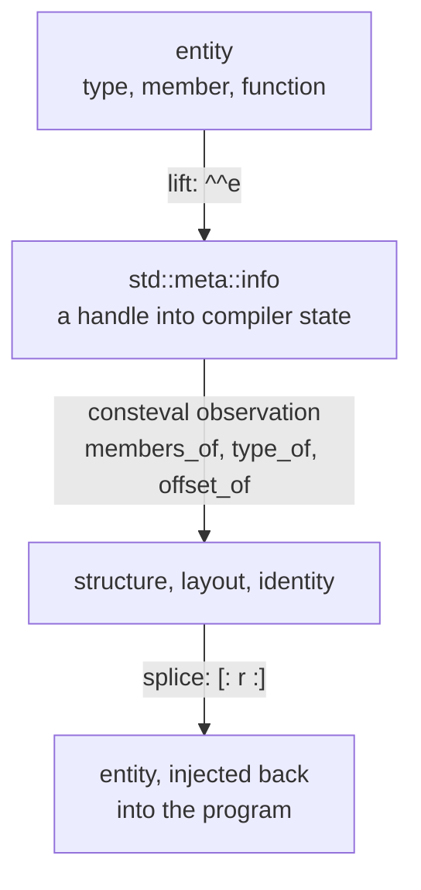
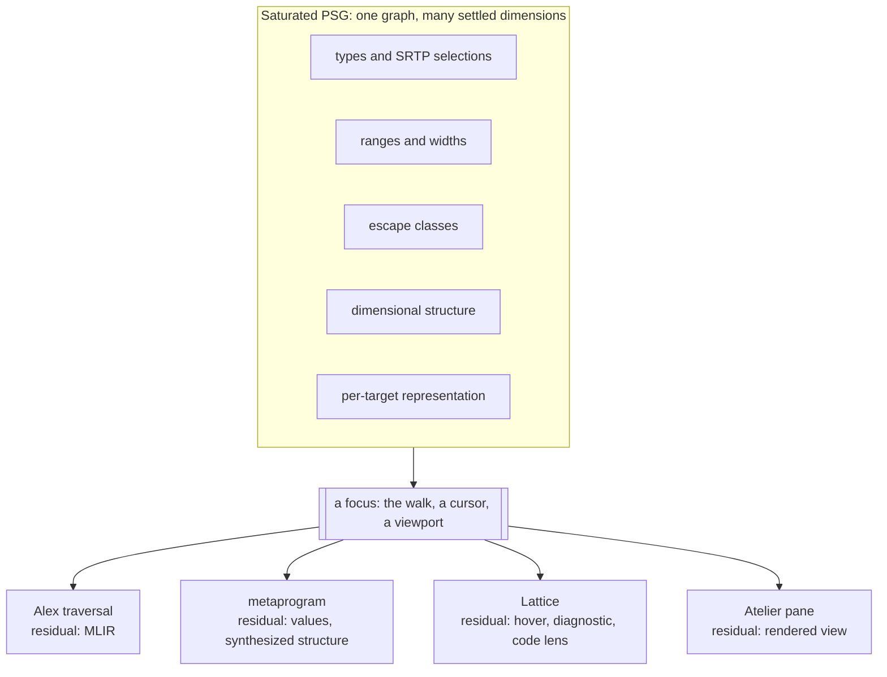

Ask a .NET developer to consider a language that compiles to native code with no runtime, and one question arrives before almost any other: what about reflection? The question deserves a better answer than a feature checklist. Reflection is one of the places where a legacy strategy calcified into a mental model and then got mistaken for an intrinsic necessity. As most developers know it, reflection has three established homes. It lives in runtime metadata tables shipped inside the binary, which is the Java and .NET pattern. It also lives in a compiler API reserved for tooling, which is the pattern of Roslyn and of the F# compiler service. And as of this year it lives in compile-time queries evaluated inside a translation unit, which is the pattern C++26 standardized in [P2996](https://isocpp.org/files/papers/P2996R13.html). Our compiler places it in a fourth home: the Program Semantic Graph itself, where the knowledge that other platforms reconstruct never left our framework in the first place.

We have made an argument like this more than once. [ByRef Resolved](/docs/design/types/byref-resolved/) traced .NET's byref restrictions to a single displacement: when memory safety lives in a runtime tracker, the tracker's limitations become the language's limitations. This piece reads the same displacement onto program metadata. Our take on it, after living in the .NET and Java ecosystems for years and many years of C++ development before that, is that runtime reflection exists because the compiler's knowledge was discarded, and every cost it carries follows from reconstructing at runtime what the compiler held complete a moment earlier. That choice is older than the CLR or JVM. The graph-reduction engines and LISP machines of the 1980s put the interpreter into the hardware, and the compilers Simon Peyton Jones and his contemporaries aimed at stock hardware[^stock] beat them thoroughly enough that the machines became museum pieces. The hosted runtime is that interpreter rebuilt in software, where the costs were diffuse enough to escape itemization for thirty years. The dispatch overhead, the trimming hostility, and the friction with ahead-of-time compilation are the externalities. 

Here we look at what runtime reflection actually reconstructs, take a short digression through what C++26 just standardized and what that concedes, and then describe the design-time surface we are building over our PSG: joint constraints settled across a hypergraph, with active patterns carrying the same classification work they have always carried inside our compiler.

## What Runtime Reflection Reconstructs

By the time a .NET compiler finishes a build it has resolved every type, computed every layout, and bound every member. Almost all of that knowledge is then thrown away. What survives is a compressed remnant in metadata tables, and `System.Reflection` is the machinery for asking diminished versions of the original questions against that remnant, at runtime cost, with runtime failure modes.

> Runtime reflection is a partial reconstruction of knowledge the compiler held before that information was discarded during the compilation process.

The .NET ecosystem has been in-effect conceding this point for years, one subsystem at a time. Source generators moved serialization metadata from runtime discovery to compile-time emission because certain core libraries could not meet performance targets while interrogating metadata tables on the hot path. Trimming treats reflection as the primary reason a linker cannot know what a program actually uses. The Native AOT documentation catalogs the reflection patterns that no longer work once the runtime's dynamism is gone. Each of these is a local migration of metadata work back toward compile time. 

The F# lineage our work draws from offers a facet of what we eventually migrated to the center of our platform. Don Syme's quotations gave programs typed, compile-time carriers of their own structure, and the F# compiler service gave tooling a rich semantic view of checked code. F# was designed to reify its types onto the .NET BCL, a deliberate one-way bridge that bought seamless interop at the price of the return trip: units of measure, statically resolved type parameters, and the rest of the compiler's richer knowledge are set aside at the crossing, because the runtime's metadata tables have no way to carry them. Programs at runtime saw the BCL shadow. Tooling at design time saw the full semantic view. It's a sequence of balanced choices based on the overriding constraints (and enablements) that runtime environment offered.

## Information Preservation

What we view as informed compromises are the norm everywhere, and it is worth setting out plainly because we believe a clear perspective tests those assumptions in a way that yields fresh insight:

| Ecosystem | Programs observe through | Tools observe through | Same live state |
|:----------|:-------------------------|:----------------------|:----------------|
| Java, .NET | runtime metadata tables | compiler APIs (Roslyn, FCS) | no |
| C++ through C++23 | nothing standard | libclang and vendor ASTs | no |
| C++26 | `std::meta`, inside the translation unit being compiled | libclang and vendor ASTs, still | no |
| Clef, as designed | our PSG observation surface | the same surface | yes |

Every mainstream platform gives programs and tools different 'doors' into semantic information, and those doors open onto different levels of preservation. The copies drift, the capabilities differ, and an institutional practice of reactive tooling papers over the seam that is tacitly accepted at every encounter. The engineering costs and time sinks they force becomes an externality that every working group prices into the effort landscape without question. It can be difficult to "pick your head up" from pressing work to consider assumptions, and here we have a case study offers a fresh perspective.

## C++26 As Object Lesson

This digression is warranted because the most instructive recent development in reflection did not come from a managed platform at all. In June 2025 the C++ committee adopted P2996 into C++26, and the design is compile-time static reflection with no runtime machinery whatsoever. Stripped to its core it is three primitives forming a closed loop, confined to constant evaluation, the machinery a C++ compiler carries for computing values while it compiles:



First, we see that reflections are handles into the compiler's own internal state, valid only during translation, so zero runtime overhead is definitional rather than an optimization. Second, the handle is a single opaque type, because the committee judged that a strongly typed reflection hierarchy would freeze the language's ontology into a standardized API that later language evolution could break. Third, synthesis is structured or absent: completing a type from a member description made the standard, while arbitrary token injection was deferred.

That last distinction deserves unpacking: C's preprocessor assembles code the way string concatenation assembles SQL: as text, with no awareness of the grammar it feeds. The classic demonstration fits in two lines:

```c
#define SQUARE(x) x * x
int r = SQUARE(a + 1);   /* becomes a + 1 * a + 1 */
 
```

The macro pastes tokens and operator precedence does the rest. The bug is invisible at the call site because the expansion happens before the compiler's grammar ever sees the code, and generations of C and C++ developers learned to defend against it with ritual parentheses around every macro parameter. The committee's institutional memory of that era is why "build code by gluing tokens" was deferred while "build a type from a validated description" was standardized. The reasoning transfers directly to managed platforms: it is the same instinct that moved data access from string-concatenated SQL to parameterized queries, and structured synthesis is the parameterized query of metaprogramming.

For a .NET reader inclined to treat reflection as evidence that a hosted runtime earns its keep, the digression has **one** takeaway. C++ is the language most sensitive to runtime cost in mainstream use, and it now ships reflection with a genuine ***design-time*** role, zero runtime tables, and results frozen into the binary. A hosted runtime is not a precondition for reflection. It is one implementation strategy, with its own advantages, compromises and costs.

We read P2996 as the C++ committee arriving at our conclusion from a different direction: the right home for reflection is the compiler's own knowledge of the program. The scope is a single translation unit, one source file and its includes compiled in isolation, because nothing larger is ever in view during a C++ compilation. The queries run in that constant evaluator because there is no other place for compile-time code to execute. And editor tooling gains nothing from the new standard surface, because `std::meta` is reachable only from inside code being compiled. Tools like clangd still rebuild their own picture of the program through libclang, a separate compiler-as-a-library API. Three limits, one shared cause: the C++ compiler is a batch process, and when the build ends it exits, taking every handle into its internal state with it. 

## Fidelity Framework Earns Its Name

One of the original conceits of the Fidelity Framework, even before the idea of a distinct "Clef" programming language was conceded, was that preserving information through lowering was the key to more efficient and safer machine code. We see that now in Clef Compiler Services, where the Baker component produces the saturation our PSG holds: symbol and type resolution with SRTP witness selections captured in the typed-tree overlay. It holds operation classifications laid down by nanopasses. It holds [escape classes that place values in regions](/docs/design/memory/inferring-memory-lifetimes/), integer ranges with [the widths they select](/spec/draft/width-inference/), and the dimensional structure that [deferred inference](/blog/deferred-inference/) reads when it chooses a representation per target. The capabilities in question are native in both senses of the word. The resulting binary is native code, and the metadata preserved through compilation is native to the graph instead of being a reconstruction alongside the source tree.

Vocabulary matters here, and this is a place where being specific has particular benefits. Our compiler ***does not emit*** code. Witnesses ***observe*** the settled graph, and the lowered form is the residual of that observation, which is why we call the step elision. The same discipline includes the reflection surface.

> "Query" stands to reflection as "emit" stands to lowering: an imperative verb borrowed from an architecture that doesn't match the norms established in ML-family language systems.

A query is a request that causes computation on the observer's schedule. *Nothing in this design works **that** way*. The enrichments are placed by analysis before any consumer looks, which is the [coeffect and codata discipline](/docs/internals/concepts/coeffects-and-codata/) the compiler already runs on, and every consumer observes what is already there. Reflection, in this architecture, is the observation surface of the same traversal that compiles the program, opened to consumers **other than** the code generator. That traversal is not an abstraction invented for this essay: [Learning to Walk](/docs/internals/pipeline/learning-to-walk/) follows it step by step, from the saturated graph through the zipper's movement to the MLIR that falls out of witness observation. What follows is that 'walk' with a wider range of consumers:



The 'witnesses' differ only in what directs the focus and what the residual is. When the compilation walk is the consumer, the residual is MLIR. When the developer's cursor is the consumer, the residual is a hover card. A hover card and a lowered op are the same kind of thing in this architecture: each is what a witness returns after observing the settled graph at a focus. Design-time tooling is another witness on real-time terms.

## Deferred Inference Unwrapped

Readers of [The Gift of Deferred Inference](/blog/deferred-inference/) have already seen this surface in a different form. That piece argued that a commitment removes options **and the *option space* is the information**, so the compiler holds representation choices open until ranges and targets close them, and the range and its selected representation ride the graph as coeffects. Here is the editor readout that piece presented, read with this entry's emphasis:

```
force : float<newtons>
  dimensional range  [1e-11, 1e30]   (gravitational constant through stellar masses)
  ├─ x86_64   float64          worst-case rel error 1.1e-16, uniform     [wide dynamic → IEEE]
  ├─ xilinx   posit<32,es=2>   ~2.3e-8 at the extremes, ~1.5e-9 near 1.0  [near-unity taper]
  └─ note     posit holds ~10x more precision in [0.01, 100], where most forces actually fall
```

That readout *is* reflection. It is an observation of layout and representation at a focus, rendered for a human instead of for a lowering pass, and it belongs to an observation class no other platform can express. C++26 answers `offset_of` only after a representation is concrete. Under our deferred inference a layout observation is a function of the named target, so the same `float<newtons>` reports one answer for the x86-64 host and another for the Xilinx FPGA part, each with the accuracy consequence that carries with it. Reflection over a deferred type algebra reports what is still open as honestly as what has closed, and the `E_RANGE_UNBOUNDED` diagnostic in that piece is exactly such a report.

## Joint Constraints over the Hypergraph

The settled graph rewards observation because of how it settles. ByRef Resolved named the discipline for memory: joint constraint reasoning over our program hypergraph, where a closure's region, its captured environment, and the function's parameter regions participate in a ***single*** constraint. Memory is one dimension of a wider practice, and the dimensions differ in more than content. Each settles under its own algebra along its own edge classes. Integer intervals widen monotonically to a fixpoint along def-use and feedback edges, and that machinery in in our standing work today: it is what reads our 'HelloArty' FPGA counter at 29 bits instead of a CPU host register's 64. Escape classes join along capture and call edges. Dimensional constraints unify along type flow. Representation selection multiplies per target rather than settling to one value.

The structure that reads those settled dimensions is a ***zipper***, and that name follows a precise pattern. Huet's functional pearl[^huet] gives a cursor made of a focus and its one-hole context, and the pair is the canonical comonad: `extract` reads the focus, and `extend` runs a context-aware function at every position of the structure.

$$
\mathrm{extract} : W\,A \to A
\qquad\qquad
\mathrm{extend} : (W\,A \to B) \to W\,A \to W\,B
$$

A witness already has the shape of `extend`'s argument. It is a function from a focus-with-context to a residual, and running it across the graph is how elision ecapsulates aspects of a program. The coeffect literature formalizes context dependence comonadically for the same reason, and the copatterns tradition[^copat] completes the picture from the codata side: a codata value is defined by the projections present, so observation is the application of a projection that is in place. Every piece of this vocabulary was in our architecture before reflection was the topic. Reading the reflection surface out of it required no new machinery, only the recognition that a graph compiler's own access discipline is the API.

## Semantic Projections

The design-time question is what keeps those observations answerable between keystrokes, and this is where our design does its genuinely new work. On a batch walk the answer is trivial: nanopasses run, the graph settles, witnesses observe. At design time, edits stream in continuously. A surface that seeks to respond on request would put computation on the **observer's** schedule. In our architecture the observer is a witness, and **witnesses *never* compute**.

Our answer is a layer we call Semantic Projections, and the word 'projection' carries its event-sourcing sense deliberately. As a materialized view stands to an event store, a Semantic Projection stands to the edit stream: a fast, read-only model, rapidly updated as the underlying graph changes, rebuildable from it at any time, and holding no authority of its own. The PSG remains the single source of truth. Settlement is idempotent, \( \pi \circ \pi = \pi \), so re-projecting a settled region is the identity and a projection can always be discarded and rebuilt.

> Computation is edit-driven; observation is free.

The plural in the name is structural, due to the nature of the hypergraph. Our program graph carries hyperedges: single constraints that tie several facts together. That is the case [Hyping Hypergraphs](/docs/internals/pipeline/hyping-hypergraphs/) makes at the representation level, that programs are hypergraphs by nature and multi-way relationships are a thing to preserve. A closure, its captured environment, and its region participate in one joint constraint. A width, the type it refines, and the target that 'concretizes' it also inform another. One edit therefore lands on several dimensions at once, and the dimensions settle under different algebras along different edge classes, the same settling work [Baker](/docs/internals/pipeline/baker-saturation-engine/) performs for a batch compile.

A 'flat' projection over that joint structure would couple the fixpoints, and the slowest-converging dimension would gate every observation. An edit that 'dirties' only widths would invalidate escape answers that never depended on it. Multiple projections are how the joint structure gets factored without being broken: each dimension projects separately, invalidation follows each projection's own edges rather than text ranges, and the joints survive as the declared seams where one projection reads another, as when widths read types. The categorical account of many consistent views over one structure is [the compilation sheaf](/docs/design/categorical-foundations/the-compilation-sheaf/). By that approach, attention "supplies" the schedule. The walk's focus during compilation, the developer's cursor in an editor, and a pane's viewport in [Atelier](/docs/tooling/atelier-the-fidelity-workshop/) are ostensibly a window for incremental computation: they mark which regions of which projections settle eagerly and which can wait.

This layer is design-stage work, and we are careful in how we proceed to ensure the integrity holds. The graph, the witnesses, the classification idiom, and the integer analyses they generalize operate in our compiler today, and our verification notes already commit to the PSG persisting as a long-lived structure that [Lattice](/docs/tooling/leveling-up-with-lattice/) reads at design time, an outline we articulated in [from proofs to silicon](/docs/internals/verification/proofs-to-silicon/). The projection layer and the resident compiler service it runs inside are specified and under active design. 

When looking at previous art the informs this approach, the prime example is Umut Acar's [self-adjusting computation](http://www.umut-acar.org/self-adjusting-computation)[^sac], and the intuition behind it is one every developer already trusts in a spreadsheet: change one cell and the dependents update, without recalculating the rest of the workbook. Acar's research line made that rigorous for general programs. An edit propagates through a dependency graph until every derived value is consistent again, so reads arrive to find the answers already current. The idea also has a name inside our own concurrency model: [`Incremental`](/docs/design/concurrency/delimited-continuations/), the 'cold' pull-based half of delimited continuations. Self-adjusting computation is that primitive at the scale of a program graph, and a Semantic Projection holds the same contract over the PSG that `Incremental` holds over a single computation. The demand-driven branch of the same line runs through [Adapton](https://doi.org/10.1145/2594291.2594324) into [Salsa](https://github.com/salsa-rs/salsa), the incremental engine inside [rust-analyzer](https://rust-analyzer.github.io/), which occupies roughly the position in the Rust ecosystem that Roslyn's workspace layer occupies in .NET. Salsa behaves like an incremental build system: nothing recomputes until something demands a result, and then only the stale parts rebuild. That model works well for that tool. The placed-then-observed side is the one consistent with a compiler whose working discipline is that witnesses never present the adverse burdens of pre-emptive compute.

## Active Patterns Step Forward

One question remains for the surface itself: what does an observation look like in the language? C++26's answer to the parallel question was a flat catalog of functions over a single opaque handle, and the committee accepted the loss of static typing on the reflection surface because a typed hierarchy would have frozen the language's ontology into the standard. That dilemma is real, and we dissolve it with a Clef inheritance that has waited a long time for this role.

Three of Don Syme's F# designs directly inform this body of work, and two already had their defining placment. Quotations are the semantic carriers at the center of [our platform descriptor work](/spec/draft/special-attributes-and-types/), and computation expressions with the mailbox processor are the notation for our concurrency model. Active patterns are the third, and [our metaprogramming notes](/docs/design/language/standing-art-clef-metaprogramming/) have long described their role inside the compiler: compositional recognition, classifying PSG nodes for the zipper and the Alex traversal without type discrimination hierarchies. The reflection surface is where that internal idiom shows its substantial worth. The sketch below is a loosely held proposal, but as such we see it as a potential shape a Lattice hover witness could take: a single opaque handle into the graph, classified through active patterns, yielding typed views without a frozen ontology.

```fsharp
let hover (focus: NodeRef) =
    match focus with
    | RecordShape fields ->
        fields |> Seq.map (fun f -> $"{f.Name} : {display f.FieldType}")
    | FunctionShape (domain, range) ->
        Seq.singleton $"{display domain} -> {display range}"
    | DimensionedQuantity (dim, rep) ->
        Seq.singleton $"float<{dim}> resolves to {rep} on this target"
    | Opaque ->
        Seq.empty
```

Every arm binds typed results, which is the static discipline C++ bargained away. The handle stays *open*, so new node kinds and new pattern banks ***extend*** the surface without breaking an existing match site. The third arm is the deferred-inference readout in miniature. The observation it renders is platform-conditioned, so the same focus reports one representation under an x86-64 target and another under a FPGA target, and the witness itself never computes either answer. It reads what the projection has settled. **Partial patterns compose into total views**, parameterized patterns admit that conditioning directly, and metaprograms, Lattice, and the compiler's own walk end up speaking one idiom over the graph.

## What Serialization Becomes

The practical .NET uses of reflection deserve a direct accounting, because "what about reflection?" is usually a compressed form of "how do I serialize?" Every load-bearing use has the same shape in this architecture: observe structure at compile time, synthesize the derived code through the witness channel, and freeze the results into the artifact.

A [BAREWire](/docs/design/memory/memory-management-by-choice/) schema derives from a record's settled structure in the graph, so the wire contract is generated where the layout is 'known'. Structural formatting, equality, and comparison, the classic consumers of `System.Reflection` in .NET, become compile-time synthesis over the same observations. Synthesis stays structured, by the same reasoning that kept token injection out of C++26: derived code enters the graph as nodes through the nanopass channel, never as pasted text. And reification follows the rule the C++ design also landed on. An observation consumed at compile time leaves no residue in the binary, and an observation the program keeps becomes a static constant placed by the same machinery that already puts program-lifetime values in static storage. Nothing is reconstructed because nothing was lost.

## Answering the Question

So the answer to "what about reflection?" is not that we do "without it" by the absence of the term in our lexicon. The honest answer is that we already have it, in the only place it can be complete within the goals of our framework. In our view, runtime reflection is a costly reconstruction of knowledge the compiler discarded. The serializers, formatters, comparers, and schema generators that justify reflection on managed platforms are instead served in our framing by observation at compile time, with results in the binary and *nothing* to interrogate at runtime. What the managed platforms cannot offer: observations of escape classes, dimensional structure, SRTP resolution, and platform-conditioned layout, kept current during design and rendered as the developer works.

The through-line of this body of work has been a preference for principles that hold their center under examination: regions from Tofte and Talpin, flat closures from Appel and Shao, quotations, computation expressions, and active patterns from the F# lineage, coeffects and codata as the compiler's working discipline. Reflection turned out to be another place where those commitments *already* contained the answer, waiting for the question to be asked in the right perspective. A standards committee with no tolerance for runtime cost arrived at a neighboring conclusion, from the opposite direction and under heavier constraints. That reads to us as ratification of the bearing. We will keep building the projection layer that provides design-time information, and we expect this direction, like the others before it, to sharpen as the work continues.

[^huet]: Huet, Gérard. ["The Zipper."](https://doi.org/10.1017/S0956796897002864) *Journal of Functional Programming* 7.5 (1997): 549-554. The functional pearl that gave the focus-plus-context cursor its name. McBride later showed the context type is the derivative of the data type it navigates.

[^copat]: Abel, Andreas, Brigitte Pientka, David Thibodeau, and Anton Setzer. ["Copatterns: Programming Infinite Structures by Observations."](https://doi.org/10.1145/2429069.2429075) *POPL* (2013): 27-38. The codata side of the discipline: a codata value is defined by the projections it answers.

[^stock]: Peyton Jones, Simon L. ["Implementing lazy functional languages on stock hardware: the Spineless Tagless G-machine."](https://www.cs.tufts.edu/~nr/cs257/archive/simon-peyton-jones/spineless-jfp.pdf) *Journal of Functional Programming* 2.2 (1992): 127-202. The title carries the verdict of the special-hardware era. His earlier book, [*The Implementation of Functional Programming Languages*](https://simon.peytonjones.org/assets/pdfs/slpj-book-1987-2up-searchable.pdf) (1987), documents the compilation techniques that made the machines unnecessary.

[^sac]: Acar, Umut A., Guy E. Blelloch, and Robert Harper. ["Adaptive Functional Programming."](https://doi.org/10.1145/503272.503296) *POPL* (2002), developed fully in Acar's dissertation *Self-Adjusting Computation* (CMU, 2005). The demand-driven branch of this line, Adapton (Hammer et al., [PLDI 2014](https://doi.org/10.1145/2594291.2594324)), is the direct ancestor of rust-analyzer's Salsa.
