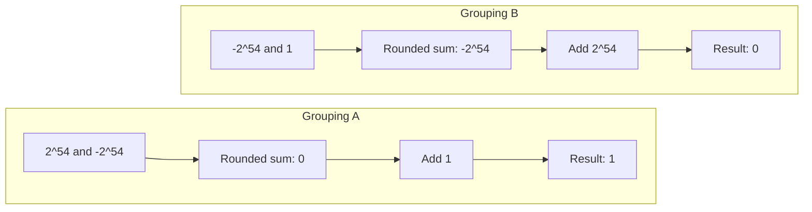
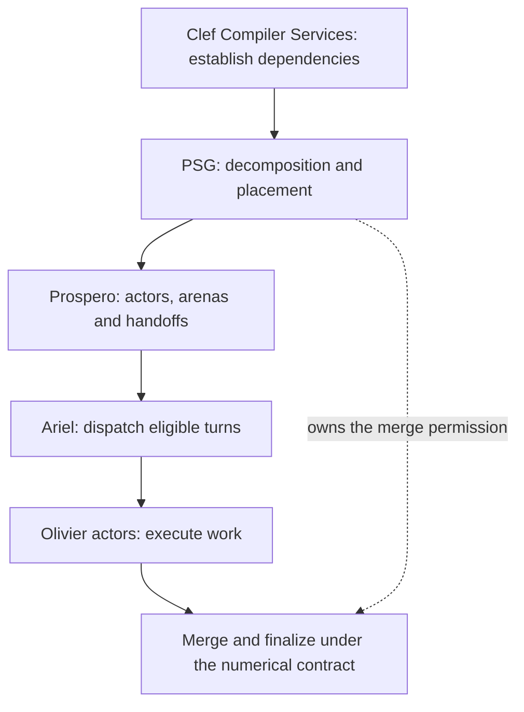
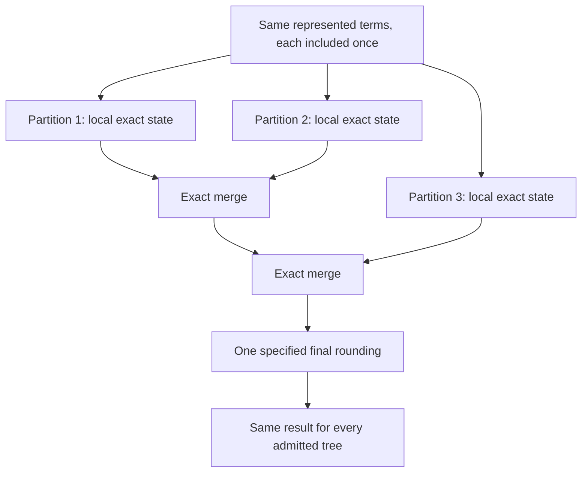
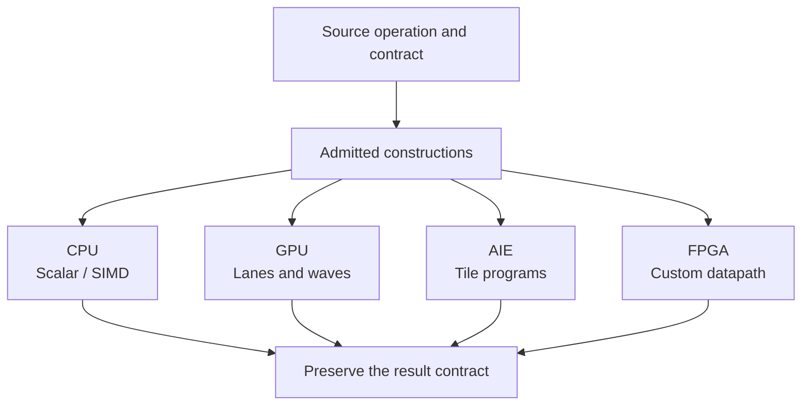
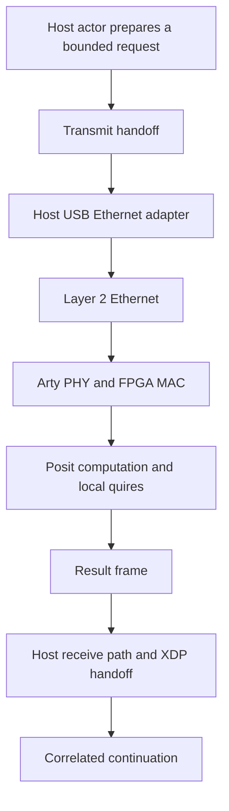
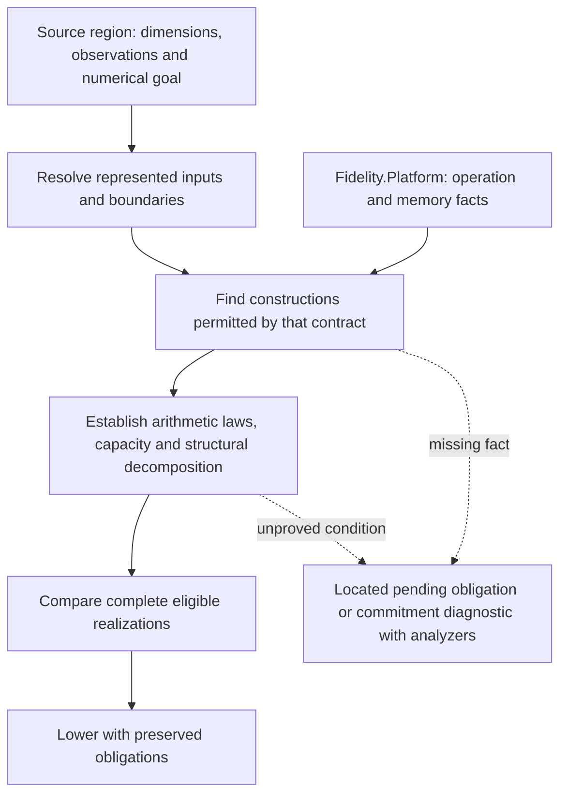
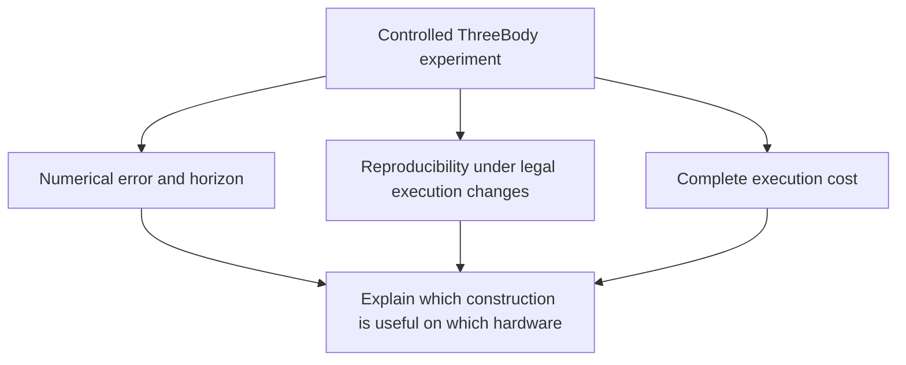

Tech stacks are always promising "fearless **this**" and "fearless ***that***". Follow the promise far enough and you find conditions: use this pragma, follow this recipe on our blog (and remember it), or just leave that operation to an expert. Conditions are unavoidable in engineering.

> The interesting question is who has to carry those conditions, and the consequence when assumptions reveal pernicious failure modes.

Rust gave the phrase a memorable home in Aaron Turon's [“Fearless Concurrency”](https://blog.rust-lang.org/2015/04/10/Fearless-Concurrency/) blog post. 'Ownership' turns a substantial class of bugs into compiler diagnostics instead of late-night investigations. That is a meaningful achievement. A programmer should be able to distribute work within a program without also volunteering to become a forensic specialist in corrupted memory.

But a data-race-free program can still deadlock, receive replies in an unfortunate order, or produce different numerical answers after a change in parallel decomposition. Rust's own [reference distinguishes those undesirable behaviors from memory unsafety](https://doc.rust-lang.org/reference/behavior-not-considered-unsafe.html). That distinction gives us a useful starting point: several different guarantees have been traveling under one very appealing word, and several of them remain ***un***satisfied without developer intervention. That doesn't read like 'freedom' to us.

What if a language and toolchain could bring more of those guarantees together, establish the relevant proofs, and offer a *pit of success* in which developers can see the trade-offs that matter for their engineering goal? What if changing the number of "threads in the braid" did not quietly change the mathematical conditions under which results were calculated?

That question has been with Clef from the beginning. In [“Weaving the Braid”](/blog/weaving-the-braid/), we explored braided parallelism: parallel work returning through the sequential decisions that give a program its direction. The braid has numerical crossings too. Results meet at reductions, force updates, matrix products and convergence tests. The order in which they meet can matter even when no workers share mutable memory.


This blog entry is a further exploration of that crossing. It connects our existing concurrency and numeric-selection designs to a proposed discipline for choosing *how arithmetic is constructed*. Some of the ingredients are established numerical algorithms. Some are compiler mechanisms we already exercise. Their integration into an automatic, verified selection path, with the ThreeBody comparisons described below, is work we look forward to exploring as we pin down the design and implementation. The [internals companion](/docs/internals/numerics/arithmetic-construction-and-placement/) records the engineering detail, and our [Numeric Selection](/spec/draft/numeric-selection/) spec entry details the contract.

## Changing Without Racing

Suppose a collection of workers calculates contributions to a total. Each worker owns its inputs and output. Every handoff obeys the memory model. The collector waits for all the results. There is no data race, use-after-free, or lost message.

Now let the workers use binary64 arithmetic, often called double precision, and examine three exactly representable inputs:

\[
a=2^{54},\qquad b=-2^{54},\qquad c=1.
\]

With round-to-nearest, ties-to-even, their grouping makes a difference:

\[
\begin{aligned}
\operatorname{fl}\bigl(\operatorname{fl}(a+b)+c\bigr)&=1,\\
\operatorname{fl}\bigl(a+\operatorname{fl}(b+c)\bigr)&=0.
\end{aligned}
\]

On the left, the large positive and negative numbers cancel exactly. The remaining one survives. On the right, adding one to the large negative number rounds back to that large negative number; the subsequent cancellation produces zero. The error is introduced at an intermediate operation, before the final answer exists.



This is a failure of **associativity**, the permission to change parentheses. For finite operands under the same rounding rule, ordinary floating-point addition is commutative: swapping the two operands of one addition does not explain this example. Changing which addition happens first does. Exceptional values and observable exception behavior require their own contract, so we will keep the first example deliberately finite.

A work-stealing scheduler need not produce this problem. It can execute a fixed arithmetic tree in whatever order dependencies allow. Trouble arises when the implementation also changes the tree: different chunk sizes, different worker partial sums, or a shared accumulator updated in arrival order. 

> Those are numerical decisions hiding inside execution decisions.

One remedy is to keep the reduction tree fixed by input indices. Workers may come and go while the same pairs still meet. That is a legitimate way to obtain reproducibility for a specified tree. It can also retain substantial parallelism. Its promise is narrower than “every legal regrouping gives the same answer,” and it does not automatically give the most accurate answer.

There are applications where that narrower promise is exactly right. A compatibility test might require the historical result. Another application might require the correctly rounded sum of all represented inputs. A third might accept a documented error bound in exchange for throughput. In our view, a toolchain needs to determine those factors before selecting an implementation or prompting the user to make an informed choice.

## Four Questions

We should take a moment to unpack four things a developer might mean by "fearless parallel" work.

| Question | Evidence needed |
|---|---|
| Can these computations access their data safely? | Ownership, lifetime, aliasing and publication conditions |
| Can the required work make progress? | Wait-for analysis, admission, fairness and completion assumptions |
| Do permitted execution choices preserve the result contract? | Dependency preservation and the arithmetic laws of the chosen construction |
| Is that result sufficiently accurate for the application? | Input, arithmetic and numerical-method error analysis |

None of these questions is answered merely by writing a pure function or drawing a graph. The graph helps collect dependencies and joint constraints. We still need to show that its transformations preserve those observations.

> Purity helps establish which observations matter.

For Clef, the attraction is that these facts can meet in the same Program Semantic Graph, or PSG. The memory lifetime of a partial accumulator, the dimension of the quantity it holds, the permission to merge it with another partial, and the rounding rule at its consumer are related facts about one computation. And our hyperedge structure in the PSG can carry the joint obligation. The hyperedge is where we keep the relationship, and we use proofs to confirm that the assertions hold.



The practical ambition is that an application author sees a coherent explanation. A reduction is reproducible under these decompositions; a buffer remains live until this completion event; an unresolved bound prevents this exact-accumulation candidate from being selected. Those are engineering findings attached to the code at the time of authorship.

## A Float Can Be Part of a Larger Number

Here is the part that deserves a more precise look. Using a floating-point processor does not require representing every intermediate mathematical quantity in a single floating-point value.

Consider a familiar physical analogy: a measurement can have a recorded value and a residual. The two together carry information that the first alone does not. Numerical algorithms can do something much more precise than that analogy suggests. Under stated conditions, with the required hardware capabilities, a computation can recover the *exact rounding residual* of a floating-point operation.

The classic TwoSum transformation takes two represented numbers and produces a pair. The high component is their ordinary rounded sum. The low component retains the part that rounding discarded. This Clef-style sketch uses immutable bindings throughout; for this illustration we consider its operations to be fixed to IEEE binary64, rather than left open to numeric selection:

```fsharp
let twoSum a b =
    let high = a + b
    let bPart = high - a
    let aPart = high - bPart
    let aError = a - aPart
    let bError = b - bPart
    let low = aError + bError
    high, low
```

With round-to-nearest/ties-to-even, gradual underflow, finite inputs and no intermediate overflow, the pair satisfies

\[
\operatorname{value}(\mathrm{high})+
\operatorname{value}(\mathrm{low})
=\operatorname{value}(a)+\operatorname{value}(b).
\]

The additions in this equation are real-number additions describing the pair. Immediately adding the two components back into one float can lose the residual again. Ogita, Rump and Oishi give the algorithm and its conditions in [*Accurate Sum and Dot Product*](https://ogilab.w.waseda.jp/ogita/math/doc/2005_OgRuOi.pdf), including its behavior under gradual underflow.

In our earlier example, applying TwoSum to \(2^{54}\) and \(1\) retains the pair \((2^{54},1)\). The machine did not acquire a larger scalar register. The computation acquired a richer representation of its intermediate result.

And the computation is itself *functional*. It consumes two values and returns two values. Its meaning does not depend on a global compensation object, a managed heap or a special execution service. A later function can consume the pair. Local mutation may be a valid lowering choice, but it is not a prerequisite for expressing the mathematics.

At the LLVM level the core is equally ordinary:

```llvm
%high   = fadd double %a, %b
%bpart  = fsub double %high, %a
%apart  = fsub double %high, %bpart
%aerror = fsub double %a, %apart
%berror = fsub double %b, %bpart
%low    = fadd double %aerror, %berror
```

The instructions form a small dependency graph. The two results can remain SSA values, then machine registers. Returning a source-language pair does not force an allocation. Whether a larger surrounding program keeps every component in registers depends on its register pressure and lowering; that is a question we can inspect rather than assume.

This little graph also makes a compiler hazard visible. Algebraic simplification over real numbers would conclude that the residual is zero. Floating-point rounding is precisely what makes it useful. LLVM's [fast-math permissions](https://llvm.org/docs/LangRef.html#fast-math-flags) can come to bear here. A construction that relies on these operations cannot casually inherit reassociation permissions that invalidate its argument. More elaborate control of the floating-point environment may require constrained operations. And what's more, the proof has to describe the instructions we actually emit. 

> Automating that proof is what would make this pathway fearless under its stated contract.

## Compensation Is A Process

TwoSum is an ingredient. It is not, by itself, a recipe for accumulating an arbitrarily long collection exactly into two floats. More contributions introduce more information. A bounded representation eventually needs a capacity argument, a rounding policy, or a different construction.

Kahan and Neumaier summation are useful compensated algorithms. Floating-point expansions retain several components. Binned accumulators organize contributions by magnitude. Superaccumulators represent a much wider exact sum, often using integer storage. These mechanisms have different accuracy, reproducibility, capacity and performance properties. Calling all of them “compensation” would hide the distinctions developers need to make informed choices.

[Radford Neal's exact-summation work](https://arxiv.org/abs/1505.05571) is one concrete example of recovering the exact sum of represented floating-point inputs and rounding at the end. Reproducible summation also has a substantial literature; [ReproBLAS](https://bebop.cs.berkeley.edu/reproblas/) distinguishes its bounded accumulator and reproducibility goals. A reproducible answer is not automatically a correctly rounded exact sum.

The product side needs equal care. A dot product can mean either of these:

\[
\begin{aligned}
S_{\mathrm{rounded}}
&=\sum_i\operatorname{value}\!\left(\operatorname{fl}(a_i b_i)\right),\\
S_{\mathrm{exact}}
&=\sum_i\operatorname{value}(a_i)\operatorname{value}(b_i).
\end{aligned}
\]

Both can be accumulated exactly *after* their terms have been defined. They are not generally the same sum. A fused multiply-add can help recover a product residual: compute a rounded product, then use an FMA to obtain the difference from that product, subject to the algorithm's range and underflow conditions. That gives another building block, not permission to ignore those conditions across an entire dot product.

For the developer, the relevant menu is therefore more informative than “float or posit.” It includes an ordinary specified fold, a fixed-tree reduction, a compensated reduction with its bound, a reproducible construction, and an exact accumulator with a final rounding rule. The compiler needs to know what is available from the hardware, and which of these answers the application has described before it can determine which implementation is 'cheapest' for the given precision and parallelism requirements.

There is a welcome consequence for machines whose efficient arithmetic is IEEE floating point. They are not excluded from the investigation. We can construct stronger numerical behavior from the instructions they already provide. The extra work is real, but it's worth expanding on how the opportunity is real as well. We're expecting to provide these mechanics in analyzers and other code helpers to make both the decision and placement easy and informed. And here we're doing a deeper dive to show what we intend for compiler services to provide in a fully fleshed-out implementation.

## An Algebraic Side Bar

The abstraction is relatively small, but the implications are large. Let \(X\) be the set of admitted represented terms, \(A\) the space of accumulator states, \(V\) the mathematical values we use to describe those states, and \(R\) the result representation. We need an empty state, a way to ingest a term, a merge, and a finalization:

\[
\begin{aligned}
e&\in A,\\
\operatorname{ingest}&:X\to A,\\
\operatorname{merge}&:A\times A\to A,\\
\operatorname{finish}&:A\to R.
\end{aligned}
\]

Let \(\nu:A\to V\) describe what an accumulator means. For an exact sum construction, the essential laws are

\[
\nu(e)=0,\qquad
\nu(\operatorname{ingest}(x))=\operatorname{value}(x),
\]

\[
\begin{aligned}
\nu(\operatorname{merge}(u,v))&=\nu(u)+\nu(v),\\
\operatorname{finish}(u)&=\operatorname{round}_{R}(\nu(u)).
\end{aligned}
\]

These laws apply only to admitted states and operations. With a finite accumulator, not every pair of states is necessarily a legal merge. The compiler must establish closure over every intermediate state reachable in the proposed decomposition. It cannot prove that the final total fits and quietly assume the route there also fits.

> This is the monoidal shape familiar from functional parallel reduction, with the finite-domain qualification made explicit.

Associativity and commutativity hold at the level of the represented mathematical value. Two accumulator encodings may carry different redundant limbs or normalization states while denoting the same sum. Requiring identical internal bytes would be unnecessarily strong. Requiring a common, deterministic finalization is what connects that denotational equality to identical result bits.



It follows then that a proof can proceed by induction over the merge tree. A leaf denotes its assigned term. A merge denotes the sum of its children. The root denotes the sum of the whole partition, independent of its shape. If finalization depends only on that denotation and the agreed output policy, every admitted tree produces the same output.

Notice what had to be supplied: the same terms, a partition that neither omits nor duplicates them, exact ingestion, valid merges and a common finalization. The word “functional” does not impose these premises automatically. It just happens to give us a coherent way to express those bounds.

NaNs, infinities, signed zero, posit NaR, observable exceptions and overflow do not disappear just to make the diagram look tidy. A construction *can* exclude some of those wrinkles through established range facts, or specify how to handle them. Either way, they belong in its domain and result contract. The finite exact-sum argument above should not be mistaken for a theorem about every possible bit pattern. For the broader range of cases we expect to enumerate options compatible with the hardware capabilities and representative selection of patterns that will expand as the framework matures.

## How the Quire Informs the Contract

A posit quire gives this exact-accumulation construction a particularly direct representation. Products of represented posit inputs accumulate in a wide fixed-point state. The computation rounds when it converts that state to its declared result representation.

The format matters. [Posit design from 2022](https://posithub.org/docs/posit_standard-2.pdf) specifies a quire of \(16n\) bits for an \(n\)-bit posit. The [bounded-posit design](https://arxiv.org/abs/2603.01615) used in our ThreeBody planning instead specifies an 800-bit quire for supported bounded widths above 12 bits. Those are different format contracts, not two interchangeable ways of naming posit32.

The appealing property is the elimination of intermediate accumulation rounding while the exactness conditions hold. Ordinary posit addition still rounds; replacing IEEE values with posits does not make ordinary addition associative. The quire is doing the work in this particular strategy.

Its width is finite. For an order-independent construction, the bound must cover every permitted partial sum and merge, including an unfavorable grouping of same-sign terms. A large positive subtotal followed by a large negative subtotal may overflow even though the final answer is small. A bound on total absolute contribution is one conservative way to avoid that failure; tighter application invariants may establish more.

The endpoint also matters. If workers lose information by rounding their partial quires to posits before merging them, they have changed the construction. To preserve an exact global sum, the partial information must survive until the agreed final rounding. A conversion proved exact for every admitted partial is permissible. A transfer may carry an exact accumulator state, or the whole reduction may remain local and return its final result. Those are different placement choices with different communication costs.

The quire is satisfying conceptually because it makes the desired behavior tangible. The state is wide, the accumulation is exact under its contract, and the rounding boundary is visible. But it does not eliminate the need for engineering. It gives that engineering a clean object to reason about, but as we see here the landscape is more nuanced than one technique can satisfy.

## The Processor Gets a Vote

So far we have been focusing on mathematical constructions. A real machine now enters the conversation, carrying a register file, a cache hierarchy, a power budget and a rather particular opinion about which instructions are advantaged.

“Software arithmetic” is too broad a category to inform this treatment. Six native floating-point instructions operating on registers are software. So is a loop over hundreds of heap-resident limbs. Their costs, dependencies and memory behavior are completely different. Before declaring compensation expensive, we should find out which one the solution actually needs.

TwoSum's independent residual calculations may offer instruction-level parallelism. Across many independent pairs, SIMD can execute corresponding operations in several lanes. Neither opportunity licenses reassociation within the primitive. The vectorization question is whether we can perform several *valid instances* together, and whether that saves time on this processor. LLVM's [vectorizer documentation](https://llvm.org/docs/Vectorizers.html) describes the role of target costs and legality in such decisions.

A wide quire raises a different question. Eight hundred bits fit in the storage capacity of two 512-bit registers, but that observation does not make an 800-bit integer addition a single vector operation. Carries have to cross component boundaries. Products have to be aligned. Other live values compete for the same registers. The useful description is an instruction sequence and its resource requirements, not a sketch of two conveniently wide boxes.

This is where `Fidelity.Platform` should supply more than “x86_64,” “Arm” or “RISC-V.” We need the concrete arithmetic facilities: operand and result formats, FMA behavior, rounding controls, subnormal handling, vector shapes, register constraints and relevant memory topology. A Cortex-M33 target may have a very different arithmetic offering from a desktop CPU. A RISC-V part's extensions determine what it actually provides. The architectural family name is the beginning of the lookup.

Our [internals design](/docs/internals/numerics/arithmetic-construction-and-placement/) identifies that extension to the platform properties we currently carry: shared contracts describe the facts; silicon descriptions supply them; environments state which facilities are available for a given configuration; profiles select an admitted set of constraints. This feeds our Program Semantic Graph with information that applies across those decisions and should provide fodder for analyzers and other tooling we'd use to enumerate properly informed choices at design time.

The distinction is constructive. A primitive that needs gradual underflow might be valid on one target and invalid under another target's active flush-to-zero mode. A different implementation might satisfy the same source contract there. The developer should see that change in realization without having to rewrite the application around it, or reconsider their assumptions at every juncture in the code.

## The Cache Also Gets a Vote

In [“Counting the Cost of Coordination”](/blog/counting-the-cost-of-coordination/), we looked at work that appears inexpensive in source but becomes expensive when several cores negotiate ownership of memory. Numerical accumulation has the same trap. One shared total can turn otherwise independent work into a queue at the cache-coherence boundary.

A private accumulator per worker introduces additional state and a later merge. It may also remove repeated shared updates. That is a plausible route to better throughput even when each local accumulation uses more instructions. The comparison has to include the synchronization it replaces, the merge it introduces, and the cache footprint of all those partials.

Private ownership alone does not establish cache-line separation. Two actors' disjoint allocations can occupy the same line. The layout needs appropriate alignment and extent padding where isolation is required; shared queue metadata needs its own analysis. Our [CPU cache companion](/docs/internals/hardware/cache-aware-compilation-cpu/) makes those conditions explicit. Likewise, fitting in a cache does not guarantee residency once competing work begins.

This is the setting in which “negative cost of abstraction” considerations become interesting. A source-level abstraction can expose facts that a manually assembled implementation failed to exploit. A recognized reduction may permit private state, vectorized ingestion and one bounded merge phase.

> The abstraction did not make compensation instructions free. It gave the compiler a larger, better-described unit of work to organize.

We should compare the resulting programs, including a strong hand-written baseline. Adding an abstraction and counting fewer source lines proves very little. Removing contention while preserving the requested answer is an engineering result worth measuring.

## A GPU Is Another Animal

On a GPU, the same extra accumulator components consume per-thread registers. More components can reduce the number of resident waves, introduce spills or change how a reduction uses shared local memory.

> An arithmetic construction that is attractive on a CPU can lose its advantage on an accelerator after that change in occupancy and traffic.

There are also useful opportunities: many independent contributions, lane communication, workgroup-local reductions and substantial throughput for supported arithmetic. "Embarrassingly Parallel" is a popular phrase for a reason. But ***braided*** parallelism is more common than purveyors of common processor architectures would admit. A complete candidate includes how data is partitioned across lanes, which barriers are required, how partial results move, and what happens at the final merge. The [GPU cache companion](/docs/internals/hardware/cache-aware-compilation-gpu/) treats those as concrete target questions, many of which remain open to advantaged resolution with other accelerator designs.

AMD's [rocPRIM reduction interface](https://rocm.docs.amd.com/projects/rocPRIM/en/latest/device_ops/reduce.html) already accommodates custom accumulator types and operations. Its ordinary reduction contract expects associativity and commutativity, and warns about floating-point nondeterminism. That is a useful reminder: an execution facility can accept an operation without proving that the operation supplies the laws its decomposition needs.

We are committed to embracing those constructive constraints ***at design time*** before selecting a given decomposition pattern. HIP describes a programming and dispatch environment; it does not supply a general theorem about the user's arithmetic. Our Composer compiler's existing AMD GPU backend takes MLIR through GPU and ROCDL lowering to a code object. Extending the numerical analysis can feed that native path without requiring Clef source to become HIP C++. Loading, dispatch and completion still require explicit platform bindings, which we intend to express directly in Clef without C helper code.

## A Tile Can Construct Arithmetic Too

Spatial AI engines give us an illuminating example of arithmetic assembled from other arithmetic. AMD documents [FP32 emulation on AIE-ML](https://docs.amd.com/r/en-US/ug1603-ai-engine-ml-kernel-graph/Floating-Point-Accuracy) using several BF16 components. Its accuracy modes expand multiplication into different sequences of vector multiply and multiply-accumulate operations. The documented examples use three, six or nine such operations, with different accuracy behavior and explicit treatment of small values.

This is an existing hardware-specific construction. It is approximate FP32 emulation, with limitations; it is not an exact quire. Nor should we assign its rules to every XDNA generation because the names look related. The point is that “what number is being computed” and “which native operations realize it” are already separate questions.

In [MLIR-AIE](https://xilinx.github.io/mlir-aie/dev/), arithmetic can be placed in tile programs while buffers, locks, DMA and streams describe communication. [ObjectFIFO lowering](https://xilinx.github.io/mlir-aie/dev/ObjectFifoLowering/) turns a convenient communication abstraction into concrete storage and synchronization. Our analysis must account for both the tile's arithmetic behavior and the paths that keep it supplied.



An accuracy/performance mode is an informative candidate, provided its actual error contract is acceptable. Selecting it silently because the NPU is idle would confuse a placement opportunity with permission to alter the precision of an outcome without an *informed choice*.

## A Quire with an Ethernet Address

The other end of our ThreeBody setup is an Arty A7-100T FPGA. We want to give the posit/quire path fair play on hardware that actually implements its arithmetic, rather than judge it entirely by software running on a processor optimized for IEEE floating-point operations.

An FPGA can realize posit decoding, product formation, alignment and accumulation as a dedicated circuit. That is a strong opportunity for this particular construction. It is also a bounded fabric with routing delays and a clock to meet. “Hard wired” does not mean “without cost.” It means the cost becomes a circuit we can inspect and measure.

Our early question was whether the Arty could hold sixteen 800-bit quires. The [Artix-7 resource table](https://docs.amd.com/r/en-US/ug474_7Series_CLB/7-Series-FPGA-CLB-Resources) lists 63,400 LUTs and 126,800 flip-flops for the 100T. Sixteen register-resident accumulators require 12,800 state bits, about 10.1% of those flip-flops. A simple one-LUT-per-bit estimate for sixteen wide adders suggests roughly 20.2% of the LUTs, with carry resources also required.

Those are preliminary arithmetic estimates, not a synthesis report for sixteen posit MAC lanes. The multipliers, variable alignment, control, rounding and Ethernet implementation remain to be budgeted. Sixteen accumulator contexts could share fewer arithmetic pipelines. Conversely, replicating full pipelines could run into routing or timing limits before exhausting the headline LUT count. Composer's fabric analysis and Vivado results should decide which organization is useful.

The planned transport is raw Layer 2 Ethernet with host BPF/XDP involvement.



The [BPF article](/blog/building-bulletproof-ebpf-programs/) explains the host admission and packet-handling side. For an AF_XDP realization, transmit and receive rings have distinct roles, and [zero-copy support depends on the actual driver and binding mode](https://docs.kernel.org/networking/af_xdp.html). BPF verification does not prove our application has processed each numerical contribution once. A retry must not double-add a product to a live quire; a late reply must not update the next timestep.

This makes the unit of offload important. A network round trip for one multiplication is unlikely to be an attractive use of the fabric. A complete force region, a batch of independent systems, or persistent FPGA-local state may amortize the boundary. Each has a different ownership, cancellation and state-recovery contract. The analyzer's useful question is how much valid computation stays on each side of the link.

If the FPGA completes the full scope of reduction, it can return one properly finalized result. If the host still needs an exact partial to combine with others, the transfer must preserve that partial's information. A smaller encoding is eligible if that conversion is proved exact over the admitted partials. Discarding information to make a packet smaller changes the numerical policy, so precise design and careful experimentation will follow.

## Expanding Numeric Selection

Clef already separates a quantity's source-level meaning from its eventual representation. A dimensioned `float` carries a real-valued kind and a unit; it does not force the author to choose an IEEE width or a public posit wrapper at every binding. [Deferred inference](/blog/deferred-inference/) lets the relevant facts settle when the surrounding computation and target provide enough information.

The proposed extension follows that direction. We need to select both a representation and an arithmetic construction for a region. The construction might retain a residual pair, use an exact accumulator, or preserve a fixed reduction tree. Its result must satisfy the source operation's contract.

An ordinary sequential fold whose specified behavior rounds after every addition cannot simply become an exact sum merely to improve accuracy. They compute different functions on represented inputs. Recognition discovers an opportunity; the source semantics determine whether that opportunity is permitted. Our [spec extension](/spec/draft/numeric-selection/#103-arithmetic-construction-contracts) makes that distinction explicit.

Likewise, finding a familiar pattern in a graph is not the same as establishing its preconditions. Range evidence has to cover the operands and intermediates. Aliasing and effects have to permit decomposition. If a construction depends on a special rounding environment, that requirement must survive calls and boundaries that could change it, including the targeted hardware.

As daunting as it can be to consider all of this information, the mechanics of this can still be a welcoming developer experience. The compiler knows the source locations, the contributing values and the target facts. It can attach an unresolved accumulator bound to the reduction that needs it, show the upstream range that is missing, and preserve the obligation while inference continues. When commitment is required, a missing premise should become a precise diagnostic with options to supply the best choice(s) for a given design.



For a reduction whose source contract requests exact accumulation of represented products, an illustrative design-time explanation might read like this:

```text
Force reduction
  Inputs: selected representation and established operand bounds
  Product contract: exact products of the represented inputs
  Accumulation: exact; capacity established for admitted partitions
  Finalization: one conversion under the result format's rule
  Parallel freedom: any admitted partition and merge tree
  Transport cost: measurement pending for this deployment
```

Taking inspiration from F#'s “type providers,” we envision a related “math provider”: reusable constructions carry their laws and premises, and Composer instantiates them against the graph. It need not generate an opaque helper library or invent a new family of source types for each target. The delivered code can be ordinary native instructions or a circuit. The substantial work is proving the construction and preserving its conditions through lowering.

The current spec deliberately keeps performance out of the representation-selection score. It selects by accuracy within the offered, covering and policy-admitted candidates. We should preserve that clarity. Cost can compare realizations that satisfy the same numerical requirement. A policy that accepts less accuracy for more throughput would need to be explicit, and that remains top-of-mind as we proceed with this work.

The ***pit of success*** is therefore not a compiler that guesses a preferred trade-off. It is a hands-free toolchain that makes the admissible choices understandable, selects (and allows developer selection/overrides) within declared goals, and explains when those goals cannot be met under the selected constraints.

## Count the Graph That Does the Work

Our [flow-loss analysis entry](/blog/going-deep-with-flow-loss-analysis/) gives this discussion another dimension. It asks how much of a computation's available parallel structure survives a realization. Arithmetic construction changes that structure itself.

A compensated reduction introduces residual operations. An exact accumulator introduces ingestion and merge work. A fixed tree constrains which partials may meet. An FPGA pipeline may overlap stages, while a network boundary introduces dependencies that a local implementation does not have. These are different realization graphs connected to the same source contract.

For a candidate \(c\), let \(W_c\) be its work and \(S_c\) its critical-path span under a stated cost model. In an idealized setting with \(P\) identical workers,

\[
T_c(P)\geq\max\!\left(\frac{W_c}{P},S_c\right).
\]

That lower bound does not include everything a real machine provides (and demands). Memory contention, limited bandwidth, synchronization and transfers can make execution longer. Nor should we hold \(W\) and \(S\) fixed after changing the arithmetic algorithm. The compiler must retain the connection between the source graph and each candidate's actual graph.

It is useful to record arithmetic, data movement, synchronization and boundary costs separately, then model their overlap and dependencies. Simply adding four totals can overcount a pipelined execution. Counting only arithmetic can miss the bottleneck entirely. A measured pipeline needs throughput and latency observations; a hard deadline needs justified bounds under its stated assumptions.

> This is where a stronger numerical construction can gain an advantage even with a longer instruction sequence.

Private accumulation can remove shared contention. A larger offloaded region can avoid repeated host crossings. A different layout can make vector operations useful. The analysis should identify the opportunity, predict under a declared model and then meet the counters and timing measurements with its predictions still attached.

## Experimenting with Numerical Futures

Our ThreeBody sample project is an experiment to explore this solution space visually. A few moving points can expose the numerical consequences of choices that otherwise disappear into a benchmark table. Research has helped focus that experiment on exact accumulation, conservation diagnostics and the limits of computational reversal.

The starting gate is two side-by-side portrayals of bodies in a 2D plane. Each side has the same initial-condition policy, equations, fixed timestep and symmetric integration method across the principal arithmetic variants. The controls include ordinary FP64, FP64 with compensated accumulation, an exact-accumulation IEEE construction, and the intended bounded-posit/quire path. A separate fixed-point method can test bitwise reversal only when its update is actually bijective under the declared overflow behavior.

The reference is an independent high-precision calculation checked for convergence over the interval we report. A pleasing orbit or a small energy residual alone is not what we're going for. Energy, linear-momentum and angular-momentum drift, along with reversal residual, are useful diagnostics, but they answer different questions. If we later constrain a trajectory by projecting it onto a conservation condition, we should not present that same condition's tiny residual as an objective 'victory' for its arithmetic.

For a numerical prediction horizon, we first need a dimensionally sensible measure of error. Let \(q_i\) and \(p_i\) be position and momentum, and choose positive reference scales \(L\) and \(P_0\). One possible definition for construction \(c\) is

\[
E_c(t)=\max_i\left\{
\frac{\lVert q_{i,c}(t)-q_{i,\mathrm{ref}}(t)\rVert}{L},
\frac{\lVert p_{i,c}(t)-p_{i,\mathrm{ref}}(t)\rVert}{P_0}
\right\}.
\]

For a stated tolerance \(\tau\), the observed horizon is the first sampled time at which this error crosses the threshold. If it never crosses during the run, we have a lower bound on the observed horizon.

The tempting phrase is “a Lyapunov limit for each style.” More precisely, the style can change the *numerical horizon*. The underlying physical dynamics have their own sensitivity. In a simple local exponential-growth picture,

\[
\delta(t)\approx\delta_0 e^{\lambda t},
\qquad
T\approx\frac{1}{\lambda}\log\frac{\tau}{\delta_0}.
\]

Reducing initial error by a factor \(k\) would extend that illustrative horizon by \(\log(k)/\lambda\). But a running integrator continually introduces fresh error, and sensitivity varies along the trajectory. An average Lyapunov exponent is not automatically a worst-case growth bound. The [Lyapunov Window companion](/docs/design/types/lyapunov-window/) separates this intuition from the evidence required for a certified bound.

The quire can remove accumulation rounding. It cannot restore coordinates already rounded before subtraction, make a reciprocal or square root exact, or remove discretization error. A longer useful horizon is therefore a hypothesis to test across initial conditions and timesteps. Posit32 and FP64 also have different input precision and range behavior. We should show where a benefit appears, where it disappears, and which stage explains it.

## Give the Demonstration Three Axes

There are really three experiments to display together.

| Axis | What we vary | What we observe |
|---|---|---|
| Numerical quality | Arithmetic construction under a controlled method | Error against reference, horizon and invariant residuals |
| Reproducibility | Worker count, legal grouping and arrival timing | Equality of results under the promised scope |
| Execution cost | Hardware realization, layout and placement | Useful throughput, latency, storage, traffic and coordination |



An exact reduction over the same represented terms should not acquire a different answer merely because it ran on an FPGA instead of a CPU, provided the full construction and finalization contracts match. If it does, the discrepancy points us toward changed upstream operations, conversions, exceptional behavior, synchronization or an implementation defect. Hardware placement should be a controlled variable.

An AIE approximation with a different arithmetic contract belongs in a different numerical candidate. That does not disqualify it. It lets the experiment ask whether its measured accuracy and cost are useful for the declared goal. Calling everything “the same float calculation” would conceal the interesting result.

Three bodies also offer only a small number of pair interactions per step. A large collection of independent initial conditions may be a much better way to saturate the Ryzen CPU, GPU or several FPGA accumulator contexts. That ensemble tests throughput; a single dependent trajectory tests latency. We should report both when we have them, without confusing an ensemble's speed with a shorter dependency chain for one orbit.

There is a particularly valuable outcome even if the headline posit advantage is smaller than hoped. An exact IEEE control might capture most of the improvement. The FPGA's network cost might dominate a small case. Compensation might be the most useful option on one CPU and lose on one GPU. A selection framework should learn from all of those results. Its purpose is to make the engineering choice sound, not to arrange the experiment around a predetermined winner.

## Fearless in a New Dimension

It should be apparent now that "fearless parallelism" *isn't* "free". But we have a concrete design and a carefully considered plan to make it worth the extra engagement at those critical junctures in an application that can make or break trust with a customer.

Developers reach for parallelism to solve larger problems, shorten the wait for an answer, keep an application responsive, and make full use of the resources they've been provided. The frustration many feel when their tools obstruct those goals is legitimate. Compromises calcify into common practice, and the workarounds become engineering lore: recipes to memorize, defensive code to maintain, and design limitations inherited long after their original justification has faded. That burden can consume the very effort developers hoped to spend on their application. We are working to trade that frustration for opportunity, with an honest accounting of the costs and benefits: what the hardware can offer, what the computation requires, and which obligations the toolchain can establish and preserve on the developer's behalf.

That is what it means to bring **fearless parallelism** into the developer's standard lexicon: freedom to use the parallel structure that best suits your solution, with the compiler offering checked numerical contracts, without schedule-dependent rounding surprises and other *gotchas* rearing their ugly heads at runtime.

There will still be little surprises along the way. A hardware target may not meet a timing deadline. An exact accumulator may require more capacity. An application may deliberately prefer a bounded approximation. 

> The pit of success is that these choices become visible, informed and checked where the developer makes them in context with other design considerations.

The braid already tells us where results meet. Now we want it to tell us what survives the meeting, and to put the hardware to full use without losing the answer along the way.
