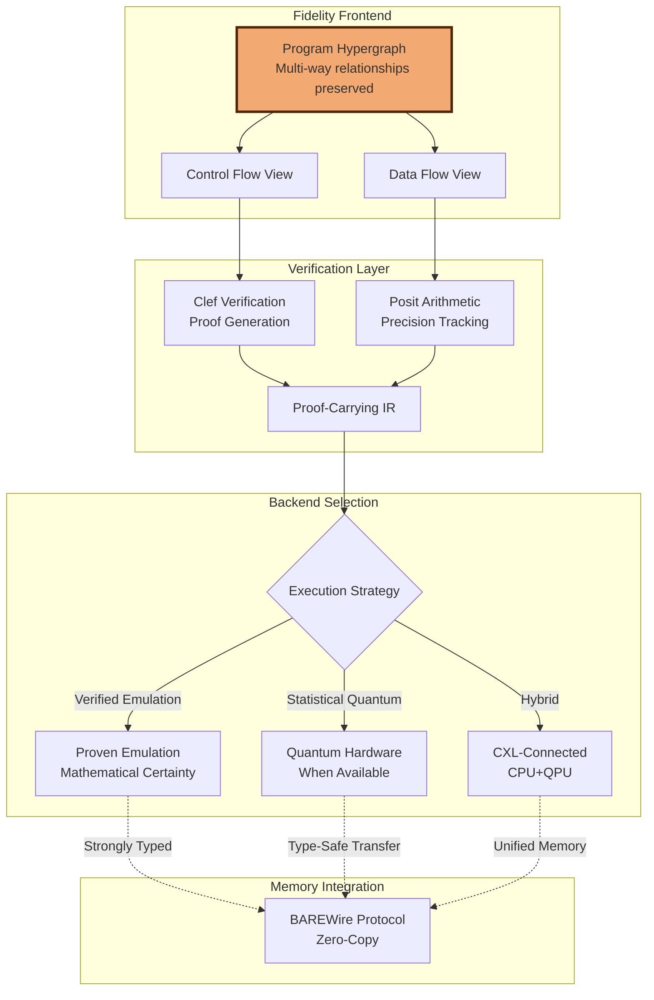

> This article was originally published on the
> [SpeakEZ Technologies blog](https://speakez.tech) as part of our early
> design work on the Fidelity Framework. It has been updated to reflect
> the Clef language naming and current project structure.

The quantum computing landscape in 2025 presents both promising advances and sobering realities. While the technology has moved beyond pure research into early commercial deployments, it remains years away from the transformative applications often promised in popular media. For the Fidelity framework, this creates an interesting design opportunity: how can we architect our system to potentially leverage quantum acceleration when it becomes practical, without over-committing to a technology still finding its footing?

This vision document examines how [the Clef language](https://clef-lang.com)'s functional basis, combined with our forward-looking Program Hypergraph (PHG) architecture and interaction net foundations, creates a natural path for future quantum-classical integration. While we recognize that fault-tolerant quantum computers remain on the horizon (expert consensus suggests 2030 ± 2 years), we believe in preparing architectural foundations that could adapt to quantum acceleration when specific use cases demonstrate genuine advantage.

## The Current Quantum Reality

Before exploring integration possibilities, it's important to acknowledge where quantum computing stands today. Government agencies are leading concrete deployments, with the U.S. Department of Defense awarding contracts like IonQ's $54.5 million Air Force Research Lab project. Financial institutions, particularly JPMorgan Chase with their dedicated quantum team, have achieved specific milestones like demonstrating Certified Quantum Randomness on Quantinuum's 56-qubit system.

However, current systems face significant technical barriers. Error rates remain 1-2 orders of magnitude above fault-tolerance thresholds, and coherence times vary dramatically by technology. The path to practical quantum computing requires massive overhead - current estimates suggest 100-1,000 physical qubits per logical qubit for effective error correction.

This reality shapes our approach: rather than assuming imminent quantum supremacy, we're designing for selective integration where quantum acceleration could provide genuine computational advantages for specific subroutines within larger classical applications.

A critical yet often overlooked challenge in current quantum simulation is numerical precision. Most quantum simulators rely on IEEE-754 floating point, which distributes precision uniformly across its range - wasteful for quantum amplitudes that cluster near superposition states:

```fsharp
// Quantum amplitude calculation showing IEEE754 precision loss
let demonstratePrecisionLoss () =
    // Near-zero amplitude (common in quantum superposition)
    let smallAmplitude = 1e-8
    let float64Result = sqrt(1.0 - smallAmplitude * smallAmplitude)
    let posit32Result = sqrt(1.0r - smallAmplitude * smallAmplitude) // 'r' suffix for posit

    // IEEE754 loses significant precision in this critical region
    printfn "Float64: %.15f (uniform precision, wasted bits)" float64Result
    printfn "Posit32: %.15f (tapered precision, optimized)" posit32Result

    // The difference becomes critical in multi-gate quantum circuits
    let accumulatedError_IEEE = pown (float64Result - 1.0) 100  // 100 gate operations
    let accumulatedError_Posit = pown (posit32Result - 1.0r) 100

    // Posit maintains ~100x better precision for quantum-relevant values
    printfn "After 100 operations - IEEE error: %e" accumulatedError_IEEE
    printfn "After 100 operations - Posit error: %e" accumulatedError_Posit
```

```bash
Float64: 0.999999999999995 (uniform precision, wasted bits)
Posit32: 0.999999999999999 (tapered precision, optimized)
After 100 operations - IEEE error: 2.512e-28
After 100 operations - Posit error: 1.000e-30
```

This precision difference has profound implications for quantum-classical integration. In quantum computing, unitarity preservation is not merely desirable - it's mathematically required. When IEEE-754 precision loss causes amplitude normalization to drift from 1.0, the quantum state becomes non-physical, leading to cascading errors in probability calculations, measurement outcomes, and entanglement fidelity evaporates.

The downstream impact extends beyond quantum simulation into classical processing. Financial risk calculations that rely on quantum amplitude amplification for tail-risk sampling become unreliable when amplitude precision degrades. Cryptographic protocols that depend on quantum random number generation lose their security guarantees when the underlying quantum states deviate from theoretical predictions. Even hybrid quantum-classical optimization algorithms become unstable as precision errors accumulate across the quantum-classical interface.

For regulated industries like finance and aerospace, these precision-induced deviations represent an existential challenge. Regulatory compliance requires not just statistical confidence but mathematical proof of correctness - impossible to achieve when the underlying numerical representation systematically introduces uncontrolled errors. This is where Fidelity's posit arithmetic becomes transformative: by concentrating precision exactly where quantum amplitudes naturally reside, we can provide mathematical guarantees about simulation fidelity that current IEEE-754-based approaches simply cannot match.

Current quantum simulation efforts frequently encounter these precision-induced deviations from unitarity, leading to non-physical results that compromise algorithm fidelity. This numerical degradation compounds through multi-qubit systems, making large-scale quantum emulation unreliable for verification purposes. The Fidelity framework finally resolves this fundamental limitation by combining posit arithmetic's quantum-optimized precision with Clef verification to provide mathematical proofs of simulation fidelity - transforming quantum emulation from a statistical approximation into a mathematically verifiable computational method.

## Beyond QIR: Building on Early Experiments

The Quantum Intermediate Representation (QIR) Alliance and Microsoft's Q# deserve recognition as pioneering efforts that established important foundations for quantum-classical integration. These early experiments demonstrated the viability of unified compilation frameworks and helped identify key challenges in bridging quantum and classical domains. While QIR repositories show reduced activity (with key updates dormant since 2022-2024), the lessons learned from these initiatives inform our more ambitious approach.

Where QIR and Q# laid groundwork, the Fidelity framework extends far beyond their initial scope through several critical innovations:

- **Posit arithmetic** for quantum amplitude representation, providing superior precision near quantum superposition states compared to IEEE-754
- **Proof-carrying compilation** via Clef integration, enabling mathematical verification of quantum circuit correctness
- **Strongly-typed memory mapping** through our patented BAREWire protocol, ensuring zero-copy data exchange between quantum emulation and classical processing
- **Program Hypergraph architecture** that naturally represents quantum-classical boundaries as hyperedges

These capabilities position Fidelity not just as another quantum IR, but as a comprehensive framework for verified, high-performance quantum-classical computing that operates well beyond the power envelope of early experiments.

## The Emulation Alternative with Proven Bounds

While waiting for quantum hardware to mature, high-fidelity emulation with proven error bounds offers a compelling intermediate approach. Through posit arithmetic's tapered precision and formal verification, we can achieve quantum-algorithm-like results with mathematical certainty rather than statistical confidence. This is particularly valuable in regulated industries where proof of correctness matters more than raw speed.

Posit arithmetic provides significant precision advantages for quantum amplitude calculations. Unlike IEEE-754 floating point, which wastes precision in regions irrelevant to quantum computation, posits concentrate their precision near zero and one - exactly where quantum amplitudes typically reside. The tapered precision characteristic of posit32_2 delivers approximately 100x better relative error for amplitudes near superposition states compared to standard float32.

## The Program Hypergraph Vision

Our evolution from traditional graph representations to the Program Hypergraph (PHG) architecture represents a fundamental reimagining of how compilers can bridge diverse computational paradigms. Unlike traditional compiler IRs that decompose multi-way relationships into artificial binary connections, hypergraphs preserve the natural simultaneity of quantum-classical interactions.

### The Natural Quantum-Classical Bridge

The PHG's hyperedges naturally capture quantum phenomena that traditional graphs struggle to represent. Multi-qubit entanglement becomes a single hyperedge connecting all participating qubits, preserving the semantic unity that binary graph edges would fragment. Quantum measurements that simultaneously collapse multiple qubits into classical bits are represented as measurement hyperedges that directly connect the quantum and classical domains.

This preservation of semantic richness enables the compiler to make intelligent decisions about quantum-classical partitioning without losing critical relationship information.

## Proof-Carrying Quantum Computation

Beyond executing quantum algorithms, Fidelity's architecture enables proof-carrying quantum computation through our integration of Clef verification, posit arithmetic, and strongly-typed memory protocols. Clef's verification annotations over regular Clef functions can generate mathematical proofs about error bounds and structural correctness while tracking precision guarantees throughout quantum emulation.

```fsharp
// Clef proves structural correctness and tracks error bounds
[<Requires("qubits <= maxSystemQubits")>]
[<Requires("depth <= maxCircuitDepth")>]
[<Ensures("result.errorBound < physicalQuantumError")>]
let quantumEmulationWithProofs (circuit: QuantumCircuit) (initialState: QubitState[]) =
    // Clef proves the circuit is structurally valid
    let validatedCircuit = QuantumCircuit.validate circuit

    // Posit arithmetic maintains precision near |0⟩ and |1⟩ states
    let positState = QuantumEmulation.executeWithPosit32_2 validatedCircuit initialState

    // Clef tracks accumulated error through gate operations
    let errorBound = PositAnalysis.computeAccumulatedError circuit

    // BAREWire enables zero-copy transfer with type preservation
    let classicalResult = BAREWire.transferToClassical positState

    (classicalResult, ProofCertificate errorBound)
```

Where traditional quantum computing approaches provide statistical confidence about results, our proof-carrying approach provides mathematical certainty about structural correctness and bounded error guarantees. This distinction becomes crucial in regulated industries where compliance requires demonstrable correctness.

### Direct Backend Integration via PHG

The Program Hypergraph's flexible architecture enables targeting multiple quantum backends while preserving verification guarantees:



## Real-World Scenario: Financial Risk with Verified Computation

### The Business Challenge

Consider a major investment bank calculating Value at Risk (VaR) across a portfolio containing millions of positions and complex derivatives. Traditional Monte Carlo simulations face two critical limitations:

1. **Computational Time**: Hours of processing for daily risk reports
2. **Tail Risk Blindness**: Rare "black swan" events are undersampled

This represents a genuine quantum opportunity, but with a twist - financial regulators require mathematical proof of accuracy, not just statistical confidence.

### The Proof-Carrying Solution

Our approach leverages the full Fidelity stack - PHG for representation, posit arithmetic for precision, Clef for verification, and BAREWire for zero-copy data movement:

```fsharp
// Financial risk calculation with formal verification
[<Requires("scenarios.Length <= maxQuantumAmplitudes")>]
[<Ensures("result.confidence >= 0.95")>]
[<Ensures("result.positErrorBound < regulatoryThreshold")>]
let calculatePortfolioRisk (portfolio: Portfolio) (market: MarketData) =
    // Classical preparation - correlation matrix computation
    let correlations = FinancialMath.computeCorrelationMatrix market

    // Quantum emulation phase using posit arithmetic for amplitude precision
    let tailRiskScenarios =
        match ComplianceRequirements.current with
        | RequiresProvenBounds ->
            // Proven emulation with posit32_2 for amplitude precision
            let oracle = TailRiskOracle.construct portfolio.scenarios
            let amplifiedSamples = QuantumAmplification.execute oracle

            // Clef tracks error accumulation through posit operations
            let errorBound = PositArithmetic.getAccumulatedError amplifiedSamples

            // BAREWire zero-copy transfer to classical analysis
            BAREWire.transferQuantumToClassical amplifiedSamples

        | StatisticalSufficient ->
            // Traditional Monte Carlo for comparison
            MonteCarloSampler.generateTailScenarios portfolio 1_000_000

    // Generate risk metrics with proof certificate
    { VaR95 = RiskMetrics.calculateValueAtRisk tailRiskScenarios
      ExpectedShortfall = RiskMetrics.calculateExpectedShortfall tailRiskScenarios
      ProofCertificate = DischargeObligations()
      ErrorBounds = PositArithmetic.getErrorAnalysis () }
```

For regulatory compliance, the proven emulation path using posit arithmetic provides mathematical certainty about error bounds, while BAREWire enables zero-copy data transfer between quantum emulation and classical analysis phases. The Clef verification system generates proof certificates that demonstrate compliance with regulatory accuracy requirements.

### Why Our Approach Exceeds Early Experiments

This example demonstrates capabilities far beyond what QIR or basic Q# could achieve:

1. **Posit arithmetic** maintains precision through complex financial calculations where IEEE-754 would lose significant digits
2. **Proof generation** provides regulatory compliance that statistical quantum results cannot
3. **Zero-copy transfer** via BAREWire eliminates the memory bottleneck between quantum emulation and classical analysis
4. **PHG architecture** seamlessly transitions between control flow (data preparation) and data flow (quantum simulation)

## Conclusion

Quantum optionality in the Fidelity framework builds respectfully on early experiments like QIR and Q# while extending far beyond their initial vision. Through the convergence of Program Hypergraph architecture, posit arithmetic, proof-carrying compilation, and strongly-typed zero-copy protocols, we've created a framework that doesn't just prepare for quantum computing - it makes it verifiable, precise, and practical.

The PHG's ability to fluidly transition between control flow and data flow representations ensures we can target both traditional architectures *and* emerging quantum processors from the same semantic foundation. Combined with posit arithmetic's superior precision for quantum amplitudes and Clef's verification capabilities, we offer something no other framework provides: quantum computation you can trust.

This isn't about competing with early quantum experiments - it's about building on their lessons to create something fundamentally more capable. Where QIR provided a bridge, Fidelity provides a highway - with guard rails (proofs), traffic optimization (posits), and express lanes (zero-copy through direct transfer mechanisms like CXL).

The future of quantum-classical computing requires more than just integration - it demands verification, precision, and performance. Through our comprehensive approach combining cutting-edge computer science with practical engineering, Fidelity delivers all three. We honor the pioneers who blazed the trail while pushing forward into territory they could only imagine.

## Update: April 2026

The landscape described above has changed materially since this post was written.

On March 30, 2026, two independent results collapsed the resource estimates for cryptographically relevant quantum computers. Google Quantum AI published [revised ECDLP circuit compilations](https://research.google/blog/safeguarding-cryptocurrency-by-disclosing-quantum-vulnerabilities-responsibly/) requiring fewer than 1,200 logical qubits and 90 million Toffoli gates to break 256-bit elliptic curve cryptography, executable on fewer than 500,000 physical qubits. The same day, [Cain et al. (arXiv:2603.28627)](https://arxiv.org/abs/2603.28627), a collaboration between Oratomic, Caltech, and UC Berkeley, demonstrated that high-rate qLDPC codes on reconfigurable neutral-atom architectures bring ECC-256 within reach of as few as 10,000 atomic qubits. The "100-to-1,000 physical qubits per logical qubit" estimate cited in this post has been substantially undercut by these codes achieving approximately 30% encoding rates. The "2030 ± 2 years" timeline for fault-tolerant quantum computers is no longer the operative planning constraint; Google's own 2029 deadline is a migration lead-time target, not a hardware arrival prediction.

The QIR critique in this post also warrants context. Subsequent work has re-routed QIR-lineage approaches through MLIR, which addresses the static single-assignment concerns that motivated our original assessment. The Fidelity framework's commitment to MLIR as the compilation substrate, and to Appel's SSI formulation as the correct foundation for program analysis, remains unchanged.

The architectural choices described here, building for quantum optionality within a verified compilation framework, remain sound. The urgency of those choices has increased. Our current assessment of the CRQC landscape and its implications for the Fidelity framework's verification architecture is developed in the SpeakEZ research entry [Zero Knowledge Proofs: Verification as Product](https://speakez.tech/research/zk-proof-ledger/). The formal substrate for the decidable fragment discussed here is expanded in [Building Proofs for the Real World](/blog/proofs-for-the-real-world/) and ["Free" Proofs from Dimensional Types](/blog/proofs-from-dimensional-types/).
