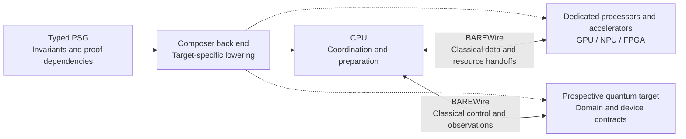

Most of the programs we want to write in Clef are ordinary systems programs. A computation might run on a CPU, with part of its numerical work assigned to an accelerator. We are designing our Fidelity Framework so the compiler can derive most proof obligations from the program's types and structure, including the conditions for safe data exchange between processors. The application developer writes the computation, and Composer checks it using the applicable rules.

Our interest in quantum computation grew from that work. A quantum gate has precise composition laws, and a hybrid application needs guarantees across its classical and quantum operations. We see a way to express those relationships through the native integration of negative and fractional types developed in our [NFT paper](https://arxiv.org/abs/2606.04352). That would extend the verification available to a Clef program while preserving the ordinary programming workflow on which we have built the language.

## Automatic Proof Dispatch {#the-foundation-four-tiers-automatic-dispatch}

A dimensional equation and a protocol invariant need different kinds of evidence. In §5.3 of our *Decidable By Construction* working draft, we organize verification into four tiers according to those reasoning requirements. Composer would generate the obligations from typed code and library operations, then dispatch each to an applicable analysis or proof rule.

| Tier | Program information | Checking mechanism |
|---|---|---|
| **1: Types and structural rules** | Dimensional equations and admitted algebraic relationships | Type inference and structural derivations |
| **2: Graph coeffects** | Local conditions on ranges and layouts, with lifetime and resource requirements | Sound analysis and generated solver obligations in supported fragments |
| **3: Spanning graph concerns** | Joint relationships retained by Program Semantic Graph (PSG) hyperedges | Reusable domain or system lemmas, instantiated with checked premises |
| **4: Relational reasoning** | Relations between executions or between source and target realizations | Checked derivations in compiler relational Hoare logic (cRHL) or probabilistic relational Hoare logic (pRHL) |

A hyperedge can retain a joint buffer-capacity inequality that the compiler checks at Tier 2. A resource handoff involving those buffers may use a Tier 3 protocol law. Our PSG preserves the participants and their shared premises so the compiler can use the evidence appropriate to each obligation.

Framework and domain-library authors establish the reusable laws. At an application site, Composer supplies the parameters from the graph and checks the premises, including for registered Tier 4 constructions. New domain requirements may need an explicit declaration and additional proof work. Routine coverage comes through typed code and library use, without per-function proof annotations.

Our [proof composition design](/docs/internals/verification/proof-composition-and-tooling/) also records the dependencies behind a result. A library theorem established in a proof assistant retains that dependency when cvc5 checks its arithmetic premises. At a boundary requiring a verified property, Composer must report any unresolved obligation. The [compilation sheaf design](/docs/design/categorical-foundations/the-compilation-sheaf/#tiers-as-stalk-category-refinements) describes how we intend to preserve this evidence through lowering.

## Ordinary Typed Code {#ordinary-code-comes-first}

A position update gives us a small example:

```fsharp
let advance position velocity duration =
    position + velocity * duration
```

Given typed inputs at a library or application boundary, our dimensional inference checks that `velocity * duration` has the same dimension as `position`. That equation follows directly from the arithmetic in the function. Composer would also generate the range and overflow obligations required by the selected numeric representation.

A quantum circuit traversal can use equally ordinary code:

```fsharp
let applyGates applyGate gates initialState =
    List.fold (fun state gate -> applyGate gate state) initialState gates
```

Here type inference relates the inputs and output of `applyGate`. A quantum domain library would supply checked gate operations and their composition laws. For a traversal covered by those laws, Composer could instantiate the proof from the operations retained in our PSG. The library author establishes the law once, and each application receives a checked instance under its own premises.

## Native Dualities {#negative-and-fractional-types-in-the-quantum-path}

Our [Negative and Fractional Types in the Fidelity Framework paper](https://arxiv.org/abs/2606.04352) builds on James and Sabry's work, followed by Chen and Sabry's operational and categorical treatment. We propose bringing those dualities into Clef's Native Type Universe, where the compiler could retain their relationships through the PSG and native lowering. Domain libraries could expose reversible operations through ordinary Clef interfaces, with the resource rules available to the compiler.

A negative type describes a change in evaluation direction. Within a supported reversible fragment, a form such as `Neg<A>` would let Composer track the relationship between forward and reverse evaluation. A quantum library would give that reversal a specific interpretation as the gate's adjoint, with the corresponding laws checked during construction and composition.

Fractional types describe resources associated with particular values. Our current NFT draft selects Chen and Sabry's value-indexed construction: a resource written mathematically as `1/v` is paired with a particular `v : A`. Discharge requires a match with that value and pairing instance. A quantum simulator or an adiabatic schedule could use this discipline to track a retained resource needed by a later operation. The compiler would check the permitted uses and storage requirements against the pairing recorded in the graph.

These resource rules would also support reversible classical computation and recovery-aware model updates. Integrating them with Clef requires an inference account for the value indices and usage conditions. Our [negative and fractional types design](/docs/design/types/negative-fractional-types/) develops those rules, including the distinction between a reciprocal resource and a physical quantity with a rational measure exponent.

## Checked Unitary Composition {#where-unitarity-fits}

For ideal closed-system evolution, a unitary gate satisfies \(U^\dagger U = UU^\dagger = I\). Our NFT paper proposes a checked abstraction containing a forward map and its model adjoint, together with evidence of both equations. Two such gates on the same state space compose to another unitary:

\[
(VU)^\dagger(VU) = U^\dagger V^\dagger VU = U^\dagger U = I.
\]

The other inverse equation follows from the same component laws. A gate library would establish this composition rule for Composer to instantiate at each use. In our PSG, a hyperedge would retain a multi-qubit operation's complete participant set, along with the joint conditions the rule requires. The negative and fractional type discipline would account for directed evaluation and resource use around these operations.

The [categorical account of quantum protocols](https://arxiv.org/abs/quant-ph/0402130) provides a mathematical foundation for this composition. Our compiler integration would need the corresponding interpretation of Clef operations, followed by checked preservation to the selected target. At Tier 4, cRHL would express that source-to-target relation. pRHL would apply to the classical probabilistic parts of a sampling or control workflow, while quantum-state relations require rules for the quantum semantics.

Preparation and measurement also need their own operation contracts. A hybrid workflow combines those contracts with the unitary operations and its declared noise model. Our [quantum substrate discussion](/docs/design/categorical-foundations/quantum-substrate-categorical-structure/) develops our proposed target architecture for that integration.

## Simulation Accuracy {#numerical-accuracy-is-a-separate-obligation}

For a simulator, we need a bound relating the computed result to the ideal circuit. That analysis includes the selected representation's rounding behavior and the approximations used by its operations. A circuit-level theorem would compose the local error bounds under the relevant input and range assumptions.

Posit arithmetic offers tapered precision, and a quire can accumulate covered sums of products exactly before final rounding, within its capacity. The [Posit Standard](https://posithub.org/docs/posit_standard-2.pdf) specifies those limits. We would choose a representation using the amplitude ranges and accuracy requirements of the particular computation.

An equal superposition over \(2^n\) basis states, for example, has amplitude magnitude \(2^{-n/2}\). As the number of qubits increases, that magnitude becomes progressively smaller. Comparing posit and IEEE-754 implementations therefore requires analysis over the actual amplitude range, with each format's rounding semantics included in the bound.

Our numerical libraries could supply reusable theorems for that analysis. Composer would check their range and capacity premises, then retain the resulting error bound alongside the simulator's relation to the ideal model. The certificate would identify the implementation and input domain to which the bound applies.

## Cross-Substrate Fidelity {#keeping-the-quantum-boundary-explicit}

A CPU should be able to send work to an accelerator and use the result with the program's invariants intact. We are designing our Composer back end to preserve those guarantees through target-specific lowering from a common PSG. Coordination could run on a CPU while an FPGA or GPU executes a numerical kernel, with other operations assigned to a dedicated processor. The graph would retain the relationships between those regions, including the pairing identities required by negative and fractional operations.

Our [BAREWire](/blog/getting-the-signal-with-barewire/) declarations specify the typed interchange contract between processors. Each endpoint can use its own native layout, with a defined conversion to the transfer format. Composer can then check the relationship between the sending and receiving representations, including any numerical error introduced by the conversion.


```mermaid
flowchart LR
    PSG["Typed PSG<br>Invariants and proof dependencies"] --> COMP["Composer back end<br>Target-specific lowering"]
    COMP -.-> CPU["CPU<br>Coordination and preparation"]
    COMP -.-> ACC["Dedicated processors and accelerators<br>GPU / NPU / FPGA"]
    COMP -.-> QPU["Prospective quantum target<br>Domain and device contracts"]
    CPU <-->|"BAREWire<br>Classical data and resource handoffs"| ACC
    CPU <-->|"BAREWire<br>Classical control and observations"| QPU
```

Suppose the CPU prepares a typed buffer for an accelerator kernel. The compiler must check that the element count fits the selected layout and that the receiving kernel's preconditions follow from the producer's result. The buffer must also remain valid until the device finishes using it. Completion evidence matters here, especially when DMA or a shared-memory consumer retains access after the initial handoff. The return transfer requires the corresponding checks for the result.

For a verified route, the composed proof establishes the required invariant from producer through transfer to consumer. It may establish exact preservation of a shape or unit relationship, or a numerical guarantee with an accumulated-error bound. Our [preservation contract](/spec/draft/conformance/#6-the-preservation-obligation-through-lowering) ties the evidence to the actual target operations and their platform assumptions. Composer must preserve the property through each lowering or re-establish it at an affected transformation.

A prospective quantum target would use BAREWire for classical control messages and measurement results, as well as simulator data. Transferring a quantum state would require the appropriate physical protocol and classical coordination. We would connect those device contracts to the checked adjoint and resource relationships from the NFT work, so a hybrid application's verification includes the quantum operation and the classical program that prepares and consumes its results.

Clef is a general systems language. We are designing its native type and proof machinery to make this precision available in everyday systems work, with quantum optionality illustrating its depth of reach. Negative and fractional types would let us express relationships that general-purpose ecosystems usually address through specialist languages and separate verification tools. The same compiler would check an ordinary buffer handoff and compose the domain laws needed for a quantum computation. The developer writes Clef. Composer derives the applicable proof obligations and checks them against the available evidence.
