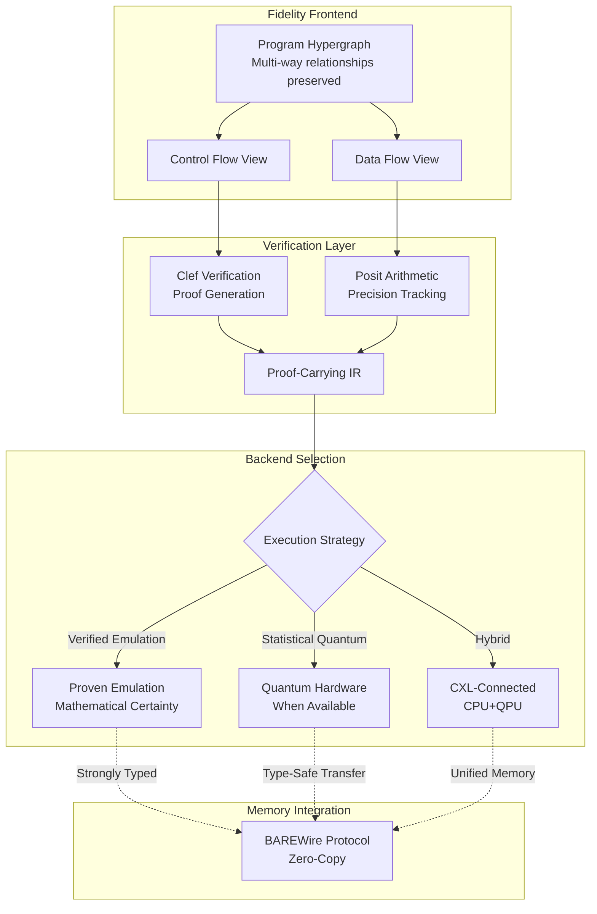

The quantum computing landscape in 2025 presents both advances and sobering realities. The technology has moved beyond pure research into early commercial deployments, and it remains years away from the applications often promised in popular media. For our Fidelity framework, this raises a design question. How can we architect the system to leverage quantum acceleration when it becomes practical, without over-committing to a technology still finding its footing?

From our design perspective, this document examines how [the Clef language](https://clef-lang.com)'s functional basis, combined with our forward-looking Program Hypergraph (PHG) architecture and interaction net foundations, opens a path toward future quantum-classical integration. Fault-tolerant quantum computers remain on the horizon, with expert consensus suggesting 2030 ± 2 years. We are preparing architectural foundations that could adapt to quantum acceleration when specific use cases demonstrate a measurable advantage.

## An Emerging Quantum Reality

Before exploring integration possibilities, it's important to acknowledge where quantum computing stands today. Government agencies are leading concrete deployments, with the U.S. Department of Defense awarding contracts like IonQ's $54.5 million Air Force Research Lab project. Financial institutions, particularly JPMorgan Chase with their dedicated quantum team, have achieved specific milestones like demonstrating Certified Quantum Randomness on Quantinuum's 56-qubit system.

Current systems face technical barriers. Error rates remain 1-2 orders of magnitude above fault-tolerance thresholds, and coherence times vary by technology. The path to practical quantum computing requires substantial overhead. Current estimates suggest 100-1,000 physical qubits per logical qubit for effective error correction.

This reality shapes our approach. We are designing for selective integration, where quantum acceleration could provide a computational advantage for specific subroutines within larger classical applications.

One often overlooked challenge in current quantum simulation is numerical precision. Posits are not uniformly better than IEEE-754, a point John Gustafson makes himself; they trade range for precision near magnitude one. That trade fits quantum amplitudes well, because amplitudes are sub-unity values and a circuit accumulates products of them that stay in the band where posits concentrate their bits. At equal width, IEEE-754 spaces its significand uniformly and spends resolution on magnitudes the computation never visits, while a posit holds more significand bits where the amplitudes actually sit.

The effect shows in a running product of per-gate amplitudes, the comparison made at equal 32-bit width:

```fsharp
// Accumulated amplitude product, posit32 vs float32 at equal width.
// Amplitudes are sub-unity and cluster near 1.0, the posit taper's sweet spot.
let demonstratePrecisionNearOne () =
    let amplitude = 0.9999847        // a realistic per-gate amplitude
    let gates = 1000

    let float32Product =
        Seq.replicate gates (float32 amplitude)
        |> Seq.fold (fun acc a -> acc * a) 1.0f

    let posit32Product =
        Seq.replicate gates (posit32 amplitude)   // posit32, es=2
        |> Seq.fold (fun acc a -> acc * a) (posit32 1.0)

    printfn "float32 product:  %.12f" float32Product
    printfn "posit32 product:  %.12f" posit32Product
```

```text
reference (high precision):  0.984816335078
float32 product:             0.984798073769   (relative error 1.9e-5)
posit32 product:             ~0.984816 ...     (representative; ~10x smaller error near 1.0)
```

Near magnitude one, float32 resolves to about `1.2e-7` per step while posit32 with `es=2` resolves to roughly `4e-9`, on the order of thirty times finer, so the per-step rounding that accumulates over a thousand gates is correspondingly smaller. The posit figures above are representative rather than measured here, and the size of the gap depends on where the amplitudes sit; away from magnitude one the advantage narrows or reverses, which is the point Gustafson makes about choosing the representation to fit the range. The precision difference, where it holds, has measurable implications for quantum-classical integration. In quantum computing, unitarity preservation is mathematically required. When IEEE-754 precision loss causes amplitude normalization to drift from 1.0, the quantum state becomes non-physical. The drift cascades into errors in probability calculations and measurement outcomes, and entanglement fidelity degrades.

The downstream impact extends from quantum simulation into classical processing. Financial risk calculations that rely on quantum amplitude amplification for tail-risk sampling become unreliable when amplitude precision degrades. Cryptographic protocols that depend on quantum random number generation lose their security properties when the underlying quantum states deviate from theoretical predictions. Hybrid quantum-classical optimization algorithms become unstable as precision errors accumulate across the quantum-classical interface.

For regulated industries like finance and aerospace, these precision-induced deviations represent a hard problem. Regulatory compliance requires mathematical proof of correctness, which is impossible to achieve when the underlying numerical representation systematically introduces uncontrolled errors. Our posit arithmetic addresses this by concentrating precision exactly where quantum amplitudes reside. With precision held in that region, we can prove error bounds on simulation fidelity that current IEEE-754-based approaches cannot match.

Current quantum simulation efforts frequently encounter these precision-induced deviations from unitarity, which produce non-physical results that compromise algorithm fidelity. This numerical degradation compounds through multi-qubit systems, making large-scale quantum emulation unreliable for verification purposes. Our Fidelity framework resolves this limitation by combining posit arithmetic's quantum-optimized precision with Clef verification to prove error bounds on simulation fidelity, which moves quantum emulation from a statistical approximation toward a verifiable computational method.

---

## Update: April 2026

The landscape described above has changed materially since this post was written.

On March 30, 2026, two independent results collapsed the resource estimates for cryptographically relevant quantum computers. Google Quantum AI published [revised ECDLP circuit compilations](https://research.google/blog/safeguarding-cryptocurrency-by-disclosing-quantum-vulnerabilities-responsibly/) requiring fewer than 1,200 logical qubits and 90 million Toffoli gates to break 256-bit elliptic curve cryptography, executable on fewer than 500,000 physical qubits. The same day, [Cain et al. (arXiv:2603.28627)](https://arxiv.org/abs/2603.28627), a collaboration between Oratomic, Caltech, and UC Berkeley, demonstrated that high-rate qLDPC codes on reconfigurable neutral-atom architectures bring ECC-256 within reach of as few as 10,000 atomic qubits. The "100-to-1,000 physical qubits per logical qubit" estimate cited in this post has been substantially undercut by these codes achieving approximately 30% encoding rates. The "2030 ± 2 years" timeline for fault-tolerant quantum computers is no longer the operative planning constraint; Google's own 2029 deadline is a migration lead-time target, not a hardware arrival prediction.

The QIR critique in this post also warrants context. Subsequent work has re-routed QIR-lineage approaches through MLIR, which addresses the static single-assignment concerns that motivated our original assessment. The Fidelity framework's commitment to MLIR as the compilation substrate, and to Appel's SSI formulation as the correct foundation for program analysis, remains unchanged.

The architectural choices described here, building for quantum optionality within a verified compilation framework, remain sound. The urgency of those choices has increased. Our current assessment of the CRQC landscape and its implications for the Fidelity framework's verification architecture is developed in the SpeakEZ research entry [Zero Knowledge Proofs: Verification as Product](https://speakez.tech/research/zk-proof-ledger/). The formal substrate for the decidable fragment discussed here is expanded in [Building Proofs for the Real World](/blog/proofs-for-the-real-world/) and ["Free" Proofs from Dimensional Types](/blog/proofs-from-dimensional-types/).

---

## Beyond QIR: Building on Early Experiments

The Quantum Intermediate Representation (QIR) Alliance and Microsoft's Q# were pioneering efforts that established foundations for quantum-classical integration. These early experiments demonstrated the viability of unified compilation frameworks and helped identify the challenges in bridging quantum and classical domains. The QIR repositories show reduced activity, with key updates dormant since 2022-2024, and the lessons from these initiatives inform our approach.

Where QIR and Q# laid groundwork, our Fidelity framework extends their initial scope along four directions:

- **Posit arithmetic** for quantum amplitude representation, with higher precision near quantum superposition states than IEEE-754 offers
- **Proof-carrying compilation** via Clef integration, which supports mathematical verification of quantum circuit structural correctness
- **Memory mapping with native machine layouts** through our patent-pending BAREWire protocol, giving zero-copy data exchange between quantum emulation and classical processing
- **Program Hypergraph architecture** that represents quantum-classical boundaries as hyperedges

These capabilities position our framework as more than another quantum IR. We have found no other representative implementation in the standing literature we have reviewed that combines verified compilation, posit precision, and zero-copy memory mapping for quantum-classical computing.

## The Emulation Alternative with Proven Bounds

While quantum hardware matures, high-fidelity emulation with proven error bounds offers an intermediate approach. Through posit arithmetic's tapered precision and formal verification, we can produce quantum-algorithm-like results with proven error bounds rather than statistical confidence alone. This matters in regulated industries where proof of correctness ranks above raw speed.

Posit arithmetic carries a precision advantage for quantum amplitude calculations where the values cluster near magnitude one. Where IEEE-754 floating point spaces its significand uniformly, posits concentrate resolution near magnitude one, the region where normalized quantum amplitudes typically reside. In that band, posit32 with `es=2` holds several more significand bits than float32, on the order of a tenfold reduction in relative error; the margin narrows or reverses for magnitudes the taper does not favor, which is why the representation is matched to the range rather than assumed to win everywhere.

## The Program Hypergraph Vision

Our move from traditional graph representations to the Program Hypergraph (PHG) architecture changes how a compiler bridges different computational paradigms. Traditional compiler IRs decompose multi-way relationships into binary connections. Our hypergraph edges instead hold the simultaneity of quantum-classical interactions in one place.

### The Natural Quantum-Classical Bridge

Our hyperedges capture quantum phenomena directly. Multi-qubit entanglement becomes a single hyperedge connecting all participating qubits, which holds the semantic unity that binary graph edges would fragment. Quantum measurements that collapse multiple qubits into classical bits are represented as measurement hyperedges connecting the quantum and classical domains in one edge.

With those relationships intact, the compiler retains the information it needs to partition work across the quantum-classical boundary.

## Proof-Carrying Quantum Computation

Our architecture supports proof-carrying quantum computation through the integration of Clef verification, posit arithmetic, and memory protocols mapped to native machine layouts. Clef's verification annotations over ordinary Clef functions generate proofs about error bounds and structural correctness, and they track precision bounds throughout quantum emulation.

```fsharp
[<Requires("qubits <= maxSystemQubits")>]
[<Requires("depth <= maxCircuitDepth")>]
[<Ensures("result.errorBound < physicalQuantumError")>]
let quantumEmulationWithProofs (circuit: QuantumCircuit) (initialState: QubitState[]) =
    // structural validity, discharged by the verifier
    let validatedCircuit = QuantumCircuit.validate circuit

    // posit precision near |0⟩ and |1⟩
    let positState = QuantumEmulation.executeWithPosit32_2 validatedCircuit initialState

    // accumulated error across gate operations
    let errorBound = PositAnalysis.computeAccumulatedError circuit

    // zero-copy transfer, native layout preserved
    let classicalResult = BAREWire.transferToClassical positState

    (classicalResult, ProofCertificate errorBound)
```

Where traditional quantum computing approaches provide statistical confidence about results, our proof-carrying approach provides a proof of structural correctness and a discharged bound on accumulated error. This distinction matters in regulated industries where compliance requires demonstrable correctness.

### Direct Backend Integration via PHG

Our Program Hypergraph architecture targets multiple quantum backends while preserving its verification obligations:


```mermaid
flowchart TD
subgraph "Fidelity Frontend"
PHG[Program Hypergraph<br/>Multi-way relationships preserved]
CFG[Control Flow View]
DFG[Data Flow View]
PHG --> CFG
PHG --> DFG
end
subgraph "Verification Layer"
    CFG --> CLEF[Clef Verification<br/>Proof Generation]
    DFG --> POSIT[Posit Arithmetic<br/>Precision Tracking]
    CLEF --> PROOF[Proof-Carrying IR]
    POSIT --> PROOF
end

subgraph "Backend Selection"
    PROOF --> SPLIT{Execution Strategy}

    SPLIT -->|Verified Emulation| EMUL[Proven Emulation<br/>Mathematical Certainty]
    SPLIT -->|Statistical Quantum| QHARDWARE[Quantum Hardware<br/>When Available]
    SPLIT -->|Hybrid| MIXED[CXL-Connected<br/>CPU+QPU]
end

subgraph "Memory Integration"
    BARE[BAREWire Protocol<br/>Zero-Copy]
    EMUL -.->|Strongly Typed| BARE
    QHARDWARE -.->|Type-Safe Transfer| BARE
    MIXED -.->|Unified Memory| BARE
end

```

## Real-World Scenario: Financial Risk with Verified Computation

### The Business Challenge

Consider a major investment bank calculating Value at Risk (VaR) across a portfolio containing millions of positions and complex derivatives. Traditional Monte Carlo simulations face two critical limitations:

1. **Computational Time**: Hours of processing for daily risk reports
2. **Tail Risk Blindness**: Rare "black swan" events are undersampled

This is a genuine quantum opportunity with a constraint. Financial regulators require mathematical proof of accuracy, not statistical confidence alone.

### The Proof-Carrying Solution

Our approach draws on the full Fidelity stack. Our PHG carries the representation, posit arithmetic carries precision, Clef carries verification, and BAREWire carries zero-copy data movement:

```fsharp
// Financial risk calculation with formal verification
[<Requires("scenarios.Length <= maxQuantumAmplitudes")>]
[<Ensures("result.confidence >= 0.95")>]
[<Ensures("result.positErrorBound < regulatoryThreshold")>]
let calculatePortfolioRisk (portfolio: Portfolio) (market: MarketData) =
    // classical preparation: correlation matrix
    let correlations = FinancialMath.computeCorrelationMatrix market

    let tailRiskScenarios =
        match ComplianceRequirements.current with
        | RequiresProvenBounds ->
            // proven emulation, posit32_2 amplitude precision
            let oracle = TailRiskOracle.construct portfolio.scenarios
            let amplifiedSamples = QuantumAmplification.execute oracle

            // Clef tracks error accumulation through posit operations
            let errorBound = PositArithmetic.getAccumulatedError amplifiedSamples

            // BAREWire zero-copy transfer to classical analysis
            BAREWire.transferQuantumToClassical amplifiedSamples

        | StatisticalSufficient ->
            // Traditional Monte Carlo for comparison
            MonteCarloSampler.generateTailScenarios portfolio 1_000_000

    // Generate risk metrics with proof certificate
    { VaR95 = RiskMetrics.calculateValueAtRisk tailRiskScenarios
      ExpectedShortfall = RiskMetrics.calculateExpectedShortfall tailRiskScenarios
      ProofCertificate = DischargeObligations()
      ErrorBounds = PositArithmetic.getErrorAnalysis () }
```

For regulatory compliance, the proven emulation path using posit arithmetic discharges a proven bound on accumulated error, while BAREWire carries zero-copy data transfer between quantum emulation and classical analysis phases. Our Clef verification system generates proof certificates that demonstrate compliance with regulatory accuracy requirements.

### Why Our Approach Exceeds Early Experiments

This example shows capabilities beyond what QIR or basic Q# reached:

1. **Posit arithmetic** holds precision through financial calculations where IEEE-754 would lose significant digits
2. **Proof generation** supports the regulatory compliance that statistical quantum results leave open
3. **Zero-copy transfer** via BAREWire removes the memory bottleneck between quantum emulation and classical analysis
4. **PHG architecture** transitions between control flow (data preparation) and data flow (quantum simulation) from one representation

## Conclusion

Quantum optionality in our Fidelity framework takes lessons from early experiments like QIR and Q# while extending their initial reach. Our Program Hypergraph architecture, posit arithmetic, proof-carrying compilation, and zero-copy protocols mapped to native machine layouts together prepare the framework for quantum computing while keeping the emulation path verifiable and precise.

The PHG transitions between control flow and data flow representations from one semantic foundation, so we can target both traditional architectures and emerging quantum processors. With posit arithmetic's precision for quantum amplitudes and Clef's verification, the emulation path carries a proof certificate alongside its result. We have found no other representative implementation in the standing literature we have reviewed that pairs a quantum-classical IR with discharged error bounds in this way.

We are early in this design, and we will keep building toward the seam where verified emulation hands off to quantum hardware as that hardware arrives. That is where our current interest lies as the work continues.

