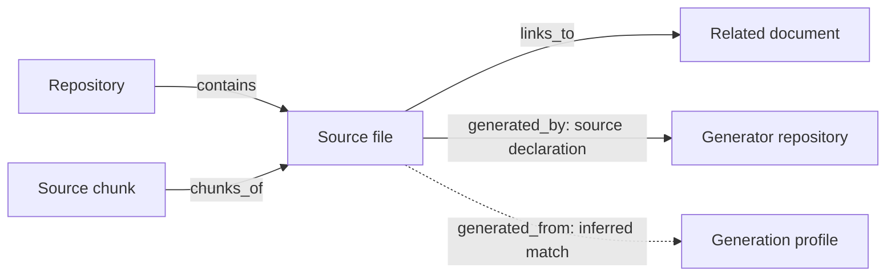
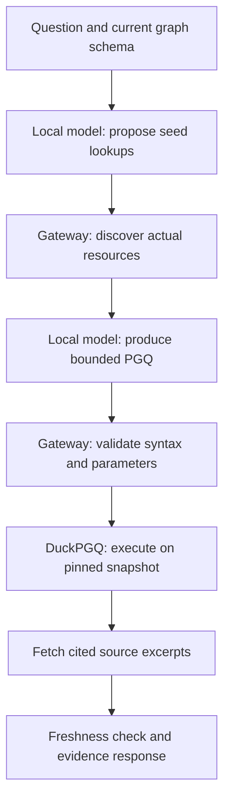
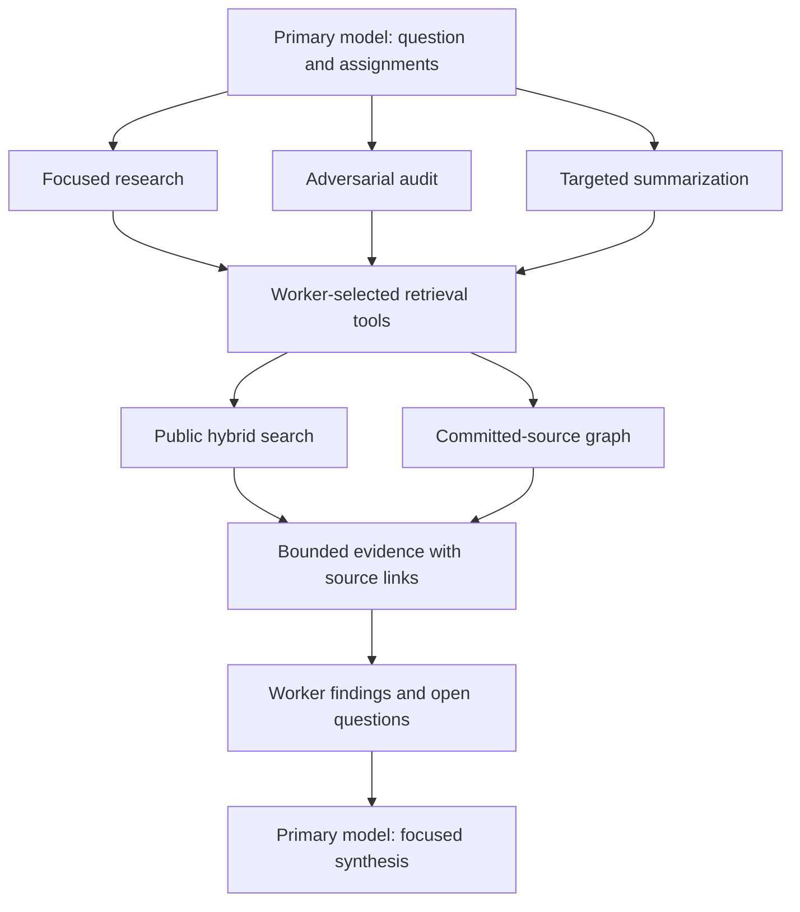
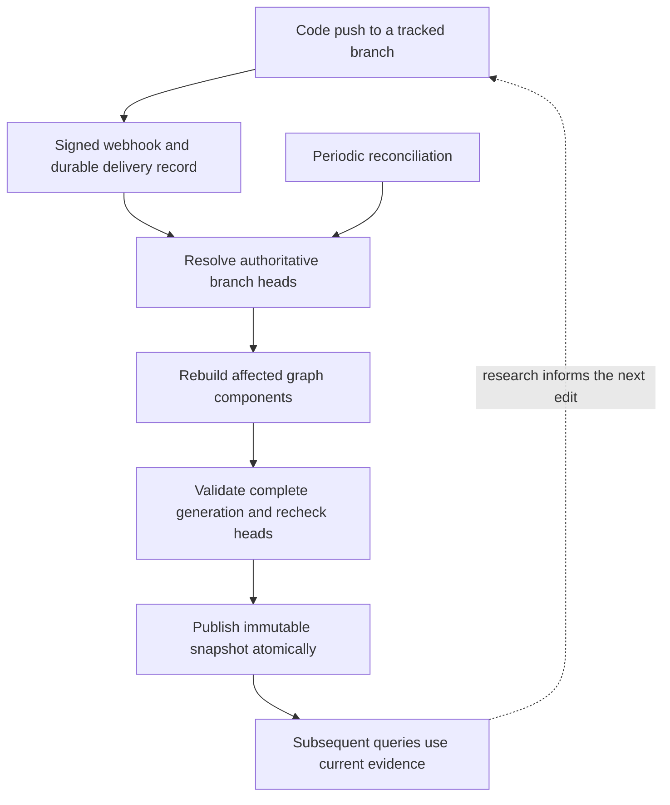

Ask a question about a system whose information base is constantly growing and the research quickly fans out. A design document explains an architectural choice. The implementation establishes what currently happens, while a test records the conditions it was designed to check. A second repository may contain the generator responsible for the code under review. We need enough of those connections to answer a deep question, with room left to consider follow-on review and instructions.

Knowledge compression takes several forms along that route. A language model encodes learned patterns in its weights. An embedding gives us a compact representation for finding similar material, and a summary condenses an argument. A knowledge graph retains selected entities and their relationships, with explicit paths back to the evidence. Language models have "swallowed all of the air in the room" for a few years, but now other time-tested knowledge compression patterns are showing their value as we encounter the practical limits of transformer-based architectures.

In our work we have a need to follow questions across the Clef language and the [Fidelity Framework](/blog/fidelity-framework-primer/) as both continue to develop. A question about Composer can lead through a language specification into a [native binding](/blog/the-farscape-bridge/#care-and-feeding-of-generated-libraries) and its generation profile. We want local models to help with that research, including models running with modest memory and a limited context window. Their usefulness depends heavily on the information they can use within those windows.

Graph databases give us a practical form of neurosymbolic reach: a model interprets the question, a graph query follows recorded relationships, and the next model works from the resulting evidence. Much of the "intelligence" is in how we organize the garden-variety work of building the graph and conditioning how it's accessed by transformer models. Our [discussion of construction and convergence](/blog/beyond-the-bitter-lesson-structural-convergence/#structure-is-meaningful-at-both-ends) considers this role for structure around a learner.

## A Finite Window on a Growing Corpus

An unbounded context window is an expensive answer to a selection problem. As the corpus grows, so does the work of distinguishing an old proposal from a current implementation. Even a reader with every document open needs to establish which revision and relationship support the answer.

We can write the immediate constraint as a token budget:

\[
T_{\mathrm{instructions}} + T_{\mathrm{question}} +
\sum_{e \in S} T(e) + T_{\mathrm{answer}} \leq C.
\]

Here \(S\) is our selected evidence and \(C\) is the available context. Every source excerpt consumes part of the same budget as the instructions and eventual answer. In one of our local parser evaluations, the runtime had an 8,192-token context allocation. That is plenty of room for a focused graph task when the gateway supplies a compact schema and relevant candidates.

Larger windows give us more capacity, while evidence placement and selection remain engineering concerns. The *Lost in the Middle* experiments found that the tested models often retrieved information more successfully near the beginning or end of their context than in its middle. We take that result as a reason to measure retrieval behavior alongside advertised window size. Our workers receive enough evidence for a defined task, and can request another bounded slice when the task requires it. [Liu et al., 2024](https://aclanthology.org/2024.tacl-1.9/)

The compression we want is question-dependent. A source file may contribute three relevant lines to one investigation and several complete functions to another. Keeping the citation attached lets us return to the original whenever the shorter representation needs inspection. Our earlier [cognitive architecture sketch](/blog/unified-cognitive-architecture/#knowledge-as-a-service-not-a-monument) considers loading only the domain knowledge a query requires.

## Knowledge Representation, Again

There was a time when an explicit network of concepts and relationships was comfortably described as AI. We still think it belongs there. In their 1993 account of knowledge representation, Randall Davis, Howard Shrobe, and Peter Szolovits discussed semantic networks alongside other established AI representations. They also asked a particularly apt question for our work: which properties of the original does a representation preserve? Their discussion uses the word *fidelity*. [What Is a Knowledge Representation?](https://courses.csail.mit.edu/6.803/pdf/davis.pdf)

Our [AI Refinery research](/blog/fidelity-as-ai-refinery/#looking-forward-neuromorphic-oracle-architecture) also considers structured knowledge consultation during inference, with neuromorphic execution as a prospective target.

Our retrieval graph starts with a deliberately concrete vocabulary. Repositories contain files. Files have source chunks, and documents link to other documents. Project declarations establish cross-repository references. Additional extraction rules identify likely relationships, retaining the rule and supporting source with each result.

For a particular source snapshot \(s\), a compact model is:

\[
G_s = (V_s, E_s), \qquad
E_s \subseteq V_s \times \mathcal{L} \times V_s.
\]

The vertices in \(V_s\) represent resources. Each edge \((u,\ell,v)\) records a directed relationship with label \(\ell\). Properties on those resources identify their repository and revision, down to the source path and line range. Relationship properties record how the connection was established.



The arrow from a chunk points to its parent file. That small detail becomes consequential when we ask for all chunks belonging to a file: the query must traverse the relationship in the incoming direction. The dashed generation-profile edge represents an inferred research lead, with its extraction basis available for inspection. A source declaration and an inferred match carry different evidential weight.

Our current snapshot contains 2,249 files across twelve curated repositories, represented by 8,050 nodes and 11,576 edges. That includes 42 capability nodes and 2,031 derived relationships. The graph gives us a manageable way to navigate that material while retaining the source-level detail needed to assess a conclusion.

A question about [WrenHello's native host](/blog/wren-stack/#our-wrenhello-host) on Linux, for example, can lead through project references to WebKit and GTK bindings, then to a binding's declared generator and likely generation profile. Our graph retains the source evidence for each step.

We store it in [DuckDB](https://duckdb.org/) and use [DuckPGQ](https://duckpgq.org/) for graph pattern matching. DuckPGQ supplies SQL/PGQ operations over relational data, so graph traversal and ordinary database handling can share a fast, compact execution engine. Our retrieval API exposes a restricted query language over that graph.

## Smart Search, on Both Sides of the Tool Call

You can try one part of this arrangement here. Open the site's search, or follow this search for [Composer graph coeffects](/?q=Composer%20graph%20coeffects). Inspect the returned passages, then use **Summarize with AI** to see a synthesis from the selected material. The **Share** button preserves the query for another reader.

Our Smart Search combines BM25 keyword retrieval with vector similarity. BM25 is useful when the question contains a specific identifier or phrase. Embeddings help when the question and the relevant passage use different wording. The service runs both searches and combines their rankings with reciprocal rank fusion:

\[
\operatorname{RRF}(d) =
\sum_{r \in \mathcal{R},\; d \in r}
\frac{1}{k + \operatorname{rank}_r(d)}.
\]

Each \(r\) is one ranked result list, and our base fusion uses \(k=60\), followed by the site's recency adjustments. A passage can receive support from either search route or both. RRF combines rank positions, so vector and BM25 scores can retain their own scales. [Cormack, Clarke, and Buettcher, 2009](https://cormack.uwaterloo.ca/cormacksigir09-rrf.pdf)

The browser and our agents' public retrieval tool call the same hybrid search endpoint. An agent receives bounded snippets and source URLs, then can use those results within its assigned task. The browser adds its own optional AI summary.

> Using search on this site gives you direct access to the retrieval infrastructure we also provide to our AI workers.

The committed-source graph offers a complementary route. Its initial discovery operation ranks literal matches, giving exact paths and names priority. From a discovered file, a worker can follow a declared relationship and retrieve revision-specific source lines. Public hybrid search finds relevant published discussion, while the local graph supports closer investigation of the committed sources. We expose both tools so the primary model or a worker can select the appropriate route.

## A Small Model with a Specific Job

We give the PGQ worker a narrow responsibility: translate a question into a supported graph query using resources that the gateway has actually discovered. The gateway owns the application instructions and graph access. The local inference server receives a complete request, including the output constraints selected for that call.

Our English-to-graph path has two model stages. First, the worker proposes up to three literal lookups using the current repository and layer names. The gateway performs those lookups, normally returning four candidates per lookup. An exact-path check keeps a document that mentions a filename from being substituted for the requested file itself.

The second model call receives those real candidate identities, together with brief source excerpts. It also receives the relationship directions and worked query examples. Its response contains a query fragment and parameters. The gateway validates that response and executes the accepted query against the same graph snapshot.



Suppose we have discovered a file and want its source chunks. This is the supported query shape, formatted for readability:

```sql
MATCH (a:resource WHERE a.id = $seed)
      <-[e:relation WHERE e.kind = $edge_kind]-
      (b:resource)
COLUMNS (b.id, b.path, b.line_start, b.line_end, e.kind)
```

The worker selects the discovered file's evidence ID as `seed`, with `chunks_of` as `edge_kind`. Our gateway checks that selection before execution. The incoming arrow follows the chunk-to-file relationship shown above. Requiring `b.id` gives the gateway an identity it can use to fetch the underlying source.

We also bound the evidence returned from a successful query. The English endpoint permits at most twenty rows and hydrates up to four distinct target or supporting-evidence resources within a shared excerpt budget. Its default source budget is 2,400 characters. The response includes the selected query and parameters, with snapshot identity and source citations available to the caller.

The primary model can inspect the query as well as the passages selected through it.

## Grammar, Examples, and Meaning

Our GBNF work began with the actual query language we were prepared to execute. GBNF, the grammar notation supported by [llama.cpp](https://github.com/ggml-org/llama.cpp/blob/master/grammars/README.md), lets us constrain the generated output through formal production rules. We built grammars for the response object and for the PGQ text inside its query field.

The setup follows the two model stages. For seed discovery, we generate a grammar using the current schema's repository and layer values. Within the query grammar, aliases and labels have fixed forms. Projections use advertised properties, and placeholders must agree with the parameter object. One-hop traversal supports either direction. Bounded shortest-path queries use the supported outgoing form, with a maximum of four hops. The grammar permits the query forms supported by our gateway.

With GBNF enabled, we pass the generated grammar alongside the messages on the individual inference request. This lets us support multiple retrieval sources as they become available. The generic model runtime can receive another application's instructions and output constraints on its next request. Our gateway returns prompt versions and request hashes. Callers can also request the complete inputs that produced a query, for further research and possible inline correction.

Our system prompt supplies the task semantics that an output constraint alone leaves to the model. It establishes the two stages and identifies candidate records as reference data. We use two complete seed-planning examples and six complete query examples. They cover directionality and chunk membership, then extend to repository ownership and bounded reachability. Another example distinguishes identically named paths in different repositories.

One early prompt mixed the discovery stage with already-discovered resources, and a model copied a placeholder answer. We separated the stages and supplied complete worked responses. In another case, literal search placed a document mentioning the requested file ahead of the file itself. We added exact-path checks and bounded lookup recovery, then validated the requested paths explicitly.

A model can produce valid JSON for “what does this file link to?” when asked “what links to this file?” Our examples now place those two questions beside their respective outgoing and incoming queries.

## Validation Evidence

We tested grammar acceptance separately from query meaning. The negative cases include attempts to append SQL and use unknown graph properties. Others exercise malformed response objects or mismatched parameters. We also check traversal bounds and reject seeds outside the discovered candidates. At the gateway level, tests cover ambiguous filenames and model timeouts, as well as a source snapshot changing during inference.

The native validator used in this work returns exit status zero for both accepted and rejected strings. Our harness checks its reported verdict and treats parser failures or timeouts as failures. A green process exit would have been a remarkably unhelpful definition of success.

Our final few-shot examples have passed native grammar checks and returned the expected results on fixture graphs. Measuring how reliably a model selects those queries for new questions requires a broader accuracy evaluation, which is still to follow. We keep that measurement separate from the software checks when deciding what to trust.

## Focused Workers, Concentrated Evidence

Our larger model can use retrieval directly, or delegate a question to a smaller worker with a specific assignment. We have exercised native retrieval tools through three workers, each returning fresh, commit-linked evidence. That gives us a basis for more ambitious research fan-out as our confidence grows in the reliability of the pattern.

For a cross-repository investigation, we would divide the work by purpose. A research worker would locate the relevant declaration and follow its supporting relationships. An adversarial auditor would look for a counterexample or a mismatch between documentation and current code. A summarization worker would condense the selected passages, retaining citations and identifying unresolved questions. This division of work fits the [specialist-model orchestration](/blog/beyond-transformers/#model-orchestration-for-decentralized-ai) we have explored for decentralized AI.



Each worker's context can stay close to its assignment. The primary receives compact findings and can request full source when a conclusion needs closer examination. An auditor's disagreement is useful output: it identifies where the primary should spend more of its attention budget.

For a pinned snapshot \(s\), an accepted query \(q\), parameters \(p\), and a fixed retrieval configuration \(\theta\), the selected evidence is:

\[
\mathcal{E} = R_{\theta}(G_s, q, p).
\]

The configuration includes ordering and evidence limits, along with the extractor and query-engine versions. Recording those inputs makes a concrete retrieval inspectable and repeatable. Natural-language query selection and the final summary remain model-dependent. We aim for near-deterministic behavior in the bounded retrieval operation, taking particular care with choices such as tied shortest paths.

## A Memory Updated by the Work

All of this would age quickly if the graph stayed fixed. In this case, the "learning loop" is external to the model's context, and updates to the corpus can improve the retrieval system's results. Our retrieval service now receives signed push webhooks for the tracked branches across all twelve repositories. A relevant push schedules re-indexing, so committed changes feed into subsequent retrieval.

The webhook supplies a change hint. The indexer resolves the configured branch itself, rebuilds the affected repository components, and reuses the unaffected components. It then recomputes cross-repository relationships and validates a complete new graph generation. A final check of the branch heads precedes full publication.



We deduplicate deliveries and reconcile the tracked branches at regular intervals to recover missed changes. A pending update makes current-evidence queries temporarily unavailable until a fresh generation is ready. Freshness is checked around graph queries and around the model calls, with an explicit age bound on the source observations. Corrections and deletions therefore have a defined route into the service's memory alongside additions.

The continuously learning part is this 'external' memory. Model weights can remain fixed while the available evidence changes after a commit. An improved explanation becomes retrievable, and a corrected relationship changes the paths available to the next investigation. Our source revision and extraction rules remain attached to that knowledge.

> For anyone waiting nervously for the next announcement about recursive self-improvement, our contribution this week includes a webhook. **Please contain your gasps**.

Schmidhuber's 1987 work already explored learning how to learn, including programs that modify program-modifying procedures. He investigated changes to the improvement process itself. In our operational loop, people develop and correct the system, and the retrieval service makes each accepted revision available to subsequent work. [Schmidhuber's thesis and overview](https://people.idsia.ch/~juergen/diploma.html)

With a bit of systems knowledge, we can connect free tools such as DuckDB and DuckPGQ to a local inference runtime and build useful adaptive systems today. The engineering is available to anyone prepared to define the graph and test the retrieval behavior. No one needs to wait on a 'frontier lab' or other misnamed entity for this capability. Anyone can build it ***today***.

Our current arrangement spans on-premises services and Cloudflare. Public hybrid search runs alongside the site through the [Fable-to-JavaScript pathway](/blog/the-web-on-native-terms/#javascript-as-an-ordinary-backend), while committed-source graph retrieval and local inference run within our own infrastructure. Our deployment choices follow the workload. The result we care about is reliable, near-deterministic knowledge compression for intelligent systems design: a focused evidence packet whose origin and selection we can inspect. We can use it for further inference or more concrete redirection.

The information we're building with is constantly growing. Our graph changes with it. The next question starts from there, and our 'frontier' expands with data sovereignty and efficiency as first-class considerations.
