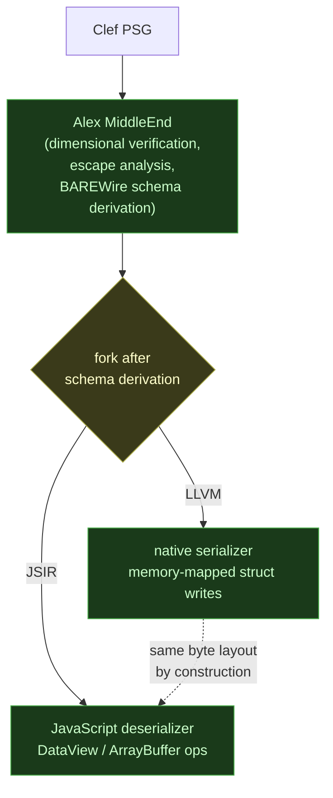
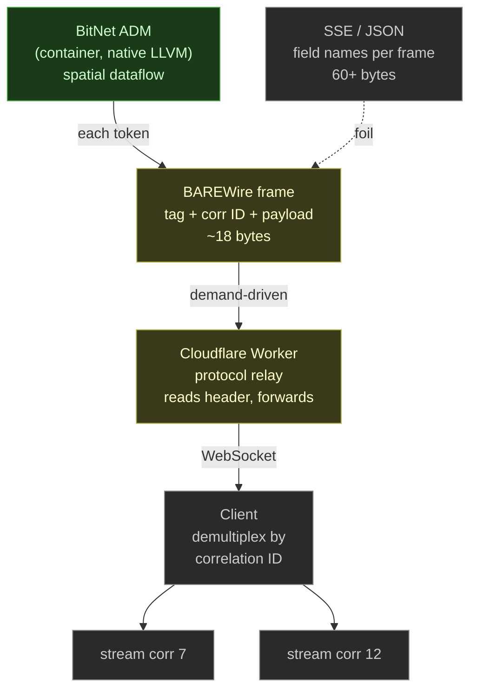
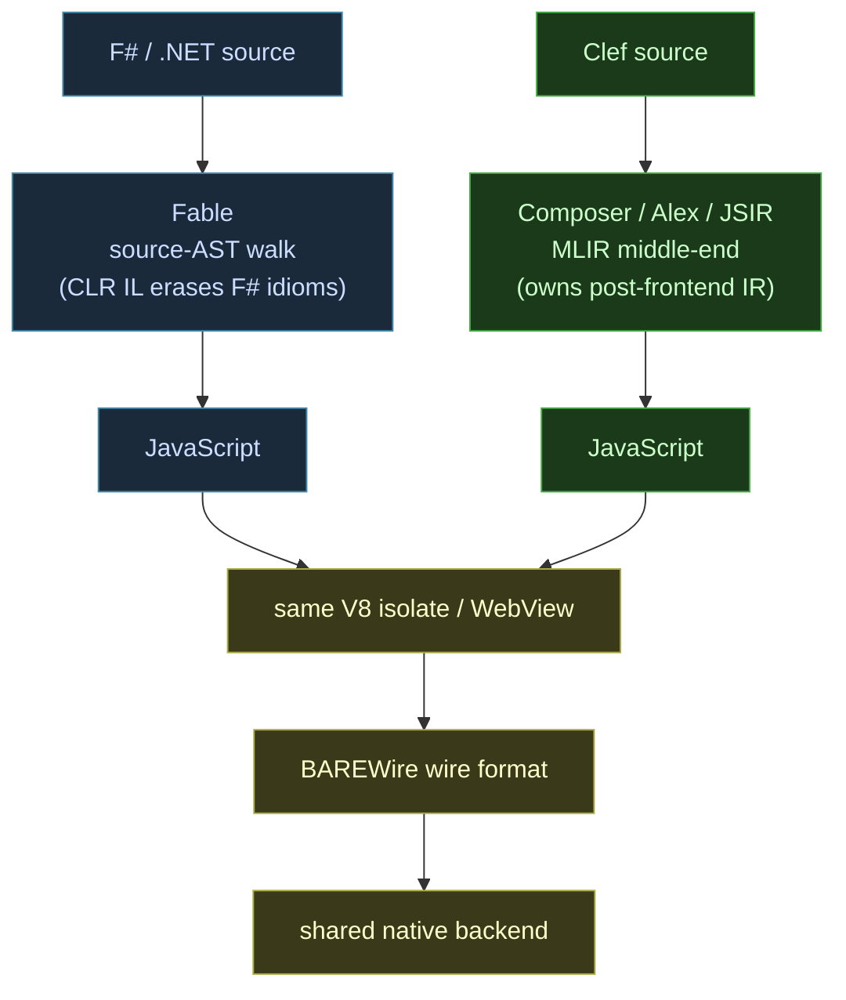
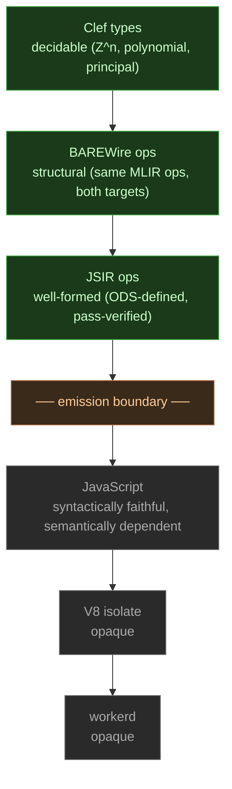

The Fidelity framework is primarily designed to target hardware in the most direct manner possible. You know the acronyms: CPUs, GPUs, FPGAs, MCUs, NPUs, and other accelerators too. Every compilation target goes through Alex (the "Library of Alexandria"), our MLIR middle-end, where dimensional verification, escape analysis, and BAREWire schema derivation all happen in one place. It is the heart of our framework. 

## Why the Excitement?

We have to admit, this *is* a special case. We have an affinity for Cloudflare's cloud edge model for its scale, speed, and security. Cloudflare Workers execute in V8 isolates, so JavaScript is the deployment format for edge workloads on their platform.

Fable remains a mainstay in the F# and broader .NET ecosystem that depends on it. Partas.Solid frontends, WrenHello's Fable-driven WebView, and Fidelity.CloudEdge's existing F# bindings continue on the well-understood F#-through-Fable path. What we've been designing around is a parallel Clef-native path to JavaScript that lives inside Composer's MLIR middle-end rather than as a separate pipeline alongside it.

The closer architectural reference point for what we're doing is not Fable. It is [js_of_ocaml](https://github.com/ocsigen/js_of_ocaml), which has been compiling OCaml to JavaScript since 2010 by lifting bytecode into an internal SSA-style IR, running optimization passes, and emitting JavaScript through a conventional compiler back end. js_of_ocaml proved at production scale, over fifteen years, that an ML-family language can reach JavaScript through a compiler IR rather than through source-AST walking. In 2024 the same project shipped wasm_of_ocaml, a WebAssembly backend sharing the same IR with the JavaScript backend. That's the multi-target-from-shared-IR pattern, and it's exactly what Composer's middle-end generalizes over MLIR's dialect infrastructure.

Then recently, [Google published an RFC to upstream JSIR](https://github.com/google/jsir) (JavaScript Intermediate Representation) into MLIR. As mentioned above, using Multi-Level Intermediate Representation is the central strata for the Fidelity framework's compilation path. So while we were looking at LLVM for certain 'legacy' targets and other back ends to carry to specific types of processors, the introduction of a JavaScript pathway through MLIR was a pleasant surprise. For our purposes, JSIR places JavaScript inside the same lowering pathway that every other Clef target already uses. That means the JavaScript path can now go through Alex, through the same verification passes, through the same BAREWire schema derivation, and to a dedicated "BackEnd" via JavaScript to be packaged for various uses.

Before JSIR, JavaScript was always reached through F#/Fable, with a BAREWire bridge over WebSocket and WebTransport carrying messages between the Fable-compiled edge code and native Clef. That dual path works and continues to work. What it did not provide was a route for *Clef itself* to reach JavaScript through the verified middle-end; the verification and optimization passes written against Alex applied to native targets, while the JavaScript side was served by a separate compiler. JSIR changes that calculation. A Clef-native path to JavaScript can now run inside the middle-end alongside the F#/Fable path rather than as a second pipeline, so the same MLIR ops that produce the native artifact also produce the JavaScript one, and that path forks only *after* the BAREWire schema has been derived:



Both backends consume the same dialect ops, so the native serializer and the JavaScript deserializer agree on the wire layout because they were lowered from one verified IR, not because two compilers were tested against each other. The [technical details](/docs/design/javascript-targeting/jsir-javascript-as-mlir-backend/) are worth reading if you want to understand how JSIR's ops map to Alex's dialect infrastructure and where the trust boundaries fall. This post is about what the unification will likely mean in practice, as we work to bring this design into a realistic implementation in our framework.

## Why This Matters for Cloudflare Workers

The Fidelity framework deploys actors to two substrates. Native actors run as OS processes with IPC and shared memory. Edge actors run as Cloudflare Workers, Durable Objects in V8 isolates. The [unified actor architecture](/blog/unified-actor-architecture/) describes how Prospero supervisors and Olivier workers communicate across this boundary using BAREWire.

The Fable-based path handles type safety for JSON-over-HTTP traffic by compiling shared F# types to both sides of the wire: native .NET on the server, JavaScript on the client, with the same source definitions producing compatible shapes by construction. That closes the loop for the SAFE-stack request/response pattern and has been production-tested for years. BAREWire's cross-substrate binary framing is a different concern. The critical question for binary framing is whether the native serializer and the JavaScript deserializer agree on the byte layout, and before JSIR, that agreement was verified by testing. If the two compilers disagreed about field order in a discriminated union, the mismatch showed up at runtime, in production.

With JSIR in Alex, both serializers derive from the same BAREWire dialect ops. The pipeline forks after the schema is derived, not before. Cross-substrate compatibility becomes a structural property of the compiler as opposed to after-build validation using standard testing. The [design-time specification article](/docs/design/javascript-targeting/design-time-spec-runtime-reliability/) walks through each verified property and how it behaves after emission to JavaScript.

## BAREWire at the Wire Boundary

Our [BAREWire](/blog/getting-the-signal-with-barewire/) format was designed for exactly this kind of cross-substrate communication. The binary wire format encodes type structure in the layout of the bytes. No field names. No schema negotiation. The deserializer reads positions, not keys.

What JSIR adds is confidence that the JavaScript-side deserializer was produced by the same pipeline that produced the native-side serializer. The schema identity that BAREWire enforces at the wire level now has a compilation-level counterpart: both sides of the conversation were lowered from the same verified IR.

This is where the [dimensional type system](/blog/doubling-down-dmm-dts/) and BAREWire intersect in a new way. Schema identity serves as a proxy for dimensional agreement. If the dimensional structure of a type changes, the schema changes. If the schema changes, the tag changes. If the tag changes, the receiver rejects the frame. Dimensional disagreement surfaces as transport-level rejection, before any handler code executes. The [Schema Identity section](/docs/design/javascript-targeting/jsir-javascript-as-mlir-backend/#schema-identity-as-a-proxy-for-dimensional-agreement) of the JSIR article covers this mechanism in depth.

The chain reads as a single implication, end to end:

```
  dimensional disagreement
⟹ schema change      (field types / count / case structure differ)
⟹ tag change         (BAREWire tag is derived from schema identity)
⟹ frame rejected     (tag mismatch fails at the transport level)

  ── rejection lands before Handle is ever called ──
```

BAREWire never reads a dimension. It checks tag, payload layout, and well-formedness. But schema identity is causally downstream of dimensional verification, so dimensional disagreement between sender and receiver surfaces as a tag mismatch the transport refuses.

Schematically, the fork looks like this. The `ComputeTorque` schema is derived once as BAREWire dialect ops in the shared middle-end, and two lowering passes consume that same IR. The native pass lowers to LLVM struct writes; the Worker pass lowers to JSIR, which emits `DataView` calls:

```mlir
// shared middle-end: BAREWire dialect ops
//   tag 0, payload two float64 in field order
//   packed layout: i8 @ 0, f64 @ 1, f64 @ 9

// native backend: BAREWire ops -> LLVM struct writes
%p0 = llvm.getelementptr %buf[0] : !llvm.ptr   // frame base
%p1 = llvm.getelementptr %buf[1] : !llvm.ptr
%p9 = llvm.getelementptr %buf[9] : !llvm.ptr
llvm.store %tag,      %p0   : i8                // tag  @ 0
llvm.store %force,    %p1   : f64               // f64  @ 1
llvm.store %distance, %p9   : f64               // f64  @ 9
 
```

```javascript
// worker backend: same BAREWire ops -> JSIR -> emitted JavaScript
const view = new DataView(buf);
view.setUint8(0, tag);          // i8  @ 0
view.setFloat64(1, force);      // f64 @ 1
view.setFloat64(9, distance);   // f64 @ 9
 
```

The offsets are not negotiated between the two passes. They fall out of the one schema that both lowerings consumed.

This is why BAREWire is the load-bearing piece. It is the shared channel that every actor message crosses, and the only structure that survives the trip from a verified native serializer to an erased JavaScript runtime is the schema carried in the byte layout. The same wire format that gives [native actors zero-copy IPC](/docs/design/memory/native-memory-management/) and underwrites [fearless concurrency](/blog/fearless-concurrency-gets-real/) on the metal is what carries the design-time contract across the erasure boundary to the edge. The [BAREWire signal model](/blog/getting-the-signal-with-barewire/) develops the channel itself; the contribution here is that JSIR lets both ends of that channel be lowered from one IR, so the sliver of verifiability that reaches the edge is not asserted by testing but derived by construction.

## How the Runtime Carries the Freight

Here's the part that gets genuinely fun if you like programming language history. Clef has no `obj` type, no `null`, no universal root. Within Clef source code, every value has a specific static type and there is no escape hatch. JavaScript, meanwhile, has `obj` everywhere and `null` as a first-class citizen. How does a compiler with a closed type system emit safe, useful code for a runtime whose default vocabulary is open and dynamic?

The answer is historical, and it runs deeper than the modern ecosystem discussion usually lets on. Brendan Eich designed JavaScript in 1995 with Scheme as one of his explicit references. JavaScript's `Object`, in its essential structure, is a direct descendant of LISP's association lists and hash tables. A JavaScript object is a tagged associative structure: keys (property names) are accessible at runtime, values carry their type tags (`typeof`, `Array.isArray`, `instanceof`), and the shape is observable through standard reflection. V8's hidden classes, which optimize stable-shape objects by specializing access paths, are the modern rediscovery of Common Lisp's `DEFSTRUCT` with declared slots. The same pattern, different vocabulary, forty years apart.

The architectural consequence is that Clef's interop layer inherits four decades of work on narrowing tagged dynamic data to static types. Typed Racket, which took dynamically-typed Racket (a LISP descendant) and added compile-time type annotations that produce runtime validators, has been refining this pattern since the 2000s. The pattern is: declare the target type at compile time, and the compiler generates a validator that walks the runtime tags according to the declaration. If the runtime value matches the shape, you get a typed result. If it doesn't, you get a structured error. No assumptions, no partial access to malformed data, no crashes mid-handler.

The declared type drives the whole thing. `UserProfile` is an ordinary closed Clef record, and the annotation at the boundary is what the compiler reads to generate the validator:

```fsharp
type UserProfile =
    { Id: int
      DisplayName: string
      Bio: string option }            // Option<_> tolerates absent/null

// boundary annotation: the V8 Object narrows to the declared shape
let result: Result<UserProfile, DeserializationError> =
    response.Json() : UserProfile

match result with
| Ok profile -> render profile
| Error err  -> log err.Path          // path-tagged failure, no partial access
 
```

The compiler inspects the PSG, sees the field names, types, and which fields are `Option<_>`, and emits a validator that walks the runtime tags. Missing `Id` is an `Error` carrying its path. A `string` where `int` was declared is an `Error`. A missing or `null` `Bio` is `None`, because the field is optional; the same absence on a required field would be an `Error`. The emitted JavaScript is mechanical:

```javascript
function narrowUserProfile(v, path) {
  if (typeof v !== "object" || v === null)              // root tag check
    return Err(path, "expected object");
  if (typeof v.id !== "number")                          // property-name + typeof
    return Err(path + ".id", "expected int");
  if (typeof v.displayName !== "string")
    return Err(path + ".displayName", "expected string");
  let bio;                                                // Option<string>
  if (v.bio === undefined || v.bio === null)
    bio = None;                                           // absent -> None
  else if (typeof v.bio !== "string")
    return Err(path + ".bio", "expected string");
  else
    bio = Some(v.bio);
  return Ok({ id: v.id, displayName: v.displayName, bio: bio });
}
```

The programmer never sees this function. It is generated from the annotation, the same way `serde` plus `serde-wasm-bindgen` generates Rust's narrowing from a derive macro, and the same way Typed Racket has generated runtime validators from static annotations since the 2000s.

This is the fun academic twist on a real-world production system: the runtime is actually able to carry the freight. V8 carries runtime tags: property names, `typeof` results, prototype chains, hidden classes. Those tags are the LISP-descended metadata that make shape-directed narrowing possible at all. If JavaScript were genuinely untyped at runtime (no tags, opaque bytes), the approach wouldn't work. Because JavaScript's `Object` is structurally a tagged associative value in the LISP tradition, the mature LISP-family techniques for narrowing dynamic tagged data to static records transfer directly. Clef's compiler gets to be clean-slate static with no runtime type pollution; V8's runtime gets to be LISP-descended dynamic with full tag visibility; the schema-directed narrowing at the interop boundary bridges the two using a pattern that has been production-tested since Typed Racket.

BAREWire handles the complementary case, when the tags live in bytes at known positions rather than in runtime metadata. Both patterns are projections of the same principle: narrow dynamic tagged data to static types using compiler-generated code. The wire-side freight is carried by the byte layout; the object-side freight is carried by the runtime's tag system. In both cases, the compiler knows the target shape and emits the right narrowing; in both cases, the programmer sees typed results, not raw access to untrusted data.

## Streaming Tokens from Containers

The unification also opens a path for inference streaming. When a BitNet ADM running in a container generates tokens, each token can become a BAREWire frame, streamed through a Worker to a client over WebSocket.



The conventional approach is Server-Sent Events with JSON. Every frame carries field names as strings. The schema is rediscovered from every message. A typical token payload is 60+ bytes of redundant structure.

With BAREWire, the same token is roughly 18 bytes. No field names. No JSON parsing. The frame is self-contained, independently parseable, and typed by the discriminated union that the compiler verified. The [streaming inference article](/docs/design/javascript-targeting/streaming-inference-through-the-actor-pipeline/) describes the full path from spatial dataflow inside the container through demand-driven frame emission to WebSocket relay at the edge.

One `Token of text: string * index: int` frame carries a fixed 9-byte prefix and a small variable payload. Encoded both ways for a typical token:

| Field | BAREWire (positional) | SSE/JSON (self-describing) |
|---|---|---|
| Header / `data:` prefix | 4 B (frame length) | 6 B (`data: `) |
| Discriminator | 1 B (tag 0) | `{"token":` |
| Correlation | 4 B (corr id) | (carried out of band) |
| `text` payload | 1 B length + string bytes | `" answer"` + repeated key |
| `index` payload | 1 B varint | `, "index": 43` |
| Stream sentinel | tag 1 ends the stream | `, "finish_reason": null` |
| Record framing | none | `}`, `\n\n` |
| **Total (typical token)** | **≈ 18 bytes** | **60+ bytes** |

```
BAREWire token = header(4) + tag(1) + corr(4) + payload(1-byte len + text + 1-byte varint)
               ≈ 9-byte fixed prefix + ~9-byte payload  ≈ 18 bytes

SSE/JSON token = data: {"token": " answer", "index": 43, "finish_reason": null}\n\n
               = 64 bytes
```

The difference is the field names. BAREWire reads positions, so the schema lives in the compiled tag-to-layout mapping and never travels on the wire. JSON is self-describing, so `"token"`, `"index"`, and `"finish_reason"` ride along on every frame. Across a 500-token stream the redundancy compounds: BAREWire carries the schema once, at compile time; SSE carries it 500 times.

Multiple concurrent inference streams multiplex over a single WebSocket, demultiplexed by correlation ID on the client. Each stream accumulates independently. With MoQ/QUIC in the future, each stream could become a separate QUIC stream with independent ordering and no head-of-line blocking.

## What Would Not Change

A small worker binding makes the routing concrete. On the F# path, the source carries `Fable.Core` interop so the AST walker can recover JS shapes the CLR's IL would otherwise erase. The handler reaches the runtime through `[<Emit>]`-backed bindings, `U2` erased unions, and `jsOptions`/`createObj` to build the V8 objects directly:

```fsharp
// F# via Fable
module R2WebDAV.Types

open Fable.Core
open Fable.Core.JsInterop
open Fidelity.CloudEdge.Worker.Context

type DavProperties =                          // shape mirrored to both wire sides
    { DisplayName: string option
      ContentLength: string option
      ContentType: string option
      ETag: string option
      ResourceType: string }

[<Emit("new Date().toUTCString()")>]
let private utcNow () : string = jsNative     // V8 Date, reached through Emit

let fetch (request: Request) (env: Env) (ctx: ExecutionContext) =
    let method = Request.getMethod request
    let ua = request.headers?get("User-Agent") |> Option.ofObj   // dynamic tag read
    match method with
    | "GET" ->
        Response.Create(U2.Case1 """{"ok":true}""", jsOptions(fun o ->
            o.headers <- Some (U2.Case1 (createObj [ "Content-Type" ==> "application/json" ]))
            o.status  <- Some 200.0))
    | _ -> Response.Create(U2.Case1 "", jsOptions(fun o -> o.status <- Some 405.0))

[<ExportDefault>]
let handler: obj = {| fetch = fetch |} :> obj
```

The Clef path carries none of that. There is no `obj`, no `U2`, no `[<Emit>]`, no dynamic `?` access. The type is a closed discriminated union, and the boundary read is a type ascription that the compiler lowers to a schema-directed validator returning `Result`. The interop vocabulary lives in the compiler, not the source:

```fsharp
// Clef via Composer + JSIR
module R2WebDAV.Types

type DavProperties =                          // closed record, no interop surface
    { DisplayName: string option
      ContentLength: string option
      ContentType: string option
      ETag: string option
      ResourceType: string }

type WebDavRequest =
    | Propfind of path: string * depth: int   // tag 0
    | Get      of path: string                // tag 1
    | Put      of path: string * len: int     // tag 2

let handle (req: Request) : Result<Response, RequestError> =
    match req.Method with
    | "GET" ->
        // ': DavProperties' lowers to a validator over V8 runtime tags
        match req.Json() : DavProperties with
        | Ok props  -> Ok (Response.json props 200)
        | Error err -> Ok (Response.problem err 422)
    | _ -> Ok (Response.empty 405)
 
```

Both compile to JavaScript that calls the same workerd APIs. The difference is upstream: the F# source must name the JS runtime through Fable interop because Fable walks the F# AST after the CLR has flattened it; the Clef source names nothing JS-specific because Composer owns the representation from the PSG through JSIR emission, and the narrowing validator behind `req.Json() : DavProperties` is code the compiler generates from the closed type, not interop the author writes.

JSIR would affect the compilation pipeline. It would not affect the [actor model's design](/blog/the-case-for-actor-oriented-architecture/), the management API surface, or the deployment infrastructure. Olivier workers would still communicate via WebSocket. Prospero supervisors would still manage lifecycle. BAREWire would still carry the messages. The [RAII patterns for actors](/docs/design/memory/raii-in-olivier-and-prospero/) would be unchanged.

Fable continues as the F#-to-JavaScript path for everything already built on it: Partas.Solid components, WrenHello's Fable-rendered WebView layer, the F# Worker bindings in Fidelity.CloudEdge. Two coexisting models reach JavaScript through different routes. The F#/.NET path goes through Fable, forced to source-AST walking because the .NET CLR's IL erases F# idioms before any IR stage could recover them. The Clef path goes through Composer-and-JSIR, free to use a compiler IR because Clef owns its post-frontend representation end-to-end. Neither replaces the other; each serves the source language it was built for.



Related to this, Fidelity.CloudEdge itself will likely transition to FSharp.CloudEdge at some point, distinguishing itself as a direct F# implementation for the F#/.NET ecosystem. The current naming conflates the F# binding layer with the broader Fidelity framework; renaming better reflects what the package actually is, the F# community's Cloudflare SDK, independent of what Clef and Composer are doing. Details on timing, community maintenance (likely through fsprojects), and the transition plan will be worked out over time. The point for this post is that the F# path and the Clef path are going to be distinct first-class citizens with distinct identities, not one subordinate to the other.

The Fidelity.CloudEdge (or FSharp.CloudEdge, post-transition) management layer would still provision Workers, create D1 databases, and deploy scripts through the same REST clients. Whether the actual Worker runtime code was compiled by Fable or by Composer via JSIR would be invisible to the management layer.

## Where We See the Trust Boundary Moving

The part we are most interested in is what JSIR could do for the trust boundary between native and edge actors. The JavaScript itself would still be dynamically typed and garbage collected. The design-time contract between actors, enforced by our BAREWire schema identity, could extend further at that boundary than the alternatives surveyed below reach today.

The closest prior art is Erlang/OTP. The BEAM VM provides runtime pattern matching on tagged tuples at the receive site, and OTP's supervision trees enforce structured concurrency across distributed nodes. Erlang gets closer to verified actor communication than anything else in production. But the verification is at runtime: a mismatched message crashes the receiving process, and the supervisor restarts it. The contract is enforced by convention and testing, not by the compiler. Elixir inherits the same model with improved ergonomics but the same runtime trust boundary.

Conventional edge deployment frameworks don't get even that far. gRPC-Web serializes to protobuf but relies on code generation that is disconnected from the application's type system. tRPC provides end-to-end TypeScript types but those types are erased at runtime and carry no verification beyond what TypeScript's structural checking provides. Remix and Next.js server actions cross the client/server boundary through JSON serialization with no schema enforcement at all.

A tRPC router is the clearest case. The types are real at design time and gone at runtime, with nothing on the wire that names the schema the receiver should expect:

```typescript
// server: shape declared, then compiled away
const appRouter = router({
  computeTorque: publicProcedure
    .input(z.object({ force: z.number(), distance: z.number() }))
    .mutation(({ input }) => torque(input.force, input.distance)),
});

export type AppRouter = typeof appRouter;       // erased at emit

// client: inferred end-to-end, also erased at emit
const trpc = createTRPCClient<AppRouter>({ links: [httpBatchLink({ url })] });
const t = await trpc.computeTorque.mutate({ force: 12.0, distance: 0.4 });

// on the wire: untagged JSON, no schema identity
// { "force": 12.0, "distance": 0.4 }
 
```

The Zod `input` validator does run, but it runs inside the handler, after the request has been routed and parsed, and it re-checks at runtime what the static types already asserted. It catches a missing or renamed field. What it cannot catch is the case where the shape is identical and the meaning is not: two numbers arrive named `force` and `distance`, and the receiver trusts that the first is newtons and the second is meters. A sender refactored to pass feet, or seconds in disguise, sends a structurally identical frame that passes the same Zod check. In the BAREWire-schema'd Clef path, a change to the field's dimensional type shifts the derived schema, which shifts the tag, and the frame is rejected at transport before any handler runs.

With JSIR in the pipeline, we anticipate that the BAREWire schema governing actor communication would be derived from verified, well-structured types and records in a shared set of data specifications. The native serializer and the JavaScript deserializer would both lower from the same MLIR ops. Schema identity at the wire level would become a structural consequence of the compilation, not a property validated after the fact. The [verification internals](/docs/internals/verification/) describe what the pipeline is designed to enforce: dimensional consistency, memory safety, representation fidelity, optimization correctness. The JavaScript binary would not be fully verified the way a native binary is. The contract between actors, the messages they exchange, and the schemas they enforce, could be verified at design time and carried through to the wire format. For an edge framework carrying that contract to the wire, we have found no other representative implementations in the standing literature we have reviewed.



The verified region ends at the emission boundary. Above it, each link is weaker than the one before, but every property is established by the compiler: decidable types narrow to structural schema ops, which narrow to pass-verified JSIR. Below it, the JavaScript is faithful to the IR that produced it but its meaning depends on a runtime nobody here controls, and the V8 isolate and workerd are taken on contract. The degradation is graceful and explicit, and the sliver that survives into the trusted computing base is the schema identity carried in the wire format.

## Looking Forward

The [posit arithmetic design](/docs/design/categorical-foundations/posit-arithmetic-dimensional-type-systems/) describes how the DTS would select numeric representations based on dimensional range analysis. On native targets, this means tapered precision concentrated where the computation operates. On JavaScript, it means IEEE 754 float64 every time. We're exploring how the compiler could surface this divergence as a design-time diagnostic so the developer can make informed decisions about what computation belongs at the edge and what belongs on native hardware.

JSIR also opens a path beyond Workers that we're eager to explore. The [WREN stack](/blog/wren-stack/) uses Partas.Solid components rendered in a system WebView, with native Clef logic communicating over BAREWire through a local WebSocket. Today, Partas.Solid compiles F# to JavaScript through Fable for the front-end layer, and we expect that to continue for F# frontends. What JSIR adds is an additional option: Clef-authored frontends could be compiled by Composer through the same verified middle-end as the native backend. A WREN stack whose frontend was written in Clef would have both sides of the IPC boundary going through Alex, with one BAREWire schema derivation governing the messages between them. The two paths coexist: F#-and-Fable on one, Clef-and-Composer on the other, both producing JavaScript that runs in the same WebView and talks to a shared native backend over the BAREWire wire format.

The three articles in the [JavaScript targeting section](/docs/design/javascript-targeting/) cover the technical foundations we're building toward: how JSIR welds to our pipeline, how verified properties could carry through to emission, and how BAREWire would enable streaming inference from containers through Workers to clients.

## JavaScript You Can Be Proud Of

Credit where it's due: "JavaScript you can be proud of" is [Fable's tagline](https://fable.io/), coined by Alfonso García-Caro years ago. The phrase belongs to Fable, and Fable earned it. Composer-through-JSIR aims at the same quality from a different direction, and we borrow the banner in that spirit.

**What we don't get on the JavaScript target.** Dimensional types don't survive to the runtime; they inform representation selection in Alex and become debug metadata at emission. Deterministic memory management isn't available; the V8 garbage collector owns the heap, and native-side techniques like arena allocation, stack allocation for non-escaping values, and region-based lifetime management don't translate. Representation selection is trivial; JavaScript's `Number` is IEEE 754 float64 and nothing else. Posit arithmetic, fixed-point, and tapered precision all belong to native targets. The compiler's best work on those axes doesn't reach the JavaScript output.

**What we do get is substantial.** We get full use of what JavaScript actually offers. We get JavaScript's LISP heritage via V8's tagged associative structures; schema-directed narrowing works because the runtime carries the tags that make it work, the same pattern Typed Racket has been refining since the 2000s applied to the runtime JavaScript happens to provide. We get BAREWire over WebSocket, which preserves typed structure across the erasure boundary by carrying it in the byte layout rather than relying on runtime type information. We get byte-identical cross-substrate communication because the native serializer and the JavaScript deserializer both lower from the same MLIR ops in the shared middle-end. We get SIMD where it helps numerical work, Promise-integrated async via JSPI once runtime support settles in, and Component Model interoperability as it matures in 2026. Within the scope of what JavaScript can be, these are substantial advantages that ordinary JavaScript toolchains do not provide.

**The security argument stands on its own.** The js_of_ocaml-shaped compile-through-IR approach produces JavaScript that does not depend on the npm package ecosystem at runtime. The Clef standard library compiles through the same pipeline as application code, the same way OCaml's stdlib compiles through js_of_ocaml; the output has no `node_modules`, no transitive dependency graph, no trust decisions about other authors' code shipped into production. Every published npm supply chain incident (typosquatting, compromised maintainer accounts, transitive takeover, protestware, outright malicious packages) has structural immunity here. The artifact's bytes are traceable end-to-end to auditable Clef source. For security-sensitive domains where this property is contractual or regulatory (defense, finance, healthcare, regulated edge infrastructure), this alone justifies the work.

## A Principled Compromise

For a framework designed around native compilation, JavaScript through JSIR would become another backend reached through the same dialect infrastructure, subject to a subset of the verification passes the native targets run. That convergence onto our tool chain carries both performance and security positives, and it keeps the JavaScript output traceable to the same Clef source as every other artifact we produce. We will keep designing toward that path as the JavaScript targeting work comes into place alongside the native targets it descends from.
