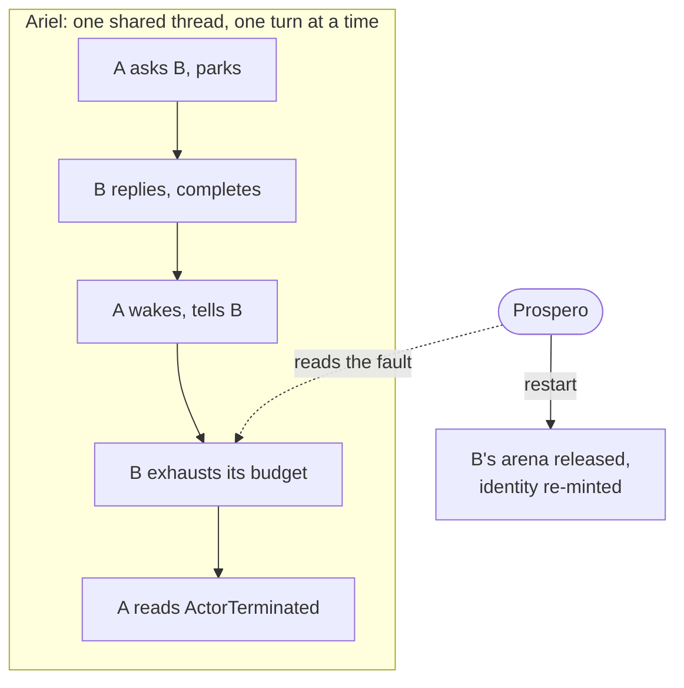
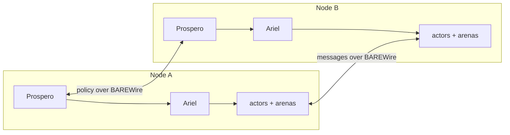
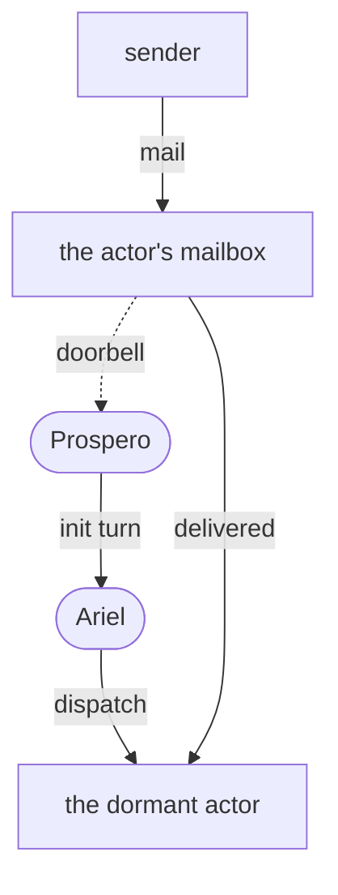

Ask three developers where "the scheduler" lives in their stack and you'll likely receive multiple earnest, precise answers that are correct while barely overlapping. A systems programmer might offer details on an epoll or io_uring loop, a thread-per-core layout, and capacities provisioned at boot from numbers somebody chose by hand. A .NET developer building on Akka.NET may have configured it as well: dispatcher throughput settings tuned over a runtime thread pool. The Elixir developer inherited the best one in the business: the BEAM's preemptive reduction counting is the part of that platform its community brags about, and with justification.

Here's the part that might seem too obvious: in all three stacks the scheduler is load-bearing for every liveness property the system has, and in only ***one*** of them does it have a name, a boundary, and semantics that qualifies as integral to the scaffold. In our own project, our own scheduler toplogy emerged by early design recognition: the component was always there, and it has now taken its formal name in the Fidelity Framework pantheon.

## Ariel: The Third Name

In the early going we wanted to be certain that our actor topology was clearly articulated form the early design phases. Clef's actor system has carried two names through what we've published to this point: [Olivier](/docs/design/concurrency/the-three-layer-actor-contract/), the working actor that defines how things get done, and [Prospero](/docs/design/memory/raii-in-olivier-and-prospero/), the supervisor that decides what should happen, from restart strategies to arena lifecycles. The component that makes those decisions happen *in time* has been in the architecture all along, billed under Prospero's name. It selects which ready actor runs next and delivers each resumption as a course of handling its remit. Formal standing followed, as *scheduling* as a concept has modes of its own. Our goal is to see that Olivier's semantics and Prospero's supervision hold unchanged on every target, while dispatch may be realized differently on each: cooperative on a single core, federated across a package, or borrowed from a host kernel. A concern that varies where the actor model holds in syntax is its own unique boundary, so it now carries its own name: Ariel. Olivier defines what an actor is, Prospero decides what should happen, and Ariel makes it happen in time.

In the Tempest, Ariel acts only on Prospero's instruction and is visible to no one else on the island, and we've made that clear metaphor part of the architecture rather than allusion. Actors never address the scheduler. Its only client is Prospero, a design position that holds its central role for a concurrent programming language. 

## Obligations Precede

Our early design model presumed that a scheduler would simply fall out of principled structure, and the assumption was half right. 

> Structure decides *eligibility*. 

Our compiler classifies regions off the dependency graph, the escape analysis places values, and the [wait classification](/spec/draft/synchronous-rpc-liveness/) knows at compile time which calls suspend. What structure **cannot** decide is *order under scarcity*: such as 

- Which ready actor runs next? 
- What happens at saturation? 
- Whose delivery is admitted when capacity runs tight?

Those depend on runtime facts no compile-time analysis sees.

What forced the structural distinction of a discrete scheduler (and therefore the naming) was watching obligations accumulate in a way that strained the two-element model. The [deadlock-freedom work](/docs/design/concurrency/deadlock-freedom-as-an-obligation/) discharges acyclicity of the wait-for relation as a solver obligation, and acyclicity rules out the cycle, but turning "no cycle" into "the reply arrives" needs fairness, a premise about dispatch. A proof premise has to cite something with a clear bound. Supervision has to keep working at saturation, or a restart competes with the very traffic jam it exists to clear. Deterministic replay, the discipline that makes an actor system testable seed-for-seed, is a property of whoever interprets suspension and resumption. Three obligations were pointing at an anonymous spot in the architecture. Components in this project take formal standing when they acquire obligations, and that's precisely how Prospero earned its own name. In a hosted environment, the tenets of scheduling may "fall out" *naturally* from a well-designed, supervised actor system. But when the model is laid bare in a freestanding or unikernel implementation the stakes are raised and the terms become clearer.

So Ariel enters the [specification](/spec/draft/scheduler-contract/) as six clauses:

| Clause | One line |
|---|---|
| Fairness | every ready actor is dispatched within a finite number of scheduling events |
| Turn discipline | a turn runs to completion under a budget, and exhausting the budget is a fault, never a scheduling event |
| Control-plane immunity | supervision, timers, and reference-state upkeep stay executable when the data plane is saturated |
| Admission | delivery is accepted or visibly refused, and a receiver's backpressure never becomes the sender's memory growth |
| Determinism mode | swap the sources of time and arrival, and identical sources yield identical dispatch |
| Assumption manifest | each implementation publishes which clauses it discharges itself and which it assumes from its substrate |

## Where the Contract Meets Silicon

In our framing, the systems engineer will have already spotted what those clauses cost, because the they must adapt to the model in which any low-level scheduler would operate at runtime. Here is where our answer diverges from single point solutions: the same contract would hold from bare silicon to spanning hosts, and we expect the assumption set to change which manifests in the implementation may yield from those bounded target conditions.

At its most 'bare' we imagine the freestanding profile, the [pure-Clef unikernel](/docs/internals/hardware/fidelity-on-mcu/) our [Post-Quantum Credential](/blog/cryptographic-certainty/) work aims straight at the reset vector on a Cortex-M33. Our spec already proposed a design that on a single-core target [the suspend/resume semantics become the cooperative scheduler](/spec/draft/dcont-representation/): resume is the scheduling event, and the interrupt-to-continuation binding is dispatch. At "the unkernel grain" the contract assumes almost nothing beyond a hardware timer. For a credential device whose trusted computing base has to be the audited source and nothing under it, a scheduler you can read clause by clause **is** a *security property*, and we intend to state it that way. Even the elevated thread survives the reduction: with one core, Prospero's elevation is the interrupt controller's, supervision running at exception priority above the dispatch loop, armed before the first turn ever runs.

Climbing the abstraction scaffold, the assumption set grows and the manifest follows with it. With a microVM Ariel would discharge *turn discipline* and *admission* **itself** while assuming vCPU progress against a quota it can *articulate* from the deployment spec. Similarly, a container-based Ariel implementation is informed by a budget it can only *observe*, since cgroup throttling arrives as jumps in time. At the hosted tier, fairness is inherited wholesale from the OS or managed runtime, and Ariel supplies ordering and admission above it. 

In our current design thinking the assumption manifest is an ordinary Clef value. Its map carries the four dispatch clauses the contract's profile table partitions. Determinism mode is a matter of which sources an implementation interprets, which the profile field already names, and the sixth clause is this record itself. Two instances carry the contrast between the bottom of the stack and the top:

```fsharp
type ClauseId =                     // the four dispatch clauses the manifest partitions
    | Fairness                      // §3: a ready actor is dispatched within finitely many events
    | TurnDiscipline                // §4: turns run to completion; budget exhaustion is a fault
    | ControlPlaneImmunity          // §5: supervision stays executable at saturation
    | Admission                     // §6: accept or refuse; refusal is observable

type Discharge =
    | Discharged                    // this implementation discharges the clause itself
    | Assumed of substrate: string  // discharged by the substrate this string names

type Profile   = Freestanding | MicroVm | Container | Hosted | Simulated
type Authority = Sovereign | Federated | Replicated

type AssumptionManifest = {
    Profile:   Profile
    Authority: Authority
    Clauses:   Map<ClauseId, Discharge>
}

// assumed beneath the clauses: a hardware timer, interrupt delivery
let freestanding = {
    Profile   = Freestanding
    Authority = Sovereign
    Clauses   =
        [ Fairness,             Discharged   // the interrupt-to-continuation binding is dispatch
          TurnDiscipline,       Discharged
          ControlPlaneImmunity, Discharged   // Handler mode, armed before the first turn
          Admission,            Discharged ] // capacities from the compiler's manifest
        |> Map.ofList
}

let hosted = {
    Profile   = Hosted
    Authority = Sovereign
    Clauses   =
        [ Fairness,             Assumed "the OS scheduler"
          TurnDiscipline,       Discharged   // atomicity as the program observes it
          ControlPlaneImmunity, Discharged
          Admission,            Discharged ]
        |> Map.ofList
}
```

We see hosted values becoming a component of `Fidelity.Platform` quotation in many circumstances, but we also imagine some consideration for developer design-time controls.

## The Ask Is the Only Edge

Aaron Stannard has invested years teaching .NET developers the ask/tell distinction in [Akka.NET](https://akka.net). `Tell` is the natural actor primitive and `Ask` is the expensive blocking exception to reach for with caution. That pedagogy is correct, and in Clef the advice becomes structure: a [`Tell` adds no wait-for edge, and only a synchronous reply-wait, `PostAndReply` in Clef, creates one](/spec/draft/synchronous-rpc-liveness/). The deadlock analysis has a tractable object precisely because the edge set is generated by one construct family our compiler classifies at every call site, and the one statically unresolvable case lowers to a supervised call under an explicit timeout. 

The same reasoning applies to the dispatch layer. Dispatcher tuning in a hosted actor framework is folklore for a structural reason: the scheduler underneath is a tenant of the runtime's thread pool, with no contract from below to provide structure. Ariel's manifest is the missing definition, where the written record guarantees connection to other layers where they exist, and of full self-definition where Ariel serves as the scheduling root.

## Preemption Belongs Above the Turn

The BEAM in Erlang preempts by reduction counting, and for its world, dynamically typed code from many teams sharing long-lived nodes, that is the right call, proven across decades of telecom uptime. Ariel makes a specific, different choice and provides the same protection. 

Below 'the turn', execution is cooperative: a turn runs to completion under its budget, and the single-logical-thread guarantee of an actor rests on that atomicity. 'Above' the turn, Prospero holds every preemptive remedy at lifecycle granularity: 

- Retire the actor
- Release its arena as a unit
- Restart from known state 

Cooperative below the turn, preemptive above it.

The vocabulary we're sketching splits with the responsibility. A turn ends in one of three ways, and only one of them is in the scheduler's dispatch loop. The other two are in Prospero's remit:

```fsharp
type TurnOutcome =      // Ariel's side of the boundary
    | Suspended         // parked; its resume is the next scheduling event
    | Completed         // clean exit: actor and arena retire together
    | BudgetExhausted   // a fault, never a scheduling event

type Remedy =           // Prospero's side of the boundary
    | Retire            // release the arena as a unit
    | Restart           // re-mints identity: old references read ActorTerminated
    | Hydrate           // preserves identity: references stay Valid
 
```

The actor-reference sentinel our memory model already defines makes lifecycle-granularity preemption safe to perform. A reference into a retired actor reads `ActorTerminated` rather than dangling, so every holder observes the death instead of corrupting through it. Erlang advanced a discipline that any corrupted process should crash and restart clean. Our design keeps that lesson and moves the enforcement into structures the compiler places, both within the type system and in the analysis through elaboration & saturation of the Program Sementic Graph.

A brief sample shows what cooperative turn scheduling might present to the developer. This is an echo handler, one connection per actor, written the way we expect to be common syntax:

```fsharp
let echo (conn: Connection) = async {
    let mutable live = true
    while live do
        let! bytes = conn.Receive()
        if bytes.Length = 0 then
            live <- false   
        else
            do! conn.Send bytes 
}
```

There is no scheduling vocabulary in it because there is nothing to call. Each `let!` and `do!` is a suspension point the [computation expression lowers to a continuation](/docs/design/concurrency/delimited-continuations/), so the straight-line loop compiles into the very state machine *a systems programmer might otherwise flatten by hand* in an imperative language: park on receive, resume on arrival, park on send, resume on completion, and a clean exit that retires actor and arena together. Those discovered turns are exactly what Ariel is being designed to dispatch. This is the elegance of the actor model providing a "sugared" continuation while framing the control flow in a way that preserved design-time readability, relative to atomized imperative code.

Types are the still photograph. A scheduling exchange is a zoetrope in motion, and one exchange exercises the division of labor end to end. An ask would park a caller, a resume would wake it, and a later turn would exhaust its budget and meet Prospero's remedy.



The machinery is effectful, and the form never stops being ML: the loop is a tail call, the outcomes are a closed match, and the imperative work is confined to what each arm performs. On the freestanding profile the two tiers read the way they would run:

```fsharp
// Thread mode: the dispatch loop is the entire foreground
let rec run () =
    match nextReady () with
    | Some actor ->
        beginTurn actor                      // budget clock starts here
        match dispatch actor with            // one turn, run to completion
        | Suspended       -> ()              // parked; its resume will re-queue it
        | Completed       -> retire actor    // arena released as a unit
        | BudgetExhausted -> ()              // owned above, never handled here
        run ()
    | None ->
        waitForInterrupt ()                  // idle; a resume arrives by interrupt

// Handler mode, reserved priority: the control plane reads every turn from above
let onTick () =
    expireSupervisedTimeouts ()              // the Unresolved residue meets its deadline
    match overBudget (currentTurn ()) with
    | Some actor -> escalate actor Restart   // stack reset, arena release, fresh identity
    | None       -> ()
```

The two tiers read as the classic policy/mechanism separation: the dispatch loop is all mechanism, and every decision belongs to the tick handler. They meet in turn state alone. `onTick` reads the current turn directly, so a restart costs no mailbox slot and no envelope, and supervision still goes through when every bounded pool is spent. 

## Dispatch Stays Home

A multi-target system design is the "far reach" we've been considering lately for weeks as we've worked on the MCU unikernel case. In that situation a unikernel on the "Post Quantum Credential" device would be connected to a device (desktop, laptop, tablet or mobile phone) and would receive a message "over the wire". The scheduler for the Clef-based phone application (which would be "hosted" in that machine) would be distinct from the Ariel instance on the MCU that's running entropy collection, key generation, secure enclave access and delivering responses to the host device.

From a further point of abstraction, a turn-granularity dispatch decision never crosses a domain. Federation is contract recursion, and the schedulers coordinate over BAREWire with ordinary structured messages on the type-informed fabric. It's worth a risk reminder that a privileged side channel between two such schedulers would breach *shared-nothing* principles.

Across a network boundary, Ariel replicates and Prospero spans. Each node runs a sovereign scheduler, and what crosses the wire may be any of a range of policy requests: including supervision, placement, deadlines.



The most direct traffic is a `Tell`. The phone application would post a challenge to the credential's signing actor, and the message crosses as BAREWire structure carrying no scheduling payload at all. Admission belongs to the receiving end: the mailbox was sized by the credential's own capacity manifest, and the credential's Ariel dispatches the signing turn under its own fairness bound, interrupt by interrupt. The phone observes a reply arriving, and nothing else. When the application genuinely needs the answer before its next step, the `Ask` crosses the same way, and the parked caller stays local: the calling actor is no longer ready, so the phone's Ariel stops dispatching it, and the phone's Prospero holds the deadline that fires if the key is pulled from the port mid-exchange.

The two schedulers meeting across that wire could hardly be more different. The credential's Ariel is sovereign on a single core. Its dispatch is the interrupt-to-continuation binding, and every capacity it honors was fixed before the image was flashed. The phone's Ariel is hosted, supplying ordering and admission above a multi-core OS scheduler that time-slices the application against every other app on the device, and its manifest records fairness as `Assumed "the OS scheduler"`. The boundary rule holds because that gap is untranslatable: 'next' on the MCU is an interrupt away, and 'next' on the phone is whenever the kernel offers a core. Each side runs the six clauses against its own substrate, the two manifests record how differently that goes, and the wire carries what it always carried: messages for the actors, policy between the Prosperos.

## The Platform Engineer Enters the Conversation

There's a fourth participant who has been waiting for their turn: the platform engineer, whose scheduler has dominated the conversation for a decade or more. ***Kubernetes*** published its contract, and grew an extension ecosystem with it. That history ratifies half of this post's argument on its own, since the component with a stated contract is the one an ecosystem can safely build around. But look at what **kube-scheduler** actually decides: it binds a pod to a node, which is placement. In Fidelity Framework's vocabulary, placement is Prospero's concern. The in-time dispatch of a cluster never touches the wire: every node's kernel stays the sovereign scheduler of its own cores, and no cluster-level component hands out a time slice remotely. The industry's largest distributed system already runs under a system of rules that our framework adopts by its own measure. Policy crosses the network. Dispatch stays home.

The declared-capacity half of this exploration is familiar territory too. Cluster scheduling in Kubernetes is bin-packing against `resources.requests` that somebody typed in, and the numbers are guesses often enough that an entire tool category exists in that ecosystem to re-derive them empirically. A capacity manifest in the Fidelity Framework would emerge as a declaration with the guessing removed: mailbox depths and pool sizes would be provided as analysis outputs. Again, we see this as something that designer would have the option to provide, but we expect the quotation system that is integral to `Fidelity.Platform` to play a role here as well.

## A Letter to a Sleeping Actor

For the furthest reach, we imagine a fifth reference state, `Dormant`, alongside the four the sentinel already carries:

```fsharp
type ReferenceState =
    | Valid              // live actor, current identity
    | Dormant            // proposed: identity current, execution at rest
    | ActorTerminated    // a restart re-minted identity; failure is observable here
    | ProcessUnavailable
    | Unknown
```

A dormant actor has current identity and execution state at rest. A message sent to one would be admitted at the actor's own mailbox, because in this design the mailbox precedes the actor, and admission would raise a control-plane doorbell to the resident Prospero on the actor's home node. That Prospero would decide hydration under a budget symmetric with its restart budget and hand the initialization turn to its local Ariel. The sender does not observe or orchestrate any of this, on the same node or across a wire.



Two boundaries separate this proposal from queue management. The first is admission: Prospero receives the admission event, never the message, and the message remains in the actor's own bounded mailbox under the same clause that governs every other delivery. A control plane that carries data-plane traffic is a queueing system, and that is not the idea here. The second is reference state. Hydration preserves identity: a reference held across the dormant interval reads `Valid` at both ends, and the interval is a scheduling delay. A crash restart re-mints identity: a stale reference reads `ActorTerminated`, and the failure is observable to every holder. Under a single transparent activation, a reference reads the same after a crash as after a sleep. Supervision requires the difference, and the difference is the OTP inheritance this design preserves.

The cluster world already runs both sides of this line at pod granularity. Scale-to-zero platforms like Knative hold a doorbell of their own, an activator that admits a request and signals for capacity, though it deliberately buffers the request while the pod arrives, a data-plane load the component must then be scaled to carry. Keeping the message in the actor's own bounded mailbox is our answer to that unneeded accumulation (in our case). And the split between a K8s Deployment's interchangeable replicas and a StatefulSet's stable identities is the re-minted-versus-preserved line at higher abstraction.

In our case, we envision that state at rest would be a BAREWire layout that hydration maps back by construction. On the credential-class profile, hydration would only ever be able to activate capacity that was designed, validated and built to accept the runtime remit. While we think about the 'runtime considerations' with the design relative to the targetd substrate, we also want to be clear that his is in no way a managed runtime **host**. Our position is to preserve the Stroustrup "don't pay for what you don't use" in this model.

## Ariel Takes Center Stage

When we named our actor model, it was done with a level of intent to distinguish it from its influences. We knew that eventually the delimited continuation "foundation" that we take with Clef as a concurrency-based programming language would translate to an actor model that is distinctive and unique. When we considered the pun-like 'pivot' to the theatrical actor metaphor, and the rich symbolism of Prospero and Ariel from the Tempest, we knew we had a model that would fit the framing, even if we didn't know how an independent scheduler design would look outside of 'standard actor assumptions'. 

We took on the MCU unikernel design as a forcing function, and this contract is what it was designed to surface. An actor model over delimited continuations already insinuates a cooperative/preemptive scaffold: suspend and resume supply the cooperative half, supervision the preemptive half. In a hosted environment, with an OS scheduler beneath it, that scaffold fits the bill. On the M33, the smallest compute device we have on bench, there is nothing underneath when contemplating a unikernel. Every premise that had gone unstated had to be articulated as a clear tenet, and from that the component emerged with its name, and typical dramatic flourish. 

What naming Ariel adds to our Fidelity framework is a citable premise under every liveness claim we make in the formalism, one contract with an assumption manifest that records, per target, which elements an implementation discharges directly and which it might assume from a substrate provided beneath it. The spec text is [drafted](/spec/draft/scheduler-contract/) here, and the design exposition sits [alongside Olivier and Prospero](/docs/design/concurrency/ariel-under-prospero/). We'll use these lessons to continue the work to produce safe, efficient computation within the framework as the engineering continues to take shape.
