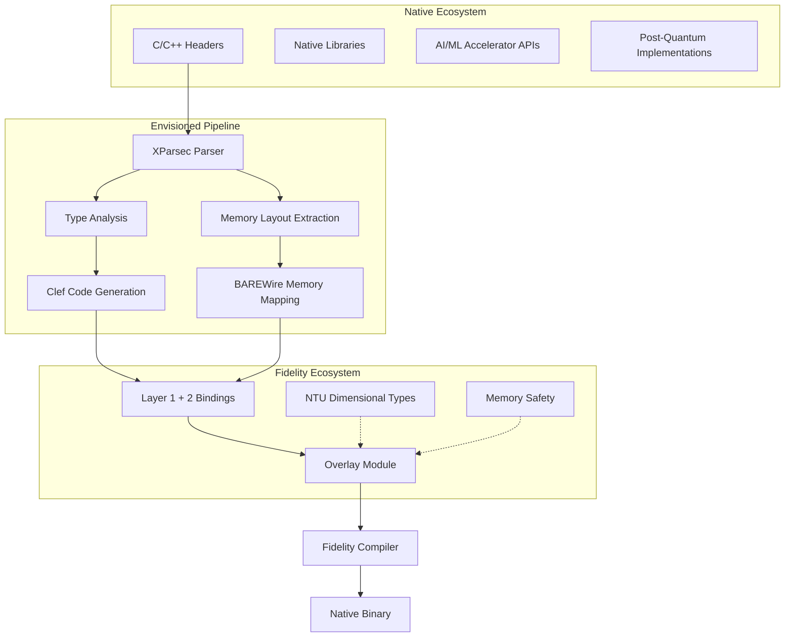

> This article was originally published on the
> [SpeakEZ Technologies blog](https://speakez.tech) as part of our early
> design work on the Fidelity Framework. It has been updated to reflect
> the Clef language naming and current project structure.

The computing landscape stands at an inflection point. AI accelerators are reshaping our expectations of performance while "quantum" looms as both opportunity *for* and threat *to* our future. Security vulnerabilities in memory-unsafe code continue to cost billions annually. Yet the vast ecosystem of foundational libraries, from TensorFlow's core implementations to OpenSSL, remains anchored in C and C++. How might we bridge this chasm between the proven code we depend on and the type-safe, accelerated future we're building at an increasing pace? Enter the vision of Farscape: a CLI tool designed to accelerate and transform how type and memory safety can be brought to a high-performance landscape.

## The Native Code Opportunity

Modern software development presents a daunting set of challenges. Decades of engineering effort have produced battle-tested C and C++ libraries that power everything from operating systems to scientific computing. These libraries represent not just code, but accumulated domain expertise that would be prohibitively expensive to recreate. Yet their memory safety challenges and imperative APIs stand in tension with modern computing goals.

Traditional approaches to this challenge have forced uncomfortable choices: accept the security risks of unsafe code or undertake massive rewrites that may introduce new bugs while discarding proven algorithms. The Farscape project envisions a different path: automated generation of type-safe [Clef](https://clef-lang.com) bindings that could preserve the performance and capabilities of native libraries while wrapping them in Clef's powerful safety features that provide zero-cost abstractions at compile time.

## Farscape's Architectural Vision

While still in early development, Farscape's design aims to be more than just another interop tool. By planning to leverage XParsec for precise header parsing and integrating deeply with the Fidelity Framework's compilation pipeline, Farscape seeks to create not just bindings, but a bridge between programming paradigms.



The envisioned architecture suggests that when fully realized, running a command like:

```bash
farscape generate --header tensorflow/c_api.h --library tensorflow --namespace TensorFlow.FSharp
```

Would generate not just function signatures, but a complete Clef library including type-safe wrappers, memory management integration, and idiomatic Clef APIs, all derived automatically from C++ headers.

## Type Safety with Units of Measure

One of Farscape's most ambitious design goals involves bringing dimensional types to native interop. This isn't just about catching errors; it's about making illegal states un-representable at the type level. The Fidelity framework's Native Type Universe (NTU) carries a dimensional type system through CCS as a first-class compile-time construct — dimensional annotations erase completely during compilation, adding zero runtime cost to the final native binary.

C headers carry no dimensional information — there is no metadata in `const unsigned char *key` that says "these are key bytes, not IV bytes." Farscape generates the typed interface (Layer 1 binding declarations and Layer 2 idiomatic wrappers), but dimensional semantics are the developer's contribution. To bridge this gap, Farscape's Moya project system supports an **overlay module**: a UoM-annotated shim scaffolded from annotations in the `.moya.toml` and generated once at the developer's request, then maintained as their own code alongside the regenerable layers beneath it.

Consider how OpenSSL's cryptographic APIs are transformed through this layered approach, where confusing a key size with a buffer size can lead to catastrophic vulnerabilities:

```c
// Original C API - multiple ways to misuse
int EVP_EncryptInit_ex(EVP_CIPHER_CTX *ctx, const EVP_CIPHER *type,
                       ENGINE *impl, const unsigned char *key,
                       const unsigned char *iv);

int EVP_EncryptUpdate(EVP_CIPHER_CTX *ctx, unsigned char *out,
                      int *outl, const unsigned char *in, int inl);
```

The vision for Farscape includes generating Clef bindings that could make these APIs dramatically safer:

```fsharp
// Layer 1: FidelityExtern binding declarations (generated by Farscape)
module OpenSSL.Crypto.Platform =
    [<FidelityExtern("crypto", "EVP_CIPHER_CTX_new")>]
    let evpCipherCtxNew () : nativeint = Unchecked.defaultof<nativeint>

    [<FidelityExtern("crypto", "EVP_CIPHER_CTX_free")>]
    let evpCipherCtxFree (ctx: nativeint) : unit = Unchecked.defaultof<unit>

    [<FidelityExtern("crypto", "EVP_EncryptInit_ex")>]
    let evpEncryptInitEx (ctx: nativeint) (cipher: nativeint) (engine: nativeint)
                         (key: nativeint) (iv: nativeint) : int32 =
        Unchecked.defaultof<int32>

// Layer 2: Idiomatic wrapper (generated by Farscape's WrapperCodeGenerator)
module OpenSSL.Crypto =
    let encryptInit (ctx: nativeint) (cipher: nativeint) (engine: nativeint)
                    (key: nativeint) (iv: nativeint) : Result<unit, CryptoError> =
        let result = Platform.evpEncryptInitEx ctx cipher engine key iv
        if result = 1l then Ok ()
        else Error (CryptoOperationFailed "Initialization failed")
```

Layers 1 and 2 are Farscape's territory — regenerated from C headers whenever the library updates. The developer's dimensional semantics live in an **overlay module**, scaffolded once from Moya TOML annotations and then maintained as their own code:

```fsharp
// Overlay: Developer-maintained UoM shim (scaffolded by Farscape, then user-owned)
module OpenSSL.Crypto.Measured =

    // Dimensional types — the developer's contribution
    [<Measure>] type keyBytes
    [<Measure>] type ivBytes
    [<Measure>] type plainBytes
    [<Measure>] type cipherBytes

    // UoM-annotated functions delegate to Layer 2
    let encryptInit (ctx: nativeint)
                    (algorithm: CipherAlgorithm)
                    (key: nativeptr<byte<keyBytes>>) (keyLen: int)
                    (iv: nativeptr<byte<ivBytes>>) (ivLen: int)
                    : Result<unit, CryptoError> =
        match algorithm with
        | AES256_CBC ->
            if keyLen <> 32 then Error (InvalidKeySize (32, keyLen))
            elif ivLen <> 16 then Error (InvalidIVSize (16, ivLen))
            else
                Crypto.encryptInit ctx (algorithm.NativeHandle) (nativeint 0)
                    (NativePtr.toNativeInt key) (NativePtr.toNativeInt iv)
        | _ -> Error (UnsupportedAlgorithm algorithm)
```

This layered approach catches entire classes of errors at compile time. It makes it literally impossible to pass ciphertext where plaintext is expected, or confuse key sizes with buffer sizes. The NTU's dimensional types erase completely during Fidelity compilation — the final native code is as efficient as hand-written C, with no runtime trace of the type-level constraints that guided its construction.

## Type-Safe Performance in AI Accelerators

The AI revolution has brought a proliferation of hardware accelerators, each with its own C/C++ SDK. Farscape's roadmap includes making these accelerators accessible to Clef developers without sacrificing performance or safety.

Consider how integration with NVIDIA's TensorRT might look in the future:

```fsharp
// Layer 1: FidelityExtern binding declarations (generated by Farscape)
module AI.TensorRT.Platform =
    [<FidelityExtern("nvinfer", "createInferBuilder")>]
    let createInferBuilder (logger: nativeint) : nativeint = Unchecked.defaultof<nativeint>

    [<FidelityExtern("nvinfer", "createExecutionContext")>]
    let createExecutionContext (engine: nativeint) : nativeint = Unchecked.defaultof<nativeint>

// Overlay: Developer-maintained dimensional types for tensor operations
module AI.TensorRT.Measured =
    open BAREWire

    // Dimensional types — NTU carries these through CCS, erased at compile time
    [<Measure>] type batch
    [<Measure>] type channel
    [<Measure>] type height
    [<Measure>] type width

    // Strongly-typed tensor shape
    type TensorShape = {
        Batch: int<batch>
        Channels: int<channel>
        Height: int<height>
        Width: int<width>
    }

    // GPU memory with ownership semantics
    type GpuTensor<'T, [<Measure>] 'Unit> = {
        DevicePtr: CudaMemory<'T>
        Shape: TensorShape
        Unit: 'Unit
    }

    // Overlay delegates to Layer 1 with dimensional guarantees
    let addInput (network: nativeint) (name: string) (shape: TensorShape) =
        let dims = Dims4(int shape.Batch, int shape.Channels,
                         int shape.Height, int shape.Width)
        Platform.networkAddInput network name DataType.FLOAT dims

    // Zero-copy inference execution
    let executeInference (engine: nativeint) (input: GpuTensor<float32, _>)
                         (outputBuffer: CudaMemory<float32>)
                         : Result<GpuTensor<float32, _>, string> =
        let context = Platform.createExecutionContext engine
        let bindings = [| input.DevicePtr.Ptr; outputBuffer.Ptr |]

        let success = Platform.enqueueV2 context bindings (nativeint 0)
        if success then
            Ok {
                DevicePtr = outputBuffer
                Shape = computeOutputShape input.Shape
                Unit = input.Unit
            }
        else
            Error "Inference execution failed"
```

This envisioned integration would provide several potential benefits:

1. **Compile-time shape validation**: Tensor dimension mismatches are caught at compile time, not runtime — the NTU's dimensional types make shape errors structurally impossible
2. **Zero-copy GPU operations**: Data would stay on the GPU throughout the inference pipeline
3. **Type-safe memory management**: GPU memory leaks could become impossible through scope-based resource patterns

Many AI frameworks today spend an inordinate amount of time working around Python's limitations. This includes providing tensor shape and other type information that Python "loses." With the Fidelity framework and the NTU's dimensional type system, all data type, shape, and memory structure information is preserved through the entire compilation process from source to native binary. That engineering effort currently spent working around Python's limitations can be focused on the core technologies and advancing the state of the art in accelerated compute. Farscape isn't just designed as an interop tool — it's a launchpad for AI advancement.

## Preparing for Tomorrow's Threats

While AI accelerators reshape today's computing landscape, the looming threat of quantum computers makes post-quantum cryptography (PQC) a critical consideration for the future. NIST has standardized several PQC algorithms, with reference implementations in C. Farscape's vision includes enabling immediate, safe adoption of these implementations as they mature.

Consider how integration with Kyber, a key encapsulation mechanism for post-quantum security, might work in this framework:

```fsharp
// Envisioned Farscape bindings for Kyber with developer overlay
module PostQuantum.Kyber =
    open BAREWire

    // Dimensional types — developer-authored overlay, erased by NTU at compile time
    [<Measure>] type publicKey
    [<Measure>] type secretKey
    [<Measure>] type ciphertext
    [<Measure>] type sharedSecret

    // Kyber-1024 constants as type-safe values
    let PublicKeySize = 1568<publicKey>
    let SecretKeySize = 3168<secretKey>
    let CiphertextSize = 1568<ciphertext>
    let SharedSecretSize = 32<sharedSecret>

    // Generate a new key pair with memory safety
    let generateKeyPair() : Result<KeyPair, KyberError> =
        use publicKey = AlignedBuffer<byte, publicKey>.Create(PublicKeySize)
        use secretKey = AlignedBuffer<byte, secretKey>.Create(SecretKeySize)

        let result = crypto_kem_keypair(
            publicKey.Address,
            secretKey.Address)

        if result = 0 then
            Ok {
                PublicKey = publicKey.ToOwned()
                SecretKey = secretKey.ToOwned()
            }
        else
            Error (KeyGenerationFailed result)
```

The promise of this approach lies in how quantum-safe applications could be built using Clef's type system, while the underlying algorithms remain in their well-tested C implementations. As new PQC algorithms emerge from research labs, Farscape could generate bindings quickly, accelerating adoption.

## BAREWire: Options for Zero-Copy Interop

One of Farscape's most ambitious planned features involves deep integration with BAREWire, enabling true zero-copy data sharing between Clef and native code. This capability would be particularly crucial for performance-sensitive domains like computer vision and signal processing.

```fsharp
// Conceptual image processing with zero-copy semantics
module Vision.ImageProcessing =
    open BAREWire
    open Farscape.OpenCV

    // Define image data layout for zero-copy sharing
    let ImageLayout = {
        Alignment = 32<bytes>  // SIMD-friendly alignment
        Fields = [
            { Name = "width"; Type = Int32; Offset = 0<offset> }
            { Name = "height"; Type = Int32; Offset = 4<offset> }
            { Name = "channels"; Type = Int32; Offset = 8<offset> }
            { Name = "stride"; Type = Int32; Offset = 12<offset> }
            { Name = "data"; Type = Pointer(UInt8); Offset = 16<offset> }
        ]
        Size = 24<bytes>
    }

    // Zero-copy image wrapper concept
    type Image = {
        Buffer: AlignedBuffer<byte>
        Width: int<pixels>
        Height: int<pixels>
        Channels: int
    }

    // Apply Gaussian blur without copying image data
    let gaussianBlur (image: Image) (kernelSize: int) : Image =
        // Create output buffer with same layout
        use output = AlignedBuffer<byte>.Create(
            Size.fromDimensions image.Width image.Height image.Channels)

        // Call OpenCV with direct memory pointers
        cv_GaussianBlur(
            image.Buffer.Address,
            output.Address,
            int image.Width,
            int image.Height,
            image.Channels,
            kernelSize)

        { image with Buffer = output.ToOwned() }
```

## Extended Integration Scenarios

The real power of Farscape will become apparent when building production systems. Consider a hypothetical scenario: building a secure communication system that might need AI-powered compression, post-quantum cryptography, and legacy protocol support.

```fsharp
// Production-ready secure communication system
// Dimensional types from overlay modules carry through the NTU
module SecureComm =
    open AI.Compression
    open PostQuantum.Kyber

    // Unified message type with dimensional safety guarantees
    type SecureMessage = {
        Timestamp: uint64
        Payload: nativeptr<byte<plainBytes>>
        PayloadLen: int
        Signature: nativeptr<byte<signature>>
        SignatureLen: int
    }

    // Hybrid encryption using AI and post-quantum algorithms
    let hybridEncrypt (message: SecureMessage)
                      (compressor: nativeint)
                      (quantumKey: AlignedBuffer<byte, publicKey>)
                      : Result<EncryptedPacket, CryptoError> =
        // Compress message using AI-accelerated hardware
        match Compression.compress compressor message.Payload message.PayloadLen with
        | Error e -> Error (CompressionFailed e)
        | Ok compressed ->

        // Generate ephemeral quantum-safe keys
        match generateKeyPair() with
        | Error e -> Error (KeyGenFailed e)
        | Ok kyberKeys ->

        match encapsulate quantumKey with
        | Error e -> Error (EncapsulationFailed e)
        | Ok (ciphertext, sharedSecret) ->

        // Combine classical and quantum approaches
        let hybridKey =
            KDF.deriveKey sharedSecret 256<keyBits>

        // Encrypt with authenticated encryption
        match AesGcm.encrypt hybridKey compressed with
        | Error e -> Error (EncryptionFailed e)
        | Ok encrypted ->
            Ok {
                CiphertextClassical = ciphertext
                CiphertextQuantum = kyberKeys.PublicKey
                EncryptedData = encrypted
                Metadata = message.Timestamp
            }
```

This example illustrates how Farscape could eventually enable seamless integration of diverse technologies, from AI-accelerated compression to post-quantum algorithms, all while maintaining type safety and zero-copy performance throughout the stack.

## Farscape in Practice

Farscape provides a CLI for generating Fidelity-compatible binding libraries from C headers:

```bash
# Generate binding declarations for a single header
farscape generate --header ./headers/sqlite3.h --library sqlite --namespace Fidelity.SQLite

# Or use a Moya project file for multi-header library decomposition
farscape project --project ./sqlite.moya.toml

# Scaffold an overlay module from Moya TOML annotations (generated once, then user-owned)
farscape project --project ./sqlite.moya.toml --generate-overlay

# This creates Fidelity binding output:
# ./output/
#   ├── Database.clef          # Layer 1: FidelityExtern binding declarations (regenerated)
#   ├── DatabaseWrappers.clef  # Layer 2: Idiomatic Clef wrappers (regenerated)
#   ├── DatabaseOverlay.clef   # Overlay: Dimensional types from TOML annotations (user-owned)
#   └── Memory.clef            # BAREWire memory layouts
```
```fsharp
// Use in your Fidelity application
open Fidelity.SQLite
let db = SQLite.open("mydata.db")
```

The generated code includes `[<FidelityExtern>]` attributed binding declarations that carry library name and symbol metadata through the compilation pipeline, Layer 2 idiomatic Clef wrapper functions with error handling and resource management, comprehensive XML documentation preserving the original C signatures, and unit tests for binding validation. Farscape's Moya project system supports multi-header libraries with automatic declaration merging and namespace-scoped generation — enabling clean decomposition of libraries like libc across multiple headers into focused Clef modules.

When the Moya TOML includes `[annotations.measures]` and `[annotations.parameters]` sections, the `--generate-overlay` flag scaffolds a dimensional overlay module seeded with the declared measure types and parameter mappings. This overlay is generated once and then becomes the developer's code — subsequent runs of `farscape project` regenerate only Layers 1 and 2, leaving the overlay untouched. If the underlying C library changes a function signature, CCS surfaces the type mismatch in the overlay as a compile error, guiding the developer to the exact functions that need attention. This design draws on hard-won lessons from binding generators in other ecosystems: the boundary between generated code and developer-contributed code must be absolute, and the type system — not manual diffing — should be the migration tool.

## Performance Aspirations

A critical design goal for any abstraction layer involves minimizing performance overhead. Farscape's architecture addresses this through several planned mechanisms:

1. **Compile-Time Specialization**: The Fidelity compiler aims to specialize all generic code at compile time, eliminating virtual dispatch overhead.

2. **Zero-Cost Abstractions**: The NTU's dimensional types and other type annotations erase completely during compilation, adding zero runtime overhead.

3. **Direct Memory Access**: BAREWire integration plans to enable true zero-copy semantics for large data structures.

4. **Inline Optimization**: Critical paths would be marked for aggressive inlining, targeting hand-written C performance levels.

Early lab work suggests that well-designed bindings could perform within single-digit percentages of direct C calls. More benchmarking and related work must be done, and we're excited to extend the NTU's dimensional type erasure through the full MLIR/LLVM compilation path — safety at the source level, zero cost at the binary level.

## The Expanding Hardware Landscape

As we look toward the future, several trends make Farscape's vision increasingly relevant:

**AI Hardware Evolution**: From established platforms like TPUs to emerging neuromorphic chips, each new accelerator brings its own C++ SDK. Farscape could ensure Clef developers aren't left behind in the AI revolution.

**Quantum Computing Readiness**: As quantum computers transition from research to reality, their C++ SDKs will need safe wrappers. Farscape's design positions it to generate these automatically, setting a new path for democratizing quantum computing access.

**Edge Computing Requirements**: Resource-constrained edge devices often demand careful memory management. Farscape's planned integration with the Fidelity compiler could enable Clef code to run efficiently on these devices while maintaining safety guarantees.

**Legacy System Evolution**: Billions of lines of C/C++ code power critical infrastructure. Farscape's approach could enable gradual, safe modernization without requiring wholesale rewrites.

## Care and Feeding of Generated Libraries

A persistent challenge with code-generated binding libraries is the lifecycle tension between what the tool produces and what the developer contributes. Anyone who has worked with binding generators in other ecosystems knows the frustration: you annotate generated code with domain-specific types, refine the API surface, add validation logic — and then a library update forces regeneration that obliterates your work.

Farscape addresses this through an absolute boundary between generated and developer-owned code:

**Layers 1 and 2 are Farscape's territory.** The `[<FidelityExtern>]` binding declarations (Layer 1) and idiomatic wrappers (Layer 2) are regenerated from C headers whenever the underlying library updates. Developers should never modify these files — they will be overwritten.

**The overlay module is the developer's territory.** When dimensional types, domain-specific validation, or custom API refinements are needed, the developer works in an overlay module that imports Layer 2 and re-exports with the additional semantics. This module is scaffolded once from Moya TOML annotations at the developer's request, and then Farscape never touches it again.

**The type system is the migration tool.** When a C library updates and Farscape regenerates Layers 1 and 2, any signature changes that affect the overlay surface immediately as compile errors in CCS. The developer doesn't need to diff generated output or hunt for breaking changes — the type checker points directly to the functions in the overlay that need attention. This is a significant advantage over ecosystems without a dimensional type system as intrinsic as the NTU; in those environments, binding generators must resort to heuristic merge strategies or manual annotation transfer, both of which are fragile and error-prone.

This three-layer architecture — generated declarations, generated wrappers, developer overlay — keeps the friction of library evolution to an essential minimum. The generated layers handle the mechanical translation from C to Clef. The overlay carries the semantic investment that only a domain expert can contribute. And the boundary between them is enforced by the compiler, not by convention.

## A Bridge Under Construction

Farscape represents an ambitious vision: to connect accumulated wisdom of decades of native development with the type-safe future we're building. By aiming to make C and C++ libraries first-class citizens in the Clef ecosystem, Farscape seeks to enable developers to leverage the best of both worlds, the performance and ubiquity of native code with the safety and expressiveness of Clef.

As we face opportunities with AI accelerators reshaping our performance landscape to the challenge of "the quantum threat" looming on the horizon, the ability to safely and efficiently integrate native code becomes not just useful, but essential. Farscape, as part of the broader Fidelity Framework vision, aims to provide the foundation for this integration, enabling Clef to contribute commercially across the entire computing spectrum, from embedded devices to supercomputers.

The future of software development isn't about choosing between safety and performance, between legacy and modern. It's about building bridges that let us use the best tool for each job while maintaining the safety and performance guarantees we need. Farscape aspires to be one such bridge to the future of compute.

For developers looking toward this future, the path being charted is clear: type-safe, performant, and ready for whatever hardware innovations lie ahead. The vision of Farscape points toward a new era of Clef development, one where the past and future of computing converge.
