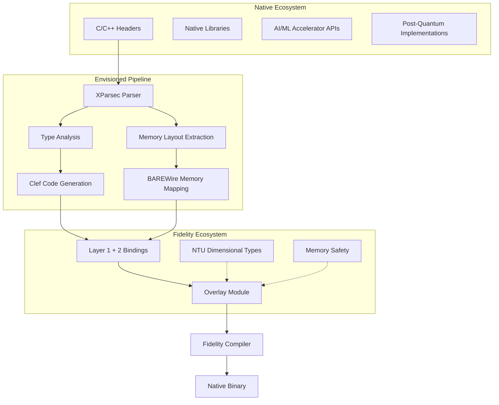

AI accelerators are changing the performance characteristics developers can target, and post-quantum cryptography is moving from research into practice. Security vulnerabilities in memory-unsafe code continue to cost billions annually. The ecosystem of foundational libraries, from TensorFlow's core implementations to OpenSSL, remains anchored in C and C++. We have been asking how to bring type and memory safety to that body of native code without discarding it, and our answer is Farscape: a CLI tool we are designing to generate safe bindings into the Clef ecosystem.

## The Native Code Opportunity

Decades of engineering effort have produced C and C++ libraries that power everything from operating systems to scientific computing. These libraries represent accumulated domain expertise that would be expensive to recreate. Their memory safety properties and imperative APIs sit in tension with the safety properties modern compute targets call for.

Existing approaches force a choice: accept the security risks of unsafe code, or undertake rewrites that may introduce new bugs while discarding tested algorithms. Our Farscape project takes a third route. It generates type-safe [Clef](https://clef-lang.com) bindings intended to preserve the performance of native libraries while wrapping them in the dimensional safety the Clef language carries, with annotations that erase at compile time. The deeper treatments follow from here: [binding C++ libraries via Plugify's ABI intelligence](/docs/internals/farscape/binding-cpp-to-clef-in-farscape/), the [modular entry points](/docs/internals/farscape/farscape-modular-entry-points/) that generate drop-in replacements for C tools, and the [FFI boundary semantics](/spec/draft/ffi-boundary/) the specification defines beneath them.

## Farscape's Architectural Vision

Our Farscape design is still in early development. It uses XParsec for header parsing and integrates with the Fidelity Framework's compilation pipeline, so the generated bindings carry through to the same native output the rest of the framework produces.


```mermaid
graph TD
subgraph Native["Native Ecosystem"]
CPP[C/C++ Headers]
LIB[Native Libraries]
AI[AI/ML Accelerator APIs]
QUANTUM[Post-Quantum Implementations]
end
subgraph Farscape["Envisioned Pipeline"]
    PARSE[XParsec Parser]
    ANALYZE[Type Analysis]
    MEMPARSE[Memory Layout Extraction]
    GEN[Clef Code Generation]
    BARE[BAREWire Memory Mapping]
end

subgraph FSharp["Fidelity Ecosystem"]
    BINDINGS[Layer 1 + 2 Bindings]
    OVERLAY[Overlay Module]
    NTU[NTU Dimensional Types]
    MEMORY[Memory Safety]
end

CPP --> PARSE
PARSE --> ANALYZE
PARSE --> MEMPARSE
ANALYZE --> GEN
MEMPARSE --> BARE
GEN --> BINDINGS
BARE --> BINDINGS
BINDINGS --> OVERLAY
NTU -.-> OVERLAY
MEMORY -.-> OVERLAY

OVERLAY --> FIDELITY[Fidelity Compiler]
FIDELITY --> NATIVE_BINARY[Native Binary]
```

When fully realized, running a command like:

```bash
farscape generate --header tensorflow/c_api.h --library tensorflow --namespace TensorFlow.FSharp
```

would generate a Clef library: function signatures, type-safe wrappers, memory management integration, and idiomatic Clef APIs, all derived from the C++ headers.

## Type Safety with Units of Measure

A design goal for our Farscape is to bring dimensional types to native interop, so that an illegal state becomes unrepresentable at the type level. Our Native Type Universe (NTU) carries a dimensional type system through CCS as a compile-time construct. The dimensional annotations erase during compilation, so they add no runtime cost to the final native binary.

C headers carry no dimensional information. Nothing in `const unsigned char *key` records that these are key bytes rather than IV bytes. Farscape generates the interface (Layer 1 binding declarations and Layer 2 idiomatic wrappers), and dimensional semantics are the developer's contribution. To bridge that gap, our Moya project system supports an **overlay module**: a UoM-annotated shim scaffolded from annotations in the `.moya.toml`, generated once at the developer's request, then maintained as their own code alongside the regenerable layers beneath it.

Consider how OpenSSL's cryptographic APIs pass through this layered approach, where confusing a key size with a buffer size can lead to a security vulnerability:

```c
// Original C API - multiple ways to misuse
int EVP_EncryptInit_ex(EVP_CIPHER_CTX *ctx, const EVP_CIPHER *type,
                       ENGINE *impl, const unsigned char *key,
                       const unsigned char *iv);

int EVP_EncryptUpdate(EVP_CIPHER_CTX *ctx, unsigned char *out,
                      int *outl, const unsigned char *in, int inl);
```

Our Farscape is designed to generate Clef bindings that could make these APIs safer:

```fsharp
// Layer 1: FidelityExtern binding declarations (generated by Farscape)
module OpenSSL.Crypto.Platform =
    [<FidelityExtern("crypto", "EVP_CIPHER_CTX_new")>]
    let evpCipherCtxNew () : nativeint = Unchecked.defaultof<nativeint>

    [<FidelityExtern("crypto", "EVP_CIPHER_CTX_free")>]
    let evpCipherCtxFree (ctx: nativeint) : unit = Unchecked.defaultof<unit>

    [<FidelityExtern("crypto", "EVP_EncryptInit_ex")>]
    let evpEncryptInitEx (ctx: nativeint) (cipher: nativeint) (engine: nativeint)
                         (key: nativeint) (iv: nativeint) : int32 =
        Unchecked.defaultof<int32>

// Layer 2: Idiomatic wrapper (generated by Farscape's WrapperCodeGenerator)
module OpenSSL.Crypto =
    let encryptInit (ctx: nativeint) (cipher: nativeint) (engine: nativeint)
                    (key: nativeint) (iv: nativeint) : Result<unit, CryptoError> =
        let result = Platform.evpEncryptInitEx ctx cipher engine key iv
        if result = 1l then Ok ()
        else Error (CryptoOperationFailed "Initialization failed")
```

Layers 1 and 2 are Farscape's territory. They are regenerated from C headers whenever the library updates. The developer's dimensional semantics live in an **overlay module** that is scaffolded once from Moya TOML annotations and then maintained as their own code:

```fsharp
// Overlay: Developer-maintained UoM shim (scaffolded by Farscape, then user-owned)
module OpenSSL.Crypto.Measured =

    // Dimensional types: the developer's contribution
    [<Measure>] type keyBytes
    [<Measure>] type ivBytes
    [<Measure>] type plainBytes
    [<Measure>] type cipherBytes

    // UoM-annotated functions delegate to Layer 2
    let encryptInit (ctx: nativeint)
                    (algorithm: CipherAlgorithm)
                    (key: nativeptr<byte<keyBytes>>) (keyLen: int)
                    (iv: nativeptr<byte<ivBytes>>) (ivLen: int)
                    : Result<unit, CryptoError> =
        match algorithm with
        | AES256_CBC ->
            if keyLen <> 32 then Error (InvalidKeySize (32, keyLen))
            elif ivLen <> 16 then Error (InvalidIVSize (16, ivLen))
            else
                Crypto.encryptInit ctx (algorithm.NativeHandle) (nativeint 0)
                    (NativePtr.toNativeInt key) (NativePtr.toNativeInt iv)
        | _ -> Error (UnsupportedAlgorithm algorithm)
```

This layered approach catches whole classes of errors at compile time. The dimensional types make it unrepresentable to pass ciphertext where plaintext is expected, or to confuse a key size with a buffer size. The NTU's dimensional types erase during our Fidelity compilation, so the final native code runs as efficiently as hand-written C, with no runtime trace of the type-level constraints that guided its construction.

## Type-Safe Performance in AI Accelerators

Hardware accelerators have proliferated, each with its own C/C++ SDK. Our Farscape roadmap includes making these accelerators reachable from Clef without sacrificing performance or safety.

Consider how integration with NVIDIA's TensorRT might look in the future:

```fsharp
// Layer 1: FidelityExtern binding declarations (generated by Farscape)
module AI.TensorRT.Platform =
    [<FidelityExtern("nvinfer", "createInferBuilder")>]
    let createInferBuilder (logger: nativeint) : nativeint = Unchecked.defaultof<nativeint>

    [<FidelityExtern("nvinfer", "createExecutionContext")>]
    let createExecutionContext (engine: nativeint) : nativeint = Unchecked.defaultof<nativeint>

// Overlay: Developer-maintained dimensional types for tensor operations
module AI.TensorRT.Measured =
    open BAREWire

    // Dimensional types: NTU carries these through CCS, erased at compile time
    [<Measure>] type batch
    [<Measure>] type channel
    [<Measure>] type height
    [<Measure>] type width

    // Strongly-typed tensor shape
    type TensorShape = {
        Batch: int<batch>
        Channels: int<channel>
        Height: int<height>
        Width: int<width>
    }

    // GPU memory with ownership semantics
    type GpuTensor<'T, [<Measure>] 'Unit> = {
        DevicePtr: CudaMemory<'T>
        Shape: TensorShape
        Unit: 'Unit
    }

    // Overlay delegates to Layer 1 with dimensional guarantees
    let addInput (network: nativeint) (name: string) (shape: TensorShape) =
        let dims = Dims4(int shape.Batch, int shape.Channels,
                         int shape.Height, int shape.Width)
        Platform.networkAddInput network name DataType.FLOAT dims

    // Zero-copy inference execution
    let executeInference (engine: nativeint) (input: GpuTensor<float32, _>)
                         (outputBuffer: CudaMemory<float32>)
                         : Result<GpuTensor<float32, _>, string> =
        let context = Platform.createExecutionContext engine
        let bindings = [| input.DevicePtr.Ptr; outputBuffer.Ptr |]

        let success = Platform.enqueueV2 context bindings (nativeint 0)
        if success then
            Ok {
                DevicePtr = outputBuffer
                Shape = computeOutputShape input.Shape
                Unit = input.Unit
            }
        else
            Error "Inference execution failed"
```

This envisioned integration would provide several potential benefits:

1. **Compile-time shape validation**: The NTU's dimensional types catch a tensor dimension mismatch at compile time, making the shape error structurally unrepresentable.
2. **Zero-copy GPU operations**: Data would stay on the GPU throughout the inference pipeline.
3. **Type-safe memory management**: Scope-based resource patterns would make a GPU memory leak unrepresentable.

Many AI frameworks today spend considerable effort working around Python's limitations, including reconstructing tensor shape and other type information that Python loses. With our Fidelity framework and the NTU's dimensional type system, data type, shape, and memory structure information is preserved through the compilation process from source to native binary. The effort currently spent working around Python's limitations can move to the core technologies of accelerated compute.

## Preparing for Tomorrow's Threats

Post-quantum cryptography (PQC) is a near-term consideration for systems that must protect data against future quantum attacks. NIST has standardized several PQC algorithms, with reference implementations in C. Our Farscape is designed to enable safe adoption of these implementations as they mature.

Consider how integration with Kyber, a key encapsulation mechanism for post-quantum security, might work in this framework:

```fsharp
// Envisioned Farscape bindings for Kyber with developer overlay
module PostQuantum.Kyber =
    open BAREWire

    // Dimensional types: developer-authored overlay, erased by NTU at compile time
    [<Measure>] type publicKey
    [<Measure>] type secretKey
    [<Measure>] type ciphertext
    [<Measure>] type sharedSecret

    // Kyber-1024 constants as type-safe values
    let PublicKeySize = 1568<publicKey>
    let SecretKeySize = 3168<secretKey>
    let CiphertextSize = 1568<ciphertext>
    let SharedSecretSize = 32<sharedSecret>

    // Generate a new key pair with memory safety
    let generateKeyPair() : Result<KeyPair, KyberError> =
        use publicKey = AlignedBuffer<byte, publicKey>.Create(PublicKeySize)
        use secretKey = AlignedBuffer<byte, secretKey>.Create(SecretKeySize)

        let result = crypto_kem_keypair(
            publicKey.Address,
            secretKey.Address)

        if result = 0 then
            Ok {
                PublicKey = publicKey.ToOwned()
                SecretKey = secretKey.ToOwned()
            }
        else
            Error (KeyGenerationFailed result)
```

In this approach, quantum-safe applications would be built using the Clef language's type system, while the underlying algorithms remain in their tested C implementations. As new PQC algorithms emerge from the research literature, Farscape could generate the bindings for them, shortening the path to adoption.

## BAREWire: Options for Zero-Copy Interop

A planned feature of our Farscape integrates with BAREWire to enable zero-copy data sharing between Clef and native code. This matters most for performance-sensitive domains like computer vision and signal processing.

```fsharp
// Conceptual image processing with zero-copy semantics
module Vision.ImageProcessing =
    open BAREWire
    open Farscape.OpenCV

    // Define image data layout for zero-copy sharing
    let ImageLayout = {
        Alignment = 32<bytes>  // SIMD-friendly alignment
        Fields = [
            { Name = "width"; Type = Int32; Offset = 0<offset> }
            { Name = "height"; Type = Int32; Offset = 4<offset> }
            { Name = "channels"; Type = Int32; Offset = 8<offset> }
            { Name = "stride"; Type = Int32; Offset = 12<offset> }
            { Name = "data"; Type = Pointer(UInt8); Offset = 16<offset> }
        ]
        Size = 24<bytes>
    }

    // Zero-copy image wrapper concept
    type Image = {
        Buffer: AlignedBuffer<byte>
        Width: int<pixels>
        Height: int<pixels>
        Channels: int
    }

    // Apply Gaussian blur without copying image data
    let gaussianBlur (image: Image) (kernelSize: int) : Image =
        // Create output buffer with same layout
        use output = AlignedBuffer<byte>.Create(
            Size.fromDimensions image.Width image.Height image.Channels)

        // Call OpenCV with direct memory pointers
        cv_GaussianBlur(
            image.Buffer.Address,
            output.Address,
            int image.Width,
            int image.Height,
            image.Channels,
            kernelSize)

        { image with Buffer = output.ToOwned() }
```

## Extended Integration Scenarios

Farscape's value shows most clearly when several native libraries combine in one production system. Consider a hypothetical secure communication system that needs AI-accelerated compression, post-quantum cryptography, and legacy protocol support.

```fsharp
// Production-ready secure communication system
// Dimensional types from overlay modules carry through the NTU
module SecureComm =
    open AI.Compression
    open PostQuantum.Kyber

    // Unified message type with dimensional safety guarantees
    type SecureMessage = {
        Timestamp: uint64
        Payload: nativeptr<byte<plainBytes>>
        PayloadLen: int
        Signature: nativeptr<byte<signature>>
        SignatureLen: int
    }

    // Hybrid encryption using AI and post-quantum algorithms
    let hybridEncrypt (message: SecureMessage)
                      (compressor: nativeint)
                      (quantumKey: AlignedBuffer<byte, publicKey>)
                      : Result<EncryptedPacket, CryptoError> =
        // Compress message using AI-accelerated hardware
        match Compression.compress compressor message.Payload message.PayloadLen with
        | Error e -> Error (CompressionFailed e)
        | Ok compressed ->

        // Generate ephemeral quantum-safe keys
        match generateKeyPair() with
        | Error e -> Error (KeyGenFailed e)
        | Ok kyberKeys ->

        match encapsulate quantumKey with
        | Error e -> Error (EncapsulationFailed e)
        | Ok (ciphertext, sharedSecret) ->

        // Combine classical and quantum approaches
        let hybridKey =
            KDF.deriveKey sharedSecret 256<keyBits>

        // Encrypt with authenticated encryption
        match AesGcm.encrypt hybridKey compressed with
        | Error e -> Error (EncryptionFailed e)
        | Ok encrypted ->
            Ok {
                CiphertextClassical = ciphertext
                CiphertextQuantum = kyberKeys.PublicKey
                EncryptedData = encrypted
                Metadata = message.Timestamp
            }
```

This example shows how Farscape could let diverse technologies combine, from AI-accelerated compression to post-quantum algorithms, while the dimensional types hold and zero-copy performance carries through the stack.

## Farscape in Practice

Our Farscape design exposes a CLI for generating Fidelity-compatible binding libraries from C headers:

```bash
# Generate binding declarations for a single header
farscape generate --header ./headers/sqlite3.h --library sqlite --namespace Fidelity.SQLite

# Or use a Moya project file for multi-header library decomposition
farscape project --project ./sqlite.moya.toml

# Scaffold an overlay module from Moya TOML annotations (generated once, then user-owned)
farscape project --project ./sqlite.moya.toml --generate-overlay

# This creates Fidelity binding output:
# ./output/
#   ├── Database.clef          # Layer 1: FidelityExtern binding declarations (regenerated)
#   ├── DatabaseWrappers.clef  # Layer 2: Idiomatic Clef wrappers (regenerated)
#   ├── DatabaseOverlay.clef   # Overlay: Dimensional types from TOML annotations (user-owned)
#   └── Memory.clef            # BAREWire memory layouts
```
```fsharp
// Use in your Fidelity application
open Fidelity.SQLite
let db = SQLite.open("mydata.db")
```

The generated code carries `[<FidelityExtern>]` attributed binding declarations that pass library name and symbol metadata through the compilation pipeline. It also produces Layer 2 idiomatic Clef wrapper functions with error handling and resource management, XML documentation that preserves the original C signatures, and unit tests for binding validation. Our Moya project system handles multi-header libraries with declaration merging and namespace-scoped generation, so a library like libc decomposes across multiple headers into focused Clef modules.

When the Moya TOML includes `[annotations.measures]` and `[annotations.parameters]` sections, the `--generate-overlay` flag scaffolds a dimensional overlay module seeded with the declared measure types and parameter mappings. This overlay is generated once and then becomes the developer's code. Subsequent runs of `farscape project` regenerate only Layers 1 and 2 and leave the overlay untouched. If the underlying C library changes a function signature, our CCS surfaces the type mismatch in the overlay as a compile error, pointing the developer to the exact functions that need attention. This design follows lessons from binding generators in other ecosystems: the boundary between generated code and developer-contributed code must be absolute, and the type system carries the migration, in place of manual diffing.

## Performance Aspirations

A critical design goal for any abstraction layer involves minimizing performance overhead. Farscape's architecture addresses this through several planned mechanisms:

1. **Compile-Time Specialization**: The Fidelity compiler aims to specialize all generic code at compile time, eliminating virtual dispatch overhead.

2. **Zero-Cost Abstractions**: The NTU's dimensional types and other type annotations erase completely during compilation, adding zero runtime overhead.

3. **Direct Memory Access**: BAREWire integration plans to enable true zero-copy semantics for large data structures.

4. **Inline Optimization**: Critical paths would be marked for aggressive inlining, targeting hand-written C performance levels.

Early lab work suggests that well-designed bindings could perform within single-digit percentages of direct C calls. More benchmarking and related work remains, and we intend to extend the NTU's dimensional type erasure through the full MLIR/LLVM compilation path, carrying safety at the source level and no cost at the binary level.

## The Expanding Hardware Landscape

Several trends bear on where our Farscape design points:

**AI Hardware Evolution**: From established platforms like TPUs to emerging neuromorphic chips, each new accelerator brings its own C++ SDK. Farscape could keep these reachable from Clef as they arrive.

**Quantum Computing Readiness**: As quantum computers move from research toward production, their C++ SDKs will need safe wrappers. Farscape's design positions it to generate these, lowering the barrier to quantum computing access.

**Edge Computing Requirements**: Resource-constrained edge devices demand careful memory management. Farscape's planned integration with our Fidelity compiler could let Clef code run efficiently on these devices while the type-level safety holds.

**Legacy System Evolution**: Billions of lines of C/C++ code power critical infrastructure. Farscape's approach could support gradual, safe modernization without wholesale rewrites.

## Care and Feeding of Generated Libraries

A persistent challenge with code-generated binding libraries is the lifecycle tension between what the tool produces and what the developer contributes. Anyone who has worked with binding generators in other ecosystems knows the frustration. You annotate generated code with domain-specific types, refine the API surface, and add validation logic. Then a library update forces regeneration that overwrites your work.

Farscape addresses this through an absolute boundary between generated and developer-owned code:

**Layers 1 and 2 are Farscape's territory.** The `[<FidelityExtern>]` binding declarations (Layer 1) and idiomatic wrappers (Layer 2) are regenerated from C headers whenever the underlying library updates. Developers should never modify these files, since regeneration overwrites them.

**The overlay module is the developer's territory.** When dimensional types, domain-specific validation, or custom API refinements are needed, the developer works in an overlay module that imports Layer 2 and re-exports with the additional semantics. This module is scaffolded once from Moya TOML annotations at the developer's request, and then Farscape never touches it again.

**The type system is the migration tool.** When a C library updates and Farscape regenerates Layers 1 and 2, any signature change that affects the overlay surfaces immediately as a compile error in our CCS. The developer does not have to diff generated output or hunt for breaking changes, because the type checker points directly to the functions in the overlay that need attention. This is an advantage over ecosystems without a dimensional type system as intrinsic as the NTU. In those environments, binding generators fall back on heuristic merge strategies or manual annotation transfer, both of which are fragile and error-prone.

This three-layer architecture (generated declarations, generated wrappers, developer overlay) keeps the friction of library evolution low. The generated layers handle the mechanical translation from C to Clef. The overlay carries the semantic investment that only a domain expert can contribute, and the compiler enforces the boundary between them rather than leaving it to convention.

## A Bridge Under Construction

Our Farscape design connects decades of native development with the dimensional safety the Clef language carries. By making C and C++ libraries reachable from the Clef ecosystem, Farscape lets developers keep the performance and ubiquity of native code while gaining safety the type system checks at compile time. As part of our Fidelity Framework, it is the integration layer that lets Clef reach across the computing spectrum, from embedded devices to supercomputers, without leaving the existing native ecosystem behind.

We have surveyed binding generators in other ecosystems and have found none that treats the boundary between generated and developer-owned code as a type-checked contract the way the overlay model does. We will keep building toward that design as the Fidelity compilation path matures, extending the dimensional type erasure through MLIR and LLVM, and measuring how close generated bindings stay to direct C as the work continues.

## See also

- [Wrapping C and C++](): the safety-wrapper architecture these bindings enable, retrofitting memory safety onto legacy native code without a rewrite
