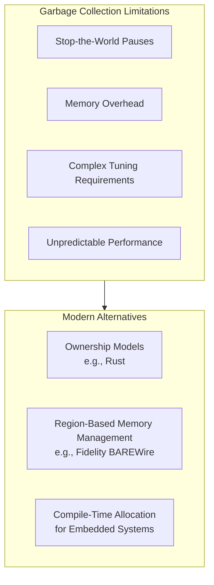

The computing landscape has undergone seismic shifts over the past three decades, yet many of our foundational software platforms remain anchored to paradigms established during a vastly different technological era. Virtual machines and managed runtime environments like Java's JVM and .NET's CLR emerged during the late 1990s and early 2000s as solutions to very specific problems of that time: platform independence, memory safety, and simplified development in an era of relatively homogeneous computing resources.

Today, we face a different set of challenges. The explosion of heterogeneous computing architectures, accelerator-based workloads, and the demand for computational efficiency has exposed the limitations of these legacy approaches. This paper examines how virtual machines and managed runtimes have become vestigial structures in our computing ecosystem, technological appendages that once served crucial functions but now increasingly impede progress in a world of specialized computing.

## The Historical Context: Why Virtual Machines Emerged

### The Monopoly-Era Origins of Managed Runtimes

The rise of virtual machines and managed runtimes was inextricably linked to the technology landscape of the late 1990s. Microsoft's dominance in the operating system market, combined with the U.S. Department of Justice's antitrust case, created the corporate imperative to develop .NET as a strategic response to Java. As noted in "The Early History of F#," Microsoft's development of a new programmability platform started in 1997, initially called COM+ 2.0 or Lightning, and eventually became .NET:

"In 1997, Microsoft changed tack and started the internal development of a new programmability platform which could address the fundamental challenge of Java, while also addressing the needs specific to Windows programmability." (Syme, 2020)

This platform was explicitly designed as a multi-language runtime rather than a single language, with founding principles including bytecode, garbage collection, JIT compilation, and "middleware" features. These technical decisions were made in response to the competitive and legal pressures of that era, not based purely on technical merit.

Similarly, Java emerged as Sun Microsystems' attempt to create platform independence in a Windows-dominated market. Both platforms represented corporate strategies as much as technical innovations.

### The Technical Limitations of the Era

The architectural choices of virtual machines reflected the hardware limitations of the late 1990s and early 2000s:

1. **Homogeneous Computing**: Before the rise of specialized accelerators and heterogeneous computing, most applications ran on general-purpose CPUs with similar instruction sets.

2. **Limited Memory Capacity**: Garbage collection made sense in an era when manual memory management was error-prone and before the advent of modern type systems that could provide memory safety without runtime overhead.

3. **Single-Core Dominance**: The Global Interpreter Lock (GIL) in languages like Python was less problematic when most computers had only one processing core.

4. **Limited Network Connectivity**: Virtual machines provided isolation and security in environments where applications typically ran on disconnected clients.

## The Changed Computing Landscape

### The Acceleration Revolution

The biggest shift in computing over the past decade has been the rise of specialized accelerators, particularly GPUs, but also FPGAs, TPUs, and domain-specific AI chips. This shift has moved the computation paradigm from homogeneous to heterogeneous computing.

The current dominance of CUDA in GPU computing exemplifies this shift. As documented in recent analyses, the computation landscape is increasingly defined by accelerator-specific programming models that bypass traditional virtual machines entirely:

"CUDA is a proprietary parallel computing programming model for Nvidia GPUs. With the proliferation over the past decade of GPU usage for speeding up applications across HPC, AI and beyond... CUDA's proprietary and closed-source nature has left many scientific research facilities, AI startups and enterprises struggling with their dependency on the programming model." The concerted development tracks of OpenCL, AMD's ROCm, Intel's oneAPI, and the new Unified Acceleration Foundation (UXL) as alternatives to CUDA further demonstrates the tacit acceptance that virtual machines are simply ill-suited to the demands of accelerator-based computation, and aren't even part of the conversation.

### The Efficiency Imperative

Modern computing faces severe constraints that were less relevant in the early days of virtual machines:

1. **Energy Efficiency**: Data centers and edge devices must maximize computation per watt, making the overhead of virtual machines increasingly untenable.

2. **Memory Constraints**: Despite larger memory capacities, the explosion of data and model sizes means that memory efficiency remains crucial.

3. **Real-Time Requirements**: Applications from autonomous vehicles to financial trading have strict latency requirements that virtual machines struggle to meet consistently.

As SpeakEZ Research noted in their analysis of the Fidelity Framework:

"By focusing on inference optimization through compile-time verification and Clef's inherent type safety, SpeakEZ addresses the emerging challenges in test-time compute." (SpeakEZ Research, 2024)

This focus on compile-time verification rather than runtime checking shifts how we approach computational efficiency.

## Native Compilation: The Modern Approach

### The Rust/Go Revolution

The emergence of languages like Rust and Go in the 2010s marked a significant turning point. Both languages specifically rejected the virtual machine approach in favor of native compilation, while still providing memory safety and high-level abstractions:

> "Programming had become too difficult and the choice of languages was partly to blame. One had to choose either efficient compilation, efficient execution, or ease of programming; all three were not available in the same mainstream language." (Go FAQ, 2024)

Go's documentation explicitly emphasizes this departure from virtual machines:

> "It is important to understand, however, that Go's runtime does not include a virtual machine, such as is provided by the Java runtime. Go programs are compiled ahead of time to native machine code." (Go FAQ, 2024)

Similarly, Rust's compilation model uses LLVM to generate highly optimized native code without runtime overhead:

> "The code generation stage is when higher-level representations of source are turned into an executable binary. Since rustc uses LLVM for code generation, the first step is to convert the MIR to LLVM-IR." (Rust Compiler Development Guide, 2024)

These languages demonstrate that memory safety, productivity, and performance can be achieved without the overhead of a virtual machine.

### The Rise of Cross-Paradigm Native Compilation

Our Fidelity Framework extends beyond the Rust/Go approach. We are designing a compilation pipeline around the functional-first language Clef that will generate native code across the computing spectrum while keeping compile-time correctness checks and "zero-cost" abstractions. The pipeline translates operations and memory into Multi-Level Intermediate Representation (MLIR), then to LLVM, to provide a progressive compilation pathway that can target multiple hardware architectures without sacrificing performance.

## Limitations of Virtual Machines in Modern Computing

### The Parallelism Problem

One limitation of virtual machines in modern computing is their struggle with parallelism. This issue is exemplified by Python's Global Interpreter Lock (GIL), which remains a constraint despite decades of attempts to remove it.

### Memory Management with Modern Tooling

Garbage collection, once seen as a major advance in programmer productivity, has become increasingly problematic in performance-critical and resource-constrained environments:



Alternative approaches like Rust's ownership model or our BAREWire provide memory safety without garbage collection overhead. BAREWire is a type-safe protocol for memory management, serialization, and messaging, a "binary interlock" for systems programming. It is conceptually similar to Cap'n Proto or Flatbuffers, integrated directly with the type system and compilation pipeline.

### The Accelerator Integration Challenge

Another reason to move beyond virtual machines is their mismatch with modern accelerator architectures. The leading AI and high-performance computing frameworks bypass virtual machines entirely in favor of direct, native code execution. The AI industry is shifting how computational resources are allocated and optimized. While the last decade saw rapid advances through massive pre-training efforts on repurposed GPUs, we are now entering an era where test-time compute (TTC) and custom accelerators are emerging as the next frontier of AI advancement.

## The Path Forward: Unified Compilation for Heterogeneous Computing

### The Fidelity Model: Adapting to Platform Constraints

Our Fidelity Framework takes an approach to cross-platform development that adapts to the constraints of each target platform without requiring a virtual machine. Unlike many cross-platform frameworks that rely on conditional compilation or runtime detection, the framework uses functional composition for platform adaptation. This approach is designed to let the same source code compile natively for different targets, from embedded systems to server environments, without the overhead of a runtime:

```clef
// Base configuration
let base' = {
    Platform = PlatformType.Desktop
    MemoryModel = MemoryModelType.Abundant
    VectorCapabilities = VectorCapabilities.Standard
    AlignmentRequirements = AlignmentRequirements.Natural
    HeapStrategy = HeapStrategyType.PerProcessGC
    OptimizationGoal = OptimizationGoalType.Balanced
}

// Embedded configuration
let embedded =
    compose
        [withPlatform PlatformType.Embedded;
         withMemoryModel MemoryModelType.Constrained;
         withVectorCapabilities VectorCapabilities.Minimal]
        base'
```

### Beyond Python: The Emergence of Native Alternatives

The limitations of Python for AI and high-performance computing have become increasingly apparent. The current dominant approach to AI model development, using dynamically typed frameworks like PyTorch, presents structural limitations to this pivot that become increasingly apparent as the AI landscape moves to a test-time compute paradigm. This has led to the emergence of alternative approaches that either compile Python to more efficient representations or replace it with languages better suited to native compilation and heterogeneous computing.

### Accelerator Orchestration: The Future of Heterogeneous Computing

One direction for the future of computing lies in orchestration frameworks that can efficiently manage heterogeneous accelerators. The BitNet Orchestration architecture consists of three primary components: a Lightweight Router Model, Specialist Experts, and an Orchestration Layer. This approach allows for dynamic allocation of computational resources based on the specific requirements of each task, without the overhead of a virtual machine.

## Even Microsoft Signals a Shift Away from Runtimes

One telling indication of this shift comes from Microsoft itself, a company whose fortunes have been deeply intertwined with runtime environments through its .NET platform. In a public statement in September 2022, Microsoft Azure CTO Mark Russinovich advocated for abandoning C and C++ in favor of Rust for new projects requiring a non-garbage-collected language:

> "It's time to halt starting any new projects in C/C++ and use Rust for those scenarios where a non-GC language is required. For the sake of security and reliability, the industry should declare those languages as deprecated."
> Mark Russinovich, The Register, 2022

This statement is particularly significant coming from a high-ranking Microsoft executive, as the company's core products like Windows and Office are largely written in C and C++. While Russinovich's comments were focused on systems programming rather than specifically addressing .NET, they signal Microsoft's recognition that memory safety without runtime overhead is the future direction for performance-critical software.

Microsoft's interest in Rust isn't merely theoretical. The company has been exploring Rust since at least 2019, with the Microsoft Security Response Center noting that

> "roughly 70 percent of the security issues that the MSRC assigns a CVE to are memory safety issues"
> DevClass, 2023.

This acknowledgment underscores the industry-wide recognition that native compilation with built-in safety features represents the future of systems programming.

## The End of the VM Era

The shift from homogeneous to heterogeneous computing, the need for efficiency in both energy and performance, and the rise of specialized accelerators all point to a future beyond the long-standing tenure of virtual machines.

Rust and Go already show that performance, developer productivity, and cross-platform compatibility are reachable without the overhead of a runtime. Our own Clef-based Fidelity Framework carries that work toward unified compilation architectures that generate native code for a wide range of target platforms.

That is the direction we will keep building toward as the work continues: native compilation for heterogeneous computing, and a toolchain that treats the target platform's constraints as its first concern.

## References

1. Syme, D. (2020). "The Early History of F#." Proceedings of the ACM on Programming Languages, 4, HOPL, Article 75. https://fsharp.org/history/hopl-final/hopl-fsharp.pdf

2. The Go Programming Language. (2024). "Frequently Asked Questions (FAQ)." https://go.dev/doc/faq

3. Rust Compiler Development Guide. (2024). "Overview of the compiler." https://rustc-dev-guide.rust-lang.org/overview.html
