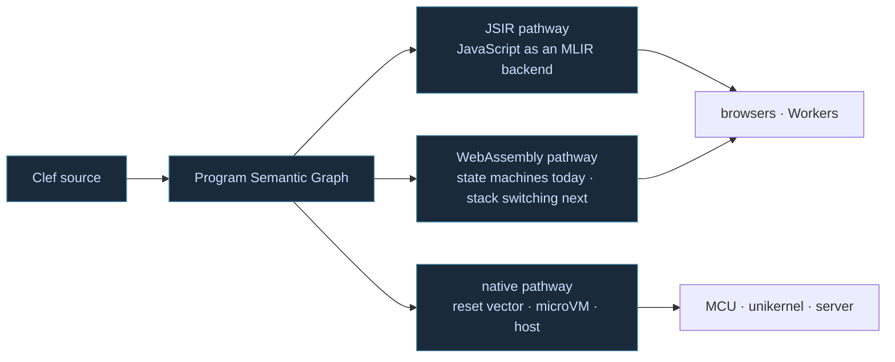
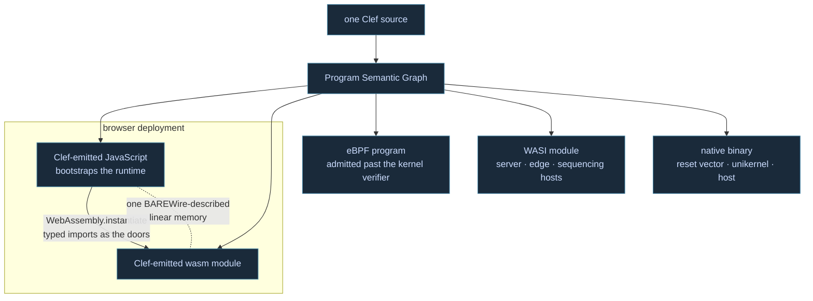

Picking a web stack usually means accepting a split world. There is the language a team actually builds in, and there is JavaScript, and between them sits a boundary where types stop meaning anything. Every ecosystem copes with that seam in its own way, and most of the coping amounts to code generation plus discipline: bindings kept current by hand, contracts asserted in comments, integration tests standing where a type checker should be.

We came at the web from the opposite shore. Fidelity was built native-first, toward [sealed images that enter at a reset vector]() and layouts the compiler settles completely before anything runs. So the question changes shape for us. Other stacks work hard to reach native from the browser. Ours started at the metal, and the web turns out to be the easier direction to travel. One compiler spine now carries two distinct pathways there.



## JavaScript as an Ordinary Backend

The first pathway is the one running in production now. The workers behind this site's search compile through the Fable pathway to JavaScript on Cloudflare's edge, actors and all. The design direction beyond it is stronger still: [JSIR makes JavaScript an ordinary MLIR backend](/docs/design/javascript-targeting/jsir-javascript-as-mlir-backend/), subject to the same passes as native targets, with [the foreign pair](/docs/design/javascript-targeting/the-foreign-pair/) keeping the boundary a checkpoint rather than a trap door and [constructed witnesses](/docs/design/javascript-targeting/constructed-witnesses/) checking what crosses it. The thread through all of it is that [bindings derive from what a library is](/docs/design/javascript-targeting/fully-informed-bindings/), never only from what its declarations admit, and BAREWire carries the layout contract across a boundary JavaScript's own type system does not survive. The [JavaScript Targeting](/docs/design/javascript-targeting/) section holds that story in full.

## WebAssembly Arrives on Home Turf

The second pathway needs less introduction precisely because it is the familiar one. A WebAssembly module is a sealed, statically typed artifact with a linear memory the compiler lays out completely. Strip the novelty away and that is a native target wearing a bytecode format, which is why our new [WebAssembly Targeting](/docs/design/wasm-targeting/) section is leaner than its JavaScript sibling. The machinery it needs is mostly machinery the framework already has.

What made this the moment to write it down is the stack-switching proposal. Its core design, typed continuations, adds delimited continuations with effect handlers to WebAssembly's own instruction set, and delimited continuations are the single form our concurrency already saturates to before emission. The standard is growing the exact shape our compiler holds. Until it lands, the hard-nosed decision is [coroutines versus stack switching](/docs/design/wasm-targeting/coroutine-versus-stack-switching/): compile the continuation away into a state machine that runs on every engine today, or preserve it for engines that can switch stacks. We honor LLVM as the core substrate for that lowering, and we give real runway to the WAMI dialect work out of CMU, the standing art that models the preserved form at the MLIR level. Behind WASI, the same module class reads as one more point on [the substrate range](/docs/internals/hardware/on-metal-extended/) our hardware section describes, which is exactly how we want the web to feel: another declared target, not another world.

## The Same Language on Both Sides

In the browser the two pathways compose rather than compete. The JavaScript our compiler emits is the host program: it bootstraps the WebAssembly runtime, instantiates the module our compiler also emitted, and hands it its imports, the typed doors the module is allowed to call back through. The two halves would share one BAREWire-described linear memory, so what crosses the seam is bytes at known offsets rather than serialized guesses. One source tree supplies both sides of the boundary, and the contract between them is checked where everything else is checked, in the compiler.

Here is the key no one else is holding. One Clef type is the layout authority:

```fsharp
type Tick = { Sym : SymbolId; Bid : float; Ask : float; Stamp : Micros }
// BAREWire derives: Sym @ 0, Bid @ 8, Ask @ 16, Stamp @ 24, size 32, align 8
 
```

And the same type would emit the host's half of the bridge, a view over the module's exported memory rather than a serializer:

```js
// generated from Tick; these offsets are the ones above, or the build fails
export const tickView = (mem, base) => ({
  get bid()   { return mem.getFloat64(base + 8,  true); },
  get ask()   { return mem.getFloat64(base + 16, true); },
  get stamp() { return mem.getBigUint64(base + 24, true); },
});

const { instance } = await WebAssembly.instantiateStreaming(fetch("feed.wasm"), imports);
const mem = new DataView(instance.exports.memory.buffer);  // cached once, deliberately
 
```

Experienced hands will have flinched at that cached `DataView`, because `memory.grow()` detaches the buffer beneath it, and a stale view is the classic wasm interop bug. The flinch is the point. Our modules carry the provisioned-envelope discipline into the browser: memory is sized when the module is built, growth is not part of the contract, and the cached view is sound by construction rather than by vigilance. The rest of the boundary is judged by what does not happen at it. The mainstream paths either copy, serde through `wasm-bindgen` materializing JavaScript objects on every crossing, or pay a wasm call per field through exported getters. This view does neither. Reading `bid` is a plain load from JavaScript against an offset fixed at compile time, the untouched fields stay where they are, and the `u64` timestamp arrives as the `BigInt` it honestly is rather than a quietly truncated `Number`. No serde derive, no `.d.ts` kept honest by hand, no protocol file in a third language. The record the module wrote is the record the host reads, in place, at offsets both sides learned from the same declaration.



The fan beneath the browser is the point. The same graph that pairs a JavaScript host with its wasm payload emits an eBPF object that passes the kernel's verifier, a WASI module for a server or an edge isolate, and a native binary that enters at a reset vector. That latitude, one source reaching the browser, the kernel, the system interface, and bare metal, is unparalleled in the software stack design space. Our target reach is part of the power we provide, without undue developer burden, carried in a coherent and well established language tradition.

## What Rides Along for Free

Riding one compiler spine to every backend is not an aesthetic preference. It is where the integrity story comes from. The checks that constrain a unikernel constrain a Worker bundle and a WebAssembly module the same way, because they run in the same middle end before any backend is chosen. Dimensional and unit content is discharged by parametricity, with nothing for the developer to prove. Layout is settled by construction and carried by BAREWire as the contract on both sides of every boundary, native to browser included. Where a stronger obligation is declared, the solver discharges it at design time, in the editor, before the artifact exists. None of that is a web feature we added. It is the native posture arriving at the web intact, and a team gets it without writing a single additional check.

On a shortlist, then, Clef stands as a peer to any framework a team would weigh for the web. The JavaScript pathway gives the ecosystem answer, and the WebAssembly pathway gives the native answer. What a shortlist rarely offers is both answers from one compiler with one set of checks, and that is the position we have been building toward from the reset vector up, [one platform declaration at a time]().

## Watching the Standard Arrive

The coroutine and stack-switching camps have spent years working out what suspension should mean on a stack machine, and that debate has now structured itself enough to draw hard boundaries around. The boundary is the useful part: what we target today, what we preserve for tomorrow, and the per-call-site choice between them that our graph already makes with full information. We find the convergence genuinely encouraging, and we will keep the comparison current as the proposal moves. The web did not have to meet us on native terms. It is choosing to, one instruction at a time.
