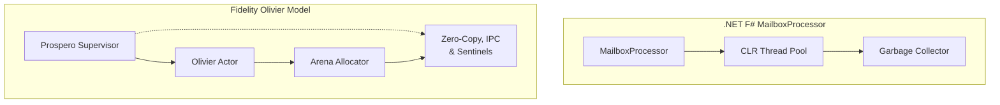

> This article was originally published on the
> [SpeakEZ Technologies blog](https://speakez.tech) as part of our early
> design work on the Fidelity Framework. It has been updated to reflect
> the Clef language naming and current project structure.

The story of distributed systems in F# begins with two distinct programming traditions that converge in F# in unique ways. From OCaml came the functional programming foundation and type system rigor. From Erlang came the `mailboxprocessor` and with it their ground-breaking approach to fault-tolerant distributed systems. And Don Syme's innovations that fused true concurrency into the primitives of a high-level programming languages was a revelation. What emerged in F# was neither a simple port nor a mere combination, but something distinctly new: a language that could express actor-based concurrency with type safety, integrate with existing ecosystems, and compile to multiple target platforms.

This convergence wasn't immediately obvious. When Don Syme first presented F# to Erlang developers [at the 2010 Erlang Factory conference in London](https://www.erlang-factory.com/conference/London2010/speakers/donsyme), he described it as "a pragmatic functional language which the Erlang programmer will find both familiar and foreign." That duality, familiar yet foreign, captures something essential about F#'s approach to actors. It borrowed wisdom from both traditions while creating space for innovations that neither OCaml nor Erlang had contemplated.

## The OCaml Foundation: More Than Just Syntax

F# began its life in 2002 as what was informally called "Caml for .NET", an attempt to bring OCaml's powerful ML-style functional programming to [Microsoft's new runtime](https://speakez.tech/blog/the-return-of-the-compiler/). But from the beginning, F# was more than just a transliteration of OCaml to a new platform. The language took OCaml's core strengths, its type inference, pattern matching, and functional-first philosophy, and enhanced them with features that would prove crucial for building sophisticated concurrent systems.

The divergences from OCaml were deliberate and thoughtful. Where OCaml required explicit type annotations in many contexts, F# pushed type inference further. Where OCaml used semicolons and explicit delimiters, F# adopted Python's significant whitespace, making the code cleaner and more approachable. These might seem like surface-level changes, but they reflected a deeper philosophy: F# would be pragmatic where OCaml was purist, accessible where OCaml was opinionated.

Beyond syntax, F# introduced semantic innovations that OCaml hadn't explored. Units of measure brought dimensional analysis to the type system, allowing developers to catch unit conversion errors at compile time. Computation expressions provided a general framework for defining domain-specific languages within F#, from async workflows to query expressions. These features weren't just additions; they were multiplicative enhancements that would later prove essential for expressing complex behaviors.

## The Critical Addition: MailboxProcessor as Language Primitive

Perhaps the most significant departure from OCaml was F#'s inclusion of the MailboxProcessor as a built-in language feature. This wasn't merely a library addition but a fundamental recognition that message-passing concurrency deserved first-class support. The MailboxProcessor brought Erlang's actor model directly into F#'s type-safe world:

```fsharp
type Message =
    | Increment of int
    | GetValue of AsyncReplyChannel<int>

let counter = MailboxProcessor.Start(fun inbox ->
    let rec loop value = async {
        let! msg = inbox.Receive()
        match msg with
        | Increment delta ->
            return! loop (value + delta)
        | GetValue channel ->
            channel.Reply value
            return! loop value
    }
    loop 0)
```

This simple primitive opened profound possibilities. Beyond Erlang's dynamically typed messages, F#'s discriminated unions provided compile-time guarantees about message protocols. And inside the confines of the traditional .NET threading models, the MailboxProcessor offered isolation and safety through message passing. It was a bridge between worlds, bringing actor-model thinking to developers who had never encountered Erlang while remaining familiar to those with distributed systems experience.

The inclusion of MailboxProcessor wasn't accidental. Don Syme's engagement with the Erlang community, including that 2010 presentation, demonstrates a deliberate connection between OCaml and Erlang ecosystems.

## The Fable Connection: OCaml's Web Legacy

There's another crucial thread in F#'s relationship with OCaml: the path to the web. Alfonso Garcia-Caro created [the Fable compiler](https://fable.io), and in later interviews he explicitly acknowledged the inspiration he took from js_of_ocaml (jsoo), OCaml's solution for compiling to JavaScript. However, where jsoo operated as a library extension within OCaml's ecosystem, Fable had to forge a fundamentally different path.

The challenge was architectural. F# was deeply entwined with the .NET runtime, its type system integrated with the Common Language Infrastructure. Simply translating F# to JavaScript the way jsoo translated OCaml wouldn't work. Fable needed to become a distinct compilation path, one that could understand the necessary superset of F# semantics at a deep level and regenerate them in type-safe way within the JavaScript ecosystem. An early "slug line" for Fable was "JavaScript you could be proud of" which pointed to its ability to place type 'hints' in JavaScript that increased its runtime safety over standard JS code.

The Fidelity.CloudEdge toolkit builds directly on this foundation. By leveraging Fable's JavaScript targeting, we will have a library to compile and deploy F# actors with lightweight JavaScript functions. The MailboxProcessor abstractions that developers write compile down to Workers and Queues, maintaining the actor model's semantics while embracing the platform's distribution capabilities.

This synthesis, OCaml's web compilation legacy through jsoo, Fable's reimagining for F#, and Fidelity.CloudEdge's platform integration, represents a unique convergence of functional programming traditions adapted for distinctly modern computing. At first glimpse it may seem strange to "re-converge" OCaml's and Erlang's influences in the Fidelity framework and the Fidelity.CloudEdge toolkit, but we hope the interested reader will follow us along what we consider a deeply rewarding path.

## Extending the Actor Vision

The [Fidelity Framework](/blog/fidelity-framework-primer/) represents a natural extension of F#'s actor model when unconstrained by the .NET SDK and runtime. By extending F#'s MailboxProcessor primitive, Fidelity introduces a complete actor system with supervision hierarchies, distributed message passing, and deterministic resource management.

Where F#'s standard MailboxProcessor operates within the CLR's managed environment, Fidelity's Olivier actor model compiles directly to native code. This isn't just an optimization; it's a philosophical shift. By operating beyond a managed runtime, Fidelity can provide guarantees about memory usage, execution timing, and resource consumption that would be incredibly challenging in managed runtime environments.



The Prospero supervision layer, detailed in our exploration of [RAII in Olivier and Prospero](https://speakez.tech/blog/raii-in-olivier-and-prospero/), brings Erlang-style supervision trees to F#. But unlike Erlang's process-per-actor model with isolated heaps, Prospero uses arena allocation within shared process memory. This design choice reflects modern hardware realities: cache coherence is sophisticated, memory is abundant, and the cost of message copying often exceeds the benefit of complete isolation.

```fsharp
module Olivier =
    type SupervisorStrategy =
        | OneForOne of maxRetries: int * withinTimeSpan: TimeSpan
        | AllForOne of maxRetries: int * withinTimeSpan: TimeSpan
        | RestForOne of maxRetries: int * withinTimeSpan: TimeSpan

    let supervise strategy children =
        // Arena allocated per supervision tree
        use arena = Arena.create (64 * 1024 * 1024) // 64MB

        let supervisor =
            Supervisor.create strategy arena
            |> Supervisor.withChildren children

        supervisor.Start()
```

Fidelity's design aspires to maintain compatibility with Akka.NET's cluster communication protocols. This wasn't an arbitrary choice. It's a recognition that real-world systems need "paved" paths to interoperate. Organizations with existing Akka.NET deployments will be able to gradually include Fidelity components where they show particular advantage. The [actor-oriented architecture](https://speakez.tech/blog/the-case-for-actor-oriented-architecture/) we advocate provides process-level protection without runtime overhead, a balance between isolation and native efficiency. We expect this awareness to grow significantly as "agentic systems" become the norm in enterprise environments.

## Actors at The Cloud's Edge

While Fidelity re-imagines actors for native execution, [Fidelity.CloudEdge](https://speakez.tech/proposals/cloudflare-fs-toolkit/) takes a different path, one that embraces the constraints and capabilities of edge computing. In Fidelity.CloudEdge, developers write standard F# MailboxProcessor-style actors, but the Fable compiler and Fidelity.CloudEdge toolkit transform these into compositions of Cloudflare's platform services. A Worker provides the execution context, a Queue provides the mailbox, and Cloudflare's global network provides the distribution mechanism, all transparently handled during compilation:

```fsharp
// Developer writes standard F# actor code
type OrderProcessor() =
    inherit MailboxProcessor<OrderMessage>()

    override this.Receive() = async {
        let! msg = this.Receive()
        match msg with
        | ProcessOrder order ->
            // Standard F# async workflow
            let! inventory = checkInventory order.items
            let! payment = processPayment order.payment
            this.Post(UpdateState OrderConfirmed)

        | CancelOrder id ->
            do! refundPayment id
            this.Post(UpdateState OrderCancelled)
    }

// Fidelity.CloudEdge compiles this to:
// - Worker with Queue binding for message handling
// - Durable Object for state management
// - Service bindings for actor communication
```

This model makes different trade-offs compared to Fidelity's native actor model. Where Fidelity provides fine-grained control over memory and execution, Fidelity.CloudEdge accepts platform constraints in exchange for global scale. A Fidelity.CloudEdge actor can handle a profuse number of messages per second across hundreds of edge locations and scale actors horizontally using standard Cloudflare management. The platform handles distribution and scaling and is responsive to faults via the Prospero supervision hierarchy.

The supervision model in Fidelity.CloudEdge is worth noting as unique from Akka and Fidelity. Where Fidelity provides inter-process supervision, Fidelity.CloudEdge is fully distributed on Cloudflares edge network with Durable Objects managing hierarchy state and coordination of workers:

```fsharp
// Fidelity.CloudEdge Supervisor actor
module Supervisor =
    type State = {
        ChildActors: Map<string, ActorRef>
        RestartSchedule: Map<string, DateTime>
    }

    let handleMessage (state: State) = function
        | RegisterChild (name, actorRef) ->
            { state with ChildActors = Map.add name actorRef state.ChildActors }

        | ChildFailed (name, error) ->
            match Map.tryFind name state.ChildActors with
            | Some ref ->
                // Schedule restart through platform retry
                let restartTime = DateTime.UtcNow.AddSeconds(5.0)
                { state with RestartSchedule = Map.add name restartTime state.RestartSchedule }
            | None -> state

        | CheckRestarts ->
            // Platform handles actual restarts via Queue retry mechanism
            state
```

An edge-to-native opportunity **also** exists between Fidelity and Fidelity.CloudEdge through Cloudflare's Container support. As explored in our vision for [distributed intelligence](https://speakez.tech/proposals/distributed-intelligence/), our future design for Fidelity-compiled unikernels would be able to run within Cloudflare's Container infrastructure, bringing native performance to edge computing. This creates a unique hybrid: Fidelity.CloudEdge actors for coordination and integration, Fidelity unikernels for compute-intensive operations. The opportunities for a completely new distributed global solution, ***without* Kubernetes**, is a ripe opportunity we're excited to explore with our customers.

## The F* Connection: Proofs Through Shared Heritage

The story of F#'s OCaml influence in the Fidelity framework extends to *also* encompass formal verification. Here, the shared OCaml heritage between F# and F* becomes crucial. F* (pronounced F-star) isn't just another ML variant but a proof-oriented language with an extensive pedigree in critical systems verification. Its syntax and semantics are close enough to F# that [verification can be seamlessly integrated](/docs/design/verifying-clef/) into the development process, and the artifacts it produces can support rigorous verification with global certification labs.

This integration isn't superficial. Because F# and F* share their OCaml lineage, this verification capability integrates smoothly through our carefully crafted [proof-aware compilation](/docs/design/proof-aware-compilation/) pipeline.

> Verification properties aren't just checked; **they *guide* optimization**.

When the compiler knows that certain message orderings are impossible, it can eliminate defensive code. When it proves that an actor never exceeds certain memory bounds, it can optimize memory strategies to improve speed. There are many optimizations that can be brought to bear to both improve execution efficiency, memory safety, and support a smooth developer experience.

## Erlang Lessons, F# Innovations

The influence of Erlang on our actor implementations beyond the `mailboxprocessor` runs deep, and ***not*** uncritically. As examined in our analysis of [Erlang lessons in Fidelity](https://speakez.tech/blog/ode-to-erlang---lessons-from-fez/), we've embraced several of Erlang's opinions while adapting our technical approach to modern technology.

Erlang's "let it crash" philosophy appears in both Fidelity and Fidelity.CloudEdge but with type-safe refinements. Where Erlang relies on dynamic pattern matching to handle failures, F# uses exhaustive pattern matching with compile-time verification:

```fsharp
type FailureDirective =
    | Restart
    | Stop
    | Escalate

let decideFailureAction (error: exn) : FailureDirective =
    match error with
    | :? TransientException -> Restart
    | :? ConfigurationException -> Stop
    | _ -> Escalate
    // Compiler ensures all cases handled
```

The supervision hierarchy concept transfers but with architectural adaptations. Erlang's isolated process model made sense for 1980s hardware where memory protection was expensive. Modern systems offer different trade-offs. Fidelity's Olivier actor model, with Prospero's sentinels and arena allocation provides similar fault isolation with better cache utilization. Fidelity.CloudEdge's platform-managed distribution offers global scale without direct process marshaling.

Perhaps most significantly, our actor implementations benefit from decades of evolution in type theory and compiler technology. Where Erlang must check message types at runtime, F# verifies them at compile time. Where Erlang's hot code reloading requires careful coordination, F#'s immutable actors enable blue-green deployments. Where Erlang's distribution requires EPMD and careful network configuration, Fidelity.CloudEdge leverages Cloudflare's global infrastructure resiliency.

## The Agentic Future: Actors for AI

The convergence of this principled adaptation with AI agents represents the next evolution. As explored in our piece on [actors taking center stage](https://speakez.tech/blog/actors-take-center-stage/), the patterns that Erlang pioneered for telecom systems are precisely what modern AI systems need today and in the future.

A well designed AI agent is fundamentally an actor: it maintains state, processes messages (prompts), and interacts with other agents (tools, knowledge bases, other inference sources). The supervision hierarchies that Erlang pioneered to manage telecom switches can deftly orchestrate multi-agent AI systems. The fault tolerance that kept phone networks running for decades will also serve to ensure AI services will operate with high performance and reliability.

```fsharp
type AIAgentMessage =
    | Query of prompt: string * reply: AsyncReplyChannel<Response>
    | UpdateKnowledge of facts: KnowledgeGraph
    | Collaborate of agent: AgentRef * task: Task

type AIAgent() =
    inherit Actor<AIAgentMessage>()

    let knowledgeBase = KnowledgeGraph.create()
    let collaborators = ResizeArray<AgentRef>()

    override this.Receive(msg) = async {
        match msg with
        | Query(prompt, reply) ->
            let! response = this.Reason prompt knowledgeBase
            reply.Reply response

        | UpdateKnowledge facts ->
            knowledgeBase.Merge facts

        | Collaborate(agent, task) ->
            collaborators.Add agent
            let! result = this.CollaborateOn task agent
            return result
    }
```

This is more than hype. This is the nature of emerging practice based on proven technologies. The patterns we're implementing in Fidelity and Fidelity.CloudEdge directly support agentic architectures. The type safety ensures agents communicate correctly. The supervision hierarchies manage agent lifecycles. The distribution mechanisms enable globally distributed systems with millisecond timing.

## Practical Convergence: Theory Meets Implementation

The elegance of actor models matters only when it translates to practical benefits. Though our designs and conversations with customers we're seeing several convergence patterns:

First, the hybrid architecture where Fidelity.CloudEdge provides the coordination layer while Fidelity handles compute-intensive operations is a powerful design choice. A Fidelity.CloudEdge supervisor actor might orchestrate dozens of Fidelity-compiled workers running in containers. The supervisor handles routing, load balancing, and fault recovery while the workers perform specialized computations.

Second, the ability to verify actor interactions through F* is reshaping how we think about distributed system correctness. Instead of hoping our message protocols are correct, we prove the memory patterns are efficient and inherently safe. Instead of testing for race conditions, we prove they cannot occur. This is beyond any academic exercise that demonstrates practical engineering designed to reduce production incidents.

Third, the economic model enabled by actor-based architectures is compelling. Fidelity.CloudEdge actors scale "to zero" and automatically extend with load. Utilization is charged for actual message processing with proven, responsive scaling control that Cloudflare has honed over a near decade of global production use. Fidelity unikernal actors can run with minimal resource overhead, allowing dense deployment. Together, they underscore a hyper-efficient cost model that recasts previously uneconomical applications, making them compelling both in terms of speed and operational integrity.

## The Synthesis of Traditions

The journey from OCaml's functional elegance with Erlang's actor pragmatism in F#'s sophisticated implementations in Fidelity and Fidelity.CloudEdge represents more than technical evolution. It demonstrates how programming traditions and modern technologies can converge to create something genuinely new.

F# didn't simply adopt the MailboxProcessor; it reimagined it with type safety. Fidelity didn't just implement actors; it imagines compiling them to native code with deterministic resource management. Fidelity.CloudEdge doesn't simply build actors piece by piece; it envisions a clear development model that provides seamless global deployment. Each step is built on previous insights while adding new capabilities.

As the world faces 'agentic' challenges with AI orchestration, the patterns established by OCaml and Erlang, refined through F#, and implemented in Fidelity and Fidelity.CloudEdge, provide a foundation for solutions the marketplace is only beginning to imagine.

Erlang pioneered the actor model for telephone switches in the 1980s. OCaml championed type safety and functional design patterns in the same era. Don Syme synthesized those precepts through F#'s pragmatic design in the 2000s, and has led to actor systems design for 2030 and beyond. More than technological progress, this is the convergent evolution of transformative ideas whose ***next*** moment has arrived.
