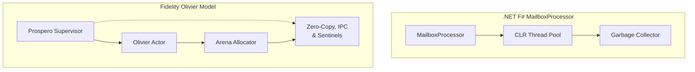

The story of distributed systems in F# begins with two distinct programming traditions that converge in F# in unique ways. From OCaml came the functional programming foundation and type system rigor. From Erlang came the `mailboxprocessor` and with it an approach to fault-tolerant distributed systems. Don Syme's work fused concurrency into the primitives of a high-level programming language. What emerged in F# was a language that could express actor-based concurrency with type safety, integrate with existing ecosystems, and compile to multiple target platforms.

This convergence wasn't immediately obvious. When Don Syme first presented F# to Erlang developers [at the 2010 Erlang Factory conference in London](https://www.erlang-factory.com/conference/London2010/speakers/donsyme), he described it as "a pragmatic functional language which the Erlang programmer will find both familiar and foreign." That duality, familiar yet foreign, captures something essential about F#'s approach to actors. It borrowed wisdom from both traditions while creating space for innovations that neither OCaml nor Erlang had contemplated.

## The OCaml Foundation: More Than Just Syntax

F# began its life in 2002 as what was informally called "Caml for .NET", an attempt to bring OCaml's ML-style functional programming to [Microsoft's new runtime](https://speakez.tech/blog/the-return-of-the-compiler/). But from the beginning, F# was more than a transliteration of OCaml to a new platform. The language took OCaml's core strengths, its type inference, pattern matching, and functional-first philosophy, and enhanced them with features that would prove essential for building concurrent systems.

The divergences from OCaml were deliberate and thoughtful. Where OCaml required explicit type annotations in many contexts, F# pushed type inference further. Where OCaml used semicolons and explicit delimiters, F# adopted Python's significant whitespace, making the code cleaner and more approachable. These might seem like surface-level changes, but they reflected a deeper philosophy: F# would be pragmatic where OCaml was purist, accessible where OCaml was opinionated.

Beyond syntax, F# introduced semantic innovations that OCaml hadn't explored. Units of measure brought dimensional analysis to the type system, allowing developers to catch unit conversion errors at compile time. Computation expressions provided a general framework for defining domain-specific languages within F#, from async workflows to query expressions. These features would later prove essential for expressing complex behaviors.

## The Critical Addition: MailboxProcessor in the Core Library

Perhaps the most significant departure from OCaml was F#'s inclusion of the MailboxProcessor in its core library, FSharp.Core. Shipping it with the language gave message-passing concurrency a first-class, type-safe form that OCaml's standard distribution had no equivalent for. The MailboxProcessor brought Erlang's actor model directly into F#'s type-safe world:

```fsharp
type Message =
    | Increment of int
    | GetValue of AsyncReplyChannel<int>

let counter = MailboxProcessor.Start(fun inbox ->
    let rec loop value = async {
        let! msg = inbox.Receive()
        match msg with
        | Increment delta ->
            return! loop (value + delta)
        | GetValue channel ->
            channel.Reply value
            return! loop value
    }
    loop 0)
```

This primitive opened a range of possibilities. Beyond Erlang's dynamically typed messages, F#'s discriminated unions provided compile-time guarantees about message protocols. Inside the confines of the traditional .NET threading models, the MailboxProcessor offered isolation and safety through message passing. It was a bridge between worlds, bringing actor-model thinking to developers who had never encountered Erlang while remaining familiar to those with distributed systems experience.

The inclusion of MailboxProcessor wasn't accidental. Don Syme's engagement with the Erlang community, including that 2010 presentation, demonstrates a deliberate connection between OCaml and Erlang ecosystems.

## The Fable Connection: OCaml's Web Legacy

There's another thread in F#'s relationship with OCaml: the path to the web. Alfonso Garcia-Caro created [the Fable compiler](https://fable.io), and in later interviews he explicitly acknowledged the inspiration he took from js_of_ocaml (jsoo), OCaml's solution for compiling to JavaScript. Where jsoo operated as a library extension within OCaml's ecosystem, Fable forged a different path.

The challenge was architectural. F# was deeply entwined with the .NET runtime, its type system integrated with the Common Language Infrastructure. Translating F# to JavaScript the way jsoo translated OCaml wouldn't work. Fable needed to become a distinct compilation path, one that could understand the necessary superset of F# semantics at a deep level and regenerate them in type-safe way within the JavaScript ecosystem. An early "slug line" for Fable was "JavaScript you could be proud of" which pointed to its ability to place type 'hints' in JavaScript that increased its runtime safety over standard JS code.

Our Fidelity.CloudEdge toolkit builds directly on this foundation. By leveraging Fable's JavaScript targeting, we intend a library to compile and deploy F# actors as lightweight JavaScript functions. The MailboxProcessor abstractions that developers write would compile down to Workers and Queues, maintaining the actor model's semantics while taking up the platform's distribution capabilities.

This synthesis draws OCaml's web compilation legacy through jsoo, Fable's reimagining for F#, and our Fidelity.CloudEdge platform integration into one convergence of functional programming traditions adapted for modern computing. At first glimpse it may seem strange to "re-converge" OCaml's and Erlang's influences in our Fidelity framework and CloudEdge toolkit, but we hope the interested reader will follow us along a path we consider rewarding.

## Extending the Actor Vision

Our [Fidelity Framework](/blog/fidelity-framework-primer/) extends F#'s actor model when unconstrained by the .NET SDK and runtime. By building on the MailboxProcessor model, the framework introduces an actor system with the potential for supervision hierarchies, distributed message passing, and deterministic resource management.

Where F#'s standard MailboxProcessor operates within the CLR's managed environment, our Olivier actor model is designed to compile directly to native code. By operating outside a managed runtime, the framework can provide guarantees about memory usage, execution timing, and resource consumption that would be difficult to reach in managed runtime environments.


```mermaid
graph TD
    subgraph ".NET F# MailboxProcessor"
        MP[MailboxProcessor] --> CLR[CLR Thread Pool]
        CLR --> GC[Garbage Collector]
    end

    subgraph "Fidelity Olivier Model"
        Actor[Olivier Actor] --> Arena[Arena Allocator]
        Supervisor[Prospero Supervisor] --> Actor
        Supervisor -.-> Native[Zero-Copy, IPC<br>& Sentinels]
        Arena --> Native
    end
```

Our Prospero supervision layer, detailed in our exploration of [RAII in Olivier and Prospero](https://speakez.tech/blog/raii-in-olivier-and-prospero/), is designed to bring Erlang-style supervision trees to F#. Where Erlang's process-per-actor model gives each actor an isolated heap, Prospero uses arena allocation within shared process memory. This design choice reflects modern hardware realities: cache coherence has advanced, memory is abundant, and the cost of message copying often exceeds the benefit of complete isolation.

```fsharp
module Olivier =
    type SupervisorStrategy =
        | OneForOne of maxRetries: int * withinTimeSpan: TimeSpan
        | AllForOne of maxRetries: int * withinTimeSpan: TimeSpan
        | RestForOne of maxRetries: int * withinTimeSpan: TimeSpan

    let supervise strategy children =
        // Arena allocated per supervision tree
        use arena = Arena.create (64 * 1024 * 1024) // 64MB

        let supervisor =
            Supervisor.create strategy arena
            |> Supervisor.withChildren children

        supervisor.Start()
```

Our framework's design aspires to maintain compatibility with Akka.NET's cluster communication protocols, because real-world systems need "paved" paths to interoperate. Organizations with existing Akka.NET deployments would be able to gradually include Fidelity components where they show particular advantage. The [actor-oriented architecture](https://speakez.tech/blog/the-case-for-actor-oriented-architecture/) we advocate is designed to provide process-level protection without runtime overhead, a balance between isolation and native efficiency. We expect this awareness to grow as "agentic systems" become the norm in enterprise environments.

## Actors at The Cloud's Edge

While our Fidelity framework re-imagines actors for native execution, [Fidelity.CloudEdge](https://speakez.tech/proposals/cloudflare-fs-toolkit/) takes a different path, one shaped by the constraints and capabilities of edge computing. In our CloudEdge design, developers write standard F# MailboxProcessor-style actors, and the Fable compiler and CloudEdge toolkit would transform these into compositions of Cloudflare's platform services. A Worker provides the execution context, a Queue provides the mailbox, and Cloudflare's global network provides the distribution mechanism, all handled during compilation:

```fsharp
// Developer writes standard F# actor code
type OrderProcessor() =
    inherit MailboxProcessor<OrderMessage>()

    override this.Receive() = async {
        let! msg = this.Receive()
        match msg with
        | ProcessOrder order ->
            // Standard F# async workflow
            let! inventory = checkInventory order.items
            let! payment = processPayment order.payment
            this.Post(UpdateState OrderConfirmed)

        | CancelOrder id ->
            do! refundPayment id
            this.Post(UpdateState OrderCancelled)
    }

// Fidelity.CloudEdge compiles this to:
// - Worker with Queue binding for message handling
// - Durable Object for state management
// - Service bindings for actor communication
```

This model makes different trade-offs than our native actor model. Where the native model provides fine-grained control over memory and execution, our CloudEdge design accepts platform constraints in exchange for global scale. A CloudEdge actor would handle a high volume of messages per second across hundreds of edge locations and scale horizontally using standard Cloudflare management. The platform handles distribution and scaling, and we design fault response to route through our Prospero supervision hierarchy.

The supervision model in our CloudEdge design differs from both Akka and the native Fidelity model. Where the native model provides inter-process supervision, CloudEdge would distribute fully across Cloudflare's edge network, with Durable Objects managing hierarchy state and coordinating workers:

```fsharp
// Fidelity.CloudEdge Supervisor actor
module Supervisor =
    type State = {
        ChildActors: Map<string, ActorRef>
        RestartSchedule: Map<string, DateTime>
    }

    let handleMessage (state: State) = function
        | RegisterChild (name, actorRef) ->
            { state with ChildActors = Map.add name actorRef state.ChildActors }

        | ChildFailed (name, error) ->
            match Map.tryFind name state.ChildActors with
            | Some ref ->
                // Schedule restart through platform retry
                let restartTime = DateTime.UtcNow.AddSeconds(5.0)
                { state with RestartSchedule = Map.add name restartTime state.RestartSchedule }
            | None -> state

        | CheckRestarts ->
            // Platform handles actual restarts via Queue retry mechanism
            state
```

An edge-to-native path also runs between our Fidelity framework and CloudEdge design through Cloudflare's Container support. As explored in our vision for [distributed intelligence](https://speakez.tech/proposals/distributed-intelligence/), our future design for Fidelity-compiled unikernels would run within Cloudflare's Container infrastructure, bringing native performance to edge computing. This forms a hybrid: CloudEdge actors for coordination and integration, Fidelity unikernels for compute-intensive operations. A distributed global deployment that runs without Kubernetes is a direction we intend to explore with our customers.

## The F* Connection: Proofs Through Shared Heritage

The story of F#'s OCaml influence in our Fidelity framework extends to formal verification. Here, the shared OCaml heritage between F# and F* matters. F* (pronounced F-star) is a proof-oriented language with an extensive pedigree in critical systems verification. Its syntax and semantics are close enough to F# that [verification can be integrated](/docs/internals/verification/) into the development process, and the artifacts it produces can support verification with global certification labs.

Because F# and F* share their OCaml lineage, this verification capability integrates through our [proof-aware compilation](/docs/internals/pipeline/proof-aware-compilation/) pipeline.

> Verification properties guide optimization, not only correctness checks.

When the compiler knows that certain message orderings are impossible, it can eliminate defensive code. When it proves that an actor never exceeds certain memory bounds, it can adjust memory strategies to improve speed. Many such optimizations can improve execution efficiency and memory safety while supporting the developer experience.

## Erlang Lessons, F# Innovations

The influence of Erlang on our actor implementations beyond the `mailboxprocessor` runs deep, and we have weighed it critically. As examined in our analysis of [Erlang lessons in Fidelity](https://speakez.tech/blog/ode-to-erlang---lessons-from-fez/), we have taken up several of Erlang's positions while adapting our technical approach to modern technology.

Erlang's "let it crash" philosophy appears in both Fidelity and Fidelity.CloudEdge but with type-safe refinements. Where Erlang relies on dynamic pattern matching to handle failures, F# uses exhaustive pattern matching with compile-time verification:

```fsharp
type FailureDirective =
    | Restart
    | Stop
    | Escalate

let decideFailureAction (error: exn) : FailureDirective =
    match error with
    | :? TransientException -> Restart
    | :? ConfigurationException -> Stop
    | _ -> Escalate
    // Compiler ensures all cases handled
```

The supervision hierarchy concept transfers, with architectural adaptations. Erlang's isolated process model made sense for 1980s hardware where memory protection was expensive. Modern systems offer different trade-offs. Our Olivier actor model, with Prospero's sentinels and arena allocation, is designed to provide similar fault isolation with better cache utilization. Our CloudEdge design uses platform-managed distribution to reach global scale without direct process marshaling.

Perhaps most significantly, our actor implementations benefit from decades of evolution in type theory and compiler technology. Where Erlang must check message types at runtime, F# verifies them at compile time. Where Erlang's hot code reloading requires careful coordination, F#'s immutable actors enable blue-green deployments. Where Erlang's distribution requires EPMD and careful network configuration, Fidelity.CloudEdge leverages Cloudflare's global infrastructure resiliency.

## The Agentic Future: Actors for AI

This principled adaptation carries over to AI agents. As explored in our piece on [actors taking center stage](https://speakez.tech/blog/actors-take-center-stage/), the patterns that Erlang pioneered for telecom systems map onto what modern AI systems need.

A well designed AI agent works as an actor: it maintains state, processes messages (prompts), and interacts with other agents (tools, knowledge bases, other inference sources). The supervision hierarchies that Erlang pioneered to manage telecom switches can orchestrate multi-agent AI systems. The fault tolerance that kept phone networks running for decades can serve AI services that need to operate with high performance and reliability.

```fsharp
type AIAgentMessage =
    | Query of prompt: string * reply: AsyncReplyChannel<Response>
    | UpdateKnowledge of facts: KnowledgeGraph
    | Collaborate of agent: AgentRef * task: Task

type AIAgent() =
    inherit Actor<AIAgentMessage>()

    let knowledgeBase = KnowledgeGraph.create()
    let collaborators = ResizeArray<AgentRef>()

    override this.Receive(msg) = async {
        match msg with
        | Query(prompt, reply) ->
            let! response = this.Reason prompt knowledgeBase
            reply.Reply response

        | UpdateKnowledge facts ->
            knowledgeBase.Merge facts

        | Collaborate(agent, task) ->
            collaborators.Add agent
            let! result = this.CollaborateOn task agent
            return result
    }
```

These are emerging practices built on proven technologies. The patterns we are designing into our Fidelity framework and CloudEdge toolkit are meant to support agentic architectures. The type safety holds agents to a correct communication protocol. The supervision hierarchies manage agent lifecycles. The distribution mechanisms are designed to carry globally distributed systems with millisecond timing.

## Practical Convergence: Theory Meets Implementation

Actor models matter when they translate to practical benefits. Through our designs and conversations with customers we are seeing several convergence patterns.

First, a hybrid architecture pairs our CloudEdge coordination layer with a native framework that handles compute-intensive operations. A CloudEdge supervisor actor might orchestrate dozens of Fidelity-compiled workers running in containers. The supervisor handles routing, load balancing, and fault recovery while the workers perform specialized computations.

Second, the ability to verify actor interactions through F* reshapes how we think about distributed system correctness. Rather than hoping our message protocols are correct, we aim to prove the memory patterns are safe. Rather than testing for race conditions, we aim to prove they cannot occur. The intent is practical engineering that reduces production incidents.

Third, actor-based architectures open up a new economic model. Our CloudEdge actors would scale "to zero" and extend with load. Cloudflare charges for actual message processing through scaling controls it has honed over nearly a decade of global production use. Fidelity unikernel actors can run with minimal resource overhead, allowing dense deployment. Together, they point to a cost model that recasts previously uneconomical applications in terms of both speed and operational integrity.

## The Synthesis of Traditions

The path from OCaml's functional design and Erlang's actor pragmatism, through F#'s implementations, into our Fidelity framework and CloudEdge toolkit traces a line of convergence across programming traditions and modern technologies.

F# adopted the MailboxProcessor and reimagined it with type safety. Our Fidelity framework is designed to compile actors to native code with deterministic resource management. Our CloudEdge design aims at a development model that carries global deployment. Each step builds on previous insights while adding new capabilities.

As the field takes on agentic challenges in AI orchestration, the patterns established by OCaml and Erlang, refined through F#, and carried into our Fidelity framework and CloudEdge toolkit, give us a foundation to build on.

Erlang pioneered the actor model for telephone switches in the 1980s. OCaml championed type safety and functional design patterns in the same era. Don Syme synthesized those precepts through F#'s pragmatic design in the 2000s. We intend to carry that lineage forward into actor systems design for 2030 and beyond, and we will keep building toward it as the rest of the framework comes into place.
