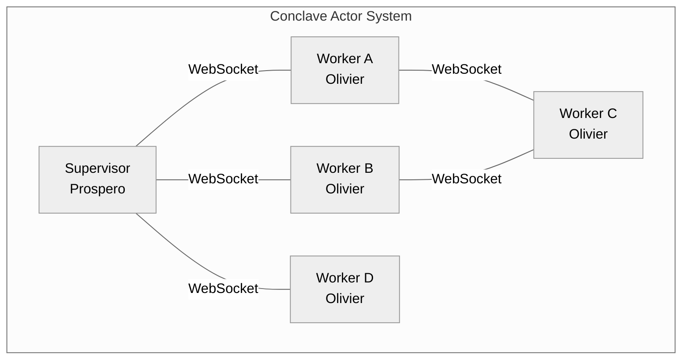
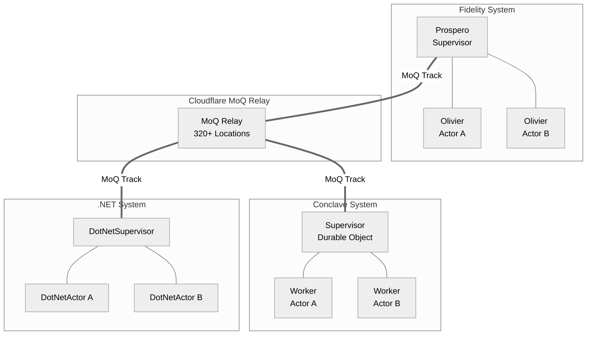

> This article was originally published on the
> [SpeakEZ Technologies blog](https://speakez.tech) as part of our early
> design work on the Fidelity Framework. It has been updated to reflect
> the Clef language naming and current project structure.

> This entry builds on concepts explored in [Unexpected Fusion](/blog/unexpected-fusion/), which outlines how F# synthesizes OCaml's type-safe functional programming with Erlang's actor model through the `MailboxProcessor` primitive. That foundation informs the unified abstraction proposed here.


The actor model presents a compelling abstraction for concurrent and distributed systems. When building two frameworks that target fundamentally different runtimes, a natural question arises: can we maintain a consistent developer experience across native compilation (Fidelity) and edge deployment (Conclave)? The answer lies in recognizing that actors are defined by their semantics, not their implementation details.

This entry explores the architectural decisions behind a unified actor abstraction that compiles to Olivier actors in Fidelity and Durable Object-backed actors in Conclave. By designing at the right level of abstraction, developers write actor behaviors once and deploy them to either target without modification.

## The Core Tension

The two frameworks target radically different runtimes:

| Concern | Fidelity/Olivier | Conclave/SPEC Stack |
|---------|------------------|---------------------|
| State Persistence | Memory arenas + RAII | Durable Object storage API |
| Supervision | Prospero on elevated thread | Worker Loader capabilities |
| Message Passing | BAREWire IPC | WebSocket connections |
| Lifecycle | Process spawn/terminate | DO instantiation/hibernation |
| Concurrency | OS threads + continuations | V8 isolates + event loop |

Despite these differences, the developer mental model should remain consistent: actors receive messages, maintain state, spawn children, and participate in supervision hierarchies. The challenge is defining an abstraction that captures these semantics without sacrificing target-specific optimizations.

## Protocol and Transport Separation

A critical architectural decision is separating protocol from transport. BAREWire serves as the shared protocol across both frameworks: the same binary message encoding, the same framing, the same schema definitions. What differs is the transport layer:

| Concern | Fidelity | Conclave |
|---------|----------|----------|
| **Protocol** | BAREWire | BAREWire |
| **Transport** | IPC channels, shared memory | WebSocket connections |
| **Connection** | OS-level primitives | Durable Object holds socket |
| **Persistence** | Process lifetime | Platform-managed |

Both transports are persistent and bidirectional, which means the BAREWire protocol maps cleanly to either. HTTP's request/response model would have introduced impedance; WebSockets preserve the channel semantics that BAREWire expects.

This separation yields a concrete benefit: a Fidelity actor and a Conclave actor can exchange messages directly if bridged, because they speak the same protocol. Only the transport adapter differs.

## The Shared Abstraction

The abstraction lives in a shared library that both frameworks reference. This library, `Alloy.Actors`, defines the types and interfaces that actor code depends upon. Crucially, it contains no implementation; each target provides its own runtime that interprets these abstractions.

The core types form a vocabulary for describing actor behavior without committing to execution details. An `ActorRef` is an opaque handle for sending messages; how the message reaches its destination is the runtime's concern. An `ActorBehavior` specifies how an actor responds to messages; how that specification executes depends on the target. This separation enables the "write once, deploy anywhere" property.

Readers familiar with Erlang/OTP, Akka, or Orleans will recognize these patterns. The discriminated union `ActorEffect` resembles the behavior return types in those systems. The `SupervisionStrategy` cases mirror OTP's supervision tree options, explored in depth in [Erlang Lessons in Fidelity](/blog/ode-to-erlang---lessons-from-fez/). The novelty lies not in the patterns themselves but in their application across compilation targets as different as native code and JavaScript on edge infrastructure.

```fsharp
// Alloy.Actors - Core abstraction shared across targets
namespace Alloy.Actors

/// Marker for actor message types
type IActorMessage = interface end

/// Actor reference - opaque handle for message sending
[<Struct>]
type ActorRef<'Message when 'Message :> IActorMessage> = {
    Id: ActorId
    // Target-specific routing info is internal
}

/// Core actor behavior definition
type ActorBehavior<'State, 'Message when 'Message :> IActorMessage> = {
    /// Initial state factory
    Init: unit -> 'State
    
    /// Message handler - returns new state
    Receive: 'State -> 'Message -> ActorEffect<'State>
    
    /// Optional: handle actor lifecycle events
    Lifecycle: 'State -> LifecycleEvent -> ActorEffect<'State>
}

/// Effects an actor can produce (interpreted by runtime)
and ActorEffect<'State> =
    | Continue of 'State
    | ContinueWith of 'State * SideEffect list
    | Stop of reason: string
    | Restart of 'State
    | Escalate of exn

and SideEffect =
    | Tell of target: ActorId * message: obj
    | Spawn of spec: ActorSpec * replyTo: ActorId option
    | Schedule of delay: TimeSpan * message: obj
    | Log of level: LogLevel * message: string

/// Supervision strategy (same semantics, different implementations)
type SupervisionStrategy =
    | OneForOne of maxRestarts: int * window: TimeSpan
    | AllForOne of maxRestarts: int * window: TimeSpan
    | RestForOne of maxRestarts: int * window: TimeSpan

/// Actor specification for spawning
type ActorSpec = {
    Behavior: obj  // Type-erased ActorBehavior
    Supervision: SupervisionStrategy option
    Capabilities: Set<Capability>
    Name: string option
}
```

The point of emphasis is that `ActorBehavior` can be considered a pure function from state and message to effects. No I/O, no platform dependencies. The `ActorEffect` type describes what should happen; the runtime interprets these effects according to target-specific semantics.

This effect-based design enables testability. An actor behavior can be tested by supplying state and messages, then inspecting the returned effects. No network, no storage, no platform; pure data in, pure data out. The runtime that eventually executes these effects is tested separately against the effect contract. This purity also opens the door to [formal verification](/blog/verifying-fsharp/), where SMT proofs can validate actor behavior properties at compile time.

## Computation Expression Layer

While the types above fully specify actor behavior, writing handlers by manually constructing `ActorEffect` values is verbose. [Clef](https://clef-lang.com)'s computation expressions provide syntactic sugar that makes actor code read naturally. The `actor { }` builder transforms familiar constructs like `return`, `let!`, and custom operations into the underlying effect types.

Readers unfamiliar with Clef computation expressions can think of them as programmable syntax. The builder type defines how expressions within the `{ }` block translate to method calls. This mechanism powers Clef's `async`, `seq`, and `query` expressions; we apply the same technique to actor behaviors.

```fsharp
module Alloy.Actors.Builder

type ActorBuilder() =
    member _.Yield(_) = Continue Unchecked.defaultof<_>
    
    member _.Bind(effect: ActorEffect<'a>, f: 'a -> ActorEffect<'b>) =
        match effect with
        | Continue state -> f state
        | ContinueWith(state, effects) -> 
            match f state with
            | Continue s' -> ContinueWith(s', effects)
            | ContinueWith(s', effects') -> ContinueWith(s', effects @ effects')
            | other -> other
        | Stop reason -> Stop reason
        | Restart state -> Restart state
        | Escalate exn -> Escalate exn
    
    member _.Return(state) = Continue state
    
    member _.ReturnFrom(effect) = effect
    
    [<CustomOperation("tell")>]
    member _.Tell(state, target: ActorRef<'M>, message: 'M) =
        ContinueWith(state, [Tell(target.Id, box message)])
    
    [<CustomOperation("spawn")>]
    member _.Spawn(state, spec: ActorSpec) =
        ContinueWith(state, [Spawn(spec, None)])
    
    [<CustomOperation("scheduleOnce")>]
    member _.ScheduleOnce(state, delay: TimeSpan, message: 'M) =
        ContinueWith(state, [Schedule(delay, box message)])
    
    [<CustomOperation("stop")>]
    member _.Stop(_, reason: string) = Stop reason

let actor = ActorBuilder()
```

The custom operations (`tell`, `spawn`, `scheduleOnce`, `stop`) extend the base computation expression with actor-specific vocabulary. When a developer writes `tell target message` inside an `actor { }` block, the builder transforms this into a `ContinueWith` effect containing a `Tell` side effect. The syntactic lightness hides the underlying effect machinery.

## Identical Usage Across Targets

With the abstraction and computation expression in place, the developer experience strives to be consistent regardless of compilation target. A counter actor looks the same whether it will run as native code in Fidelity or as JavaScript in a Cloudflare Durable Object. The types, the pattern matching, the effect operations: should all be identical.

The following example defines a simple counter with three message types. `Increment` and `Decrement` modify state. `GetCount` queries state and sends a response to the provided reply address. The lifecycle handler acknowledges start, stop, and restart events without performing special actions. This behavior definition is complete and target-agnostic.

```fsharp
// Works identically in Fidelity (native) and Conclave (Cloudflare)
type CounterMessage =
    | Increment
    | Decrement
    | GetCount of replyTo: ActorRef<CountResponse>
    interface IActorMessage

type CountResponse =
    | Count of int
    interface IActorMessage

let counterBehavior = {
    Init = fun () -> 0
    
    Receive = fun count msg -> actor {
        match msg with
        | Increment -> 
            return count + 1
            
        | Decrement -> 
            return count - 1
            
        | GetCount replyTo ->
            tell replyTo (Count count)
            return count
    }
    
    Lifecycle = fun count event -> actor {
        match event with
        | PreStart -> 
            return count
        | PostStop ->
            return count
        | PreRestart reason ->
            return count
    }
}
```

This behavior definition compiles to either target without modification. The business logic remains pure; platform concerns are handled by the runtime.

## Fidelity/Olivier Runtime

In the Fidelity framework, actors execute as native code compiled through MLIR. The runtime builds on Clef's `MailboxProcessor`, a primitive that serializes message delivery to a single logical thread. This serialization eliminates data races within an actor without requiring explicit locks.

The implementation pairs each actor with a memory arena, a pre-allocated region from which the actor draws its allocations. When the actor terminates or restarts, the entire arena releases as a unit. This approach aligns with Fidelity's RAII model, detailed in [RAII in Olivier and Prospero](/blog/raii-in-olivier-and-prospero/), where resource lifetimes bind to continuation boundaries.

```fsharp
// Olivier.Runtime - Native compilation target
namespace Olivier.Runtime

open Alloy.Actors

/// Native actor instance with memory arena
type OlivierActor<'State, 'Message when 'Message :> IActorMessage>
    (behavior: ActorBehavior<'State, 'Message>, arena: MemoryArena) =
    
    let mutable state = behavior.Init()
    let mailbox = MailboxProcessor<'Message>.Start(fun inbox ->
        let rec loop () = async {
            let! msg = inbox.Receive()
            let effect = behavior.Receive state msg
            state <- interpretEffect effect
            return! loop()
        }
        loop()
    )
    
    interface IDisposable with
        member _.Dispose() =
            arena.Release()
    
    member _.Tell(msg: 'Message) = mailbox.Post(msg)
    member _.State = state

/// Prospero supervisor for native actors
type Prospero(strategy: SupervisionStrategy) =
    let children = ConcurrentDictionary<ActorId, IDisposable>()
    
    member _.Supervise(id: ActorId, actor: IDisposable) =
        children.TryAdd(id, actor) |> ignore
    
    member _.HandleFailure(id: ActorId, exn: exn) =
        match strategy with
        | OneForOne(max, window) ->
            restartActor id
        | AllForOne(max, window) ->
            children.Keys |> Seq.iter restartActor
        | RestForOne(max, window) ->
            restartFrom id
```

RAII cleanup happens at continuation boundaries. When an actor terminates or restarts, its memory arena releases deterministically. The `Prospero` supervisor, named for the orchestrating figure in Shakespeare's *The Tempest*, runs on an elevated thread and monitors child actors for failures. Its role is to apply supervision policies: restart the failed actor alone, restart all siblings, or restart actors spawned after the failed one. This [actor-oriented architecture](/blog/the-case-for-actor-oriented-architecture/) provides process-level protection without runtime overhead.

## Conclave Runtime with WebSockets

Conclave targets Cloudflare's edge infrastructure, where Durable Objects provide the persistence and isolation guarantees. Unlike native actors that live in OS processes, Conclave actors exist as JavaScript objects within V8 isolates. The platform may evict these objects from memory during idle periods, a process called hibernation. When a message arrives for a hibernated actor, the platform instantiates a fresh object and rehydrates its state from durable storage.

WebSocket connections serve as the transport layer. Each actor-to-actor relationship manifests as a persistent bidirectional channel. The Durable Object "accepts" the server side of a WebSocket pair, allowing it to receive messages and send responses without the overhead of HTTP request/response cycles.

The implementation below shows how a Conclave actor handles WebSocket upgrades, processes incoming messages, and manages connections to peer actors:

```fsharp
// Conclave.Runtime - WebSocket-based actor
namespace Conclave.Runtime

open Alloy.Actors
open Fable.Core

[<AttachMembers>]
type ConclaveActor<'State, 'Message when 'Message :> IActorMessage>
    (behavior: ActorBehavior<'State, 'Message>) =
    inherit DurableObject()
    
    let mutable state: 'State option = None
    let connections = Dictionary<ActorId, WebSocket>()
    
    /// Accept WebSocket upgrade for actor-to-actor communication
    member this.fetch(request: Request) = promise {
        let upgradeHeader = request.headers.get("Upgrade")
        
        if upgradeHeader = Some "websocket" then
            let pair = WebSocketPair.Create()
            let client = pair.Client
            let server = pair.Server
            
            this.ctx.acceptWebSocket(server)
            
            return Response.create(
                null,
                {| status = 101; webSocket = client |}
            )
        else
            return Response.json({| status = "healthy" |})
    }
    
    /// Handle incoming WebSocket messages
    member this.webSocketMessage(ws: WebSocket, message: string) = promise {
        // Hydrate state if needed (after hibernation)
        if state.IsNone then
            let! stored = this.ctx.storage.get<'State>("state")
            state <- stored |> Option.orElseWith (fun () -> Some (behavior.Init()))
        
        let actorMessage = deserialize<'Message> message
        
        let effect = behavior.Receive state.Value actorMessage
        let (newState, sideEffects) = interpretEffect effect
        
        do! this.ctx.storage.put("state", newState)
        state <- Some newState
        
        for effect in sideEffects do
            do! this.executeSideEffect(effect)
    }
    
    /// Handle WebSocket close
    member this.webSocketClose(ws: WebSocket, code: int, reason: string) =
        let actorId = findActorBySocket ws
        connections.Remove(actorId) |> ignore
    
    /// Execute side effects over WebSocket connections
    member private this.executeSideEffect(effect: SideEffect) = promise {
        match effect with
        | Tell(targetId, msg) ->
            match connections.TryGetValue(targetId) with
            | true, ws ->
                ws.send(serialize msg)
            | false, _ ->
                let! ws = this.connectToActor(targetId)
                connections.[targetId] <- ws
                ws.send(serialize msg)
                
        | Spawn(spec, replyTo) ->
            let! actorRef = this.spawnChild(spec)
            match replyTo with
            | Some ref -> 
                do! this.executeSideEffect(Tell(ref.Id, box (Spawned actorRef)))
            | None -> ()
            
        | Schedule(delay, msg) ->
            do! this.ctx.storage.setAlarm(DateTime.UtcNow + delay)
            do! this.ctx.storage.put("scheduled", msg)
            
        | Log(level, message) ->
            console.log($"[{level}] {message}")
    }
    
    /// Establish WebSocket connection to another actor
    member private this.connectToActor(targetId: ActorId) = promise {
        let targetStub = this.env.ACTORS.[targetId]
        let targetUrl = $"wss://{targetId}/ws"
        
        let! response = targetStub.fetch(
            Request.create(targetUrl, {| 
                headers = {| Upgrade = "websocket" |} 
            |})
        )
        
        return response.webSocket
    }
    
    /// Handle scheduled alarms
    member this.alarm() = promise {
        let! scheduled = this.ctx.storage.get<obj>("scheduled")
        match scheduled with
        | Some msg ->
            do! this.ctx.storage.delete("scheduled")
            do! this.webSocketMessage(null, serialize msg)
        | None -> ()
    }
```

Durable Object hibernation is handled transparently by the Cloudflare platform. When no messages arrive for a configured period, the platform evicts the object from memory but preserves WebSocket connections. Upon receiving a new message, the platform reinstantiates the object and delivers the message to the appropriate handler. State rehydrates lazily from storage when the handler first accesses it.

The alarm API enables scheduled message delivery. When an actor calls `setAlarm`, the platform guarantees invocation of the `alarm()` method at approximately the specified time, even if the object hibernates in the interim. This mechanism supports time-based behaviors such as heartbeat generation, retry scheduling, and session timeouts.

## Channel Abstraction

Both runtimes need a way to send and receive byte streams. The channel abstraction captures this requirement without prescribing the underlying mechanism. A channel is bidirectional, persistent, and operates on raw bytes. The BAREWire encoding happens above this layer; the channel moves frames without interpreting their contents.

This separation allows Fidelity actors to communicate over IPC endpoints (OS-level primitives optimized for local communication) while Conclave actors use WebSockets (the only persistent connection mechanism available in the Cloudflare environment). Both present the same interface to actor code:

```fsharp
// Alloy.Actors.Channels - Transport abstraction
namespace Alloy.Actors

/// Bidirectional persistent channel between actors
/// Carries BAREWire-encoded frames over transport
type IActorChannel =
    abstract member Send: byte[] -> Async<unit>
    abstract member Receive: unit -> Async<byte[]>
    abstract member Close: unit -> Async<unit>
    abstract member IsOpen: bool

// Fidelity implementation: IPC transport
type IPCChannel(endpoint: IPC.Endpoint) =
    interface IActorChannel with
        member _.Send(data) = async {
            do! endpoint.WriteAsync(data)
        }
        member _.Receive() = async {
            return! endpoint.ReadAsync()
        }
        member _.Close() = async {
            endpoint.Dispose()
        }
        member _.IsOpen = endpoint.IsConnected

// Conclave implementation: WebSocket transport
type WebSocketChannel(ws: WebSocket) =
    let receiveQueue = Queue<byte[]>()
    let mutable pendingReceive: AsyncReplyChannel<byte[]> option = None
    
    do ws.addEventListener("message", fun e ->
        let data = e.data :?> ArrayBuffer |> toByteArray
        match pendingReceive with
        | Some reply ->
            reply.Reply(data)
            pendingReceive <- None
        | None ->
            receiveQueue.Enqueue(data)
    )
    
    interface IActorChannel with
        member _.Send(data) = async {
            ws.send(ofByteArray data)
        }
        member _.Receive() = async {
            if receiveQueue.Count > 0 then
                return receiveQueue.Dequeue()
            else
                return! Async.FromContinuations(fun (resolve, _, _) ->
                    pendingReceive <- Some { new AsyncReplyChannel<_> with
                        member _.Reply(v) = resolve v
                    }
                )
        }
        member _.Close() = async {
            ws.close()
        }
        member _.IsOpen = ws.readyState = WebSocketState.Open
```

The `byte[]` passed through these channels is always BAREWire-encoded. The channel implementation neither knows nor cares about message structure; its responsibility is frame delivery with ordering guarantees.

The WebSocket implementation deserves attention for its handling of asynchronous receives. JavaScript WebSockets deliver messages through event callbacks, but Clef async workflows expect a pull-based model. The `pendingReceive` mechanism bridges this gap: if a receive request arrives before data, it stores a continuation; if data arrives before a receive request, it queues in the receive buffer. This pattern recurs in any system that bridges event-driven and continuation-based concurrency models.

## Ask Pattern Over Persistent Connections

The tell-and-forget model suffices for many actor interactions, but some scenarios require request-response semantics. A counter actor that receives `GetCount` needs to send the current value back to the requester. The ask pattern addresses this need.

With bidirectional persistent connections already in place, implementing ask is straightforward. The sender generates a correlation ID, includes it in the outbound message, and awaits a response with matching correlation. The channel's persistent nature means no connection setup overhead per request; messages flow over the existing pipe:

```fsharp
type ActorRef<'Message when 'Message :> IActorMessage> with
    
    member this.Ask<'Response>(message: 'Message, timeout: TimeSpan) : Async<'Response> =
        async {
            let correlationId = Guid.NewGuid()
            let! channel = ChannelFactory.Connect(this.Id)
            
            let envelope = {| 
                correlationId = correlationId
                payload = message 
                expectsReply = true
            |}
            do! channel.Send(serialize envelope)
            
            let! response = 
                channel.Receive()
                |> Async.withTimeout timeout
            
            let responseEnvelope = deserialize<ResponseEnvelope<'Response>> response
            
            if responseEnvelope.correlationId = correlationId then
                return responseEnvelope.payload
            else
                return! failwith "Correlation mismatch"
        }
```

The implementation differs between targets (BAREWire framing over IPC vs. WebSocket binary messages), but the developer API is identical. This uniformity means code that uses the ask pattern works without modification across Fidelity and Conclave deployments.

Timeout handling deserves consideration. In a distributed system, a response might never arrive due to network partition, target actor failure, or processing delays. The `withTimeout` combinator transforms a potentially unbounded wait into a bounded operation that either succeeds with a value or fails with a timeout exception. Callers must decide how to handle timeout failures: retry, escalate, or proceed with a default value.

## Supervision in Conclave

Supervision is the mechanism by which parent actors monitor and respond to child actor failures. In Erlang/OTP, this pattern forms the foundation of fault-tolerant systems: let components fail, then recover according to policy. The same concept applies to Conclave, with WebSocket connections serving as the monitoring channel.

When a supervisor spawns a child actor, it establishes a WebSocket connection to that child. The supervisor attaches event listeners for `close` and `error` events. If the child's Durable Object crashes or becomes unreachable, the platform closes the WebSocket, triggering the supervisor's failure handler. The handler then applies the configured strategy: restart only the failed child (one-for-one), restart all children (all-for-one), or restart the failed child and those spawned after it (rest-for-one).

```fsharp
type ConclaveSupervisor(strategy: SupervisionStrategy) =
    inherit DurableObject()
    
    let children = Dictionary<ActorId, WebSocket * ActorSpec>()
    
    member this.spawnChild(spec: ActorSpec) = promise {
        let! actor = this.env.loader.loadWorker {
            script = spec.implementation
            bindings = {|
                SUPERVISOR = this.env.SELF
            |}
            props = spec.Capabilities
        }
        
        let! ws = this.connectToActor(actor.id)
        children.[actor.id] <- (ws, spec)
        
        ws.addEventListener("close", fun _ ->
            this.handleChildDisconnect(actor.id)
        )
        ws.addEventListener("error", fun e ->
            this.handleChildError(actor.id, e)
        )
        
        return ActorRef(actor.id)
    }
    
    member private this.handleChildDisconnect(childId: ActorId) =
        match strategy with
        | OneForOne(maxRestarts, window) ->
            let (_, spec) = children.[childId]
            this.spawnChild(spec) |> ignore
            
        | AllForOne(maxRestarts, window) ->
            let specs = children.Values |> Seq.map snd |> List.ofSeq
            children.Clear()
            for spec in specs do
                this.spawnChild(spec) |> ignore
                
        | RestForOne(maxRestarts, window) ->
            ()
```

WebSocket close events trigger supervision logic. The platform handles the mechanics of connection monitoring; the supervisor handles policy decisions. This separation of concerns mirrors the broader architecture: platform capabilities provide the foundation, while application code defines behavior.

The restart limits (maxRestarts within a time window) prevent infinite restart loops. If a child fails repeatedly, the supervisor eventually gives up and escalates the failure to its own supervisor, or terminates if it has no parent. This backoff mechanism prevents a single buggy component from consuming unbounded resources through continuous respawning.

## BAREWire as the Universal Protocol

Regardless of transport mechanism, all actor messages use BAREWire encoding. BAREWire is a binary serialization protocol derived from the BARE specification, designed for minimal overhead and zero-copy potential. A BAREWire message is compact, deterministic, and self-describing through schema.

The message envelope wraps every actor-to-actor communication. It contains routing information (source and target actor IDs), optional correlation ID for request-response matching, message type discriminator, the payload itself, and a timestamp for debugging and ordering purposes.

```fsharp
// Alloy.Actors.Protocol - BAREWire message framing
namespace Alloy.Actors

/// Actor message envelope (BAREWire-encoded on all targets)
type MessageEnvelope = {
    sourceId: ActorId
    targetId: ActorId
    correlationId: Guid option
    messageType: string
    payload: byte[]
    timestamp: int64
}

module ActorProtocol =
    let encode (envelope: MessageEnvelope) : byte[] =
        BAREWire.Codec.encode envelope
    
    let decode (data: byte[]) : MessageEnvelope =
        BAREWire.Codec.decode<MessageEnvelope> data
```

The transport is abstracted behind the channel interface. Fidelity writes BAREWire frames to IPC channels. Conclave writes the same BAREWire frames as WebSocket binary messages. The protocol is identical; only the delivery mechanism changes.

This uniformity has practical benefits for debugging and cross-system communication. A BAREWire message captured from a Fidelity IPC channel has the same structure as one captured from a Conclave WebSocket. Diagnostic tools work across both environments. If a future requirement involves bridging Fidelity and Conclave systems, the bridge only needs to handle transport translation; protocol translation is unnecessary.

## Connection Topology

Actor systems naturally form graph structures as actors spawn children and establish peer relationships. The tell-first architecture, combined with persistent WebSocket connections in Conclave, produces topologies where connections remain open for the lifetime of the relationship.



All connections are persistent WebSockets carrying BAREWire-encoded frames. The supervisor monitors all child connections through event listeners. Workers can establish direct connections for peer-to-peer communication when the interaction pattern benefits from bypassing the supervisor.

This topology emerges organically from actor relationships. When Actor A sends its first message to Actor B, a connection forms. Subsequent messages reuse that connection. The connection closes when either actor terminates or explicitly closes the channel. The platform (Cloudflare for Conclave, OS for Fidelity) handles the low-level details of connection maintenance, keepalives, and cleanup.

## State Persistence Abstraction

State management represents the most significant divergence between targets. Fidelity actors hold state in memory, potentially backed by memory-mapped files for crash recovery. Conclave actors must persist state to Durable Object storage because the platform may evict them from memory at any time. Despite this fundamental difference, the abstraction presents a uniform interface.

The `IActorState` interface defines three operations: load the current state, save a new state, and execute a transactional update. The transactional operation is particularly important for Conclave, where state mutations must be atomic to maintain consistency across hibernation cycles.

```fsharp
// Alloy.Actors.State - Abstraction over state persistence
namespace Alloy.Actors

type IActorState<'State> =
    abstract member Load: unit -> Async<'State option>
    abstract member Save: 'State -> Async<unit>
    abstract member Transaction: ('State -> 'State * 'Result) -> Async<'Result>

// Fidelity implementation: synchronous, in-memory
type OlivierState<'State>(arena: MemoryArena) =
    let mutable state: 'State option = None
    
    interface IActorState<'State> with
        member _.Load() = async { return state }
        member _.Save(s) = async { state <- Some s }
        member _.Transaction(f) = async {
            let (newState, result) = f state.Value
            state <- Some newState
            return result
        }

// Conclave implementation: async, persistent
type DurableObjectState<'State>(storage: DurableObjectStorage) =
    interface IActorState<'State> with
        member _.Load() = async {
            let! stored = storage.get<'State>("state") |> Async.AwaitPromise
            return stored
        }
        member _.Save(s) = async {
            do! storage.put("state", s) |> Async.AwaitPromise
        }
        member _.Transaction(f) = async {
            return! storage.transaction(fun txn ->
                let current = txn.get<'State>("state")
                let (newState, result) = f current
                txn.put("state", newState)
                result
            ) |> Async.AwaitPromise
        }
```

## Shared Edges Summary

The abstraction boundaries clarify what's shared and what's target-specific:

| Layer | Shared | Target-Specific |
|-------|--------|-----------------|
| ActorBehavior | Definition | Interpretation |
| ActorRef | API | Routing implementation |
| Tell/Ask | Semantics | Channel type |
| Supervision | Strategy types | Platform integration |
| Protocol | BAREWire encoding | - |
| Transport | - | IPC vs WebSocket |
| State Persistence | Load/Save API | Storage backend |
| Channel Abstraction | Send/Receive | Transport binding |

## Addendum: Production-Ready .NET Actors

While Alloy.Actors provides the unified abstraction for Fidelity and Conclave, developers working exclusively in .NET often ask: "How do we build production-ready actors with `MailboxProcessor`?" This addendum addresses that question with patterns that stand alone from the Alloy ecosystem.

### The .NET Actor Landscape

| Approach | Runtime | Transport | Use Case |
|----------|---------|-----------|----------|
| Fidelity/Olivier | Native via MLIR | IPC, shared memory | High-performance systems |
| Conclave/SPEC | Fable → JS on Cloudflare | WebSocket | Edge deployment |
| .NET MailboxProcessor | Standard .NET | Configurable | On-premises, development, migration |

A standalone .NET actor implementation serves multiple purposes:

- **On-premises deployment**: Organizations that cannot use edge compute or native compilation
- **Development environment**: Rapid prototyping before committing to a deployment target
- **Migration path**: Existing .NET applications can adopt actor patterns incrementally
- **Reference patterns**: Demonstrates production scaffolding without exotic compilation

### The .NET Runtime

The .NET implementation demonstrates that the abstraction does not require exotic compilation targets. Standard F# on the .NET runtime provides everything needed: `MailboxProcessor` for message serialization, `ConcurrentDictionary` for thread-safe collections, and `async` workflows for non-blocking operations.

The `DotNetActor` class wraps a `MailboxProcessor` and adds the scaffolding that production systems require: error handling with configurable policies, resource tracking for automatic cleanup, metrics collection for observability, and supervisor integration for fault tolerance. The core message loop mirrors the Fidelity implementation but uses .NET's managed memory model.

The code below is extensive because it addresses the complete lifecycle: message receipt, behavior application, effect interpretation, error handling, resource cleanup, and child supervision. Each concern is factored into a separate local function that the main loop coordinates:

```fsharp
// Standalone .NET actor implementation
namespace FSharp.Actors

open System.Collections.Concurrent

/// MailboxProcessor-backed actor with full scaffolding
type DotNetActor<'State, 'Message when 'Message :> IActorMessage>
    (behavior: ActorBehavior<'State, 'Message>,
     config: ActorConfig,
     metrics: ActorMetrics option,
     supervisor: ISupervisor option) =
    
    let mutable state = behavior.Init()
    let mutable restartCount = 0
    let resources = ConcurrentDictionary<ResourceId, IDisposable>()
    let children = ConcurrentDictionary<ActorId, DotNetActorRef>()
    
    let errorHandler = 
        config.ErrorPolicy 
        |> Option.defaultValue ErrorPolicy.defaultPolicy
    
    let mailbox = MailboxProcessor<ActorMessage<'Message>>.Start(fun inbox ->
        let rec loop () = async {
            let! envelope = inbox.Receive()
            
            match envelope with
            | UserMessage msg ->
                do! processMessage msg
                return! loop()
                
            | SystemMessage sysMsg ->
                match sysMsg with
                | Terminate reason ->
                    do! cleanup reason
                | Restart ->
                    do! restart()
                    return! loop()
                | ChildFailed(childId, exn) ->
                    do! handleChildFailure childId exn
                    return! loop()
        }
        and processMessage msg = async {
            let sw = Stopwatch.StartNew()
            try
                // Pre-receive hook for metrics
                metrics |> Option.iter (fun m -> m.MessagesReceived.Increment())
                
                // Apply behavior
                let effect = behavior.Receive state msg
                
                // Interpret effect
                let! newState = interpretEffect effect
                state <- newState
                
                // Post-receive metrics
                metrics |> Option.iter (fun m -> 
                    m.MessagesProcessed.Increment()
                    m.ProcessingTime.Record(sw.ElapsedMilliseconds))
                    
            with exn ->
                metrics |> Option.iter (fun m -> m.ErrorCount.Increment())
                do! handleError exn
        }
        and interpretEffect effect = async {
            match effect with
            | Continue newState -> 
                return newState
                
            | ContinueWith(newState, sideEffects) ->
                for effect in sideEffects do
                    do! executeSideEffect effect
                return newState
                
            | Stop reason ->
                do! cleanup reason
                return state
                
            | Restart newState ->
                restartCount <- restartCount + 1
                metrics |> Option.iter (fun m -> m.RestartCount.Increment())
                return newState
                
            | Escalate exn ->
                match supervisor with
                | Some sup -> sup.HandleFailure(selfId, exn)
                | None -> raise exn
                return state
        }
        and executeSideEffect effect = async {
            match effect with
            | Tell(targetId, msg) ->
                // Route through actor registry
                match ActorRegistry.tryFind targetId with
                | Some target -> target.Post(msg)
                | None -> 
                    // Remote actor - use transport
                    do! Transport.send targetId (BAREWire.encode msg)
                    
            | Spawn(spec, replyTo) ->
                let! childRef = spawnChild spec
                children.TryAdd(childRef.Id, childRef) |> ignore
                match replyTo with
                | Some ref -> 
                    do! executeSideEffect (Tell(ref.Id, box (Spawned childRef)))
                | None -> ()
                
            | Schedule(delay, msg) ->
                do! Async.Sleep(int delay.TotalMilliseconds)
                mailbox.Post(UserMessage (msg :?> 'Message))
                
            | Log(level, message) ->
                Logger.log level message
        }
        and handleError exn = async {
            match errorHandler exn state with
            | Resume -> ()
            | RestartWith newState ->
                state <- newState
                restartCount <- restartCount + 1
            | Escalate ->
                match supervisor with
                | Some sup -> sup.HandleFailure(selfId, exn)
                | None -> raise exn
            | ErrorPolicy.Stop reason ->
                do! cleanup reason
        }
        and cleanup reason = async {
            // Run cleanup hooks
            for KeyValue(_, resource) in resources do
                try resource.Dispose() with _ -> ()
            resources.Clear()
            
            // Terminate children
            for KeyValue(id, child) in children do
                child.Post(SystemMessage (Terminate reason))
            children.Clear()
        }
        and restart () = async {
            do! cleanup "restart"
            state <- behavior.Init()
        }
        and handleChildFailure childId exn = async {
            match config.Supervision with
            | Some (OneForOne(maxRestarts, window)) ->
                match children.TryGetValue(childId) with
                | true, child -> child.Post(SystemMessage Restart)
                | false, _ -> ()
                
            | Some (AllForOne(maxRestarts, window)) ->
                for KeyValue(_, child) in children do
                    child.Post(SystemMessage Restart)
                    
            | Some (RestForOne(maxRestarts, window)) ->
                // Restart from failed child onward
                let childList = children |> Seq.toList
                let idx = childList |> List.findIndex (fun kv -> kv.Key = childId)
                for kv in childList |> List.skip idx do
                    kv.Value.Post(SystemMessage Restart)
                    
            | None ->
                // No supervision strategy - escalate
                match supervisor with
                | Some sup -> sup.HandleFailure(selfId, exn)
                | None -> raise exn
        }
        
        loop()
    )
    
    let selfId = ActorId.generate()
    
    member _.Id = selfId
    member _.Tell(msg: 'Message) = mailbox.Post(UserMessage msg)
    member _.State = state
    
    /// Acquire a tracked resource
    member _.AcquireResource<'R when 'R :> IDisposable>(factory: unit -> 'R) =
        let resource = factory()
        let id = ResourceId.generate()
        resources.TryAdd(id, resource :> IDisposable) |> ignore
        resource
    
    interface IDisposable with
        member _.Dispose() =
            mailbox.Post(SystemMessage (Terminate "disposed"))

and ActorMessage<'T> =
    | UserMessage of 'T
    | SystemMessage of SystemMessage

and SystemMessage =
    | Terminate of reason: string
    | Restart
    | ChildFailed of ActorId * exn
```

The message types distinguish between user-originated messages and system-originated messages. User messages carry the application-defined payload type. System messages control the actor lifecycle: terminate, restart, or notify of child failure. This separation allows the message loop to handle lifecycle concerns without polluting the application message space.

### Supervision Hierarchy

Supervision in the .NET implementation follows the same patterns as Fidelity and Conclave. A supervisor tracks its children, monitors for failures, and applies restart policies. For .NET we added explicit restart counting with time windows. If a child fails too frequently, the supervisor stops attempting recovery and either terminates the child permanently or escalates the failure.

The restart window prevents a perpetually failing child from consuming resources indefinitely. If five failures occur within one minute, and the policy allows only three restarts per minute, the supervisor stops the child after the third restart. The window then slides forward, eventually allowing new restart attempts if the underlying issue resolves.

```fsharp
/// .NET Supervisor implementation
type DotNetSupervisor(strategy: SupervisionStrategy) =
    let children = ConcurrentDictionary<ActorId, DotNetActorRef * ActorSpec>()
    let restartCounts = ConcurrentDictionary<ActorId, int * DateTime>()
    
    interface ISupervisor with
        member this.HandleFailure(childId: ActorId, exn: exn) =
            let (maxRestarts, window) = 
                match strategy with
                | OneForOne(m, w) -> (m, w)
                | AllForOne(m, w) -> (m, w)
                | RestForOne(m, w) -> (m, w)
            
            // Check restart limits
            let (count, windowStart) = 
                restartCounts.GetOrAdd(childId, fun _ -> (0, DateTime.UtcNow))
            
            if DateTime.UtcNow - windowStart > window then
                // Reset window
                restartCounts.[childId] <- (1, DateTime.UtcNow)
                this.ApplyStrategy(childId, exn)
            elif count < maxRestarts then
                restartCounts.[childId] <- (count + 1, windowStart)
                this.ApplyStrategy(childId, exn)
            else
                // Max restarts exceeded - terminate
                match children.TryGetValue(childId) with
                | true, (actor, _) -> 
                    actor.Post(SystemMessage (Terminate "max restarts exceeded"))
                | false, _ -> ()
        
        member _.Supervise(id: ActorId, actor: DotNetActorRef, spec: ActorSpec) =
            children.TryAdd(id, (actor, spec)) |> ignore
    
    member private this.ApplyStrategy(failedId: ActorId, exn: exn) =
        match strategy with
        | OneForOne _ ->
            match children.TryGetValue(failedId) with
            | true, (actor, _) -> actor.Post(SystemMessage Restart)
            | false, _ -> ()
            
        | AllForOne _ ->
            for KeyValue(_, (actor, _)) in children do
                actor.Post(SystemMessage Restart)
                
        | RestForOne _ ->
            let childList = children |> Seq.toList
            let idx = 
                childList 
                |> List.tryFindIndex (fun kv -> kv.Key = failedId)
                |> Option.defaultValue 0
            for kv in childList |> List.skip idx do
                let (actor, _) = kv.Value
                actor.Post(SystemMessage Restart)
    
    /// Spawn a child actor under this supervisor
    member this.Spawn<'State, 'Message when 'Message :> IActorMessage>
        (behavior: ActorBehavior<'State, 'Message>, ?config: ActorConfig) =
        
        let cfg = config |> Option.defaultValue ActorConfig.defaults
        let actor = new DotNetActor<'State, 'Message>(
            behavior, cfg, None, Some (this :> ISupervisor))
        
        children.TryAdd(actor.Id, (actor :> DotNetActorRef, { 
            Behavior = box behavior
            Supervision = cfg.Supervision
            Capabilities = Set.empty
            Name = None
        })) |> ignore
        
        actor
```

The `Spawn` method demonstrates how the supervisor integrates with the actor system. When spawning a child, the supervisor creates the actor with itself as the supervisor reference, adds the child to its tracking collection, and returns a reference that callers can use to send messages. The child actor, upon failure, will call back to this supervisor's `HandleFailure` method.

### Transport Options

The .NET implementation supports multiple transport mechanisms, selected based on deployment requirements. In-process transport uses thread-safe queues for actors within the same application domain. TCP transport enables distribution across machines. Named pipe transport offers a middle ground for inter-process communication on a single host.

Each transport implements the same `ITransport` interface, making the choice transparent to actor code. An actor system configured with TCP transport sends messages over the network; the same system configured with in-process transport keeps everything in memory. The actor behaviors remain unchanged.

```fsharp
/// Transport abstraction for .NET actors
type ITransport =
    abstract member Send: ActorId -> byte[] -> Async<unit>
    abstract member Receive: ActorId -> Async<byte[]>
    abstract member Connect: ActorId -> Async<IActorChannel>

/// In-process transport (same AppDomain)
type InProcessTransport() =
    let channels = ConcurrentDictionary<ActorId * ActorId, BlockingCollection<byte[]>>()
    
    interface ITransport with
        member _.Send targetId data = async {
            let selfId = ActorContext.currentId()
            let key = (selfId, targetId)
            let channel = channels.GetOrAdd(key, fun _ -> BlockingCollection<byte[]>())
            channel.Add(data)
        }
        member _.Receive sourceId = async {
            let selfId = ActorContext.currentId()
            let key = (sourceId, selfId)
            let channel = channels.GetOrAdd(key, fun _ -> BlockingCollection<byte[]>())
            return channel.Take()
        }
        member _.Connect targetId = async {
            return InProcessChannel(targetId) :> IActorChannel
        }

/// TCP transport for distributed .NET actors
type TcpTransport(bindAddress: IPEndPoint) =
    let listener = TcpListener(bindAddress)
    let connections = ConcurrentDictionary<ActorId, TcpClient>()
    
    interface ITransport with
        member _.Send targetId data = async {
            let! client = getOrConnect targetId
            let stream = client.GetStream()
            // BAREWire length-prefixed frame
            let length = BitConverter.GetBytes(data.Length)
            do! stream.AsyncWrite(length, 0, 4)
            do! stream.AsyncWrite(data, 0, data.Length)
        }
        member _.Receive sourceId = async {
            let! client = getOrConnect sourceId
            let stream = client.GetStream()
            let lengthBuf = Array.zeroCreate 4
            let! _ = stream.AsyncRead(lengthBuf, 0, 4)
            let length = BitConverter.ToInt32(lengthBuf, 0)
            let data = Array.zeroCreate length
            let! _ = stream.AsyncRead(data, 0, length)
            return data
        }
        member _.Connect targetId = async {
            let! client = getOrConnect targetId
            return TcpChannel(client) :> IActorChannel
        }

/// Named pipe transport for local IPC
type NamedPipeTransport(pipeName: string) =
    interface ITransport with
        // Similar pattern using NamedPipeServerStream/NamedPipeClientStream
        member _.Send targetId data = async { (* ... *) }
        member _.Receive sourceId = async { (* ... *) }
        member _.Connect targetId = async { (* ... *) }
```

The TCP transport uses length-prefixed framing for BAREWire messages. Each frame begins with a 4-byte integer indicating the payload length, followed by the payload itself. This simple framing protocol allows the receiver to read exactly one message at a time from the TCP stream, avoiding the complexity of delimiter-based parsing.

Named pipes serve scenarios where multiple processes on the same machine need to communicate. They offer better performance than TCP loopback (avoiding network stack overhead) while providing the same stream semantics. Windows and Unix implement named pipes differently, but the .NET abstraction presents a uniform interface.

### System Builder

Constructing an actor system involves multiple configuration decisions: which transport to use, whether to collect metrics, what default supervision strategy to apply. A fluent builder API consolidates these decisions into a readable chain of method calls. The builder pattern also provides sensible defaults, reducing boilerplate for simple cases while allowing full customization when needed.

```fsharp
/// Build complete actor systems with scaffolding
type ActorSystemBuilder() =
    let mutable transport: ITransport = InProcessTransport() :> ITransport
    let mutable metrics: IMetricsProvider option = None
    let mutable defaultSupervision = OneForOne(3, TimeSpan.FromMinutes(1.0))
    
    member this.WithTransport(t: ITransport) =
        transport <- t
        this
    
    member this.WithMetrics(m: IMetricsProvider) =
        metrics <- Some m
        this
    
    member this.WithDefaultSupervision(s: SupervisionStrategy) =
        defaultSupervision <- s
        this
    
    member this.Build() =
        ActorSystem(transport, metrics, defaultSupervision)

and ActorSystem(transport, metrics, defaultSupervision) =
    let registry = ConcurrentDictionary<ActorId, obj>()
    let rootSupervisor = DotNetSupervisor(defaultSupervision)
    
    /// Spawn a top-level actor
    member this.Spawn<'State, 'Message when 'Message :> IActorMessage>
        (behavior: ActorBehavior<'State, 'Message>, ?config: ActorConfig) =
        
        let cfg = config |> Option.defaultValue ActorConfig.defaults
        let actorMetrics = 
            metrics |> Option.map (fun m -> m.CreateActorMetrics(typeof<'Message>.Name))
        
        let actor = new DotNetActor<'State, 'Message>(
            behavior, cfg, actorMetrics, Some (rootSupervisor :> ISupervisor))
        
        registry.TryAdd(actor.Id, actor) |> ignore
        rootSupervisor.Supervise(actor.Id, actor, cfg)
        
        ActorRef<'Message>(actor.Id)
    
    /// Create a supervisor for a subtree
    member this.CreateSupervisor(?strategy: SupervisionStrategy) =
        let strat = strategy |> Option.defaultValue defaultSupervision
        DotNetSupervisor(strat)

/// Convenience functions
module ActorSystem =
    let create() = ActorSystemBuilder()
    
    let spawn behavior (system: ActorSystem) =
        system.Spawn(behavior)
    
    let spawnWith behavior config (system: ActorSystem) =
        system.Spawn(behavior, config)
```

The companion module provides functional-style wrappers around the object-oriented builder. These wrappers enable pipeline composition with the `|>` operator, a common Clef idiom that reads left-to-right.

### Usage Example

The following example directly addresses questions about building production-ready actors. Developers ask for patterns that handle errors, manage resources, and provide observability without scattering boilerplate throughout handler code.

The answer combines a behavior definition with the `ActorSystem` builder. The behavior contains business logic; the system provides operational scaffolding. Error policies, backpressure limits, and supervision strategies are declarative configuration, not imperative code mixed into handlers.

```fsharp
open FSharp.Actors

// Define messages
type CounterMsg =
    | Increment
    | Decrement
    | GetCount of AsyncReplyChannel<int>

// Define behavior
let counterBehavior = {
    Init = fun () -> 0
    Receive = fun count msg -> actor {
        match msg with
        | Increment -> return count + 1
        | Decrement -> return count - 1
        | GetCount reply ->
            reply.Reply(count)
            return count
    }
    Lifecycle = fun count _ -> actor { return count }
}

// Build system with full scaffolding
let system = 
    ActorSystem.create()
        .WithTransport(InProcessTransport())
        .WithMetrics(PrometheusMetrics())
        .WithDefaultSupervision(OneForOne(5, TimeSpan.FromMinutes(1.0)))
        .Build()

// Spawn actors
let counter1 = system.Spawn(counterBehavior)
let counter2 = system.Spawn(counterBehavior, { 
    ActorConfig.defaults with
        ErrorPolicy = Some (RestartWith 0)
        BackpressurePolicy = Some (DropOldest 1000)
})

// Use actors
counter1.Tell(Increment)
counter1.Tell(Increment)

// Ask pattern
let! count = counter1.Ask(GetCount, TimeSpan.FromSeconds(5.0))
printfn "Count: %d" count

// Supervision example
let supervisor = system.CreateSupervisor(AllForOne(3, TimeSpan.FromMinutes(1.0)))

let worker1 = supervisor.Spawn(workerBehavior)
let worker2 = supervisor.Spawn(workerBehavior)
// If worker1 fails, both restart
```

### Migration Path

For existing .NET applications using raw `MailboxProcessor`:

```fsharp
// Before: Raw MailboxProcessor with manual error handling
let oldActor = MailboxProcessor.Start(fun inbox ->
    let rec loop state = async {
        try
            let! msg = inbox.Receive()
            match msg with
            | Increment -> return! loop (state + 1)
            | Decrement -> return! loop (state - 1)
        with exn ->
            // Manual error handling scattered everywhere
            printfn "Error: %A" exn
            return! loop state
    }
    loop 0
)

// After: Scaffolded actor with declarative policies
let newActor = 
    system.Spawn(counterBehavior, {
        ActorConfig.defaults with
            ErrorPolicy = Some Resume
            BackpressurePolicy = Some (DropOldest 1000)
    })
```

Existing .NET code migrates to the scaffolded model, gaining supervision, error policies, and observability without rewriting business logic. While these patterns are inspired by the Alloy abstraction, they stand alone for .NET-only deployments.

## Transport Evolution: Media over QUIC

WebSockets provide the foundation for Conclave actor communication, but they have inherent limitations for high-throughput, cross-system messaging. Cloudflare's Media over QUIC (MoQ) relay infrastructure addresses these limitations and opens significant opportunities for actor system interconnection.

### Why MoQ Matters Beyond Media

Despite the name, MoQ is not limited to audio/video. The protocol provides capabilities that benefit any dense messaging stream:

| Capability | WebSocket Limitation | MoQ Advantage |
|------------|---------------------|---------------|
| Head-of-line blocking | Single ordered stream | Multiplexed independent streams |
| Connection migration | Drops on network change | QUIC handles seamlessly |
| Priority/ordering | Application must manage | Protocol-level support |
| Pub/sub topology | Point-to-point | Native track-based fanout |
| Congestion control | TCP-based | QUIC adaptive |

For actor systems with dense message flows, these differences compound. A supervision hierarchy with dozens of actors exchanging frequent state updates suffers under WebSocket's single-stream model. MoQ's multiplexed streams eliminate the head-of-line blocking that creates latency spikes.

### Cross-System Actor Topology

MoQ relay becomes the backbone for connecting actor systems across deployment boundaries:



Each system maintains its internal transport (IPC for Fidelity, WebSocket for Conclave, TCP/pipes for .NET), while MoQ relay handles cross-system communication. BAREWire remains the protocol; MoQ becomes another transport option.

### Track-Based Actor Addressing

MoQ's track model maps naturally to actor addressing:

```fsharp
// Alloy.Actors.Transport.MoQ
namespace Alloy.Actors.Transport

/// MoQ track corresponds to an actor's message stream
type MoQActorTrack = {
    Namespace: string      // System identifier: "fidelity", "conclave", "dotnet"
    ActorId: ActorId       // Target actor
    TrackName: string      // Derived from actor address
}

/// MoQ transport implementation
type MoQTransport(relayUrl: string) =
    let session = MoQSession(relayUrl)
    let subscriptions = ConcurrentDictionary<ActorId, MoQSubscription>()
    
    interface ITransport with
        member _.Send(targetId: ActorId) (data: byte[]) = async {
            let track = deriveTrack targetId
            
            // Publish BAREWire frame to actor's track
            let! publisher = session.GetOrCreatePublisher(track)
            do! publisher.PublishObject {
                GroupId = nextGroupId()
                ObjectId = nextObjectId()
                Payload = data  // BAREWire-encoded message
                Priority = Priority.Normal
            }
        }
        
        member _.Subscribe(sourceId: ActorId) (handler: byte[] -> Async<unit>) = async {
            let track = deriveTrack sourceId
            
            let! subscription = session.Subscribe(track)
            subscriptions.TryAdd(sourceId, subscription) |> ignore
            
            // Receive loop
            subscription.OnObject.Add(fun obj ->
                handler obj.Payload |> Async.Start
            )
        }
        
        member _.Connect(targetId: ActorId) = async {
            let track = deriveTrack targetId
            return MoQChannel(session, track) :> IActorChannel
        }

/// Derive MoQ track from actor address
let deriveTrack (actorId: ActorId) : MoQActorTrack =
    let parts = actorId.ToString().Split('/')
    {
        Namespace = parts.[0]      // System: fidelity/conclave/dotnet
        ActorId = actorId
        TrackName = $"actor/{parts.[1]}/{parts.[2]}"  // actor/supervisor/instance
    }
```

The track derivation function maps actor addresses to MoQ track identifiers. The namespace component identifies which system originated the actor (Fidelity, Conclave, or .NET), enabling cross-system routing. The track name encodes the actor hierarchy, allowing MoQ relays to optimize routing decisions.

### Multiplexed Actor Streams

Head-of-line blocking represents a fundamental limitation of single-stream protocols. When multiple logical channels share one TCP connection (as with HTTP/2 or WebSocket), a delay in processing one message blocks all subsequent messages regardless of their destination. MoQ eliminates this problem by mapping each logical channel to an independent QUIC stream.

For actor systems, this translates directly: each actor-to-actor relationship gets its own stream. A supervisor monitoring 50 child actors receives heartbeats on 50 independent streams. A slow heartbeat from one child does not delay processing of heartbeats from other children. This independence is particularly valuable for supervision, where timely failure detection prevents cascading outages.

```fsharp
/// Supervisor using MoQ for high-throughput child monitoring
type MoQSupervisor(strategy: SupervisionStrategy, transport: MoQTransport) =
    let children = ConcurrentDictionary<ActorId, MoQSubscription>()
    
    member this.SuperviseChild(childId: ActorId) = async {
        // Each child gets its own MoQ track subscription
        // No head-of-line blocking between children
        do! transport.Subscribe childId (fun heartbeat ->
            async {
                let msg = BAREWire.decode<HeartbeatMessage> heartbeat
                match msg with
                | Alive timestamp -> 
                    this.RecordHeartbeat(childId, timestamp)
                | Failed exn ->
                    this.HandleFailure(childId, exn)
            }
        )
    }
    
    member this.BroadcastToChildren(msg: byte[]) = async {
        // Parallel publish to all child tracks
        // MoQ relay handles fanout efficiently
        let! _ = 
            children.Keys
            |> Seq.map (fun childId -> transport.Send childId msg)
            |> Async.Parallel
        ()
    }
```

The broadcast operation demonstrates another MoQ advantage: efficient fanout. When a supervisor sends a configuration update to all children, it publishes once to its track, and the MoQ relay handles distribution. Children subscribed to that track receive the update without the supervisor maintaining individual connections to each child. This pub/sub model reduces connection count and simplifies topology management.

### Priority and Ordering

Traditional actor systems handle priority at the application level, typically through multiple mailboxes or priority queues within a single mailbox. MoQ provides priority at the transport level, allowing urgent messages to preempt less critical traffic during congestion.

Consider a system under load: normal business messages accumulate, but a supervisor needs to send a shutdown command immediately. With application-level priority, the command enters the same queue as business messages and waits its turn. With MoQ priority, the transport layer ensures the command transmits ahead of queued traffic. The difference matters in failure scenarios where timely intervention prevents data loss or cascade failures.

```fsharp
type ActorPriority =
    | Supervision    // Highest: supervisor commands, failure notifications
    | Control        // High: lifecycle events, configuration
    | Normal         // Standard: business messages
    | Bulk           // Low: batch data, logs
    | Background     // Lowest: metrics, telemetry

/// Priority-aware message sending
let sendWithPriority (transport: MoQTransport) priority targetId msg = async {
    let moqPriority = 
        match priority with
        | Supervision -> Priority.Urgent
        | Control -> Priority.High
        | Normal -> Priority.Normal
        | Bulk -> Priority.Low
        | Background -> Priority.Lowest
    
    do! transport.SendWithPriority targetId msg moqPriority
}

// Supervision messages preempt normal traffic
do! sendWithPriority transport Supervision childId (Terminate "shutdown")
```

The priority mapping is explicit and deterministic. Supervision messages always receive urgent priority. Control messages (lifecycle events, configuration changes) receive high priority. Normal business traffic flows at standard priority. Bulk operations (batch data transfers, log shipping) and background tasks (metrics collection, health checks) receive progressively lower priority. This hierarchy ensures that operational concerns never starve due to application traffic.

### Transport Selection Strategy

Not every message needs MoQ. Intra-system communication within a single Fidelity deployment uses IPC, which offers lower latency than any network protocol. Simple cross-system interactions with low message rates work fine over WebSocket. MoQ adds value for dense streams, real-time requirements, and scenarios where multiplexing benefits outweigh protocol overhead.

The transport selector encapsulates this decision logic. Given a message pattern (intra-system, cross-system light, cross-system heavy), it returns the appropriate transport. The selection happens once when establishing a communication path; subsequent messages flow over the selected transport without repeated decision overhead.

```fsharp
type TransportSelector = {
    /// Within same system
    IntraSystem: ITransport
    /// Cross-system, low throughput
    InterSystemLight: ITransport
    /// Cross-system, high throughput
    InterSystemHeavy: ITransport
}

let defaultSelector = {
    IntraSystem = 
        match currentSystem with
        | Fidelity -> IPCTransport()
        | Conclave -> WebSocketTransport()
        | DotNet -> InProcessTransport()
    
    InterSystemLight = WebSocketTransport()  // Simple cases
    InterSystemHeavy = MoQTransport(moqRelayUrl)  // Dense streams
}

/// Route based on message pattern
let selectTransport (pattern: MessagePattern) (selector: TransportSelector) =
    match pattern with
    | IntraSystem -> selector.IntraSystem
    | CrossSystem Low -> selector.InterSystemLight
    | CrossSystem High -> selector.InterSystemHeavy
    | CrossSystem (Streaming _) -> selector.InterSystemHeavy
```

The default selector illustrates practical choices. Within a system, use the fastest available option. For lightweight cross-system traffic (occasional control messages, infrequent state synchronization), WebSocket suffices. For heavy cross-system traffic (continuous telemetry, real-time data feeds, dense actor interactions), engage MoQ.

### Preparing for MoQ Availability

Cloudflare's MoQ relay infrastructure is maturing. The transport abstraction allows systems to prepare now, using WebSocket as a fallback while MoQ capabilities emerge. The compatibility transport wraps both options and selects based on availability and message characteristics.

```fsharp
// Current: WebSocket fallback with MoQ-like interface
type MoQCompatTransport(wsUrl: string, moqRelayUrl: string option) =
    let ws = WebSocketTransport(wsUrl)
    let moq = moqRelayUrl |> Option.map MoQTransport
    
    interface ITransport with
        member _.Send targetId data = async {
            match moq with
            | Some m when isHighThroughput targetId ->
                // Use MoQ when available and beneficial
                do! m.Send targetId data
            | _ ->
                // Fall back to WebSocket
                do! ws.Send targetId data
        }
        // ...
```

When Cloudflare publishes MoQ relay APIs, the transport implementation updates without changing actor code. The abstraction boundary is clean: actors speak BAREWire, transports move bytes, and the selection logic determines which transport handles each communication path.

### Real-Time AI Audio Pipeline

The motivation for tracking MoQ development extends beyond general messaging efficiency. Real-time AI audio services present particularly demanding requirements: continuous bidirectional streams, strict latency budgets, and multiple concurrent processing stages.

Consider a voice agent pipeline where audio flows from client through multiple processing stages and returns as synthesized speech. Each stage is an actor: ingestion normalizes incoming audio, ASR converts speech to text, the language model generates a response, and TTS synthesizes the reply. Audio frames arrive at approximately 50 packets per second (20ms frame intervals). Any delay compounds across stages, degrading perceived responsiveness.

WebSocket's head-of-line blocking creates jitter in this scenario. If the ASR stage delays processing one frame, subsequent frames queue behind it even though they're destined for independent processing paths. MoQ's multiplexed streams eliminate this interference: each stage-to-stage connection operates independently, maintaining consistent latency under varying load.

```fsharp
type VoiceAgentPipeline() =
    let ingestActor = spawn ingestBehavior
    let asrActor = spawn asrBehavior  
    let llmActor = spawn llmBehavior
    let ttsActor = spawn ttsBehavior
    
    // Audio streams use MoQ for low-latency delivery
    let audioTransport = MoQTransport(moqRelayUrl)
    
    // Control messages can use WebSocket
    let controlTransport = WebSocketTransport(wsUrl)
    
    member _.ProcessAudioFrame(frame: AudioFrame) = async {
        // MoQ stream: low latency, independent of control traffic
        do! audioTransport.Send ingestActor.Id (BAREWire.encode frame)
    }
    
    member _.UpdateConfiguration(config: AgentConfig) = async {
        // WebSocket: lower throughput, shared with other control
        do! controlTransport.Send llmActor.Id (BAREWire.encode config)
    }
```

This architecture handles dense audio streams alongside sparse control messages, each on the appropriate transport, all encoding with BAREWire protocol. The audio path uses MoQ for its multiplexing and priority capabilities. The control path uses WebSocket because control messages are infrequent and latency-tolerant. Both paths remain compatible because the protocol layer is uniform; only transport selection differs.

The pipeline also illustrates actor model benefits for AI workloads, a theme explored in [Actors Take Center Stage](/blog/actors-take-center-stage/). Each stage scales independently. If ASR becomes a bottleneck, spawn additional ASR actors and distribute incoming frames. If the LLM stage requires GPU acceleration, deploy that actor to hardware-equipped nodes while keeping other stages on standard compute. The actor boundaries create natural scaling points without requiring monolithic system redesign.

## Conclusion

Considering protocol separately from transport enables a clear actor architecture across different runtimes. BAREWire provides the common language; the transport adapts to each platform's strengths. By defining actor behaviors as pure functions that produce effects, and letting target-specific runtimes interpret those effects, we achieve a consistent developer experience without sacrificing platform-appropriate optimizations.

Developers write actor logic once. The same `actor { }` computation expression compiles to Olivier actors communicating over IPC in Fidelity, Durable Object actors communicating over WebSocket in Conclave, or MailboxProcessor actors communicating over TCP in standard .NET. All speak BAREWire. Business logic remains portable; transport concerns stay in the runtime layer.

This architectural direction enables several practical benefits: shared testing infrastructure for actor behaviors, gradual migration paths between deployment targets, reduced cognitive overhead for teams working across both frameworks, and the possibility of cross-target actor communication through transport bridges. As MoQ matures, the transport selection layer can incorporate it without disturbing actor code or protocol definitions. The actor model's fundamental abstraction, independent agents communicating through messages, translates cleanly to native, edge, and managed environments when protocol and transport are properly separated.
