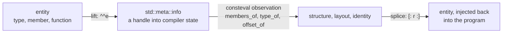
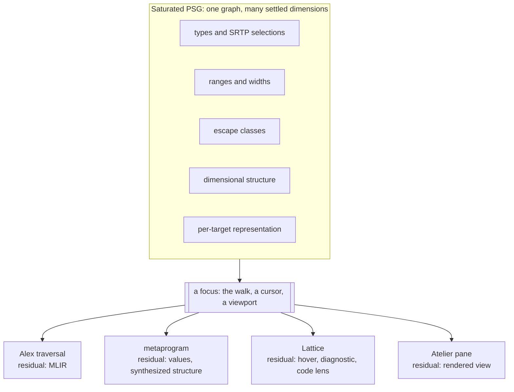

Ask a .NET developer to consider a language that compiles to native code with no runtime, and one question arrives before almost any other: what about reflection? The question deserves a better answer than a feature checklist. Reflection is one of the places where a legacy strategy calcified into a mental model and then got mistaken for an intrinsic necessity. As most developers know it, reflection has three established homes. It lives in runtime metadata tables shipped inside the binary, which is the Java and .NET pattern. It also lives in a compiler API reserved for tooling, which is the pattern of Roslyn and of the F# compiler service. And as of this year it lives in compile-time queries evaluated inside a translation unit, which is the pattern C++26 standardized in [P2996](https://isocpp.org/files/papers/P2996R13.html). Our compiler places it in a fourth home: the Program Semantic Graph itself, where the knowledge that other platforms reconstruct never left our framework in the first place.

We have made an argument like this more than once. [ByRef Resolved](/docs/design/types/byref-resolved/) traced .NET's byref restrictions to a single displacement: when memory safety lives in a runtime tracker, the tracker's limitations become the language's limitations. This piece reads the same displacement onto program metadata. Our take on it, after living in the .NET and Java ecosystems for years and many years of C++ development before that, is that runtime reflection exists because the compiler's knowledge was discarded, and every cost it carries follows from reconstructing at runtime what the compiler held complete a moment earlier. The shape of that mistake is older than the CLR. The graph-reduction engines and LISP machines of the 1980s put the interpreter into the hardware, and the compilers Simon Peyton Jones and his contemporaries aimed at stock hardware[^stock] beat them thoroughly enough that the machines became museum pieces. The hosted runtime rebuilt that interpreter in software, where the costs were diffuse enough to escape itemization for thirty years. The dispatch overhead, the trimming hostility, and the friction with ahead-of-time compilation are the itemization arriving late. Move the capability to where the knowledge already lives and the question dissolves.

Here we look at what runtime reflection actually reconstructs, takes a short digression through what C++26 just standardized and what that concedes, and then describes the design-time surface we are building over our PSG: joint constraints settled across a hypergraph, with active patterns carrying the same classification work they have always carried inside our compiler.

## What Runtime Reflection Reconstructs

By the time a .NET compiler finishes a build it has resolved every type, computed every layout, and bound every member. Almost all of that knowledge is then thrown away. What survives is a compressed remnant in metadata tables, and `System.Reflection` is the machinery for asking diminished versions of the original questions against that remnant, at runtime cost, with runtime failure modes.

> Runtime reflection is a partial reconstruction of knowledge the compiler held complete before it was discarded.

The .NET ecosystem has been conceding this point for years, one subsystem at a time. Source generators moved serialization metadata from runtime discovery to compile-time emission because `System.Text.Json` could not meet its performance targets while interrogating metadata tables on the hot path. Trimming treats reflection as the primary reason a linker cannot know what a program actually uses. Native AOT publishes long lists of reflection patterns that no longer work once the runtime's dynamism is gone. Each of these is a local migration of metadata work back toward compile time, carried out inside a platform whose metadata home cannot move.

The F# lineage our work draws from held a piece of the answer early. Don Syme's quotations gave programs typed, compile-time carriers of their own structure, and the F# compiler service gave tooling a rich semantic view of checked code. What that platform never offered was a meeting point. Programs could not see what the compiler service saw, and the compiler service ran as a separate design-time process disconnected from the metadata tables programs consulted at runtime. The knowledge existed twice, in two shapes, behind two doors.

## Two Doors into the Same Knowledge

That two-door arrangement is not a .NET quirk. It is the norm everywhere, and it is worth setting out plainly because the asymmetry is the thing our design removes:

| Ecosystem | Programs observe through | Tools observe through | Same live state |
|:----------|:-------------------------|:----------------------|:----------------|
| Java, .NET | runtime metadata tables | compiler APIs (Roslyn, FCS) | no |
| C++ through C++23 | nothing standard | libclang and vendor ASTs | no |
| C++26 | `std::meta`, inside the translation unit being compiled | libclang and vendor ASTs, still | no |
| Clef, as designed | our PSG observation surface | the same surface | yes |

Every mainstream platform gives programs and tools different doors into semantic information, and the two doors open onto different copies of it. The copies drift, the capabilities differ, and a category of tooling exists to paper over the seam.

## What C++26 Just Conceded

A short digression is warranted here, because the most instructive recent development in reflection did not come from a managed platform at all. In June 2025 the C++ committee adopted P2996 into C++26, and the design is compile-time static reflection with no runtime machinery whatsoever. Stripped to its core it is three primitives forming a closed loop, confined to constant evaluation:



Three of its design decisions carry the lesson. First, reflections are handles into the compiler's own internal state, valid only during translation, so zero runtime overhead is definitional rather than an optimization. Second, the handle is a single opaque type, because the committee judged that a strongly typed reflection hierarchy would freeze the language's ontology into a standardized API that later language evolution would break. Third, synthesis is structured or absent: completing a type from a member description made the standard, while arbitrary token injection was deferred, because pasting unstructured tokens is the failure mode everyone already knows from the preprocessor.

For a .NET reader inclined to treat reflection as evidence that a hosted runtime earns its keep, the digression has one takeaway. C++ is the language most hostile to runtime cost in mainstream use, and it now ships reflection with a genuine design-time role, zero runtime tables, and results frozen into the binary. A hosted runtime is not a precondition for reflection. It is one implementation strategy, and the strategy is what carries the costs.

We read P2996 as a concession to the position this piece argues, made from the opposite direction. Its constraints are honest engineering under batch compilation: the translation unit is the scope because no larger live structure exists, the constant evaluator hosts the queries because no resident process does, and tools still enter through libclang because the standard surface is only reachable from inside the program being compiled. Each of those is a consequence of a compiler that exits when the build ends.

## The Fourth Home

Our compiler does not exit in the design we are building toward, and the graph it maintains already carries, in the shipping compiler, what other platforms reconstruct. After saturation our PSG holds symbol and type resolution with SRTP witness selections captured in the typed-tree overlay. It holds operation classifications laid down by nanopasses. It holds [escape classes that place values in regions](/docs/design/memory/inferring-memory-lifetimes/), integer ranges with [the widths they select](/spec/draft/width-inference/), and the dimensional structure that [deferred inference](/blog/deferred-inference/) reads when it chooses a representation per target. The capabilities in question are native in both senses of the word. The binary is native code, and the metadata is native to the graph rather than bolted alongside the artifact.

Vocabulary matters here, and we hold a hard line on it. Our compiler does not emit code. Witnesses observe the settled graph, and the lowered form is the residual of that observation, which is why we call the step elision. The same discipline names the reflection surface.

> "Query" stands to reflection as "emit" stands to lowering: an imperative verb borrowed from an architecture we do not have.

A query is a request that causes computation on the observer's schedule. Nothing in this design works that way. The enrichments are placed by analysis before any consumer looks, which is the [coeffect and codata discipline](/docs/internals/concepts/coeffects-and-codata/) the compiler already runs on, and every consumer observes what is already there. Reflection, in this architecture, is the observation surface of the same traversal that compiles the program, opened to consumers other than the code generator:



The rows differ only in what directs the focus and what the residual is. When the compilation walk is the consumer, the residual is MLIR. When the developer's cursor is the consumer, the residual is a hover card. A hover card and a lowered op are the same kind of thing in this architecture: each is what a witness returns after observing the settled graph at a focus. Design-time tooling is another elision target.

## Deferred Inference Read Back Out

Readers of [The Gift of Deferred Inference](/blog/deferred-inference/) have already seen this surface without it being named. That piece argued that a commitment removes options and the option space is the information, so the compiler holds representation choices open until ranges and targets close them, and the range and its selected representation ride the graph as coeffects. The editor readout it presented is worth revisiting with this piece's eyes:

```
force : float<newtons>
  dimensional range  [1e-11, 1e30]   (gravitational constant through stellar masses)
  ├─ x86_64   float64          worst-case rel error 1.1e-16, uniform     [wide dynamic → IEEE]
  ├─ xilinx   posit<32,es=2>   ~2.3e-8 at the extremes, ~1.5e-9 near 1.0  [near-unity taper]
  └─ note     posit holds ~10x more precision in [0.01, 100], where most forces actually fall
```

That readout is reflection. It is an observation of layout and representation at a focus, rendered for a human instead of for a lowering pass, and it belongs to an observation class no other platform can express. C++26 answers `offset_of` only after a representation is concrete. Under our deferred inference a layout observation is a function of the named target, so the same `float<newtons>` reports one answer for the x86-64 host and another for the Xilinx part, each with the accuracy consequence alongside. Reflection over a deferred type algebra reports what is still open as honestly as what has closed, and the `E_RANGE_UNBOUNDED` diagnostic in that piece is exactly such a report.

## Joint Constraints over the Hypergraph

What makes the settled graph worth observing is how it settles. ByRef Resolved named the discipline for memory: joint constraint reasoning over our program hypergraph, where a closure's region, its captured environment, and the function's parameter regions participate in a single constraint. Memory is one dimension of a wider practice, and the dimensions differ in more than content. Each settles under its own algebra along its own edge classes. Integer intervals widen monotonically to a fixpoint along def-use and feedback edges, and that machinery ships today: it is what reads a HelloArty counter at 29 bits instead of a host register's 64. Escape classes join along capture and call edges. Dimensional constraints unify along type flow. Representation selection multiplies per named target rather than settling to one value at all.

The structure that reads those settled dimensions is a zipper, and a zipper earns a precise description here. Huet's functional pearl[^huet] gives a cursor made of a focus and its one-hole context, and the pair is the canonical comonad: `extract` reads the focus, and `extend` runs a context-aware function at every position of the structure.

$$
\mathrm{extract} : W\,A \to A
\qquad\qquad
\mathrm{extend} : (W\,A \to B) \to W\,A \to W\,B
$$

A witness has exactly the shape `extend` wants. It is a function from a focus-with-context to a residual, and running it across the graph is how elision covers a program. The coeffect literature formalizes context dependence comonadically for the same reason, and the copatterns tradition[^copat] completes the picture from the codata side: a codata value is defined by the projections it answers, so observation is the application of a projection that already has an answer. Every piece of this vocabulary was in our architecture before reflection was the topic. Reading the reflection surface out of it required no new machinery, only the recognition that the compiler's own access discipline is the API.

## Semantic Projections

The design-time question is what keeps those observations answerable between keystrokes, and this is where our design does its genuinely new work. On a batch walk the answer is trivial: nanopasses run, the graph settles, witnesses observe. At design time edits stream in continuously, and a surface that computed answers when the editor asked would put computation on the observer's schedule, which is the exact discipline violation the vocabulary above exists to prevent.

Our answer is a layer we call **Semantic Projections**, and the word projection carries its event-sourcing sense deliberately. As a materialized view stands to an event store, a Semantic Projection stands to the edit stream: a fast, read-only model, rapidly updated as the underlying graph changes, rebuildable from it at any time, and holding no authority of its own. The PSG remains the single source of truth. Settlement is idempotent, \( \pi \circ \pi = \pi \), so re-projecting a settled region is the identity and a projection can always be discarded and rebuilt rather than migrated.

> Computation is edit-driven; observation is free.

The plural in the name is structural rather than stylistic. Because the constraint dimensions settle under different algebras along different edge classes, one monolithic projection would couple their fixpoints, and the slowest-converging dimension would gate every observation. An edit that dirties only widths would invalidate escape answers that never depended on it. So each dimension projects separately, invalidation follows each projection's own edges rather than text ranges, and the projections meet only at declared seams, as when widths read types. Attention supplies the schedule. The walk's focus during compilation, the developer's cursor in an editor, and a pane's viewport in [Atelier](/docs/tooling/atelier-the-fidelity-workshop/) are the same signal: they mark which regions of which projections settle eagerly and which can wait.

This layer is design-stage work, and we are careful to say so. The graph, the witnesses, the classification idiom, and the integer analyses they generalize ship in our compiler today, and our verification notes already commit to the PSG persisting as a long-lived structure that [Lattice](/docs/tooling/leveling-up-with-lattice/) reads at design time, a commitment stated in [from proofs to silicon](/docs/internals/verification/proofs-to-silicon/). The projection layer and the resident compiler service it runs inside are specified and under active design. The honest lineage for the shape is self-adjusting computation and Adapton, where derived values stay placed and current. Rust-analyzer's Salsa solves the same problem from the demand-driven side, where observation triggers memoized computation, and it works well for that tool. The placed-then-observed side is the one consistent with a compiler whose working discipline is that witnesses never compute.

## Active Patterns Step Forward

One question remains for the surface itself: what does an observation look like in the language? C++26's answer to the parallel question was a flat catalog of functions over a single opaque handle, and the committee accepted the loss of static typing on the reflection surface because a typed hierarchy would have frozen the language's ontology into the standard. That dilemma is real, and we dissolve it with a Clef inheritance that has waited a long time for this role.

Three of Don Syme's F# designs anchor this body of work, and two already had their defining assignment. Quotations are the semantic carriers at the center of [our platform descriptor work](/spec/draft/special-attributes-and-types/), and computation expressions with the mailbox processor are the notation for our concurrency model. Active patterns are the third, and [our metaprogramming notes](/docs/design/language/standing-art-clef-metaprogramming/) have long described their role inside the compiler: compositional recognition, classifying PSG nodes for the zipper and the Alex traversal without type discrimination hierarchies. The reflection surface is where that internal idiom becomes the public one. The sketch below is design surface rather than shipping API, and it is the shape a Lattice hover witness takes in this architecture: a single opaque handle into the graph, classified through active patterns, yielding typed views without a frozen ontology.

```fsharp
let hover (focus: NodeRef) =
    match focus with
    | RecordShape fields ->
        fields |> Seq.map (fun f -> $"{f.Name} : {display f.FieldType}")
    | FunctionShape (domain, range) ->
        Seq.singleton $"{display domain} -> {display range}"
    | DimensionedQuantity (dim, rep) ->
        Seq.singleton $"float<{dim}> resolves to {rep} on this target"
    | Opaque ->
        Seq.empty
```

Every arm binds typed results, which is the static discipline C++ gave up. The handle stays open, so new node kinds and new pattern banks extend the surface without breaking an existing match site, which is the evolvability C++ bought with opacity. The third arm is the deferred-inference readout in miniature. The observation it renders is platform-conditioned, so the same focus reports one representation under an x86-64 target and another under a fabric target, and the witness itself never computes either answer. It reads what the projection has settled. Partial patterns compose into total views, parameterized patterns admit that conditioning directly, and metaprograms, Lattice, and the compiler's own walk end up speaking one idiom over one graph. The idiom is one the compiler has trusted internally from the start.

## What Serialization Becomes

The practical .NET uses of reflection deserve a direct accounting, because "what about reflection?" is usually a compressed form of "how do I serialize?" Every load-bearing use has the same shape in this architecture: observe structure at compile time, synthesize the derived code through the witness channel, and freeze the results into the artifact.

A [BAREWire](/docs/design/memory/memory-management-by-choice/) schema derives from a record's settled structure in the graph, so the wire contract is generated where the layout is known rather than discovered where it is not. Structural formatting, equality, and comparison, the classic consumers of `System.Reflection` in .NET, become compile-time synthesis over the same observations. Synthesis stays structured, by the same reasoning that kept token injection out of C++26: derived code enters the graph as nodes through the nanopass channel, never as pasted text. And reification follows the rule the C++ design also landed on. An observation consumed at compile time leaves no residue in the binary, and an observation the program keeps becomes a static constant placed by the same machinery that already puts program-lifetime values in static storage. Nothing is reconstructed at runtime because nothing was lost.

## What Ships and What Is Design

The accounting, in the spirit our recent pieces hold to. The PSG, the nanopass enrichments, witness-based elision, active-pattern classification inside the compiler, integer width inference through to synthesized fabric, escape-driven placement, and static storage for program-lifetime values ship in our compiler today. The resident compiler service, the Semantic Projections, the observation vocabulary as a public surface, and the Atelier panes that would render it are design-stage, specified in our tooling documents and under active development. The editor readouts shown here take the shape our existing diagnostics take, and the ones drawn from the deferred-inference piece carry that piece's own designed-experience caveat. We name the line between the two because the argument does not need the line blurred: the fourth home for reflection is not a promised feature, it is a property of where this compiler already keeps its knowledge.

## Answering the Question

So the answer to "what about reflection?" is not that we do without it. The honest answer is that we already have it, in the only place it was ever complete. Runtime reflection is a costly reconstruction of knowledge the compiler discarded, and our compiler does not discard it. The serializers, formatters, comparers, and schema generators that justify reflection on managed platforms are served here by observation at compile time, with their results in the binary and nothing left to interrogate at runtime. What the managed platforms cannot offer at any cost is the rest of the surface: observations of escape classes, dimensional structure, SRTP resolution, and platform-conditioned layout, kept current between keystrokes and rendered where the developer is looking.

The through-line of this body of work has been a preference for principles that hold their center under examination: regions from Tofte and Talpin, flat closures from Appel and Shao, quotations, computation expressions, and active patterns from the F# lineage, coeffects and codata as the compiler's working discipline. Reflection turned out to be another place where those commitments already contained the answer, waiting for the question to be asked in the right direction. That a standards committee with no tolerance for runtime cost arrived this year at a neighboring conclusion, from the opposite direction and under heavier constraints, reads to us as ratification of the bearing. We will keep building the resident service and the projection layer that let the graph answer at design time, and we expect this surface, like the others before it, to sharpen as the work continues.

[^huet]: Huet, Gérard. ["The Zipper."](https://doi.org/10.1017/S0956796897002864) *Journal of Functional Programming* 7.5 (1997): 549-554. The functional pearl that gave the focus-plus-context cursor its name. McBride later showed the context type is the derivative of the data type it navigates.

[^copat]: Abel, Andreas, Brigitte Pientka, David Thibodeau, and Anton Setzer. ["Copatterns: Programming Infinite Structures by Observations."](https://doi.org/10.1145/2429069.2429075) *POPL* (2013): 27-38. The codata side of the discipline: a codata value is defined by the projections it answers.

[^stock]: Peyton Jones, Simon L. ["Implementing lazy functional languages on stock hardware: the Spineless Tagless G-machine."](https://www.cs.tufts.edu/~nr/cs257/archive/simon-peyton-jones/spineless-jfp.pdf) *Journal of Functional Programming* 2.2 (1992): 127-202. The title carries the verdict of the special-hardware era. His earlier book, [*The Implementation of Functional Programming Languages*](https://simon.peytonjones.org/assets/pdfs/slpj-book-1987-2up-searchable.pdf) (1987), documents the compilation techniques that made the machines unnecessary.
