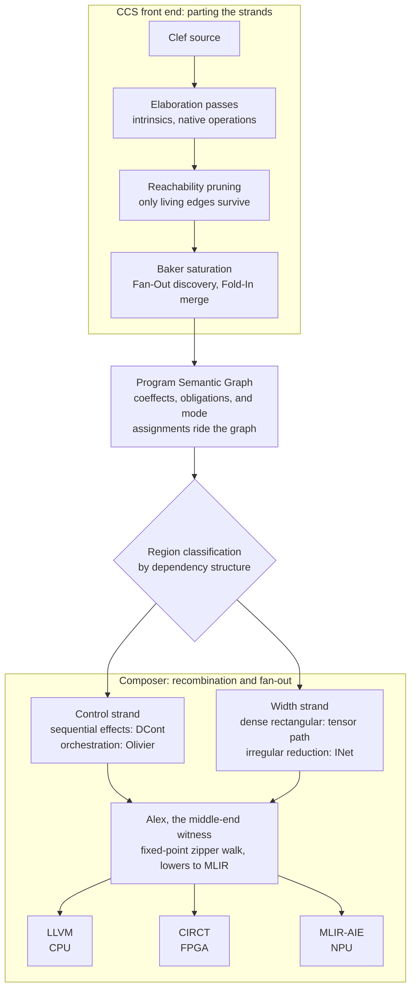
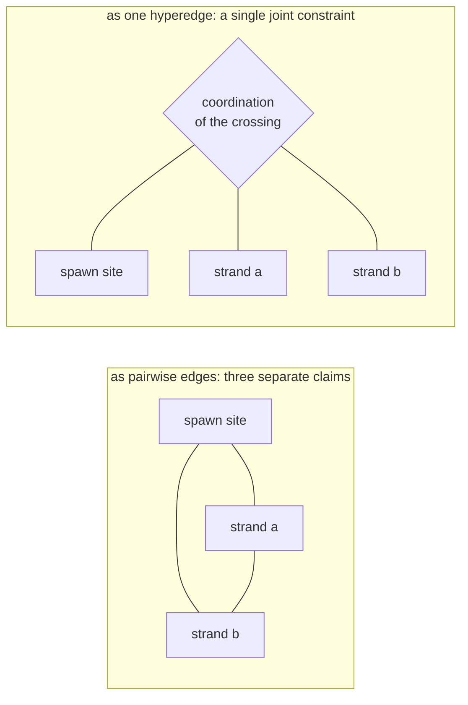
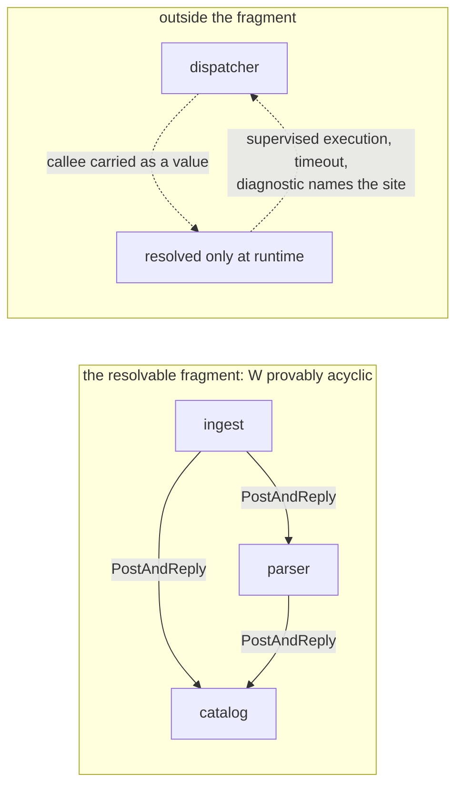

The field has a long shelf of words for the part of computation that comes apart cleanly. 

- map
- SIMD/SIMT
- confluent
- data-parallel
- referentially transparent
- Embarrassingly parallel

Each names a computation whose pieces do not depend on each other, so a machine can run them separately with no coordination. Now ask for the word that covers the opposite case: a program that spawns parallel work from inside a sequential loop, waits for the results, and uses them to decide what happens next. That rhetorical shelf is nearly bare. Pull the parallel part out of a program like that and you have a different program.

The nearest name on record is [braided parallelism](https://ieeexplore.ieee.org/document/6272260/), coined in the GPGPU era for a single-source model that interleaves task and data parallelism, with the game engine as the standing example. I am going to take the word and run with it, as they say, with one property doing the work: a braid comes apart if you cut a strand. The structure is *the crossing*. You cannot lift out the parallel part, run it as embarrassingly parallel, and staple the control back on afterward, because the places where the strands cross are where the work resides. Real programs are braided in exactly this sense. They spawn parallel work out of sequential control, and the act of spawning is a control act with a return point, a place the computation comes back to and threads the result through what comes next. That return point is *the crossing*. A substrate that gives it no first-class place cannot hold the braid, however well it holds the strand. And that capacity varies across processor types: not every processor can take every form of braided parallelism, and even the GPU, the hardware the word was coined for, is surprisingly narrow relative to the variety of cases that garden-variety code expresses as a matter of course.

## A workload that will not unweave

Our position would benefit from a solid example before we carry forward the argument. Dependency resolution is one of the plainest:

```fsharp
// the frontier for round n+1 does not exist until
// round n's parallel width has come back through the fold
let resolve (root: PackageId) = async {
    let mutable resolved = Map.empty
    let mutable frontier = [ root ]
    while not (List.isEmpty frontier) do
        let! manifests = Registry.fetchAll frontier    // control: one round of I/O
        let solved = query {
            // width: every manifest independent
            for m in manifests do
            select (m.Id, Solver.constraintsOf m)
        }
        resolved <- Map.merge solved resolved
        frontier <- nextFrontier resolved solved       // the crossing: width decides control
    return resolved
}
```

Inside a round, the parsing and constraint-solving of each manifest is a clean *strand*: no manifest depends on another, and the width is real. Between rounds, the program is control: the fetch is an effect, and the frontier assignment decides whether the loop runs again and *over **what***. The crossing is the line where `frontier` is rebuilt from the width's results. In compiler parlance, the width cannot be 'hoisted' ahead of the control, because the set of manifests to parse is an output of the loop it would be hoisted *out of*. And the additional wrinkle: the control cannot run ahead of the width, because the frontier is computed from results that do not exist yet. Serializing everything preserves the crossings and gives up the machine; the parallel reading exists round by round, and only there. That round-by-round gap between a program's ideal parallel reading and what a serialized lowering keeps is exactly the figure our [flow loss analysis](/docs/design/structure-and-performance/flow-loss-analysis/) is built to reveal.

Keep this snippet in mind: every substrate below gets measured against it. A computation with this shape demands a compilation tool that can take it apart without *flattening* it, and that 'demand' is what I want to work through here. Our position across the [Fidelity framework](/docs/) has been that a property is worth claiming only at the grain where it is actually true, and the grain here is the braid: our compilation discipline matches the shape by design, and the match is checkable in the pipeline itself.

## Standing Art in Other Ecosystems

Several frameworks worth considering have built their foundations on the 'clean strand'. The pattern is consistent: a narrow idea's elegance gets read as evidence of reach, and the demonstration chosen to show off the new capability is usually of the happy path variety.

Interaction nets are the sharpest instance, and it is mentioned with respect, because interaction nets are part of our own lowering design. HVM and its successor [HVM2](https://github.com/HigherOrderCO/HVM) are real parallel interaction-net runtimes, including on GPU, and the model is right for the irregular, sharing-heavy reduction it was built around. Its trajectory is also a signal. One cannot make everything a net, because real programs spawn parallel work out of sequential control, and that *spawn* is a delimited-continuation act the interaction net has no first-class place for. The net carries no continuation capture, no sequencing, and no central scheduler; the same austerity that makes it fast on the independent strand *leaves the crossing **beyond** its reach*. 

Another example is Verse, whose core calculus is rewrite-first at the foundation, with a sharper liability attached: the property it depends on, confluence, is in tension with the control that real programs require, so retrofitting control onto it is harder than it was even for the nets. A hardware version of the same tell shows up in the GUPS flagship that gets waved at heterogeneous-memory machines, a demonstration chosen because it is all bandwidth and no coordination, the workload with the "hard part" conspicuously absent.

Across all three of these examples the diagnosis is the same: the idea is genuinely good, and the demo is selected to hide the generality gap. The mistake is in the foundation, not the execution: the substrate's shape decides in advance which programs it can carry. None of these substrates lacks power in the Church-Turing sense; each of them can express the resolver, because equipotence is settled and no substrate escapes or extends the class. What differs is where the program's structure lands: in a first-class construct of the model, or in an encoding the developer maintains and a runtime pays for. This 'braid' construct we're working with in this entry frames a distinct, common computational structure that has to land ***somewhere***, and landing it in a runtime that is missing memory safety, thread safety, and deadlock freedom is a hidden cost that no one knows until the failure modes emerge at runtime.

Modular's MAX, another example, belongs in a different slot than the three above: it makes no universal-substrate claim. MAX is a graph-compiled inference engine that targets CUDA, ROCm, and Apple Metal from one [Mojo](/blog/musing-on-mojo/) kernel codebase; it is MLIR-native and well executed. By its competitors' own accounts it pulls ahead on dense models at high concurrency. Its programming model is explicitly the grid, thread blocks mapped onto one-, two-, or three-dimensional blocks grouped into a grid, and that model is the right answer for dense, feed-forward tensor inference, where the computation shape is fixed before the first request and every lane does the same work. MAX is a first-class example in the grid-scoped category. Its scope boundary is legible in its own roadmap. Mixture-of-experts architectures are the acknowledged gap, and MoE is exactly where inference stops being a clean *dense* grid and acquires **routing**: data-dependent dispatch to experts, a conditional decision about which sub-networks fire on this input. That routing is control arriving inside the inference workload. The braid shows up at the honest edge of a correctly-chosen scope. This is the [Uncomfortable Truth](https://speakez.tech/blog/uncomfortable-truth/) detailed in the SpeakEZ Technologies blog.

Two things keep this fair, and both are the same discipline applied to our own framework. MAX, Mojo, and our Composer compiler are all MLIR-native, and MAX reached that infrastructure first and at scale, so "MLIR-native" cannot be the contrast. The contrast that holds is scope and the polarity of the substrate, with the infrastructure as shared ground. And a well-scoped dense-inference engine that pulls ahead on the workload it was built for does not become "the wrong problem" because routing sits outside its current reach. The boundary of MAX's correctly-chosen scope is exactly where inference begins to braid, and that boundary is already visible in its own gaps. When we approach that same territory it is through typed domain models whose membership is [settled by grade before a request arrives](/docs/design/constrained-machine-learning/the-constellation/), where a mixture of experts learns it as routing weights; it is a different answer to the same shape, and whether that routing can be made reliable enough is a question we hold open, but have confidence that we'll be able to answer in a way that is consistent with our goals for integrity and efficiency.

The taxonomy, consolidated:

| Substrate | Founding shape | Right for | Where the braid arrives |
|---|---|---|---|
| HVM / HVM2 | interaction nets: confluent, local rewriting | irregular reduction whose parallelism is real but not rectangular | the spawn's return point, which has no first-class place in the net |
| Verse core calculus | rewrite-first; correctness depends on confluence | its logical and functional core | control retrofits against the confluence its correctness depends on |
| Lane-uniform hardware demos | every lane does the same work | bandwidth-bound, uniform access | the coordination the flagship demo removed |
| Modular MAX | the grid: blocks over a shape fixed before launch | dense feed-forward inference, correctly scoped | MoE routing: data-dependent dispatch inside the inference pass |

This is where a "runtime hat" is worn to think through the scenarios clearly. Run the resolver against the first and last rows. A grid needs its iteration space fixed before launch, and the resolver's round n+1 frontier does not exist until round n returns; so a grid executes it as one kernel launch per round with the loop living on the host, and the host loop is precisely the control the model excludes. The program's structure lands in the seam between launches, past the edge of what the grid carries. A net runs each round's width beautifully. The round boundary is a sequencing act: gather every result, merge against `resolved`, choose the next frontier. Encode that into the net and you are scheduling by hand-built encoding, the bookkeeping HVM pays a runtime host to do dynamically. Both substrates hold the strand. The crossing lands outside them.

## Polarity

Now we switch to "the compiler hat". Control-first and net-first look interchangeable from a distance: pick either as the foundation, host the other on top. The hosting works in one direction only, and two type signatures show why. Our [DCont/INet duality](/docs/design/concurrency/dcont-inet-duality/) rides the monad/applicative axis, and the axis is a pair of shapes:

$$
\begin{aligned}
\mathrm{bind} &: M\,\alpha \to (\alpha \to M\,\beta) \to M\,\beta \\
\mathrm{pair} &: M\,\alpha \to M\,\beta \to M\,(\alpha \times \beta)
\end{aligned}
$$

In `bind`, the second computation is a function that receives the first computation's value. The crossing is written into the type: what runs next depends on what just arrived. In `pair`, both computations are already whole before either runs; nothing passes between them, so they compose in parallel. And the containment goes one way. `pair` is derivable from `bind`:

$$
\mathrm{pair}\ a\ b \;=\; \mathrm{bind}\ a\ \big(\lambda x.\ \mathrm{bind}\ b\ (\lambda y.\ \mathrm{return}\ (x, y))\big)
$$

Running the construction backward, from `pair` to `bind`, is where it stops: pair's arguments arrive as finished computations, closed to each other's values, and no composition of finished computations produces a dependency. Every monad determines an applicative, and the derivation runs one way.

That standard fact is the type-level form of the substrate claim. Control-first can contain a net: you can host a confluent monoidal reduction underneath a control regime, hand it the independent width, and let it reduce in any order, because the control regime waits at a defined point for the width to come back. Net-first cannot contain control: a control regime hosted underneath a confluent reduction breaks the confluence, because control-ordering is the thing confluence assumes away. That asymmetry ordered the duality; a mere partition would have left the two sides level. Delimited continuation is the foundation because it is the substrate that manages the crossing, the shift-and-resume that suspends a computation and threads the spawned result back through what follows. Interaction nets are the guest on the typed other side of that boundary, supplying reorderable width to be woven in, and running the net all at once is justified by a confluence theorem established once over the rule system, a property of the logic that no individual program has to carry.

The duality doc uses "braiding" for one of the monoidal laws, the commutativity \(a \otimes b \equiv b \otimes a\) that lets the compiler reorder two independent operations for locality. That categorical braiding describes *freedom **inside*** the independent strand: it says work can be rearranged, and it does not say the work can run at once. That is the opposite disposition from the braid in the title. The categorical operation marks a strand as separable. The braid of this post is the non-separable weave of the two strands *together*, the thing the compiler has to hold because it does not come apart. One law describes reordering inside a strand; this post is about the crossings between strands.

## Nanopass Enters the Metaphor

If you consider *literal* braiding of hair, it starts with separation, then a controlled crossing, then recombination. Part the strands, cross them in an order you choose, bring them back together. That is also a description of a nanopass compiler. Isolate one concern per pass, operate on it while the others are held apart, then recombine through lowering. So there are two braids here, and they are dual without being identical. In our Clef Compiler Services [Baker component](/docs/internals/pipeline/baker-saturation-engine/), we refer to **"fan out, fold in"** for passes that can run concurrently. There is the computation braid, the running program's woven interleave, which is non-separable and executes as a whole. And there is the compilation braid, the nanopass method, which separates and recombines in order to produce the artifact. These two rhyme: the compiler takes the program apart in order to produce a computation that is itself a braid, and the method fits the material because both are separation, then *re*combination.

The two are close enough to blur. "The compiler takes the braid apart" describes the method, and it is true. The compiler separates the strands to assign each one to the substrate whose shape it matches, and the crossings ride through that separation intact, with the developer benefitting from intelligent compiler design. 

## The Compilation Braid

Here is the compilation braid as mechanism: strands parted, crossings recorded, strands rejoined.



The outer bands of that figure are shipped mechanics; the strand assignment in the middle band is the design direction the [duality doc](/docs/design/concurrency/dcont-inet-duality/) sets out. Elaboration passes handle intrinsics and native operations first, the platform I/O and the extern bindings that map to a machine instruction. Then Baker, our saturation engine, runs after reachability analysis has pruned the graph to the living edges and expands the language constructs that have no single machine instruction, the higher-order functions and the match expressions, saturating each site into the sub-graph of primitives that expresses its intent. Baker does this through a Fan-Out that discovers saturation sites in parallel and a Fold-In that merges the generated sub-graphs back into the [Program Semantic Graph](/docs/internals/pipeline/baker-saturation-engine/) serially, which is the separation-and-recombination shape appearing at the scale of a single pass.

The design folds the mode assignment into the same separation: which region is control-first, the sequential effects that lower through delimited continuations and the actor orchestration the [Olivier model](/docs/design/concurrency/the-three-layer-actor-contract/) supervises, and which region is stateless reorderable width, the dense rectangular work that lowers to the tensor path and the irregular reduction that lowers to interaction nets. The classifier is the region's dependency structure, read off the graph; the computation-expression keyword the developer writes is only a hint at it. In the resolver, that classification would part the `query` body from the loop that feeds it, with neither marked by hand.

The crossings are recorded on the graph. Dimensions, grades, coeffects, and reversibility ride the [Program Semantic Graph](/docs/internals/pipeline/hyping-hypergraphs/) as annotations on nodes. As the structure grows toward a hypergraph, some of those annotations would ride as hyperedges that bind several nodes at once, because some constraints are genuinely multi-way:



Co-location of several values on one hardware tile is a claim of this joint kind. So is the join of several geometric elements. So, for this post, is the coordination structure of spawned work: the crossings of the braid are *exactly* the relationship the hyperedge form exists to hold, and held jointly the coordination *stays legible* to the passes downstream. The proof obligations ride the same graph, discharged at design time and, in our planned pipeline, re-checked through lowering, so a verified property stays adjacent to the code it constrains, through to the back end that manages the final lowering to the targeted hardware.

The recombination happens in the middle end and the fan-out. A fixed-point combinator, a Huet-style zipper, walks the saturated graph; the walk is passive, witnessing an order the graph construction already decided. Alex, our [middle-end component](/docs/internals/pipeline/learning-to-walk/), resolves the platform-specific elements and lowers to MLIR, and from MLIR the design fans out to target dialects, LLVM for the CPU, CIRCT for FPGA, MLIR-AIE for the NPU, with further targets under design. Because each strand would arrive with its substrate assignment and its obligations attached, the recombination is designed to carry the crossings across every target instead of re-deriving them at each backend.

The [Fixed-Point Scaffolding pre-print](https://arxiv.org/abs/2606.02854) grounds three of the claims stated here as properties. The fixed-point combinator is the operational form of Ohori's machine-code proof theory along the compilation axis, where each lowering pass is eligible to be a proof transformer, type-preserving by substitution, so a certified edge has nothing left to re-check and the composite preserves what it carries. The obligations that ride the graph are checked per edge: the pipeline is one functor with a compositionality equation, a cellular-sheaf result reduces verifying the global property to checking the local structure-map equations on the graph's edges, and the SMT dialect discharges exactly those local obligations for the passes not yet certified as proof transformers. And our approach to a coeffect mechanism is the checkable difference between *carrying* structure and other systems being forced by their semantic loss to recapture it through lowering. Our width-inference coeffect computed at design time holds a range, the lowering reads it and fixes the numeric representation, and where a range is genuinely unobservable the compiler reports it as a diagnostic, and the error requires an annotation at the source. The combinator, the width inference, and the escape-driven allocation are in the middle end today; the SMT-dialect obligation as an in-IR operation, the DCont and INet lowering passes, and the mode-shift objects as first-class are the paper's stated direction still in design. 

## Trust Boundary

Our claim on verification is preservation to the backend. The invariants, the static ones and the concurrency ones alike, would be carried across every pass our Composer compiler owns, up to the handoff to an established vendor or industry backend. For the static properties the fence is clean: a dimensional fact or a grade would be settled at the native-AST level [before any MLIR lowering](/docs/internals/verification/proofs-to-silicon/), with the planned pipeline carrying it into the IR and re-checking it through lowering by per-edge translation validation in the SMT dialect, so each optimization would preserve MLIR semantics. 

For the concurrency properties the fence sits closer in. Take deadlock freedom, the payoff of interest here and the one easiest to overclaim. For the fragment of an actor system where every callee is a statically resolvable actor reference, the wait-for relation \(W\) is a finite directed graph, and [deadlock freedom reduces to acyclicity of that graph](/docs/design/concurrency/deadlock-freedom-as-an-obligation/). Acyclicity encodes as a rank constraint:

$$
\forall (u \to v) \in W.\;\; r(u) < r(v)
$$

The constraint is satisfiable exactly when the relation is acyclic; over a finite edge set it is QF_LIA, and the same solver path that checks interval and bound obligations would discharge it, with the satisfying assignment serving as the rank. The edge accounting is visible at the call site:

```fsharp
let! ack = catalog.PostAndReply(Commit batch)   // suspends the caller: adds a wait-for edge
parser.Tell(Discard batch)                      // posts and returns: adds no edge
 
```

Where the callee is genuinely dynamic, carried as a value or chosen by content-based routing, acyclicity over such routing is undecidable in general. By design, the compiler neither forbids the site nor admits it silently: it produces a diagnostic on which call dropped out of the resolvable fragment and why, and the call falls back to supervised execution with a timeout.



Clef aims to be deadlock-free the way it is `unsafe`-free: by construction. Inside the resolvable fragment, acyclicity is proven and the proof is silent. Outside it, the current design contains what the proof cannot reach: the dynamic call runs supervised, a blocked wait is bounded by its timeout, and the diagnostic names the site for the developer to place the timer. The boundary the developer sees and steers separates proven from supervised, never checked from unchecked. This is a path we're keen to keep narrow so as to minimize the potential for it to become a recurring workflow interruption.

Our position is that a supervised timeout is a failure-mode monitor in waiting, and a design that falls into it too easily has traded analysis for structural integrity. There's no metric on how often a genuinely dynamic callee arises, or how much of that population analyzers and development guidance could steer back into the provable fragment. Working that remainder down is part of weaving the braid too, and the proven side grows as the program graph carries more of the wait-for structure in its built-in scaffold.

There is a piece of this the static analysis leaves open, and our position is always to face it rather than whistle past it. The acyclicity proof rules out deadlock for the *resolvable* fragment, and rules it out identically on every target. Runtime progress needs one thing *more*: a scheduler that keeps advancing the actors that are ready to run. That assumption lives per target, in each target's trusted base:

| Target | Progress rests on |
|---|---|
| Native | Prospero, our supervisor on an elevated thread |
| Conclave | the durable-object platform's scheduler |
| .NET fallback | the managed runtime's scheduler |

Deadlock freedom is target-independent. Progress is the scheduling row of that table. This is an area of interest for us to either automate in the compiler or establish supportive analyzers to streamline the design-time experience. 

## The Unseen

Go back to what we're imagining for the resolver. The developer would write a `while` loop, an async bind, a `query` body, and two mutable locals. There would be no spawn annotation marking the width, no lifetime tick threading the manifests through the rounds, no wait-for bookkeeping on the fetch; `let mutable` is [ordinary syntax](/docs/design/language/managed-mutability/), and the classification of what escapes a round and what stays local to it is a fact the analysis would derive in Clef Compiler Services and Baker's elaboration and saturation. The braid is irreducible, and none of the machinery above would shift its complexity onto the developer. The crossings would be the compiler's burden by design: the developer would write garden-variety code, and Composer is being built to navigate the crossing without significant intervention at design-time.

This is the same inversion we have argued for [correctness](/blog/fearless-concurrency-gets-real/) and for [performance](/blog/counting-the-cost-of-coordination/) in concurrency. Where Rust's borrow checker reasons one function at a time and hands the lifetime question back to the developer at the boundary of its single-function view, our escape analysis lives in a program graph that spans functions and actors. So a value crossing a call boundary is the same value the analyzer was already tracking. Where a shared reference forces the developer to remember the alignment and confirm the isolation with a profiler, an arena that belongs to an actor makes cache isolation a consequence of the structure, and a decision Composer is being built to reason about over a known memory layout. This is a *'natural'* positive consequence of basing the framework on a concurrent programming model.

The verified properties are the compiler's responsibility, discharged at design time and carried on the graph. The [tiered verification posture](/docs/internals/verification/) pays off exactly here, in the developer's chair: the strongest properties are the ones the developer **never** has to deal with directly, because they were settled where the compiler internals could carry the decision.

## A Consistent Weave

Clef's concurrent programming model, with Composer being built around it, is designed to automate braided parallelism across processor types, within the capabilities each target provides. A braid survives compilation when the compiler's own operations embrace those constructs: part, cross, rejoin. Our nanopass separation is designed to part the strands and lower each one against the substrate it matches, and lowering will also recombine them with the crossings and the obligations still attached. The process will yield a cohesive design-time and build-time experience that will make putting workloads on a variety of processors more performant and more efficient.
