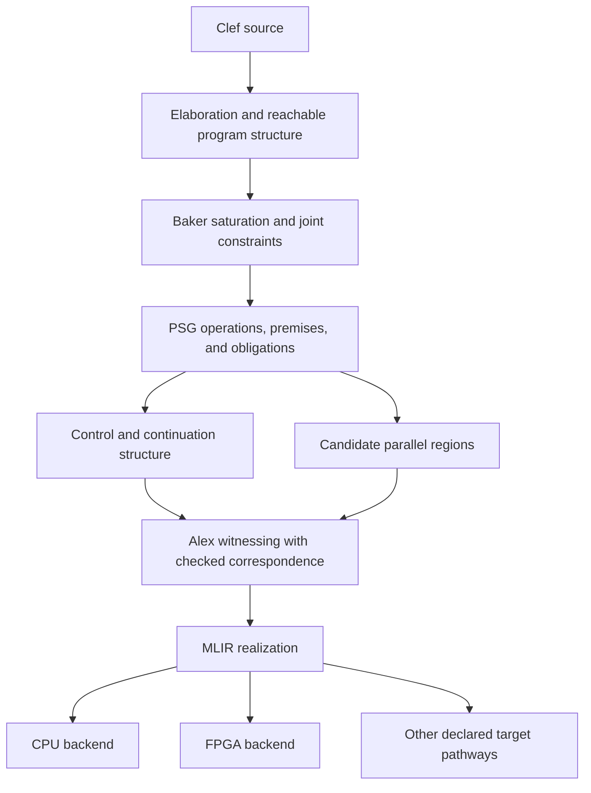

A program can launch several independent calculations, wait for their results, and use those results to decide what happens next. Each round contains parallel work. The rounds themselves depend on one another. We are building Clef and the Fidelity framework to retain that relationship from ordinary source code through target selection and execution.

The field has a shelf of terms for parts of this construction, and most of us have reached for several of them while writing the same program. `map` expresses applying an operation across a collection. SIMD and SIMT describe forms of machine execution. Confluence concerns agreement between reduction orders, while referential transparency concerns substitution without changing meaning. Each can help us reason about parallel work, with independence and effect conditions established where needed.

Forks and joins describe the control around launched work. A future can hold a pending result. An asynchronous bind can suspend a computation until that result is available. In a practical program, these mechanisms meet at the point where completed work determines the next action.

The earlier [Kite work on braided parallelism](https://ieeexplore.ieee.org/document/6272260/) explored interleaved task and data parallelism on heterogeneous systems. We're going to take the word and run with it. The crossing is the return point through which parallel results re-enter sequential control. We want the compiler to keep that crossing explicit while choosing implementations for the surrounding work.

> **Width, in this post.** Think of the work available side by side, once its prerequisites are met. For a finite dependency order, *dependency width* is the size of its largest antichain: the largest set of operations with no dependency path between them. [Dilworth's theorem](https://doi.org/10.2307/1969503) identifies it with the minimum number of chains covering the order. The longest chain describes a different property, dependency depth. Neither quantity alone determines utilization on a particular processor.
>
> *Bit width* describes a value's numeric representation, as determined through [width inference](/spec/draft/width-inference/). The two uses of “width” concern different compiler decisions.

<a id="a-workload-that-will-not-unweave"></a>

## Dependency Rounds

A package resolver makes the dependency concrete. Fetch the current frontier of manifests, extract each manifest's constraints, then combine the results to determine the next frontier. The loop should look familiar to anyone who has written a batch job that discovers more work as it goes. The following sketch uses descriptive library names for that workflow:

```fsharp
let resolve (root: PackageId) = async {
    let mutable resolved = Map.empty
    let mutable frontier = [ root ]
    while not (List.isEmpty frontier) do
        let! manifests = Registry.fetchAll frontier
        let constraints =
            manifests |> List.map constraintsOfManifest
        let solved = solveRound resolved constraints
        resolved <- mergeResolution resolved solved
        frontier <- nextFrontier resolved solved
    return resolved
}
```

Constraint extraction can run independently when each invocation reads its own manifest and has no conflicting effects. Solving the combined constraints may involve packages shared by several manifests, so that operation has its own dependencies. The next frontier depends on the solution for this round. It becomes available only after the relevant results have returned.

Put on a runtime hat and follow one round. The manifest calculations finish, their results meet in the solve, and the next frontier takes shape. Running the extraction sequentially gives up available parallel work. Starting the next round before the solution is ready gives it an incomplete frontier. The program needs both the parallel opportunity and the sequencing relationship, and that is the crossing we want to preserve.

The source's `map` gives the compiler a recognizable shape. Its body and the surrounding resource facts determine whether parallel execution is valid. A query expression or an asynchronous function name alone establishes no such permission.

Our intended analysis would identify these regions in the PSG, establish their dependencies, and select an implementation using the target's declared capabilities. The crossing would retain the live values and the conditions under which execution continues. The [flow-loss analysis](/docs/design/structure-and-performance/flow-loss-analysis/) explores how to compare the parallel structure available in a program with the structure retained by a particular lowering.

A compiler may generate a CPU loop for a small frontier and a parallel kernel for a larger one. Such a choice needs an appropriate cost model as well as a valid transformation. I want the developer to write the resolver and inspect those decisions where they affect the application.

## Standing Art in Other Ecosystems

The resolver also gives us something practical to bring to a survey of other systems. A fast kernel is welcome, and we still need to follow the result back to the code that decides what happens next. Several systems have helped us examine where coordination belongs. Their execution models expose different operations, and a useful comparison follows the resolver through a complete round, including its allocation and synchronization.

[HVM2](https://github.com/HigherOrderCO/HVM2) supplies an interaction-combinator evaluator with C and CUDA realizations. Its repository includes recursive computation. A net representation can encode dependencies and control, while its particular encoding and runtime determine how efficiently they execute. For Clef, interaction nets are a candidate realization for suitable reduction regions. We need to compare the cost of that realization with the alternatives on the selected target.

The [Verse calculus](https://simon.peytonjones.org/verse-calculus/) combines functional and logic programming, with a confluence result for its stated class of well-behaved terms. Its treatment of choice makes the observable meaning of result order explicit. Our compiler must likewise preserve whichever ordering the source program requires. Choosing a sequential, speculative, or parallel implementation then requires the corresponding effect and observation conditions.

GPU and reconfigurable-dataflow systems make placement and synchronization visible in other ways. A tiled array can place operations near their data. A GPU kernel can process a frontier using many lanes. Depending on the target, subsequent work may be scheduled by the host or through device mechanisms. CUDA, for example, documents [dynamic parallelism](https://docs.nvidia.com/cuda/cuda-programming-guide/04-special-topics/dynamic-parallelism.html) and other device-side coordination facilities. The cost of each boundary is a property to measure for the workload and implementation.

Modular's MAX gives a concrete example within learned-model execution. Its [expert-routing kernel](https://docs.modular.com/max/api/kernels/nn/moe/group_limited_router_kernel/) computes mixture-of-experts selections. Data-dependent routing therefore needs an implementation account that includes device computation and communication. A host round trip for every token is not inherent in the model's routing semantics.

| Execution model | Useful structure to retain | Resolver boundary to inspect |
|---|---|---|
| Interaction-net reduction | Dependencies between reductions and shared values | Result collection, effects, and continuation of the next round |
| Functional logic | Choice, constraints, and observable result order | Which alternatives contribute to the round's solution |
| GPU or spatial dataflow | Placement, memory access, and synchronization | How the completed frontier schedules subsequent work |
| Graph-compiled inference | Parameterized operations and data-dependent routing | Where routing decisions and transfers execute |

We intend to bring these decisions into one language and graph discipline. The source can retain the meaning of its operations while the compiler selects a target realization. Each boundary still needs a contract for the work and values crossing it.

## Polarity

Now put on a compiler hat. In the resolver, the choice of the next round depends on this round's result. Within a round, the extraction tasks are already known. A compiler needs to distinguish those cases before it can choose how to run them.

The terms *monadic bind* and *applicative pairing* give us a compact way to state that difference. In the signatures below, look for the function that receives an earlier result:

$$
\begin{aligned}
\mathrm{bind} &: M\,\alpha \to (\alpha \to M\,\beta) \to M\,\beta \\
\mathrm{pair} &: M\,\alpha \to M\,\beta \to M\,(\alpha \times \beta)
\end{aligned}
$$

In `bind`, the first result can determine which computation runs next. In `pair`, both computations are supplied without first receiving the other's result. A lawful monad induces an applicative operation through sequential binds:

$$
\mathrm{pair}\ a\ b
=\mathrm{bind}\ a\bigl(\lambda x.
  \mathrm{bind}\ b\bigl(\lambda y.\mathrm{return}\,(x,y)\bigr)\bigr).
$$

That derivation is sequential. The supplied computations can still access shared state or perform ordered effects. Parallel execution needs additional facts, such as disjoint resources or commuting effects. Conversely, an applicative interface alone generally cannot select a new computation from a previous result.

Our [DCont/INet design](/docs/design/concurrency/dcont-inet-duality/) uses delimited continuations to represent suspension and resumption explicitly, with interaction nets available for regions whose reduction rules support the required reordering. This is an architectural choice about representation and analysis. Confluent calculi can express sequential dependencies. Their confluence result concerns agreement between reductions, with termination and the implementation's scheduling considered separately.

Categorical braiding also has a specific meaning: a structural map \(A\otimes B\to B\otimes A\) with coherence laws. In a symmetric instance, swapping twice gives the identity. A general braided structure can retain crossing order. Using either structure in the compiler requires showing which program observations its transformations preserve.

The [fourth-sheaf proposal](/docs/design/categorical-foundations/braid-as-a-fourth-sheaf/) investigates order-sensitive coordination in that direction. The practical question remains the one posed by the resolver: which operations may be rearranged, and which result must reach a continuation before it can proceed?

## Server Sessions

An actor author already has three practical jobs: initialize the state, handle requests, and clean up when the actor stops. That familiar shape gave us another connection to proof structure. Qian, Kavvos, and Birkedal's [*Client-Server Sessions in Linear Logic*](https://arxiv.org/abs/2010.13926) gives a coexponential account of a stateful server interacting with a client pool.

Their server rule uses premises for creating an internal protocol state, serving a client while threading that state, and consuming the state at completion. The state protocol is hidden from the resulting external server interface. Section 3.4 deliberately permits nondeterministic serving order by identifying client-pool formations up to permutation.

For an Olivier catalog actor, the corresponding engineering sketch has three operations:

```text
initialize : configuration -> catalog state
serve      : catalog state × request -> catalog state × response
finish     : catalog state -> final result
```

The declared state and receive cases provide information from which a compiler could attempt a protocol translation. The translation must also establish the use of channels and resources, including the behavior of callbacks and shutdown. A record type and a receive loop supply part of those premises.

A useful library result would justify that translation once for a supported actor construction. The compiler could then instantiate it from the application's state and message declarations. The result would retain the source-to-process correspondence needed to apply the calculus's typing and progress theorems.

The protocol's state-threading condition and the application's state invariant have different jobs. A handler that returns a well-formed but incorrect catalog still needs a specification explaining which entries it must preserve. A receive loop whose `Snapshot` runs before a `Commit` can return a different map from one serving them in the opposite order. Both orders may be permitted by the protocol.

Even commuting updates need care when replies expose intermediate state. Two increments produce the same final counter in either order, while the client receiving the first reply can observe a different value. Order-independent observations require a separate law about the relevant requests and responses.

We came to the [Olivier contract](/docs/design/concurrency/the-three-layer-actor-contract/) through supervision and actor-owned storage. The receive loop was there for ordinary engineering reasons before we read it alongside a rule from linear logic. I find that kind of recognition encouraging: we gain a concrete construction against which to test and extend the design. The intended developer experience remains a state type and a receive loop, with applicable library proofs dispatched from their checked structure.

## Two Braids

The running resolver alternates control with parallel work. The compiler also separates work into passes and recombines their results, but it does so to construct an executable program. We use the image of a braid for both relationships while keeping their operations distinct.

Our [Baker saturation engine](/docs/internals/pipeline/baker-saturation-engine/) uses discovery followed by a merge into the program graph. Independent discovery can run concurrently when its inputs and effects permit. The merge needs to preserve the identities and dependencies of the generated operations. The [nanopass approach](/docs/internals/concepts/nanopass-navigation/) lets us examine that requirement at a small transformation boundary.

A pass can specialize the implementation of one region while retaining its connection to another. For the resolver, that means preserving the dependency from the solved manifests to the next frontier even when extraction becomes a parallel kernel.

## The Compilation Braid

Our intended pipeline keeps both the program's relationships and the evidence used to justify its realization:



The graph supplies the dependencies used to classify regions. A source keyword can help identify a construct, while the bodies of operations and their resource conditions determine the permissible transformation. Target quotations supply available arithmetic, memory spaces, and capabilities before the compiler commits to a realization.

BAREWire's deterministic layout information contributes offsets and extents to this analysis. Its IPC and network contracts also govern representation and access across boundaries. A known layout permits address calculations to be checked. Cache isolation, coalescing, and transfer behavior additionally depend on alignment and target memory properties.

Our PSG's joint constraints associate several operations with one obligation where necessary. A producer and two consumers can share a lifetime condition. Several buffers can share a placement requirement. Each participating operation must refer to the same instantiated facts for the check to establish that joint claim.

An external verification ledger currently provides comparison scaffolding while we establish the graph's proof-carrying mechanism. The canonical association belongs with the joint constraints. A recorded obligation, a successful discharge, and a retained proof of preservation are distinct evidence states.

Alex's recursive traversal is a useful implementation structure for witnessing the saturated graph. Its primitive cases still need to justify how source operations become target operations. The [backend architecture](/spec/draft/backend-lowering-architecture/) assigns target realization to declared pathways. A hardware demonstration such as [HelloArty](https://github.com/FidelityFramework/HelloArty) can validate a concrete path, while its source and artifact evidence determine which preservation claims that demonstration supports.

### Ohori's Proof Transformations

We built the traversal to organize compiler work before recognizing how closely Ohori's [*A Proof Theory for Machine Code*](https://doi.org/10.1145/1286821.1286827) addresses our requirements. Reading it put a familiar engineering activity in a new light: each small compiler step could also have a reusable account of why its result remained valid. Section 5 defines proof transformers as partial proofs whose holes accept proofs of the required sequent. Matching the contexts and conclusion permits composition by substitution. Section 9 proposes treating intermediate languages as proof systems and compiler steps as proof transformations.

His terminating logical fragment relates execution to cut elimination. The later extension with jumps and loops retains a type-soundness account while changing that correspondence. Applying the method to Clef requires interpretations of our supported operations and preservation arguments for the transformations between them.

That gives the small-pass design a precise job. A proved primitive rule can become reusable compiler machinery. A proved pass contract can replace repeated proof search for the property it covers, while each application still establishes the premises and its association with the current input and output.

For example, a narrowing pass needs a covering range for the selected representation. A memory transformation needs the layout and lifetime facts for the affected access. Recursively composing host functions becomes a preservation argument when their local cases establish the required contracts under the recursive hypotheses.

### Local Evidence and Reasoning Modes

Our [compilation-sheaf design](/docs/design/categorical-foundations/the-compilation-sheaf/) organizes compatible facts across compilation stages. Once the translation maps satisfy their composition laws, checking one candidate assignment on the adjacent edges establishes its compatibility along the finite stage order. Shared stages must use the same facts. Establishing that the maps correctly interpret the actual compiler operations remains part of the construction.

An affected boundary can use a preservation theorem covering the pass or validation of its result. Keeping a formula in the same SMT theory on both sides supplies a solver vocabulary. It also needs a source-to-target relation: an unbounded integer addition and an overflowing machine addition can differ despite similar printed formulas.

A change of reasoning mode has its own interface. Our [adjoint-logic account](/docs/internals/verification/mode-shifts/) uses unit and counit laws to describe permitted compositions. Returning through an adjunction can retain modal structure or release information. An invertible round trip needs the additional inverse laws for that interface.

These two directions can cooperate. A domain library establishes a spanning lemma, the compiler instantiates it for a region, and lowering retains the connection to the operations it justifies. Accepted library evidence can therefore reduce repeated work for the developer. The premises and artifact version remain available for revalidation when something changes.

### Arithmetic Fragments

Core dimensional equality uses integer measure exponents with their divisibility conditions. Range and rank obligations can use [quantifier-free linear integer arithmetic](https://smt-lib.org/logics.shtml), while other operations require the theory appropriate to their meaning. Decidability identifies a class of questions with a decision procedure. It supplies no blanket polynomial-time or interactive-latency guarantee for the resulting SMT queries.

A finite wait graph illustrates why individual problems still deserve specialized algorithms. A topological sort can construct a rank in linear graph time. A more general integer formula can involve Boolean choices and harder search. Both may have a linear-arithmetic encoding.

Rational measure exponents would be a separate extension of the measure algebra. The [negative and fractional type direction](https://arxiv.org/abs/2606.04352) concerns operational resource pairing, including value-indexed fractional resources. Introducing that structure does not by itself extend a measure exponent from integers to rationals or establish a solver procedure for every new operation.

A type's explicit metadata can be released once its structural purpose has been discharged. The retained correspondence must still justify the required behavior of the target operation. That permits ordinary native representations while preserving evidence for the source contract.

## Trust Boundary

Suppose the resolver asks the catalog for a result, and the catalog waits for the resolver before replying. Both can retain perfectly valid memory while neither advances. We want the compiler to explain that chain of waits in terms of the calls the developer wrote.

One way to exclude a circular chain is to assign each participant a number and require every wait to go toward a larger number. Following such waits cannot bring us back to the starting number. For a finite may-wait relation \(W\), a rank satisfying

$$
\bigwedge_{(u\to v)\in W} r(u)<r(v)
$$

exists exactly when the graph is acyclic. If the relation conservatively includes every possible synchronous blocking dependency in the analyzed region, acyclicity excludes circular waits through those dependencies. A cycle in the conservative relation may combine paths that cannot occur together in an execution, so the diagnostic must identify what the analysis has actually established.

Our [wait-classification specification](/spec/draft/synchronous-rpc-liveness/) uses that structure to distinguish a proved ordering from a call whose static justification remains unresolved. In the resolver, a synchronous request contributes a dependency on the actor that must reply. A nonblocking send contributes no synchronous wait edge, although its later use of a result may create one.

Value-carried references can still admit a finite set of possible callees. The analysis can use a sound summary of that set. When the required routing or ordering facts remain unresolved, the specified supervised path reports the boundary and uses a timeout. Its runtime contract must ensure that expiry can resume or terminate the relevant wait and arrange cleanup. A timeout is a recovery mechanism with its own scheduling and cancellation requirements.

Protocol typing offers another source of evidence. A library server construction can cover an open-ended number of clients when its translation satisfies the session calculus's rules. That is useful even where enumerating each individual client would be inappropriate. Application to Olivier must preserve the protocol's assumptions through callbacks and the target runtime.

The [QKB progress theorem](https://arxiv.org/pdf/2010.13926#page=29) states that a well-typed process is canonical or can reduce. A canonical process may await interaction at its external interface. Progress for the calculus must be connected to the implementation's scheduling and communication, and does not establish completion of an arbitrary recursive actor program.

| Evidence | Property established | Additional realization conditions |
|---|---|---|
| Acyclic conservative wait graph | No circular wait using the represented blocking dependencies | Complete dependency accounting and preserved wait semantics |
| Applicable session typing | Protocol properties established by the calculus | A valid source translation and runtime correspondence |
| Supervised timeout | Recovery behavior specified for an unresolved wait | Delivery of expiry, cancellation, and cleanup |

A scheduler must also advance runnable work for an execution to make progress. Bounded mailboxes or resource locks can introduce further blocking dependencies. Vendor backends and hardware participate in the trusted realization unless their behavior is covered by a separate checked result. The evidence for a deployment should identify those assumptions.

## The Unseen

Go back to the resolver as an application developer. Its useful vocabulary is packages, constraints, and frontiers. The loop and its mutable locals are garden-variety code, and I want as much of the coordination machinery as possible to remain the compiler's work. The compiler should derive the dependency and lifetime facts it can establish, then apply the relevant library results. An unresolved condition should point to the operation and premise that need attention.

The intended editor can suggest a lemma for a spanning obligation. Accepting the suggestion applies it and dispatches its premises. An annotation may be folded away while a marker retains its scope and whether the evidence remains current. That makes reusable proof work part of ordinary development without hiding its dependencies.

Other language designs make useful choices about what to expose. Rust's [lifetime relationships](https://doc.rust-lang.org/book/ch10-03-lifetime-syntax.html) express obligations at interfaces, with elision covering many common cases. Haskell's effect composition can make the interaction between state and errors explicit. Those semantic choices remain relevant in Clef too. We want the shared program graph to infer more of their consequences and retain them through lowering.

An actor-owned arena gives the compiler a lifetime boundary to analyze. Cross-actor references and captured mutable cells still need their access and lifetime conditions. Cache-line separation requires a suitable layout and target alignment. Once those facts are established, a library or lowering rule can reuse them without asking the application developer to reconstruct the memory argument.

## A Consistent Weave

Our next useful demonstration is a resolver round that can be followed from source to execution. It should show the independently extracted constraints, the solve that combines them, and the continuation that consumes the result. Its artifact evidence should retain the layout facts and explain any parallel scheduling or synchronization.

Changing the target should produce another inspectable realization of that same computation. Running the example then tests the generated implementation and its resource behavior. I would like the developer to be able to follow the decision, try another placement, and continue working in the same source. We will keep reporting what those demonstrations establish as the compiler takes on more of that coordination work.
