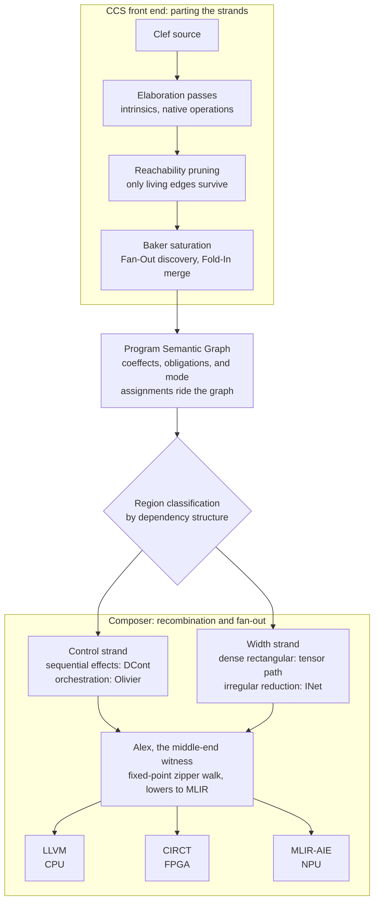
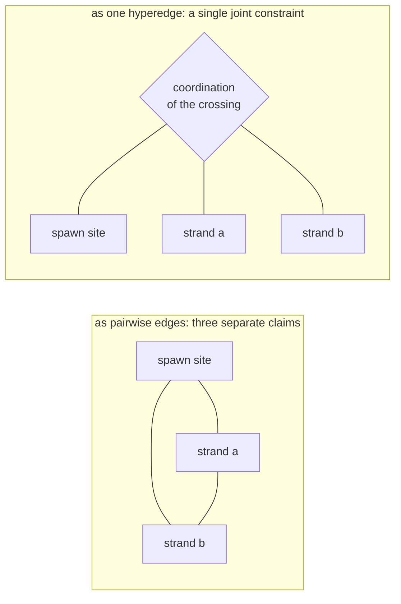
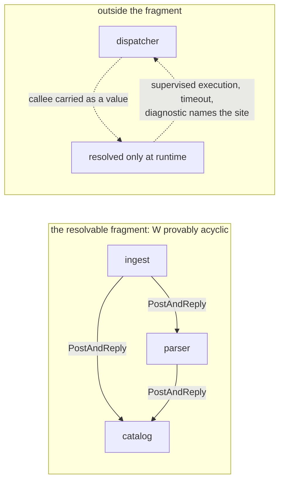

The field has a shelf of terms for the portion of computation that 'comes apart' cleanly. 

- map
- SIMD/SIMT
- confluent
- data-parallel
- referentially transparent
- Embarrassingly parallel

Each names a mechanic whose elements do not depend on others, so an application can run them separately with no coordination. The question that figurative 'shelf' leaves open is a matter of *assembly*. 

> Now consider terms that cover the *adjacent* case...

...a program that spawns work from inside a sequential process, waits for the results, and uses them to decide what happens next. That has a 'shelf' of its own:

- loops
- forks
- joins
- futures
- promises
- async/await
- continuations

Each of these names the control act or its bookkeeping: the repetition, the spawn and its join, the pending handle, the suspension and its resumption. However, a cohesive term for the full construction, the interleave of control and width carried as one object with its crossings intact, is the slot that is nearly bare. Pull the parallel portion out of a program like that and what remains is a different program.

The nearest name on record for the conjunction is [braided parallelism](https://ieeexplore.ieee.org/document/6272260/), coined in the GPGPU era for a single-source model that interleaves task and data parallelism, with the game engine as the standing example. We are going to take the word and run with it, as they say, with one property doing the work: a braid comes apart if a strand is cut. The structure is *the crossing*. The parallel part cannot be lifted out, run as embarrassingly parallel, and stapled back on afterward, because the places where the strands cross are where the work resides. 

Real programs are braided in exactly this sense. They spawn parallel work out of sequential control, and the act of spawning is a control act with a return point, a place the computation comes back to and threads the result through what comes next. That return point is ***the crossing***. A substrate that gives it no first-class place cannot hold the braid, however well it holds the strand. And that capacity varies across processor types: not every processor can take every form of braided parallelism, and even the GPU, the hardware the word was coined for, is surprisingly narrow relative to the variety of cases that garden-variety code expresses as a matter of course. Spanning CPU and other accelerators with a coherent language surface is part of the reason we're building the Fidelity Framework.

## A workload that will not unweave

Our position would benefit from a solid example before we carry forward the argument. Dependency resolution is one of the plainest:

```fsharp
// the frontier for round n+1 does not exist until
// round n's parallel width has come back through the fold
let resolve (root: PackageId) = async {
    let mutable resolved = Map.empty
    let mutable frontier = [ root ]
    while not (List.isEmpty frontier) do
        let! manifests = Registry.fetchAll frontier    // control: one round of I/O
        let solved = query {
            // width: every manifest independent
            for m in manifests do
            select (m.Id, Solver.constraintsOf m)
        }
        resolved <- Map.merge solved resolved
        frontier <- nextFrontier resolved solved       // the crossing: width decides control
    return resolved
}
```

Inside a round, the parsing and constraint-solving of each manifest is a clean *strand*: no manifest depends on another, and the width is real. Between rounds, the program is control: the fetch is an effect, and the frontier assignment decides whether the loop runs again and *over **what***. The crossing is the line where `frontier` is rebuilt from the width's results. In compiler parlance, the width cannot be 'hoisted' ahead of the control, because the set of manifests to parse is an output of the loop it would be hoisted *out of*. And the additional wrinkle: the control cannot run ahead of the width, because the frontier is computed from results that do not exist yet. Serializing everything preserves the crossings and gives up the machine; the parallel reading exists round by round, and only there. That round-by-round gap between a program's ideal parallel reading and what a serialized lowering keeps is exactly the figure our [flow loss analysis](/docs/design/structure-and-performance/flow-loss-analysis/) is built to reveal.

Keep that snippet above in mind: every substrate we compare, including our own, gets measured against this example. The code is deliberately ordinary: the same shape reads as everyday F#, with shades of Python, TypeScript and others reflected in it. And every one of those toolchains already has some method for dealing with this, at different levels of complexity and computational cost. 

On .NET, the `async` block runs its awaits on the thread pool and the query stays sequential; parallelism is a library the developer reaches for, `Async.Parallel` or PLINQ, and once invoked, placement belongs to the runtime scheduler, with no analysis of what the parallel lambdas share. Python's `asyncio` overlaps the fetches while the interpreter's global lock keeps the per-manifest solving on one core; escaping to processes buys real width and pays for it in serialization at every boundary. TypeScript overlaps the fetches on its event loop and runs every solve on that same single thread, with worker threads a separate API and message-passing at its edge. Three ecosystems, one common answer: the width is opt-in, the placement belongs to the runtime or the developer. Nothing checks what the parallel version shares or whether the interleave can stall, and the arrangement is written against one processor class. Moving the same program to a GPU or an NPU is a rewrite, often with a different API surface or separate language altogether.

Our answer starts from the same ordinary code, with nothing marked by hand. The reliance is on a more principled, more intelligent compiler. CCS and Baker would classify the regions off the dependency structure of the graph; the width would lower to lanes chosen for the processor actually being targeted through Fidelity.Platform capability predicates; and the crossings would ride the graph as checked structure: escape-classified for memory, and rank-checked for liveness wherever synchronous actor calls enter. The material difference is where the work is characterized: the program's shape, control, width, and crossings alike, would be the compiler's object, and the developer's part "stops" (more or less) with writing the source code. Our position across the Fidelity framework has been for the compilation discipline to match the shape by design, and make it a province of the lowering pipeline and maintain safety, efficiency and correctness.

## Standing Art in Other Ecosystems

Several frameworks surveyed here have built their foundations on the 'clean strand', which is significant work. The pattern is consistent: a narrow but potent idea's elegance gets read as evidence of general breadth. In many cases, the demonstration chosen to show off the new capability is of the happy path variety, and the limitations start to show when the real world cases start to line up.

Interaction nets are the sharpest instance, and are part of our own lowering design. The focused implementations, HVM and its successor [HVM2](https://github.com/HigherOrderCO/HVM), are committed parallel interaction-net runtimes, including on GPU. In some cases the model is right for irregular, sharing-heavy reduction. Its limited reach is also a signal. One cannot make everything in computation into a *net* in the interaction net sense, because real-world programs spawn parallel work out of **sequential** control, and that *spawn* is a delimited-continuation act for which the interaction net has no first-class place. The net carries no continuation capture, no sequencing, and no central scheduler; the same austerity that makes it fast on the independent strand *leaves the crossing **beyond** its reach*. When taken alone, its heroic trait is *also* its undoing.

Another example is Verse, whose core calculus is rewrite-first at the foundation, similar to interaction nets but aimed at a different world: a shared, persistent, massively concurrent simulation, programmed by a very large population of developers, and the ambition is real. The liability is sharper than the nets' because it sits inside the correctness story. The property the calculus depends on, confluence, is *again* in tension with the control that real programs require; the nets left control outside the model, where Verse's guarantees rest on an order-independence that control-ordering works directly against. So retrofitting control onto it is harder than it was even for interaction nets.

The hardware version of the same tell comes from the reconfigurable-dataflow world. A CGRA, a coarse-grained reconfigurable array, is a fabric of compute tiles onto which a dataflow graph is spatially mapped, and the pitch is genuinely attractive: let the program's dataflow become the machine's layout, and the instruction stream falls away. The demonstration that fronts this class of hardware is GUPS, giga-updates per second, a benchmark that scatters read-modify-write updates across a huge table at random indices. As a stress of memory-level parallelism it is honest work. As a showcase it is chosen because every update is independent of every other, no result ever steers control, and the benchmark's rules tolerate a small fraction of lost updates, so even atomicity is negotiable. That is *"the strand"* in its purest form, all width and no crossing, the workload with the "hard part" conspicuously absent. It begs the question: when a fabric that headlines with GUPS has demonstrated bandwidth, what happens when a certain round's results require the next round's work? Therein lies the rub.

Across all three of these examples the true signal is the same: the idea is genuinely good, and the use case/demo is selected to minimize the generality gap. And we're grateful for the work they've each produced. Each of these cases was useful study as our designs took shape.

The fourth case, Modular's MAX, belongs in a different slot: it makes no attempt to claim the role of universal substrate. MAX is a graph-compiled inference engine that targets CUDA, ROCm, and Apple Metal from one [Mojo](/blog/musing-on-mojo/) kernel codebase; it is MLIR-native and the product of significant engineering effort. By its competitors' own accounts it pulls ahead on dense models at high concurrency. Its programming model is explicitly the grid, thread blocks mapped onto one-, two-, or three-dimensional blocks grouped into a grid, and that model is the right answer for dense, feed-forward tensor inference, where the computation shape is fixed before the first request and every lane does the same work. MAX is a first-class example in the grid-scoped category. Its scope boundary is legible in its own roadmap, and yet the gaps still surface under a closer look. Mixture-of-experts architectures are an acknowledged gap, and MoE is exactly where inference stops being a clean *dense* grid and acquires **routing**: data-dependent dispatch to experts, a conditional decision about which sub-networks fire on this input. That routing is control arriving inside the inference workload. The braid shows up at the honest edge of a selected scope. This is the [Uncomfortable Truth](https://speakez.tech/blog/uncomfortable-truth/) detailed in the SpeakEZ Technologies blog.

Two things keep this fair, and both are the same discipline applied to our own framework. MAX, Mojo, and our Composer compiler each use MLIR (Multi-Level Intermediate Representation) to varying degrees, and MAX reached that infrastructure first and at depth. Shared infrastructure carries only what the source language exposes to it, though, a point our [musings on Mojo](/blog/musing-on-mojo/) developed at length. Mojo's surface carries Python's imperative roots, from mutation-heavy idiom to the def/fn split, so the braid's raw material, which regions depend on which, what is pure enough to reorder, where a crossing begins and ends, has to be recovered from code whose semantics work against the analysis. Clef starts from an ML-family functional core where immutability and explicit data flow map directly onto MLIR's SSA form, and the same structure arrives at the infrastructure already legible. How much of the braid MLIR can carry for a toolchain is upstream of MLIR, in the language semantics and the front end of compilation. The boundary of MAX's chosen scope is exactly where inference begins to braid, and that boundary is already visible in its own gaps. When we approach that same territory it is through typed domain models whose membership is [settled by grade before a request arrives](/docs/design/constrained-machine-learning/the-constellation/), where a mixture of experts learns it as routing weights. The net effect shows a different answer to the same shape, and whether that routing can be made reliable is a question we take seriously. It's a primary motivator for our heavy reliance on a well-principled semantic graph, to make those determinations before we engage the scaffolding that carries them through lowering to hardware.

Across all four, the substrate's shape decides in advance which structures it can carry. None of these substrates lacks power in the Church-Turing sense. Each of them can express the resolver, because equipotence is settled and no substrate escapes or extends the class. What differs is where the program's structure lands: in a first-class construct of the model, or in an encoding the developer is forced to maintain or a runtime is hamstrung into supporting with makeshift mechanisms. This 'braid' construct described in this entry frames a distinct, common computational structure that has to land ***somewhere***. Our position is that a runtime that is missing memory safety, thread safety, and deadlock freedom is a hidden cost that only remains hidden until the failure modes emerge at runtime. That is its own form of ongoing engineering cost, operational burden and efficiency sink that we specifically seek to avoid with our architecture.

The taxonomy, consolidated:

| Substrate | Founding shape | Right for | Where the braid arrives |
|---|---|---|---|
| HVM / HVM2 | interaction nets: confluent, local rewriting | irregular reduction whose parallelism is real but not rectangular | the spawn's return point, which has no first-class place in the net |
| Verse core calculus | rewrite-first; correctness depends on confluence | its logical and functional core | control retrofits against the confluence its correctness depends on |
| CGRA dataflow demos (GUPS) | the dataflow graph spatially mapped onto a tile fabric | bandwidth-bound work with independent updates | the coordination the flagship demo removed |
| Modular MAX | the grid: blocks over a shape fixed before launch | dense feed-forward inference, correctly scoped | MoE routing: data-dependent dispatch inside the inference pass |

This is where a "runtime hat" is worn to think through the scenarios clearly. Run the resolver against the first and last rows. A grid needs its iteration space fixed before launch, and the resolver's round n+1 frontier does not exist until round n returns. So a grid executes it as one kernel launch per round with the loop living on the host, and the host loop is precisely the control the model excludes. The program's structure lands in the seam between launches, past the edge of what the grid carries. A net runs each round's width beautifully. The round boundary is a sequencing act: gather every result, merge against `resolved`, choose the next frontier. Encoding that into the net is scheduling by hand-built encoding, the bookkeeping HVM pays a runtime host to do dynamically. Both substrates hold the strand. The *crossing* lands **outside** of them.

Every term on those opening 'shelves' carries weight, in some cases a technology in service, and each is valuable inside its remit. So a fair reader can ask: with all of this standing art, does Clef have anything to bring to this area? As it turns out, bringing many of these elements together is the crux of what we do. The regions have to be found in ordinary code, each region has to be matched to what the processor at hand can actually take, and the crossings between them have to be carried as checked structure to the backend handoff. Each term names a part. Clef and Composer are being built to do the assembling, and in many cases that can lead to multi-processor solutions that are greater than the sum of their parts.

## Polarity

Now we switch to "the compiler hat". Control-first and net-first look interchangeable from a distance: pick either as the foundation, host the other on top. The hosting works in one direction only, and two type signatures show why. Our [DCont/INet duality](/docs/design/concurrency/dcont-inet-duality/) rides the monad/applicative axis, and the axis is a pair of shapes:

$$
\begin{aligned}
\mathrm{bind} &: M\,\alpha \to (\alpha \to M\,\beta) \to M\,\beta \\
\mathrm{pair} &: M\,\alpha \to M\,\beta \to M\,(\alpha \times \beta)
\end{aligned}
$$

In `bind`, the second computation is a function that receives the first computation's value. The crossing is written into the type: what runs next depends on what just arrived. In `pair`, both computations are already whole before either runs; nothing passes between them, so they compose in parallel. And the containment goes one way. `pair` is derivable from `bind`:

$$
\mathrm{pair}\ a\ b \;=\; \mathrm{bind}\ a\ \big(\lambda x.\ \mathrm{bind}\ b\ (\lambda y.\ \mathrm{return}\ (x, y))\big)
$$

Running the construction backward, from `pair` to `bind`, is where it stops: pair's arguments arrive as finished computations, closed to each other's values, and no composition of finished computations produces a dependency. Every monad determines an applicative, and the derivation runs one way.

Control-first can contain a net: a confluent monoidal reduction can be hosted underneath a control regime, handed the independent width, and left to reduce in any order, because the control regime waits at a defined point for the width to come back. Net-first cannot contain control: a control regime hosted underneath a confluent reduction breaks the confluence, because control-ordering is the thing confluence assumes away. That asymmetry ordered the duality; a mere partition would have left the two sides level. Delimited continuation is the foundation because it is the substrate that manages the crossing, the shift-and-resume that suspends a computation and threads the spawned result back through what follows. Interaction nets are the guest on the typed other side of that boundary, supplying reorderable width to be woven in, and running the net all at once is justified by a confluence theorem established once over the rule system, a property of the logic that no individual program has to carry.

The duality doc uses "braiding" for one of the monoidal laws, the commutativity \(a \otimes b \equiv b \otimes a\) that lets the compiler reorder two independent operations for locality. That categorical braiding describes *freedom **inside*** the independent strand: it says work can be rearranged, and it does not say the work can run at once. That is the opposite disposition from the braid in the title. The categorical operation marks a strand as separable. The braid of this post is the non-separable weave of the two strands *together*, the thing the compiler has to hold because it should not come apart. One law describes reordering inside a strand, and this post is about the crossings ***between*** strands.

## Nanopass Enters the Metaphor

*Literal* braiding of hair starts with separation, then a controlled crossing, then recombination. Part the strands, cross them in a chosen order, bring them back together. That is also a description of a nanopass compiler. Isolate one concern per pass, operate on it while the others are held apart, then recombine through lowering. So there are two braids here, and they are dual without being identical. In our Clef Compiler Services [Baker component](/docs/internals/pipeline/baker-saturation-engine/), we refer to **"fan out, fold in"** for passes that can run concurrently. There is the computation braid, the running program's woven interleave, which is non-separable and executes as a whole. And there is the compilation braid, the nanopass method, which separates and recombines in order to produce the artifact. These two rhyme: the compiler pieces the program out in order to produce a computation that is itself a braid, and the method fits the material because both are separation, then *re*combination.

The two are close enough to blur. "The compiler takes the braid apart" describes the method, and it is true. The compiler separates the strands to assign each one to the appropriate substrate, and the crossings ride through that separation intact, and the developer benefits from intelligent compiler design. 

## The Compilation Braid

Here is the compilation braid as mechanism: strands parted, crossings recorded, strands rejoined.



The outer bands of that figure are shipped mechanics; the strand assignment in the middle band is the design direction the [duality doc](/docs/design/concurrency/dcont-inet-duality/) sets out. Elaboration passes handle intrinsics and native operations first, the platform I/O and the extern bindings that map to a machine instruction. Then Baker, our saturation engine, runs after reachability analysis has pruned the graph to the living edges and expands the language constructs that have no single machine instruction, with closure placement and escape analysis computed alongside, saturating each site into the sub-graph of primitives that expresses its intent. Baker does this through a Fan-Out that discovers saturation sites in parallel and a Fold-In that merges the generated sub-graphs back into the [Program Semantic Graph](/docs/internals/pipeline/baker-saturation-engine/) serially, which is the separation-and-recombination shape appearing at the scale of a single pass.

The design folds the mode assignment into the same separation: which region is control-first, the sequential effects that lower through delimited continuations and the actor orchestration the [Olivier model](/docs/design/concurrency/the-three-layer-actor-contract/) supervises, and which region is stateless reorderable width, the dense rectangular work that lowers to the tensor path and the irregular reduction that lowers to interaction nets. The classifier is the region's dependency structure, read off the graph; the computation-expression keyword the developer writes is only a hint at it. In the resolver, that classification would part the `query` body from the loop that feeds it, with neither marked by hand.

Classification would also be where the shelf contributes in parts. Finding the regions that can go to SIMD lanes on a CPU or SIMT warps on a GPU will be an intrinsic part of our pass structure, and it is a layout question as much as a shape question. Our [cache-aware compilation](/docs/internals/hardware/cache-aware-compilation-cpu/) design rests on the position that layout awareness is semantic awareness: BAREWire's deterministic layouts make access patterns something the compiler calculates and maps directly, and the [GPU companion](/docs/internals/hardware/cache-aware-compilation-gpu/) applies the same discipline to coalescing and warp divergence. The context comes from [Fidelity.Platform](/docs/design/types/bcl-to-ntu/): each target is admitted with its capabilities as compile-time predicates, `has_avx2`, `has_neon`, and their kin, so CCS and Baker elaborate and saturate against the processor actually being targeted, and the hyperedges that record a crossing's coordination would carry that context forward so the witness to MLIR reaches into the correct processor substrate. Those listed terms enter this design as its vocabulary of parts.

The crossings are recorded on the graph. Dimensions, grades, coeffects, and reversibility ride the [Program Semantic Graph as hypergraph](/docs/internals/pipeline/hyping-hypergraphs/) with annotations on nodes. As the structure grows toward a hypergraph, some of those annotations would ride as hyperedges that bind several nodes at once, because some constraints are genuinely multi-way:



Co-location of several values on one hardware tile is a meaningful claim of this 'joint' kind. So is the *join* of several geometric elements. Along with that is the coordination structure of spawned work: the crossings of the braid are *exactly* the relationship the hyperedge form exists to hold. And held jointly, the coordination ***stays legible*** to the passes downstream. The proof obligations ride the same graph, discharged at design time and, in our planned pipeline, re-checked through lowering, so a verified property stays adjacent to the code it constrains, through to the back end that manages the final lowering to the targeted hardware.

The recombination happens in the middle end and the 'fold-in'. A fixed-point combinator, a Huet-style zipper, walks the saturated graph; the walk is passive, witnessing an order the graph construction already decided. Alex, our [middle-end component](/docs/internals/pipeline/learning-to-walk/), resolves the platform-specific elements and lowers to MLIR as it expresses target dialects. First the more broadly supported dialects are placed, and then transformed to a targeted back end: LLVM for CPU, CIRCT for FPGA, MLIR-AIE for the NPU, with further targets under design. Because each strand would arrive with its substrate assignment and its obligations attached, the recombination is designed to carry the crossings across every target instead of re-deriving them at each backend. The coherence of this is something we consider to be a particularly powerful advantage of the Fidelity Framework over point solutions. Where common practice today is to assume a significantly different programming surface for a given processor target, we aim to provide a coherent programming model that will support a variety of processors with one language and a unified approach to concurrency.

As a focal point for the inner workings of our compilation pipeline, the [Fixed-Point Scaffolding pre-print](https://arxiv.org/abs/2606.02854) grounds three of the claims stated here. In a proof theoretic sense, the fixed-point combinator is the operational form of Ohori's machine-code proof theory along the compilation axis, where each lowering pass is eligible to be a proof transformer, type-preserving by substitution, so a certified edge has nothing left to re-check and the composite preserves what it carries. Having a principled pipeline means a more efficient and stronger pipeline through the inner workings of the compiler. The obligations that ride the graph are checked per edge: the pipeline is one *functor* with a compositionality equation, a cellular-sheaf result reduces verifying the global property to checking the local structure-map equations on the graph's edges, and the SMT dialect discharges exactly those local obligations for the passes not yet certified as proof transformers. And our approach to a coeffect mechanism is the checkable difference between *carrying* structure and other systems being forced by their semantic loss to recapture it through lowering. The combinator and the escape-driven allocation are in the middle end today; the SMT-dialect obligation as an in-IR operation, the DCont and INet lowering passes, and the mode-shift objects as first-class are our current area of focus.

## Trust Boundary

Our claim on verification is about preservation of computational integrity to the backend. The invariants, the static ones and the concurrency ones alike, would be carried across every pass our Composer compiler owns, up to the handoff to an established vendor or industry backend. For the static properties the fence is clean: a dimensional fact or a grade would be settled at the native-AST level [before any MLIR lowering](/docs/internals/verification/proofs-to-silicon/), with the planned pipeline carrying it into the IR and re-checking it through lowering by per-edge translation validation in the SMT dialect, so each optimization would preserve MLIR semantics. 

For the concurrency properties the fence sits closer in. Take deadlock freedom, the focus here and the one easiest to overclaim. For the fragment of an actor system where every callee is a statically resolvable actor reference, the wait-for relation \(W\) is a finite directed graph, and [deadlock freedom reduces to acyclicity of that graph](/docs/design/concurrency/deadlock-freedom-as-an-obligation/). Acyclicity encodes as a rank constraint:

$$
\forall (u \to v) \in W.\;\; r(u) < r(v)
$$

The constraint is satisfiable exactly when the relation is acyclic; over a finite edge set it is QF_LIA, and the same solver path that checks interval and bound obligations would discharge it, with the satisfying assignment serving as the rank. The edge accounting is visible at the call site:

```fsharp
let! ack = catalog.PostAndReply(Commit batch)   // suspends the caller: adds a wait-for edge
parser.Tell(Discard batch)                      // posts and returns: adds no edge
 
```

Where the callee is genuinely dynamic, carried as a value or chosen by content-based routing, acyclicity over such routing is undecidable in general. By design, the compiler should neither forbid the site nor admit it silently: we aim for it to produce a diagnostic on which call dropped out of the resolvable fragment and why. The call would fall back to supervised execution with a timeout.



Clef aims to be deadlock-free the way it is `unsafe`-free: ***by construction***. Inside the resolvable fragment, acyclicity is proven and the proof is silent. Outside it, the current design attempts to contain what the proof cannot reach: the dynamic call runs supervised, a blocked wait is bounded by its timeout, and the diagnostic names the site for the developer to place the timer. The boundary the developer sees and steers separates proven from supervised, but is *always* checked in the object sense. This is an exception path we're keen to keep narrow so as to minimize the potential for it to become a recurring workflow interruption. Our position is that a supervised timeout is a failure-mode monitor in waiting, and a design that falls into it too easily has traded analysis for structural integrity. There's no metric on how often a genuinely dynamic callee arises, or how much of that population analyzers and development guidance could steer back into the provable fragment. Working that remainder down is part of weaving the braid too, and the proven side grows as the program graph carries more of the wait-for structure in its built-in scaffold.

There is a piece of this the static analysis leaves open, and our position is always to face it rather than whistle past it. The acyclicity proof rules out deadlock for the *resolvable* fragment, and rules it out identically on every target. Runtime progress needs one thing *more*: a scheduler that keeps advancing the actors that are ready to run. That assumption lives per target, in each target's trusted base:

| Target | Progress rests on |
|---|---|
| Native | Prospero, our supervisor on an elevated thread |
| Conclave | the durable-object platform's scheduler |
| .NET fallback | the managed runtime's scheduler |

Deadlock freedom is target-independent. This is an area of interest for us to either automate in the compiler or establish supportive analyzers to streamline the design-time experience. 

## The Unseen

Go back to what we're imagining for the resolver. The developer would write a `while` loop, an async bind, a `query` body, and two mutable locals. There would be no spawn annotation marking the width, no lifetime tick threading the manifests through the rounds, no wait-for bookkeeping on the fetch; `let mutable` is [ordinary syntax](/docs/design/language/managed-mutability/), and the classification of what escapes a round and what stays local to it is a fact the analysis would derive in Clef Compiler Services and Baker's elaboration and saturation. The braid is irreducible, and very little of the machinery above should shift its complexity onto the developer. The crossings would be the compiler's work by design: the developer would write garden-variety code, with Composer navigating the crossing without significant intervention at design-time.

This is the same inversion we have argued for [correctness](/blog/fearless-concurrency-gets-real/) and for [performance](/blog/counting-the-cost-of-coordination/) in concurrency. Where Rust's borrow checker resolves one function at a time and hands the lifetime question back to the developer at the boundary of its single-function view, our escape analysis lives in a program graph that spans functions and actors, resolved *inside* the lowering pipeline. So a value crossing a call boundary is the same value the analyzer was already tracking. Where a shared reference forces the developer to remember the alignment and confirm the isolation with a profiler, an arena that belongs to an actor makes cache isolation a consequence of the structure, and a structure-placement decision Composer is being built to make over a known memory layout. This is a *'natural'* positive consequence of centering the framework on a concurrent programming model. We believe that addressing this concern as a central component to the design model will lead to a better engineering experience, safer code and more performant, more reliable systems.

In our design, verified properties will be discharged at design time and carried on the graph. The [tiered verification posture](/docs/internals/verification/) pays off exactly here: the strongest properties are the ones the developer will **never** be forced to deal with directly, because they will be settled where the compiler internals carry the decision with efficiency and transparency.

## A Consistent Weave

Clef's concurrent programming model, with Composer being built around it, is designed to automate braided parallelism across processor types, within the capabilities each target provides. A braid survives compilation when the compiler's own operations embrace those constructs: ***part, cross, rejoin***. Our nanopass architecture is designed to part the strands and lower each one against the substrate it matches, and lowering is designed to recombine them with the crossings and the obligations still attached. The process will yield a cohesive design-time and build-time experience that will make putting workloads on a variety of processors more performant and more efficient.

Every term listed at the top of this post has earned its place in the pantheon, and every one of them is a working part in our design. And regardless of how a term emerges, the computational task is always about how the necessities surrounding control flow and data flow interact to solve real problems. We are building Clef and Composer to honor that core challenge in modern systems, and we will keep reporting on the work as the braid moves from design to demonstration.
